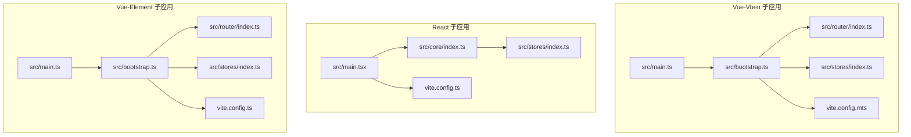
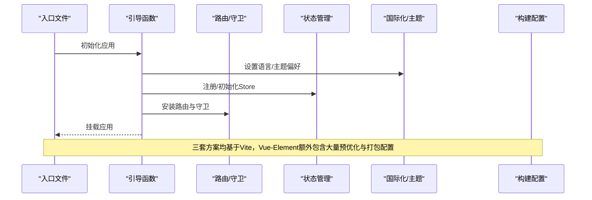
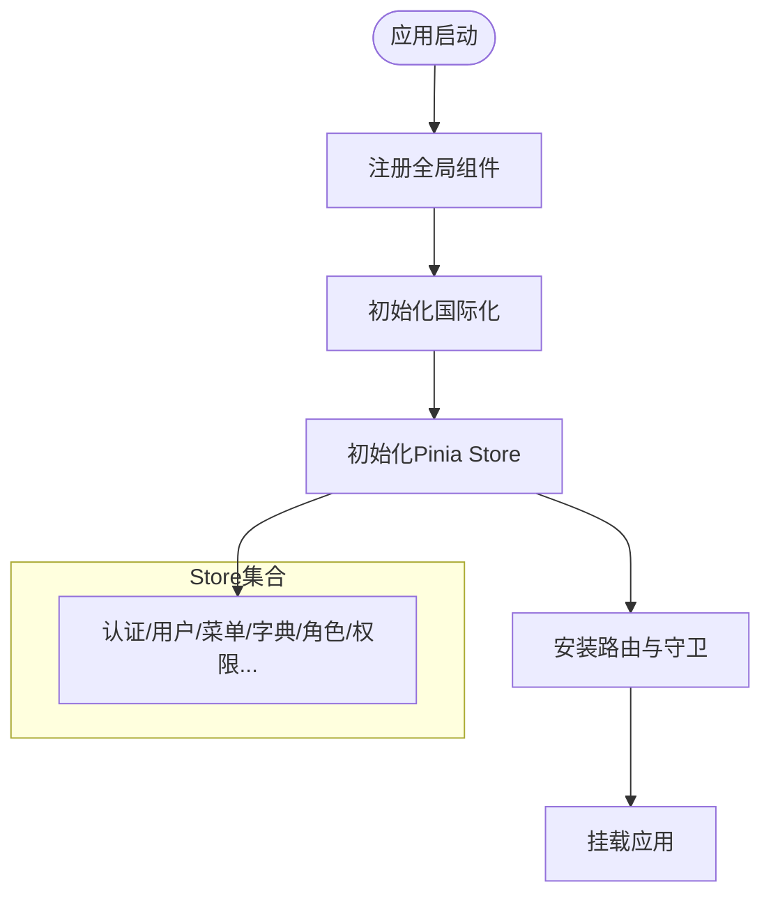
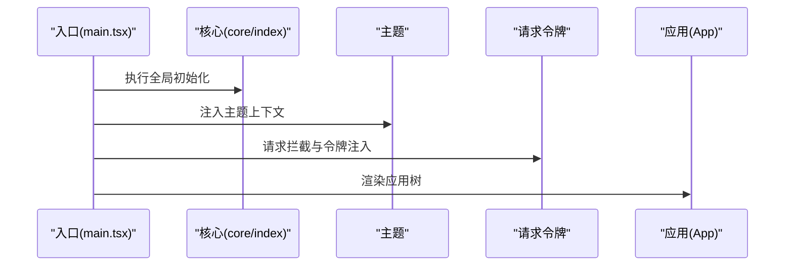
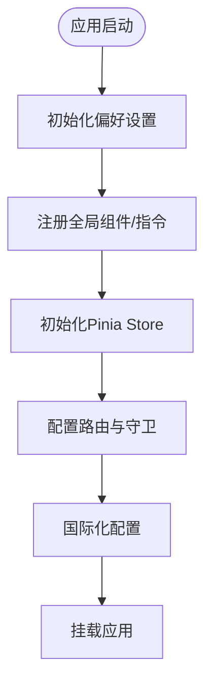
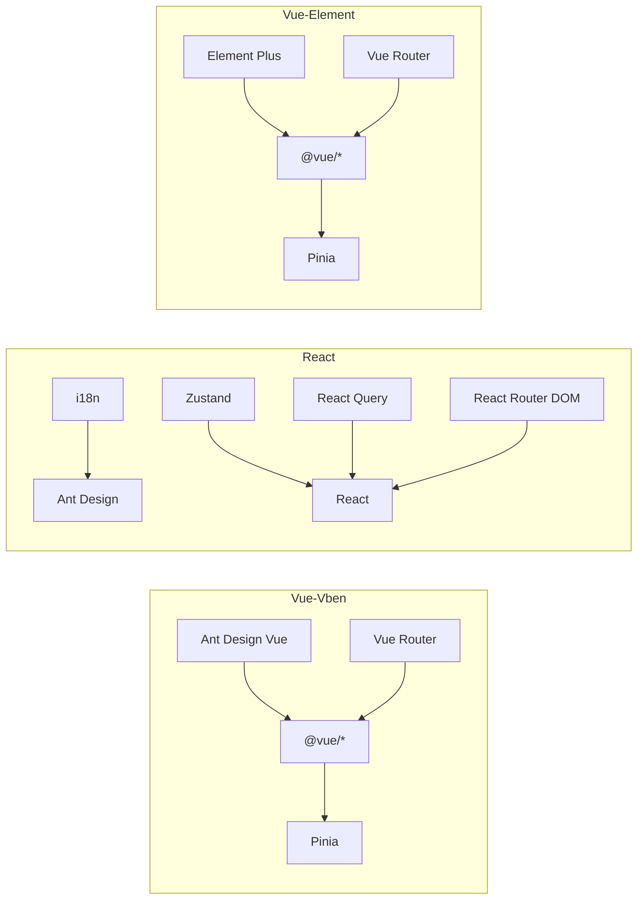

# 前端架构设计

<cite>
**本文引用的文件**
- [frontend/admin/vue-vben/apps/admin/package.json](file://frontend/admin/vue-vben/apps/admin/package.json)
- [frontend/admin/react/package.json](file://frontend/admin/react/package.json)
- [frontend/admin/vue-element/package.json](file://frontend/admin/vue-element/package.json)
- [frontend/admin/vue-vben/apps/admin/src/main.ts](file://frontend/admin/vue-vben/apps/admin/src/main.ts)
- [frontend/admin/react/src/main.tsx](file://frontend/admin/react/src/main.tsx)
- [frontend/admin/vue-element/src/main.ts](file://frontend/admin/vue-element/src/main.ts)
- [frontend/admin/vue-vben/apps/admin/src/bootstrap.ts](file://frontend/admin/vue-vben/apps/admin/src/bootstrap.ts)
- [frontend/admin/vue-element/src/bootstrap.ts](file://frontend/admin/vue-element/src/bootstrap.ts)
- [frontend/admin/vue-vben/apps/admin/src/router/index.ts](file://frontend/admin/vue-vben/apps/admin/src/router/index.ts)
- [frontend/admin/vue-element/src/router/index.ts](file://frontend/admin/vue-element/src/router/index.ts)
- [frontend/admin/vue-vben/apps/admin/src/stores/index.ts](file://frontend/admin/vue-vben/apps/admin/src/stores/index.ts)
- [frontend/admin/react/src/stores/index.ts](file://frontend/admin/react/src/stores/index.ts)
- [frontend/admin/vue-element/src/stores/index.ts](file://frontend/admin/vue-element/src/stores/index.ts)
- [frontend/admin/vue-vben/apps/admin/vite.config.mts](file://frontend/admin/vue-vben/apps/admin/vite.config.mts)
- [frontend/admin/react/vite.config.ts](file://frontend/admin/react/vite.config.ts)
- [frontend/admin/vue-element/vite.config.ts](file://frontend/admin/vue-element/vite.config.ts)
</cite>

## 目录
1. [引言](#引言)
2. [项目结构](#项目结构)
3. [核心组件](#核心组件)
4. [架构总览](#架构总览)
5. [详细组件分析](#详细组件分析)
6. [依赖分析](#依赖分析)
7. [性能考虑](#性能考虑)
8. [故障排查指南](#故障排查指南)
9. [结论](#结论)
10. [附录](#附录)

## 引言
本文件面向 GoWind Admin 的前端子系统，系统性梳理三种前端框架的架构选型与落地实践：Vue3 + Vben Admin、React + Ant Design、Vue Element Plus。重点阐述以下主题：
- 设计理念与适用场景：三套方案在工程化、组件生态、状态管理、路由与国际化方面的取舍与优势
- TypeScript 应用：类型安全、智能提示与重构支持在三套方案中的体现
- 组件化设计：可复用组件库、业务组件与页面组件的分层与职责边界
- 状态管理模式：Pinia/Vuex 与 Zustand/Redux 的策略差异与落地方式
- 路由设计：动态路由、权限路由与嵌套路由的实现要点
- 构建配置：Vite 与 Webpack 的优化策略、打包方案与开发体验
- 可视化：前端架构图、组件关系图与数据流图，帮助快速理解整体设计

## 项目结构
前端工程采用多包/多框架并行的组织方式，分别位于：
- Vue-Vben 子应用：基于 Vite + Vue3 + Ant Design Vue + Pinia 的企业级中后台脚手架
- React 子应用：基于 Vite + React19 + Ant Design Pro + Zustand + React Query 的现代化中后台方案
- Vue-Element 子应用：基于 Vite + Vue3 + Element Plus + Pinia 的通用后台模板

图表来源
- [frontend/admin/vue-vben/apps/admin/src/main.ts:1-25](file://frontend/admin/vue-vben/apps/admin/src/main.ts#L1-L25)
- [frontend/admin/vue-vben/apps/admin/src/bootstrap.ts:1-53](file://frontend/admin/vue-vben/apps/admin/src/bootstrap.ts#L1-L53)
- [frontend/admin/vue-vben/apps/admin/src/router/index.ts:1-38](file://frontend/admin/vue-vben/apps/admin/src/router/index.ts#L1-L38)
- [frontend/admin/vue-vben/apps/admin/src/stores/index.ts:1-136](file://frontend/admin/vue-vben/apps/admin/src/stores/index.ts#L1-L136)
- [frontend/admin/vue-vben/apps/admin/vite.config.mts:1-21](file://frontend/admin/vue-vben/apps/admin/vite.config.mts#L1-L21)
- [frontend/admin/react/src/main.tsx:1-46](file://frontend/admin/react/src/main.tsx#L1-L46)
- [frontend/admin/react/src/core/index.ts:1-8](file://frontend/admin/react/src/core/index.ts#L1-L8)
- [frontend/admin/react/src/stores/index.ts:1-5](file://frontend/admin/react/src/stores/index.ts#L1-L5)
- [frontend/admin/react/vite.config.ts:1-47](file://frontend/admin/react/vite.config.ts#L1-L47)
- [frontend/admin/vue-element/src/main.ts:1-25](file://frontend/admin/vue-element/src/main.ts#L1-L25)
- [frontend/admin/vue-element/src/bootstrap.ts:1-55](file://frontend/admin/vue-element/src/bootstrap.ts#L1-L55)
- [frontend/admin/vue-element/src/router/index.ts:1-38](file://frontend/admin/vue-element/src/router/index.ts#L1-L38)
- [frontend/admin/vue-element/src/stores/index.ts:1-5](file://frontend/admin/vue-element/src/stores/index.ts#L1-L5)
- [frontend/admin/vue-element/vite.config.ts:1-240](file://frontend/admin/vue-element/vite.config.ts#L1-L240)

章节来源
- [frontend/admin/vue-vben/apps/admin/src/main.ts:1-25](file://frontend/admin/vue-vben/apps/admin/src/main.ts#L1-L25)
- [frontend/admin/react/src/main.tsx:1-46](file://frontend/admin/react/src/main.tsx#L1-L46)
- [frontend/admin/vue-element/src/main.ts:1-25](file://frontend/admin/vue-element/src/main.ts#L1-L25)

## 核心组件
- 入口与引导
  - Vue-Vben：通过入口文件创建应用、注册全局组件、初始化国际化、安装 Pinia、注册路由与守卫，最后挂载
  - React：入口以严格模式包裹，注入主题、请求拦截、全局初始化后渲染应用，并按需引入开发工具
  - Vue-Element：入口异步初始化命名空间、调用引导函数完成组件、指令、Pinia、路由、国际化等装配后挂载
- 路由与守卫
  - 三套方案均采用 Vue Router 或等价机制，支持历史模式与 Hash 模式切换、滚动行为与守卫
- 状态管理
  - Vue-Vben：集中导出多个领域 Store，提供通用枚举与状态映射工具
  - React：导出认证、用户、页签等模块化 Store
  - Vue-Element：导出核心与 API 模块 Store
- 构建与开发
  - 三套方案均基于 Vite；Vue-Element 还包含大量预优化与打包配置示例

章节来源
- [frontend/admin/vue-vben/apps/admin/src/bootstrap.ts:1-53](file://frontend/admin/vue-vben/apps/admin/src/bootstrap.ts#L1-L53)
- [frontend/admin/vue-vben/apps/admin/src/router/index.ts:1-38](file://frontend/admin/vue-vben/apps/admin/src/router/index.ts#L1-L38)
- [frontend/admin/vue-vben/apps/admin/src/stores/index.ts:1-136](file://frontend/admin/vue-vben/apps/admin/src/stores/index.ts#L1-L136)
- [frontend/admin/react/src/main.tsx:1-46](file://frontend/admin/react/src/main.tsx#L1-L46)
- [frontend/admin/react/src/stores/index.ts:1-5](file://frontend/admin/react/src/stores/index.ts#L1-L5)
- [frontend/admin/vue-element/src/bootstrap.ts:1-55](file://frontend/admin/vue-element/src/bootstrap.ts#L1-L55)
- [frontend/admin/vue-element/src/router/index.ts:1-38](file://frontend/admin/vue-element/src/router/index.ts#L1-L38)
- [frontend/admin/vue-element/src/stores/index.ts:1-5](file://frontend/admin/vue-element/src/stores/index.ts#L1-L5)

## 架构总览
下图展示三套前端方案在“入口 → 引导 → 路由/守卫 → 状态 → 国际化/主题 → 构建”的通用流程差异与共性。

图表来源
- [frontend/admin/vue-vben/apps/admin/src/main.ts:1-25](file://frontend/admin/vue-vben/apps/admin/src/main.ts#L1-L25)
- [frontend/admin/vue-vben/apps/admin/src/bootstrap.ts:1-53](file://frontend/admin/vue-vben/apps/admin/src/bootstrap.ts#L1-L53)
- [frontend/admin/vue-vben/apps/admin/src/router/index.ts:1-38](file://frontend/admin/vue-vben/apps/admin/src/router/index.ts#L1-L38)
- [frontend/admin/vue-vben/apps/admin/src/stores/index.ts:1-136](file://frontend/admin/vue-vben/apps/admin/src/stores/index.ts#L1-L136)
- [frontend/admin/react/src/main.tsx:1-46](file://frontend/admin/react/src/main.tsx#L1-L46)
- [frontend/admin/vue-element/src/main.ts:1-25](file://frontend/admin/vue-element/src/main.ts#L1-L25)
- [frontend/admin/vue-element/src/bootstrap.ts:1-55](file://frontend/admin/vue-element/src/bootstrap.ts#L1-L55)

## 详细组件分析

### Vue3 + Vben Admin（Vue-Vben）
- 设计理念
  - 企业级中后台脚手架，强调“约定优于配置”，提供统一的组件适配器、权限指令、国际化与主题偏好
  - 使用 Pinia 进行状态管理，集中导出多领域 Store，便于按模块维护
- TypeScript 应用
  - 通过类型系统保障 API、路由元信息与状态字段的类型安全，提升重构与协作效率
- 组件化设计
  - 全局组件注册、组件适配器、权限指令等形成可复用基础设施层
  - 页面组件与业务组件分层清晰，Store 层负责跨页面的状态共享
- 路由设计
  - 支持 Hash 与 History 模式切换，内置滚动行为与守卫创建
- 状态管理
  - 多领域 Store 集中导出，提供通用枚举与状态映射工具，便于 UI 层统一消费
- 构建配置
  - 基于 Vite 配置代理与开发服务器，便于对接后端服务

图表来源
- [frontend/admin/vue-vben/apps/admin/src/bootstrap.ts:1-53](file://frontend/admin/vue-vben/apps/admin/src/bootstrap.ts#L1-L53)
- [frontend/admin/vue-vben/apps/admin/src/stores/index.ts:1-136](file://frontend/admin/vue-vben/apps/admin/src/stores/index.ts#L1-L136)
- [frontend/admin/vue-vben/apps/admin/src/router/index.ts:1-38](file://frontend/admin/vue-vben/apps/admin/src/router/index.ts#L1-L38)

章节来源
- [frontend/admin/vue-vben/apps/admin/src/bootstrap.ts:1-53](file://frontend/admin/vue-vben/apps/admin/src/bootstrap.ts#L1-L53)
- [frontend/admin/vue-vben/apps/admin/src/stores/index.ts:1-136](file://frontend/admin/vue-vben/apps/admin/src/stores/index.ts#L1-L136)
- [frontend/admin/vue-vben/apps/admin/src/router/index.ts:1-38](file://frontend/admin/vue-vben/apps/admin/src/router/index.ts#L1-L38)
- [frontend/admin/vue-vben/apps/admin/vite.config.mts:1-21](file://frontend/admin/vue-vben/apps/admin/vite.config.mts#L1-L21)

### React + Ant Design（React）
- 设计理念
  - 以 Ant Design Pro 为核心，结合 Zustand 实现轻量状态管理，配合 React Query 进行数据获取与缓存
  - 强调开发体验与生态成熟度，适合快速搭建中后台产品
- TypeScript 应用
  - 通过类型系统约束请求参数、响应结构与状态字段，增强可维护性与重构安全性
- 组件化设计
  - 业务组件与页面组件分离，Store 模块化导出，便于按功能域拆分
- 路由设计
  - 基于 React Router DOM，结合 ProComponents 提供的布局与表单能力
- 状态管理
  - Zustand 提供轻量、易组合的状态模型；React Query 负责服务端状态与缓存
- 构建配置
  - Vite 配置插件体系、代理与开发服务器，支持 Less、UnoCSS 等

图表来源
- [frontend/admin/react/src/main.tsx:1-46](file://frontend/admin/react/src/main.tsx#L1-L46)
- [frontend/admin/react/src/core/index.ts:1-8](file://frontend/admin/react/src/core/index.ts#L1-L8)

章节来源
- [frontend/admin/react/src/main.tsx:1-46](file://frontend/admin/react/src/main.tsx#L1-L46)
- [frontend/admin/react/src/stores/index.ts:1-5](file://frontend/admin/react/src/stores/index.ts#L1-L5)
- [frontend/admin/react/vite.config.ts:1-47](file://frontend/admin/react/vite.config.ts#L1-L47)

### Vue Element Plus（Vue-Element）
- 设计理念
  - 以 Element Plus 为基础，强调组件生态与表格、编辑器等丰富控件的组合
  - 通过 Pinia 管理状态，结合路由与国际化完善中后台能力
- TypeScript 应用
  - 类型系统贯穿 API、路由与状态，提升开发效率与稳定性
- 组件化设计
  - 全局组件注册、指令与国际化先行，随后装配路由与状态
- 路由设计
  - 支持 Hash/History 切换与滚动行为，提供守卫创建
- 状态管理
  - Store 模块化导出，覆盖核心与 API 两大域
- 构建配置
  - 包含大量预优化项（optimizeDeps）、插件（AutoImport/Components）与打包配置示例

图表来源
- [frontend/admin/vue-element/src/bootstrap.ts:1-55](file://frontend/admin/vue-element/src/bootstrap.ts#L1-L55)
- [frontend/admin/vue-element/src/router/index.ts:1-38](file://frontend/admin/vue-element/src/router/index.ts#L1-L38)
- [frontend/admin/vue-element/src/stores/index.ts:1-5](file://frontend/admin/vue-element/src/stores/index.ts#L1-L5)

章节来源
- [frontend/admin/vue-element/src/bootstrap.ts:1-55](file://frontend/admin/vue-element/src/bootstrap.ts#L1-L55)
- [frontend/admin/vue-element/src/router/index.ts:1-38](file://frontend/admin/vue-element/src/router/index.ts#L1-L38)
- [frontend/admin/vue-element/src/stores/index.ts:1-5](file://frontend/admin/vue-element/src/stores/index.ts#L1-L5)
- [frontend/admin/vue-element/vite.config.ts:1-240](file://frontend/admin/vue-element/vite.config.ts#L1-L240)

## 依赖分析
- 依赖来源与版本策略
  - Vue-Vben：依赖 @vben/* 工作区包、Ant Design Vue、Pinia、Vue3、Vue Router 等
  - React：依赖 Ant Design、ProComponents、Zustand、React Query、React Router DOM 等
  - Vue-Element：依赖 Element Plus、Pinia、Vue3、Vue Router、UnoCSS、AutoImport/Components 等
- 依赖耦合与内聚
  - 三套方案均保持“框架内核 + 生态插件”的高内聚低耦合结构
  - Vue-Vben 与 Vue-Element 通过工作区包实现内部模块化复用
  - React 方案更偏向外部生态包的直接集成

图表来源
- [frontend/admin/vue-vben/apps/admin/package.json:16-76](file://frontend/admin/vue-vben/apps/admin/package.json#L16-L76)
- [frontend/admin/react/package.json:13-38](file://frontend/admin/react/package.json#L13-L38)
- [frontend/admin/vue-element/package.json:47-115](file://frontend/admin/vue-element/package.json#L47-L115)

章节来源
- [frontend/admin/vue-vben/apps/admin/package.json:1-78](file://frontend/admin/vue-vben/apps/admin/package.json#L1-L78)
- [frontend/admin/react/package.json:1-82](file://frontend/admin/react/package.json#L1-L82)
- [frontend/admin/vue-element/package.json:1-173](file://frontend/admin/vue-element/package.json#L1-L173)

## 性能考虑
- 构建优化
  - Vue-Element：启用 Terser 压缩、移除 console/debugger、自定义打包命名规则、预优化依赖列表
  - React：插件化配置、Less 编译、代理与开发服务器优化
  - Vue-Vben：Vite 代理与开发服务器配置，便于联调
- 依赖预优化
  - Vue-Element 在 optimizeDeps 中显式列出常用依赖，缩短冷启动与热更新时间
- 开发体验
  - 三套方案均开启 HMR、代理与本地预览，降低调试成本

章节来源
- [frontend/admin/vue-element/vite.config.ts:192-234](file://frontend/admin/vue-element/vite.config.ts#L192-L234)
- [frontend/admin/vue-element/vite.config.ts:90-191](file://frontend/admin/vue-element/vite.config.ts#L90-L191)
- [frontend/admin/react/vite.config.ts:29-44](file://frontend/admin/react/vite.config.ts#L29-L44)
- [frontend/admin/vue-vben/apps/admin/vite.config.mts:6-18](file://frontend/admin/vue-vben/apps/admin/vite.config.mts#L6-L18)

## 故障排查指南
- 路由与守卫
  - 若页面无法正确跳转或刷新后丢失状态，检查路由实例创建与守卫注册是否在引导阶段完成
- 状态管理
  - Store 初始化顺序错误会导致组件读取不到状态，确保在引导阶段先初始化 Store 再挂载应用
- 国际化与主题
  - 主题切换或语言切换异常时，确认引导阶段已执行国际化与主题偏好设置
- 构建与代理
  - 开发代理未生效或跨域失败时，检查 Vite 代理配置与后端接口前缀

章节来源
- [frontend/admin/vue-vben/apps/admin/src/router/index.ts:1-38](file://frontend/admin/vue-vben/apps/admin/src/router/index.ts#L1-L38)
- [frontend/admin/vue-vben/apps/admin/src/bootstrap.ts:1-53](file://frontend/admin/vue-vben/apps/admin/src/bootstrap.ts#L1-L53)
- [frontend/admin/vue-element/src/router/index.ts:1-38](file://frontend/admin/vue-element/src/router/index.ts#L1-L38)
- [frontend/admin/vue-element/src/bootstrap.ts:1-55](file://frontend/admin/vue-element/src/bootstrap.ts#L1-L55)
- [frontend/admin/react/src/main.tsx:1-46](file://frontend/admin/react/src/main.tsx#L1-L46)
- [frontend/admin/vue-element/vite.config.ts:47-53](file://frontend/admin/vue-element/vite.config.ts#L47-L53)
- [frontend/admin/react/vite.config.ts:32-33](file://frontend/admin/react/vite.config.ts#L32-L33)

## 结论
- Vue-Vben 适合追求“企业级脚手架”与“统一生态”的团队，具备完善的组件适配器、权限与国际化能力
- React 方案适合需要快速迭代与成熟生态的场景，Zustand + React Query 的组合简洁高效
- Vue-Element 适合偏 Element Plus 生态的团队，组件与表格能力丰富，构建配置详尽
- 三套方案均采用 TypeScript，强化类型安全与开发体验；路由、状态与国际化在引导阶段完成装配，保证一致性与可维护性

## 附录
- 入口与引导流程对比
  - Vue-Vben：入口 → 引导（注册组件/国际化/Pinia/路由）→ 挂载
  - React：入口（严格模式+主题+请求拦截）→ 引导 → 渲染
  - Vue-Element：入口（异步初始化命名空间）→ 引导（偏好/组件/指令/Pinia/路由/国际化）→ 挂载

章节来源
- [frontend/admin/vue-vben/apps/admin/src/main.ts:1-25](file://frontend/admin/vue-vben/apps/admin/src/main.ts#L1-L25)
- [frontend/admin/vue-vben/apps/admin/src/bootstrap.ts:1-53](file://frontend/admin/vue-vben/apps/admin/src/bootstrap.ts#L1-L53)
- [frontend/admin/react/src/main.tsx:1-46](file://frontend/admin/react/src/main.tsx#L1-L46)
- [frontend/admin/vue-element/src/main.ts:1-25](file://frontend/admin/vue-element/src/main.ts#L1-L25)
- [frontend/admin/vue-element/src/bootstrap.ts:1-55](file://frontend/admin/vue-element/src/bootstrap.ts#L1-L55)