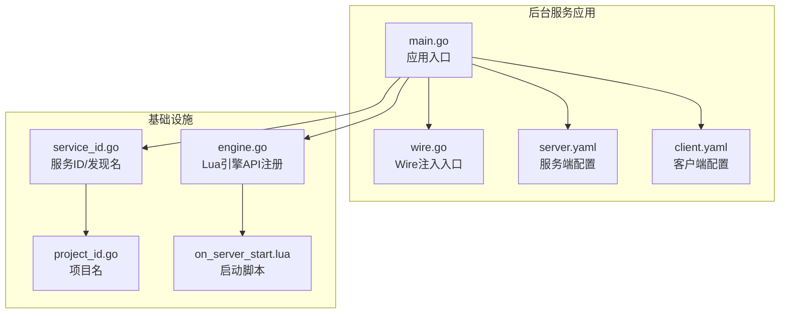
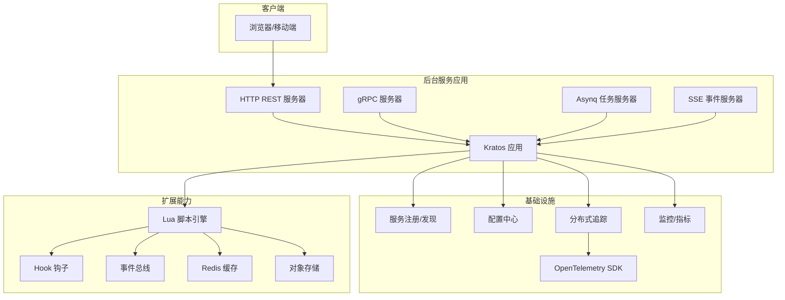
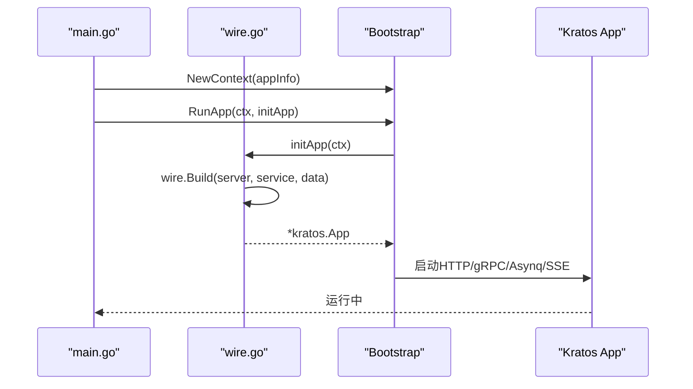
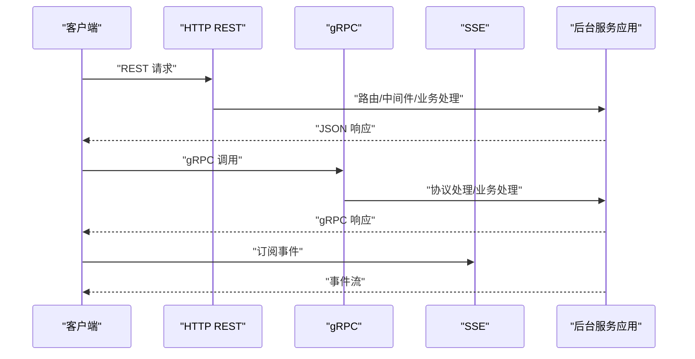
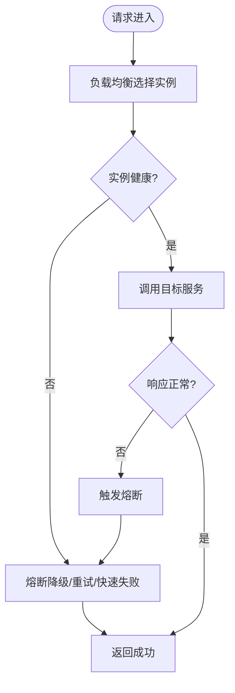
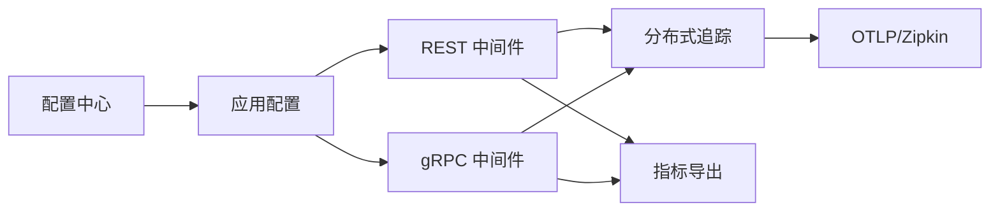
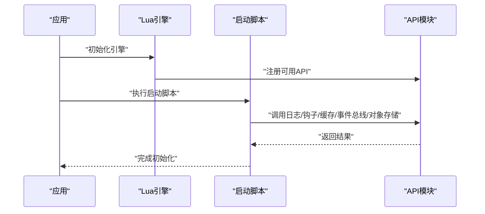
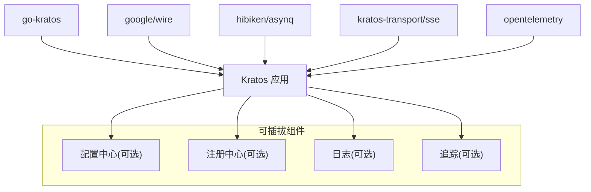

# 微服务架构设计

<cite>
**本文引用的文件**
- [main.go](file://backend/app/admin/service/cmd/server/main.go)
- [wire.go](file://backend/app/admin/service/cmd/server/wire.go)
- [server.yaml](file://backend/app/admin/service/configs/server.yaml)
- [client.yaml](file://backend/app/admin/service/configs/client.yaml)
- [service_id.go](file://backend/pkg/serviceid/service_id.go)
- [project_id.go](file://backend/pkg/serviceid/project_id.go)
- [engine.go](file://backend/pkg/lua/engine.go)
- [on_server_start.lua](file://backend/app/admin/service/scripts/on_server_start.lua)
- [go.mod](file://backend/go.mod)
</cite>

## 目录
1. [引言](#引言)
2. [项目结构](#项目结构)
3. [核心组件](#核心组件)
4. [架构总览](#架构总览)
5. [详细组件分析](#详细组件分析)
6. [依赖关系分析](#依赖关系分析)
7. [性能考虑](#性能考虑)
8. [故障排查指南](#故障排查指南)
9. [结论](#结论)
10. [附录](#附录)

## 引言
本设计文档面向 GoWind Admin 的微服务化改造，基于 go-kratos 框架与 Wire 依赖注入容器，提供服务边界划分、职责分离、服务间通信、服务治理、配置与监控集成的完整方案。文档以代码为依据，结合实际可执行的配置与启动流程，帮助技术与非技术读者快速理解系统架构与实施要点。

## 项目结构
后端采用多模块组织方式，核心入口位于后台服务应用，通过 Wire 将 server、service、data 层的 provider 集合注入到 Kratos 应用中；配置集中在 configs 目录，支持 REST、gRPC、异步队列（Asynq）、事件推送（SSE）等多种传输协议；服务标识与发现名称由 serviceid 包统一管理；Lua 脚本引擎提供可扩展的运行时能力。

**图表来源**
- [main.go:1-76](file://backend/app/admin/service/cmd/server/main.go#L1-L76)
- [wire.go:1-47](file://backend/app/admin/service/cmd/server/wire.go#L1-L47)
- [server.yaml:1-49](file://backend/app/admin/service/configs/server.yaml#L1-L49)
- [client.yaml:1-14](file://backend/app/admin/service/configs/client.yaml#L1-L14)
- [service_id.go:1-11](file://backend/pkg/serviceid/service_id.go#L1-L11)
- [project_id.go:1-5](file://backend/pkg/serviceid/project_id.go#L1-L5)
- [engine.go:196-225](file://backend/pkg/lua/engine.go#L196-L225)
- [on_server_start.lua:1-24](file://backend/app/admin/service/scripts/on_server_start.lua#L1-L24)

**章节来源**
- [main.go:1-76](file://backend/app/admin/service/cmd/server/main.go#L1-L76)
- [wire.go:1-47](file://backend/app/admin/service/cmd/server/wire.go#L1-L47)
- [server.yaml:1-49](file://backend/app/admin/service/configs/server.yaml#L1-L49)
- [client.yaml:1-14](file://backend/app/admin/service/configs/client.yaml#L1-L14)
- [service_id.go:1-11](file://backend/pkg/serviceid/service_id.go#L1-L11)
- [project_id.go:1-5](file://backend/pkg/serviceid/project_id.go#L1-L5)
- [engine.go:196-225](file://backend/pkg/lua/engine.go#L196-L225)
- [on_server_start.lua:1-24](file://backend/app/admin/service/scripts/on_server_start.lua#L1-L24)

## 核心组件
- 应用入口与引导：应用通过 Kratos Bootstrap 初始化，整合 HTTP、Asynq、SSE 多种传输层，并注入服务发现信息。
- Wire 依赖注入：通过 provider set 将 server、service、data 层解耦，集中于 wire.go 的注入入口，避免手工组装。
- 配置中心与服务治理：server.yaml 提供 REST、gRPC、Asynq、SSE 的开关与参数；client.yaml 提供 gRPC 客户端中间件配置；注释展示了可选的配置中心与注册中心集成点。
- 服务标识与发现：serviceid 统一管理服务 ID 与发现名称，便于跨环境一致的服务命名与注册。
- Lua 扩展引擎：在运行时加载脚本，注册日志、钩子、缓存、事件总线、对象存储、任务、工具等 API，支持启动脚本与业务逻辑扩展。

**章节来源**
- [main.go:46-76](file://backend/app/admin/service/cmd/server/main.go#L46-L76)
- [wire.go:27-46](file://backend/app/admin/service/cmd/server/wire.go#L27-L46)
- [server.yaml:1-49](file://backend/app/admin/service/configs/server.yaml#L1-L49)
- [client.yaml:1-14](file://backend/app/admin/service/configs/client.yaml#L1-L14)
- [service_id.go:3-10](file://backend/pkg/serviceid/service_id.go#L3-L10)
- [engine.go:196-225](file://backend/pkg/lua/engine.go#L196-L225)
- [on_server_start.lua:1-24](file://backend/app/admin/service/scripts/on_server_start.lua#L1-L24)

## 架构总览
下图展示后台服务应用的整体拓扑：HTTP REST 作为主要入口，gRPC 用于内部服务间调用，Asynq 支持异步任务，SSE 提供事件推送；配置中心与注册中心为可插拔组件；Lua 引擎贯穿启动与运行期扩展。

**图表来源**
- [main.go:6-12](file://backend/app/admin/service/cmd/server/main.go#L6-L12)
- [server.yaml:1-49](file://backend/app/admin/service/configs/server.yaml#L1-L49)
- [client.yaml:1-14](file://backend/app/admin/service/configs/client.yaml#L1-L14)
- [engine.go:196-225](file://backend/pkg/lua/engine.go#L196-L225)

## 详细组件分析

### Wire 依赖注入容器
- 注入入口：wire.go 中定义 initApp，聚合 server、service、data 的 provider set，并通过 newApp 构建 Kratos 应用。
- 生命周期：Bootstrap 在应用启动时初始化各传输层与中间件，关闭时执行清理回调。
- 可扩展性：通过 provider set 将具体实现与接口解耦，便于替换与测试。

**图表来源**
- [main.go:59-76](file://backend/app/admin/service/cmd/server/main.go#L59-L76)
- [wire.go:27-46](file://backend/app/admin/service/cmd/server/wire.go#L27-L46)

**章节来源**
- [wire.go:1-47](file://backend/app/admin/service/cmd/server/wire.go#L1-L47)
- [main.go:46-76](file://backend/app/admin/service/cmd/server/main.go#L46-L76)

### 服务边界与职责分离
- 服务边界：基于领域模型与资源类型划分，如认证、权限、身份、资源、存储、任务等服务，对应 protobuf 接口与服务目录。
- 职责分离：server 层负责传输协议与路由；service 层封装业务规则；data 层负责数据访问与持久化；公共包提供通用能力（加密、事件总线、JWT、Lua 引擎等）。
- 可观测性：REST/gRPC 中间件开启日志、恢复、追踪、校验、熔断、元数据等能力，满足可观测性需求。

**章节来源**
- [server.yaml:22-28](file://backend/app/admin/service/configs/server.yaml#L22-L28)
- [client.yaml:4-10](file://backend/app/admin/service/configs/client.yaml#L4-L10)

### 服务间通信机制
- gRPC：用于高吞吐、低延迟的内部服务调用，具备强类型接口与自动序列化优势。
- HTTP/JSON：对外暴露 REST API，便于前端直连与第三方集成。
- WebSocket：通过 SSE 提供事件推送能力，适用于实时通知场景。
- 协议选择标准：内部强一致、高性能场景优先 gRPC；外部开放、易集成场景优先 HTTP；实时事件推送场景使用 SSE。

**图表来源**
- [main.go:6-12](file://backend/app/admin/service/cmd/server/main.go#L6-L12)
- [server.yaml:1-49](file://backend/app/admin/service/configs/server.yaml#L1-L49)

**章节来源**
- [main.go:1-35](file://backend/app/admin/service/cmd/server/main.go#L1-L35)
- [server.yaml:1-49](file://backend/app/admin/service/configs/server.yaml#L1-L49)

### 服务发现与注册、负载均衡、熔断降级
- 服务发现与注册：通过 serviceid 统一服务名与发现名，结合可插拔注册中心实现服务注册与发现。
- 负载均衡：在客户端或网关层实现轮询/权重/健康检查等策略。
- 熔断降级：REST/gRPC 中间件启用熔断器，异常比例过高时快速失败并返回降级响应。
- 配置示例：server.yaml 中 enable_circuit_breaker 开启熔断；client.yaml 中配置 gRPC 超时与中间件。

**图表来源**
- [server.yaml:27](file://backend/app/admin/service/configs/server.yaml#L27)
- [client.yaml:9](file://backend/app/admin/service/configs/client.yaml#L9)

**章节来源**
- [server.yaml:27](file://backend/app/admin/service/configs/server.yaml#L27)
- [client.yaml:9](file://backend/app/admin/service/configs/client.yaml#L9)

### 配置中心、服务监控、分布式追踪
- 配置中心：server.yaml/client.yaml 提供运行时配置；注释展示了可选的 Apollo、Consul、Etcd、Kubernetes、Nacos、Polaris 等配置中心集成。
- 服务监控：REST/gRPC 中间件开启日志与恢复；可结合 Prometheus/OTEL 导出指标。
- 分布式追踪：REST/gRPC 中间件开启追踪；OTel SDK 可接入 Zipkin/OTLP 等后端。

**图表来源**
- [server.yaml:23-28](file://backend/app/admin/service/configs/server.yaml#L23-L28)
- [client.yaml:7](file://backend/app/admin/service/configs/client.yaml#L7)

**章节来源**
- [server.yaml:1-49](file://backend/app/admin/service/configs/server.yaml#L1-L49)
- [client.yaml:1-14](file://backend/app/admin/service/configs/client.yaml#L1-L14)

### Lua 脚本引擎与运行时扩展
- 引擎能力：按可用性动态注册日志、钩子、缓存、事件总线、对象存储、任务、工具等 API。
- 启动脚本：on_server_start.lua 在服务启动时执行，可读取上下文配置并进行初始化。
- 使用建议：将业务逻辑与运维脚本沉淀为可维护的 Lua 模块，配合钩子与事件总线实现解耦扩展。

**图表来源**
- [engine.go:196-225](file://backend/pkg/lua/engine.go#L196-L225)
- [on_server_start.lua:1-24](file://backend/app/admin/service/scripts/on_server_start.lua#L1-L24)

**章节来源**
- [engine.go:196-225](file://backend/pkg/lua/engine.go#L196-L225)
- [on_server_start.lua:1-24](file://backend/app/admin/service/scripts/on_server_start.lua#L1-L24)

## 依赖关系分析
- 框架与工具：go-kratos 提供应用框架与传输层；Wire 提供依赖注入；Asynq/SSE 为异步与事件能力；OpenTelemetry 提供追踪与指标。
- 可插拔生态：配置中心、注册中心、日志、追踪等均以插件形式引入，便于替换与扩展。
- 内聚与解耦：应用入口仅负责装配与运行，具体功能通过 provider set 注入，降低耦合度。

**图表来源**
- [go.mod:10-64](file://backend/go.mod#L10-L64)
- [main.go:14-35](file://backend/app/admin/service/cmd/server/main.go#L14-L35)

**章节来源**
- [go.mod:1-290](file://backend/go.mod#L1-L290)
- [main.go:1-76](file://backend/app/admin/service/cmd/server/main.go#L1-L76)

## 性能考虑
- 传输层优化：合理设置 REST/gRPC 超时与并发；Asynq 队列优先级与并发度需结合业务峰值调整。
- 中间件开销：日志、校验、追踪、熔断等中间件在高并发场景需评估 CPU 与 IO 影响。
- 缓存与存储：Redis 缓存命中率与过期策略、数据库连接池与慢查询监控。
- 资源隔离：不同业务队列（critical/default/low）隔离，避免相互影响。

## 故障排查指南
- 启动失败：检查 server.yaml 中端口占用、CORS/中间件配置是否正确；确认服务发现名称与注册中心连通性。
- gRPC 调用异常：核对 client.yaml 超时与中间件配置；查看服务端 gRPC 日志与追踪链路。
- Asynq 任务积压：检查队列优先级、并发度、任务处理耗时与重试策略。
- SSE 事件丢失：确认地址、路径与自动流配置；检查客户端连接状态与网络稳定性。
- Lua 脚本报错：定位 on_server_start.lua 与相关模块，逐步缩小范围并打印上下文信息。

**章节来源**
- [server.yaml:1-49](file://backend/app/admin/service/configs/server.yaml#L1-L49)
- [client.yaml:1-14](file://backend/app/admin/service/configs/client.yaml#L1-L14)
- [on_server_start.lua:1-24](file://backend/app/admin/service/scripts/on_server_start.lua#L1-L24)

## 结论
本方案以 go-kratos 为核心，结合 Wire 实现清晰的依赖注入与职责分离；通过多传输协议满足内外部通信需求；借助可插拔的配置中心、注册中心、监控与追踪体系实现完善的微服务治理；Lua 引擎提供运行时扩展能力。整体架构具备良好的可维护性、可扩展性与可观测性，适合在企业级后台管理系统中推广落地。

## 附录
- 服务标识：后台服务 ID 为 admin-service，发现名为 project/name。
- 项目名：gowind，用于统一命名空间与注册前缀。
- 可选集成：根据部署环境选择合适的配置中心与注册中心实现。

**章节来源**
- [service_id.go:3-10](file://backend/pkg/serviceid/service_id.go#L3-L10)
- [project_id.go:3-5](file://backend/pkg/serviceid/project_id.go#L3-L5)