# 数据流架构设计

<cite>
**本文档引用的文件**
- [main.go](file://backend/app/admin/service/cmd/server/main.go)
- [eventbus.go](file://backend/pkg/eventbus/eventbus.go)
- [manager.go](file://backend/pkg/eventbus/manager.go)
- [auth.go](file://backend/pkg/middleware/auth/auth.go)
- [logging.go](file://backend/pkg/middleware/logging/logging.go)
- [data.go](file://backend/app/admin/service/internal/data/data.go)
- [user_viewer.go](file://backend/pkg/entgo/viewer/user_viewer.go)
- [system_viewer.go](file://backend/pkg/entgo/viewer/system_viewer.go)
- [metadata.go](file://backend/pkg/metadata/metadata.go)
- [aes_gcm.go](file://backend/pkg/crypto/aes_gcm.go)
- [backup.go](file://backend/pkg/task/backup.go)
</cite>

## 目录
1. [引言](#引言)
2. [项目结构](#项目结构)
3. [核心组件](#核心组件)
4. [架构概览](#架构概览)
5. [详细组件分析](#详细组件分析)
6. [依赖关系分析](#依赖关系分析)
7. [性能考虑](#性能考虑)
8. [故障排除指南](#故障排除指南)
9. [结论](#结论)

## 引言

GoWind Admin 是一个基于 Kratos 微服务框架的企业级管理系统，采用现代化的软件架构设计。本文件专注于系统的数据流架构设计，详细描述从用户请求到数据持久化的完整数据流路径，包括请求进入、中间件处理、业务逻辑执行、数据访问和响应返回的各个环节。

该系统采用了多种先进的技术栈：Ent ORM 进行数据建模和查询、事件驱动架构支持异步处理、多层缓存策略（Redis 和本地缓存）、以及完整的认证授权中间件。通过深入分析这些组件的交互关系，开发者可以更好地理解数据在系统中的流转过程。

## 项目结构

GoWind Admin 采用模块化的项目结构，主要分为以下几个层次：

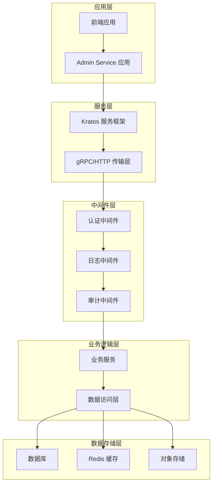

**图表来源**
- [main.go:1-76](file://backend/app/admin/service/cmd/server/main.go#L1-L76)

系统的核心架构特点：
- 基于 Kratos 框架的微服务架构
- 支持 gRPC 和 HTTP 双协议传输
- 多层中间件处理请求
- 完整的认证授权体系
- 事件驱动的异步处理机制

**章节来源**
- [main.go:1-76](file://backend/app/admin/service/cmd/server/main.go#L1-L76)

## 核心组件

### 请求处理管道

系统采用中间件模式处理所有传入请求，形成了清晰的请求处理管道：

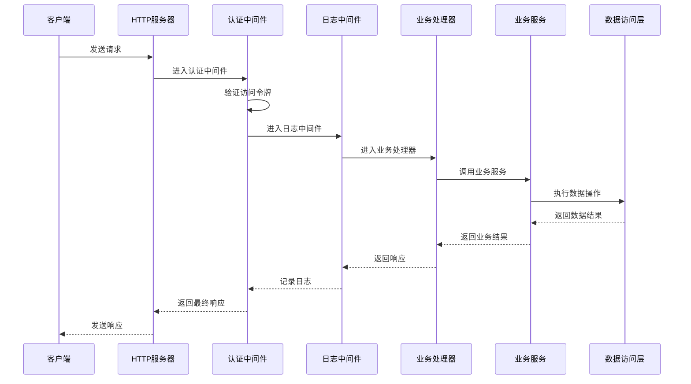

**图表来源**
- [auth.go:24-122](file://backend/pkg/middleware/auth/auth.go#L24-L122)
- [logging.go:15-52](file://backend/pkg/middleware/logging/logging.go#L15-L52)

### 数据访问层

数据访问层采用 Ent ORM 提供强大的数据建模能力：

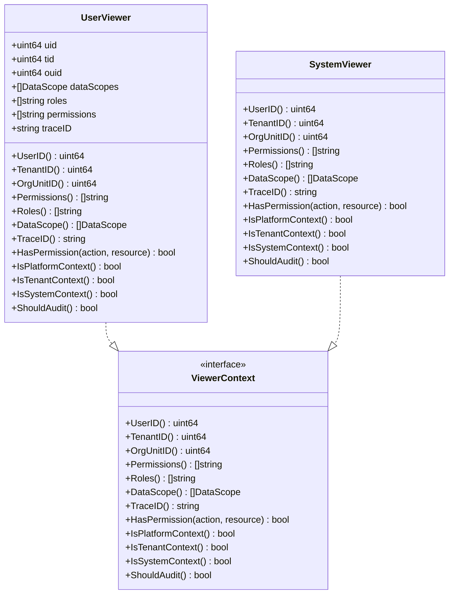

**图表来源**
- [user_viewer.go:9-117](file://backend/pkg/entgo/viewer/user_viewer.go#L9-L117)
- [system_viewer.go:9-79](file://backend/pkg/entgo/viewer/system_viewer.go#L9-L79)

**章节来源**
- [auth.go:24-122](file://backend/pkg/middleware/auth/auth.go#L24-L122)
- [user_viewer.go:9-117](file://backend/pkg/entgo/viewer/user_viewer.go#L9-L117)
- [system_viewer.go:9-79](file://backend/pkg/entgo/viewer/system_viewer.go#L9-L79)

## 架构概览

### 整体数据流架构

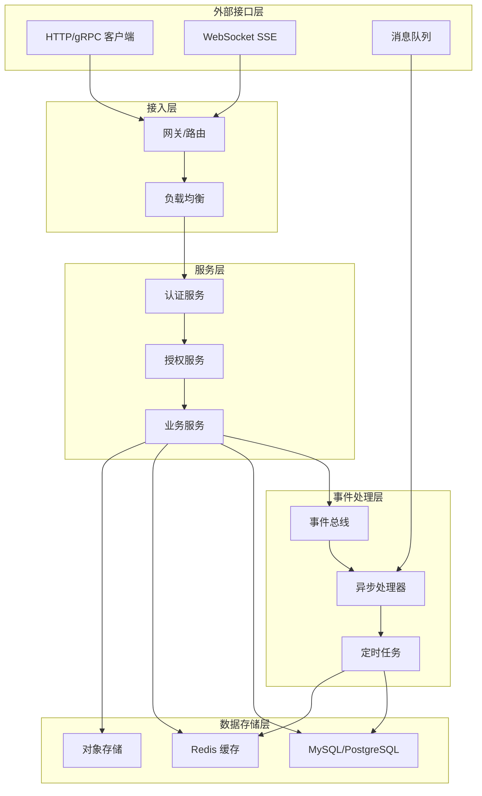

**图表来源**
- [main.go:46-57](file://backend/app/admin/service/cmd/server/main.go#L46-L57)
- [eventbus.go:12-34](file://backend/pkg/eventbus/eventbus.go#L12-L34)

### 事件驱动架构

系统实现了完整的事件驱动架构，支持同步和异步事件处理：

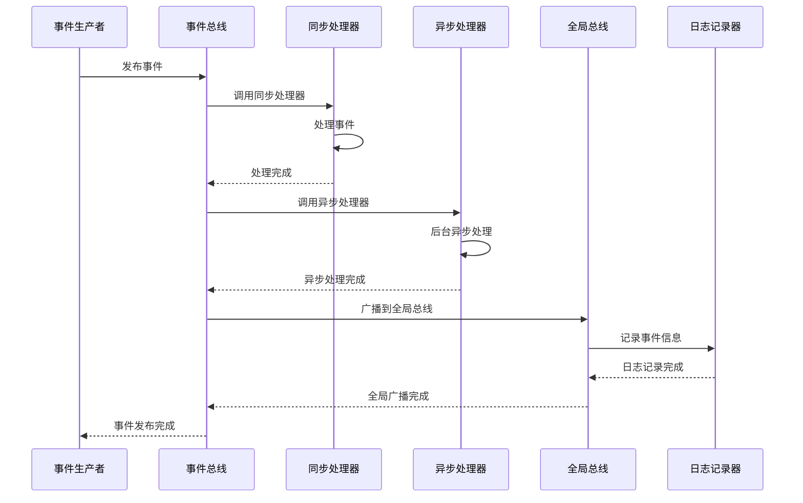

**图表来源**
- [eventbus.go:106-152](file://backend/pkg/eventbus/eventbus.go#L106-L152)
- [manager.go:50-69](file://backend/pkg/eventbus/manager.go#L50-L69)

**章节来源**
- [eventbus.go:12-214](file://backend/pkg/eventbus/eventbus.go#L12-L214)
- [manager.go:10-119](file://backend/pkg/eventbus/manager.go#L10-L119)

## 详细组件分析

### 认证中间件

认证中间件是整个数据流的第一道关卡，负责验证访问令牌并注入用户上下文信息：

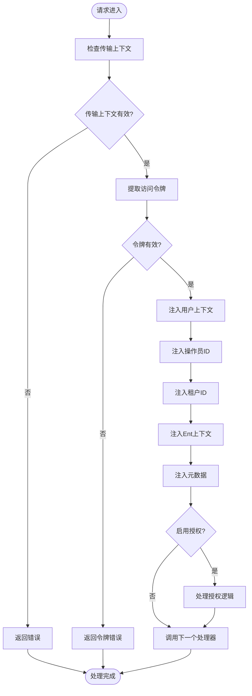

**图表来源**
- [auth.go:38-121](file://backend/pkg/middleware/auth/auth.go#L38-L121)

认证中间件的关键特性：
- 支持多种令牌验证方式
- 自动注入用户身份信息
- 可配置的授权检查
- 完善的错误处理机制

**章节来源**
- [auth.go:24-122](file://backend/pkg/middleware/auth/auth.go#L24-L122)

### 日志中间件

日志中间件提供统一的日志记录功能，包括登录审计和 API 审计：

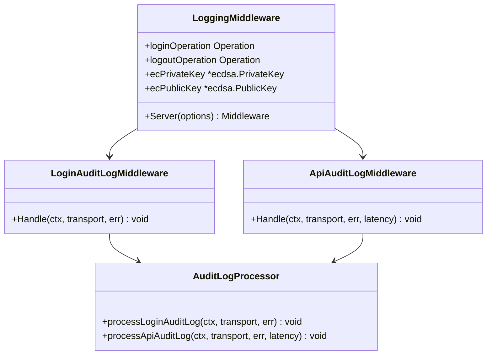

**图表来源**
- [logging.go:14-52](file://backend/pkg/middleware/logging/logging.go#L14-L52)

**章节来源**
- [logging.go:14-52](file://backend/pkg/middleware/logging/logging.go#L14-L52)

### 数据访问层

数据访问层提供了完整的数据操作能力，包括 Redis 缓存、密码加密和验证码生成：

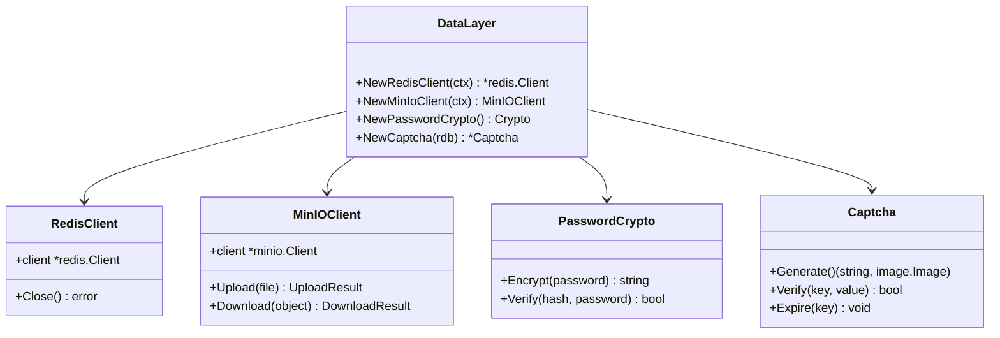

**图表来源**
- [data.go:23-62](file://backend/app/admin/service/internal/data/data.go#L23-L62)

**章节来源**
- [data.go:1-63](file://backend/app/admin/service/internal/data/data.go#L1-L63)

### 加密解密组件

系统实现了安全的加密解密机制，确保敏感数据的安全性：

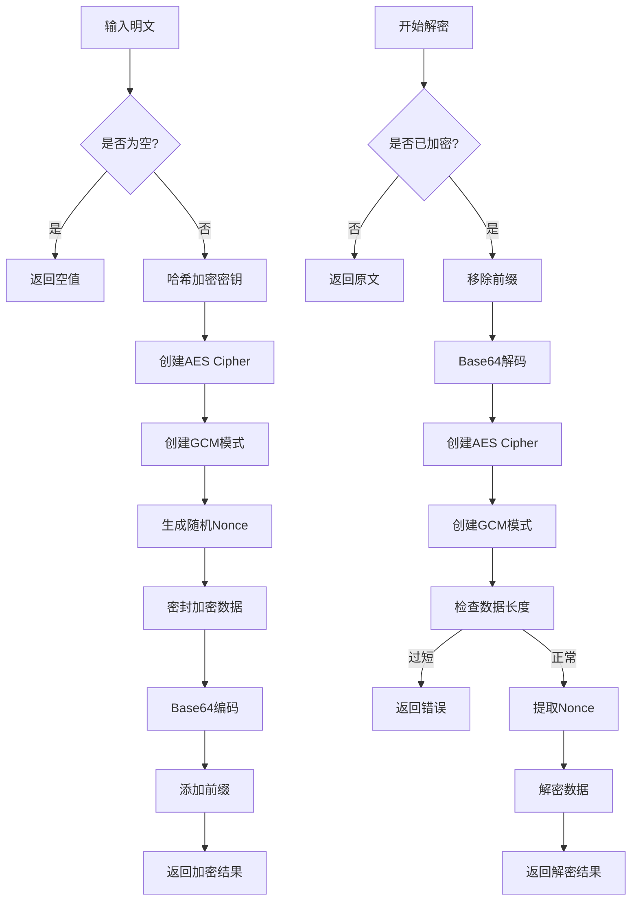

**图表来源**
- [aes_gcm.go:46-130](file://backend/pkg/crypto/aes_gcm.go#L46-L130)

**章节来源**
- [aes_gcm.go:1-154](file://backend/pkg/crypto/aes_gcm.go#L1-L154)

### 事件总线管理

事件总线管理系统提供了多实例管理和全局事件分发能力：

```mermaid
classDiagram
class EventBusManager {
+buses map[string]EventBus
+global EventBus
+logger *log.Helper
+GetBus(name) EventBus
+Global() EventBus
+Publish(ctx, busName, event) error
+PublishGlobal(ctx, event) error
+Subscribe(busName, eventType, handler) error
+SubscribeGlobal(eventType, handler) error
+Close() error
+GetStats() map[string]interface{}
}
class DefaultEventBus {
+handlers map[string][]Handler
+onceHandlers map[string][]Handler
+logger *log.Helper
+closed bool
+Subscribe(eventType, handler) error
+SubscribeAsync(eventType, handler) error
+SubscribeOnce(eventType, handler) error
+Unsubscribe(eventType, handler) error
+Publish(ctx, event) error
+PublishAsync(ctx, event) error
+Close() error
+GetSubscriberCount(eventType) int
+GetEventTypes() []string
}
class EventHandler {
+Handle(ctx, event) error
}
EventBusManager --> DefaultEventBus
DefaultEventBus --> EventHandler
```

**图表来源**
- [manager.go:10-119](file://backend/pkg/eventbus/manager.go#L10-L119)
- [eventbus.go:36-52](file://backend/pkg/eventbus/eventbus.go#L36-L52)

**章节来源**
- [manager.go:1-119](file://backend/pkg/eventbus/manager.go#L1-L119)
- [eventbus.go:1-214](file://backend/pkg/eventbus/eventbus.go#L1-L214)

## 依赖关系分析

### 组件依赖图

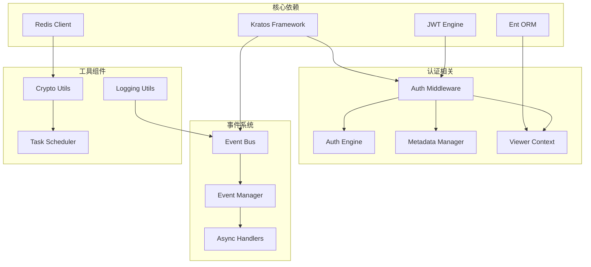

**图表来源**
- [main.go:3-40](file://backend/app/admin/service/cmd/server/main.go#L3-L40)
- [auth.go:3-19](file://backend/pkg/middleware/auth/auth.go#L3-L19)

### 数据流依赖链

系统中关键的数据流依赖关系如下：

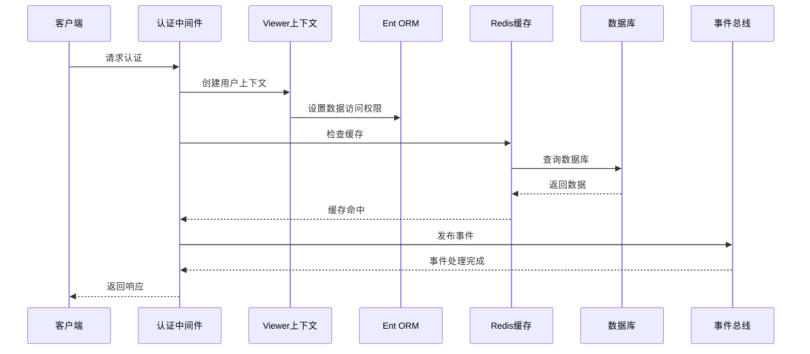

**图表来源**
- [auth.go:78-93](file://backend/pkg/middleware/auth/auth.go#L78-L93)
- [user_viewer.go:20-35](file://backend/pkg/entgo/viewer/user_viewer.go#L20-L35)

**章节来源**
- [main.go:3-40](file://backend/app/admin/service/cmd/server/main.go#L3-L40)
- [auth.go:3-19](file://backend/pkg/middleware/auth/auth.go#L3-L19)

## 性能考虑

### 缓存策略优化

系统采用了多层次的缓存策略来提升性能：

1. **Redis 缓存层**：用于热点数据的高速缓存
2. **本地缓存**：减少重复计算和网络请求
3. **智能失效策略**：基于数据变更的自动失效机制

### 异步处理优化

事件驱动架构提供了高效的异步处理能力：
- 异步事件处理器避免阻塞主请求流程
- 事件总线支持并发处理多个事件
- 后台任务调度器管理定时任务

### 数据访问优化

Ent ORM 提供了以下优化特性：
- 懒加载机制减少不必要的数据加载
- 批量操作提升批量数据处理效率
- 查询优化器自动优化复杂查询

## 故障排除指南

### 常见问题诊断

1. **认证失败问题**
   - 检查访问令牌的有效性和格式
   - 验证用户上下文注入是否正确
   - 确认授权规则配置

2. **缓存异常**
   - 检查 Redis 连接状态
   - 验证缓存键生成逻辑
   - 确认缓存失效策略

3. **事件处理失败**
   - 查看事件总线日志
   - 检查事件处理器注册情况
   - 验证异步处理超时设置

### 性能监控指标

建议监控以下关键指标：
- 请求响应时间分布
- 缓存命中率
- 数据库查询延迟
- 事件处理吞吐量
- 内存使用情况

**章节来源**
- [eventbus.go:154-167](file://backend/pkg/eventbus/eventbus.go#L154-L167)
- [logging.go:31-51](file://backend/pkg/middleware/logging/logging.go#L31-L51)

## 结论

GoWind Admin 的数据流架构设计体现了现代企业级应用的最佳实践。通过清晰的分层架构、完善的中间件体系、强大的事件驱动机制和多层缓存策略，系统能够高效地处理复杂的业务场景。

关键设计亮点：
- **模块化架构**：各组件职责明确，便于维护和扩展
- **事件驱动**：支持异步处理，提升系统响应性能
- **安全可靠**：完整的认证授权和数据加密机制
- **高性能**：多层缓存和优化的数据访问策略

该架构为后续的功能扩展和性能优化奠定了坚实的基础，能够满足企业级应用对可靠性、性能和可维护性的严格要求。