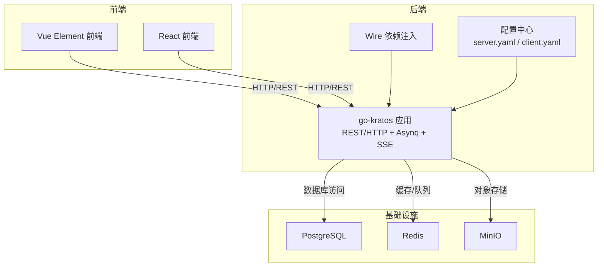
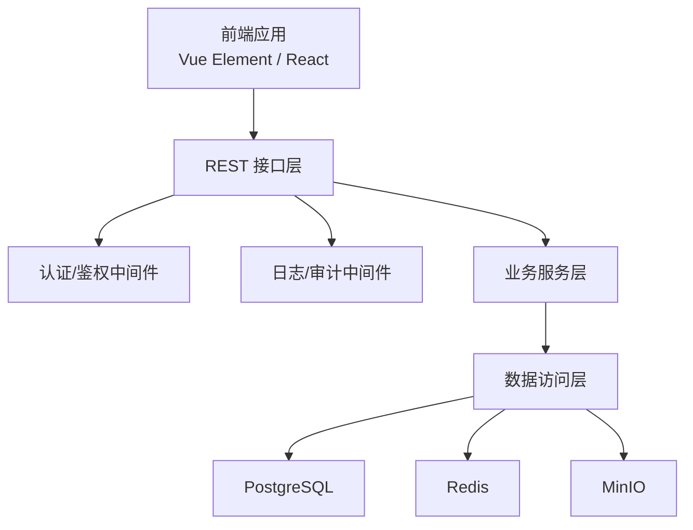
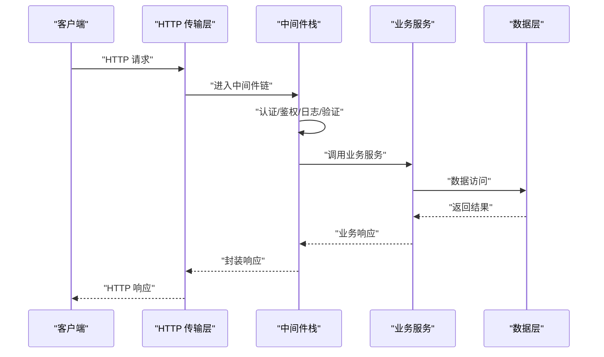
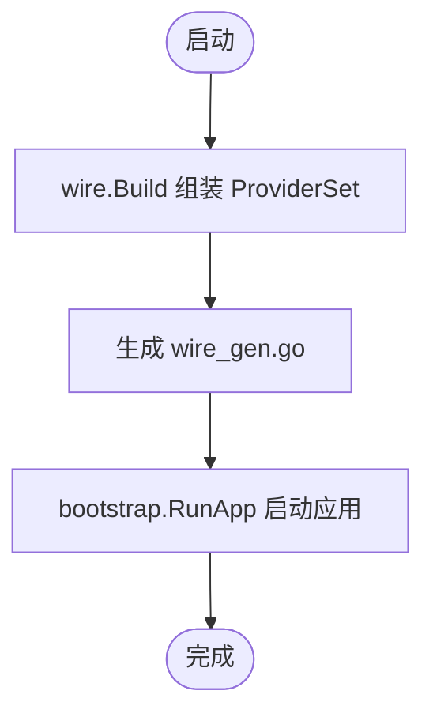
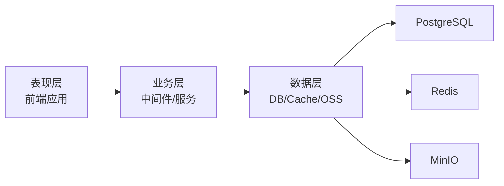
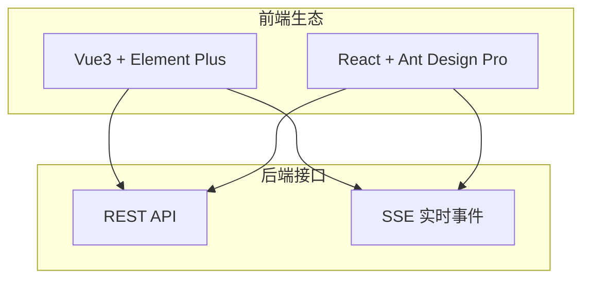
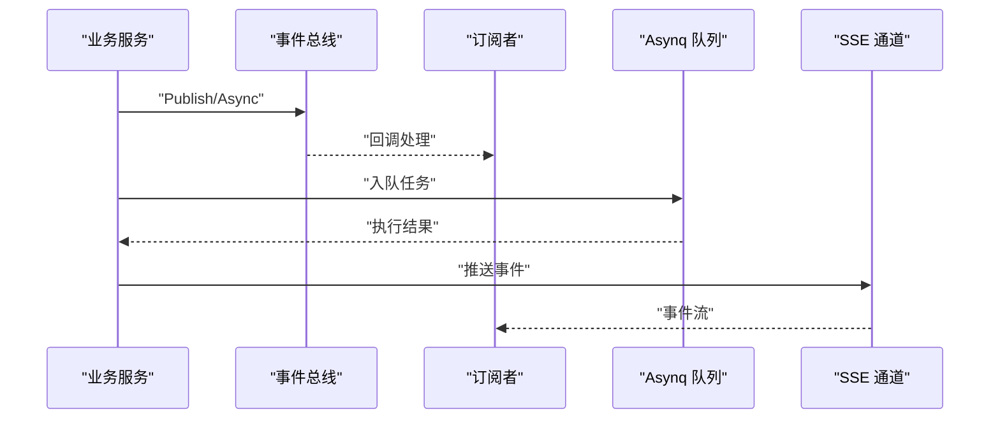
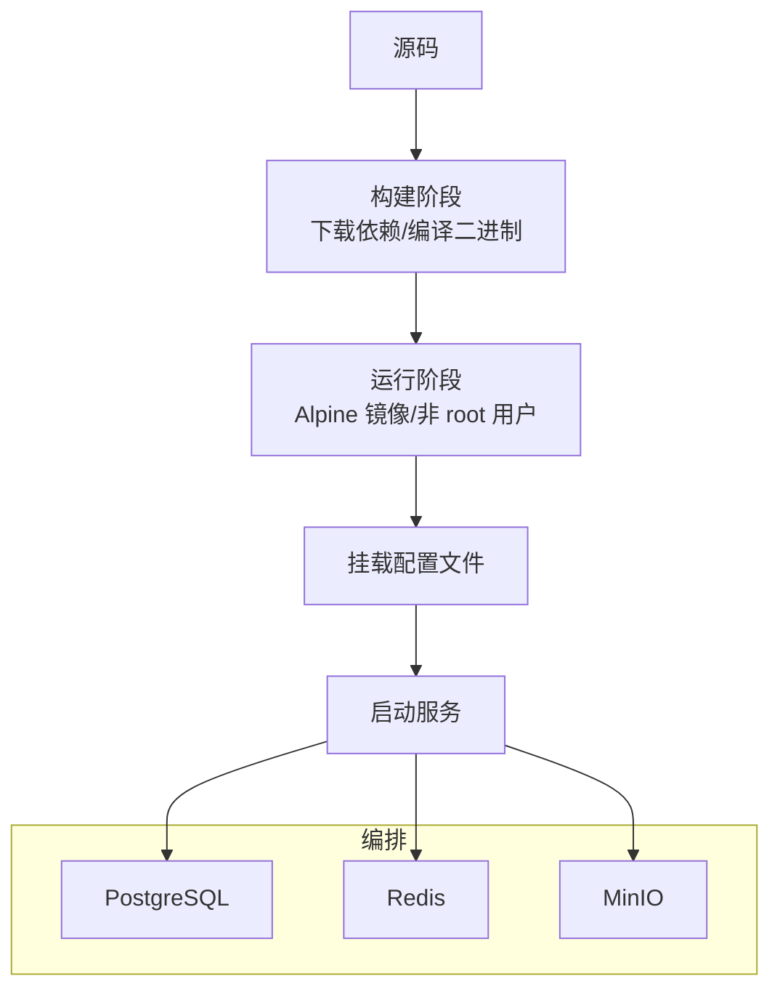
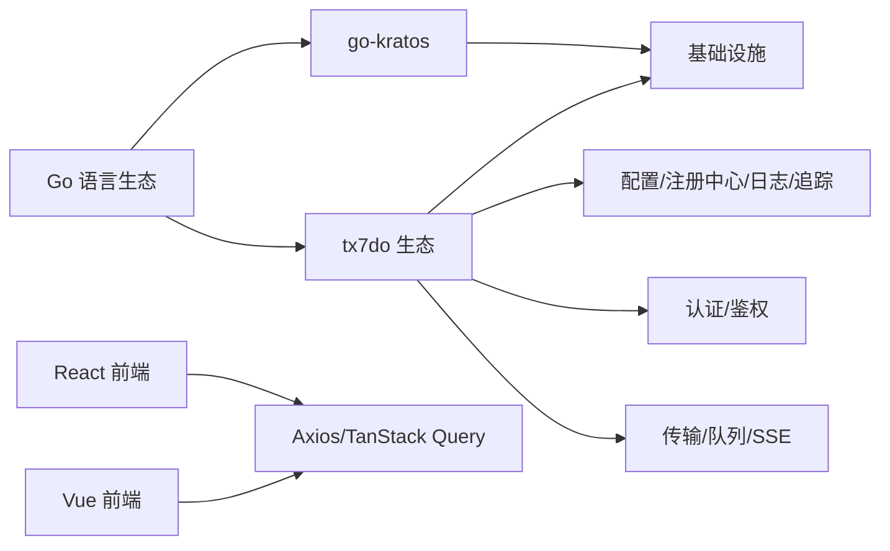

# 整体架构概览

<cite>
**本文引用的文件**
- [go.mod](file://backend/go.mod)
- [main.go](file://backend/app/admin/service/cmd/server/main.go)
- [wire.go](file://backend/app/admin/service/cmd/server/wire.go)
- [server.yaml](file://backend/app/admin/service/configs/server.yaml)
- [client.yaml](file://backend/app/admin/service/configs/client.yaml)
- [logging.go](file://backend/pkg/middleware/logging/logging.go)
- [auth.go](file://backend/pkg/middleware/auth/auth.go)
- [eventbus.go](file://backend/pkg/eventbus/eventbus.go)
- [Dockerfile](file://backend/Dockerfile)
- [docker-compose.yaml](file://backend/docker-compose.yaml)
- [package.json (React)](file://frontend/admin/react/package.json)
- [package.json (Vue Element)](file://frontend/admin/vue-element/package.json)
</cite>

## 目录
1. [简介](#简介)
2. [项目结构](#项目结构)
3. [核心组件](#核心组件)
4. [架构总览](#架构总览)
5. [详细组件分析](#详细组件分析)
6. [依赖关系分析](#依赖关系分析)
7. [性能考量](#性能考量)
8. [故障排查指南](#故障排查指南)
9. [结论](#结论)
10. [附录](#附录)

## 简介
本文件为 GoWind Admin 提供整体架构概览，重点阐述以下内容：
- 双架构设计：微服务架构与单体部署模式
- go-kratos 微服务框架在服务发现、负载均衡、熔断降级等方面的作用
- Wire 依赖注入容器如何简化服务间依赖关系管理
- 分层架构模式：表现层、业务层、数据层的职责划分
- 前后端分离设计理念，以及 Vue3 与 React 两种前端框架的差异化架构选择
- 系统架构图、组件关系图与数据流向图，帮助开发者快速理解系统整体设计

## 项目结构
GoWind Admin 采用前后端分离的多模块组织方式：
- 后端（Go）：基于 go-kratos 微服务框架，提供 REST/HTTP、Asynq 异步任务、SSE 实时事件等能力，并通过 Wire 进行依赖注入管理
- 前端（TypeScript/Vue3/React）：提供两套前端工程，分别对应 Vue Element Plus 与 React Ant Design Pro 生态
- 基础设施：PostgreSQL、Redis、MinIO 等通过 Docker Compose 编排，支持本地开发与单体部署

图表来源
- [main.go:1-76](file://backend/app/admin/service/cmd/server/main.go#L1-L76)
- [wire.go:1-47](file://backend/app/admin/service/cmd/server/wire.go#L1-L47)
- [server.yaml:1-49](file://backend/app/admin/service/configs/server.yaml#L1-L49)
- [docker-compose.yaml:1-125](file://backend/docker-compose.yaml#L1-L125)

章节来源
- [go.mod:1-290](file://backend/go.mod#L1-L290)
- [Dockerfile:1-66](file://backend/Dockerfile#L1-L66)
- [docker-compose.yaml:1-125](file://backend/docker-compose.yaml#L1-L125)

## 核心组件
- go-kratos 应用入口与引导：负责应用生命周期、传输层（HTTP/REST）、中间件装配与运行参数解析
- Wire 依赖注入：通过 ProviderSet 组合，集中管理服务、数据与传输层的依赖关系
- 中间件体系：认证授权、日志审计、熔断降级、元数据传递等
- 异步任务与实时事件：Asynq 队列与 SSE 事件通道
- 配置管理：server.yaml 与 client.yaml 提供运行期配置
- 基础设施编排：Docker Compose 将数据库、缓存、对象存储与后端服务组合为单体部署

章节来源
- [main.go:1-76](file://backend/app/admin/service/cmd/server/main.go#L1-L76)
- [wire.go:1-47](file://backend/app/admin/service/cmd/server/wire.go#L1-L47)
- [server.yaml:1-49](file://backend/app/admin/service/configs/server.yaml#L1-L49)
- [client.yaml:1-14](file://backend/app/admin/service/configs/client.yaml#L1-L14)
- [logging.go:1-52](file://backend/pkg/middleware/logging/logging.go#L1-L52)
- [auth.go:1-122](file://backend/pkg/middleware/auth/auth.go#L1-L122)
- [eventbus.go:1-214](file://backend/pkg/eventbus/eventbus.go#L1-L214)

## 架构总览
GoWind Admin 的整体架构由“前端 + 后端 + 基础设施”三层构成。后端采用 go-kratos 微服务框架，结合 Wire 依赖注入实现清晰的分层与解耦；前端通过 HTTP/REST 与后端交互，同时支持 SSE 实时事件订阅。

图表来源
- [main.go:46-76](file://backend/app/admin/service/cmd/server/main.go#L46-L76)
- [auth.go:23-122](file://backend/pkg/middleware/auth/auth.go#L23-L122)
- [logging.go:14-52](file://backend/pkg/middleware/logging/logging.go#L14-L52)
- [server.yaml:1-49](file://backend/app/admin/service/configs/server.yaml#L1-L49)

## 详细组件分析

### go-kratos 微服务框架与传输层
- 传输层：HTTP/REST 作为主要入口，支持 Swagger 文档与 pprof 调试
- 中间件：日志、恢复、追踪、验证、熔断、元数据等
- 传输扩展：Asynq 异步任务与 SSE 实时事件通道
- 运行参数：通过引导上下文与配置文件加载

图表来源
- [main.go:46-76](file://backend/app/admin/service/cmd/server/main.go#L46-L76)
- [auth.go:23-122](file://backend/pkg/middleware/auth/auth.go#L23-L122)
- [logging.go:14-52](file://backend/pkg/middleware/logging/logging.go#L14-L52)
- [server.yaml:1-49](file://backend/app/admin/service/configs/server.yaml#L1-L49)

章节来源
- [main.go:1-76](file://backend/app/admin/service/cmd/server/main.go#L1-L76)
- [server.yaml:1-49](file://backend/app/admin/service/configs/server.yaml#L1-L49)

### Wire 依赖注入容器
- 作用：集中管理服务、数据与传输层的依赖关系，减少手动组装成本
- 使用方式：ProviderSet 组合 + 生成器（wire_gen.go），通过 initApp 统一装配
- 优势：提升可测试性、降低耦合度、便于替换与扩展

图表来源
- [wire.go:27-46](file://backend/app/admin/service/cmd/server/wire.go#L27-L46)

章节来源
- [wire.go:1-47](file://backend/app/admin/service/cmd/server/wire.go#L1-L47)

### 分层架构模式
- 表现层：前端通过 HTTP/REST 与后端交互，支持 SSE 实时事件
- 业务层：中间件与服务处理请求、执行策略、调用数据层
- 数据层：数据库、缓存、对象存储，统一通过数据访问层抽象

图表来源
- [logging.go:14-52](file://backend/pkg/middleware/logging/logging.go#L14-L52)
- [auth.go:23-122](file://backend/pkg/middleware/auth/auth.go#L23-L122)
- [server.yaml:1-49](file://backend/app/admin/service/configs/server.yaml#L1-L49)

章节来源
- [logging.go:1-52](file://backend/pkg/middleware/logging/logging.go#L1-L52)
- [auth.go:1-122](file://backend/pkg/middleware/auth/auth.go#L1-L122)

### 前后端分离与双前端架构
- 设计理念：前端独立开发与部署，后端提供标准化 REST 接口与 SSE 事件
- Vue3 架构：Element Plus + Vue Router/Pinia + Axios，生态成熟、组件丰富
- React 架构：Ant Design Pro + React Router + Zustand + TanStack Query，生态现代化、状态管理灵活

图表来源
- [package.json (Vue Element):1-173](file://frontend/admin/vue-element/package.json#L1-L173)
- [package.json (React):1-82](file://frontend/admin/react/package.json#L1-L82)
- [server.yaml:43-49](file://backend/app/admin/service/configs/server.yaml#L43-L49)

章节来源
- [package.json (Vue Element):1-173](file://frontend/admin/vue-element/package.json#L1-L173)
- [package.json (React):1-82](file://frontend/admin/react/package.json#L1-L82)
- [server.yaml:1-49](file://backend/app/admin/service/configs/server.yaml#L1-L49)

### 事件总线与异步处理
- 事件总线：支持同步/异步订阅、一次性订阅、并发安全发布
- 异步任务：Asynq 队列承载后台任务，支持优先级与并发控制
- 实时事件：SSE 提供服务端推送能力，前端可订阅事件流

图表来源
- [eventbus.go:106-167](file://backend/pkg/eventbus/eventbus.go#L106-L167)
- [server.yaml:30-49](file://backend/app/admin/service/configs/server.yaml#L30-L49)

章节来源
- [eventbus.go:1-214](file://backend/pkg/eventbus/eventbus.go#L1-L214)
- [server.yaml:1-49](file://backend/app/admin/service/configs/server.yaml#L1-L49)

### 配置与部署
- 配置项：REST 地址/超时、CORS、中间件开关、Asynq/Redis 连接、SSE 地址与路径
- 单体部署：Docker Compose 编排 PostgreSQL、Redis、MinIO 与后端服务
- 构建流程：多阶段 Dockerfile，产物包含二进制与配置文件，非 root 用户运行

图表来源
- [Dockerfile:1-66](file://backend/Dockerfile#L1-L66)
- [docker-compose.yaml:1-125](file://backend/docker-compose.yaml#L1-L125)
- [server.yaml:1-49](file://backend/app/admin/service/configs/server.yaml#L1-L49)

章节来源
- [Dockerfile:1-66](file://backend/Dockerfile#L1-L66)
- [docker-compose.yaml:1-125](file://backend/docker-compose.yaml#L1-L125)
- [server.yaml:1-49](file://backend/app/admin/service/configs/server.yaml#L1-L49)

## 依赖关系分析
- 后端依赖 go-kratos 与 tx7do 生态组件，覆盖配置、注册中心、日志、追踪、传输、认证/鉴权等
- 前端依赖各自生态库，如 Ant Design Pro、Element Plus、Axios、TanStack Query 等
- 基础设施通过 Docker Compose 统一编排，便于本地开发与 CI/CD

图表来源
- [go.mod:5-65](file://backend/go.mod#L5-L65)
- [package.json (React):13-38](file://frontend/admin/react/package.json#L13-L38)
- [package.json (Vue Element):47-115](file://frontend/admin/vue-element/package.json#L47-L115)

章节来源
- [go.mod:1-290](file://backend/go.mod#L1-L290)
- [package.json (React):1-82](file://frontend/admin/react/package.json#L1-L82)
- [package.json (Vue Element):1-173](file://frontend/admin/vue-element/package.json#L1-L173)

## 性能考量
- 传输层中间件：启用日志、恢复、追踪、验证与熔断，有助于定位性能瓶颈与异常
- Asynq 队列：合理设置并发与队列优先级，避免阻塞关键路径
- SSE：按需开启自动流式，避免不必要的事件推送
- 数据层：缓存命中率与数据库连接池配置对吞吐影响显著

## 故障排查指南
- 认证/鉴权问题：检查中间件是否正确注入 Token、OperatorId、TenantId 与 Ent Viewer
- 日志/审计：确认日志中间件已启用并记录登录与 API 审计信息
- 事件总线：关注发布/订阅状态与一次性处理器执行情况
- 配置项：核对 server.yaml 与 client.yaml 的地址、超时与中间件开关

章节来源
- [auth.go:23-122](file://backend/pkg/middleware/auth/auth.go#L23-L122)
- [logging.go:14-52](file://backend/pkg/middleware/logging/logging.go#L14-L52)
- [eventbus.go:106-167](file://backend/pkg/eventbus/eventbus.go#L106-L167)
- [server.yaml:1-49](file://backend/app/admin/service/configs/server.yaml#L1-L49)
- [client.yaml:1-14](file://backend/app/admin/service/configs/client.yaml#L1-L14)

## 结论
GoWind Admin 通过 go-kratos 微服务框架与 Wire 依赖注入，实现了清晰的分层架构与良好的可维护性；结合 Asynq 与 SSE，满足了异步与实时场景需求。前后端分离与双前端架构进一步提升了开发效率与用户体验。Docker Compose 编排使本地开发与单体部署变得简单高效。

## 附录
- 双架构设计说明
  - 微服务架构：将各子域服务拆分为独立进程或容器，通过 REST/HTTP 或 gRPC 通信，适合高并发与多团队协作
  - 单体部署模式：通过 Docker Compose 将后端与基础设施打包为一组容器，适合中小型团队与快速迭代
- Wire 依赖注入最佳实践
  - 将 ProviderSet 按模块拆分（server、service、data），保持高内聚低耦合
  - 使用生成器自动生成 wire_gen.go，避免手写初始化逻辑
- 中间件与配置
  - 在 server.yaml 中统一开启/关闭中间件，确保一致性
  - 在 client.yaml 中配置跨服务调用的超时与中间件策略