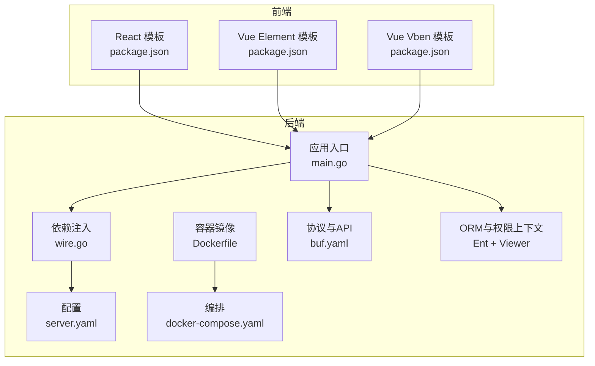
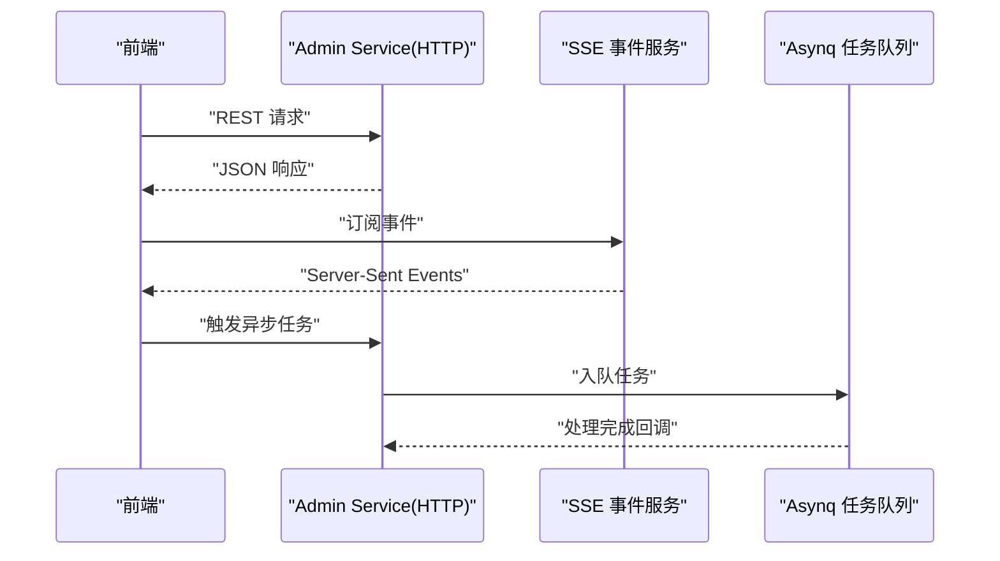
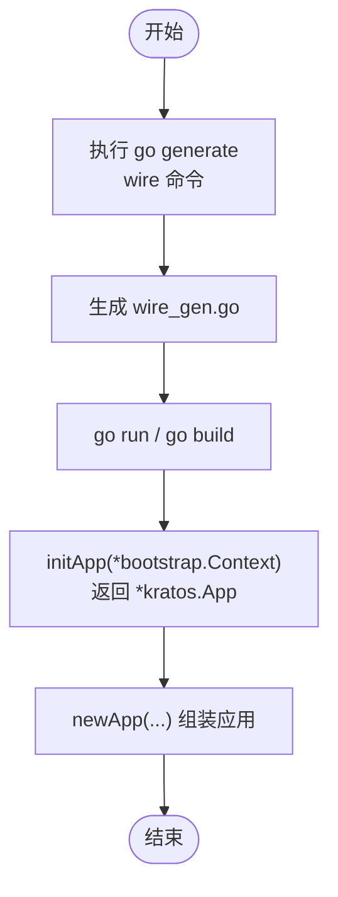
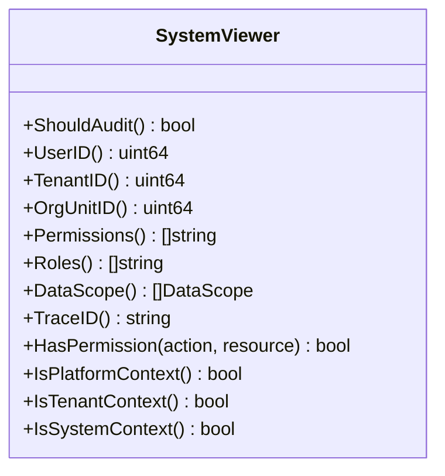
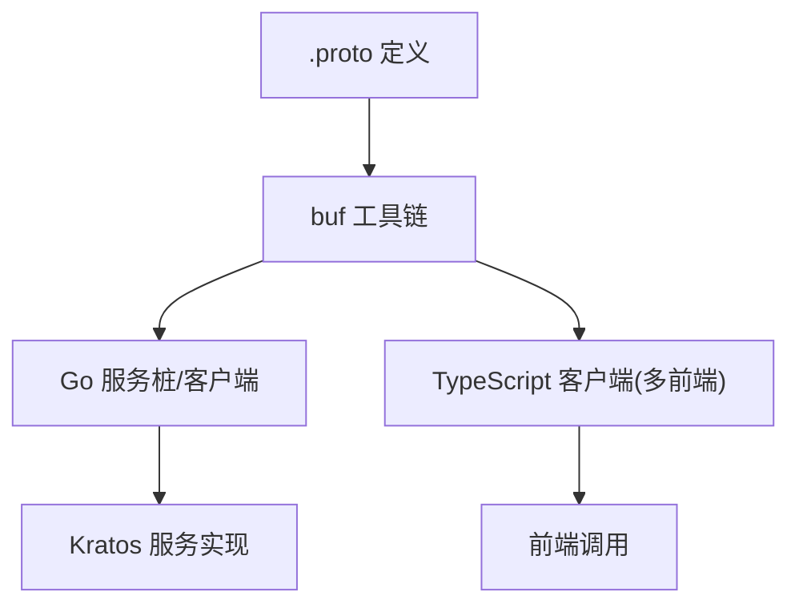
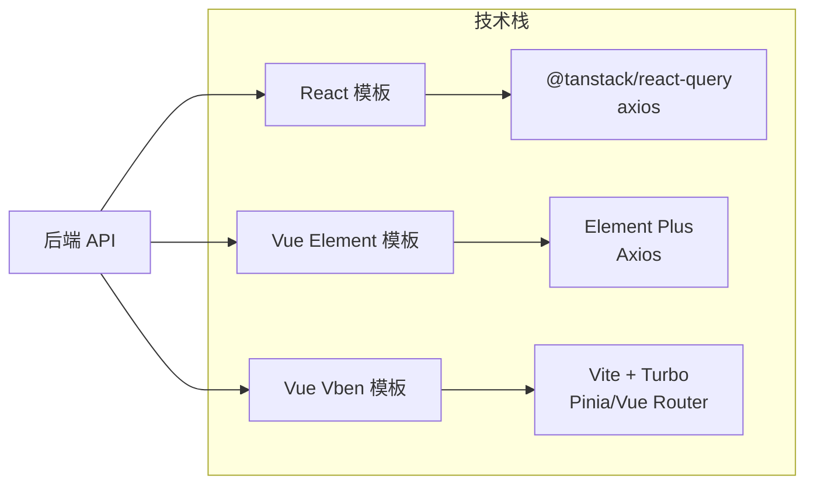
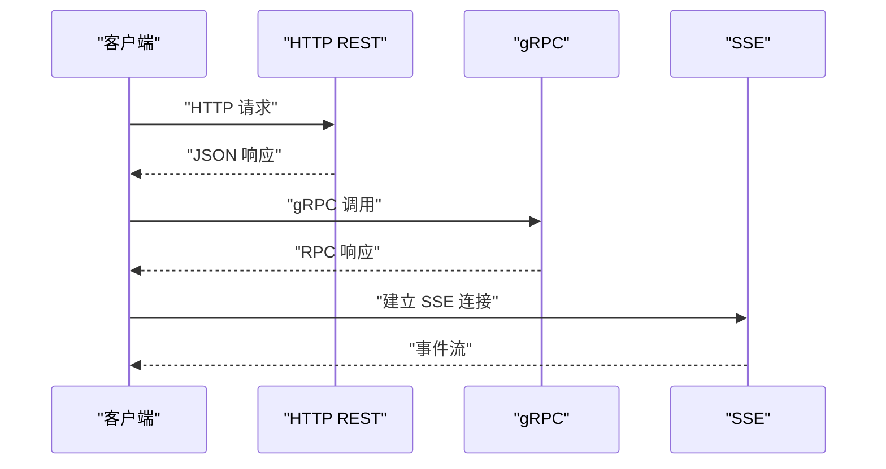
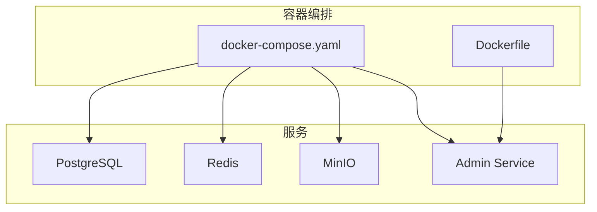
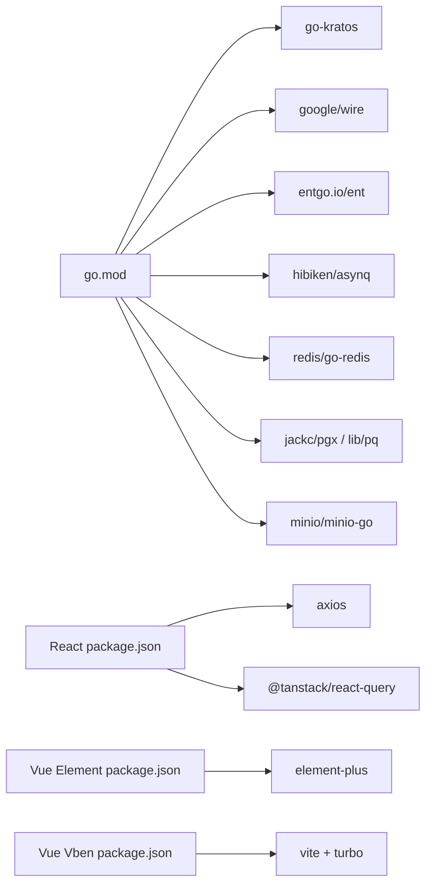

# 架构设计

<cite>
**本文引用的文件**
- [go.mod](file://backend/go.mod)
- [main.go](file://backend/app/admin/service/cmd/server/main.go)
- [wire.go](file://backend/app/admin/service/cmd/server/wire.go)
- [Dockerfile](file://backend/Dockerfile)
- [docker-compose.yaml](file://backend/docker-compose.yaml)
- [server.yaml](file://backend/app/admin/service/configs/server.yaml)
- [buf.yaml](file://backend/api/buf.yaml)
- [system_viewer.go](file://backend/pkg/entgo/viewer/system_viewer.go)
- [package.json (React)](file://frontend/admin/react/package.json)
- [package.json (Vue Element)](file://frontend/admin/vue-element/package.json)
- [package.json (Vue Vben)](file://frontend/admin/vue-vben/package.json)
</cite>

## 目录
1. [引言](#引言)
2. [项目结构](#项目结构)
3. [核心组件](#核心组件)
4. [架构总览](#架构总览)
5. [详细组件分析](#详细组件分析)
6. [依赖关系分析](#依赖关系分析)
7. [性能考量](#性能考量)
8. [故障排查指南](#故障排查指南)
9. [结论](#结论)
10. [附录](#附录)

## 引言
本文件为 GoWind Admin 的架构设计文档，面向后端工程师与全栈开发者，系统性阐述以下主题：
- 整体架构模式：微服务与单体部署的双重设计思路
- go-kratos 微服务框架的应用与扩展
- Wire 依赖注入容器的作用与生成流程
- Ent ORM 的数据建模策略与 Viewer 权限上下文
- 前后端分离设计理念与 Vue3/React 两种前端框架的架构差异
- 服务间通信机制：gRPC、HTTP/JSON、WebSocket（SSE）等协议的使用场景
- 容器化部署策略：Docker 与 Docker Compose 的配置与多服务协调
- 架构图表、组件关系图与数据流向图，帮助快速理解系统整体设计

## 项目结构
GoWind Admin 采用“后端微服务 + 多前端模板”的双轨架构：
- 后端：基于 go-kratos 的微服务应用，通过 Wire 注入容器装配各模块，提供 REST、gRPC、SSE 等多种传输能力，并集成 Redis、PostgreSQL、MinIO 等基础设施。
- 前端：提供 Vue3 + Element Plus 与 Vue3 + Vben Admin 两套模板，以及 React + Ant Design 模板，均以独立包管理与构建工具运行。



**图表来源**
- [main.go:1-76](file://backend/app/admin/service/cmd/server/main.go#L1-L76)
- [wire.go:1-47](file://backend/app/admin/service/cmd/server/wire.go#L1-L47)
- [server.yaml:1-49](file://backend/app/admin/service/configs/server.yaml#L1-L49)
- [Dockerfile:1-66](file://backend/Dockerfile#L1-L66)
- [docker-compose.yaml:1-125](file://backend/docker-compose.yaml#L1-L125)
- [buf.yaml:1-26](file://backend/api/buf.yaml#L1-L26)
- [system_viewer.go:1-79](file://backend/pkg/entgo/viewer/system_viewer.go#L1-L79)
- [package.json (React):1-82](file://frontend/admin/react/package.json#L1-L82)
- [package.json (Vue Element):1-173](file://frontend/admin/vue-element/package.json#L1-L173)
- [package.json (Vue Vben):1-118](file://frontend/admin/vue-vben/package.json#L1-L118)

**章节来源**
- [main.go:1-76](file://backend/app/admin/service/cmd/server/main.go#L1-L76)
- [wire.go:1-47](file://backend/app/admin/service/cmd/server/wire.go#L1-L47)
- [server.yaml:1-49](file://backend/app/admin/service/configs/server.yaml#L1-L49)
- [Dockerfile:1-66](file://backend/Dockerfile#L1-L66)
- [docker-compose.yaml:1-125](file://backend/docker-compose.yaml#L1-L125)
- [buf.yaml:1-26](file://backend/api/buf.yaml#L1-L26)
- [system_viewer.go:1-79](file://backend/pkg/entgo/viewer/system_viewer.go#L1-L79)
- [package.json (React):1-82](file://frontend/admin/react/package.json#L1-L82)
- [package.json (Vue Element):1-173](file://frontend/admin/vue-element/package.json#L1-L173)
- [package.json (Vue Vben):1-118](file://frontend/admin/vue-vben/package.json#L1-L118)

## 核心组件
- 应用入口与引导
  - 应用通过 Kratos 框架启动，集成 HTTP、Asynq（任务队列）、SSE（事件推送）三种传输层。
  - 引导上下文包含项目名、应用 ID、版本号等元信息，便于运维与可观测性。
- 依赖注入与装配
  - 使用 Wire 生成器组合 ProviderSet，集中初始化服务、数据与服务器组件，保证构建期类型安全与运行期解耦。
- 协议与 API 规范
  - 采用 Protobuf 定义服务契约，结合 buf 工具链进行 Lint 与生成，支持 gRPC、HTTP/JSON、Swagger 文档等。
- 数据与权限
  - 基于 Ent ORM 进行数据建模；Viewer 提供统一的权限上下文（用户、租户、角色、数据范围、追踪 ID 等）。
- 基础设施与部署
  - PostgreSQL、Redis、MinIO 通过 Docker Compose 编排；Admin Service 以多阶段 Docker 镜像构建并运行。
- 前端模板
  - React 模板使用 Ant Design Pro 与 TanStack React Query；Vue Element 与 Vue Vben 提供企业级后台模板生态。

**章节来源**
- [main.go:46-76](file://backend/app/admin/service/cmd/server/main.go#L46-L76)
- [wire.go:27-46](file://backend/app/admin/service/cmd/server/wire.go#L27-L46)
- [buf.yaml:1-26](file://backend/api/buf.yaml#L1-L26)
- [system_viewer.go:9-79](file://backend/pkg/entgo/viewer/system_viewer.go#L9-L79)
- [server.yaml:1-49](file://backend/app/admin/service/configs/server.yaml#L1-L49)
- [Dockerfile:1-66](file://backend/Dockerfile#L1-L66)
- [docker-compose.yaml:1-125](file://backend/docker-compose.yaml#L1-L125)
- [package.json (React):1-82](file://frontend/admin/react/package.json#L1-L82)
- [package.json (Vue Element):1-173](file://frontend/admin/vue-element/package.json#L1-L173)
- [package.json (Vue Vben):1-118](file://frontend/admin/vue-vben/package.json#L1-L118)

## 架构总览
下图展示后端服务在容器化环境中的角色与交互，以及前端如何通过 REST/SSE 与后端通信。

```mermaid
graph TB
subgraph "网络"
FE1["React 前端"]
FE2["Vue Element 前端"]
FE3["Vue Vben 前端"]
end
subgraph "后端服务"
Svc["Admin Service<br/>REST + gRPC + SSE"]
Asynq["Asynq 任务队列"]
SSE["SSE 事件服务"]
end
subgraph "基础设施"
PG["PostgreSQL"]
RD["Redis"]
OZ["MinIO"]
end
FE1 --> Svc
FE2 --> Svc
FE3 --> Svc
Svc <- --> PG
Svc <- --> RD
Svc <- --> OZ
Svc --> Asynq
Svc --> SSE
```

**图表来源**
- [docker-compose.yaml:5-125](file://backend/docker-compose.yaml#L5-L125)
- [server.yaml:2-49](file://backend/app/admin/service/configs/server.yaml#L2-L49)
- [main.go:6-12](file://backend/app/admin/service/cmd/server/main.go#L6-L12)

## 详细组件分析

### go-kratos 应用与传输层
- HTTP REST
  - 配置地址、超时、Swagger 开关、pprof、CORS、中间件（日志、恢复、追踪、参数校验、熔断、元数据）。
- Asynq 任务队列
  - Redis 连接、编码、并发、优雅停机、严格优先级、时区、队列权重。
- SSE 事件推送
  - 地址、编码、路径、自动流式与自动应答策略。



**图表来源**
- [server.yaml:2-49](file://backend/app/admin/service/configs/server.yaml#L2-L49)
- [main.go:6-12](file://backend/app/admin/service/cmd/server/main.go#L6-L12)

**章节来源**
- [server.yaml:1-49](file://backend/app/admin/service/configs/server.yaml#L1-L49)
- [main.go:46-76](file://backend/app/admin/service/cmd/server/main.go#L46-L76)

### Wire 依赖注入容器
- 作用
  - 将服务、数据、服务器等组件以 ProviderSet 聚合，通过 wire.Build 在构建期生成 wire_gen.go，运行期由 newApp 组装 kratos.App。
- 流程
  - 构建标签确保 wire.go 不参与常规构建；wire 生成器扫描 internal 下的 providers 并生成注入代码。



**图表来源**
- [wire.go:1-47](file://backend/app/admin/service/cmd/server/wire.go#L1-L47)

**章节来源**
- [wire.go:1-47](file://backend/app/admin/service/cmd/server/wire.go#L1-L47)
- [main.go:46-76](file://backend/app/admin/service/cmd/server/main.go#L46-L76)

### Ent ORM 与 Viewer 权限上下文
- Viewer 设计
  - 提供用户 ID、租户 ID、组织单元 ID、权限集合、角色集合、数据范围、Trace ID 等统一接口，支持平台/租户/系统上下文判断。
- 用途
  - 在数据层实现数据权限过滤、审计开关控制、跨租户隔离等。



**图表来源**
- [system_viewer.go:9-79](file://backend/pkg/entgo/viewer/system_viewer.go#L9-L79)

**章节来源**
- [system_viewer.go:1-79](file://backend/pkg/entgo/viewer/system_viewer.go#L1-L79)

### 协议与 API 规划（Protobuf + buf）
- 规范与生成
  - buf.yaml 定义模块、Lint、Breaking 规则与外部依赖；支持为不同前端生成 TypeScript 类型定义。
- 传输形态
  - 通过 gRPC 提供高性能 RPC；通过 HTTP/JSON 提供更广泛的客户端兼容；Swagger 可自动生成 OpenAPI 文档。



**图表来源**
- [buf.yaml:1-26](file://backend/api/buf.yaml#L1-L26)

**章节来源**
- [buf.yaml:1-26](file://backend/api/buf.yaml#L1-L26)

### 前后端分离与前端模板差异
- 设计理念
  - 后端专注业务与数据，前端专注用户体验与交互；通过 REST/SSE 与后端解耦。
- 模板差异
  - React 模板：Ant Design Pro + TanStack React Query，适合中后台与数据密集型场景。
  - Vue Element 模板：Element Plus 生态，组件丰富，适合传统后台管理。
  - Vue Vben 模板：Vite + Turbo 工作空间，模块化与工程化程度高，适合大型后台项目。



**图表来源**
- [package.json (React):13-38](file://frontend/admin/react/package.json#L13-L38)
- [package.json (Vue Element):47-115](file://frontend/admin/vue-element/package.json#L47-L115)
- [package.json (Vue Vben):1-118](file://frontend/admin/vue-vben/package.json#L1-L118)

**章节来源**
- [package.json (React):1-82](file://frontend/admin/react/package.json#L1-L82)
- [package.json (Vue Element):1-173](file://frontend/admin/vue-element/package.json#L1-L173)
- [package.json (Vue Vben):1-118](file://frontend/admin/vue-vben/package.json#L1-L118)

### 服务间通信机制
- gRPC
  - 高性能、强类型、自动序列化；适用于内部服务间调用与跨语言集成。
- HTTP/JSON
  - 广泛兼容、易调试；适合 Web 前端直连与第三方集成。
- WebSocket（SSE）
  - Server-Sent Events 用于后端向前端推送实时事件流，适合日志、状态变更、通知等场景。



**图表来源**
- [server.yaml:2-49](file://backend/app/admin/service/configs/server.yaml#L2-L49)
- [main.go:6-12](file://backend/app/admin/service/cmd/server/main.go#L6-L12)

**章节来源**
- [server.yaml:1-49](file://backend/app/admin/service/configs/server.yaml#L1-L49)
- [main.go:46-76](file://backend/app/admin/service/cmd/server/main.go#L46-L76)

### 容器化与多服务协调
- Docker 镜像
  - 多阶段构建：Alpine 基础镜像、非 root 用户、复制可执行文件与配置。
- Docker Compose
  - 编排 PostgreSQL、Redis、MinIO 与 Admin Service；Admin Service 依赖数据库与存储，暴露 REST 与 SSE 端口。
- 运维要点
  - 环境变量（时区）、端口映射、资源限制、健康检查与日志采集。



**图表来源**
- [docker-compose.yaml:5-125](file://backend/docker-compose.yaml#L5-L125)
- [Dockerfile:1-66](file://backend/Dockerfile#L1-L66)

**章节来源**
- [Dockerfile:1-66](file://backend/Dockerfile#L1-L66)
- [docker-compose.yaml:1-125](file://backend/docker-compose.yaml#L1-L125)

## 依赖关系分析
- 后端依赖
  - go-kratos、Wire、Ent、Asynq、Redis、PostgreSQL、MinIO、OpenTelemetry、Swagger 等。
- 前端依赖
  - React 模板依赖 Ant Design Pro、TanStack React Query、Axios；Vue Element 与 Vue Vben 依赖各自生态组件库与工程化工具。



**图表来源**
- [go.mod:5-65](file://backend/go.mod#L5-L65)
- [package.json (React):13-38](file://frontend/admin/react/package.json#L13-L38)
- [package.json (Vue Element):47-115](file://frontend/admin/vue-element/package.json#L47-L115)
- [package.json (Vue Vben):1-118](file://frontend/admin/vue-vben/package.json#L1-L118)

**章节来源**
- [go.mod:1-290](file://backend/go.mod#L1-L290)
- [package.json (React):1-82](file://frontend/admin/react/package.json#L1-L82)
- [package.json (Vue Element):1-173](file://frontend/admin/vue-element/package.json#L1-L173)
- [package.json (Vue Vben):1-118](file://frontend/admin/vue-vben/package.json#L1-L118)

## 性能考量
- 传输层
  - gRPC 适合高频、低延迟的服务间调用；HTTP/JSON 适合广覆盖与易调试场景；SSE 适合事件推送，注意连接数与背压控制。
- 数据层
  - 使用 Ent 的预加载与批量操作减少 N+1 查询；合理设置索引与分页；利用 Viewer 的数据范围过滤降低查询成本。
- 缓存与队列
  - Redis 用于会话、缓存与任务队列；Asynq 支持优先级与重试策略，避免阻塞主流程。
- 容器与编排
  - 多阶段构建减小镜像体积；非 root 用户提升安全性；Compose 中设置资源上限与健康检查保障稳定性。

## 故障排查指南
- 启动失败
  - 检查 server.yaml 中 REST/SSE/Asynq 配置是否正确；确认数据库、Redis、MinIO 是否正常启动并可达。
- 认证与鉴权
  - 若使用 JWT 或 Casbin/Opa 等授权引擎，请核对密钥、策略与中间件启用状态。
- 日志与追踪
  - 启用 logging、tracing、pprof 中间件，结合 OpenTelemetry 导出器定位问题。
- 前端联调
  - 确认 CORS 配置允许前端域名；若使用 Swagger UI，检查 enable_swagger 与路由映射。

**章节来源**
- [server.yaml:1-49](file://backend/app/admin/service/configs/server.yaml#L1-L49)
- [main.go:46-76](file://backend/app/admin/service/cmd/server/main.go#L46-L76)

## 结论
GoWind Admin 采用“后端微服务 + 多前端模板”的架构，后端以 go-kratos 为核心，结合 Wire 注入、Ent ORM 与多种传输协议，形成高内聚、低耦合的服务体系；前端提供三套成熟模板，满足不同团队与场景需求。通过 Docker 与 Compose 实现一键部署与多服务协调，具备良好的可维护性与扩展性。

## 附录
- 关键文件速览
  - 应用入口与引导：[main.go:1-76](file://backend/app/admin/service/cmd/server/main.go#L1-L76)
  - 依赖注入：[wire.go:1-47](file://backend/app/admin/service/cmd/server/wire.go#L1-L47)
  - 配置：[server.yaml:1-49](file://backend/app/admin/service/configs/server.yaml#L1-L49)
  - 协议规范：[buf.yaml:1-26](file://backend/api/buf.yaml#L1-L26)
  - ORM 与权限上下文：[system_viewer.go:1-79](file://backend/pkg/entgo/viewer/system_viewer.go#L1-L79)
  - 容器与编排：[Dockerfile:1-66](file://backend/Dockerfile#L1-L66)、[docker-compose.yaml:1-125](file://backend/docker-compose.yaml#L1-L125)
  - 前端模板依赖：[package.json (React):1-82](file://frontend/admin/react/package.json#L1-L82)、[package.json (Vue Element):1-173](file://frontend/admin/vue-element/package.json#L1-L173)、[package.json (Vue Vben):1-118](file://frontend/admin/vue-vben/package.json#L1-L118)