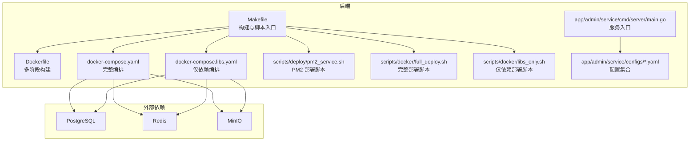
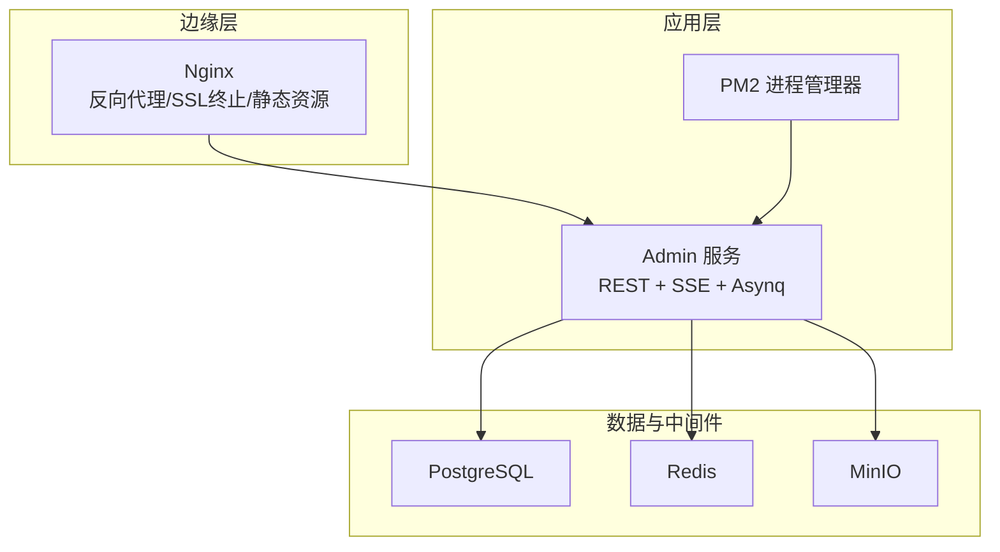
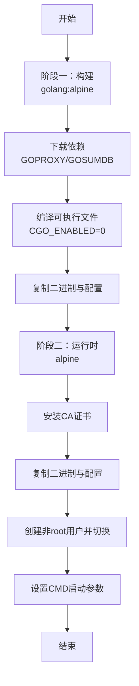
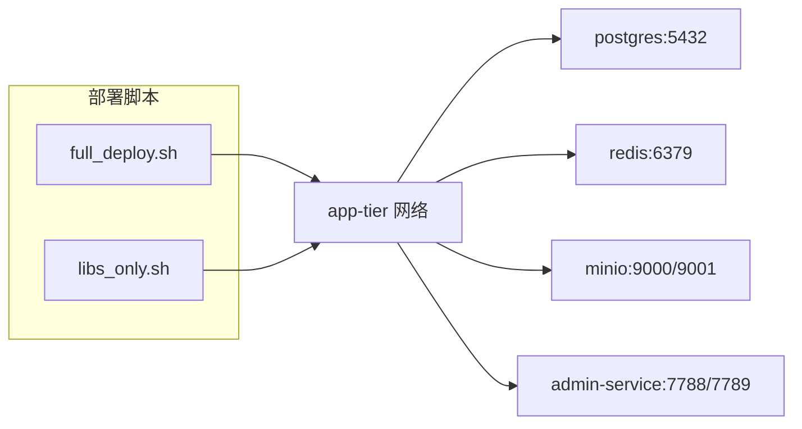
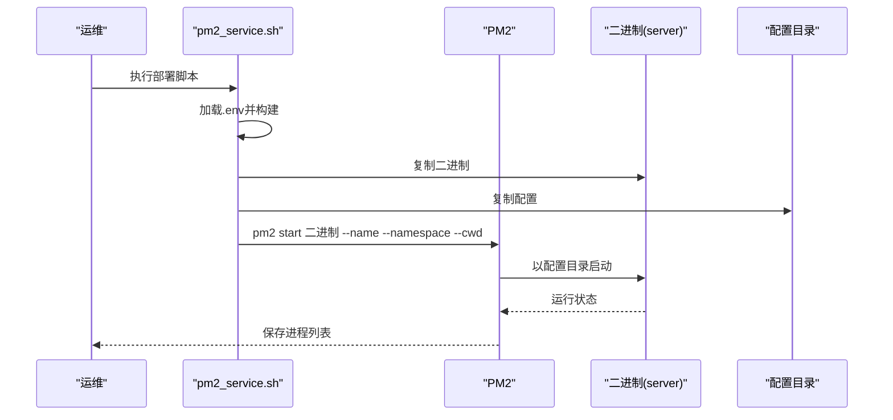
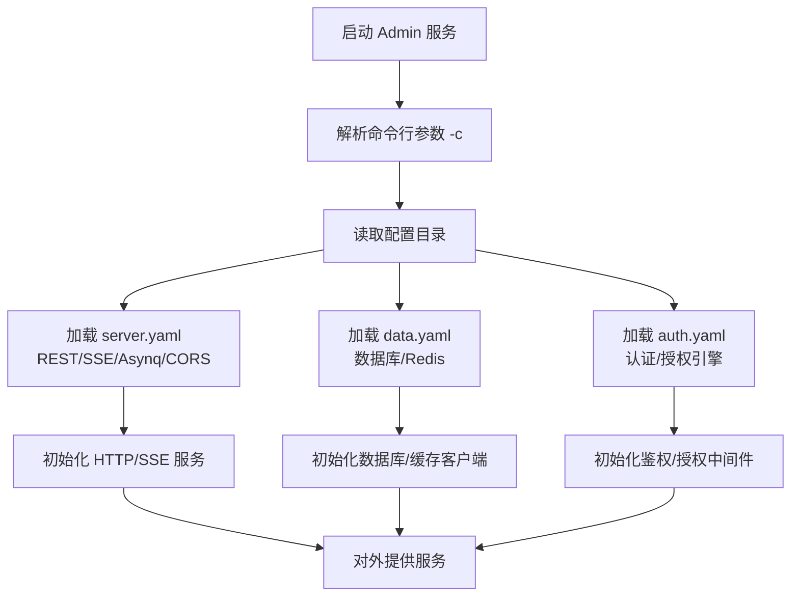
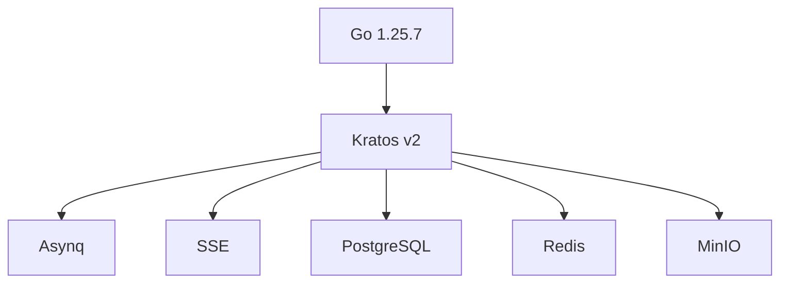
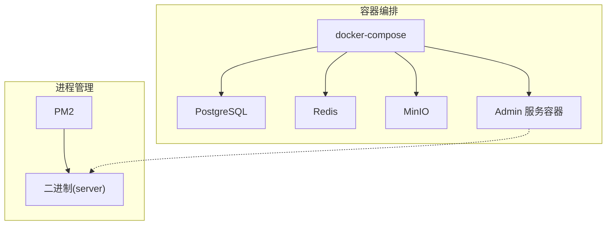
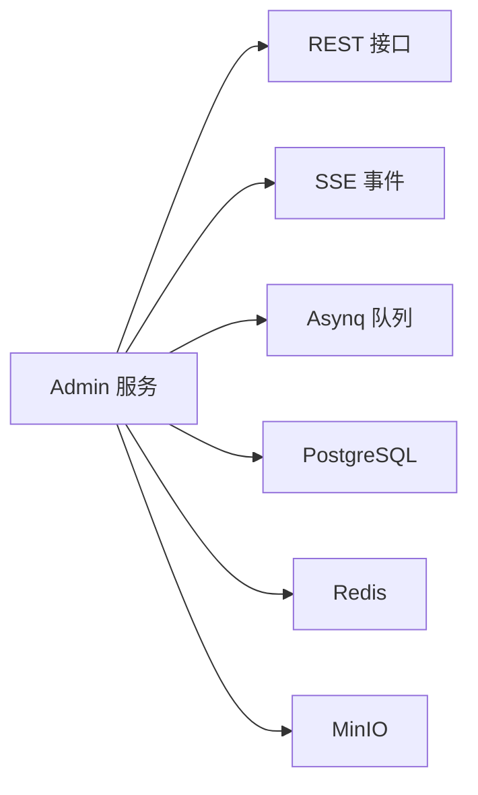
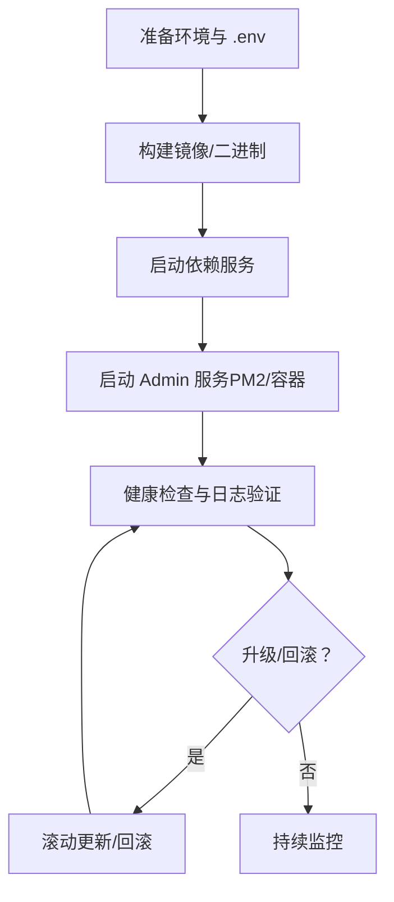

# 部署架构设计

<cite>
**本文引用的文件**
- [Dockerfile](file://backend/Dockerfile)
- [docker-compose.yaml](file://backend/docker-compose.yaml)
- [docker-compose.libs.yaml](file://backend/docker-compose.libs.yaml)
- [pm2_service.sh](file://backend/scripts/deploy/pm2_service.sh)
- [full_deploy.sh](file://backend/scripts/docker/full_deploy.sh)
- [libs_only.sh](file://backend/scripts/docker/libs_only.sh)
- [Makefile](file://backend/Makefile)
- [main.go](file://backend/app/admin/service/cmd/server/main.go)
- [server.yaml](file://backend/app/admin/service/configs/server.yaml)
- [auth.yaml](file://backend/app/admin/service/configs/auth.yaml)
- [data.yaml](file://backend/app/admin/service/configs/data.yaml)
- [go.mod](file://backend/go.mod)
</cite>

## 目录
1. [简介](#简介)
2. [项目结构](#项目结构)
3. [核心组件](#核心组件)
4. [架构总览](#架构总览)
5. [详细组件分析](#详细组件分析)
6. [依赖关系分析](#依赖关系分析)
7. [性能考虑](#性能考虑)
8. [故障排查指南](#故障排查指南)
9. [结论](#结论)
10. [附录](#附录)

## 简介
本文件面向 GoWind Admin 的部署与运维团队，提供一套系统化的容器化部署架构设计说明。内容涵盖：
- Docker 镜像构建策略（多阶段构建、镜像优化）
- Docker Compose 配置与多服务编排（服务依赖、网络与数据卷）
- PM2 进程管理（守护、自动重启、日志与命名空间）
- Nginx 反向代理（负载均衡、静态资源、SSL 终止）
- 环境变量与配置文件动态加载机制
- 监控与日志（Prometheus、Grafana、ELK Stack）集成思路
- 部署架构图、服务拓扑图与运维流程图

## 项目结构
后端采用多服务单仓模式，Admin 服务位于 app/admin/service，配合 Docker 与 Makefile 提供一键构建与部署能力；前端位于 frontend/admin，可独立构建与部署。

图表来源
- [Dockerfile:1-66](file://backend/Dockerfile#L1-L66)
- [docker-compose.yaml:1-125](file://backend/docker-compose.yaml#L1-L125)
- [docker-compose.libs.yaml:1-85](file://backend/docker-compose.libs.yaml#L1-L85)
- [Makefile:1-227](file://backend/Makefile#L1-L227)
- [pm2_service.sh:1-137](file://backend/scripts/deploy/pm2_service.sh#L1-L137)
- [full_deploy.sh:1-96](file://backend/scripts/docker/full_deploy.sh#L1-L96)
- [libs_only.sh:1-120](file://backend/scripts/docker/libs_only.sh#L1-L120)
- [main.go:1-76](file://backend/app/admin/service/cmd/server/main.go#L1-L76)
- [server.yaml:1-49](file://backend/app/admin/service/configs/server.yaml#L1-L49)
- [auth.yaml:1-37](file://backend/app/admin/service/configs/auth.yaml#L1-L37)
- [data.yaml:1-21](file://backend/app/admin/service/configs/data.yaml#L1-L21)

章节来源
- [Dockerfile:1-66](file://backend/Dockerfile#L1-L66)
- [docker-compose.yaml:1-125](file://backend/docker-compose.yaml#L1-L125)
- [docker-compose.libs.yaml:1-85](file://backend/docker-compose.libs.yaml#L1-L85)
- [Makefile:1-227](file://backend/Makefile#L1-L227)

## 核心组件
- 容器镜像构建：基于多阶段构建，第一阶段使用 golang:alpine 构建可执行文件，第二阶段使用 alpine 运行时，最小化镜像体积并提升安全性。
- 服务编排：使用 docker-compose 定义数据库、缓存与对象存储等依赖服务，并将 Admin 服务纳入同一网络，实现服务发现与通信。
- 进程管理：PM2 脚本负责将构建产物复制到安装目录并以命名空间方式启动，支持日志输出与自动保存。
- 配置管理：Admin 服务通过命令行参数加载配置目录，配置项涵盖 REST、异步队列、SSE、认证与数据源等。
- 部署脚本：Makefile 提供 compose-up/down、PM2 部署、Docker 构建等常用命令，简化运维操作。

章节来源
- [Dockerfile:1-66](file://backend/Dockerfile#L1-L66)
- [docker-compose.yaml:104-125](file://backend/docker-compose.yaml#L104-L125)
- [pm2_service.sh:96-137](file://backend/scripts/deploy/pm2_service.sh#L96-L137)
- [main.go:46-76](file://backend/app/admin/service/cmd/server/main.go#L46-L76)
- [server.yaml:1-49](file://backend/app/admin/service/configs/server.yaml#L1-L49)
- [auth.yaml:1-37](file://backend/app/admin/service/configs/auth.yaml#L1-L37)
- [data.yaml:1-21](file://backend/app/admin/service/configs/data.yaml#L1-L21)
- [Makefile:181-208](file://backend/Makefile#L181-L208)

## 架构总览
下图展示生产环境典型部署拓扑：Nginx 作为反向代理与 SSL 终止，Admin 服务通过 PM2 管理，依赖 PostgreSQL、Redis、MinIO 通过 Docker Compose 管理。

图表来源
- [docker-compose.yaml:6-84](file://backend/docker-compose.yaml#L6-L84)
- [pm2_service.sh:96-137](file://backend/scripts/deploy/pm2_service.sh#L96-L137)
- [main.go:46-76](file://backend/app/admin/service/cmd/server/main.go#L46-L76)

## 详细组件分析

### 容器化与镜像构建
- 多阶段构建策略
  - 阶段一：使用 golang:alpine，设置 GOPROXY 与 GOSUMDB，启用 CGO 禁用与 Linux amd64 目标平台，构建静态链接可执行文件。
  - 阶段二：使用 alpine，安装 CA 证书，复制可执行文件与配置目录，创建非 root 用户切换运行，设置 CMD 启动参数指向配置目录。
- 镜像优化
  - 最小基础镜像（alpine）、禁用 CGO、静态链接、仅拷贝必要文件、非 root 运行降低攻击面。
- 版本与参数
  - 通过 ARG 注入 SERVICE_NAME 与 APP_VERSION，便于 CI/CD 注入版本信息。

图表来源
- [Dockerfile:1-66](file://backend/Dockerfile#L1-L66)

章节来源
- [Dockerfile:1-66](file://backend/Dockerfile#L1-L66)

### Docker Compose 编排与服务协调
- 网络
  - 使用自定义 bridge 网络 app-tier，确保服务间可按服务名互访。
- 服务定义
  - PostgreSQL：持久化端口映射、ulimit 调优、数据库初始化参数。
  - Redis：密码保护、禁用危险命令、IO 线程优化。
  - MinIO：控制台端口映射、默认桶与密钥管理。
  - Admin 服务：依赖 PostgreSQL/Redis/MinIO，暴露 REST 与 SSE 端口，构建参数注入服务名与版本。
- 数据卷与权限
  - 部署脚本会准备 APP_ROOT 下的子目录并尝试 chown 1001:1001，便于容器内非 root 用户读写。

图表来源
- [docker-compose.yaml:1-125](file://backend/docker-compose.yaml#L1-L125)
- [docker-compose.libs.yaml:1-85](file://backend/docker-compose.libs.yaml#L1-L85)
- [full_deploy.sh:69-81](file://backend/scripts/docker/full_deploy.sh#L69-L81)
- [libs_only.sh:92-105](file://backend/scripts/docker/libs_only.sh#L92-L105)

章节来源
- [docker-compose.yaml:1-125](file://backend/docker-compose.yaml#L1-L125)
- [docker-compose.libs.yaml:1-85](file://backend/docker-compose.libs.yaml#L1-L85)
- [full_deploy.sh:69-81](file://backend/scripts/docker/full_deploy.sh#L69-L81)
- [libs_only.sh:92-105](file://backend/scripts/docker/libs_only.sh#L92-L105)

### PM2 进程管理
- 部署流程
  - 读取 .env 并自动导出变量；构建二进制；遍历 app 目录复制二进制与配置；以命名空间方式启动 PM2；保存进程列表。
- 运行参数
  - 通过 --cwd 指定工作目录，输出 stdout/stderr 日志文件，传递 -c 指向配置目录。
- 命名空间
  - 使用 --namespace 将不同项目隔离，便于批量管理与清理。

图表来源
- [pm2_service.sh:96-137](file://backend/scripts/deploy/pm2_service.sh#L96-L137)

章节来源
- [pm2_service.sh:1-137](file://backend/scripts/deploy/pm2_service.sh#L1-L137)

### Nginx 反向代理（建议）
- 负载均衡
  - 在多实例 Admin 服务之间分发请求，结合健康检查与权重策略。
- 静态资源
  - 将前端构建产物交由 Nginx 提供，开启 gzip/缓存头优化传输。
- SSL 终止
  - 使用 Let’s Encrypt 获取证书，统一处理 TLS 握手与会话复用。
- 配置要点
  - 反向代理到 Admin 服务 REST/SSE 端口；设置超时、缓冲与错误页；限制来源与速率。

（本节为概念性说明，未直接分析具体文件）

### 配置管理与动态加载
- 配置来源
  - Admin 服务通过命令行参数 -c 指定配置目录，加载 server.yaml、auth.yaml、data.yaml 等。
- 关键配置项
  - server.yaml：REST 地址与超时、Swagger/pprof、CORS、中间件开关；Asynq 队列与并发；SSE 地址与路径。
  - data.yaml：数据库驱动与连接串、迁移开关、连接池参数；Redis 地址与认证。
  - auth.yaml：认证类型（JWT/OIDC/PresharedKey）、授权引擎（Casbin/OPA/Zanzibar/Keto/OpenFGA）等。
- 环境变量
  - Makefile 支持从 .env 导入变量；部署脚本在执行前会加载 .env 并 set -a 导出变量，便于后续命令使用。

图表来源
- [main.go:46-76](file://backend/app/admin/service/cmd/server/main.go#L46-L76)
- [server.yaml:1-49](file://backend/app/admin/service/configs/server.yaml#L1-L49)
- [auth.yaml:1-37](file://backend/app/admin/service/configs/auth.yaml#L1-L37)
- [data.yaml:1-21](file://backend/app/admin/service/configs/data.yaml#L1-L21)
- [Makefile:7-11](file://backend/Makefile#L7-L11)

章节来源
- [main.go:46-76](file://backend/app/admin/service/cmd/server/main.go#L46-L76)
- [server.yaml:1-49](file://backend/app/admin/service/configs/server.yaml#L1-L49)
- [auth.yaml:1-37](file://backend/app/admin/service/configs/auth.yaml#L1-L37)
- [data.yaml:1-21](file://backend/app/admin/service/configs/data.yaml#L1-L21)
- [Makefile:7-11](file://backend/Makefile#L7-L11)

### 监控与日志（建议）
- 指标采集
  - Admin 服务可接入 OpenTelemetry SDK，导出指标至 Prometheus；或使用内置中间件/插件暴露指标端点。
- 可视化
  - Grafana 连接 Prometheus 数据源，创建仪表盘展示 CPU、内存、QPS、错误率、队列长度等。
- 日志
  - 结合 PM2 日志与容器日志，集中到 ELK/EFK；对敏感字段进行脱敏处理；按天滚动与压缩。
- 集成建议
  - Prometheus 与 Grafana 作为独立服务通过 Compose 管理；Admin 服务暴露 /metrics；Nginx 记录访问日志并转发给日志栈。

（本节为概念性说明，未直接分析具体文件）

## 依赖关系分析
- 语言与框架
  - Go 1.25.7，Kratos v2 作为微服务框架，Asynq/SSE 作为异步任务与事件推送传输层。
- 外部依赖
  - PostgreSQL/MySQL（通过配置切换）、Redis、MinIO、Jaeger（注释中预留）。
- 构建与工具链
  - Makefile 提供统一入口；Dockerfile 定义镜像；脚本负责部署与运维。

图表来源
- [go.mod:3-65](file://backend/go.mod#L3-L65)
- [main.go:6-40](file://backend/app/admin/service/cmd/server/main.go#L6-L40)

章节来源
- [go.mod:3-65](file://backend/go.mod#L3-L65)
- [main.go:6-40](file://backend/app/admin/service/cmd/server/main.go#L6-L40)

## 性能考虑
- 镜像与运行时
  - 多阶段构建与 alpine 基础镜像显著减小镜像体积；禁用 CGO 与静态链接提升可移植性。
- 数据库与缓存
  - 合理设置连接池大小与生命周期；Redis 启用 IO 线程与禁用高危命令；MinIO 默认桶与密钥需定期轮换。
- 服务超时与中间件
  - REST 超时、CORS 允许范围、pprof/Swagger 仅在开发环境启用；SSE 路径与自动流控需按业务调优。
- 进程管理
  - PM2 命名空间隔离与日志分离，便于快速定位问题；合理设置重启策略与内存阈值。

（本节提供通用指导，未直接分析具体文件）

## 故障排查指南
- 容器无法启动
  - 检查 Admin 服务端口占用与依赖服务连通性；确认配置目录挂载正确；查看 PM2 输出日志。
- 数据库连接失败
  - 核对 data.yaml 中主机名、端口、用户名与密码；确认 Compose 网络与服务名解析。
- Redis/MinIO 权限问题
  - 检查密码与禁用命令列表；确认容器内用户对数据卷有读写权限。
- 配置未生效
  - 确认 -c 参数指向的配置目录；检查 YAML 语法与键名拼写；验证 .env 是否正确导入。

章节来源
- [docker-compose.yaml:113-116](file://backend/docker-compose.yaml#L113-L116)
- [data.yaml:1-21](file://backend/app/admin/service/configs/data.yaml#L1-L21)
- [pm2_service.sh:118-130](file://backend/scripts/deploy/pm2_service.sh#L118-L130)

## 结论
本部署架构以“最小镜像 + 多阶段构建”为基础，结合 Docker Compose 实现依赖编排，PM2 提供稳定的进程守护与日志管理，配合 Nginx 的反向代理与 SSL 终止，形成可扩展、可观测、易维护的生产级部署方案。建议在生产环境中进一步完善监控与日志体系，并对敏感配置与密钥进行安全加固。

## 附录

### 部署架构图（容器化与进程管理）

图表来源
- [docker-compose.yaml:6-125](file://backend/docker-compose.yaml#L6-L125)
- [pm2_service.sh:96-137](file://backend/scripts/deploy/pm2_service.sh#L96-L137)

### 服务拓扑图（Admin 服务依赖）

图表来源
- [server.yaml:1-49](file://backend/app/admin/service/configs/server.yaml#L1-L49)
- [data.yaml:1-21](file://backend/app/admin/service/configs/data.yaml#L1-L21)

### 运维流程图（部署与升级）

图表来源
- [Makefile:181-208](file://backend/Makefile#L181-L208)
- [full_deploy.sh:94-96](file://backend/scripts/docker/full_deploy.sh#L94-L96)
- [pm2_service.sh:134-137](file://backend/scripts/deploy/pm2_service.sh#L134-L137)