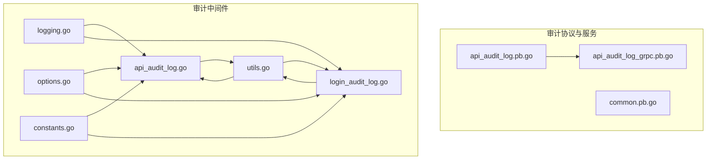
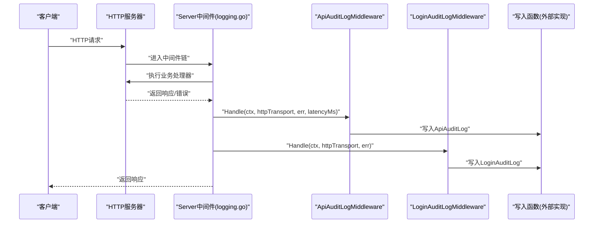
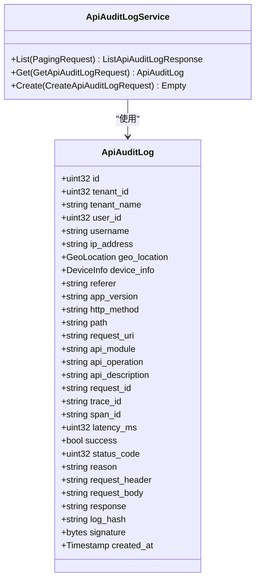
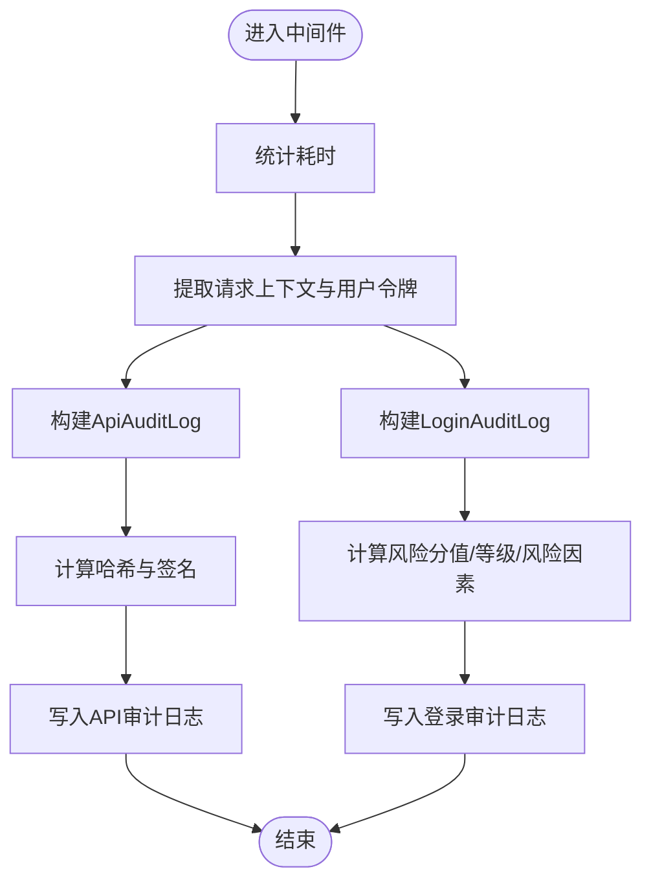
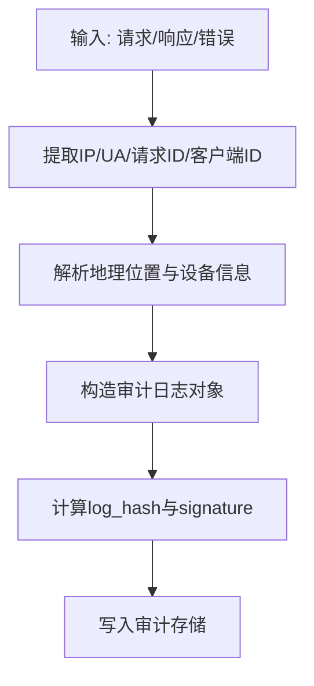
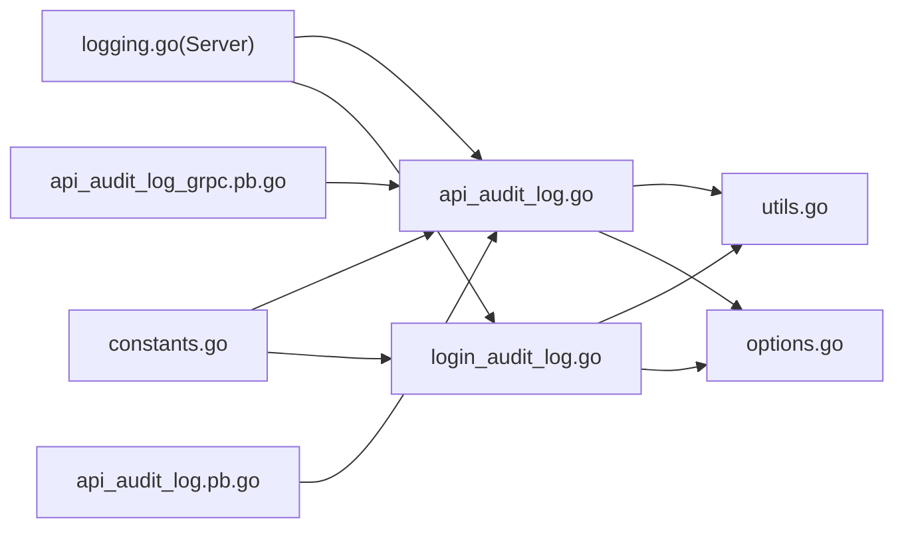

# API审计日志

<cite>
**本文引用的文件**
- [api_audit_log.pb.go](file://backend/api/gen/go/audit/service/v1/api_audit_log.pb.go)
- [api_audit_log_grpc.pb.go](file://backend/api/gen/go/audit/service/v1/api_audit_log_grpc.pb.go)
- [common.pb.go](file://backend/api/gen/go/audit/service/v1/common.pb.go)
- [api_audit_log.go](file://backend/pkg/middleware/logging/api_audit_log.go)
- [login_audit_log.go](file://backend/pkg/middleware/logging/login_audit_log.go)
- [logging.go](file://backend/pkg/middleware/logging/logging.go)
- [options.go](file://backend/pkg/middleware/logging/options.go)
- [constants.go](file://backend/pkg/middleware/logging/constants.go)
- [utils.go](file://backend/pkg/middleware/logging/utils.go)
</cite>

## 目录
1. [简介](#简介)
2. [项目结构](#项目结构)
3. [核心组件](#核心组件)
4. [架构总览](#架构总览)
5. [详细组件分析](#详细组件分析)
6. [依赖分析](#依赖分析)
7. [性能考虑](#性能考虑)
8. [故障排查指南](#故障排查指南)
9. [结论](#结论)
10. [附录](#附录)

## 简介
本文件系统性阐述API审计日志功能的设计与实现，涵盖以下方面：
- 对外暴露的API接口调用记录：请求参数、响应结果、调用耗时、错误信息等完整信息
- 审计数据的采集与处理流程：中间件拦截、请求预处理、响应后处理、异常捕获
- 监控与分析能力：接口调用频率统计、性能指标分析、错误率监控、接口依赖关系
- 安全审计机制：接口访问控制、参数验证、敏感数据过滤、异常调用检测
- 存储优化与查询策略：日志分级存储、索引优化、批量处理、实时分析

## 项目结构
围绕API审计日志的关键代码分布在如下位置：
- Protobuf定义与gRPC服务：backend/api/gen/go/audit/service/v1
- 审计中间件：backend/pkg/middleware/logging

**图表来源**
- [api_audit_log.pb.go:1-648](file://backend/api/gen/go/audit/service/v1/api_audit_log.pb.go#L1-L648)
- [api_audit_log_grpc.pb.go:1-210](file://backend/api/gen/go/audit/service/v1/api_audit_log_grpc.pb.go#L1-L210)
- [common.pb.go:1-335](file://backend/api/gen/go/audit/service/v1/common.pb.go#L1-L335)
- [logging.go:1-52](file://backend/pkg/middleware/logging/logging.go#L1-L52)
- [api_audit_log.go:1-162](file://backend/pkg/middleware/logging/api_audit_log.go#L1-L162)
- [login_audit_log.go:1-364](file://backend/pkg/middleware/logging/login_audit_log.go#L1-L364)
- [options.go:1-61](file://backend/pkg/middleware/logging/options.go#L1-L61)
- [constants.go:1-15](file://backend/pkg/middleware/logging/constants.go#L1-L15)
- [utils.go:1-471](file://backend/pkg/middleware/logging/utils.go#L1-L471)

**章节来源**
- [api_audit_log.pb.go:1-648](file://backend/api/gen/go/audit/service/v1/api_audit_log.pb.go#L1-L648)
- [api_audit_log_grpc.pb.go:1-210](file://backend/api/gen/go/audit/service/v1/api_audit_log_grpc.pb.go#L1-L210)
- [common.pb.go:1-335](file://backend/api/gen/go/audit/service/v1/common.pb.go#L1-L335)
- [logging.go:1-52](file://backend/pkg/middleware/logging/logging.go#L1-L52)
- [api_audit_log.go:1-162](file://backend/pkg/middleware/logging/api_audit_log.go#L1-L162)
- [login_audit_log.go:1-364](file://backend/pkg/middleware/logging/login_audit_log.go#L1-L364)
- [options.go:1-61](file://backend/pkg/middleware/logging/options.go#L1-L61)
- [constants.go:1-15](file://backend/pkg/middleware/logging/constants.go#L1-L15)
- [utils.go:1-471](file://backend/pkg/middleware/logging/utils.go#L1-L471)

## 核心组件
- 审计日志数据模型：ApiAuditLog（包含租户、用户、IP、地理位置、设备信息、请求URI、方法、耗时、状态码、原因、请求头/体、响应、签名、哈希等字段）
- 审计服务接口：ApiAuditLogService（List/Get/Create）
- 审计中间件：ApiAuditLogMiddleware（拦截HTTP请求，构造ApiAuditLog并落库）
- 登录审计中间件：LoginAuditLogMiddleware（拦截登录/登出，计算风险分值与等级）
- 通用常量与枚举：敏感级别、保留策略、业务资源、数字签名等
- 工具函数：IP解析、UA解析、设备识别、风险评分、签名与哈希等

**章节来源**
- [api_audit_log.pb.go:30-64](file://backend/api/gen/go/audit/service/v1/api_audit_log.pb.go#L30-L64)
- [api_audit_log_grpc.pb.go:23-41](file://backend/api/gen/go/audit/service/v1/api_audit_log_grpc.pb.go#L23-L41)
- [api_audit_log.go:23-35](file://backend/pkg/middleware/logging/api_audit_log.go#L23-L35)
- [login_audit_log.go:25-37](file://backend/pkg/middleware/logging/login_audit_log.go#L25-L37)
- [common.pb.go:26-136](file://backend/api/gen/go/audit/service/v1/common.pb.go#L26-L136)

## 架构总览
API审计日志通过HTTP服务器中间件在请求处理完成后统一采集与落库，同时支持登录/登出场景的独立审计。

**图表来源**
- [logging.go:31-50](file://backend/pkg/middleware/logging/logging.go#L31-L50)
- [api_audit_log.go:37-88](file://backend/pkg/middleware/logging/api_audit_log.go#L37-L88)
- [login_audit_log.go:39-114](file://backend/pkg/middleware/logging/login_audit_log.go#L39-L114)

## 详细组件分析

### 数据模型与服务接口
- ApiAuditLog字段覆盖请求上下文、用户身份、地理与设备信息、请求/响应内容、性能与状态、完整性校验（哈希与签名）、时间戳等
- ApiAuditLogService提供列表查询、详情查询、创建接口，便于审计数据的检索与归档
- common.pb中定义敏感级别、保留策略、业务资源、数字签名算法等通用枚举与消息

**图表来源**
- [api_audit_log.pb.go:30-64](file://backend/api/gen/go/audit/service/v1/api_audit_log.pb.go#L30-L64)
- [api_audit_log_grpc.pb.go:86-94](file://backend/api/gen/go/audit/service/v1/api_audit_log_grpc.pb.go#L86-L94)

**章节来源**
- [api_audit_log.pb.go:30-64](file://backend/api/gen/go/audit/service/v1/api_audit_log.pb.go#L30-L64)
- [api_audit_log_grpc.pb.go:23-41](file://backend/api/gen/go/audit/service/v1/api_audit_log_grpc.pb.go#L23-L41)
- [common.pb.go:26-136](file://backend/api/gen/go/audit/service/v1/common.pb.go#L26-L136)

### 中间件拦截与处理流程
- Server中间件负责统计耗时，并在请求完成后分别调用登录审计与API审计中间件
- ApiAuditLogMiddleware负责提取请求上下文、用户令牌、地理位置、设备信息、计算哈希与签名，并通过注入的写入函数持久化
- LoginAuditLogMiddleware针对登录/登出操作，计算风险分值与等级，附加风险因素列表

**图表来源**
- [logging.go:31-50](file://backend/pkg/middleware/logging/logging.go#L31-L50)
- [api_audit_log.go:37-88](file://backend/pkg/middleware/logging/api_audit_log.go#L37-L88)
- [login_audit_log.go:39-114](file://backend/pkg/middleware/logging/login_audit_log.go#L39-L114)

**章节来源**
- [logging.go:14-51](file://backend/pkg/middleware/logging/logging.go#L14-L51)
- [api_audit_log.go:37-88](file://backend/pkg/middleware/logging/api_audit_log.go#L37-L88)
- [login_audit_log.go:39-114](file://backend/pkg/middleware/logging/login_audit_log.go#L39-L114)

### 工具函数与辅助能力
- IP解析与地理位置：支持X-Forwarded-For、X-Real-IP等头，结合IP库获取国家/省/市/ISP
- 设备识别：基于User-Agent解析浏览器、操作系统、设备类型、平台
- 请求ID与客户端ID：优先从请求头获取，否则生成GUID
- 风险评分与等级：基于登录状态、用户存在性、设备ID、IP内外网、失败原因等启发式规则
- 签名与哈希：确定性Protobuf序列化后计算SHA256，ECDSA DER签名

**图表来源**
- [utils.go:62-152](file://backend/pkg/middleware/logging/utils.go#L62-L152)
- [utils.go:310-351](file://backend/pkg/middleware/logging/utils.go#L310-L351)
- [utils.go:258-268](file://backend/pkg/middleware/logging/utils.go#L258-L268)
- [utils.go:273-308](file://backend/pkg/middleware/logging/utils.go#L273-L308)

**章节来源**
- [utils.go:62-152](file://backend/pkg/middleware/logging/utils.go#L62-L152)
- [utils.go:310-351](file://backend/pkg/middleware/logging/utils.go#L310-L351)
- [utils.go:258-268](file://backend/pkg/middleware/logging/utils.go#L258-L268)
- [utils.go:273-308](file://backend/pkg/middleware/logging/utils.go#L273-L308)

### 安全审计机制
- 参数验证与脱敏：请求头/体在入库前进行脱敏处理（字段注释明确）
- 数字签名与哈希：log_hash与signature确保数据完整性与不可抵赖
- 异常调用检测：登录审计中间件基于风险因素与评分识别高危行为
- 访问控制：通过鉴权令牌提取用户身份，结合租户维度进行审计

**章节来源**
- [api_audit_log.pb.go:512-519](file://backend/api/gen/go/audit/service/v1/api_audit_log.pb.go#L512-L519)
- [login_audit_log.go:192-271](file://backend/pkg/middleware/logging/login_audit_log.go#L192-L271)

## 依赖分析
- 中间件依赖Kratos传输层与HTTP传输对象，通过统一的Server中间件接入
- 审计日志模型与服务由Protobuf生成，保证跨语言一致性
- 工具函数依赖第三方库进行IP解析、UA解析、JWT解析、ECDSA签名等

**图表来源**
- [logging.go:14-51](file://backend/pkg/middleware/logging/logging.go#L14-L51)
- [api_audit_log.go:1-21](file://backend/pkg/middleware/logging/api_audit_log.go#L1-L21)
- [login_audit_log.go:1-23](file://backend/pkg/middleware/logging/login_audit_log.go#L1-L23)
- [utils.go:1-34](file://backend/pkg/middleware/logging/utils.go#L1-L34)
- [options.go:1-22](file://backend/pkg/middleware/logging/options.go#L1-L22)
- [constants.go:1-15](file://backend/pkg/middleware/logging/constants.go#L1-L15)
- [api_audit_log_grpc.pb.go:23-41](file://backend/api/gen/go/audit/service/v1/api_audit_log_grpc.pb.go#L23-L41)
- [api_audit_log.pb.go:30-64](file://backend/api/gen/go/audit/service/v1/api_audit_log.pb.go#L30-L64)

**章节来源**
- [logging.go:14-51](file://backend/pkg/middleware/logging/logging.go#L14-L51)
- [api_audit_log.go:1-21](file://backend/pkg/middleware/logging/api_audit_log.go#L1-L21)
- [login_audit_log.go:1-23](file://backend/pkg/middleware/logging/login_audit_log.go#L1-L23)
- [utils.go:1-34](file://backend/pkg/middleware/logging/utils.go#L1-L34)
- [options.go:1-22](file://backend/pkg/middleware/logging/options.go#L1-L22)
- [constants.go:1-15](file://backend/pkg/middleware/logging/constants.go#L1-L15)
- [api_audit_log_grpc.pb.go:23-41](file://backend/api/gen/go/audit/service/v1/api_audit_log_grpc.pb.go#L23-L41)
- [api_audit_log.pb.go:30-64](file://backend/api/gen/go/audit/service/v1/api_audit_log.pb.go#L30-L64)

## 性能考虑
- 中间件耗时统计：在Server中间件中精确统计请求耗时，避免重复计算
- 异步写入：建议将写入函数实现为异步批处理，减少阻塞
- 轻量序列化：Protobuf确定性序列化，哈希与签名仅在必要时计算
- IP/UA解析：缓存常用IP解析结果，避免重复查询
- 日志分级：对高频接口采用降采样或聚合策略，降低存储压力

## 故障排查指南
- 无法获取用户身份：检查Authorization头与JWT令牌有效性
- IP解析异常：确认X-Forwarded-For/X-Real-IP等头是否正确传递
- 设备信息缺失：UA为空或解析失败，检查客户端上报
- 风险评分异常：检查失败原因关键词与设备ID是否存在
- 签名/哈希失败：确认私钥配置与Protobuf序列化一致性

**章节来源**
- [utils.go:38-60](file://backend/pkg/middleware/logging/utils.go#L38-L60)
- [utils.go:62-101](file://backend/pkg/middleware/logging/utils.go#L62-L101)
- [utils.go:310-351](file://backend/pkg/middleware/logging/utils.go#L310-L351)
- [login_audit_log.go:192-271](file://backend/pkg/middleware/logging/login_audit_log.go#L192-L271)
- [api_audit_log.go:90-108](file://backend/pkg/middleware/logging/api_audit_log.go#L90-L108)

## 结论
该API审计日志体系通过中间件统一采集、Protobuf标准化建模、确定性哈希与ECDSA签名保障完整性与安全性，并提供登录风险评估与设备/地理信息增强，满足合规与安全审计需求。建议结合异步批处理与分级存储策略进一步提升性能与成本效益。

## 附录
- 审计服务接口：List/Get/Create，便于审计数据的检索与归档
- 通用枚举：敏感级别、保留策略、业务资源、数字签名算法
- 常量头键：Authorization、X-Forwarded-For、X-Real-IP、X-Request-ID、X-Correlation-ID等

**章节来源**
- [api_audit_log_grpc.pb.go:23-41](file://backend/api/gen/go/audit/service/v1/api_audit_log_grpc.pb.go#L23-L41)
- [common.pb.go:26-136](file://backend/api/gen/go/audit/service/v1/common.pb.go#L26-L136)
- [constants.go:3-14](file://backend/pkg/middleware/logging/constants.go#L3-L14)