# 审计监控功能

<cite>
**本文档引用的文件**
- [login_audit_log.pb.go](file://backend/api/gen/go/audit/service/v1/login_audit_log.pb.go)
- [operation_audit_log.pb.go](file://backend/api/gen/go/audit/service/v1/operation_audit_log.pb.go)
- [api_audit_log.pb.go](file://backend/api/gen/go/audit/service/v1/api_audit_log.pb.go)
- [data_access_audit_log.pb.go](file://backend/api/gen/go/audit/service/v1/data_access_audit_log.pb.go)
- [common.pb.go](file://backend/api/gen/go/audit/service/v1/common.pb.go)
- [device_info.pb.go](file://backend/api/gen/go/audit/service/v1/device_info.pb.go)
- [geo_location.pb.go](file://backend/api/gen/go/audit/service/v1/geo_location.pb.go)
- [login_audit_log.proto](file://backend/api/protos/audit/service/v1/login_audit_log.proto)
- [operation_audit_log.proto](file://backend/api/protos/audit/service/v1/operation_audit_log.proto)
- [api_audit_log.proto](file://backend/api/protos/audit/service/v1/api_audit_log.proto)
</cite>

## 目录
1. [项目概述](#项目概述)
2. [项目结构](#项目结构)
3. [核心组件](#核心组件)
4. [架构概览](#架构概览)
5. [详细组件分析](#详细组件分析)
6. [依赖关系分析](#依赖关系分析)
7. [性能考虑](#性能考虑)
8. [故障排除指南](#故障排除指南)
9. [结论](#结论)

## 项目概述

审计监控功能是Go风力发电项目中的重要安全组件，负责记录和分析系统中的各种操作活动。该功能提供了完整的审计日志管理能力，包括登录审计、操作审计、API审计和数据访问审计等多个维度。

系统采用基于Protocol Buffers的定义方式，确保了跨语言的一致性和高性能的数据序列化。每个审计日志类型都包含了丰富的元数据信息，支持合规性要求和安全分析需求。

## 项目结构

审计监控功能主要由以下几部分组成：

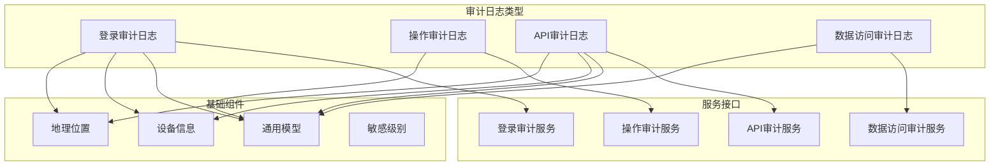

**图表来源**
- [login_audit_log.pb.go:29-190](file://backend/api/gen/go/audit/service/v1/login_audit_log.pb.go#L29-L190)
- [operation_audit_log.pb.go:101-150](file://backend/api/gen/go/audit/service/v1/operation_audit_log.pb.go#L101-L150)
- [api_audit_log.pb.go:31-64](file://backend/api/gen/go/audit/service/v1/api_audit_log.pb.go#L31-L64)

**章节来源**
- [login_audit_log.pb.go:1-844](file://backend/api/gen/go/audit/service/v1/login_audit_log.pb.go#L1-L844)
- [operation_audit_log.pb.go:1-644](file://backend/api/gen/go/audit/service/v1/operation_audit_log.pb.go#L1-L644)
- [api_audit_log.pb.go:1-648](file://backend/api/gen/go/audit/service/v1/api_audit_log.pb.go#L1-L648)

## 核心组件

### 审计日志模型

系统定义了四种主要的审计日志类型，每种都有其特定的用途和字段组合：

#### 登录审计日志
- **用途**：记录用户登录和登出事件
- **关键字段**：用户身份信息、IP地址、设备信息、登录方式、风险评估
- **风险控制**：包含风险评分和风险等级字段

#### 操作审计日志  
- **用途**：跟踪用户对系统资源的操作行为
- **关键字段**：资源类型和ID、操作前后数据对比、敏感级别
- **合规性**：支持数据变更的完整记录

#### API审计日志
- **用途**：监控所有API调用活动
- **关键字段**：请求响应信息、性能指标、错误详情
- **追踪能力**：支持分布式追踪ID关联

#### 数据访问审计日志
- **用途**：记录数据库和其他数据存储的访问
- **关键字段**：SQL语句摘要、影响行数、延迟时间
- **脱敏支持**：内置数据脱敏和掩码规则

**章节来源**
- [login_audit_log.proto:28-190](file://backend/api/protos/audit/service/v1/login_audit_log.proto#L28-L190)
- [operation_audit_log.proto:28-150](file://backend/api/protos/audit/service/v1/operation_audit_log.proto#L28-L150)
- [api_audit_log.proto:30-185](file://backend/api/protos/audit/service/v1/api_audit_log.proto#L30-L185)

### 基础支撑组件

#### 通用模型
- **敏感级别**：定义了从公开到秘密的不同数据保护级别
- **保留策略**：根据不同法规要求设置数据保留期限
- **业务资源**：抽象化的业务对象标识

#### 设备信息
- **设备类型**：桌面、移动、平板、机器人等分类
- **硬件信息**：操作系统、浏览器、屏幕尺寸等
- **网络信息**：运营商、网络类型、时区等

#### 地理位置
- **地理信息**：国家、省份、城市、运营商
- **坐标信息**：经纬度（微度精度）
- **IP映射**：通过IP地址获取地理位置

**章节来源**
- [common.pb.go:26-136](file://backend/api/gen/go/audit/service/v1/common.pb.go#L26-L136)
- [device_info.pb.go:85-113](file://backend/api/gen/go/audit/service/v1/device_info.pb.go#L85-L113)
- [geo_location.pb.go:26-37](file://backend/api/gen/go/audit/service/v1/geo_location.pb.go#L26-L37)

## 架构概览

审计监控系统采用分层架构设计，确保了良好的可扩展性和维护性：

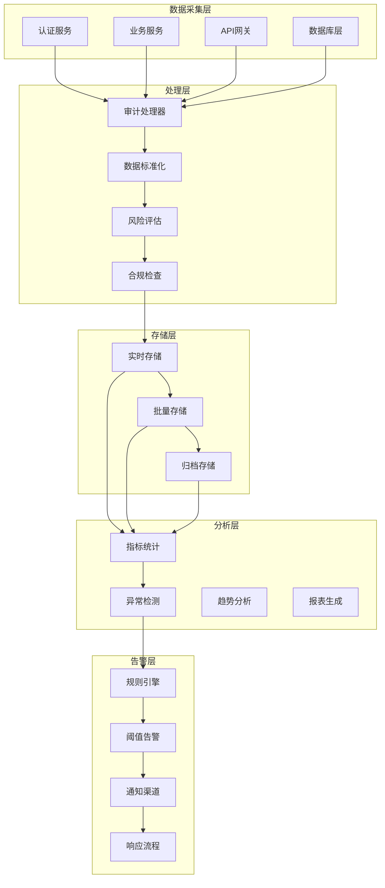

**图表来源**
- [login_audit_log.proto:16-26](file://backend/api/protos/audit/service/v1/login_audit_log.proto#L16-L26)
- [operation_audit_log.proto:16-26](file://backend/api/protos/audit/service/v1/operation_audit_log.proto#L16-L26)
- [api_audit_log.proto:18-28](file://backend/api/protos/audit/service/v1/api_audit_log.proto#L18-L28)

## 详细组件分析

### 登录审计日志组件

登录审计日志是系统安全的重要组成部分，专门用于监控用户身份验证过程：

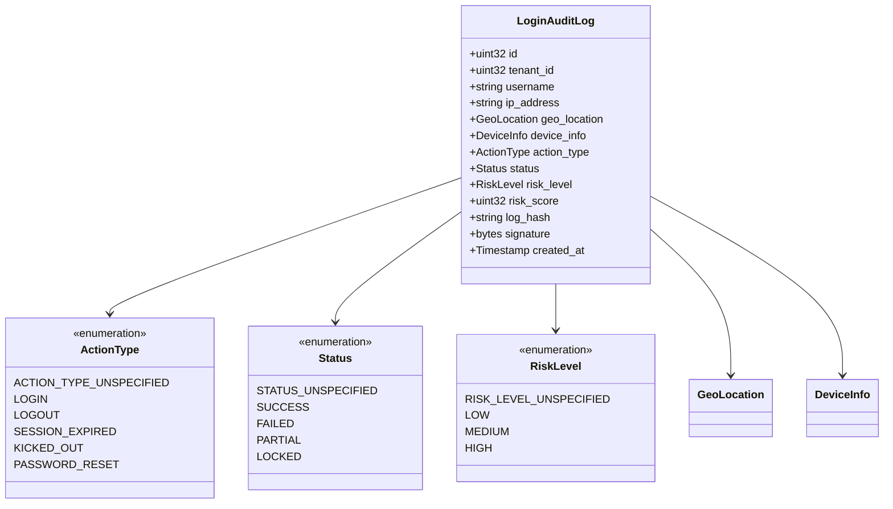

**图表来源**
- [login_audit_log.pb.go:29-190](file://backend/api/gen/go/audit/service/v1/login_audit_log.pb.go#L29-L190)

#### 风险评估机制

系统实现了多层次的风险评估机制：

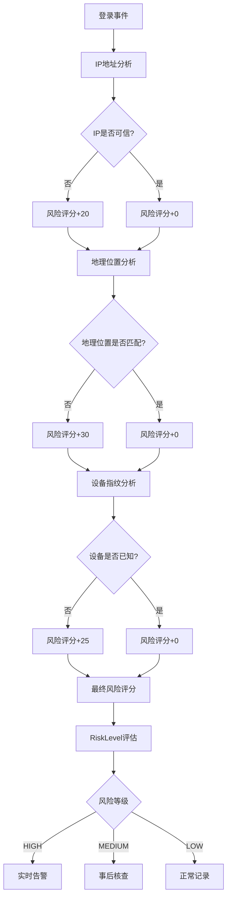

**图表来源**
- [login_audit_log.proto:51-70](file://backend/api/protos/audit/service/v1/login_audit_log.proto#L51-L70)

**章节来源**
- [login_audit_log.pb.go:29-190](file://backend/api/gen/go/audit/service/v1/login_audit_log.pb.go#L29-L190)
- [login_audit_log.proto:28-190](file://backend/api/protos/audit/service/v1/login_audit_log.proto#L28-L190)

### 操作审计日志组件

操作审计日志专注于记录用户对系统资源的具体操作：

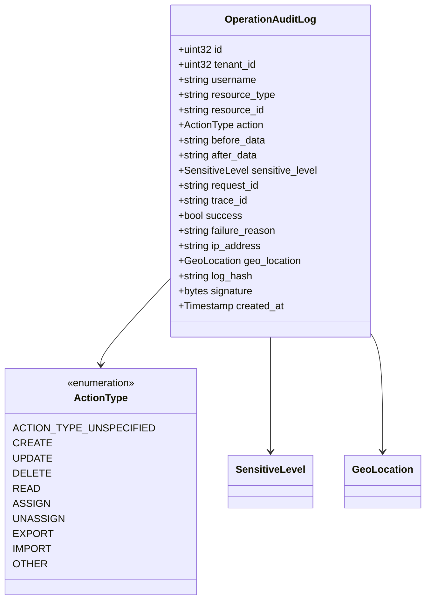

**图表来源**
- [operation_audit_log.pb.go:101-150](file://backend/api/gen/go/audit/service/v1/operation_audit_log.pb.go#L101-L150)

#### 数据变更追踪

系统提供了完整的数据变更追踪能力：

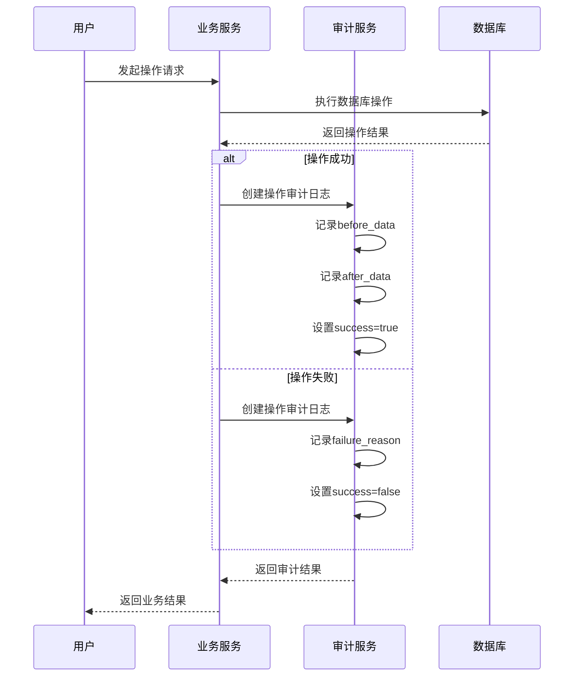

**图表来源**
- [operation_audit_log.proto:28-150](file://backend/api/protos/audit/service/v1/operation_audit_log.proto#L28-L150)

**章节来源**
- [operation_audit_log.pb.go:101-150](file://backend/api/gen/go/audit/service/v1/operation_audit_log.pb.go#L101-L150)
- [operation_audit_log.proto:28-150](file://backend/api/protos/audit/service/v1/operation_audit_log.proto#L28-L150)

### API审计日志组件

API审计日志提供了全面的API调用监控能力：

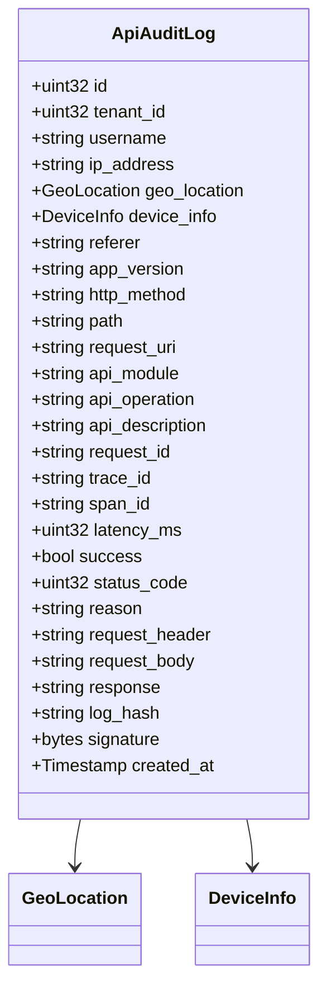

**图表来源**
- [api_audit_log.pb.go:31-64](file://backend/api/gen/go/audit/service/v1/api_audit_log.pb.go#L31-L64)

#### 性能监控集成

API审计日志与性能监控深度集成：

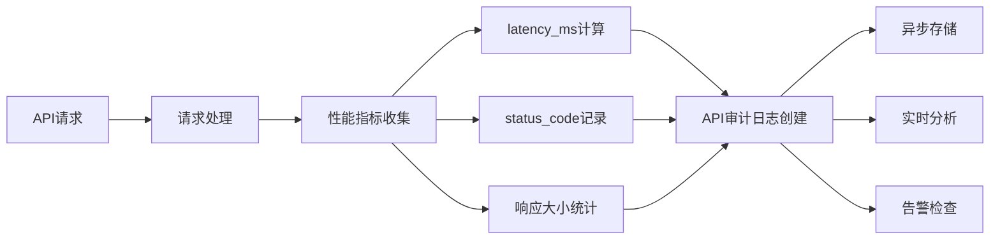

**图表来源**
- [api_audit_log.proto:131-146](file://backend/api/protos/audit/service/v1/api_audit_log.proto#L131-L146)

**章节来源**
- [api_audit_log.pb.go:31-64](file://backend/api/gen/go/audit/service/v1/api_audit_log.pb.go#L31-L64)
- [api_audit_log.proto:30-185](file://backend/api/protos/audit/service/v1/api_audit_log.proto#L30-L185)

### 数据访问审计日志组件

数据访问审计日志专注于数据库和存储系统的访问监控：

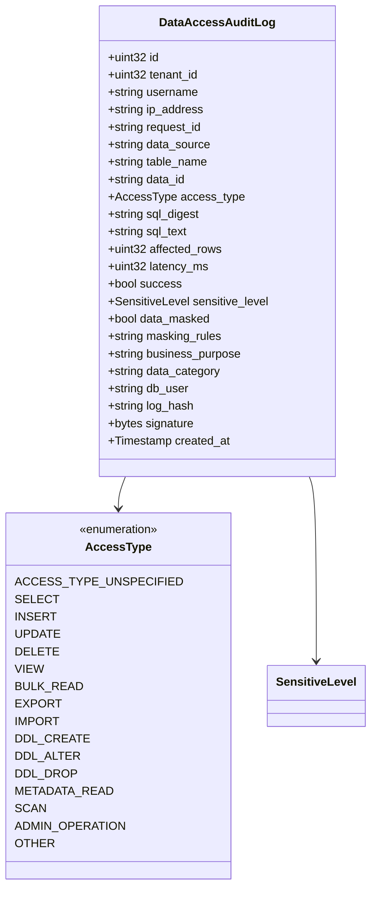

**图表来源**
- [data_access_audit_log.pb.go:123-152](file://backend/api/gen/go/audit/service/v1/data_access_audit_log.pb.go#L123-L152)

**章节来源**
- [data_access_audit_log.pb.go:123-152](file://backend/api/gen/go/audit/service/v1/data_access_audit_log.pb.go#L123-L152)

## 依赖关系分析

审计监控系统与其他组件的依赖关系如下：

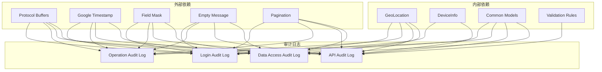

**图表来源**
- [login_audit_log.pb.go:9-21](file://backend/api/gen/go/audit/service/v1/login_audit_log.pb.go#L9-L21)
- [api_audit_log.pb.go:10-16](file://backend/api/gen/go/audit/service/v1/api_audit_log.pb.go#L10-L16)

**章节来源**
- [login_audit_log.pb.go:9-21](file://backend/api/gen/go/audit/service/v1/login_audit_log.pb.go#L9-L21)
- [operation_audit_log.pb.go:9-20](file://backend/api/gen/go/audit/service/v1/operation_audit_log.pb.go#L9-L20)
- [api_audit_log.pb.go:5-16](file://backend/api/gen/go/audit/service/v1/api_audit_log.pb.go#L5-L16)

## 性能考虑

### 存储优化策略

系统采用了多种存储优化策略来确保高性能：

1. **数据压缩**：审计日志在存储前进行压缩，减少存储空间占用
2. **分区策略**：按时间维度对审计日志进行分区，提高查询效率
3. **批量写入**：支持批量插入操作，减少数据库连接开销
4. **缓存机制**：热点审计数据缓存，提升读取性能

### 处理性能优化

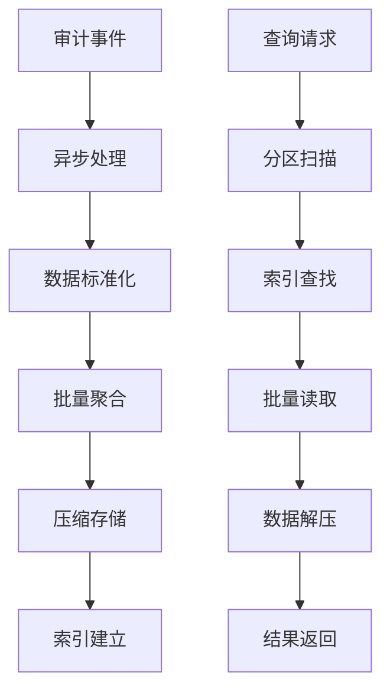

### 合规性考虑

系统满足多项合规性要求：

- **数据完整性**：通过数字签名和哈希值确保日志不可篡改
- **保留策略**：支持90天到永久的不同保留期限
- **隐私保护**：敏感数据脱敏和最小化收集原则
- **审计追踪**：完整的操作轨迹和责任追溯

## 故障排除指南

### 常见问题诊断

#### 审计日志缺失
1. **检查服务状态**：确认审计服务正常运行
2. **验证权限配置**：确保应用程序有写入权限
3. **检查网络连接**：验证与存储系统的连接状态
4. **查看日志级别**：确认审计日志未被过滤

#### 数据不一致
1. **验证哈希校验**：检查log_hash字段的完整性
2. **检查签名验证**：确认数字签名的有效性
3. **核对时间戳**：确保created_at字段正确
4. **比对业务数据**：验证审计数据与业务数据的一致性

#### 性能问题
1. **分析查询模式**：识别高频查询和慢查询
2. **检查索引使用**：验证相关字段的索引情况
3. **监控存储容量**：确保有足够的存储空间
4. **优化批量操作**：调整批量大小和频率

**章节来源**
- [common.pb.go:82-136](file://backend/api/gen/go/audit/service/v1/common.pb.go#L82-L136)

## 结论

审计监控功能模块为Go风力发电项目提供了全面的安全保障和合规支持。通过多维度的审计日志记录、智能的风险评估机制、完善的性能优化策略，系统能够有效防范安全威胁，满足监管要求，并为业务分析提供有价值的数据支持。

该模块的设计充分考虑了可扩展性、性能和安全性，在保证功能完整性的同时，也为未来的功能扩展和技术升级预留了充足的空间。通过持续的优化和改进，审计监控功能将成为系统安全运营的重要基石。