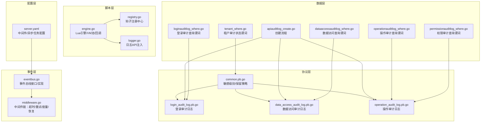
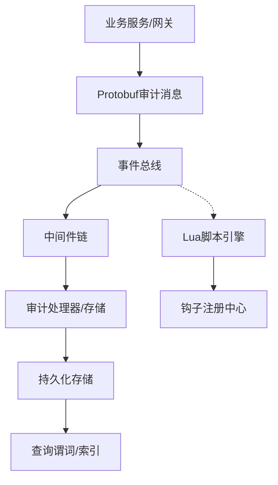
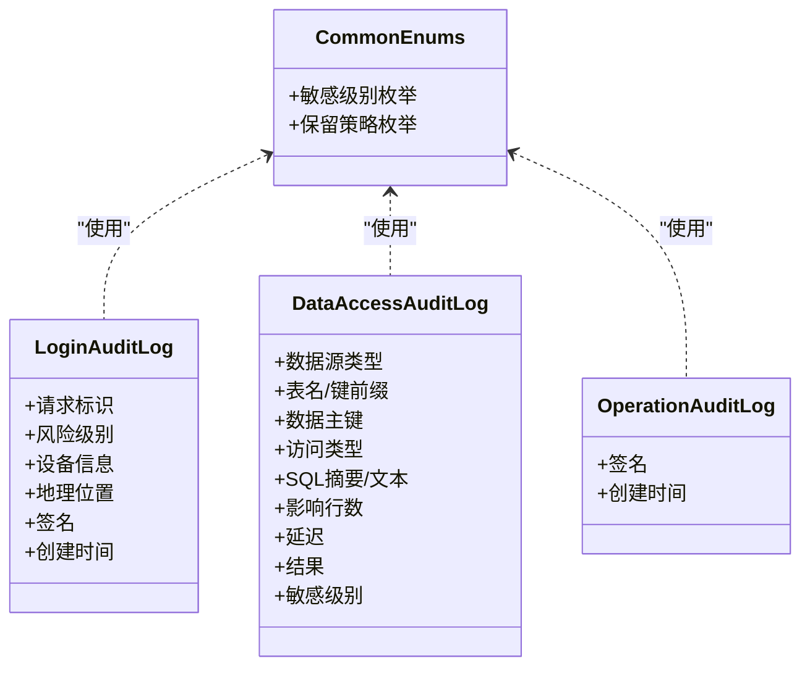
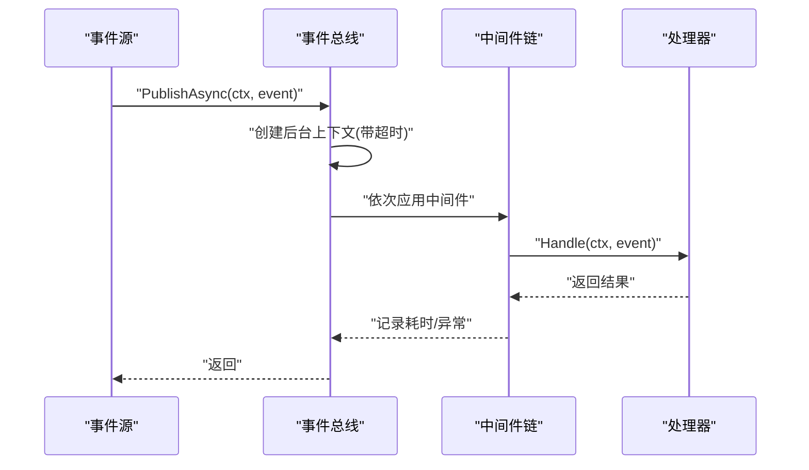
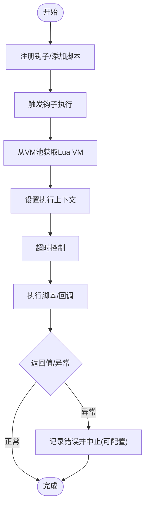
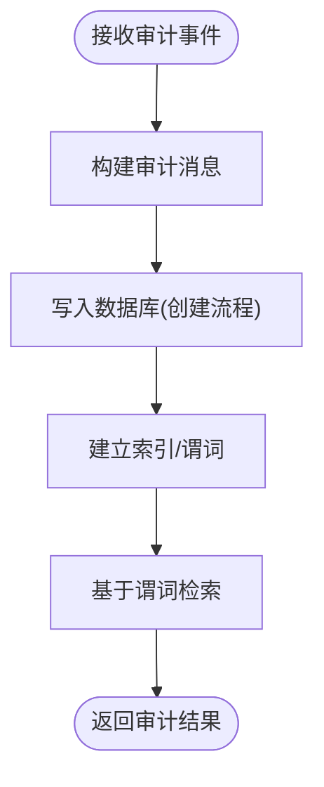
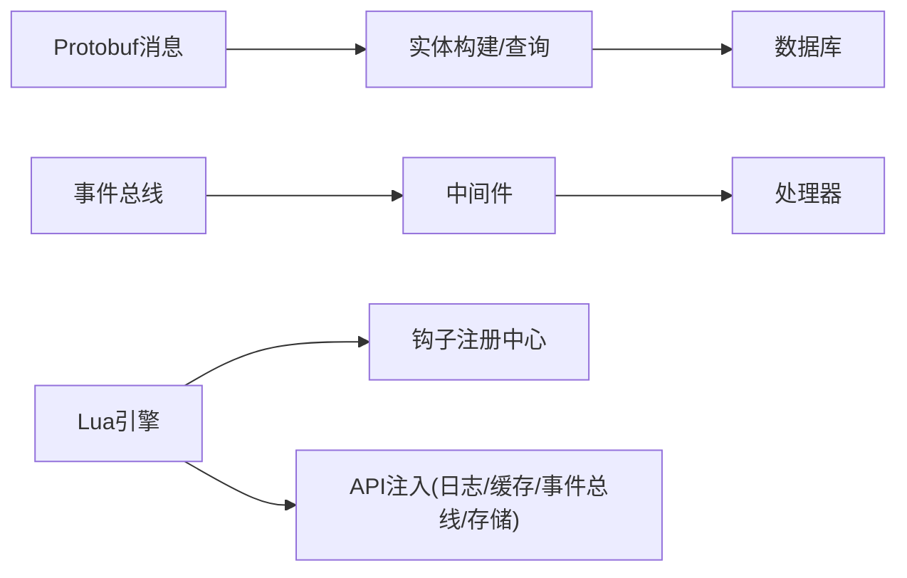

# 审计通用组件

<cite>
**本文引用的文件**
- [server.yaml](file://backend/app/admin/service/configs/server.yaml)
- [common.pb.go](file://backend/api/gen/go/audit/service/v1/common.pb.go)
- [login_audit_log.pb.go](file://backend/api/gen/go/audit/service/v1/login_audit_log.pb.go)
- [data_access_audit_log.pb.go](file://backend/api/gen/go/audit/service/v1/data_access_audit_log.pb.go)
- [operation_audit_log.pb.go](file://backend/api/gen/go/audit/service/v1/operation_audit_log.pb.go)
- [eventbus.go](file://backend/pkg/eventbus/eventbus.go)
- [middleware.go](file://backend/pkg/eventbus/middleware.go)
- [engine.go](file://backend/pkg/lua/engine.go)
- [registry.go](file://backend/pkg/lua/hook/registry.go)
- [logger.go](file://backend/pkg/lua/api/logger.go)
- [apiauditlog_create.go](file://backend/app/admin/service/internal/data/ent/apiauditlog_create.go)
- [loginauditlog_where.go](file://backend/app/admin/service/internal/data/ent/loginauditlog/where.go)
- [dataaccessauditlog_where.go](file://backend/app/admin/service/internal/data/ent/dataaccessauditlog/where.go)
- [operationauditlog_where.go](file://backend/app/admin/service/internal/data/ent/operationauditlog/where.go)
- [permissionauditlog_where.go](file://backend/app/admin/service/internal/data/ent/permissionauditlog/where.go)
- [tenant_where.go](file://backend/app/admin/service/internal/data/ent/tenant/where.go)
</cite>

## 目录
1. [引言](#引言)
2. [项目结构](#项目结构)
3. [核心组件](#核心组件)
4. [架构总览](#架构总览)
5. [详细组件分析](#详细组件分析)
6. [依赖分析](#依赖分析)
7. [性能考虑](#性能考虑)
8. [故障排查指南](#故障排查指南)
9. [结论](#结论)
10. [附录](#附录)

## 引言
本文件面向“审计通用组件”的设计与实现，系统性梳理审计中间件、日志格式标准化、审计数据传输协议、配置管理、扩展与插件化、以及性能与可靠性保障。文档以仓库中的生成式 Protobuf 消息、事件总线、脚本引擎与实体查询谓词为依据，结合配置文件，给出可落地的架构视图与实施建议。

## 项目结构
审计相关能力在后端模块中分布于以下位置：
- 配置层：服务端配置包含审计相关的中间件启用项与异步任务队列配置
- 协议层：审计服务的 Protobuf 消息定义（敏感级别、保留策略、各类审计日志）
- 事件层：事件总线接口与中间件，支持异步发布与可观测性增强
- 脚本层：Lua 引擎与钩子注册中心，提供审计事件钩子与扩展点
- 数据层：实体查询谓词与创建流程，支撑审计数据的持久化与检索

**图表来源**
- [server.yaml:1-49](file://backend/app/admin/service/configs/server.yaml#L1-L49)
- [common.pb.go:37-127](file://backend/api/gen/go/audit/service/v1/common.pb.go#L37-L127)
- [login_audit_log.pb.go:615-645](file://backend/api/gen/go/audit/service/v1/login_audit_log.pb.go#L615-L645)
- [data_access_audit_log.pb.go:109-532](file://backend/api/gen/go/audit/service/v1/data_access_audit_log.pb.go#L109-L532)
- [operation_audit_log.pb.go:121-125](file://backend/api/gen/go/audit/service/v1/operation_audit_log.pb.go#L121-L125)
- [eventbus.go:1-214](file://backend/pkg/eventbus/eventbus.go#L1-L214)
- [middleware.go:1-135](file://backend/pkg/eventbus/middleware.go#L1-L135)
- [engine.go:1-755](file://backend/pkg/lua/engine.go#L1-L755)
- [registry.go:1-74](file://backend/pkg/lua/hook/registry.go#L1-L74)
- [logger.go:1-111](file://backend/pkg/lua/api/logger.go#L1-L111)
- [apiauditlog_create.go:470-507](file://backend/app/admin/service/internal/data/ent/apiauditlog_create.go#L470-L507)
- [loginauditlog_where.go:652-685](file://backend/app/admin/service/internal/data/ent/loginauditlog/where.go#L652-L685)
- [dataaccessauditlog_where.go:277-310](file://backend/app/admin/service/internal/data/ent/dataaccessauditlog/where.go#L277-L310)
- [operationauditlog_where.go:247-740](file://backend/app/admin/service/internal/data/ent/operationauditlog/where.go#L247-L740)
- [permissionauditlog_where.go:107-820](file://backend/app/admin/service/internal/data/ent/permissionauditlog/where.go#L107-L820)
- [tenant_where.go:1002-1030](file://backend/app/admin/service/internal/data/ent/tenant/where.go#L1002-L1030)

**章节来源**
- [server.yaml:1-49](file://backend/app/admin/service/configs/server.yaml#L1-L49)
- [common.pb.go:37-127](file://backend/api/gen/go/audit/service/v1/common.pb.go#L37-L127)
- [eventbus.go:1-214](file://backend/pkg/eventbus/eventbus.go#L1-L214)
- [engine.go:1-755](file://backend/pkg/lua/engine.go#L1-L755)

## 核心组件
- 审计消息与格式
  - 敏感级别与保留策略：通过 Protobuf 枚举统一定义，确保跨服务一致的分级与合规保留周期
  - 登录、数据访问、操作审计日志：以结构化消息承载关键字段（如 trace_id、request_id、签名、时间戳等），便于序列化与传输
- 事件总线与中间件
  - 提供订阅/发布、一次性订阅、异步发布、关闭清理等能力；中间件链支持超时、重试、度量与恢复
- 脚本引擎与钩子
  - 基于 Lua 的可插拔执行环境，支持钩子注册、回调函数、上下文传递与模块注入（日志、缓存、事件总线、对象存储、加解密、工具集）
- 数据持久化与检索
  - 实体创建流程与查询谓词覆盖常见审计字段（如 trace_id、request_id、用户名、IP、设备信息、地理位置、敏感级别等）

**章节来源**
- [common.pb.go:37-127](file://backend/api/gen/go/audit/service/v1/common.pb.go#L37-L127)
- [login_audit_log.pb.go:615-645](file://backend/api/gen/go/audit/service/v1/login_audit_log.pb.go#L615-L645)
- [data_access_audit_log.pb.go:109-532](file://backend/api/gen/go/audit/service/v1/data_access_audit_log.pb.go#L109-L532)
- [operation_audit_log.pb.go:121-125](file://backend/api/gen/go/audit/service/v1/operation_audit_log.pb.go#L121-L125)
- [eventbus.go:1-214](file://backend/pkg/eventbus/eventbus.go#L1-L214)
- [middleware.go:1-135](file://backend/pkg/eventbus/middleware.go#L1-L135)
- [engine.go:1-755](file://backend/pkg/lua/engine.go#L1-L755)
- [registry.go:1-74](file://backend/pkg/lua/hook/registry.go#L1-L74)
- [logger.go:1-111](file://backend/pkg/lua/api/logger.go#L1-L111)
- [apiauditlog_create.go:470-507](file://backend/app/admin/service/internal/data/ent/apiauditlog_create.go#L470-L507)
- [loginauditlog_where.go:652-685](file://backend/app/admin/service/internal/data/ent/loginauditlog/where.go#L652-L685)
- [dataaccessauditlog_where.go:277-310](file://backend/app/admin/service/internal/data/ent/dataaccessauditlog/where.go#L277-L310)
- [operationauditlog_where.go:247-740](file://backend/app/admin/service/internal/data/ent/operationauditlog/where.go#L247-L740)
- [permissionauditlog_where.go:107-820](file://backend/app/admin/service/internal/data/ent/permissionauditlog/where.go#L107-L820)
- [tenant_where.go:1002-1030](file://backend/app/admin/service/internal/data/ent/tenant/where.go#L1002-L1030)

## 架构总览
审计通用组件采用“协议-事件-脚本-数据”分层架构：
- 协议层：以 Protobuf 消息定义审计数据结构，统一敏感级别与保留策略
- 事件层：通过事件总线实现异步解耦，中间件增强可靠性与可观测性
- 脚本层：Lua 引擎作为扩展平台，钩子注册中心提供事件钩子管理
- 数据层：实体创建与查询谓词支撑审计数据的入库与检索

**图表来源**
- [common.pb.go:37-127](file://backend/api/gen/go/audit/service/v1/common.pb.go#L37-L127)
- [eventbus.go:1-214](file://backend/pkg/eventbus/eventbus.go#L1-L214)
- [middleware.go:1-135](file://backend/pkg/eventbus/middleware.go#L1-L135)
- [engine.go:1-755](file://backend/pkg/lua/engine.go#L1-L755)
- [registry.go:1-74](file://backend/pkg/lua/hook/registry.go#L1-L74)

## 详细组件分析

### 审计消息与格式标准化
- 敏感级别与保留策略
  - 敏感级别枚举覆盖公开、内部、机密、绝密等等级，用于标识数据敏感程度
  - 保留策略枚举覆盖90/180/365天及永久等，满足不同合规场景
- 登录审计日志
  - 包含请求标识、风险级别、设备信息、地理位置、签名、创建时间等字段
- 数据访问审计日志
  - 包含数据源类型、表名/键前缀、数据主键、访问类型、SQL摘要/文本、影响行数、延迟、结果、敏感级别等
- 操作审计日志
  - 包含签名、创建时间等字段，便于完整性校验与溯源

**图表来源**
- [common.pb.go:37-127](file://backend/api/gen/go/audit/service/v1/common.pb.go#L37-L127)
- [login_audit_log.pb.go:615-645](file://backend/api/gen/go/audit/service/v1/login_audit_log.pb.go#L615-L645)
- [data_access_audit_log.pb.go:109-532](file://backend/api/gen/go/audit/service/v1/data_access_audit_log.pb.go#L109-L532)
- [operation_audit_log.pb.go:121-125](file://backend/api/gen/go/audit/service/v1/operation_audit_log.pb.go#L121-L125)

**章节来源**
- [common.pb.go:37-127](file://backend/api/gen/go/audit/service/v1/common.pb.go#L37-L127)
- [login_audit_log.pb.go:615-645](file://backend/api/gen/go/audit/service/v1/login_audit_log.pb.go#L615-L645)
- [data_access_audit_log.pb.go:109-532](file://backend/api/gen/go/audit/service/v1/data_access_audit_log.pb.go#L109-L532)
- [operation_audit_log.pb.go:121-125](file://backend/api/gen/go/audit/service/v1/operation_audit_log.pb.go#L121-L125)

### 事件总线与中间件
- 事件总线接口
  - 支持订阅、一次性订阅、异步订阅、取消订阅、发布、异步发布与关闭
- 中间件链
  - 提供日志、恢复、超时、重试、指标等中间件，可按需组合
- 异步发布
  - 使用独立后台上下文与超时，避免调用方取消影响异步任务

**图表来源**
- [eventbus.go:154-167](file://backend/pkg/eventbus/eventbus.go#L154-L167)
- [middleware.go:107-114](file://backend/pkg/eventbus/middleware.go#L107-L114)

**章节来源**
- [eventbus.go:1-214](file://backend/pkg/eventbus/eventbus.go#L1-L214)
- [middleware.go:1-135](file://backend/pkg/eventbus/middleware.go#L1-L135)

### 脚本引擎与钩子扩展
- Lua引擎
  - VM池化复用、超时控制、专用VM标记、模块注入（日志、缓存、事件总线、对象存储、加密、工具）
  - 支持钩子注册、回调函数、上下文传递与脚本执行
- 钩子注册中心
  - 动态注册钩子点、添加/移除脚本、列出钩子、自动注册未存在钩子
- 日志API注入
  - 向Lua暴露 info/warn/error/debug 及格式化输出接口，便于脚本侧记录审计轨迹

**图表来源**
- [engine.go:330-398](file://backend/pkg/lua/engine.go#L330-L398)
- [registry.go:43-74](file://backend/pkg/lua/hook/registry.go#L43-L74)
- [logger.go:25-111](file://backend/pkg/lua/api/logger.go#L25-L111)

**章节来源**
- [engine.go:1-755](file://backend/pkg/lua/engine.go#L1-L755)
- [registry.go:1-74](file://backend/pkg/lua/hook/registry.go#L1-L74)
- [logger.go:1-111](file://backend/pkg/lua/api/logger.go#L1-L111)

### 数据持久化与检索
- 创建流程
  - 统一设置创建时间、租户ID、用户ID/名称、IP地址、地理信息、设备信息等字段
- 查询谓词
  - 登录审计：trace_id、action_type、风险级别等
  - 数据访问审计：用户ID、请求ID、敏感级别等
  - 操作审计：用户ID、请求ID、敏感级别等
  - 权限审计：日志哈希、签名、创建时间、原因等
  - 租户：审计状态等

**图表来源**
- [apiauditlog_create.go:470-507](file://backend/app/admin/service/internal/data/ent/apiauditlog_create.go#L470-L507)
- [loginauditlog_where.go:652-685](file://backend/app/admin/service/internal/data/ent/loginauditlog/where.go#L652-L685)
- [dataaccessauditlog_where.go:277-310](file://backend/app/admin/service/internal/data/ent/dataaccessauditlog/where.go#L277-L310)
- [operationauditlog_where.go:247-740](file://backend/app/admin/service/internal/data/ent/operationauditlog/where.go#L247-L740)
- [permissionauditlog_where.go:107-820](file://backend/app/admin/service/internal/data/ent/permissionauditlog/where.go#L107-L820)
- [tenant_where.go:1002-1030](file://backend/app/admin/service/internal/data/ent/tenant/where.go#L1002-L1030)

**章节来源**
- [apiauditlog_create.go:470-507](file://backend/app/admin/service/internal/data/ent/apiauditlog_create.go#L470-L507)
- [loginauditlog_where.go:652-685](file://backend/app/admin/service/internal/data/ent/loginauditlog/where.go#L652-L685)
- [dataaccessauditlog_where.go:277-310](file://backend/app/admin/service/internal/data/ent/dataaccessauditlog/where.go#L277-L310)
- [operationauditlog_where.go:247-740](file://backend/app/admin/service/internal/data/ent/operationauditlog/where.go#L247-L740)
- [permissionauditlog_where.go:107-820](file://backend/app/admin/service/internal/data/ent/permissionauditlog/where.go#L107-L820)
- [tenant_where.go:1002-1030](file://backend/app/admin/service/internal/data/ent/tenant/where.go#L1002-L1030)

## 依赖分析
- 组件耦合
  - 事件总线与中间件低耦合，可通过配置启用/禁用中间件
  - Lua引擎与钩子注册中心松耦合，通过接口交互
  - Protobuf消息与数据层通过实体构建器对接，字段映射清晰
- 外部依赖
  - Redis（脚本缓存）、Kratos 日志、Gopher-Lua、go-redis 等

**图表来源**
- [engine.go:191-261](file://backend/pkg/lua/engine.go#L191-L261)
- [registry.go:30-74](file://backend/pkg/lua/hook/registry.go#L30-L74)
- [eventbus.go:12-34](file://backend/pkg/eventbus/eventbus.go#L12-L34)

**章节来源**
- [engine.go:191-261](file://backend/pkg/lua/engine.go#L191-L261)
- [registry.go:30-74](file://backend/pkg/lua/hook/registry.go#L30-L74)
- [eventbus.go:12-34](file://backend/pkg/eventbus/eventbus.go#L12-L34)

## 性能考虑
- 异步处理
  - 事件总线支持异步发布，避免阻塞主流程
- 缓冲与批处理
  - 可在处理器侧引入缓冲队列与批处理策略，降低写库压力
- 超时与重试
  - 中间件提供超时与重试，提升稳定性
- VM池化
  - Lua引擎使用VM池减少频繁创建销毁开销
- 序列化与压缩
  - Protobuf二进制序列化高效；对大字段（如地理位置、设备信息）可考虑压缩或外部引用

[本节为通用指导，无需特定文件引用]

## 故障排查指南
- 事件总线
  - 发布失败：检查总线是否已关闭、处理器错误日志、一次性处理器执行后清理
  - 异步发布：确认后台上下文超时设置合理
- 中间件
  - 超时错误：调整超时中间件参数或优化处理器逻辑
  - 恐慌恢复：查看恢复中间件记录的panic信息
  - 指标收集：通过度量中间件观察处理耗时与成功率
- Lua脚本
  - 执行超时：检查脚本复杂度与超时配置，必要时拆分任务
  - 回调返回false：脚本可主动中止后续处理，需检查业务逻辑
  - 钩子未触发：确认钩子已注册且脚本启用
- 数据层
  - 字段解析：关注JSON反序列化失败（如地理位置、设备信息）
  - 查询谓词：核对字段类型与空值判断，避免误判

**章节来源**
- [eventbus.go:106-152](file://backend/pkg/eventbus/eventbus.go#L106-L152)
- [middleware.go:44-88](file://backend/pkg/eventbus/middleware.go#L44-L88)
- [engine.go:263-328](file://backend/pkg/lua/engine.go#L263-L328)
- [engine.go:400-444](file://backend/pkg/lua/engine.go#L400-L444)
- [dataaccessauditlog_where.go:149-164](file://backend/app/admin/service/internal/data/ent/dataaccessauditlog/where.go#L149-L164)

## 结论
审计通用组件通过“协议-事件-脚本-数据”分层设计，实现了跨服务的审计消息标准化、异步可靠处理、灵活扩展与可观测性增强。结合配置管理与中间件链，可在保证性能的同时满足合规与安全要求。

[本节为总结，无需特定文件引用]

## 附录

### 配置管理要点
- 中间件启用
  - 在服务配置中启用日志、恢复、追踪、验证、熔断、元数据等中间件
- 异步任务队列
  - 配置Redis连接、编码方式、并发度、队列优先级与位置信息
- SSE
  - 配置事件推送地址、编码方式、路径与自动流式行为

**章节来源**
- [server.yaml:1-49](file://backend/app/admin/service/configs/server.yaml#L1-L49)

### 审计数据传输协议
- Protobuf消息
  - 统一字段命名与类型，确保序列化/反序列化一致性
  - 对大字段采用外部存储或引用，减少消息体积
- JSON/二进制
  - 地理位置、设备信息等可采用JSON字符串或二进制编码，注意版本兼容与迁移

**章节来源**
- [common.pb.go:37-127](file://backend/api/gen/go/audit/service/v1/common.pb.go#L37-L127)
- [data_access_audit_log.pb.go:109-532](file://backend/api/gen/go/audit/service/v1/data_access_audit_log.pb.go#L109-L532)

### 扩展与插件化
- 自定义审计处理器
  - 通过事件总线订阅相应事件类型，实现差异化处理
- 审计事件钩子
  - 使用Lua钩子注册中心动态注册脚本，支持优先级与启用控制
- 审计数据过滤器
  - 在脚本中实现过滤逻辑，或在处理器侧进行预处理

**章节来源**
- [eventbus.go:12-34](file://backend/pkg/eventbus/eventbus.go#L12-L34)
- [registry.go:43-74](file://backend/pkg/lua/hook/registry.go#L43-L74)
- [engine.go:330-398](file://backend/pkg/lua/engine.go#L330-L398)