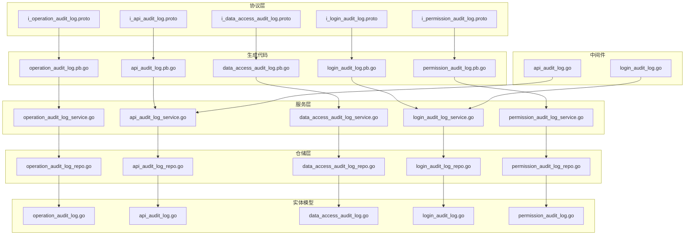
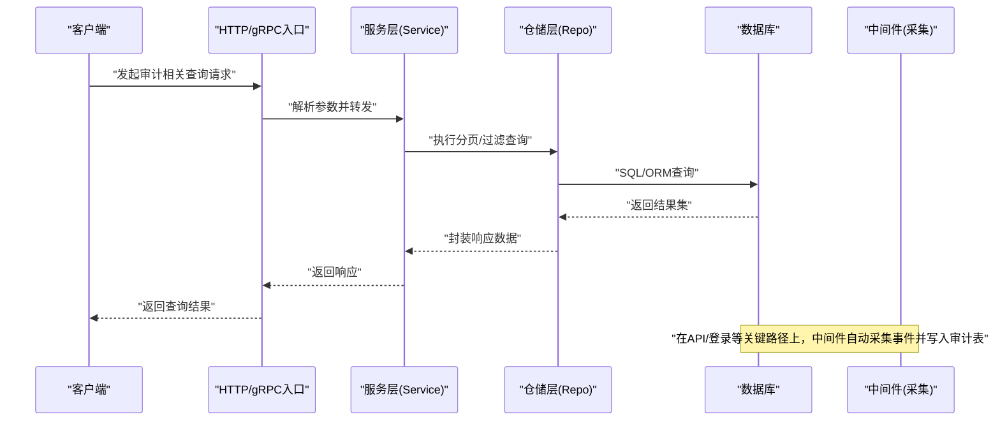
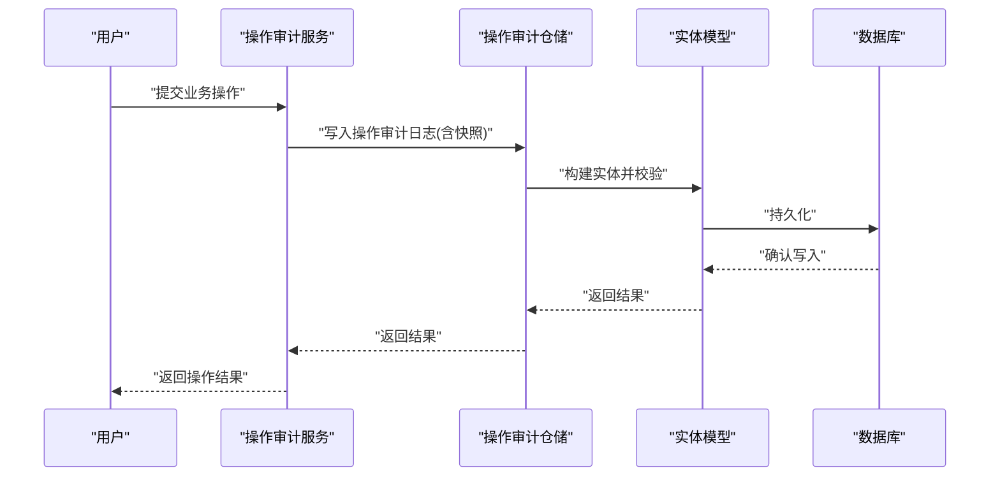
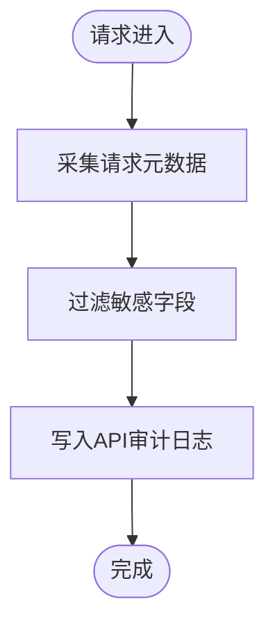
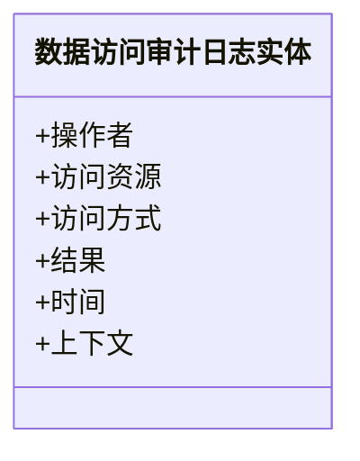
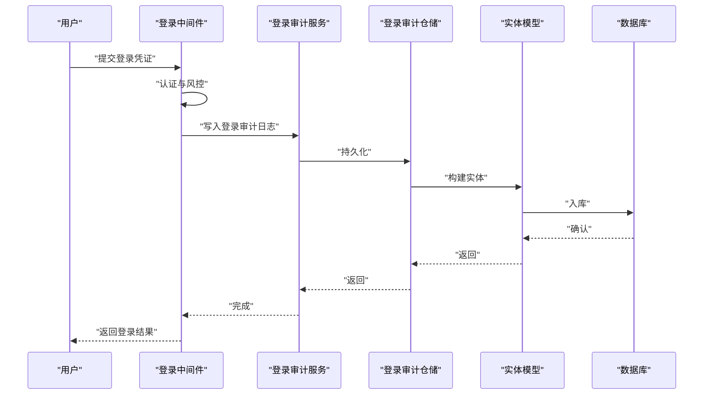
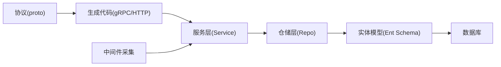

# 操作审计日志

<cite>
**本文引用的文件**
- [i_operation_audit_log.proto](file://backend/api/protos/admin/service/v1/i_operation_audit_log.proto)
- [i_api_audit_log.proto](file://backend/api/protos/admin/service/v1/i_api_audit_log.proto)
- [i_data_access_audit_log.proto](file://backend/api/protos/admin/service/v1/i_data_access_audit_log.proto)
- [i_login_audit_log.proto](file://backend/api/protos/admin/service/v1/i_login_audit_log.proto)
- [i_permission_audit_log.proto](file://backend/api/protos/admin/service/v1/i_permission_audit_log.proto)
- [operation_audit_log.pb.go](file://backend/api/gen/go/audit/service/v1/operation_audit_log.pb.go)
- [api_audit_log.pb.go](file://backend/api/gen/go/audit/service/v1/api_audit_log.pb.go)
- [data_access_audit_log.pb.go](file://backend/api/gen/go/audit/service/v1/data_access_audit_log.pb.go)
- [login_audit_log.pb.go](file://backend/api/gen/go/audit/service/v1/login_audit_log.pb.go)
- [permission_audit_log.pb.go](file://backend/api/gen/go/audit/service/v1/permission_audit_log.pb.go)
- [operation_audit_log_repo.go](file://backend/app/admin/service/internal/data/operation_audit_log_repo.go)
- [api_audit_log_repo.go](file://backend/app/admin/service/internal/data/api_audit_log_repo.go)
- [data_access_audit_log_repo.go](file://backend/app/admin/service/internal/data/data_access_audit_log_repo.go)
- [login_audit_log_repo.go](file://backend/app/admin/service/internal/data/login_audit_log_repo.go)
- [permission_audit_log_repo.go](file://backend/app/admin/service/internal/data/permission_audit_log_repo.go)
- [operation_audit_log_service.go](file://backend/app/admin/service/internal/service/operation_audit_log_service.go)
- [api_audit_log_service.go](file://backend/app/admin/service/internal/service/api_audit_log_service.go)
- [data_access_audit_log_service.go](file://backend/app/admin/service/internal/service/data_access_audit_log_service.go)
- [login_audit_log_service.go](file://backend/app/admin/service/internal/service/login_audit_log_service.go)
- [permission_audit_log_service.go](file://backend/app/admin/service/internal/service/permission_audit_log_service.go)
- [operation_audit_log.go](file://backend/app/admin/service/internal/data/ent/schema/operation_audit_log.go)
- [api_audit_log.go](file://backend/app/admin/service/internal/data/ent/schema/api_audit_log.go)
- [data_access_audit_log.go](file://backend/app/admin/service/internal/data/ent/schema/data_access_audit_log.go)
- [login_audit_log.go](file://backend/app/admin/service/internal/data/ent/schema/login_audit_log.go)
- [permission_audit_log.go](file://backend/app/admin/service/internal/data/ent/schema/permission_audit_log.go)
- [api_audit_log.go](file://backend/pkg/middleware/logging/api_audit_log.go)
- [login_audit_log.go](file://backend/pkg/middleware/logging/login_audit_log.go)
</cite>

## 目录
1. [简介](#简介)
2. [项目结构](#项目结构)
3. [核心组件](#核心组件)
4. [架构总览](#架构总览)
5. [详细组件分析](#详细组件分析)
6. [依赖关系分析](#依赖关系分析)
7. [性能与存储策略](#性能与存储策略)
8. [合规性与安全](#合规性与安全)
9. [故障排查指南](#故障排查指南)
10. [结论](#结论)

## 简介
本文件围绕操作审计日志（以及API审计、数据访问审计、登录审计、权限变更审计）在后端系统中的实现与使用进行系统化说明。内容涵盖：
- 审计日志记录机制：如何捕获用户在系统中的操作行为（新增、修改、删除、查询等），并生成可追溯的日志条目。
- 审计数据结构设计：操作类型、操作对象、操作前后数据快照、操作者信息、操作时间、操作原因等字段的定义与来源。
- 查询与分析能力：支持分页列表、详情查询、按条件过滤、跨表关联分析等能力。
- 合规性要求：数据完整性保护、操作授权验证、审计证据保存等。
- 性能优化与存储策略：增量记录、数据压缩、长期归档等。

## 项目结构
审计相关能力由“协议层（proto）—生成代码（gRPC/HTTP）—仓储层（Repo）—服务层（Service）—实体模型（Ent Schema）—中间件（日志采集）”构成，形成清晰的分层架构。

图表来源
- [i_operation_audit_log.proto:11-26](file://backend/api/protos/admin/service/v1/i_operation_audit_log.proto#L11-L26)
- [i_api_audit_log.proto:11-26](file://backend/api/protos/admin/service/v1/i_api_audit_log.proto#L11-L26)
- [i_data_access_audit_log.proto:11-26](file://backend/api/protos/admin/service/v1/i_data_access_audit_log.proto#L11-L26)
- [i_login_audit_log.proto:12-27](file://backend/api/protos/admin/service/v1/i_login_audit_log.proto#L12-L27)
- [i_permission_audit_log.proto:10-25](file://backend/api/protos/admin/service/v1/i_permission_audit_log.proto#L10-L25)
- [operation_audit_log.pb.go](file://backend/api/gen/go/audit/service/v1/operation_audit_log.pb.go)
- [api_audit_log.pb.go](file://backend/api/gen/go/audit/service/v1/api_audit_log.pb.go)
- [data_access_audit_log.pb.go](file://backend/api/gen/go/audit/service/v1/data_access_audit_log.pb.go)
- [login_audit_log.pb.go](file://backend/api/gen/go/audit/service/v1/login_audit_log.pb.go)
- [permission_audit_log.pb.go](file://backend/api/gen/go/audit/service/v1/permission_audit_log.pb.go)
- [operation_audit_log_service.go](file://backend/app/admin/service/internal/service/operation_audit_log_service.go)
- [api_audit_log_service.go](file://backend/app/admin/service/internal/service/api_audit_log_service.go)
- [data_access_audit_log_service.go](file://backend/app/admin/service/internal/service/data_access_audit_log_service.go)
- [login_audit_log_service.go](file://backend/app/admin/service/internal/service/login_audit_log_service.go)
- [permission_audit_log_service.go](file://backend/app/admin/service/internal/service/permission_audit_log_service.go)
- [operation_audit_log_repo.go](file://backend/app/admin/service/internal/data/operation_audit_log_repo.go)
- [api_audit_log_repo.go](file://backend/app/admin/service/internal/data/api_audit_log_repo.go)
- [data_access_audit_log_repo.go](file://backend/app/admin/service/internal/data/data_access_audit_log_repo.go)
- [login_audit_log_repo.go](file://backend/app/admin/service/internal/data/login_audit_log_repo.go)
- [permission_audit_log_repo.go](file://backend/app/admin/service/internal/data/permission_audit_log_repo.go)
- [operation_audit_log.go](file://backend/app/admin/service/internal/data/ent/schema/operation_audit_log.go)
- [api_audit_log.go](file://backend/app/admin/service/internal/data/ent/schema/api_audit_log.go)
- [data_access_audit_log.go](file://backend/app/admin/service/internal/data/ent/schema/data_access_audit_log.go)
- [login_audit_log.go](file://backend/app/admin/service/internal/data/ent/schema/login_audit_log.go)
- [permission_audit_log.go](file://backend/app/admin/service/internal/data/ent/schema/permission_audit_log.go)
- [api_audit_log.go](file://backend/pkg/middleware/logging/api_audit_log.go)
- [login_audit_log.go](file://backend/pkg/middleware/logging/login_audit_log.go)

章节来源
- [i_operation_audit_log.proto:11-26](file://backend/api/protos/admin/service/v1/i_operation_audit_log.proto#L11-L26)
- [i_api_audit_log.proto:11-26](file://backend/api/protos/admin/service/v1/i_api_audit_log.proto#L11-L26)
- [i_data_access_audit_log.proto:11-26](file://backend/api/protos/admin/service/v1/i_data_access_audit_log.proto#L11-L26)
- [i_login_audit_log.proto:12-27](file://backend/api/protos/admin/service/v1/i_login_audit_log.proto#L12-L27)
- [i_permission_audit_log.proto:10-25](file://backend/api/protos/admin/service/v1/i_permission_audit_log.proto#L10-L25)

## 核心组件
- 协议与接口
  - 操作审计日志：提供列表与详情查询接口，支持分页。
  - API审计日志：提供列表与详情查询接口，支持分页。
  - 数据访问审计日志：提供列表与详情查询接口，支持分页。
  - 登录审计日志：提供列表与详情查询接口，支持分页。
  - 权限变更审计日志：提供列表与详情查询接口，支持分页。
- 生成代码与路由
  - gRPC/HTTP映射到REST风格路径，便于前端调用与统一网关处理。
- 服务层
  - 负责业务编排、参数校验、调用仓储层获取数据、返回响应。
- 仓储层
  - 封装数据库访问逻辑，提供分页查询、条件过滤、聚合统计等能力。
- 实体模型（Ent Schema）
  - 定义审计日志的数据结构、索引、约束，确保数据一致性与可检索性。
- 中间件采集
  - 在API请求与登录流程中自动采集审计事件，写入对应审计表。

章节来源
- [i_operation_audit_log.proto:11-26](file://backend/api/protos/admin/service/v1/i_operation_audit_log.proto#L11-L26)
- [i_api_audit_log.proto:11-26](file://backend/api/protos/admin/service/v1/i_api_audit_log.proto#L11-L26)
- [i_data_access_audit_log.proto:11-26](file://backend/api/protos/admin/service/v1/i_data_access_audit_log.proto#L11-L26)
- [i_login_audit_log.proto:12-27](file://backend/api/protos/admin/service/v1/i_login_audit_log.proto#L12-L27)
- [i_permission_audit_log.proto:10-25](file://backend/api/protos/admin/service/v1/i_permission_audit_log.proto#L10-L25)

## 架构总览
下图展示从HTTP请求到审计日志落库的整体链路，以及各层之间的交互关系。

图表来源
- [operation_audit_log_service.go](file://backend/app/admin/service/internal/service/operation_audit_log_service.go)
- [api_audit_log_service.go](file://backend/app/admin/service/internal/service/api_audit_log_service.go)
- [data_access_audit_log_service.go](file://backend/app/admin/service/internal/service/data_access_audit_log_service.go)
- [login_audit_log_service.go](file://backend/app/admin/service/internal/service/login_audit_log_service.go)
- [permission_audit_log_service.go](file://backend/app/admin/service/internal/service/permission_audit_log_service.go)
- [operation_audit_log_repo.go](file://backend/app/admin/service/internal/data/operation_audit_log_repo.go)
- [api_audit_log_repo.go](file://backend/app/admin/service/internal/data/api_audit_log_repo.go)
- [data_access_audit_log_repo.go](file://backend/app/admin/service/internal/data/data_access_audit_log_repo.go)
- [login_audit_log_repo.go](file://backend/app/admin/service/internal/data/login_audit_log_repo.go)
- [permission_audit_log_repo.go](file://backend/app/admin/service/internal/data/permission_audit_log_repo.go)
- [api_audit_log.go](file://backend/pkg/middleware/logging/api_audit_log.go)
- [login_audit_log.go](file://backend/pkg/middleware/logging/login_audit_log.go)

## 详细组件分析

### 操作审计日志（Operation Audit Log）
- 接口与路由
  - 列表查询：支持分页请求，返回审计日志列表。
  - 详情查询：根据ID返回单条审计日志。
- 数据结构与字段
  - 操作类型：标识具体操作类别（新增、修改、删除、查询等）。
  - 操作对象：被操作的资源标识（如实体ID、表名等）。
  - 操作前后快照：记录变更前后的数据状态，便于回溯与对比。
  - 操作者信息：包含操作人ID、角色、租户等上下文。
  - 操作时间：精确到毫秒或微秒的时间戳。
  - 操作原因：可选的备注字段，用于说明操作背景或审批信息。
  - 其他：IP地址、UA、设备信息、会话ID等上下文信息。
- 查询与分析
  - 支持按操作类型、操作对象、操作者、时间范围、关键词等多维过滤。
  - 支持操作轨迹追踪：通过主键与时间序列还原用户操作链路。
  - 支持批量操作审计：对同一对象的多次操作进行聚合分析。
- 中间件采集
  - 在关键业务流程中插入采集点，自动生成操作审计日志。

图表来源
- [operation_audit_log_service.go](file://backend/app/admin/service/internal/service/operation_audit_log_service.go)
- [operation_audit_log_repo.go](file://backend/app/admin/service/internal/data/operation_audit_log_repo.go)
- [operation_audit_log.go](file://backend/app/admin/service/internal/data/ent/schema/operation_audit_log.go)

章节来源
- [i_operation_audit_log.proto:11-26](file://backend/api/protos/admin/service/v1/i_operation_audit_log.proto#L11-L26)
- [operation_audit_log_service.go](file://backend/app/admin/service/internal/service/operation_audit_log_service.go)
- [operation_audit_log_repo.go](file://backend/app/admin/service/internal/data/operation_audit_log_repo.go)
- [operation_audit_log.go](file://backend/app/admin/service/internal/data/ent/schema/operation_audit_log.go)

### API审计日志（API Audit Log）
- 记录维度
  - 请求路径、方法、状态码、耗时、错误码等。
  - 请求头、请求体摘要、响应体摘要（敏感字段脱敏）。
  - 操作者身份、租户、会话上下文。
- 查询与分析
  - 支持按接口、状态、耗时、时间范围等筛选。
  - 支持异常趋势分析、接口调用画像、重试与失败定位。

图表来源
- [api_audit_log.go](file://backend/pkg/middleware/logging/api_audit_log.go)
- [api_audit_log_service.go](file://backend/app/admin/service/internal/service/api_audit_log_service.go)
- [api_audit_log_repo.go](file://backend/app/admin/service/internal/data/api_audit_log_repo.go)
- [api_audit_log.go](file://backend/app/admin/service/internal/data/ent/schema/api_audit_log.go)

章节来源
- [i_api_audit_log.proto:11-26](file://backend/api/protos/admin/service/v1/i_api_audit_log.proto#L11-L26)
- [api_audit_log.go](file://backend/pkg/middleware/logging/api_audit_log.go)
- [api_audit_log_service.go](file://backend/app/admin/service/internal/service/api_audit_log_service.go)
- [api_audit_log_repo.go](file://backend/app/admin/service/internal/data/api_audit_log_repo.go)
- [api_audit_log.go](file://backend/app/admin/service/internal/data/ent/schema/api_audit_log.go)

### 数据访问审计日志（Data Access Audit Log）
- 记录维度
  - 访问的资源类型与标识、访问方式（读取、导出等）、访问结果。
  - 操作者、时间、IP、UA、设备信息。
- 分析能力
  - 高频访问识别、异常导出预警、越权访问检测。

图表来源
- [data_access_audit_log_service.go](file://backend/app/admin/service/internal/service/data_access_audit_log_service.go)
- [data_access_audit_log_repo.go](file://backend/app/admin/service/internal/data/data_access_audit_log_repo.go)
- [data_access_audit_log.go](file://backend/app/admin/service/internal/data/ent/schema/data_access_audit_log.go)

章节来源
- [i_data_access_audit_log.proto:11-26](file://backend/api/protos/admin/service/v1/i_data_access_audit_log.proto#L11-L26)
- [data_access_audit_log_service.go](file://backend/app/admin/service/internal/service/data_access_audit_log_service.go)
- [data_access_audit_log_repo.go](file://backend/app/admin/service/internal/data/data_access_audit_log_repo.go)
- [data_access_audit_log.go](file://backend/app/admin/service/internal/data/ent/schema/data_access_audit_log.go)

### 登录审计日志（Login Audit Log）
- 记录维度
  - 登录账号、IP、UA、地理位置、设备信息、结果（成功/失败）、失败原因。
- 分析能力
  - 异常登录检测、暴力破解识别、高风险登录告警。

图表来源
- [login_audit_log.go](file://backend/pkg/middleware/logging/login_audit_log.go)
- [login_audit_log_service.go](file://backend/app/admin/service/internal/service/login_audit_log_service.go)
- [login_audit_log_repo.go](file://backend/app/admin/service/internal/data/login_audit_log_repo.go)
- [login_audit_log.go](file://backend/app/admin/service/internal/data/ent/schema/login_audit_log.go)

章节来源
- [i_login_audit_log.proto:12-27](file://backend/api/protos/admin/service/v1/i_login_audit_log.proto#L12-L27)
- [login_audit_log.go](file://backend/pkg/middleware/logging/login_audit_log.go)
- [login_audit_log_service.go](file://backend/app/admin/service/internal/service/login_audit_log_service.go)
- [login_audit_log_repo.go](file://backend/app/admin/service/internal/data/login_audit_log_repo.go)
- [login_audit_log.go](file://backend/app/admin/service/internal/data/ent/schema/login_audit_log.go)

### 权限变更审计日志（Permission Audit Log）
- 记录维度
  - 变更主体（用户/角色/组织单元）、变更类型（授权/撤销）、生效范围、操作者、时间、原因。
- 分析能力
  - 权限漂移检测、批量授权审计、合规性检查。

章节来源
- [i_permission_audit_log.proto:10-25](file://backend/api/protos/admin/service/v1/i_permission_audit_log.proto#L10-L25)
- [permission_audit_log_service.go](file://backend/app/admin/service/internal/service/permission_audit_log_service.go)
- [permission_audit_log_repo.go](file://backend/app/admin/service/internal/data/permission_audit_log_repo.go)
- [permission_audit_log.go](file://backend/app/admin/service/internal/data/ent/schema/permission_audit_log.go)

## 依赖关系分析
- 协议到实现
  - proto定义的服务接口映射到gRPC/HTTP，再由服务层调用仓储层，最终落到实体模型与数据库。
- 中间件与服务
  - 中间件负责在关键节点采集审计事件，服务层负责写入与查询。
- 仓储与实体
  - 仓储层封装数据库访问，实体模型定义结构与约束，保证数据一致性与可检索性。

图表来源
- [i_operation_audit_log.proto:11-26](file://backend/api/protos/admin/service/v1/i_operation_audit_log.proto#L11-L26)
- [operation_audit_log.pb.go](file://backend/api/gen/go/audit/service/v1/operation_audit_log.pb.go)
- [operation_audit_log_service.go](file://backend/app/admin/service/internal/service/operation_audit_log_service.go)
- [operation_audit_log_repo.go](file://backend/app/admin/service/internal/data/operation_audit_log_repo.go)
- [operation_audit_log.go](file://backend/app/admin/service/internal/data/ent/schema/operation_audit_log.go)
- [api_audit_log.go](file://backend/pkg/middleware/logging/api_audit_log.go)
- [login_audit_log.go](file://backend/pkg/middleware/logging/login_audit_log.go)

章节来源
- [i_operation_audit_log.proto:11-26](file://backend/api/protos/admin/service/v1/i_operation_audit_log.proto#L11-L26)
- [operation_audit_log.pb.go](file://backend/api/gen/go/audit/service/v1/operation_audit_log.pb.go)
- [operation_audit_log_service.go](file://backend/app/admin/service/internal/service/operation_audit_log_service.go)
- [operation_audit_log_repo.go](file://backend/app/admin/service/internal/data/operation_audit_log_repo.go)
- [operation_audit_log.go](file://backend/app/admin/service/internal/data/ent/schema/operation_audit_log.go)
- [api_audit_log.go](file://backend/pkg/middleware/logging/api_audit_log.go)
- [login_audit_log.go](file://backend/pkg/middleware/logging/login_audit_log.go)

## 性能与存储策略
- 增量日志记录
  - 仅在关键业务操作与系统事件发生时写入审计日志，避免冗余记录。
- 数据压缩与脱敏
  - 对大字段（如请求体/响应体）进行压缩；敏感字段进行脱敏处理，降低存储成本与泄露风险。
- 分页与索引
  - 使用分页查询与合适索引（时间、操作者、对象、类型）提升查询性能。
- 长期归档
  - 对历史日志进行冷热分离与定期归档，保留合规期内的完整审计证据。
- 批量写入
  - 在高并发场景采用批量写入与异步队列，减少数据库压力。

## 合规性与安全
- 数据完整性
  - 审计日志应具备防篡改能力（如哈希链、只读存储、时间戳不可逆）。
- 操作授权验证
  - 所有审计查询需基于权限控制，防止越权查看。
- 审计证据保存
  - 明确日志保留期限与销毁流程，满足监管要求。
- 敏感信息保护
  - 对涉及个人隐私与商业机密的信息进行脱敏与最小化采集。

## 故障排查指南
- 常见问题
  - 查询无结果：检查时间范围、过滤条件是否过严；确认索引是否存在。
  - 写入失败：检查数据库连接、实体约束、中间件拦截器是否正常工作。
  - 性能下降：评估分页参数、索引覆盖、是否需要引入缓存或归档。
- 排查步骤
  - 从中间件采集点开始核对事件是否产生。
  - 追踪服务层到仓储层的调用链路，定位瓶颈。
  - 检查实体模型与数据库结构是否一致，索引是否合理。
- 工具建议
  - 使用慢查询日志、APM监控、审计日志自检工具辅助定位。

## 结论
该系统通过清晰的分层架构实现了全面的操作审计能力，覆盖业务操作、API调用、数据访问、登录与权限变更等关键场景。配合中间件自动采集、服务与仓储层的高效实现、以及实体模型的结构化约束，能够满足审计查询、轨迹追踪、异常检测与合规保存等需求。建议在生产环境中进一步完善性能优化与安全加固，并建立完善的运维与监控体系以保障审计系统的稳定运行。