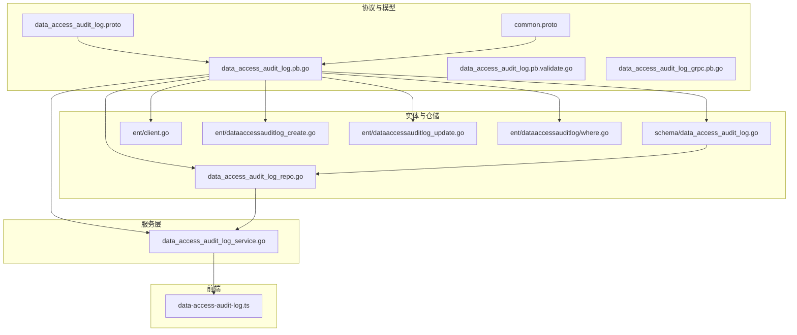
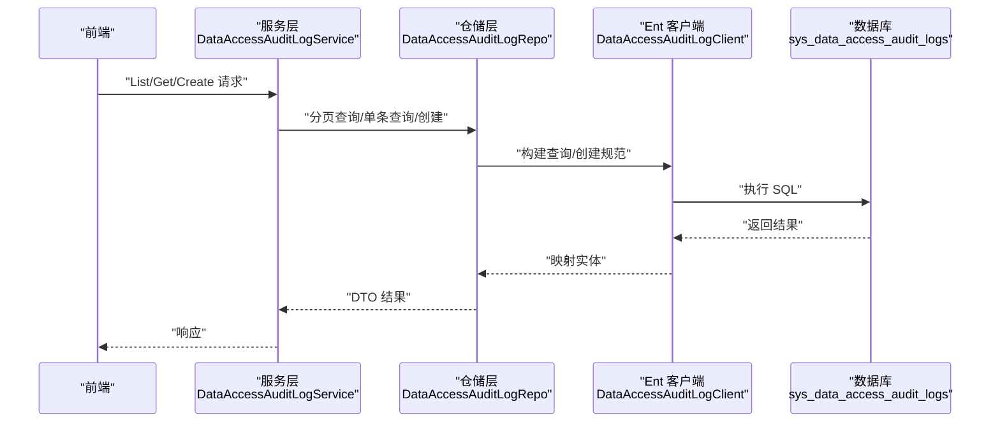
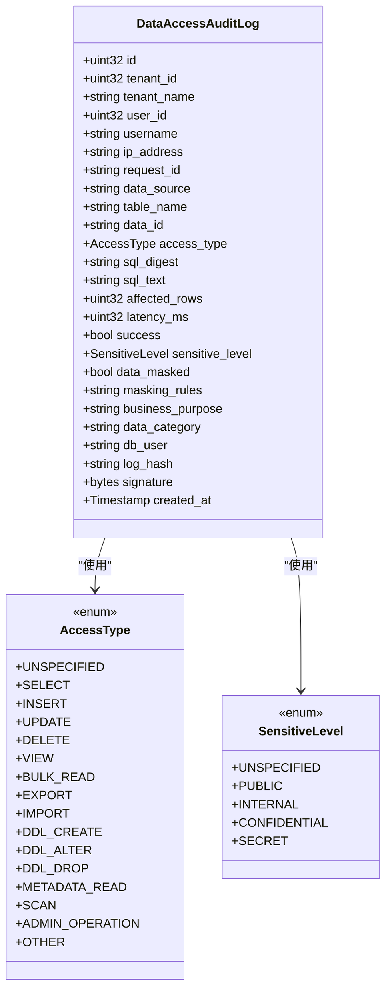
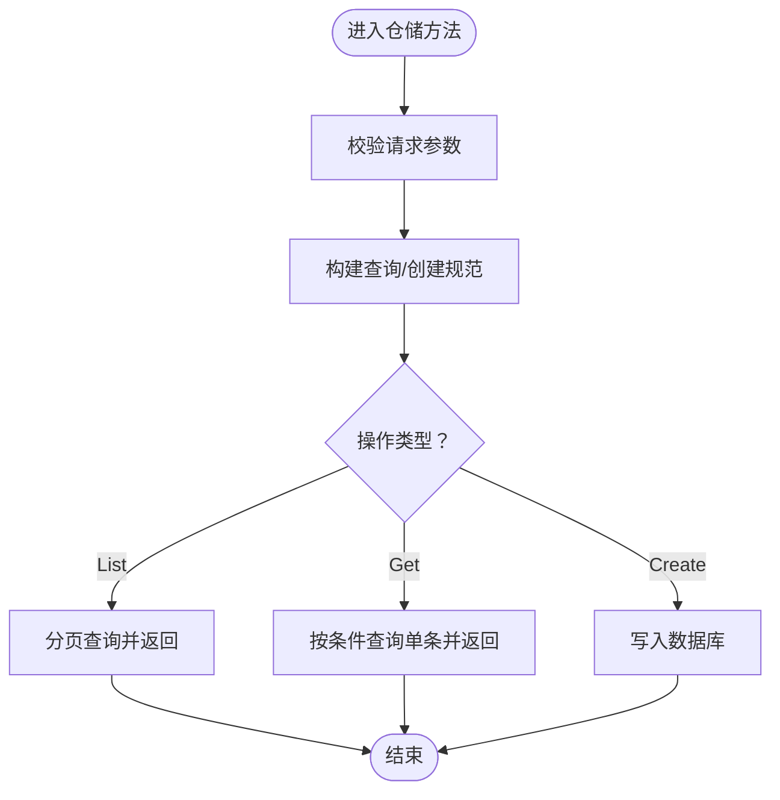
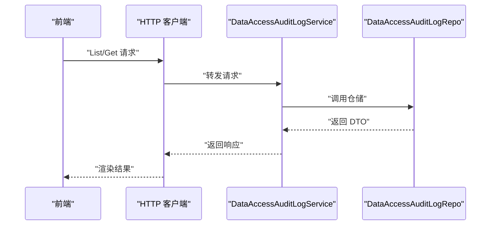
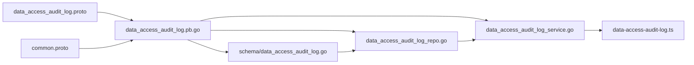

# 数据访问审计日志

<cite>
**本文引用的文件**
- [data_access_audit_log.proto](file://backend/api/protos/audit/service/v1/data_access_audit_log.proto)
- [common.proto](file://backend/api/protos/audit/service/v1/common.proto)
- [data_access_audit_log.pb.go](file://backend/api/gen/go/audit/service/v1/data_access_audit_log.pb.go)
- [data_access_audit_log.pb.validate.go](file://backend/api/gen/go/audit/service/v1/data_access_audit_log.pb.validate.go)
- [data_access_audit_log.pb.redact.go](file://backend/api/gen/go/audit/service/v1/data_access_audit_log.pb.redact.go)
- [data_access_audit_log_grpc.pb.go](file://backend/api/gen/go/audit/service/v1/data_access_audit_log_grpc.pb.go)
- [data_access_audit_log_http.pb.go](file://backend/api/gen/go/audit/service/v1/data_access_audit_log_http.pb.go)
- [data_access_audit_log.go](file://backend/app/admin/service/internal/data/ent/schema/data_access_audit_log.go)
- [data_access_audit_log_repo.go](file://backend/app/admin/service/internal/data/data_access_audit_log_repo.go)
- [data_access_audit_log_service.go](file://backend/app/admin/service/internal/service/data_access_audit_log_service.go)
- [client.go](file://backend/app/admin/service/internal/data/ent/client.go)
- [dataaccessauditlog_create.go](file://backend/app/admin/service/internal/data/ent/dataaccessauditlog_create.go)
- [dataaccessauditlog_update.go](file://backend/app/admin/service/internal/data/ent/dataaccessauditlog_update.go)
- [dataaccessauditlog_where.go](file://backend/app/admin/service/internal/data/ent/dataaccessauditlog/where.go)
- [data-access-audit-log.ts](file://backend/frontend/admin/react/src/api/service/data-access-audit-log.ts)
</cite>

## 目录
1. [简介](#简介)
2. [项目结构](#项目结构)
3. [核心组件](#核心组件)
4. [架构总览](#架构总览)
5. [详细组件分析](#详细组件分析)
6. [依赖关系分析](#依赖关系分析)
7. [性能考量](#性能考量)
8. [故障排查指南](#故障排查指南)
9. [结论](#结论)
10. [附录](#附录)

## 简介
本文件系统性阐述“数据访问审计日志”功能的设计与实现，覆盖以下方面：
- 审计机制：对数据库、文件系统、缓存等数据资源的读取、写入、删除、修改等操作进行完整追踪
- 数据结构：访问者信息、目标资源、访问时间、访问结果、影响范围、敏感级别、脱敏状态、业务目的、合规校验（哈希与签名）
- 监控与分析：基于索引与查询条件的模式分析、热点数据识别、访问权限验证、异常访问检测
- 安全审计：敏感数据访问控制、数据脱敏处理、访问授权验证、数据泄露预防
- 日志管理与性能优化：日志聚合、查询优化、存储策略、审计报告生成

## 项目结构
围绕数据访问审计日志的关键目录与文件如下：
- 协议与模型定义：audit/service/v1 下的 proto 文件与生成的 Go 代码
- 实体与仓储：ent/schema 与 internal/data 下的仓库与客户端
- 服务层：internal/service 下的服务实现
- 前端调用：前端 React 包装的 gRPC/HTTP 客户端

**图表来源**
- [data_access_audit_log.proto:1-224](file://backend/api/protos/audit/service/v1/data_access_audit_log.proto#L1-L224)
- [common.proto:1-55](file://backend/api/protos/audit/service/v1/common.proto#L1-L55)
- [data_access_audit_log.pb.go:1-726](file://backend/api/gen/go/audit/service/v1/data_access_audit_log.pb.go#L1-L726)
- [data_access_audit_log.pb.validate.go:185-232](file://backend/api/gen/go/audit/service/v1/data_access_audit_log.pb.validate.go#L185-L232)
- [data_access_audit_log_grpc.pb.go:103-210](file://backend/api/gen/go/audit/service/v1/data_access_audit_log_grpc.pb.go#L103-L210)
- [data_access_audit_log.go:1-221](file://backend/app/admin/service/internal/data/ent/schema/data_access_audit_log.go#L1-L221)
- [data_access_audit_log_repo.go:1-183](file://backend/app/admin/service/internal/data/data_access_audit_log_repo.go#L1-L183)
- [data_access_audit_log_service.go:1-52](file://backend/app/admin/service/internal/service/data_access_audit_log_service.go#L1-L52)
- [client.go:788-905](file://backend/app/admin/service/internal/data/ent/client.go#L788-L905)
- [dataaccessauditlog_create.go:466-500](file://backend/app/admin/service/internal/data/ent/dataaccessauditlog_create.go#L466-L500)
- [dataaccessauditlog_update.go:1382-1417](file://backend/app/admin/service/internal/data/ent/dataaccessauditlog_update.go#L1382-L1417)
- [dataaccessauditlog_where.go:1187-1250](file://backend/app/admin/service/internal/data/ent/dataaccessauditlog/where.go#L1187-L1250)
- [data-access-audit-log.ts:1-23](file://backend/frontend/admin/react/src/api/service/data-access-audit-log.ts#L1-L23)

**章节来源**
- [data_access_audit_log.proto:1-224](file://backend/api/protos/audit/service/v1/data_access_audit_log.proto#L1-L224)
- [data_access_audit_log.pb.go:1-726](file://backend/api/gen/go/audit/service/v1/data_access_audit_log.pb.go#L1-L726)
- [data_access_audit_log.go:1-221](file://backend/app/admin/service/internal/data/ent/schema/data_access_audit_log.go#L1-L221)
- [data_access_audit_log_repo.go:1-183](file://backend/app/admin/service/internal/data/data_access_audit_log_repo.go#L1-L183)
- [data_access_audit_log_service.go:1-52](file://backend/app/admin/service/internal/service/data_access_audit_log_service.go#L1-L52)
- [data-access-audit-log.ts:1-23](file://backend/frontend/admin/react/src/api/service/data-access-audit-log.ts#L1-L23)

## 核心组件
- 协议与消息模型
  - 服务接口：List、Get、Create
  - 主体消息：DataAccessAuditLog，包含访问类型、资源定位、结果与性能指标、敏感级别、脱敏状态、业务目的、合规字段等
  - 枚举：AccessType（读取、插入、更新、删除、查看、批量读取、导出、导入、DDL、元数据、扫描、管理、其他）、SensitiveLevel（公开、内部、机密、秘密）
- 实体与仓储
  - ent 实体：sys_data_access_audit_logs 表，字段覆盖访问者、资源、SQL 摘要/文本、影响行数、延迟、结果、敏感级别、脱敏、业务目的、数据分类、数据库用户、日志哈希与签名
  - 仓储：封装分页查询、存在性检查、单条查询、创建写入
- 服务层
  - 提供 HTTP/REST 风格的 List/Get/Create 接口，委托仓储完成持久化
- 前端
  - React 封装 gRPC/HTTP 客户端，支持分页列表与详情查询

**章节来源**
- [data_access_audit_log.proto:18-28](file://backend/api/protos/audit/service/v1/data_access_audit_log.proto#L18-L28)
- [data_access_audit_log.pb.go:122-152](file://backend/api/gen/go/audit/service/v1/data_access_audit_log.pb.go#L122-L152)
- [common.proto:8-26](file://backend/api/protos/audit/service/v1/common.proto#L8-L26)
- [data_access_audit_log.go:33-176](file://backend/app/admin/service/internal/data/ent/schema/data_access_audit_log.go#L33-L176)
- [data_access_audit_log_repo.go:77-183](file://backend/app/admin/service/internal/data/data_access_audit_log_repo.go#L77-L183)
- [data_access_audit_log_service.go:18-52](file://backend/app/admin/service/internal/service/data_access_audit_log_service.go#L18-L52)
- [data-access-audit-log.ts:1-23](file://backend/frontend/admin/react/src/api/service/data-access-audit-log.ts#L1-L23)

## 架构总览
数据访问审计日志从应用层到持久化的整体流程如下：

**图表来源**
- [data_access_audit_log_service.go:33-51](file://backend/app/admin/service/internal/service/data_access_audit_log_service.go#L33-L51)
- [data_access_audit_log_repo.go:92-182](file://backend/app/admin/service/internal/data/data_access_audit_log_repo.go#L92-L182)
- [client.go:788-905](file://backend/app/admin/service/internal/data/ent/client.go#L788-L905)
- [data_access_audit_log.proto:18-28](file://backend/api/protos/audit/service/v1/data_access_audit_log.proto#L18-L28)

## 详细组件分析

### 数据模型与字段设计
- 关键字段说明
  - 访问者与上下文：tenant_id、tenant_name、user_id、username、ip_address、request_id、trace_id、geo_location、device_info
  - 资源与操作：data_source、table_name、data_id、access_type、sql_digest、sql_text
  - 结果与性能：affected_rows、latency_ms、success
  - 敏感与脱敏：sensitive_level、data_masked、masking_rules
  - 业务与分类：business_purpose、data_category、db_user
  - 合规校验：log_hash（SHA256）、signature（ECDSA）
  - 时间：created_at
- 访问类型枚举覆盖广泛场景，便于统一统计与分析
- 敏感级别枚举支持分级治理策略

**图表来源**
- [data_access_audit_log.pb.go:122-152](file://backend/api/gen/go/audit/service/v1/data_access_audit_log.pb.go#L122-L152)
- [data_access_audit_log.pb.go:30-53](file://backend/api/gen/go/audit/service/v1/data_access_audit_log.pb.go#L30-L53)
- [common.proto:8-16](file://backend/api/protos/audit/service/v1/common.proto#L8-L16)

**章节来源**
- [data_access_audit_log.pb.go:122-152](file://backend/api/gen/go/audit/service/v1/data_access_audit_log.pb.go#L122-L152)
- [data_access_audit_log.proto:30-195](file://backend/api/protos/audit/service/v1/data_access_audit_log.proto#L30-L195)
- [common.proto:8-16](file://backend/api/protos/audit/service/v1/common.proto#L8-L16)

### 仓储与实体映射
- 仓储职责
  - Count：统计总数
  - List：分页查询，支持排序与过滤
  - Get：按 ID 查询，支持 FieldMask 控制返回字段
  - Create：批量写入，设置各字段与创建时间
- 实体索引
  - 单列索引：user_id、username、request_id、trace_id、ip_address、tenant_id、created_at
  - 复合索引：ip_address+created_at、tenant_id+created_at、tenant_id+user_id+created_at、data_source+table_name+data_id、access_type、access_type+success+created_at、sql_digest、data_masked
- 客户端与创建/更新
  - Ent 客户端提供 DataAccessAuditLogClient，支持 Hook 与 Interceptor
  - 创建/更新时设置字段、空值处理、签名写入

**图表来源**
- [data_access_audit_log_repo.go:77-182](file://backend/app/admin/service/internal/data/data_access_audit_log_repo.go#L77-L182)
- [data_access_audit_log.go:188-220](file://backend/app/admin/service/internal/data/ent/schema/data_access_audit_log.go#L188-L220)
- [client.go:788-905](file://backend/app/admin/service/internal/data/ent/client.go#L788-L905)
- [dataaccessauditlog_create.go:466-500](file://backend/app/admin/service/internal/data/ent/dataaccessauditlog_create.go#L466-L500)

**章节来源**
- [data_access_audit_log_repo.go:77-182](file://backend/app/admin/service/internal/data/data_access_audit_log_repo.go#L77-L182)
- [data_access_audit_log.go:188-220](file://backend/app/admin/service/internal/data/ent/schema/data_access_audit_log.go#L188-L220)
- [client.go:788-905](file://backend/app/admin/service/internal/data/ent/client.go#L788-L905)
- [dataaccessauditlog_create.go:466-500](file://backend/app/admin/service/internal/data/ent/dataaccessauditlog_create.go#L466-L500)
- [dataaccessauditlog_update.go:1382-1417](file://backend/app/admin/service/internal/data/ent/dataaccessauditlog_update.go#L1382-L1417)
- [dataaccessauditlog_where.go:1187-1250](file://backend/app/admin/service/internal/data/ent/dataaccessauditlog/where.go#L1187-L1250)

### 服务层与前端集成
- 服务层
  - List/Get/Create 直接委托仓储，错误处理统一
- 前端
  - React 使用自动生成的 gRPC/HTTP 客户端，封装分页与详情查询

**图表来源**
- [data_access_audit_log_service.go:33-51](file://backend/app/admin/service/internal/service/data_access_audit_log_service.go#L33-L51)
- [data_access_audit_log_repo.go:92-144](file://backend/app/admin/service/internal/data/data_access_audit_log_repo.go#L92-L144)
- [data-access-audit-log.ts:16-23](file://backend/frontend/admin/react/src/api/service/data-access-audit-log.ts#L16-L23)

**章节来源**
- [data_access_audit_log_service.go:18-52](file://backend/app/admin/service/internal/service/data_access_audit_log_service.go#L18-L52)
- [data-access-audit-log.ts:1-23](file://backend/frontend/admin/react/src/api/service/data-access-audit-log.ts#L1-L23)

### 监控与分析能力
- 模式分析
  - 基于 access_type、success、data_source、table_name、sql_digest 等字段进行聚合统计
  - 支持按时间窗口（created_at）与多租户维度（tenant_id）分析
- 热点数据识别
  - 通过 data_source、table_name、data_id 组合与访问频次、影响行数（affected_rows）进行热点识别
- 权限验证与异常检测
  - 结合敏感级别（sensitive_level）与脱敏状态（data_masked），对越权或异常访问进行告警
  - 利用索引 access_type+success+created_at、sql_digest、data_masked 进行高效过滤与异常检测

**章节来源**
- [data_access_audit_log.go:188-220](file://backend/app/admin/service/internal/data/ent/schema/data_access_audit_log.go#L188-L220)
- [dataaccessauditlog_where.go:1187-1250](file://backend/app/admin/service/internal/data/ent/dataaccessauditlog/where.go#L1187-L1250)

### 安全审计机制
- 敏感数据访问控制
  - 通过 SensitiveLevel 枚举实现分级控制，结合业务目的（business_purpose）与数据分类（data_category）进行策略匹配
- 数据脱敏处理
  - data_masked 与 masking_rules 记录脱敏状态与规则，确保日志中不暴露原始敏感字段
- 访问授权验证
  - 结合 user_id、tenant_id、request_id、trace_id 等上下文字段，配合鉴权中间件进行授权校验
- 数据泄露预防
  - log_hash（SHA256）与 signature（ECDSA）保障日志完整性与不可抵赖性，防止篡改与伪造

**章节来源**
- [common.proto:8-26](file://backend/api/protos/audit/service/v1/common.proto#L8-L26)
- [data_access_audit_log.proto:177-195](file://backend/api/protos/audit/service/v1/data_access_audit_log.proto#L177-L195)
- [data_access_audit_log.pb.go:136-149](file://backend/api/gen/go/audit/service/v1/data_access_audit_log.pb.go#L136-L149)

### 日志管理与性能优化
- 日志聚合
  - 基于 created_at、tenant_id、user_id、access_type、success 等字段进行聚合统计与报表生成
- 查询优化
  - 利用复合索引（如 tenant_id+created_at、access_type+success+created_at、data_source+table_name+data_id）提升查询效率
- 存储策略
  - 根据 RetentionPolicy（90/180/365/永久）设定保留周期，结合分表/分区策略降低冷数据成本
- 审计报告生成
  - 通过 List 接口与前端分页组件，按需生成访问趋势、异常事件、热点资源等报告

**章节来源**
- [common.proto:18-26](file://backend/api/protos/audit/service/v1/common.proto#L18-L26)
- [data_access_audit_log.go:188-220](file://backend/app/admin/service/internal/data/ent/schema/data_access_audit_log.go#L188-L220)
- [data_access_audit_log_repo.go:92-111](file://backend/app/admin/service/internal/data/data_access_audit_log_repo.go#L92-L111)

## 依赖关系分析
- 协议到实现
  - data_access_audit_log.proto 定义消息与服务，生成 pb.go 作为跨语言契约
  - common.proto 提供通用枚举与模型，被审计相关 proto 引用
- 服务到仓储
  - 服务层仅负责编排，仓储负责与 Ent 客户端交互
- 仓储到实体
  - 通过 ent/schema 定义表结构与索引，仓储使用这些元信息进行查询与创建
- 前端到服务
  - 前端通过自动生成的 gRPC/HTTP 客户端调用服务层接口

**图表来源**
- [data_access_audit_log.proto:1-224](file://backend/api/protos/audit/service/v1/data_access_audit_log.proto#L1-L224)
- [common.proto:1-55](file://backend/api/protos/audit/service/v1/common.proto#L1-L55)
- [data_access_audit_log.pb.go:1-726](file://backend/api/gen/go/audit/service/v1/data_access_audit_log.pb.go#L1-L726)
- [data_access_audit_log.go:1-221](file://backend/app/admin/service/internal/data/ent/schema/data_access_audit_log.go#L1-L221)
- [data_access_audit_log_repo.go:1-183](file://backend/app/admin/service/internal/data/data_access_audit_log_repo.go#L1-L183)
- [data_access_audit_log_service.go:1-52](file://backend/app/admin/service/internal/service/data_access_audit_log_service.go#L1-L52)
- [data-access-audit-log.ts:1-23](file://backend/frontend/admin/react/src/api/service/data-access-audit-log.ts#L1-L23)

**章节来源**
- [data_access_audit_log.pb.go:1-726](file://backend/api/gen/go/audit/service/v1/data_access_audit_log.pb.go#L1-L726)
- [data_access_audit_log.go:1-221](file://backend/app/admin/service/internal/data/ent/schema/data_access_audit_log.go#L1-L221)
- [data_access_audit_log_repo.go:1-183](file://backend/app/admin/service/internal/data/data_access_audit_log_repo.go#L1-L183)
- [data_access_audit_log_service.go:1-52](file://backend/app/admin/service/internal/service/data_access_audit_log_service.go#L1-L52)
- [data-access-audit-log.ts:1-23](file://backend/frontend/admin/react/src/api/service/data-access-audit-log.ts#L1-L23)

## 性能考量
- 索引设计
  - 多列组合索引覆盖常见查询模式，减少全表扫描
- 分页与过滤
  - 使用 PagingRequest 与 FieldMask 控制返回字段，避免过度传输
- 写入路径
  - 批量写入与空值处理减少无效字段写入，提高吞吐
- 合规字段
  - log_hash 与 signature 的计算在入库前完成，避免重复计算

[本节为通用指导，无需特定文件引用]

## 故障排查指南
- 参数校验
  - 使用 pb.validate.go 对关键字段（如 latency_ms、business_purpose）进行约束校验
- 错误处理
  - 仓储与服务层统一返回错误码，便于前端与运维定位问题
- 日志完整性
  - 若发现 signature 或 log_hash 不一致，需检查生成逻辑与存储过程

**章节来源**
- [data_access_audit_log.pb.validate.go:185-232](file://backend/api/gen/go/audit/service/v1/data_access_audit_log.pb.validate.go#L185-L232)
- [data_access_audit_log_repo.go:83-89](file://backend/app/admin/service/internal/data/data_access_audit_log_repo.go#L83-L89)
- [data_access_audit_log_service.go:42-51](file://backend/app/admin/service/internal/service/data_access_audit_log_service.go#L42-L51)

## 结论
该数据访问审计日志体系以协议驱动、实体建模、仓储抽象与服务编排为核心，实现了对数据库、缓存、文件系统等多资源访问的全链路追踪。通过完善的字段设计、索引策略与合规校验，既能满足监管与审计需求，又兼顾了性能与可维护性。建议在生产环境中结合 RetentionPolicy 与热点分析持续优化索引与存储策略。

[本节为总结性内容，无需特定文件引用]

## 附录
- 常用查询条件
  - 按用户/租户/时间范围过滤
  - 按访问类型与结果过滤
  - 按资源定位（数据源+表+主键）过滤
  - 按是否脱敏过滤
- 报表维度
  - 访问趋势、异常事件、热点资源、敏感数据访问统计

[本节为概念性内容，无需特定文件引用]