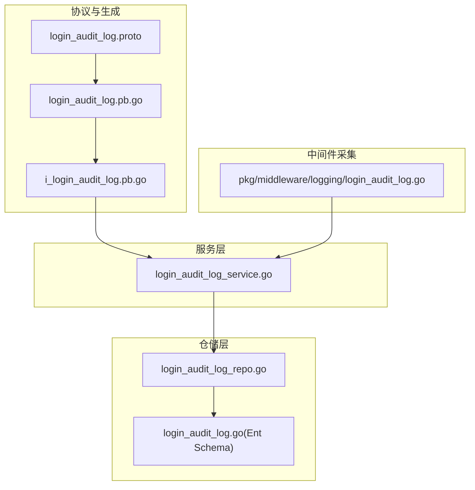
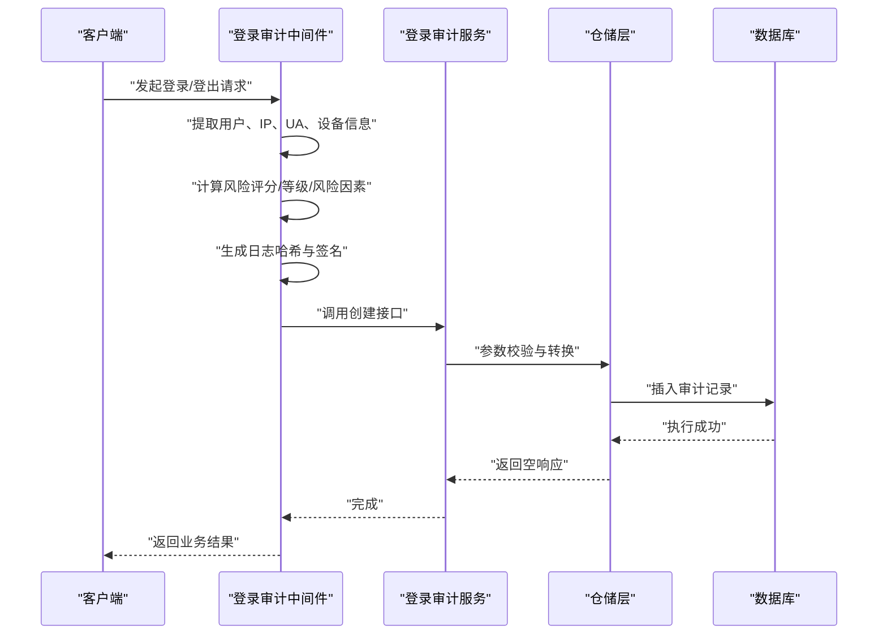
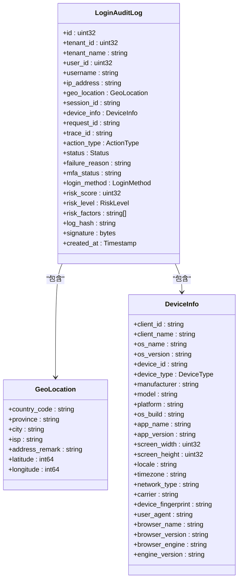
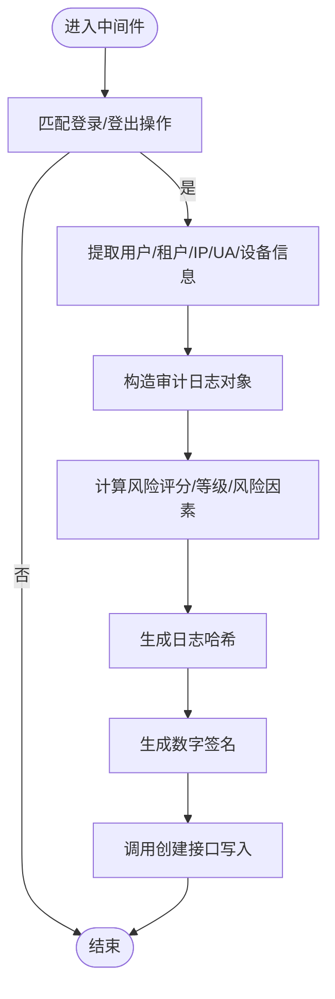
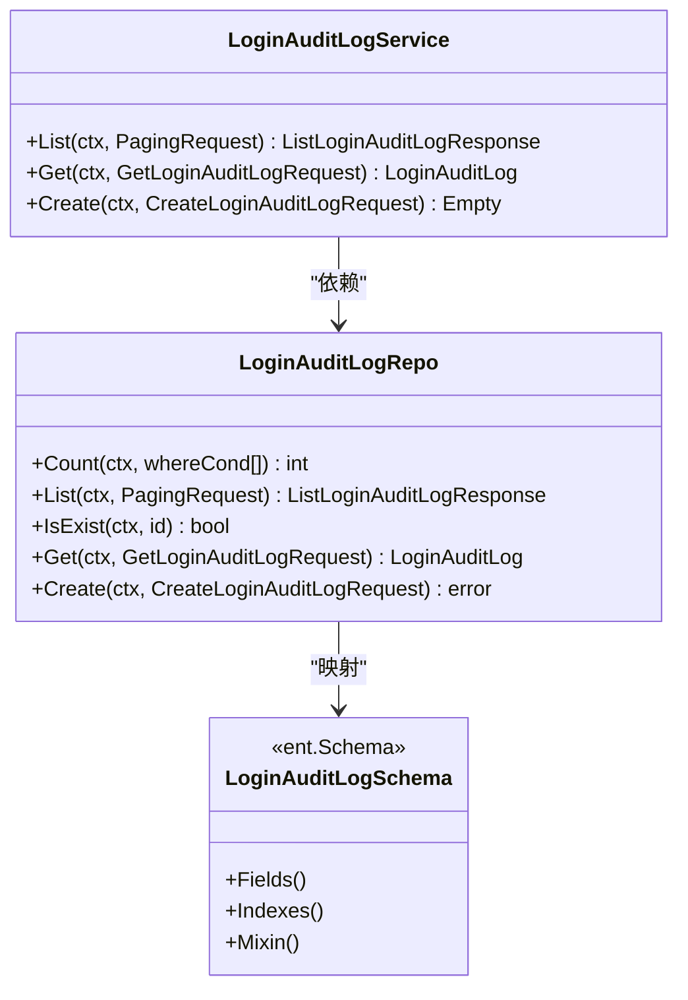
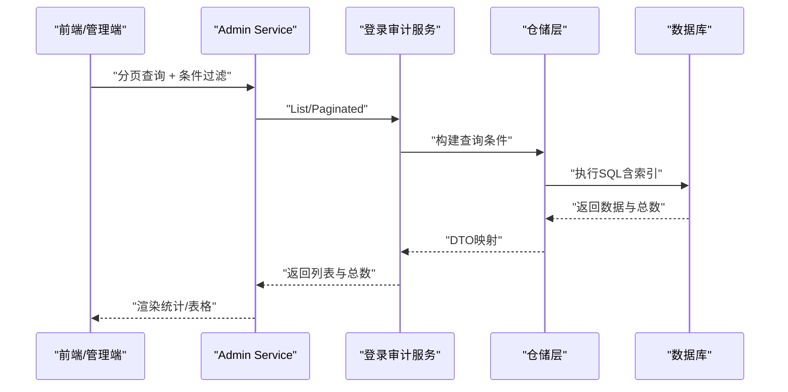
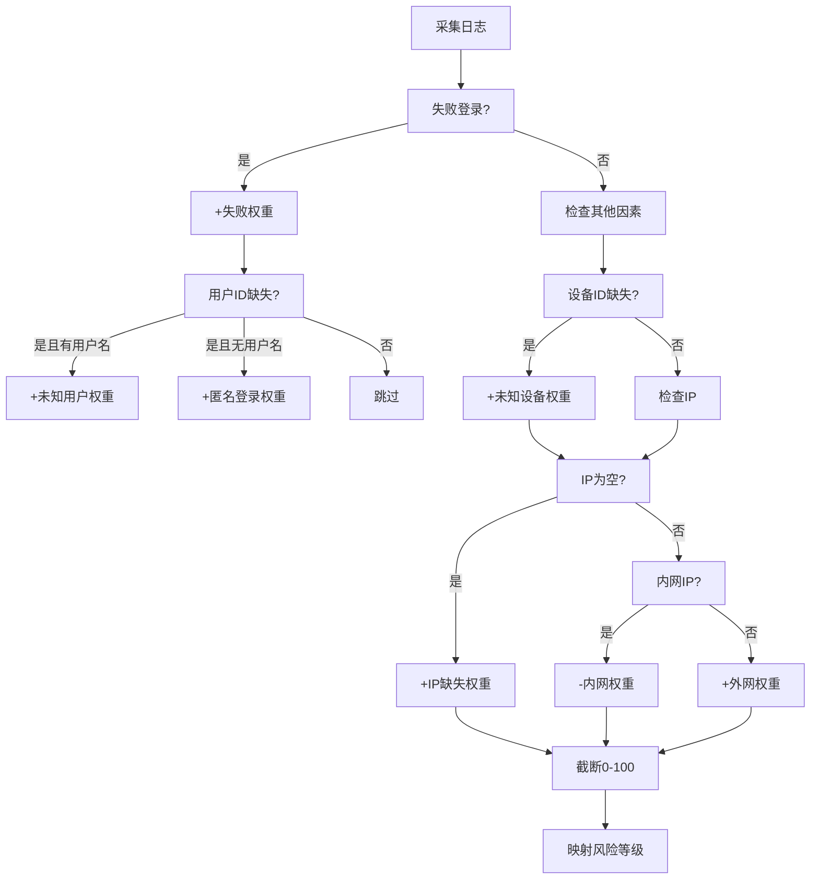
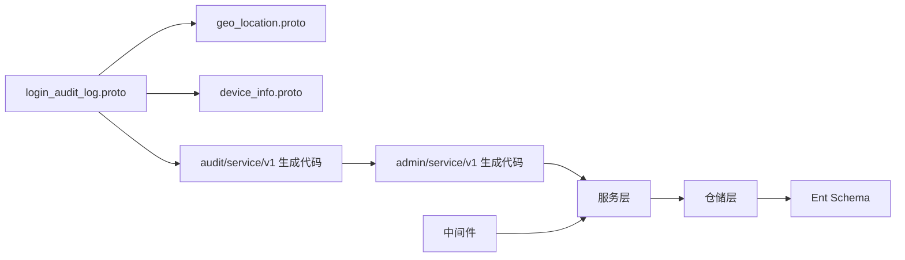

# 登录审计日志

<cite>
**本文引用的文件**
- [login_audit_log.proto](file://backend/api/protos/audit/service/v1/login_audit_log.proto)
- [login_audit_log.pb.go](file://backend/api/gen/go/audit/service/v1/login_audit_log.pb.go)
- [i_login_audit_log.pb.go](file://backend/api/gen/go/admin/service/v1/i_login_audit_log.pb.go)
- [login_audit_log_service.go](file://backend/app/admin/service/internal/service/login_audit_log_service.go)
- [login_audit_log_repo.go](file://backend/app/admin/service/internal/data/login_audit_log_repo.go)
- [login_audit_log.go](file://backend/app/admin/service/internal/data/ent/schema/login_audit_log.go)
- [login_audit_log.go](file://backend/pkg/middleware/logging/login_audit_log.go)
- [device_info.proto](file://backend/api/protos/audit/service/v1/device_info.proto)
- [geo_location.proto](file://backend/api/protos/audit/service/v1/geo_location.proto)
</cite>

## 目录
1. [简介](#简介)
2. [项目结构](#项目结构)
3. [核心组件](#核心组件)
4. [架构总览](#架构总览)
5. [详细组件分析](#详细组件分析)
6. [依赖分析](#依赖分析)
7. [性能考虑](#性能考虑)
8. [故障排查指南](#故障排查指南)
9. [结论](#结论)
10. [附录](#附录)

## 简介
本文件系统性阐述登录审计日志功能的设计与实现，覆盖以下方面：
- 登录审计事件采集机制：用户登录尝试、成功登录、失败登录、异常登录等事件的捕获与记录
- 数据模型与字段定义：用户标识、登录时间、IP地址、设备信息、地理位置、UA信息、登录结果、风险评分与等级、合规校验等
- 查询与统计能力：按时间段筛选、用户维度分析、地理位置分布、设备类型统计等
- 安全监控机制：暴力破解检测、异常登录行为识别、多设备登录监控
- 存储策略与性能优化：索引设计、查询优化、数据归档

## 项目结构
登录审计日志功能由“协议定义 → 生成代码 → 服务层 → 仓储层 → ORM Schema → 中间件采集”构成完整链路。

**图表来源**
- [login_audit_log.proto:1-219](file://backend/api/protos/audit/service/v1/login_audit_log.proto#L1-L219)
- [login_audit_log.pb.go:1-844](file://backend/api/gen/go/audit/service/v1/login_audit_log.pb.go#L1-L844)
- [i_login_audit_log.pb.go:1-76](file://backend/api/gen/go/admin/service/v1/i_login_audit_log.pb.go#L1-L76)
- [login_audit_log_service.go:1-52](file://backend/app/admin/service/internal/service/login_audit_log_service.go#L1-L52)
- [login_audit_log_repo.go:1-189](file://backend/app/admin/service/internal/data/login_audit_log_repo.go#L1-L189)
- [login_audit_log.go:1-184](file://backend/app/admin/service/internal/data/ent/schema/login_audit_log.go#L1-L184)
- [login_audit_log.go:1-364](file://backend/pkg/middleware/logging/login_audit_log.go#L1-L364)

**章节来源**
- [login_audit_log.proto:1-219](file://backend/api/protos/audit/service/v1/login_audit_log.proto#L1-L219)
- [login_audit_log_service.go:1-52](file://backend/app/admin/service/internal/service/login_audit_log_service.go#L1-L52)
- [login_audit_log_repo.go:1-189](file://backend/app/admin/service/internal/data/login_audit_log_repo.go#L1-L189)
- [login_audit_log.go:1-184](file://backend/app/admin/service/internal/data/ent/schema/login_audit_log.go#L1-L184)
- [login_audit_log.go:1-364](file://backend/pkg/middleware/logging/login_audit_log.go#L1-L364)

## 核心组件
- 协议与消息模型：定义登录审计日志的数据结构、枚举类型及服务接口
- 服务实现：对外暴露查询、详情、创建接口
- 仓储与ORM：封装分页查询、条件过滤、实体映射与持久化
- 中间件采集：在登录/登出流程中自动采集并生成审计日志
- 设备与地理信息：通过嵌套消息记录设备指纹、UA、地理位置等

**章节来源**
- [login_audit_log.proto:16-26](file://backend/api/protos/audit/service/v1/login_audit_log.proto#L16-L26)
- [login_audit_log.pb.go:259-471](file://backend/api/gen/go/audit/service/v1/login_audit_log.pb.go#L259-L471)
- [login_audit_log_service.go:18-51](file://backend/app/admin/service/internal/service/login_audit_log_service.go#L18-L51)
- [login_audit_log_repo.go:25-84](file://backend/app/admin/service/internal/data/login_audit_log_repo.go#L25-L84)
- [login_audit_log.go:33-147](file://backend/app/admin/service/internal/data/ent/schema/login_audit_log.go#L33-L147)
- [device_info.proto:8-187](file://backend/api/protos/audit/service/v1/device_info.proto#L8-L187)
- [geo_location.proto:8-51](file://backend/api/protos/audit/service/v1/geo_location.proto#L8-L51)

## 架构总览
登录审计日志从中间件采集开始，经过服务层转发至仓储层，最终持久化到数据库。查询侧通过分页请求返回审计记录，并支持字段级过滤。

**图表来源**
- [login_audit_log.go:39-114](file://backend/pkg/middleware/logging/login_audit_log.go#L39-L114)
- [login_audit_log_service.go:41-51](file://backend/app/admin/service/internal/service/login_audit_log_service.go#L41-L51)
- [login_audit_log_repo.go:155-188](file://backend/app/admin/service/internal/data/login_audit_log_repo.go#L155-L188)

## 详细组件分析

### 数据模型与字段定义
登录审计日志的核心字段涵盖用户标识、终端信息、操作状态、风险控制与合规校验等。

**图表来源**
- [login_audit_log.proto:28-190](file://backend/api/protos/audit/service/v1/login_audit_log.proto#L28-L190)
- [geo_location.proto:8-51](file://backend/api/protos/audit/service/v1/geo_location.proto#L8-L51)
- [device_info.proto:8-187](file://backend/api/protos/audit/service/v1/device_info.proto#L8-L187)

关键字段说明（摘自协议注释与生成代码）：
- 用户标识：tenant_id、tenant_name、user_id、username
- 终端信息：ip_address、geo_location、device_info、user_agent
- 会话与追踪：session_id、request_id、trace_id
- 操作/状态：action_type（登录/登出/会话过期/强制下线/密码重置）、status（成功/失败/部分/锁定）、failure_reason、mfa_status、login_method（密码/短信/二维码/第三方/生物特征/FIDO2）
- 风险控制：risk_score（0-100）、risk_level（低/中/高）、risk_factors（ISO 27001相关）
- 合规校验：log_hash（SHA256）、signature（ECDSA DER）
- 时间字段：created_at

**章节来源**
- [login_audit_log.proto:72-189](file://backend/api/protos/audit/service/v1/login_audit_log.proto#L72-L189)
- [login_audit_log.pb.go:259-471](file://backend/api/gen/go/audit/service/v1/login_audit_log.pb.go#L259-L471)

### 采集机制与中间件实现
中间件在登录/登出操作发生时自动采集并生成审计日志，包含以下步骤：
- 提取用户身份与租户信息
- 解析真实IP、UA、设备指纹
- 计算风险评分与等级
- 生成风险因素列表
- 计算日志哈希与数字签名
- 异步写入审计服务

**图表来源**
- [login_audit_log.go:39-114](file://backend/pkg/middleware/logging/login_audit_log.go#L39-L114)
- [login_audit_log.go:192-251](file://backend/pkg/middleware/logging/login_audit_log.go#L192-L251)
- [login_audit_log.go:273-363](file://backend/pkg/middleware/logging/login_audit_log.go#L273-L363)

**章节来源**
- [login_audit_log.go:39-114](file://backend/pkg/middleware/logging/login_audit_log.go#L39-L114)
- [login_audit_log.go:116-190](file://backend/pkg/middleware/logging/login_audit_log.go#L116-L190)
- [login_audit_log.go:192-251](file://backend/pkg/middleware/logging/login_audit_log.go#L192-L251)
- [login_audit_log.go:273-363](file://backend/pkg/middleware/logging/login_audit_log.go#L273-L363)

### 服务与仓储实现
- 服务层：提供 List/Get/Create 接口，参数校验与错误处理
- 仓储层：基于 Ent CRUD 封装分页查询、条件过滤、枚举转换、JSON 字段映射
- ORM Schema：定义表结构、索引、字段注释与 JSON 类型

**图表来源**
- [login_audit_log_service.go:18-51](file://backend/app/admin/service/internal/service/login_audit_log_service.go#L18-L51)
- [login_audit_log_repo.go:25-84](file://backend/app/admin/service/internal/data/login_audit_log_repo.go#L25-L84)
- [login_audit_log.go:16-183](file://backend/app/admin/service/internal/data/ent/schema/login_audit_log.go#L16-L183)

**章节来源**
- [login_audit_log_service.go:33-51](file://backend/app/admin/service/internal/service/login_audit_log_service.go#L33-L51)
- [login_audit_log_repo.go:86-153](file://backend/app/admin/service/internal/data/login_audit_log_repo.go#L86-L153)
- [login_audit_log_repo.go:155-188](file://backend/app/admin/service/internal/data/login_audit_log_repo.go#L155-L188)
- [login_audit_log.go:33-147](file://backend/app/admin/service/internal/data/ent/schema/login_audit_log.go#L33-L147)

### 查询与统计能力
- 分页查询：通过 PagingRequest 实现
- 条件过滤：支持按用户、IP、会话ID、请求ID、事件类型、状态、租户、时间范围等组合查询
- 字段过滤：通过 FieldMask 控制返回字段
- 统计维度：用户维度、地理位置分布、设备类型统计、风险等级分布等

**图表来源**
- [i_login_audit_log.pb.go:30-34](file://backend/api/gen/go/admin/service/v1/i_login_audit_log.pb.go#L30-L34)
- [login_audit_log_service.go:33-35](file://backend/app/admin/service/internal/service/login_audit_log_service.go#L33-L35)
- [login_audit_log_repo.go:101-120](file://backend/app/admin/service/internal/data/login_audit_log_repo.go#L101-L120)

**章节来源**
- [i_login_audit_log.pb.go:30-34](file://backend/api/gen/go/admin/service/v1/i_login_audit_log.pb.go#L30-L34)
- [login_audit_log_repo.go:101-120](file://backend/app/admin/service/internal/data/login_audit_log_repo.go#L101-L120)

### 安全监控机制
- 暴力破解检测：基于失败登录次数与时间窗口的启发式规则
- 异常登录识别：未知设备、匿名登录、内外网切换、失败原因关键词（密码/短信/验证码）、MFA失败等
- 多设备登录监控：通过设备指纹、客户端ID、会话ID进行关联分析
- 风险等级划分：低/中/高，高风险需实时告警

**图表来源**
- [login_audit_log.go:192-251](file://backend/pkg/middleware/logging/login_audit_log.go#L192-L251)
- [login_audit_log.go:273-363](file://backend/pkg/middleware/logging/login_audit_log.go#L273-L363)

**章节来源**
- [login_audit_log.go:192-251](file://backend/pkg/middleware/logging/login_audit_log.go#L192-L251)
- [login_audit_log.go:273-363](file://backend/pkg/middleware/logging/login_audit_log.go#L273-L363)

### 存储策略与性能优化
- 表结构与索引
  - 表名：sys_login_audit_logs
  - 字段：JSON 类型存储 geo_location、device_info；枚举字段映射为命名值
  - 索引：user_id、username、ip_address、ip_address+created_at、session_id、request_id、action_type、status、tenant_id、created_at、tenant_id+created_at
- 查询优化
  - 使用组合索引覆盖常见查询模式（用户、IP、时间、租户）
  - 分页查询配合 where 条件，避免全表扫描
- 数据归档
  - 建议按 created_at 或 tenant_id 进行分区/归档，清理历史数据以控制表规模
- 合规与一致性
  - log_hash 与 signature 保障日志不可篡改，便于审计取证

**章节来源**
- [login_audit_log.go:20-30](file://backend/app/admin/service/internal/data/ent/schema/login_audit_log.go#L20-L30)
- [login_audit_log.go:159-183](file://backend/app/admin/service/internal/data/ent/schema/login_audit_log.go#L159-L183)

## 依赖分析
- 协议依赖：login_audit_log.proto 依赖 geo_location.proto 与 device_info.proto
- 生成代码：audit/service/v1 与 admin/service/v1 两套生成代码，前者为核心模型，后者为 Admin 服务接口
- 服务与仓储：服务层依赖仓储层，仓储层依赖 Ent ORM 与枚举转换器
- 中间件：依赖 HTTP 传输、Token 提取、IP/UA/设备信息解析、风险计算与签名

**图表来源**
- [login_audit_log.proto:1-15](file://backend/api/protos/audit/service/v1/login_audit_log.proto#L1-L15)
- [geo_location.proto:1-5](file://backend/api/protos/audit/service/v1/geo_location.proto#L1-L5)
- [device_info.proto:1-5](file://backend/api/protos/audit/service/v1/device_info.proto#L1-L5)
- [login_audit_log.pb.go:1-20](file://backend/api/gen/go/audit/service/v1/login_audit_log.pb.go#L1-L20)
- [i_login_audit_log.pb.go:28-34](file://backend/api/gen/go/admin/service/v1/i_login_audit_log.pb.go#L28-L34)
- [login_audit_log_service.go:1-16](file://backend/app/admin/service/internal/service/login_audit_log_service.go#L1-L16)
- [login_audit_log_repo.go:1-23](file://backend/app/admin/service/internal/data/login_audit_log_repo.go#L1-L23)
- [login_audit_log.go:3-23](file://backend/pkg/middleware/logging/login_audit_log.go#L3-L23)

**章节来源**
- [login_audit_log.pb.go:1-20](file://backend/api/gen/go/audit/service/v1/login_audit_log.pb.go#L1-L20)
- [i_login_audit_log.pb.go:28-34](file://backend/api/gen/go/admin/service/v1/i_login_audit_log.pb.go#L28-L34)
- [login_audit_log_service.go:1-16](file://backend/app/admin/service/internal/service/login_audit_log_service.go#L1-L16)
- [login_audit_log_repo.go:1-23](file://backend/app/admin/service/internal/data/login_audit_log_repo.go#L1-L23)
- [login_audit_log.go:3-23](file://backend/pkg/middleware/logging/login_audit_log.go#L3-L23)

## 性能考虑
- 索引命中：确保查询条件尽量命中已定义索引，减少回表与排序
- JSON 字段：geo_location、device_info 为 JSON 存储，避免复杂 JOIN；必要时在应用层做预聚合
- 分页与过滤：结合 where 条件与 limit/offset，避免一次性拉取大量数据
- 风险计算：中间件风险评分与签名计算为内存计算，注意在高并发下的 CPU 开销
- 归档策略：对历史数据进行分区或归档，定期清理过期日志，保持表规模可控

## 故障排查指南
- 创建失败
  - 参数校验：确认 Create 请求体不为空，必要字段齐全
  - 数据库错误：查看仓储层日志与错误码，定位插入失败原因
- 查询异常
  - 分页参数：确认 PagingRequest 合法
  - 条件过滤：检查 where 条件是否命中索引
- 风险评分异常
  - 核对失败原因关键词、设备ID、IP 等输入
  - 检查风险阈值与等级映射逻辑
- 签名/哈希问题
  - 确认签名私钥配置正确
  - 排查 Protobuf 序列化顺序与排除字段

**章节来源**
- [login_audit_log_service.go:42-50](file://backend/app/admin/service/internal/service/login_audit_log_service.go#L42-L50)
- [login_audit_log_repo.go:92-98](file://backend/app/admin/service/internal/data/login_audit_log_repo.go#L92-L98)
- [login_audit_log_repo.go:182-187](file://backend/app/admin/service/internal/data/login_audit_log_repo.go#L182-L187)
- [login_audit_log.go:116-190](file://backend/pkg/middleware/logging/login_audit_log.go#L116-L190)

## 结论
登录审计日志功能通过协议驱动的模型定义、中间件自动化采集、服务与仓储的清晰分层，以及完善的索引与合规校验，实现了对登录事件的全生命周期记录与分析。结合风险评分与等级、设备与地理信息，能够有效支撑安全监控与审计取证需求。建议在生产环境中配合数据归档与索引优化策略，持续保障查询性能与系统稳定性。

## 附录
- 关键枚举与常量
  - ActionType：LOGIN、LOGOUT、SESSION_EXPIRED、KICKED_OUT、PASSWORD_RESET
  - Status：SUCCESS、FAILED、PARTIAL、LOCKED
  - RiskLevel：LOW、MEDIUM、HIGH
  - LoginMethod：PASSWORD、SMS_CODE、QR_CODE、OIDC_SOCIAL、BIOMETRIC、FIDO2
- 风险因素常量（示例）
  - FAILED_LOGIN、UNKNOWN_USER、ANONYMOUS_LOGIN、UNKNOWN_DEVICE、MFA_FAILED、MFA_UNVERIFIED、IP_MISSING、INTERNAL_IP、EXTERNAL_IP、PASSWORD_FAILURE、MFA_FAILURE_REASON、NO_SESSION、NO_REQUEST_ID、HIGH_RISK_SCORE、MEDIUM_RISK_SCORE、LOW_RISK_SCORE

**章节来源**
- [login_audit_log.proto:31-70](file://backend/api/protos/audit/service/v1/login_audit_log.proto#L31-L70)
- [login_audit_log.pb.go:29-195](file://backend/api/gen/go/audit/service/v1/login_audit_log.pb.go#L29-L195)
- [login_audit_log.go:253-271](file://backend/pkg/middleware/logging/login_audit_log.go#L253-L271)