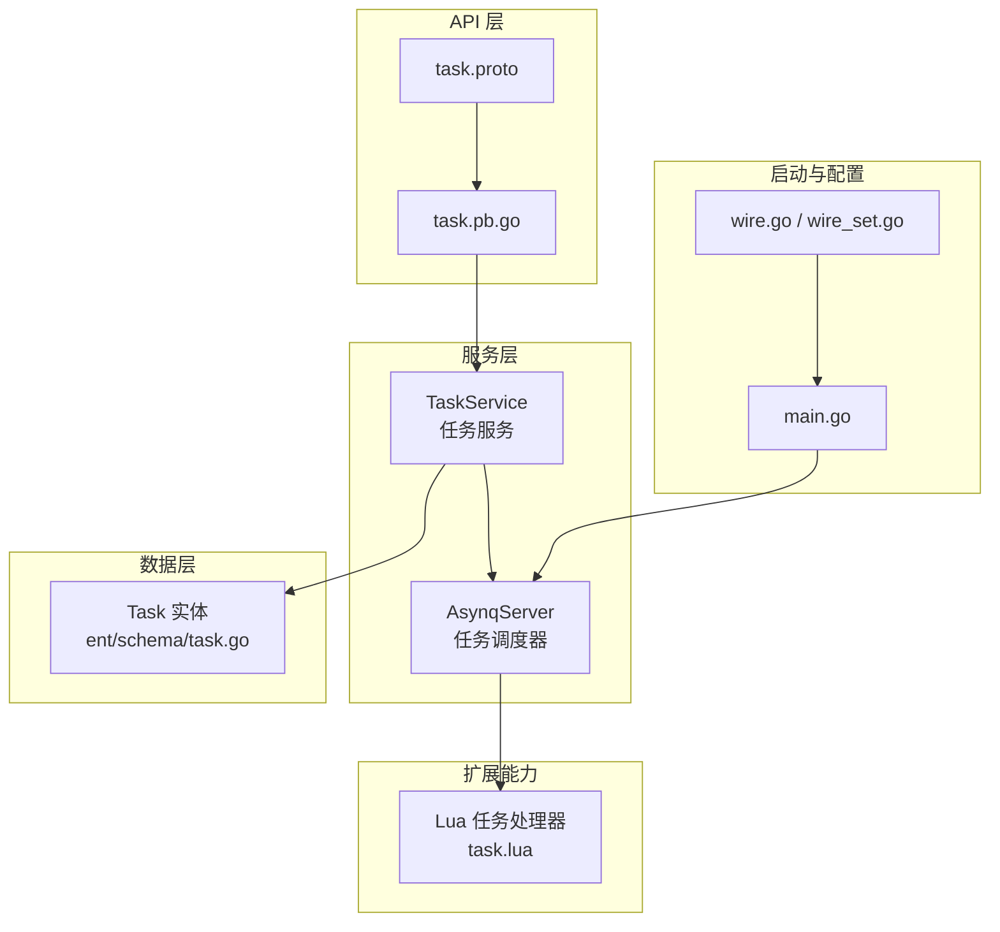
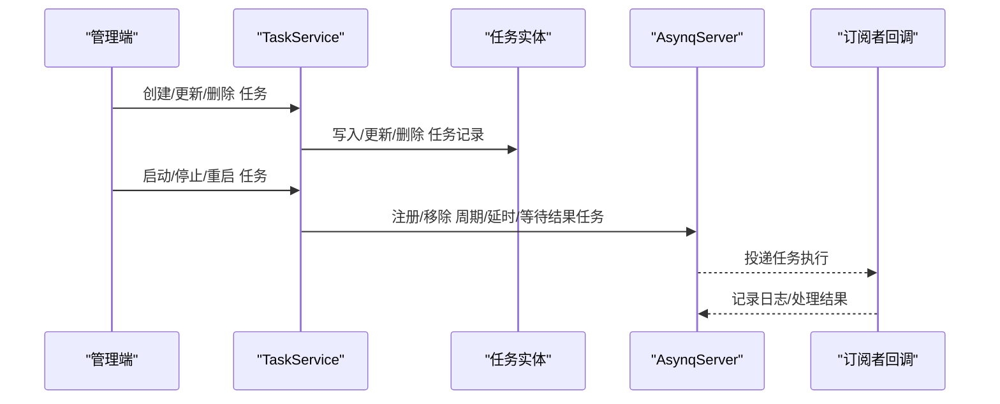
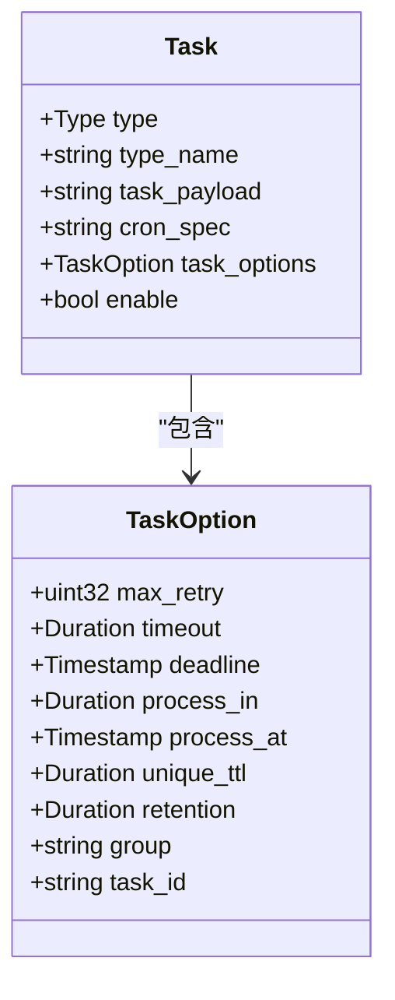
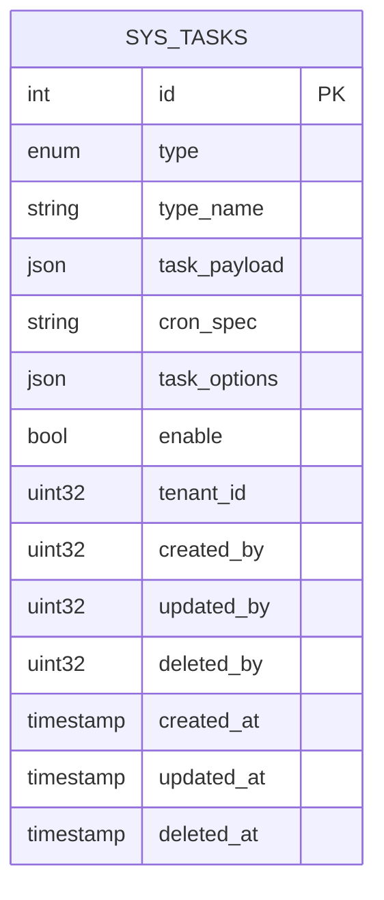
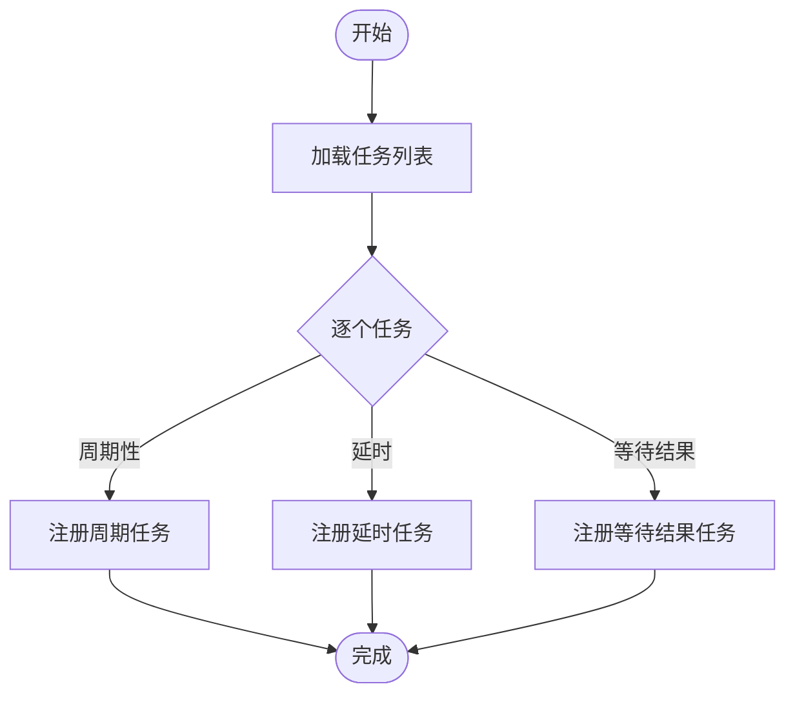
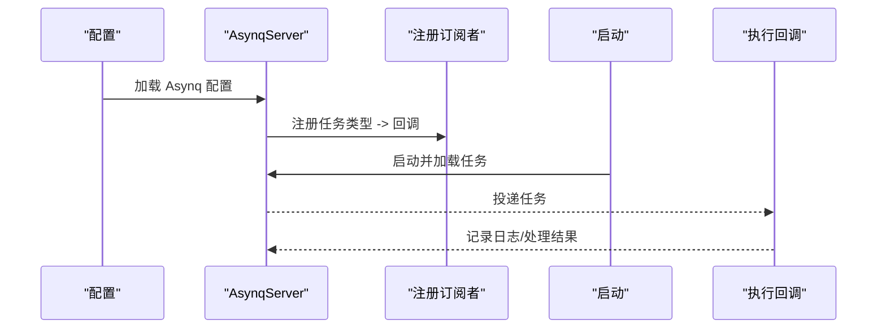

# 任务调度

<cite>
**本文引用的文件**
- [task_service.go](file://backend/app/admin/service/internal/service/task_service.go)
- [asynq_server.go](file://backend/app/admin/service/internal/server/asynq_server.go)
- [task.go](file://backend/pkg/task/backup.go)
- [task.proto](file://backend/api/protos/task/service/v1/task.proto)
- [task.pb.go](file://backend/api/gen/go/task/service/v1/task.pb.go)
- [task.go](file://backend/app/admin/service/internal/data/ent/schema/task.go)
- [main.go](file://backend/app/admin/service/cmd/server/main.go)
- [wire.go](file://backend/app/admin/service/cmd/server/wire.go)
- [wire_set.go](file://backend/app/admin/service/internal/server/providers/wire_set.go)
- [task.lua](file://backend/pkg/lua/api/task.go)
</cite>

## 目录
1. [简介](#简介)
2. [项目结构](#项目结构)
3. [核心组件](#核心组件)
4. [架构总览](#架构总览)
5. [详细组件分析](#详细组件分析)
6. [依赖分析](#依赖分析)
7. [性能考虑](#性能考虑)
8. [故障排查指南](#故障排查指南)
9. [结论](#结论)
10. [附录](#附录)

## 简介
本文件系统化梳理 GoWind 项目中的任务调度能力，覆盖定时任务、延时任务、等待结果任务等类型，以及基于 Asynq 的任务队列集成与配置要点。文档重点阐述：
- 任务类型与选项定义、执行策略与优先级管理
- 重试、超时、截止时间、唯一性、保留期、分组与任务 ID 等关键参数
- 业务场景：数据备份、报表生成、文件处理、通知发送等
- 监控与管理：状态跟踪、执行日志、性能统计、异常处理
- 最佳实践：任务设计原则、性能优化、故障恢复、容量规划
- 具体任务定义示例与 API 使用说明

## 项目结构
任务调度相关代码主要分布在以下模块：
- API 定义与生成：Protobuf 定义与 Go 代码生成
- 服务层：任务服务、Asynq 服务器装配、任务生命周期控制
- 数据层：任务实体与索引
- 配置与启动：应用初始化、Wire 依赖注入、Asynq 服务注册



**图表来源**
- [task.proto:1-315](file://backend/api/protos/task/service/v1/task.proto#L1-L315)
- [task.pb.go:1-800](file://backend/api/gen/go/task/service/v1/task.pb.go#L1-L800)
- [task_service.go:1-364](file://backend/app/admin/service/internal/service/task_service.go#L1-L364)
- [asynq_server.go:1-47](file://backend/app/admin/service/internal/server/asynq_server.go#L1-L47)
- [task.go:1-115](file://backend/app/admin/service/internal/data/ent/schema/task.go#L1-L115)
- [main.go:1-76](file://backend/app/admin/service/cmd/server/main.go#L1-L76)
- [wire.go:1-47](file://backend/app/admin/service/cmd/server/wire.go#L1-L47)
- [wire_set.go:1-25](file://backend/app/admin/service/internal/server/providers/wire_set.go#L1-L25)
- [task.lua:1-170](file://backend/pkg/lua/api/task.go#L1-L170)

**章节来源**
- [task.proto:1-315](file://backend/api/protos/task/service/v1/task.proto#L1-L315)
- [task_service.go:1-364](file://backend/app/admin/service/internal/service/task_service.go#L1-L364)
- [asynq_server.go:1-47](file://backend/app/admin/service/internal/server/asynq_server.go#L1-L47)
- [task.go:1-115](file://backend/app/admin/service/internal/data/ent/schema/task.go#L1-L115)
- [main.go:1-76](file://backend/app/admin/service/cmd/server/main.go#L1-L76)
- [wire.go:1-47](file://backend/app/admin/service/cmd/server/wire.go#L1-L47)
- [wire_set.go:1-25](file://backend/app/admin/service/internal/server/providers/wire_set.go#L1-L25)
- [task.lua:1-170](file://backend/pkg/lua/api/task.go#L1-L170)

## 核心组件
- 任务类型与选项
  - 任务类型：周期性、延时、等待结果
  - 任务选项：最大重试次数、超时、截止时间、延迟处理、执行时间点、唯一性 TTL、结果保留期、分组、任务 ID
- 任务实体
  - 字段：类型、类型名、任务载荷(JSON)、cron 表达式、任务选项(JSON)、启用状态、租户与审计字段
  - 索引：按租户+类型名唯一、租户+类型、租户+启用+创建时间等
- 任务服务
  - 提供任务 CRUD、启停控制、全量启停、按类型名枚举、任务选项转换与 Asynq 任务创建
- Asynq 服务器
  - 从配置加载 Asynq 服务，注册订阅者，启动所有已启用任务
- Lua 扩展
  - 提供 Lua 任务处理器注册能力，支持超时、重试、优先级等配置

**章节来源**
- [task.proto:127-208](file://backend/api/protos/task/service/v1/task.proto#L127-L208)
- [task.pb.go:131-145](file://backend/api/gen/go/task/service/v1/task.pb.go#L131-L145)
- [task.go:34-76](file://backend/app/admin/service/internal/data/ent/schema/task.go#L34-L76)
- [task_service.go:24-35](file://backend/app/admin/service/internal/service/task_service.go#L24-L35)
- [asynq_server.go:18-46](file://backend/app/admin/service/internal/server/asynq_server.go#L18-L46)
- [task.lua:8-31](file://backend/pkg/lua/api/task.go#L8-L31)

## 架构总览
任务调度整体流程：
- 通过 Protobuf 定义任务模型与选项
- 服务层将数据库中的任务配置转换为 Asynq 任务选项并注册
- Asynq 服务器根据 cron 或直接投递执行任务
- 任务执行由订阅者回调处理，支持统一的日志记录与错误处理



**图表来源**
- [task_service.go:82-154](file://backend/app/admin/service/internal/service/task_service.go#L82-L154)
- [task_service.go:156-184](file://backend/app/admin/service/internal/service/task_service.go#L156-L184)
- [asynq_server.go:34-44](file://backend/app/admin/service/internal/server/asynq_server.go#L34-L44)

**章节来源**
- [task_service.go:82-184](file://backend/app/admin/service/internal/service/task_service.go#L82-L184)
- [asynq_server.go:18-46](file://backend/app/admin/service/internal/server/asynq_server.go#L18-L46)

## 详细组件分析

### 任务类型与选项
- 任务类型
  - 周期性：通过 cron 表达式驱动
  - 延时：在指定时间或时间点后执行
  - 等待结果：可等待执行结果的异步任务
- 任务选项
  - 重试：最大重试次数
  - 超时：单次执行超时时间
  - 截止时间：任务必须完成的截止时间
  - 延迟处理：相对当前时间的延迟
  - 执行时间点：绝对时间点
  - 唯一性 TTL：任务去重窗口
  - 结果保留期：执行结果保留时长
  - 分组：任务分组标识
  - 任务 ID：自定义唯一标识



**图表来源**
- [task.proto:52-125](file://backend/api/protos/task/service/v1/task.proto#L52-L125)
- [task.proto:127-208](file://backend/api/protos/task/service/v1/task.proto#L127-L208)

**章节来源**
- [task.proto:52-125](file://backend/api/protos/task/service/v1/task.proto#L52-L125)
- [task.pb.go:131-145](file://backend/api/gen/go/task/service/v1/task.pb.go#L131-L145)

### 任务实体与索引
- 字段设计
  - 类型、类型名、任务载荷(JSON)、cron 表达式、任务选项(JSON)、启用状态
  - 审计与租户字段，便于多租户隔离与审计追踪
- 索引策略
  - 唯一索引：租户+类型名
  - 辅助索引：租户+类型、租户+启用+创建时间、租户+创建者+创建时间、租户+创建时间



**图表来源**
- [task.go:16-115](file://backend/app/admin/service/internal/data/ent/schema/task.go#L16-L115)

**章节来源**
- [task.go:34-115](file://backend/app/admin/service/internal/data/ent/schema/task.go#L34-L115)

### 任务服务与生命周期
- 生命周期控制
  - 启动：根据任务类型与选项注册到 Asynq
  - 停止：移除周期性任务
  - 重启：先停止再启动
  - 全量启停：遍历任务列表批量控制
- 任务选项转换
  - 将任务实体中的选项映射为 Asynq 选项数组
- 备份任务示例
  - 提供备份任务类型常量与数据结构，支持生成唯一任务 ID



**图表来源**
- [task_service.go:216-242](file://backend/app/admin/service/internal/service/task_service.go#L216-L242)
- [task_service.go:319-357](file://backend/app/admin/service/internal/service/task_service.go#L319-L357)

**章节来源**
- [task_service.go:156-213](file://backend/app/admin/service/internal/service/task_service.go#L156-L213)
- [task_service.go:276-357](file://backend/app/admin/service/internal/service/task_service.go#L276-L357)
- [task.go:5-18](file://backend/pkg/task/backup.go#L5-L18)

### Asynq 服务器与订阅者
- Asynq 服务器装配
  - 从配置读取 Asynq 设置，禁用 keep-alive
  - 注册订阅者：将任务类型映射到回调函数
  - 启动时自动加载所有已启用任务
- 订阅者回调
  - 接收任务类型与载荷，进行具体业务处理
  - 日志记录与错误处理



**图表来源**
- [asynq_server.go:18-46](file://backend/app/admin/service/internal/server/asynq_server.go#L18-L46)
- [task_service.go:359-363](file://backend/app/admin/service/internal/service/task_service.go#L359-L363)

**章节来源**
- [asynq_server.go:18-46](file://backend/app/admin/service/internal/server/asynq_server.go#L18-L46)
- [task_service.go:359-363](file://backend/app/admin/service/internal/service/task_service.go#L359-L363)

### Lua 任务处理器
- 能力概述
  - 支持从 Lua 脚本注册任务处理器，声明所需参数、可选参数、超时、重试、优先级
  - 注册后标记 VM 专用，确保处理器函数可用
- 使用场景
  - 动态脚本化任务编排，快速扩展任务类型

```mermaid
classDiagram
class TaskHandlerRegistry {
+handlers map[string]*LuaTaskHandler
+logger
+engine
+RegisterTask(...)
}
class LuaTaskHandler {
+string Name
+string Description
+LFunction Function
+LState L
+[]string Required
+map[string]interface{} Optional
+int TimeoutSecs
+int MaxRetries
+int Priority
}
TaskHandlerRegistry --> LuaTaskHandler : "管理"
```

**图表来源**
- [task.lua:8-31](file://backend/pkg/lua/api/task.go#L8-L31)
- [task.lua:20-31](file://backend/pkg/lua/api/task.go#L20-L31)

**章节来源**
- [task.lua:37-170](file://backend/pkg/lua/api/task.go#L37-L170)

## 依赖分析
- 服务层依赖
  - 任务服务依赖 Asynq 服务器接口，实现任务注册与控制
  - 任务服务依赖任务仓库与用户仓库，完成任务 CRUD 与审计字段填充
- 启动与装配
  - main 与 Wire 负责应用初始化与服务装配
  - Asynq 服务器作为传输层组件被 Kratos 应用托管


**图表来源**
- [main.go:46-56](file://backend/app/admin/service/cmd/server/main.go#L46-L56)
- [wire.go:37-46](file://backend/app/admin/service/cmd/server/wire.go#L37-L46)
- [wire_set.go:20-25](file://backend/app/admin/service/internal/server/providers/wire_set.go#L20-L25)
- [asynq_server.go:30-31](file://backend/app/admin/service/internal/server/asynq_server.go#L30-L31)

**章节来源**
- [main.go:46-56](file://backend/app/admin/service/cmd/server/main.go#L46-L56)
- [wire.go:37-46](file://backend/app/admin/service/cmd/server/wire.go#L37-L46)
- [wire_set.go:20-25](file://backend/app/admin/service/internal/server/providers/wire_set.go#L20-L25)
- [asynq_server.go:30-31](file://backend/app/admin/service/internal/server/asynq_server.go#L30-L31)

## 性能考虑
- 任务选项对性能的影响
  - 唯一性 TTL：避免重复执行，减少无效负载
  - 超时与截止时间：防止任务阻塞，保障系统稳定性
  - 分组与任务 ID：便于限流与幂等控制
- 索引与查询
  - 合理使用租户+类型/启用+创建时间等索引，降低任务列表查询成本
- 并发与资源
  - Asynq Worker 数量与任务分组策略需结合业务峰值评估
- 监控与告警
  - 建议接入执行日志与指标采集，关注失败率、延迟、重试次数等

## 故障排查指南
- 常见问题定位
  - 任务未执行：检查 cron 表达式、任务启用状态、选项中的截止时间是否已过
  - 重复执行：确认唯一性 TTL 设置是否合理
  - 超时/堆积：调整超时与重试策略，必要时拆分任务或增加 Worker
- 日志与审计
  - 服务层对任务启停与错误有日志输出，建议结合系统日志与指标平台定位
- 数据一致性
  - 任务实体的租户与审计字段可用于问题回溯与范围限定

**章节来源**
- [task_service.go:216-242](file://backend/app/admin/service/internal/service/task_service.go#L216-L242)
- [task_service.go:254-274](file://backend/app/admin/service/internal/service/task_service.go#L254-L274)
- [task.go:91-115](file://backend/app/admin/service/internal/data/ent/schema/task.go#L91-L115)

## 结论
本项目通过清晰的 API 定义、灵活的任务选项与完善的生命周期管理，实现了对定时、延时与等待结果任务的统一调度。配合 Asynq 的可靠执行与日志体系，能够满足备份、报表、文件与通知等常见业务场景。建议在生产环境中结合监控与容量规划，持续优化任务策略与资源配额。

## 附录

### 业务场景与任务设计建议
- 数据备份
  - 类型：周期性
  - 选项：合理设置唯一性 TTL、超时、重试；cron 表达式避免与业务高峰冲突
  - 参考：备份任务类型常量与数据结构
- 报表生成
  - 类型：周期性/延时
  - 选项：截止时间、超时、结果保留期
- 文件处理
  - 类型：延时
  - 选项：process_in 或 process_at 精确控制执行时机
- 通知发送
  - 类型：延时/等待结果
  - 选项：超时、重试、分组限流

**章节来源**
- [task.go:5-18](file://backend/pkg/task/backup.go#L5-L18)
- [task.proto:127-208](file://backend/api/protos/task/service/v1/task.proto#L127-L208)

### API 使用说明（概要）
- 列表/详情/创建/更新/删除
  - 使用 TaskService 的相应 RPC 接口，请求消息包含任务实体与分页/字段掩码等
- 启停控制
  - 通过 ControlTaskRequest 指定 Start/Stop/Restart 与任务类型名
- 全量启停
  - StartAllTask/StopAllTask/RestartAllTask 提供批量控制
- 任务类型名枚举
  - ListTaskTypeName 返回已注册的任务类型名集合

**章节来源**
- [task.proto:17-50](file://backend/api/protos/task/service/v1/task.proto#L17-L50)
- [task.pb.go:397-448](file://backend/api/gen/go/task/service/v1/task.pb.go#L397-L448)