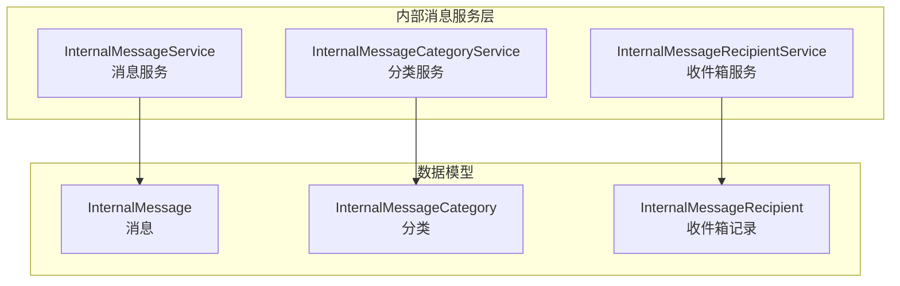
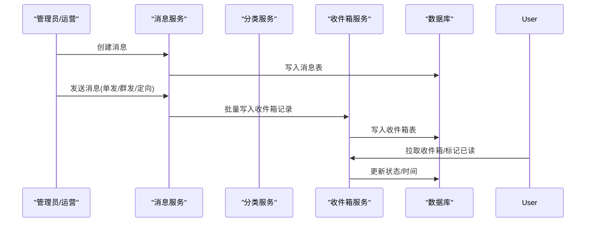
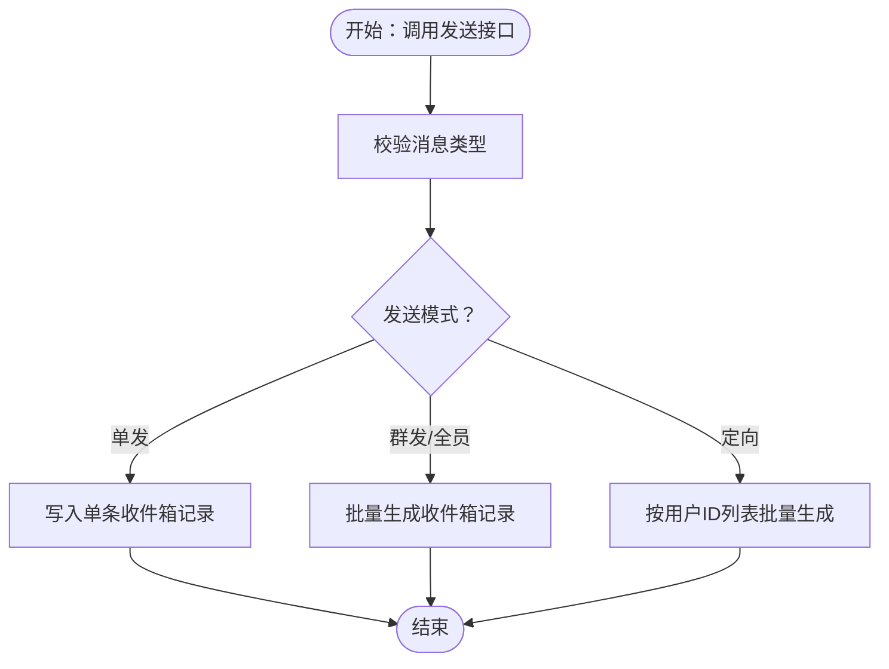
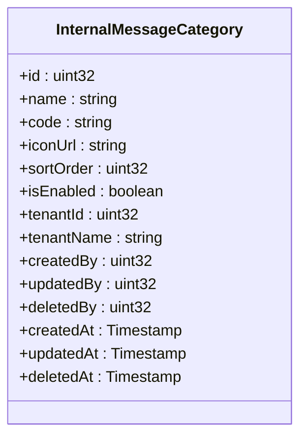
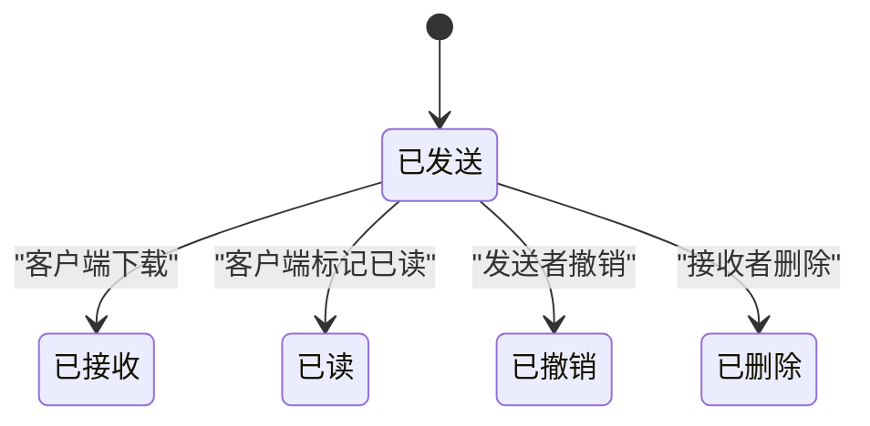
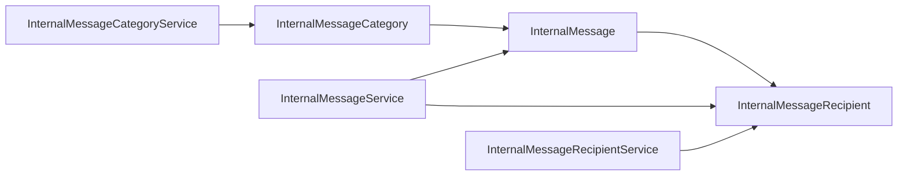

# 内部消息

<cite>
**本文引用的文件**
- [internal_message.proto](file://backend/api/protos/internal_message/service/v1/internal_message.proto)
- [internal_message_category.proto](file://backend/api/protos/internal_message/service/v1/internal_message_category.proto)
- [internal_message_recipient.proto](file://backend/api/protos/internal_message/service/v1/internal_message_recipient.proto)
- [internal_message.pb.go](file://backend/api/gen/go/internal_message/service/v1/internal_message.pb.go)
- [internal_message_category.pb.go](file://backend/api/gen/go/internal_message/service/v1/internal_message_category.pb.go)
- [internal_message_recipient.pb.go](file://backend/api/gen/go/internal_message/service/v1/internal_message_recipient.pb.go)
</cite>

## 目录
1. [简介](#简介)
2. [项目结构](#项目结构)
3. [核心组件](#核心组件)
4. [架构总览](#架构总览)
5. [详细组件分析](#详细组件分析)
6. [依赖分析](#依赖分析)
7. [性能考虑](#性能考虑)
8. [故障排查指南](#故障排查指南)
9. [结论](#结论)
10. [附录：API接口与使用示例](#附录api接口与使用示例)

## 简介
本文件系统化梳理“内部消息”子系统的设计与实现，覆盖消息分类、消息模板、发送接收、阅读状态、通知机制、性能优化与API接口等关键能力。基于仓库中的Protocol Buffers定义与生成的Go类型，结合通用工程实践，给出可落地的实现建议与最佳实践。

## 项目结构
内部消息相关能力由三类服务构成：
- 消息服务：负责消息的CRUD、发送、撤销等核心业务
- 分类服务：负责消息分类的CRUD与统计
- 收件箱服务：负责用户收件箱的查询、状态变更、批量操作等

图表来源
- [internal_message.proto:16-38](file://backend/api/protos/internal_message/service/v1/internal_message.proto#L16-L38)
- [internal_message_category.proto:14-32](file://backend/api/protos/internal_message/service/v1/internal_message_category.proto#L14-L32)
- [internal_message_recipient.proto:14-46](file://backend/api/protos/internal_message/service/v1/internal_message_recipient.proto#L14-L46)

章节来源
- [internal_message.proto:1-241](file://backend/api/protos/internal_message/service/v1/internal_message.proto#L1-L241)
- [internal_message_category.proto:1-145](file://backend/api/protos/internal_message/service/v1/internal_message_category.proto#L1-L145)
- [internal_message_recipient.proto:1-222](file://backend/api/protos/internal_message/service/v1/internal_message_recipient.proto#L1-L222)

## 核心组件
- 消息实体：包含消息ID、标题、内容、状态、类型、发送者、分类、租户、创建/更新/删除信息等
- 分类实体：包含分类ID、名称、编码、图标、排序、启用状态、租户、创建/更新/删除信息等
- 收件箱实体：包含收件箱记录ID、消息ID、接收用户ID、状态、到达/阅读时间、标题/内容、租户、创建/更新/删除信息等

章节来源
- [internal_message.pb.go:140-161](file://backend/api/gen/go/internal_message/service/v1/internal_message.pb.go#L140-L161)
- [internal_message_category.pb.go:30-48](file://backend/api/gen/go/internal_message/service/v1/internal_message_category.pb.go#L30-L48)
- [internal_message_recipient.pb.go:86-106](file://backend/api/gen/go/internal_message/service/v1/internal_message_recipient.pb.go#L86-L106)

## 架构总览
内部消息采用“服务+实体”的分层设计，通过gRPC暴露统一接口，前端通过HTTP/JSON调用OpenAPI生成的适配层进行交互。消息生命周期从创建到发送再到接收与状态流转，贯穿消息服务、分类服务与收件箱服务。

图表来源
- [internal_message.proto:16-38](file://backend/api/protos/internal_message/service/v1/internal_message.proto#L16-L38)
- [internal_message_recipient.proto:14-46](file://backend/api/protos/internal_message/service/v1/internal_message_recipient.proto#L14-L46)

## 详细组件分析

### 消息服务（InternalMessageService）
职责与能力
- 列表/详情：支持分页查询与字段过滤
- CRUD：创建、更新（支持FieldMask）、删除
- 发送：支持单发、群发、定向发送、指定分类
- 撤销：按消息ID与用户ID撤销

发送策略说明
- 单发：通过接收者用户ID触发
- 群发/全员：通过全员标志位触发
- 定向发送：通过目标用户ID列表触发
- 分类：通过分类ID绑定消息分类

图表来源
- [internal_message.proto:181-221](file://backend/api/protos/internal_message/service/v1/internal_message.proto#L181-L221)

章节来源
- [internal_message.proto:16-38](file://backend/api/protos/internal_message/service/v1/internal_message.proto#L16-L38)
- [internal_message.pb.go:621-727](file://backend/api/gen/go/internal_message/service/v1/internal_message.pb.go#L621-L727)

### 分类服务（InternalMessageCategoryService）
职责与能力
- 列表/统计/详情：支持分页与字段过滤
- CRUD：创建、更新（支持FieldMask）、删除
- 排序：通过排序字段控制显示优先级

图表来源
- [internal_message_category.pb.go:30-48](file://backend/api/gen/go/internal_message/service/v1/internal_message_category.pb.go#L30-L48)

章节来源
- [internal_message_category.proto:14-32](file://backend/api/protos/internal_message/service/v1/internal_message_category.proto#L14-L32)
- [internal_message_category.pb.go:179-229](file://backend/api/gen/go/internal_message/service/v1/internal_message_category.pb.go#L179-L229)

### 收件箱服务（InternalMessageRecipientService）
职责与能力
- 列表/统计/详情：支持分页与字段过滤
- 批量获取：按收件箱记录ID批量查询
- 用户收件箱：按用户维度查询通知
- 状态变更：标记已读、批量删除、自定义状态更新

状态流转
- 系统状态：消息进入收件箱（已发送）
- 客户端回执：接收/下载、已读
- 用户动作：撤销（发送者）、删除（接收者）

图表来源
- [internal_message_recipient.proto:51-57](file://backend/api/protos/internal_message/service/v1/internal_message_recipient.proto#L51-L57)

章节来源
- [internal_message_recipient.proto:14-46](file://backend/api/protos/internal_message/service/v1/internal_message_recipient.proto#L14-L46)
- [internal_message_recipient.pb.go:250-353](file://backend/api/gen/go/internal_message/service/v1/internal_message_recipient.pb.go#L250-L353)

## 依赖分析
- 服务间依赖：消息服务依赖收件箱服务进行发送后的收件箱落库；分类服务独立，供消息创建时选择分类
- 数据模型依赖：收件箱记录依赖消息主表；分类与消息存在外键关联（在实体定义中体现）
- 外部依赖：使用标准时间戳、字段掩码、分页请求等通用类型

图表来源
- [internal_message.proto:40-121](file://backend/api/protos/internal_message/service/v1/internal_message.proto#L40-L121)
- [internal_message_category.proto:34-82](file://backend/api/protos/internal_message/service/v1/internal_message_category.proto#L34-L82)
- [internal_message_recipient.proto:48-108](file://backend/api/protos/internal_message/service/v1/internal_message_recipient.proto#L48-L108)

## 性能考虑
- 分页与字段裁剪
  - 使用分页请求与字段过滤器减少网络传输与渲染压力
  - 建议在列表查询时仅返回必要字段，避免一次性返回全文内容
- 批量操作
  - 发送场景使用批量写入收件箱记录，降低事务开销
  - 支持按收件箱记录ID批量删除与批量已读
- 状态索引
  - 在收件箱表上建立常用查询索引：用户ID、状态、创建时间、消息ID
- 缓存策略
  - 对热点分类与消息模板进行缓存，降低数据库压力
  - 对用户收件箱未读数进行聚合缓存，减少频繁统计
- 异步处理
  - 发送流程可引入消息队列异步写入收件箱，提升吞吐
- 搜索优化
  - 对标题/内容建立全文索引或使用搜索引擎，支持关键词检索

## 故障排查指南
- 发送失败
  - 检查发送参数：类型、接收者、定向用户列表、全员标志
  - 核对权限：发送者是否有发送权限
- 状态异常
  - 校验客户端回执上报：接收/已读上报是否正确
  - 核对撤销/删除操作是否符合业务规则
- 查询异常
  - 确认分页参数与字段过滤器是否合理
  - 检查索引是否存在，避免全表扫描

## 结论
内部消息系统以清晰的服务边界与实体模型为基础，覆盖了消息生命周期的关键环节。通过分类管理、灵活的发送策略、完善的收件箱状态管理以及可扩展的通知机制，能够满足企业内部高效沟通的需求。配合合理的性能优化与运维监控，可在高并发场景下保持稳定与高效。

## 附录：API接口与使用示例
以下为各服务提供的RPC接口清单与典型使用路径（以路径引用代替具体代码片段）：

- 消息服务（InternalMessageService）
  - 列表/详情/创建/更新/删除：参见 [internal_message.proto:16-38](file://backend/api/protos/internal_message/service/v1/internal_message.proto#L16-L38)
  - 发送：参见 [internal_message.proto:34-34](file://backend/api/protos/internal_message/service/v1/internal_message.proto#L34-L34)
  - 撤销：参见 [internal_message.proto:37-37](file://backend/api/protos/internal_message/service/v1/internal_message.proto#L37-L37)

- 分类服务（InternalMessageCategoryService）
  - 列表/统计/详情/创建/更新/删除：参见 [internal_message_category.proto:14-32](file://backend/api/protos/internal_message/service/v1/internal_message_category.proto#L14-L32)

- 收件箱服务（InternalMessageRecipientService）
  - 列表/统计/详情/创建/更新/删除：参见 [internal_message_recipient.proto:14-31](file://backend/api/protos/internal_message/service/v1/internal_message_recipient.proto#L14-L31)
  - 批量获取/用户收件箱/删除通知/标记已读/状态变更：参见 [internal_message_recipient.proto:32-46](file://backend/api/protos/internal_message/service/v1/internal_message_recipient.proto#L32-L46)

章节来源
- [internal_message.proto:16-38](file://backend/api/protos/internal_message/service/v1/internal_message.proto#L16-L38)
- [internal_message_category.proto:14-32](file://backend/api/protos/internal_message/service/v1/internal_message_category.proto#L14-L32)
- [internal_message_recipient.proto:14-46](file://backend/api/protos/internal_message/service/v1/internal_message_recipient.proto#L14-L46)