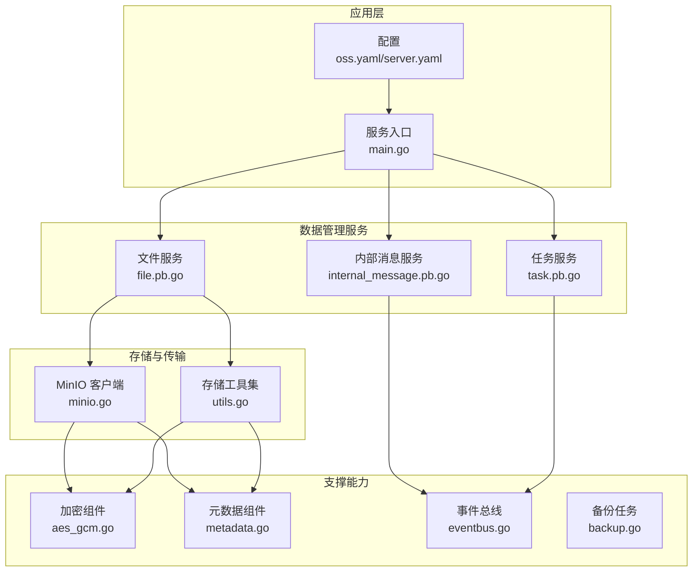
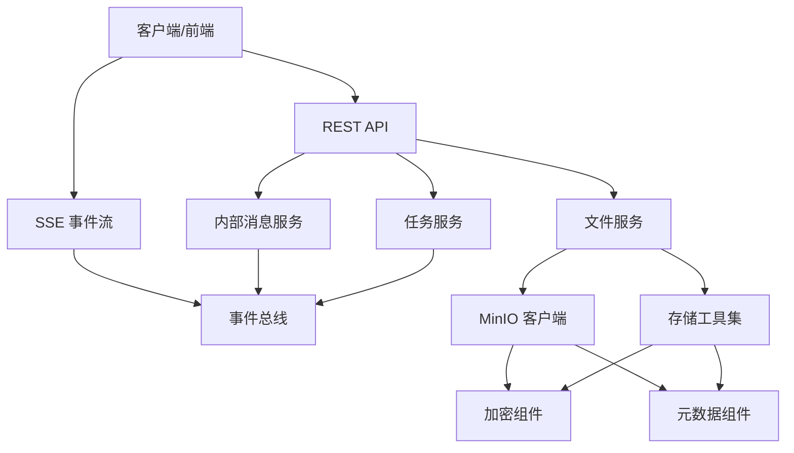
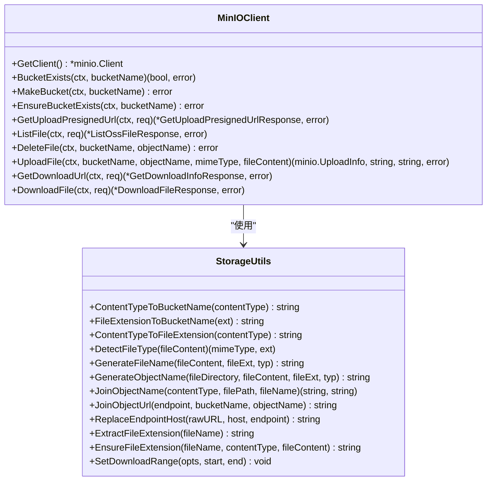
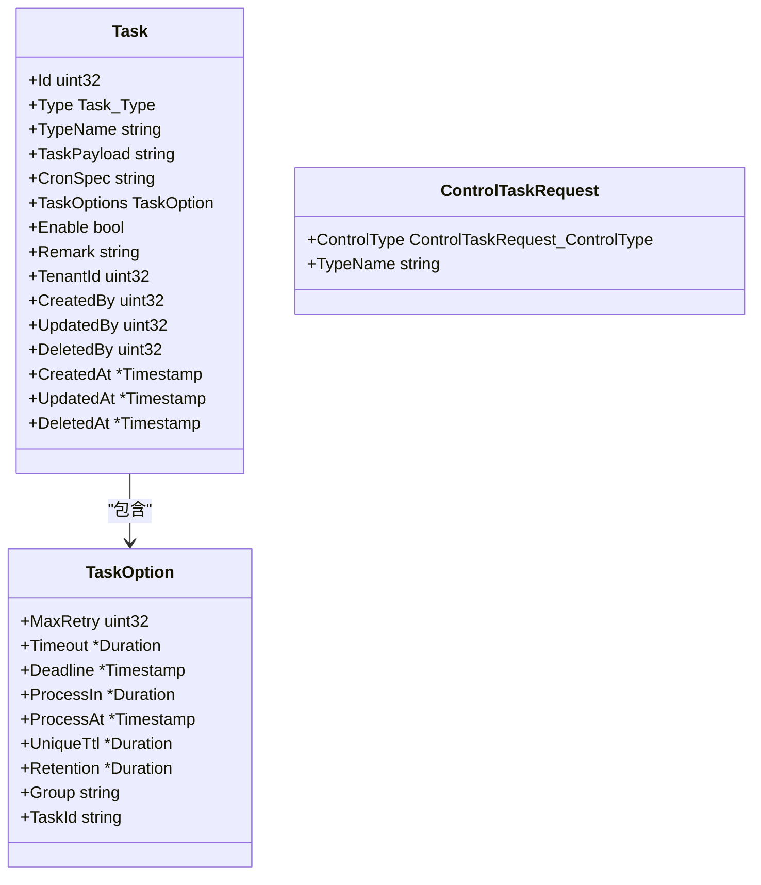
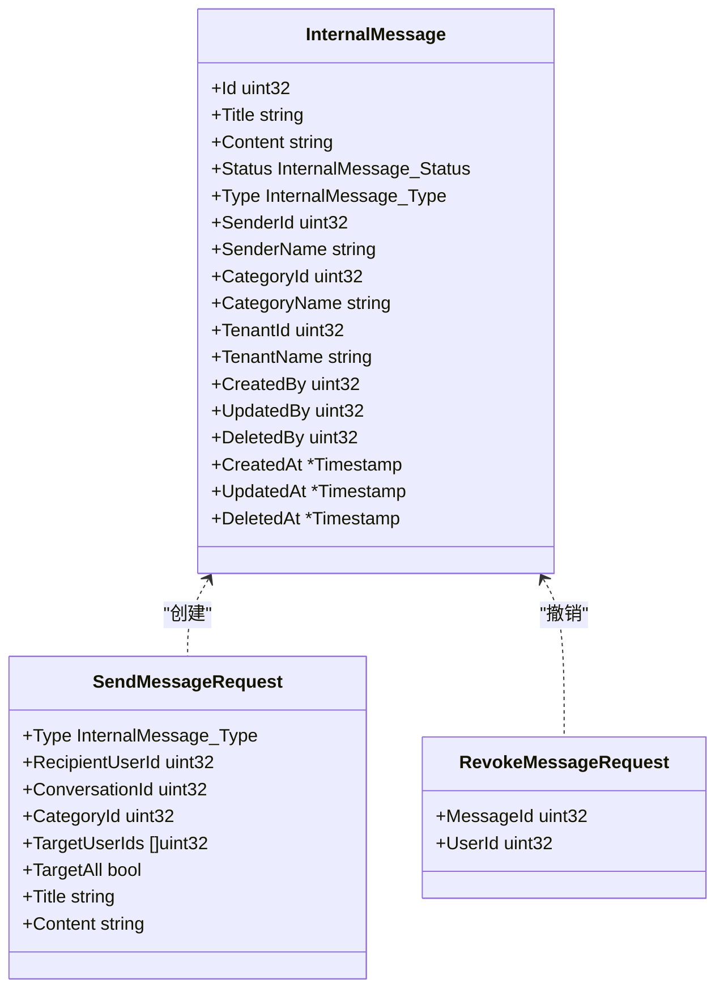
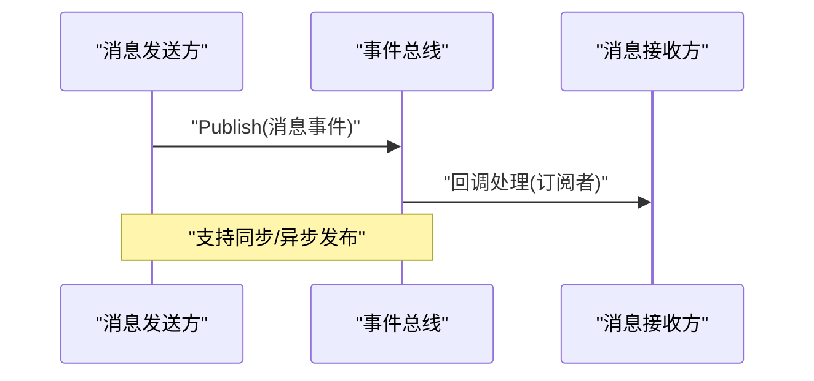
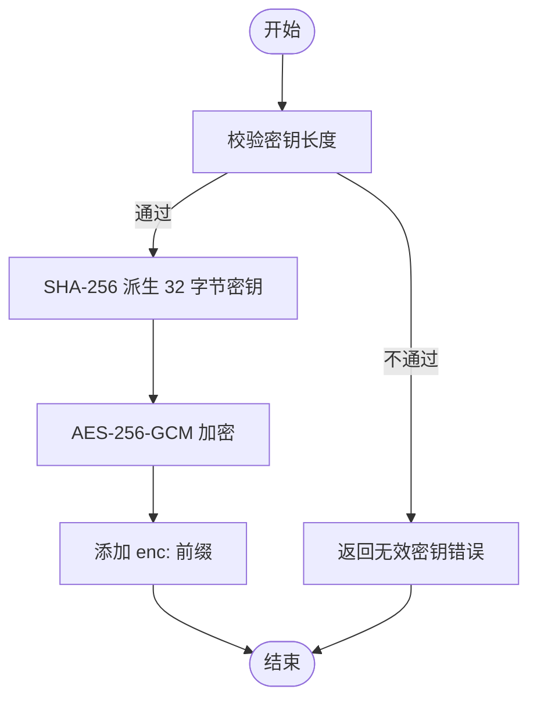
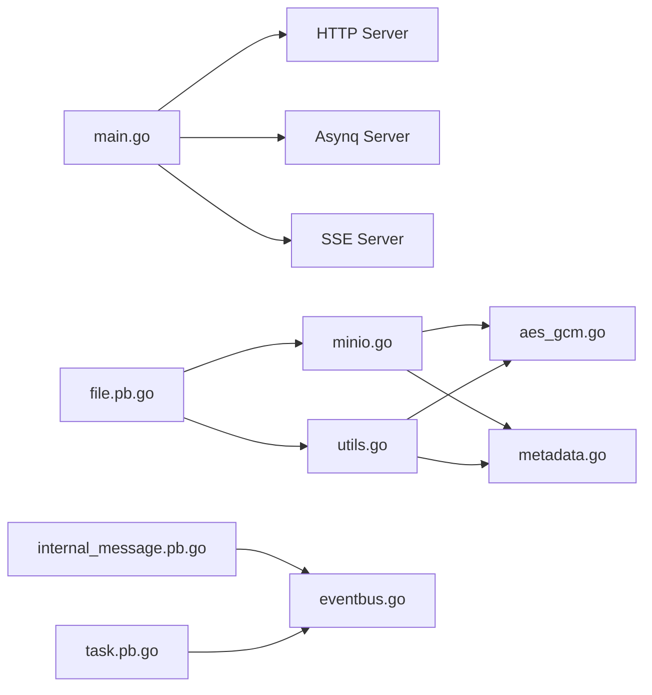

# 数据管理功能

<cite>
**本文档引用的文件**
- [main.go](file://backend/app/admin/service/cmd/server/main.go)
- [minio.go](file://backend/pkg/oss/minio.go)
- [utils.go](file://backend/pkg/oss/utils.go)
- [file.pb.go](file://backend/api/gen/go/storage/service/v1/file.pb.go)
- [internal_message.pb.go](file://backend/api/gen/go/internal_message/service/v1/internal_message.pb.go)
- [task.pb.go](file://backend/api/gen/go/task/service/v1/task.pb.go)
- [backup.go](file://backend/pkg/task/backup.go)
- [eventbus.go](file://backend/pkg/eventbus/eventbus.go)
- [aes_gcm.go](file://backend/pkg/crypto/aes_gcm.go)
- [metadata.go](file://backend/pkg/metadata/metadata.go)
- [oss.yaml](file://backend/app/admin/service/configs/oss.yaml)
- [server.yaml](file://backend/app/admin/service/configs/server.yaml)
</cite>

## 目录
1. [简介](#简介)
2. [项目结构](#项目结构)
3. [核心组件](#核心组件)
4. [架构总览](#架构总览)
5. [详细组件分析](#详细组件分析)
6. [依赖关系分析](#依赖关系分析)
7. [性能考虑](#性能考虑)
8. [故障排查指南](#故障排查指南)
9. [结论](#结论)

## 简介
本文件系统性梳理 GoWind 项目的数据管理功能模块，涵盖文件管理与传输、任务调度、内部消息服务，并深入解析其架构设计与实现要点。重点包括：
- 文件系统架构：存储策略、元数据模型、访问控制与版本控制思路
- 文件传输安全：加密传输、断点续传、进度跟踪、错误重试
- 任务调度系统：任务类型、执行策略、优先级与监控告警
- 内部消息服务：消息分类、发送接收、阅读状态与通知提醒
- 性能优化：缓存策略、并发控制、资源限制与容量规划

## 项目结构
数据管理相关的核心代码分布在以下位置：
- 服务入口与运行时：backend/app/admin/service/cmd/server/main.go
- 文件存储与传输：backend/pkg/oss/minio.go、backend/pkg/oss/utils.go
- 协议定义与数据模型：backend/api/gen/go/storage/service/v1/file.pb.go、backend/api/gen/go/internal_message/service/v1/internal_message.pb.go、backend/api/gen/go/task/service/v1/task.pb.go
- 任务与事件：backend/pkg/task/backup.go、backend/pkg/eventbus/eventbus.go
- 加密与元数据：backend/pkg/crypto/aes_gcm.go、backend/pkg/metadata/metadata.go
- 配置：backend/app/admin/service/configs/oss.yaml、backend/app/admin/service/configs/server.yaml

图表来源
- [main.go:46-76](file://backend/app/admin/service/cmd/server/main.go#L46-L76)
- [oss.yaml:1-10](file://backend/app/admin/service/configs/oss.yaml#L1-L10)
- [server.yaml:1-49](file://backend/app/admin/service/configs/server.yaml#L1-L49)

章节来源
- [main.go:46-76](file://backend/app/admin/service/cmd/server/main.go#L46-L76)
- [oss.yaml:1-10](file://backend/app/admin/service/configs/oss.yaml#L1-L10)
- [server.yaml:1-49](file://backend/app/admin/service/configs/server.yaml#L1-L49)

## 核心组件
- 文件服务：提供文件上传、下载、列表、删除等能力，支持预签名直传与直连下载两种模式，具备断点续传与范围下载能力。
- 内部消息服务：支持通知、私信、群聊三类消息，提供发送、撤销、查询、分类管理等接口。
- 任务服务：支持周期性、延时、等待结果三类任务，提供统一的任务选项与控制接口。
- 事件总线：提供订阅/发布、一次性订阅、异步发布、关闭清理等能力，用于解耦模块间通信。
- 加密组件：提供 AES-256-GCM 加密/解密，支持密钥派生与前缀标记。
- 元数据组件：提供操作者元数据的编解码与上下文传递。

章节来源
- [file.pb.go:101-296](file://backend/api/gen/go/storage/service/v1/file.pb.go#L101-L296)
- [internal_message.pb.go:140-161](file://backend/api/gen/go/internal_message/service/v1/internal_message.pb.go#L140-L161)
- [task.pb.go:241-260](file://backend/api/gen/go/task/service/v1/task.pb.go#L241-L260)
- [eventbus.go:12-34](file://backend/pkg/eventbus/eventbus.go#L12-L34)
- [aes_gcm.go:26-44](file://backend/pkg/crypto/aes_gcm.go#L26-L44)
- [metadata.go:15-28](file://backend/pkg/metadata/metadata.go#L15-L28)

## 架构总览
数据管理采用分层架构：
- 表现层：HTTP REST 与 SSE 事件推送
- 业务层：文件、消息、任务三大服务
- 传输层：MinIO 对象存储，支持预签名直传
- 支撑层：加密、元数据、事件总线

图表来源
- [main.go:46-76](file://backend/app/admin/service/cmd/server/main.go#L46-L76)
- [server.yaml:30-49](file://backend/app/admin/service/configs/server.yaml#L30-L49)
- [minio.go:28-43](file://backend/pkg/oss/minio.go#L28-L43)

## 详细组件分析

### 文件管理与传输
- 存储策略
  - 桶命名规则：根据 MIME 主类型自动选择 images/videos/audios/docs/files 等桶，支持扩展名映射与内容类型推断。
  - 对象命名：支持 UUID、内容 SHA256、HMAC 内容、时间戳+随机后缀等多种策略，兼顾唯一性、去重与可读性。
  - 路径组织：通过目录前缀与扩展名拼接形成对象名，避免重复与非法路径。
- 元数据管理
  - File 模型包含 Provider、BucketName、FileDirectory、FileGuid、SaveFileName、FileName、Extension、Size、LinkUrl、ContentHash、TenantId 等字段，覆盖存储、租户、内容校验等关键信息。
- 访问控制
  - 通过预签名 URL 实现安全直传与直链下载，支持替换 Endpoint Host 与自定义过期时间。
- 版本控制
  - 当前协议未显式定义版本字段，建议在对象元数据中引入版本号字段并在上传时递增，配合对象命名策略实现版本化存储。
- 传输安全保障
  - 预签名直传：支持 PUT/POST 两种方式，自动注入表单参数与过期策略。
  - 直连下载：支持范围请求与校验和返回，便于断点续传与完整性校验。
  - 加密传输：结合 TLS 与预签名 URL，确保传输链路安全。
- 断点续传与进度跟踪
  - 通过范围下载与校验和实现断点续传；进度跟踪可通过已下载大小与总大小计算百分比。
- 错误重试
  - 上传/下载失败时，建议基于指数退避策略重试，并记录重试次数与原因。

图表来源
- [minio.go:28-467](file://backend/pkg/oss/minio.go#L28-L467)
- [utils.go:37-530](file://backend/pkg/oss/utils.go#L37-L530)

章节来源
- [minio.go:87-163](file://backend/pkg/oss/minio.go#L87-L163)
- [minio.go:201-263](file://backend/pkg/oss/minio.go#L201-L263)
- [minio.go:348-364](file://backend/pkg/oss/minio.go#L348-L364)
- [minio.go:450-466](file://backend/pkg/oss/minio.go#L450-L466)
- [utils.go:37-125](file://backend/pkg/oss/utils.go#L37-L125)
- [utils.go:404-422](file://backend/pkg/oss/utils.go#L404-L422)
- [utils.go:424-444](file://backend/pkg/oss/utils.go#L424-L444)
- [utils.go:446-465](file://backend/pkg/oss/utils.go#L446-L465)
- [utils.go:467-482](file://backend/pkg/oss/utils.go#L467-L482)
- [utils.go:484-514](file://backend/pkg/oss/utils.go#L484-L514)
- [utils.go:516-530](file://backend/pkg/oss/utils.go#L516-L530)
- [file.pb.go:101-296](file://backend/api/gen/go/storage/service/v1/file.pb.go#L101-L296)

### 任务调度系统
- 任务类型
  - 周期性任务：基于 Cron 表达式定时执行
  - 延时任务：延迟一段时间后执行
  - 等待结果：等待前置任务完成后继续
- 执行策略
  - 任务选项支持最大重试次数、超时、截止时间、唯一锁 TTL、结果保留时间、分组与任务 ID
  - 通过队列优先级与并发度控制执行节奏
- 控制接口
  - 支持启动、停止、重启等控制操作
- 监控告警
  - 建议结合事件总线发布任务状态变更事件，供监控系统采集

图表来源
- [task.pb.go:131-145](file://backend/api/gen/go/task/service/v1/task.pb.go#L131-L145)
- [task.pb.go:240-260](file://backend/api/gen/go/task/service/v1/task.pb.go#L240-L260)
- [task.pb.go:767-774](file://backend/api/gen/go/task/service/v1/task.pb.go#L767-L774)

章节来源
- [task.pb.go:31-52](file://backend/api/gen/go/task/service/v1/task.pb.go#L31-L52)
- [task.pb.go:131-145](file://backend/api/gen/go/task/service/v1/task.pb.go#L131-L145)
- [task.pb.go:240-260](file://backend/api/gen/go/task/service/v1/task.pb.go#L240-L260)
- [task.pb.go:767-774](file://backend/api/gen/go/task/service/v1/task.pb.go#L767-L774)
- [backup.go:5-18](file://backend/pkg/task/backup.go#L5-L18)

### 内部消息服务
- 消息分类
  - 通知：系统广播或公告
  - 私信：一对一消息
  - 群聊：多人群发
- 发送接收
  - 支持定向发送、全员发送、按分类发送
  - 提供撤销接口
- 阅读状态与通知提醒
  - 建议在消息模型中增加阅读状态字段与已读人数统计，并通过 SSE 推送实时提醒
- 数据模型
  - InternalMessage 包含状态、类型、发送者、分类、租户、创建/更新/删除时间等字段

图表来源
- [internal_message.pb.go:140-161](file://backend/api/gen/go/internal_message/service/v1/internal_message.pb.go#L140-L161)
- [internal_message.pb.go:621-720](file://backend/api/gen/go/internal_message/service/v1/internal_message.pb.go#L621-L720)
- [internal_message.pb.go:765-771](file://backend/api/gen/go/internal_message/service/v1/internal_message.pb.go#L765-L771)

章节来源
- [internal_message.pb.go:30-60](file://backend/api/gen/go/internal_message/service/v1/internal_message.pb.go#L30-L60)
- [internal_message.pb.go:89-110](file://backend/api/gen/go/internal_message/service/v1/internal_message.pb.go#L89-L110)
- [internal_message.pb.go:140-161](file://backend/api/gen/go/internal_message/service/v1/internal_message.pb.go#L140-L161)
- [internal_message.pb.go:621-720](file://backend/api/gen/go/internal_message/service/v1/internal_message.pb.go#L621-L720)
- [internal_message.pb.go:765-771](file://backend/api/gen/go/internal_message/service/v1/internal_message.pb.go#L765-L771)

### 事件总线与内部消息集成
- 事件总线提供订阅/发布、一次性订阅、异步发布、关闭清理等能力
- 内部消息服务可借助事件总线实现跨模块解耦，如消息投递成功/失败事件、阅读状态变更事件等

图表来源
- [eventbus.go:106-152](file://backend/pkg/eventbus/eventbus.go#L106-L152)
- [eventbus.go:154-167](file://backend/pkg/eventbus/eventbus.go#L154-L167)

章节来源
- [eventbus.go:12-34](file://backend/pkg/eventbus/eventbus.go#L12-L34)
- [eventbus.go:106-152](file://backend/pkg/eventbus/eventbus.go#L106-L152)
- [eventbus.go:154-167](file://backend/pkg/eventbus/eventbus.go#L154-L167)

### 加密与元数据
- 加密组件
  - AES-256-GCM 加密/解密，密钥通过 SHA-256 派生，支持前缀标记与错误处理
- 元数据组件
  - 将操作者元数据编码为 Base64 并放入 Kratos Metadata，支持上下文传递与解码

图表来源
- [aes_gcm.go:32-44](file://backend/pkg/crypto/aes_gcm.go#L32-L44)
- [aes_gcm.go:46-78](file://backend/pkg/crypto/aes_gcm.go#L46-L78)
- [aes_gcm.go:80-130](file://backend/pkg/crypto/aes_gcm.go#L80-L130)

章节来源
- [aes_gcm.go:26-44](file://backend/pkg/crypto/aes_gcm.go#L26-L44)
- [aes_gcm.go:46-78](file://backend/pkg/crypto/aes_gcm.go#L46-L78)
- [aes_gcm.go:80-130](file://backend/pkg/crypto/aes_gcm.go#L80-L130)
- [metadata.go:22-47](file://backend/pkg/metadata/metadata.go#L22-L47)

## 依赖关系分析
- 服务入口依赖 Kratos Bootstrap 初始化 HTTP、Asynq、SSE 服务
- 文件服务依赖 MinIO 客户端与存储工具集
- 事件总线为消息与任务服务提供解耦通信
- 加密与元数据组件被存储与传输流程广泛使用

图表来源
- [main.go:46-76](file://backend/app/admin/service/cmd/server/main.go#L46-L76)
- [minio.go:28-43](file://backend/pkg/oss/minio.go#L28-L43)
- [utils.go:37-530](file://backend/pkg/oss/utils.go#L37-L530)
- [eventbus.go:12-34](file://backend/pkg/eventbus/eventbus.go#L12-L34)

章节来源
- [main.go:46-76](file://backend/app/admin/service/cmd/server/main.go#L46-L76)
- [minio.go:28-43](file://backend/pkg/oss/minio.go#L28-L43)
- [utils.go:37-530](file://backend/pkg/oss/utils.go#L37-L530)
- [eventbus.go:12-34](file://backend/pkg/eventbus/eventbus.go#L12-L34)

## 性能考虑
- 缓存策略
  - 对象元数据与常用查询结果可缓存于内存，结合 LRU 或 TTL 管理
  - 预签名 URL 可短期缓存以减少重复生成开销
- 并发控制
  - MinIO 上传/下载使用流式读取，避免大文件内存占用
  - Asynq 队列按优先级分配并发度，critical > default > low
- 资源限制
  - 上传文件大小限制、并发连接数限制、队列深度限制
- 容量规划
  - 按媒体类型划分桶，结合生命周期策略与冷热分层
  - 监控存储使用率与 IOPS，动态扩容

## 故障排查指南
- 文件上传失败
  - 检查桶是否存在与权限，确认预签名 URL 过期时间与 Endpoint Host 替换是否正确
  - 查看日志中的错误码与堆栈信息
- 文件下载异常
  - 确认 Range 参数与校验和一致性，检查网络中断与重试策略
- 任务执行异常
  - 检查队列配置与并发度，查看任务选项中的重试次数与超时设置
- 事件总线异常
  - 确认订阅者注册与处理器返回值，避免阻塞导致事件丢失

章节来源
- [minio.go:50-84](file://backend/pkg/oss/minio.go#L50-L84)
- [minio.go:183-199](file://backend/pkg/oss/minio.go#L183-L199)
- [minio.go:317-346](file://backend/pkg/oss/minio.go#L317-L346)
- [minio.go:419-448](file://backend/pkg/oss/minio.go#L419-L448)
- [server.yaml:30-42](file://backend/app/admin/service/configs/server.yaml#L30-L42)
- [eventbus.go:106-152](file://backend/pkg/eventbus/eventbus.go#L106-L152)

## 结论
本数据管理功能模块以清晰的分层架构与完善的协议模型为基础，结合 MinIO 对象存储与事件总线，实现了文件管理与传输、任务调度、内部消息服务的协同工作。通过合理的存储策略、元数据模型与安全传输机制，能够满足高并发、可扩展的数据管理需求。建议后续在版本控制、阅读状态与通知提醒等方面进一步完善，并持续优化缓存与并发策略以提升整体性能与稳定性。