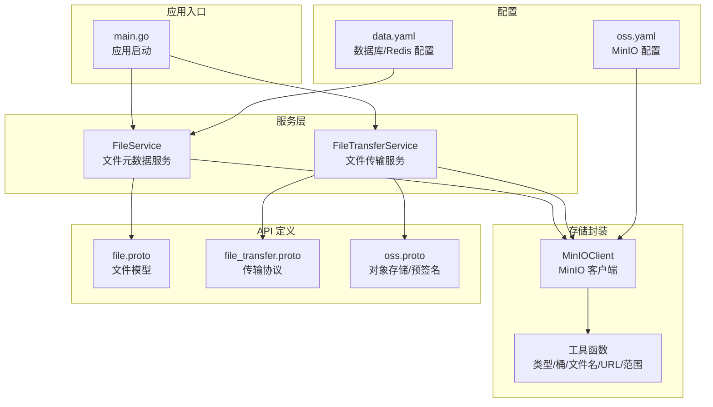
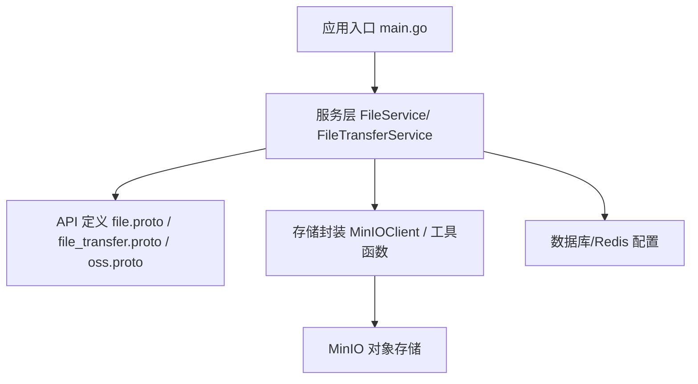
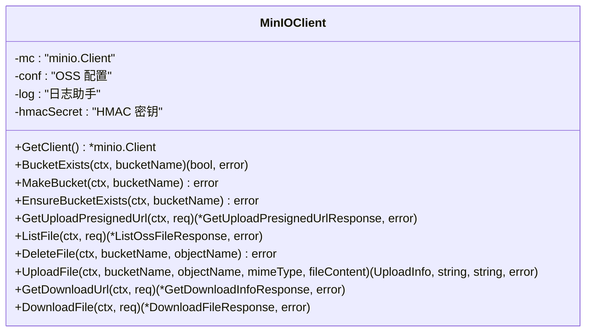
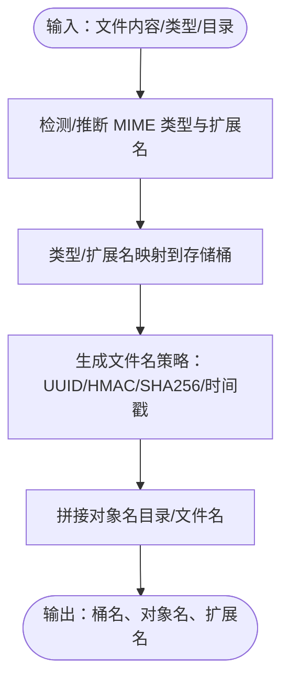
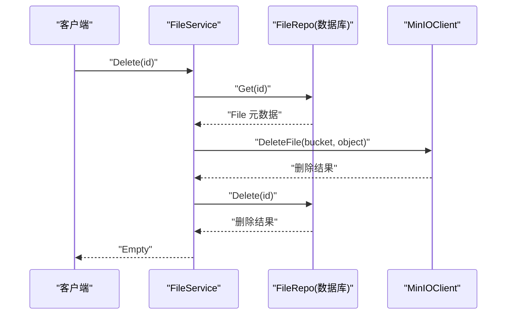
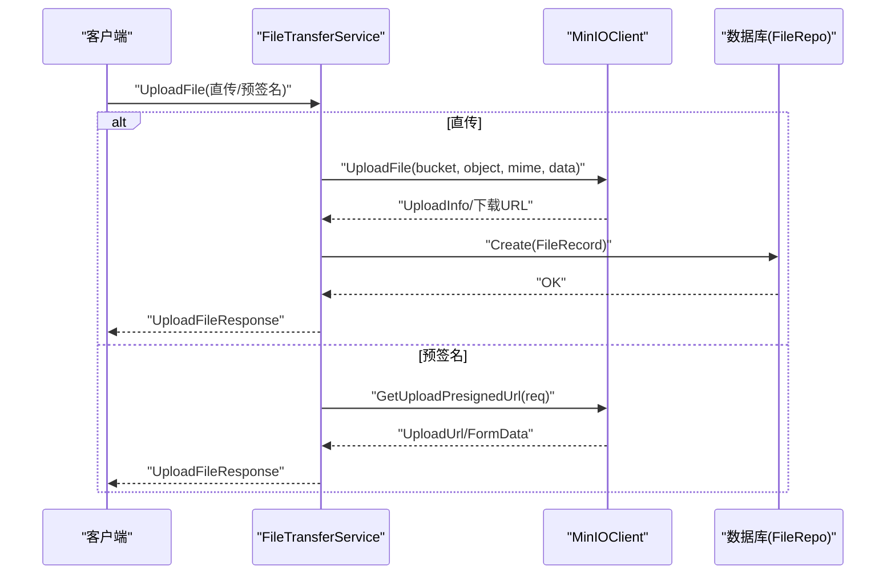
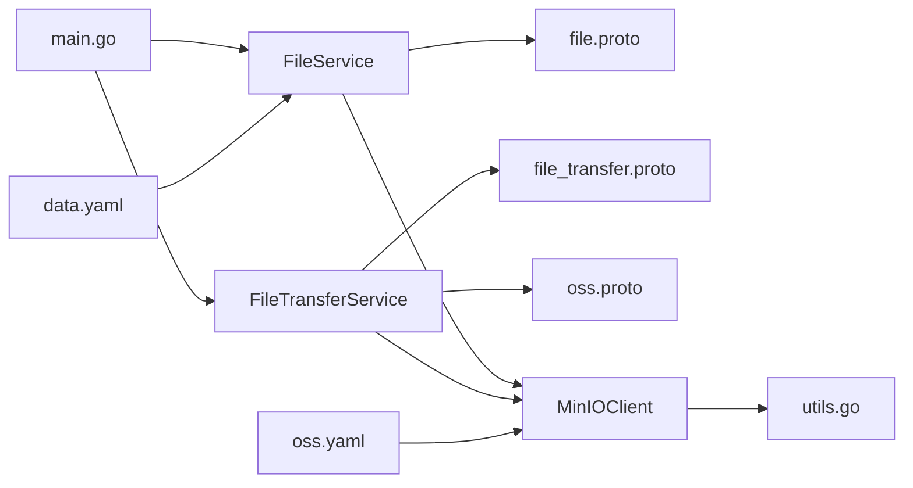

# 文件管理

<cite>
**本文引用的文件**
- [backend/app/admin/service/cmd/server/main.go](file://backend/app/admin/service/cmd/server/main.go)
- [backend/pkg/oss/minio.go](file://backend/pkg/oss/minio.go)
- [backend/pkg/oss/utils.go](file://backend/pkg/oss/utils.go)
- [backend/api/gen/go/storage/service/v1/file.pb.go](file://backend/api/gen/go/storage/service/v1/file.pb.go)
- [backend/api/gen/go/storage/service/v1/file_transfer.pb.go](file://backend/api/gen/go/storage/service/v1/file_transfer.pb.go)
- [backend/api/gen/go/storage/service/v1/oss.pb.go](file://backend/api/gen/go/storage/service/v1/oss.pb.go)
- [backend/app/admin/service/internal/service/file_service.go](file://backend/app/admin/service/internal/service/file_service.go)
- [backend/app/admin/service/internal/service/file_transfer_service.go](file://backend/app/admin/service/internal/service/file_transfer_service.go)
- [backend/app/admin/service/configs/oss.yaml](file://backend/app/admin/service/configs/oss.yaml)
- [backend/app/admin/service/configs/data.yaml](file://backend/app/admin/service/configs/data.yaml)
- [backend/pkg/oss/minio_test.go](file://backend/pkg/oss/minio_test.go)
</cite>

## 目录
1. [简介](#简介)
2. [项目结构](#项目结构)
3. [核心组件](#核心组件)
4. [架构总览](#架构总览)
5. [详细组件分析](#详细组件分析)
6. [依赖分析](#依赖分析)
7. [性能考虑](#性能考虑)
8. [故障排查指南](#故障排查指南)
9. [结论](#结论)
10. [附录](#附录)

## 简介
本文件管理模块提供完整的文件上传、下载、删除与查询能力，围绕 MinIO 对象存储构建，结合文件元数据模型与访问控制，形成统一的文件管理服务。系统通过 gRPC/HTTP 接口对外提供能力，支持预签名直传、断点续传、范围下载、进度跟踪、错误重试等特性，并具备基于租户与用户的权限控制、多桶分类存储、文件名生成策略、以及与数据库的元数据联动。

## 项目结构
- 后端采用 Kratos 应用框架，入口位于服务启动程序，负责初始化配置与应用容器。
- 存储层封装在 pkg/oss 中，提供 MinIO 客户端、工具函数（类型到桶映射、文件名生成、URL 拼接等）。
- 服务层位于 app/admin/service/internal/service，包含文件元数据服务与文件传输服务。
- API 定义位于 api/gen/go/storage/service/v1，包含文件模型、传输协议与对象存储相关消息定义。
- 配置位于 app/admin/service/configs，包含 OSS 与数据源配置。

图表来源
- [backend/app/admin/service/cmd/server/main.go:1-76](file://backend/app/admin/service/cmd/server/main.go#L1-L76)
- [backend/app/admin/service/internal/service/file_service.go:1-116](file://backend/app/admin/service/internal/service/file_service.go#L1-L116)
- [backend/app/admin/service/internal/service/file_transfer_service.go:1-338](file://backend/app/admin/service/internal/service/file_transfer_service.go#L1-L338)
- [backend/pkg/oss/minio.go:1-467](file://backend/pkg/oss/minio.go#L1-L467)
- [backend/pkg/oss/utils.go:1-530](file://backend/pkg/oss/utils.go#L1-L530)
- [backend/api/gen/go/storage/service/v1/file.pb.go:1-853](file://backend/api/gen/go/storage/service/v1/file.pb.go#L1-L853)
- [backend/api/gen/go/storage/service/v1/file_transfer.pb.go:1-614](file://backend/api/gen/go/storage/service/v1/file_transfer.pb.go#L1-L614)
- [backend/api/gen/go/storage/service/v1/oss.pb.go:1-1053](file://backend/api/gen/go/storage/service/v1/oss.pb.go#L1-L1053)
- [backend/app/admin/service/configs/oss.yaml:1-10](file://backend/app/admin/service/configs/oss.yaml#L1-L10)
- [backend/app/admin/service/configs/data.yaml:1-21](file://backend/app/admin/service/configs/data.yaml#L1-L21)

章节来源
- [backend/app/admin/service/cmd/server/main.go:1-76](file://backend/app/admin/service/cmd/server/main.go#L1-L76)
- [backend/app/admin/service/configs/oss.yaml:1-10](file://backend/app/admin/service/configs/oss.yaml#L1-L10)
- [backend/app/admin/service/configs/data.yaml:1-21](file://backend/app/admin/service/configs/data.yaml#L1-L21)

## 核心组件
- MinIO 客户端封装：提供桶检查/创建、上传（PUT/POST 预签名）、下载（直接/预签名）、列举、删除等能力。
- 工具函数：文件类型到桶映射、文件名生成策略（UUID、内容 SHA256、HMAC 内容、时间戳）、扩展名提取与补全、URL 拼接与替换、下载范围设置。
- 文件元数据服务：提供文件列表、计数、查询、创建、更新、删除等接口，删除时联动对象存储删除。
- 文件传输服务：封装上传（直传/预签名）、下载（ID/对象/URL）、记录元数据到数据库。
- API 定义：统一的文件模型、传输协议与对象存储消息，支持范围下载、预签名选项、Content-Disposition、MIME 类型协商等。

章节来源
- [backend/pkg/oss/minio.go:1-467](file://backend/pkg/oss/minio.go#L1-L467)
- [backend/pkg/oss/utils.go:1-530](file://backend/pkg/oss/utils.go#L1-L530)
- [backend/app/admin/service/internal/service/file_service.go:1-116](file://backend/app/admin/service/internal/service/file_service.go#L1-L116)
- [backend/app/admin/service/internal/service/file_transfer_service.go:1-338](file://backend/app/admin/service/internal/service/file_transfer_service.go#L1-L338)
- [backend/api/gen/go/storage/service/v1/file.pb.go:1-853](file://backend/api/gen/go/storage/service/v1/file.pb.go#L1-L853)
- [backend/api/gen/go/storage/service/v1/file_transfer.pb.go:1-614](file://backend/api/gen/go/storage/service/v1/file_transfer.pb.go#L1-L614)
- [backend/api/gen/go/storage/service/v1/oss.pb.go:1-1053](file://backend/api/gen/go/storage/service/v1/oss.pb.go#L1-L1053)

## 架构总览
文件管理服务由“应用入口”、“服务层”、“存储封装”、“API 定义”和“配置”五部分组成。应用启动后，加载配置，注册服务，对外提供 gRPC/HTTP 接口。服务层通过 MinIO 客户端与对象存储交互，同时维护文件元数据。

图表来源
- [backend/app/admin/service/cmd/server/main.go:1-76](file://backend/app/admin/service/cmd/server/main.go#L1-L76)
- [backend/app/admin/service/internal/service/file_service.go:1-116](file://backend/app/admin/service/internal/service/file_service.go#L1-L116)
- [backend/app/admin/service/internal/service/file_transfer_service.go:1-338](file://backend/app/admin/service/internal/service/file_transfer_service.go#L1-L338)
- [backend/pkg/oss/minio.go:1-467](file://backend/pkg/oss/minio.go#L1-L467)
- [backend/pkg/oss/utils.go:1-530](file://backend/pkg/oss/utils.go#L1-L530)
- [backend/api/gen/go/storage/service/v1/file.pb.go:1-853](file://backend/api/gen/go/storage/service/v1/file.pb.go#L1-L853)
- [backend/api/gen/go/storage/service/v1/file_transfer.pb.go:1-614](file://backend/api/gen/go/storage/service/v1/file_transfer.pb.go#L1-L614)
- [backend/api/gen/go/storage/service/v1/oss.pb.go:1-1053](file://backend/api/gen/go/storage/service/v1/oss.pb.go#L1-L1053)
- [backend/app/admin/service/configs/oss.yaml:1-10](file://backend/app/admin/service/configs/oss.yaml#L1-L10)
- [backend/app/admin/service/configs/data.yaml:1-21](file://backend/app/admin/service/configs/data.yaml#L1-L21)

## 详细组件分析

### MinIO 客户端封装（MinIOClient）
- 功能要点
  - 桶存在性检查与自动创建
  - 上传：支持 PUT/POST 预签名，返回上传/下载 URL、对象名、表单数据
  - 下载：支持直接返回字节或预签名 URL，支持范围下载
  - 列举：按前缀与递归列出对象
  - 删除：按桶与对象键删除
- 关键流程
  - 生成上传预签名 URL：根据方法（PUT/POST）、内容类型、过期时间、桶与对象名生成
  - 生成下载预签名 URL：根据对象键与过期时间生成
  - 下载范围：通过 GetObjectOptions 设置 Range
- 错误处理
  - 对象存储异常统一包装为服务端错误码
  - 参数缺失或非法返回明确错误

图表来源
- [backend/pkg/oss/minio.go:27-467](file://backend/pkg/oss/minio.go#L27-L467)

章节来源
- [backend/pkg/oss/minio.go:1-467](file://backend/pkg/oss/minio.go#L1-L467)

### 工具函数（类型/桶/文件名/URL/范围）
- 类型到桶映射：根据 MIME 类型或扩展名自动选择 images/videos/audios/docs/files 桶
- 文件名生成策略：UUID、内容 SHA256、HMAC 内容、时间戳
- URL 拼接与主机替换：统一拼接对象 URL，支持替换 Endpoint Host
- 扩展名提取与补全：从文件名、内容类型、内容检测三路补全
- 下载范围设置：支持闭区间/开区间范围

图表来源
- [backend/pkg/oss/utils.go:37-436](file://backend/pkg/oss/utils.go#L37-L436)

章节来源
- [backend/pkg/oss/utils.go:1-530](file://backend/pkg/oss/utils.go#L1-L530)

### 文件元数据服务（FileService）
- 提供文件列表、计数、查询、创建、更新、删除
- 删除时联动调用 MinIO 客户端删除对象
- 自动填充创建/更新用户信息

图表来源
- [backend/app/admin/service/internal/service/file_service.go:95-115](file://backend/app/admin/service/internal/service/file_service.go#L95-L115)
- [backend/pkg/oss/minio.go:183-199](file://backend/pkg/oss/minio.go#L183-L199)

章节来源
- [backend/app/admin/service/internal/service/file_service.go:1-116](file://backend/app/admin/service/internal/service/file_service.go#L1-L116)

### 文件传输服务（FileTransferService）
- 上传
  - 直传：直接将文件内容上传至 MinIO，记录元数据
  - 预签名：生成上传 URL，前端直传 MinIO
- 下载
  - 支持按文件 ID、对象键、外部 URL 三种方式
  - 支持预签名 URL 与直接返回字节两种模式
  - 支持范围下载与 Content-Disposition/MIME 协商
- 元数据记录：上传成功后记录 Provider、Bucket、目录、保存名、扩展名、大小、内容哈希、下载链接、租户与用户信息

图表来源
- [backend/app/admin/service/internal/service/file_transfer_service.go:126-270](file://backend/app/admin/service/internal/service/file_transfer_service.go#L126-L270)
- [backend/pkg/oss/minio.go:86-163](file://backend/pkg/oss/minio.go#L86-L163)

章节来源
- [backend/app/admin/service/internal/service/file_transfer_service.go:1-338](file://backend/app/admin/service/internal/service/file_transfer_service.go#L1-L338)

### API 定义与接口规范
- 文件模型（File）：包含 Provider、BucketName、FileDirectory、SaveFileName、FileName、Extension、Size、SizeFormat、LinkUrl、ContentHash、TenantId/TenantName、创建/更新/删除用户与时间等
- 传输协议（FileTransferService）：DownloadFile、PutUploadFile、PostUploadFile
- 对象存储（OSS）：GetUploadPresignedUrl、GetDownloadInfo、ListOssFile、DeleteOssFile 等
- 支持范围下载、预签名选项、Content-Disposition、MIME 类型协商、分段上传/下载

章节来源
- [backend/api/gen/go/storage/service/v1/file.pb.go:101-296](file://backend/api/gen/go/storage/service/v1/file.pb.go#L101-L296)
- [backend/api/gen/go/storage/service/v1/file_transfer.pb.go:27-533](file://backend/api/gen/go/storage/service/v1/file_transfer.pb.go#L27-L533)
- [backend/api/gen/go/storage/service/v1/oss.pb.go:73-800](file://backend/api/gen/go/storage/service/v1/oss.pb.go#L73-L800)

## 依赖分析
- 服务层依赖存储封装与 API 定义
- 存储封装依赖 MinIO SDK 与工具函数
- 应用入口依赖配置与服务注册
- 数据库配置影响文件元数据持久化与并发连接数

图表来源
- [backend/app/admin/service/internal/service/file_service.go:1-116](file://backend/app/admin/service/internal/service/file_service.go#L1-L116)
- [backend/app/admin/service/internal/service/file_transfer_service.go:1-338](file://backend/app/admin/service/internal/service/file_transfer_service.go#L1-L338)
- [backend/pkg/oss/minio.go:1-467](file://backend/pkg/oss/minio.go#L1-L467)
- [backend/pkg/oss/utils.go:1-530](file://backend/pkg/oss/utils.go#L1-L530)
- [backend/app/admin/service/cmd/server/main.go:1-76](file://backend/app/admin/service/cmd/server/main.go#L1-L76)
- [backend/app/admin/service/configs/oss.yaml:1-10](file://backend/app/admin/service/configs/oss.yaml#L1-L10)
- [backend/app/admin/service/configs/data.yaml:1-21](file://backend/app/admin/service/configs/data.yaml#L1-L21)

章节来源
- [backend/app/admin/service/cmd/server/main.go:1-76](file://backend/app/admin/service/cmd/server/main.go#L1-L76)
- [backend/app/admin/service/configs/oss.yaml:1-10](file://backend/app/admin/service/configs/oss.yaml#L1-L10)
- [backend/app/admin/service/configs/data.yaml:1-21](file://backend/app/admin/service/configs/data.yaml#L1-L21)

## 性能考虑
- 并发与连接
  - 数据库连接池：最大空闲/打开连接数、连接最大存活时间
  - Redis 连接超时：读/写超时合理配置，避免阻塞
- 上传优化
  - 预签名直传：减少服务端中转，降低内存占用与 CPU 开销
  - 分块上传：结合预签名 POST 与分片策略（前端实现）
- 下载优化
  - 预签名 URL：大文件直连对象存储，降低服务端压力
  - 范围下载：支持断点续传与进度跟踪
- 缓存策略
  - 小文件下载可引入 CDN/边缘缓存（需在网关层配置）
  - 元数据热点可结合 Redis 缓存（需在服务层扩展）
- 资源限制
  - 上传/下载超时、限速、并发上限（可在网关或服务层增加中间件）

章节来源
- [backend/app/admin/service/configs/data.yaml:11-21](file://backend/app/admin/service/configs/data.yaml#L11-L21)
- [backend/pkg/oss/minio.go:86-163](file://backend/pkg/oss/minio.go#L86-L163)
- [backend/app/admin/service/internal/service/file_transfer_service.go:308-337](file://backend/app/admin/service/internal/service/file_transfer_service.go#L308-L337)

## 故障排查指南
- 上传失败
  - 检查 MinIO 配置（endpoint、hosts、密钥、SSL）
  - 确认桶存在或允许自动创建
  - 预签名过期时间是否合理
- 下载失败
  - 预签名 URL 是否正确替换 Host
  - 范围参数是否合法
  - 对象是否存在
- 删除失败
  - 确认对象键拼接（目录+保存名）
  - 检查权限与租户隔离
- 单元测试参考
  - 包含上传、列举、下载的基本用例，可快速验证环境

章节来源
- [backend/pkg/oss/minio_test.go:30-76](file://backend/pkg/oss/minio_test.go#L30-L76)
- [backend/pkg/oss/minio.go:50-84](file://backend/pkg/oss/minio.go#L50-L84)
- [backend/pkg/oss/minio.go:183-199](file://backend/pkg/oss/minio.go#L183-L199)

## 结论
该文件管理模块以 MinIO 为核心，结合统一的 API 定义与服务层封装，提供了稳定、可扩展的文件管理能力。通过预签名直传、范围下载、元数据联动与配置化的存储策略，满足了高并发与多样化业务场景的需求。建议在生产环境中配合 CDN、缓存与监控体系进一步提升性能与可观测性。

## 附录

### API 接口文档（概要）
- 文件服务（FileService）
  - List/PagingRequest → ListFileResponse
  - Count/PagingRequest → CountFileResponse
  - Get/GetFileRequest → File
  - Create/CreateFileRequest → Empty
  - Update/UpdateFileRequest → Empty
  - Delete/DeleteFileRequest → Empty
- 文件传输服务（FileTransferService）
  - DownloadFile/DownloadFileRequest → HttpBody
  - PutUploadFile/HttpBody → UploadFileResponse
  - PostUploadFile/HttpBody → UploadFileResponse
- 对象存储（OSS）
  - GetUploadPresignedUrl/GetUploadPresignedUrlRequest → GetUploadPresignedUrlResponse
  - GetDownloadInfo/GetDownloadInfoRequest → GetDownloadInfoResponse
  - ListOssFile/ListOssFileRequest → ListOssFileResponse
  - DeleteOssFile/DeleteOssFileRequest → Empty

章节来源
- [backend/api/gen/go/storage/service/v1/file.pb.go:754-762](file://backend/api/gen/go/storage/service/v1/file.pb.go#L754-L762)
- [backend/api/gen/go/storage/service/v1/file_transfer.pb.go:528-533](file://backend/api/gen/go/storage/service/v1/file_transfer.pb.go#L528-L533)
- [backend/api/gen/go/storage/service/v1/oss.pb.go:754-800](file://backend/api/gen/go/storage/service/v1/oss.pb.go#L754-L800)