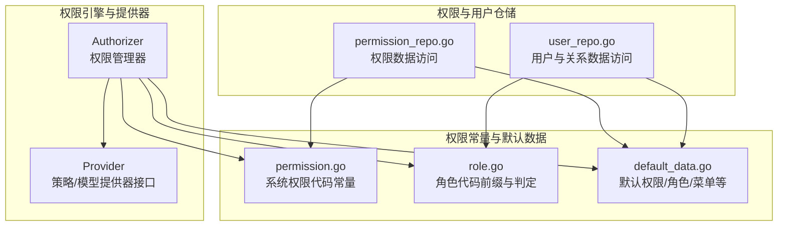
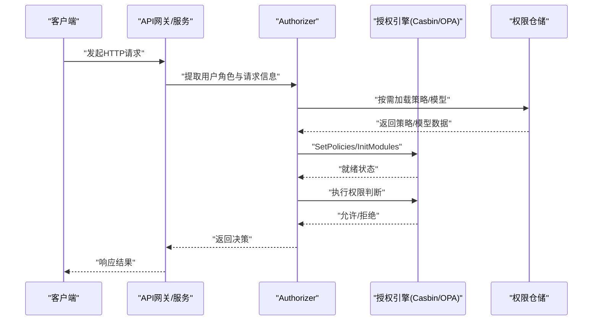
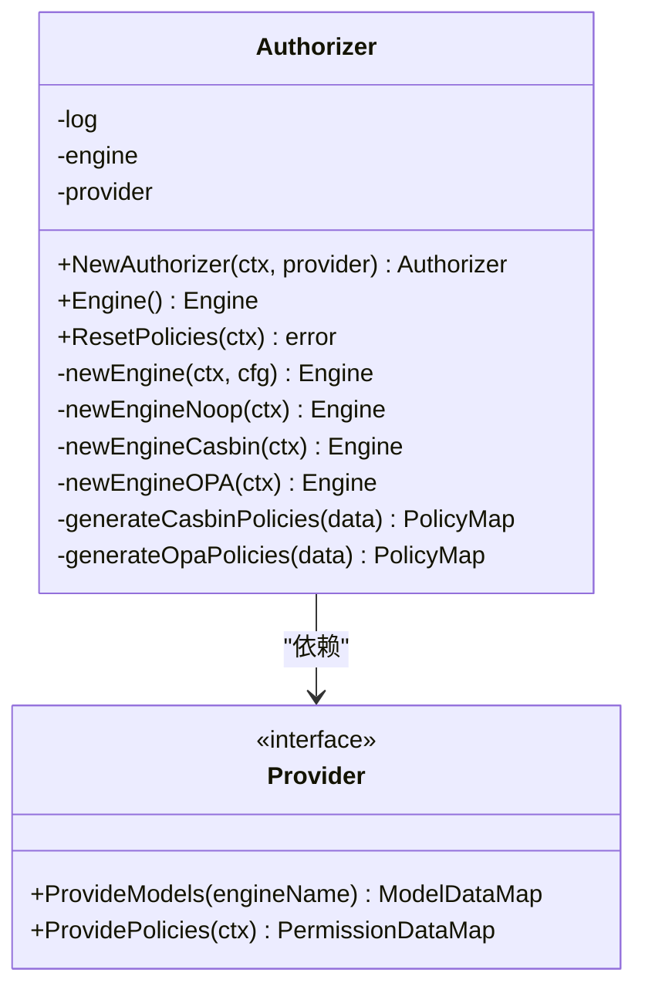
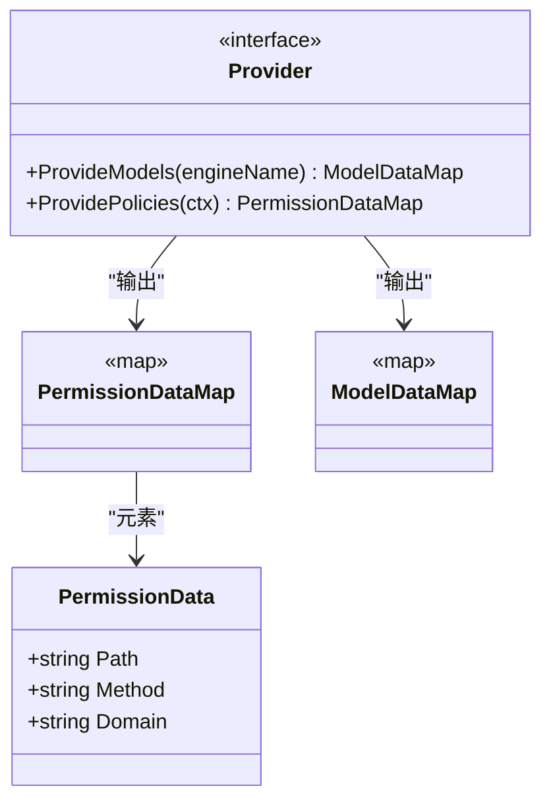
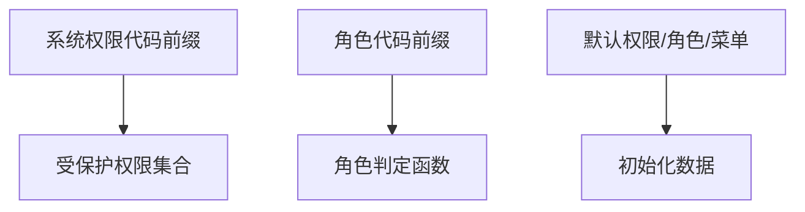
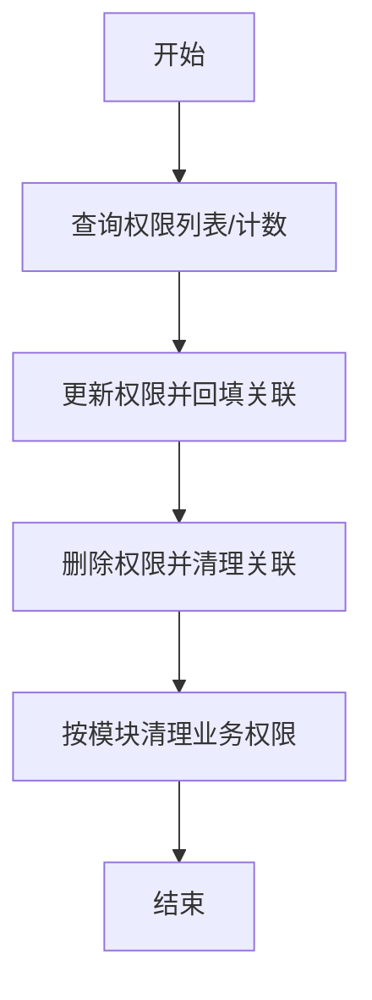
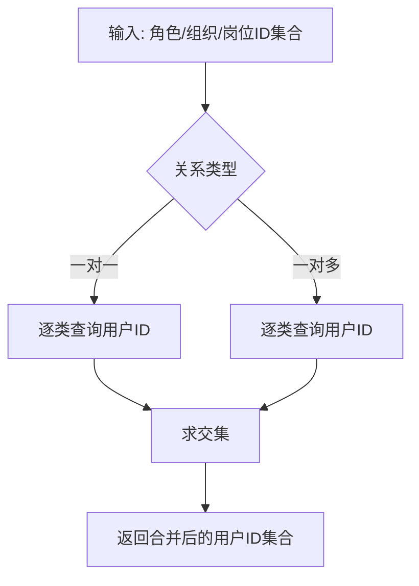
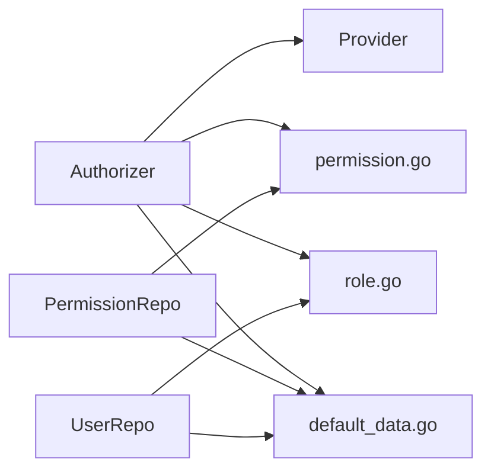

# 接口权限管理

<cite>
**本文引用的文件**
- [backend/pkg/authorizer/authorizer.go](file://backend/pkg/authorizer/authorizer.go)
- [backend/pkg/authorizer/provider.go](file://backend/pkg/authorizer/provider.go)
- [backend/pkg/constants/permission.go](file://backend/pkg/constants/permission.go)
- [backend/pkg/constants/role.go](file://backend/pkg/constants/role.go)
- [backend/pkg/constants/default_data.go](file://backend/pkg/constants/default_data.go)
- [backend/app/admin/service/internal/data/permission_repo.go](file://backend/app/admin/service/internal/data/permission_repo.go)
- [backend/app/admin/service/internal/data/user_repo.go](file://backend/app/admin/service/internal/data/user_repo.go)
</cite>

## 目录
1. [简介](#简介)
2. [项目结构](#项目结构)
3. [核心组件](#核心组件)
4. [架构总览](#架构总览)
5. [详细组件分析](#详细组件分析)
6. [依赖分析](#依赖分析)
7. [性能考虑](#性能考虑)
8. [故障排查指南](#故障排查指南)
9. [结论](#结论)
10. [附录](#附录)

## 简介
本文件系统性阐述接口权限管理的设计与实现，覆盖概念与分类、控制机制、配置方法、与用户认证的结合、实现原理、数据模型、最佳实践以及性能优化与监控告警建议。接口权限管理以“权限引擎”为核心，支持多种授权后端（如基于策略的引擎与基于策略表达式的引擎），并通过统一的策略提供器加载策略与模型，最终在请求链路中进行路由匹配与权限验证。

## 项目结构
围绕接口权限管理的关键代码分布在以下模块：
- 权限引擎与提供器：backend/pkg/authorizer
- 权限常量与默认数据：backend/pkg/constants
- 权限与用户仓储：backend/app/admin/service/internal/data

图表来源
- [backend/pkg/authorizer/authorizer.go:18-241](file://backend/pkg/authorizer/authorizer.go#L18-L241)
- [backend/pkg/authorizer/provider.go:5-27](file://backend/pkg/authorizer/provider.go#L5-L27)
- [backend/pkg/constants/permission.go:3-39](file://backend/pkg/constants/permission.go#L3-L39)
- [backend/pkg/constants/role.go:3-49](file://backend/pkg/constants/role.go#L3-L49)
- [backend/pkg/constants/default_data.go:29-264](file://backend/pkg/constants/default_data.go#L29-L264)
- [backend/app/admin/service/internal/data/permission_repo.go:28-605](file://backend/app/admin/service/internal/data/permission_repo.go#L28-L605)
- [backend/app/admin/service/internal/data/user_repo.go:70-1126](file://backend/app/admin/service/internal/data/user_repo.go#L70-L1126)

章节来源
- [backend/pkg/authorizer/authorizer.go:18-241](file://backend/pkg/authorizer/authorizer.go#L18-L241)
- [backend/pkg/authorizer/provider.go:5-27](file://backend/pkg/authorizer/provider.go#L5-L27)
- [backend/pkg/constants/permission.go:3-39](file://backend/pkg/constants/permission.go#L3-L39)
- [backend/pkg/constants/role.go:3-49](file://backend/pkg/constants/role.go#L3-L49)
- [backend/pkg/constants/default_data.go:29-264](file://backend/pkg/constants/default_data.go#L29-L264)
- [backend/app/admin/service/internal/data/permission_repo.go:28-605](file://backend/app/admin/service/internal/data/permission_repo.go#L28-L605)
- [backend/app/admin/service/internal/data/user_repo.go:70-1126](file://backend/app/admin/service/internal/data/user_repo.go#L70-L1126)

## 核心组件
- 权限管理器（Authorizer）：负责根据配置选择授权引擎（如策略引擎或策略表达式引擎），加载策略与模型，并提供策略重载能力。
- 策略/模型提供器（Provider）：抽象策略数据与模型数据的来源，便于不同引擎适配。
- 权限常量与默认数据：定义系统权限代码前缀、受保护权限集合、角色前缀与默认权限/角色/菜单等初始化数据。
- 权限与用户仓储：提供权限与用户相关数据的增删改查、关联关系维护与批量清理等能力。

章节来源
- [backend/pkg/authorizer/authorizer.go:18-241](file://backend/pkg/authorizer/authorizer.go#L18-L241)
- [backend/pkg/authorizer/provider.go:5-27](file://backend/pkg/authorizer/provider.go#L5-L27)
- [backend/pkg/constants/permission.go:3-39](file://backend/pkg/constants/permission.go#L3-L39)
- [backend/pkg/constants/role.go:3-49](file://backend/pkg/constants/role.go#L3-L49)
- [backend/pkg/constants/default_data.go:29-264](file://backend/pkg/constants/default_data.go#L29-L264)
- [backend/app/admin/service/internal/data/permission_repo.go:28-605](file://backend/app/admin/service/internal/data/permission_repo.go#L28-L605)
- [backend/app/admin/service/internal/data/user_repo.go:70-1126](file://backend/app/admin/service/internal/data/user_repo.go#L70-L1126)

## 架构总览
接口权限管理采用“策略驱动”的架构：应用启动时由权限管理器读取配置并初始化授权引擎；策略与模型由提供器从数据库或内置默认数据加载；运行期请求到达时，权限管理器对当前用户的角色与请求路径/方法进行匹配，决定是否放行。

图表来源
- [backend/pkg/authorizer/authorizer.go:50-109](file://backend/pkg/authorizer/authorizer.go#L50-L109)
- [backend/app/admin/service/internal/data/permission_repo.go:322-348](file://backend/app/admin/service/internal/data/permission_repo.go#L322-L348)

## 详细组件分析

### 权限管理器（Authorizer）
- 职责
  - 基于配置选择授权引擎类型（策略引擎、策略表达式引擎、空实现等）。
  - 加载策略与模型，支持重载策略。
  - 将策略数据转换为具体引擎所需的格式（策略规则或模型）。
- 关键流程
  - 初始化：解析配置，创建引擎实例。
  - 重载策略：从提供器获取策略与模型，按引擎类型生成策略映射并写入引擎。
  - 引擎选择：根据配置类型动态创建不同引擎实例。
- 复杂度与性能
  - 策略重载涉及内存映射构建与引擎写入，复杂度与策略条目数线性相关。
  - 建议在低频变更场景触发重载，避免频繁写入引擎。

图表来源
- [backend/pkg/authorizer/authorizer.go:18-241](file://backend/pkg/authorizer/authorizer.go#L18-L241)
- [backend/pkg/authorizer/provider.go:20-27](file://backend/pkg/authorizer/provider.go#L20-L27)

章节来源
- [backend/pkg/authorizer/authorizer.go:18-241](file://backend/pkg/authorizer/authorizer.go#L18-L241)
- [backend/pkg/authorizer/provider.go:5-27](file://backend/pkg/authorizer/provider.go#L5-L27)

### 策略/模型提供器（Provider）
- 职责
  - 提供策略数据（角色到接口的映射）。
  - 提供模型数据（如OPA模块）。
- 数据结构
  - 策略数据：角色代码 -> 接口列表（路径、方法、域）。
  - 模型数据：引擎名 -> 模型字节映射。

图表来源
- [backend/pkg/authorizer/provider.go:5-27](file://backend/pkg/authorizer/provider.go#L5-L27)

章节来源
- [backend/pkg/authorizer/provider.go:5-27](file://backend/pkg/authorizer/provider.go#L5-L27)

### 权限常量与默认数据
- 系统权限代码前缀与受保护权限集合，确保关键权限不可被误删。
- 角色代码前缀（平台/租户/模板），辅助角色判定与模板角色提取。
- 默认权限/角色/菜单等初始化数据，支撑系统开箱即用。

图表来源
- [backend/pkg/constants/permission.go:3-39](file://backend/pkg/constants/permission.go#L3-L39)
- [backend/pkg/constants/role.go:3-49](file://backend/pkg/constants/role.go#L3-L49)
- [backend/pkg/constants/default_data.go:29-264](file://backend/pkg/constants/default_data.go#L29-L264)

章节来源
- [backend/pkg/constants/permission.go:3-39](file://backend/pkg/constants/permission.go#L3-L39)
- [backend/pkg/constants/role.go:3-49](file://backend/pkg/constants/role.go#L3-L49)
- [backend/pkg/constants/default_data.go:29-264](file://backend/pkg/constants/default_data.go#L29-L264)

### 权限仓储（PermissionRepo）
- 职责
  - 权限实体的增删改查、分页列表、存在性校验。
  - 权限与API、菜单的关联关系维护与批量清理。
  - 按权限ID/代码查询映射关系，支持事务上下文。
- 关键能力
  - 批量创建权限并回填关联。
  - 按模块清理业务权限与关联。
  - 查询权限关联的API/菜单ID列表。

图表来源
- [backend/app/admin/service/internal/data/permission_repo.go:86-196](file://backend/app/admin/service/internal/data/permission_repo.go#L86-L196)
- [backend/app/admin/service/internal/data/permission_repo.go:322-348](file://backend/app/admin/service/internal/data/permission_repo.go#L322-L348)
- [backend/app/admin/service/internal/data/permission_repo.go:458-516](file://backend/app/admin/service/internal/data/permission_repo.go#L458-L516)
- [backend/app/admin/service/internal/data/permission_repo.go:568-584](file://backend/app/admin/service/internal/data/permission_repo.go#L568-L584)

章节来源
- [backend/app/admin/service/internal/data/permission_repo.go:28-605](file://backend/app/admin/service/internal/data/permission_repo.go#L28-L605)

### 用户仓储（UserRepo）
- 职责
  - 用户实体的增删改查、分页列表、存在性校验。
  - 用户与角色、组织单元、岗位的关系维护。
  - 根据角色/组织单元/岗位ID集合交叉求交，得到目标用户ID集合。
- 关键能力
  - 一对多/一对一关系下的用户ID查询。
  - 事务化创建/更新用户并同步关系。
  - 清理用户关系（单表或通过成员关系表）。

图表来源
- [backend/app/admin/service/internal/data/user_repo.go:154-287](file://backend/app/admin/service/internal/data/user_repo.go#L154-L287)
- [backend/app/admin/service/internal/data/user_repo.go:460-555](file://backend/app/admin/service/internal/data/user_repo.go#L460-L555)
- [backend/app/admin/service/internal/data/user_repo.go:558-686](file://backend/app/admin/service/internal/data/user_repo.go#L558-L686)

章节来源
- [backend/app/admin/service/internal/data/user_repo.go:70-1126](file://backend/app/admin/service/internal/data/user_repo.go#L70-L1126)

## 依赖分析
- 权限管理器依赖策略/模型提供器，通过提供器解耦不同引擎的数据来源。
- 权限仓储与用户仓储依赖默认常量与默认数据，保证初始化一致性。
- 引擎类型由配置决定，支持策略引擎与策略表达式引擎，便于扩展。

图表来源
- [backend/pkg/authorizer/authorizer.go:18-241](file://backend/pkg/authorizer/authorizer.go#L18-L241)
- [backend/pkg/constants/permission.go:3-39](file://backend/pkg/constants/permission.go#L3-L39)
- [backend/pkg/constants/role.go:3-49](file://backend/pkg/constants/role.go#L3-L49)
- [backend/pkg/constants/default_data.go:29-264](file://backend/pkg/constants/default_data.go#L29-L264)
- [backend/app/admin/service/internal/data/permission_repo.go:28-605](file://backend/app/admin/service/internal/data/permission_repo.go#L28-L605)
- [backend/app/admin/service/internal/data/user_repo.go:70-1126](file://backend/app/admin/service/internal/data/user_repo.go#L70-L1126)

章节来源
- [backend/pkg/authorizer/authorizer.go:18-241](file://backend/pkg/authorizer/authorizer.go#L18-L241)
- [backend/pkg/constants/permission.go:3-39](file://backend/pkg/constants/permission.go#L3-L39)
- [backend/pkg/constants/role.go:3-49](file://backend/pkg/constants/role.go#L3-L49)
- [backend/pkg/constants/default_data.go:29-264](file://backend/pkg/constants/default_data.go#L29-L264)
- [backend/app/admin/service/internal/data/permission_repo.go:28-605](file://backend/app/admin/service/internal/data/permission_repo.go#L28-L605)
- [backend/app/admin/service/internal/data/user_repo.go:70-1126](file://backend/app/admin/service/internal/data/user_repo.go#L70-L1126)

## 性能考虑
- 策略重载频率控制：仅在策略发生变更时触发重载，避免频繁写入引擎导致的抖动。
- 引擎选择：策略引擎适合规则明确的RBAC场景，策略表达式引擎适合更复杂的策略组合。
- 关联查询优化：用户仓储在一对多关系下采用逐步求交集策略，减少不必要的全表扫描。
- 事务批处理：权限仓储在批量创建/更新时使用事务，降低锁竞争与重复写入成本。
- 缓存策略：可在应用层对热点角色-策略映射进行缓存，缩短决策路径（需配合失效策略）。

## 故障排查指南
- 策略重载失败
  - 现象：重载策略报错或策略未生效。
  - 排查：确认提供器是否正确返回策略/模型；检查引擎初始化与模块注入是否成功；核对策略格式与引擎要求一致。
- 权限/角色初始化异常
  - 现象：系统启动后权限/角色缺失或不一致。
  - 排查：核对默认数据常量与初始化逻辑；确认数据库迁移与默认数据导入顺序。
- 用户关系查询为空
  - 现象：按角色/组织/岗位筛选用户为空。
  - 排查：确认关系表数据是否正确；检查关系类型配置；验证ID集合是否为空导致未执行查询。

章节来源
- [backend/pkg/authorizer/authorizer.go:62-109](file://backend/pkg/authorizer/authorizer.go#L62-L109)
- [backend/pkg/constants/default_data.go:29-264](file://backend/pkg/constants/default_data.go#L29-L264)
- [backend/app/admin/service/internal/data/user_repo.go:154-287](file://backend/app/admin/service/internal/data/user_repo.go#L154-L287)

## 结论
该接口权限管理方案以“策略驱动”为核心，通过统一的权限管理器与提供器抽象，实现了对多种授权引擎的支持与灵活扩展。结合权限仓储与用户仓储，能够高效地完成权限与用户关系的管理与查询。配合合理的缓存与重载策略，可在保证安全性的同时提升系统性能与可维护性。

## 附录

### 接口权限配置方法
- 接口白名单设置
  - 通过权限与API关联关系建立白名单，仅授予特定API访问权限。
- 接口权限规则定义
  - 定义角色到接口的映射（路径、方法、域），由提供器输出给权限管理器。
- 接口访问控制策略
  - 选择授权引擎类型并加载策略/模型；在请求阶段进行权限判断。

章节来源
- [backend/pkg/authorizer/authorizer.go:162-241](file://backend/pkg/authorizer/authorizer.go#L162-L241)
- [backend/app/admin/service/internal/data/permission_repo.go:322-348](file://backend/app/admin/service/internal/data/permission_repo.go#L322-L348)

### 接口权限与用户认证结合
- Token验证与权限检查流程
  - 客户端携带Token访问API。
  - 服务端解析Token获取用户身份与角色。
  - 权限管理器根据角色与请求信息进行策略匹配，返回允许/拒绝。
- 接口拦截机制
  - 在网关或服务入口处集成权限拦截器，统一处理鉴权与放行。

章节来源
- [backend/pkg/authorizer/authorizer.go:18-241](file://backend/pkg/authorizer/authorizer.go#L18-L241)

### 实现原理
- 路由匹配：将请求路径与方法映射到策略规则。
- 权限验证：调用授权引擎执行策略评估。
- 异常处理：捕获引擎初始化/策略写入/策略评估异常并记录日志。

章节来源
- [backend/pkg/authorizer/authorizer.go:162-241](file://backend/pkg/authorizer/authorizer.go#L162-L241)

### 数据模型
- 接口表结构（概要）
  - 字段：主键、名称、编码、状态、描述、分组ID、创建时间等。
- 权限规则表（概要）
  - 字段：角色代码、接口路径、方法、域等。
- 访问日志表（概要）
  - 字段：请求时间、用户ID、接口路径、方法、结果、耗时等。

章节来源
- [backend/app/admin/service/internal/data/permission_repo.go:28-605](file://backend/app/admin/service/internal/data/permission_repo.go#L28-L605)

### 最佳实践
- 设计原则
  - 权限最小化、职责分离、模块化分组。
- 权限缓存策略
  - 对热点角色-策略映射进行缓存，设置合理TTL与失效策略。
- 权限审计
  - 记录权限变更与访问日志，定期审计受保护权限。
- 监控告警
  - 监控策略重载成功率、权限判断耗时与拒绝率，设置阈值告警。

章节来源
- [backend/pkg/constants/permission.go:31-39](file://backend/pkg/constants/permission.go#L31-L39)
- [backend/pkg/constants/default_data.go:29-264](file://backend/pkg/constants/default_data.go#L29-L264)