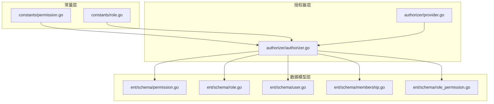
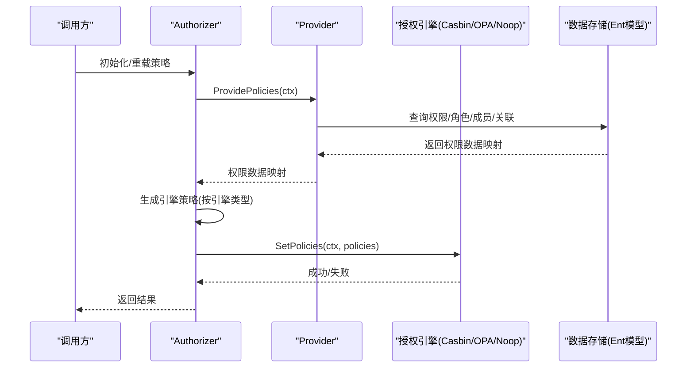
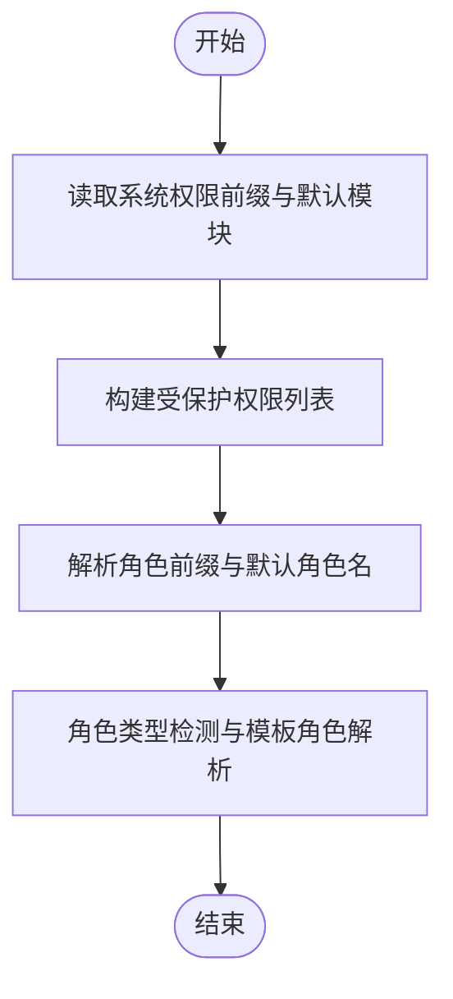
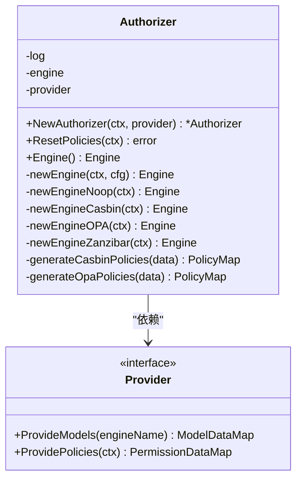
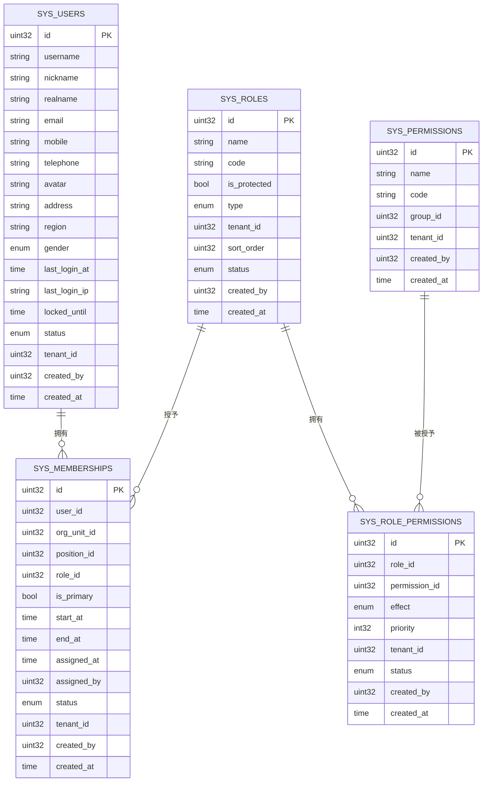
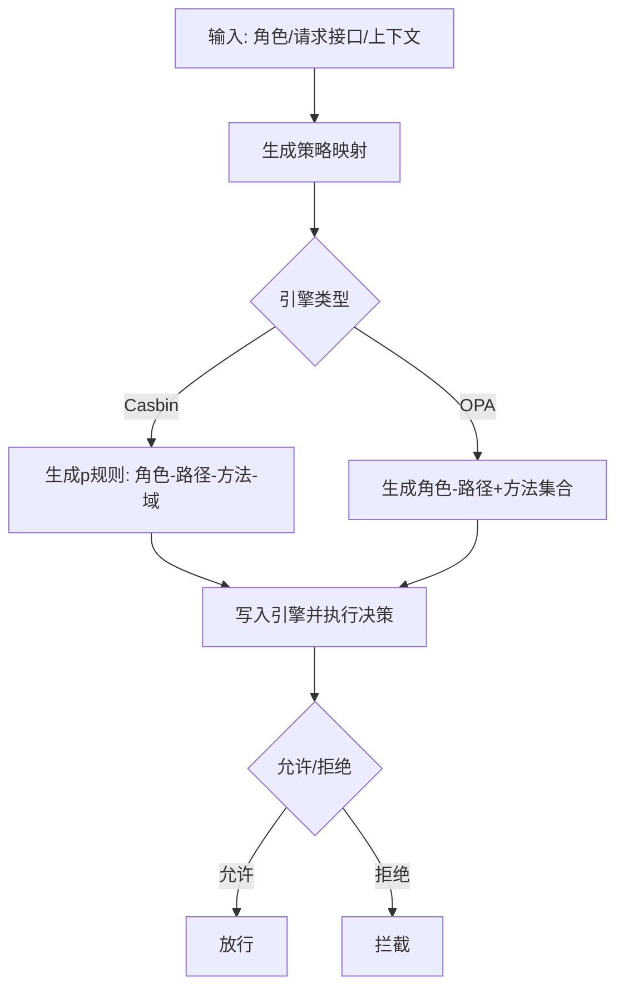
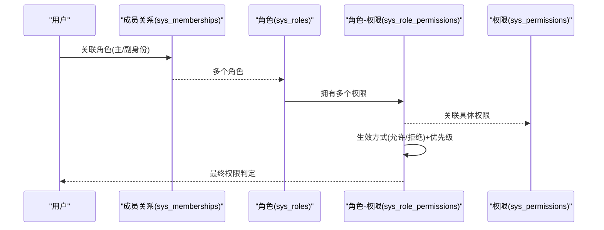
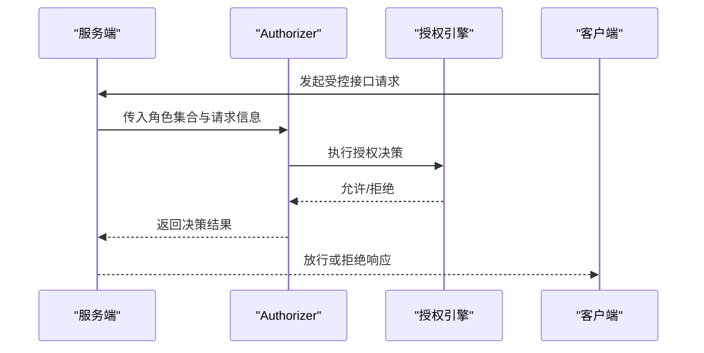
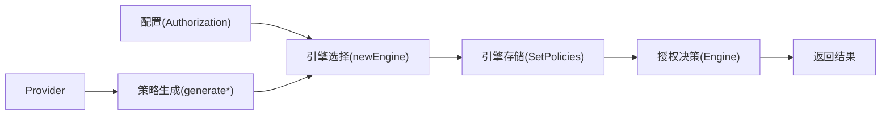

# 权限管理

<cite>
**本文引用的文件**
- [backend/pkg/constants/permission.go](file://backend/pkg/constants/permission.go)
- [backend/pkg/constants/role.go](file://backend/pkg/constants/role.go)
- [backend/pkg/authorizer/authorizer.go](file://backend/pkg/authorizer/authorizer.go)
- [backend/pkg/authorizer/provider.go](file://backend/pkg/authorizer/provider.go)
- [backend/app/admin/service/internal/data/ent/schema/permission.go](file://backend/app/admin/service/internal/data/ent/schema/permission.go)
- [backend/app/admin/service/internal/data/ent/schema/role.go](file://backend/app/admin/service/internal/data/ent/schema/role.go)
- [backend/app/admin/service/internal/data/ent/schema/user.go](file://backend/app/admin/service/internal/data/ent/schema/user.go)
- [backend/app/admin/service/internal/data/ent/schema/membership.go](file://backend/app/admin/service/internal/data/ent/schema/membership.go)
- [backend/app/admin/service/internal/data/ent/schema/role_permission.go](file://backend/app/admin/service/internal/data/ent/schema/role_permission.go)
</cite>

## 目录
1. [简介](#简介)
2. [项目结构](#项目结构)
3. [核心组件](#核心组件)
4. [架构总览](#架构总览)
5. [详细组件分析](#详细组件分析)
6. [依赖分析](#依赖分析)
7. [性能考量](#性能考量)
8. [故障排查指南](#故障排查指南)
9. [结论](#结论)
10. [附录](#附录)

## 简介
本文件系统化梳理权限管理功能，覆盖权限定义与分类、分配与验证机制、权限类型（菜单权限、接口权限、数据权限）、粒度控制与表达式设计、角色绑定与继承优先级、验证实现（接口权限检查、数据权限过滤、动态权限计算）、数据模型（权限表结构、权限树设计、缓存策略）、设计模式（抽象层、缓存优化、审计日志）以及安全与性能优化建议。内容基于仓库中的常量、授权器、实体模型与提供者接口进行归纳总结。

## 项目结构
权限管理相关代码主要分布在以下位置：
- 常量层：系统权限前缀、默认模块、受保护权限代码；角色前缀与默认角色名
- 授权器层：统一的授权器封装，支持多种授权引擎（Casbin、OPA、Noop），负责策略加载与切换
- 数据模型层：权限、角色、用户、成员关系、角色-权限关联等实体定义与索引
- 提供者接口：策略与模型数据的提供者抽象，便于注入不同数据源

**图示来源**
- [backend/pkg/constants/permission.go:1-39](file://backend/pkg/constants/permission.go#L1-L39)
- [backend/pkg/constants/role.go:1-49](file://backend/pkg/constants/role.go#L1-L49)
- [backend/pkg/authorizer/authorizer.go:1-241](file://backend/pkg/authorizer/authorizer.go#L1-L241)
- [backend/pkg/authorizer/provider.go:1-28](file://backend/pkg/authorizer/provider.go#L1-L28)
- [backend/app/admin/service/internal/data/ent/schema/permission.go:1-73](file://backend/app/admin/service/internal/data/ent/schema/permission.go#L1-L73)
- [backend/app/admin/service/internal/data/ent/schema/role.go:1-116](file://backend/app/admin/service/internal/data/ent/schema/role.go#L1-L116)
- [backend/app/admin/service/internal/data/ent/schema/user.go:1-172](file://backend/app/admin/service/internal/data/ent/schema/user.go#L1-L172)
- [backend/app/admin/service/internal/data/ent/schema/membership.go:1-160](file://backend/app/admin/service/internal/data/ent/schema/membership.go#L1-L160)
- [backend/app/admin/service/internal/data/ent/schema/role_permission.go:1-103](file://backend/app/admin/service/internal/data/ent/schema/role_permission.go#L1-L103)

**章节来源**
- [backend/pkg/constants/permission.go:1-39](file://backend/pkg/constants/permission.go#L1-L39)
- [backend/pkg/constants/role.go:1-49](file://backend/pkg/constants/role.go#L1-L49)
- [backend/pkg/authorizer/authorizer.go:1-241](file://backend/pkg/authorizer/authorizer.go#L1-L241)
- [backend/pkg/authorizer/provider.go:1-28](file://backend/pkg/authorizer/provider.go#L1-L28)
- [backend/app/admin/service/internal/data/ent/schema/permission.go:1-73](file://backend/app/admin/service/internal/data/ent/schema/permission.go#L1-L73)
- [backend/app/admin/service/internal/data/ent/schema/role.go:1-116](file://backend/app/admin/service/internal/data/ent/schema/role.go#L1-L116)
- [backend/app/admin/service/internal/data/ent/schema/user.go:1-172](file://backend/app/admin/service/internal/data/ent/schema/user.go#L1-L172)
- [backend/app/admin/service/internal/data/ent/schema/membership.go:1-160](file://backend/app/admin/service/internal/data/ent/schema/membership.go#L1-L160)
- [backend/app/admin/service/internal/data/ent/schema/role_permission.go:1-103](file://backend/app/admin/service/internal/data/ent/schema/role_permission.go#L1-L103)

## 核心组件
- 权限常量与角色常量：定义系统权限前缀、默认模块、受保护权限集合；角色前缀、默认角色名及角色代码解析工具
- 授权器 Authorizer：统一的授权入口，支持多种授权引擎（Noop/Casbin/OPA/Zanzibar占位），负责策略加载、模型注入与引擎切换
- 提供者 Provider：策略与模型数据的抽象提供者，授权器通过该接口拉取策略与模型
- 数据模型：权限、角色、用户、成员关系、角色-权限关联等实体，包含字段、注解、索引与约束

**章节来源**
- [backend/pkg/constants/permission.go:1-39](file://backend/pkg/constants/permission.go#L1-L39)
- [backend/pkg/constants/role.go:1-49](file://backend/pkg/constants/role.go#L1-L49)
- [backend/pkg/authorizer/authorizer.go:18-241](file://backend/pkg/authorizer/authorizer.go#L18-L241)
- [backend/pkg/authorizer/provider.go:5-28](file://backend/pkg/authorizer/provider.go#L5-L28)
- [backend/app/admin/service/internal/data/ent/schema/permission.go:13-73](file://backend/app/admin/service/internal/data/ent/schema/permission.go#L13-L73)
- [backend/app/admin/service/internal/data/ent/schema/role.go:13-116](file://backend/app/admin/service/internal/data/ent/schema/role.go#L13-L116)
- [backend/app/admin/service/internal/data/ent/schema/user.go:13-172](file://backend/app/admin/service/internal/data/ent/schema/user.go#L13-L172)
- [backend/app/admin/service/internal/data/ent/schema/membership.go:16-160](file://backend/app/admin/service/internal/data/ent/schema/membership.go#L16-L160)
- [backend/app/admin/service/internal/data/ent/schema/role_permission.go:13-103](file://backend/app/admin/service/internal/data/ent/schema/role_permission.go#L13-L103)

## 架构总览
授权器作为核心协调者，根据配置选择授权引擎，从提供者获取策略与模型，生成对应格式的策略集合并写入引擎。策略与模型来源于权限、角色、成员关系与角色-权限关联等实体数据。

**图示来源**
- [backend/pkg/authorizer/authorizer.go:50-109](file://backend/pkg/authorizer/authorizer.go#L50-L109)
- [backend/pkg/authorizer/authorizer.go:111-160](file://backend/pkg/authorizer/authorizer.go#L111-L160)
- [backend/pkg/authorizer/authorizer.go:162-240](file://backend/pkg/authorizer/authorizer.go#L162-L240)
- [backend/pkg/authorizer/provider.go:21-27](file://backend/pkg/authorizer/provider.go#L21-L27)

## 详细组件分析

### 权限与角色常量
- 系统权限前缀与默认模块：用于规范权限编码与模块划分
- 受保护权限代码：禁止删除的关键系统权限集合
- 角色前缀与默认角色名：平台/租户/模板角色命名规范
- 角色代码解析工具：判断角色类型、提取模板角色对应的正式角色代码

**图示来源**
- [backend/pkg/constants/permission.go:3-29](file://backend/pkg/constants/permission.go#L3-L29)
- [backend/pkg/constants/role.go:3-49](file://backend/pkg/constants/role.go#L3-L49)

**章节来源**
- [backend/pkg/constants/permission.go:1-39](file://backend/pkg/constants/permission.go#L1-L39)
- [backend/pkg/constants/role.go:1-49](file://backend/pkg/constants/role.go#L1-L49)

### 授权器与引擎
- 授权器职责：初始化、选择引擎、加载策略、生成策略（Casbin/OPA/Noop）、模型注入（OPA）
- 引擎类型：Noop（禁用授权）、Casbin（RBAC策略）、OPA（自定义模型）、Zanzibar（占位）
- 策略生成：Casbin将角色-接口映射为策略规则；OPA将角色映射为路径+方法集合
- 模型注入：OPA从提供者加载指定模型并初始化模块

**图示来源**
- [backend/pkg/authorizer/authorizer.go:18-241](file://backend/pkg/authorizer/authorizer.go#L18-L241)
- [backend/pkg/authorizer/provider.go:20-27](file://backend/pkg/authorizer/provider.go#L20-L27)

**章节来源**
- [backend/pkg/authorizer/authorizer.go:18-241](file://backend/pkg/authorizer/authorizer.go#L18-L241)
- [backend/pkg/authorizer/provider.go:5-28](file://backend/pkg/authorizer/provider.go#L5-L28)

### 数据模型与权限树
- 权限表（sys_permissions）：包含名称、编码、分组等字段，唯一索引约束于租户维度
- 角色表（sys_roles）：包含名称、编码、受保护标记、类型（系统/模板/租户）等，多维索引覆盖租户、状态、排序等
- 用户表（sys_users）：用户基本信息与状态枚举，多维索引覆盖租户维度
- 成员关系表（sys_memberships）：用户与组织/岗位/角色的关联，支持主身份、生效/失效时间、状态与审计字段
- 角色-权限关联表（sys_role_permissions）：多对多关联，含生效方式（允许/拒绝）与优先级

**图示来源**
- [backend/app/admin/service/internal/data/ent/schema/user.go:18-172](file://backend/app/admin/service/internal/data/ent/schema/user.go#L18-L172)
- [backend/app/admin/service/internal/data/ent/schema/role.go:18-116](file://backend/app/admin/service/internal/data/ent/schema/role.go#L18-L116)
- [backend/app/admin/service/internal/data/ent/schema/permission.go:17-73](file://backend/app/admin/service/internal/data/ent/schema/permission.go#L17-L73)
- [backend/app/admin/service/internal/data/ent/schema/membership.go:21-160](file://backend/app/admin/service/internal/data/ent/schema/membership.go#L21-L160)
- [backend/app/admin/service/internal/data/ent/schema/role_permission.go:18-103](file://backend/app/admin/service/internal/data/ent/schema/role_permission.go#L18-L103)

**章节来源**
- [backend/app/admin/service/internal/data/ent/schema/permission.go:13-73](file://backend/app/admin/service/internal/data/ent/schema/permission.go#L13-L73)
- [backend/app/admin/service/internal/data/ent/schema/role.go:13-116](file://backend/app/admin/service/internal/data/ent/schema/role.go#L13-L116)
- [backend/app/admin/service/internal/data/ent/schema/user.go:13-172](file://backend/app/admin/service/internal/data/ent/schema/user.go#L13-L172)
- [backend/app/admin/service/internal/data/ent/schema/membership.go:16-160](file://backend/app/admin/service/internal/data/ent/schema/membership.go#L16-L160)
- [backend/app/admin/service/internal/data/ent/schema/role_permission.go:13-103](file://backend/app/admin/service/internal/data/ent/schema/role_permission.go#L13-L103)

### 权限类型与粒度控制
- 接口权限：由授权器将“角色-接口”映射为策略规则，支持路径与方法匹配
- 菜单权限：可通过接口权限映射到菜单项，结合前端路由与按钮级权限实现
- 数据权限：通过角色-权限关联的生效方式与优先级实现允许/拒绝控制，结合上下文动态计算
- 表达式设计：Casbin采用标准RBAC策略；OPA通过自定义模型实现复杂表达式与动态计算
- 粒度控制：支持按租户隔离、按角色优先级叠加、按允许/拒绝生效方式控制

**图示来源**
- [backend/pkg/authorizer/authorizer.go:111-160](file://backend/pkg/authorizer/authorizer.go#L111-L160)
- [backend/pkg/authorizer/authorizer.go:162-240](file://backend/pkg/authorizer/authorizer.go#L162-L240)

**章节来源**
- [backend/pkg/authorizer/authorizer.go:111-160](file://backend/pkg/authorizer/authorizer.go#L111-L160)
- [backend/pkg/authorizer/authorizer.go:162-240](file://backend/pkg/authorizer/authorizer.go#L162-L240)

### 权限与角色的绑定关系、继承与优先级
- 绑定关系：通过成员关系表将用户与角色绑定，支持单一主身份与其他身份并存
- 继承与优先级：角色-权限关联记录包含生效方式与优先级，数值越大优先级越高，允许对同权限进行覆盖
- 角色类型：系统/模板/租户角色，模板角色可派生正式角色代码

**图示来源**
- [backend/app/admin/service/internal/data/ent/schema/membership.go:34-96](file://backend/app/admin/service/internal/data/ent/schema/membership.go#L34-L96)
- [backend/app/admin/service/internal/data/ent/schema/role.go:31-59](file://backend/app/admin/service/internal/data/ent/schema/role.go#L31-L59)
- [backend/app/admin/service/internal/data/ent/schema/role_permission.go:31-57](file://backend/app/admin/service/internal/data/ent/schema/role_permission.go#L31-L57)
- [backend/app/admin/service/internal/data/ent/schema/permission.go:29-44](file://backend/app/admin/service/internal/data/ent/schema/permission.go#L29-L44)

**章节来源**
- [backend/app/admin/service/internal/data/ent/schema/membership.go:16-160](file://backend/app/admin/service/internal/data/ent/schema/membership.go#L16-L160)
- [backend/app/admin/service/internal/data/ent/schema/role.go:13-116](file://backend/app/admin/service/internal/data/ent/schema/role.go#L13-L116)
- [backend/app/admin/service/internal/data/ent/schema/role_permission.go:13-103](file://backend/app/admin/service/internal/data/ent/schema/role_permission.go#L13-L103)
- [backend/app/admin/service/internal/data/ent/schema/permission.go:13-73](file://backend/app/admin/service/internal/data/ent/schema/permission.go#L13-L73)

### 权限验证实现机制
- 接口权限检查：授权器根据当前用户角色集合与请求接口，查询引擎决策结果
- 数据权限过滤：通过角色-权限关联的生效方式与优先级，结合上下文动态计算，实现数据可见性控制
- 动态权限计算：OPA模型可承载复杂表达式，支持基于用户属性、资源属性、环境变量的动态决策

**图示来源**
- [backend/pkg/authorizer/authorizer.go:58-109](file://backend/pkg/authorizer/authorizer.go#L58-L109)

**章节来源**
- [backend/pkg/authorizer/authorizer.go:58-109](file://backend/pkg/authorizer/authorizer.go#L58-L109)

### 权限管理的数据模型
- 权限表结构：名称、编码、分组、租户隔离、状态与审计字段
- 角色表结构：名称、编码、受保护标记、类型、租户隔离、状态与排序
- 用户表结构：基础信息、枚举状态、租户隔离与审计字段
- 成员关系表结构：用户与角色/组织/岗位的关联、主身份、生效/失效时间、状态与审计
- 角色-权限关联表结构：允许/拒绝生效方式、优先级、租户隔离与状态

**章节来源**
- [backend/app/admin/service/internal/data/ent/schema/permission.go:13-73](file://backend/app/admin/service/internal/data/ent/schema/permission.go#L13-L73)
- [backend/app/admin/service/internal/data/ent/schema/role.go:13-116](file://backend/app/admin/service/internal/data/ent/schema/role.go#L13-L116)
- [backend/app/admin/service/internal/data/ent/schema/user.go:13-172](file://backend/app/admin/service/internal/data/ent/schema/user.go#L13-L172)
- [backend/app/admin/service/internal/data/ent/schema/membership.go:16-160](file://backend/app/admin/service/internal/data/ent/schema/membership.go#L16-L160)
- [backend/app/admin/service/internal/data/ent/schema/role_permission.go:13-103](file://backend/app/admin/service/internal/data/ent/schema/role_permission.go#L13-L103)

### 设计模式与最佳实践
- 权限抽象层设计：通过 Provider 抽象策略与模型提供，Authorizer 仅依赖接口，便于替换引擎与数据源
- 权限缓存优化：策略重载后缓存在引擎内部，减少每次请求的计算开销；建议在高并发场景引入本地缓存与批量刷新
- 权限审计日志：实体模型包含丰富的审计字段（创建者、创建时间、操作者），可用于审计追踪与合规

**章节来源**
- [backend/pkg/authorizer/provider.go:20-27](file://backend/pkg/authorizer/provider.go#L20-L27)
- [backend/pkg/authorizer/authorizer.go:50-109](file://backend/pkg/authorizer/authorizer.go#L50-L109)
- [backend/app/admin/service/internal/data/ent/schema/role.go:63-73](file://backend/app/admin/service/internal/data/ent/schema/role.go#L63-L73)
- [backend/app/admin/service/internal/data/ent/schema/role_permission.go:60-69](file://backend/app/admin/service/internal/data/ent/schema/role_permission.go#L60-L69)

## 依赖分析
- 授权器依赖配置与提供者，引擎类型由配置决定
- 策略数据来自提供者，模型数据（OPA）由提供者注入
- 实体模型为策略与权限数据的持久化载体，索引设计支撑高效查询

**图示来源**
- [backend/pkg/authorizer/authorizer.go:162-240](file://backend/pkg/authorizer/authorizer.go#L162-L240)
- [backend/pkg/authorizer/authorizer.go:111-160](file://backend/pkg/authorizer/authorizer.go#L111-L160)

**章节来源**
- [backend/pkg/authorizer/authorizer.go:162-240](file://backend/pkg/authorizer/authorizer.go#L162-L240)
- [backend/pkg/authorizer/authorizer.go:111-160](file://backend/pkg/authorizer/authorizer.go#L111-L160)

## 性能考量
- 策略加载：批量重载策略，避免频繁写入引擎
- 索引优化：权限与角色表的多维索引覆盖常用查询（租户、状态、排序、时间），提升查询效率
- 缓存策略：在高并发场景建议引入本地缓存与批量刷新，降低引擎压力
- 引擎选择：Casbin适合简单RBAC；OPA适合复杂表达式与动态决策，但需注意模型编译与初始化成本

## 故障排查指南
- 引擎初始化失败：检查配置与模型加载，确认模型名称与提供者返回一致
- 策略重载异常：核对提供者的策略数据结构与引擎期望格式
- 权限判定异常：检查角色-权限关联的生效方式与优先级设置，确保覆盖顺序符合预期

**章节来源**
- [backend/pkg/authorizer/authorizer.go:190-240](file://backend/pkg/authorizer/authorizer.go#L190-L240)
- [backend/pkg/authorizer/authorizer.go:62-109](file://backend/pkg/authorizer/authorizer.go#L62-L109)
- [backend/app/admin/service/internal/data/ent/schema/role_permission.go:42-57](file://backend/app/admin/service/internal/data/ent/schema/role_permission.go#L42-L57)

## 结论
本权限管理方案通过常量规范、授权器抽象与实体模型支撑，实现了接口权限、菜单权限与数据权限的统一治理。借助多种授权引擎与灵活的策略生成机制，既能满足简单RBAC需求，也能扩展至复杂动态决策场景。配合完善的索引与审计字段，可在保证安全性的同时兼顾性能与可观测性。

## 附录
- 权限编码规范：建议遵循系统权限前缀与默认模块约定，避免冲突
- 角色命名规范：模板角色与正式角色分离，便于继承与复用
- 引擎选型建议：根据业务复杂度选择Casbin或OPA，Noop仅用于测试或禁用授权