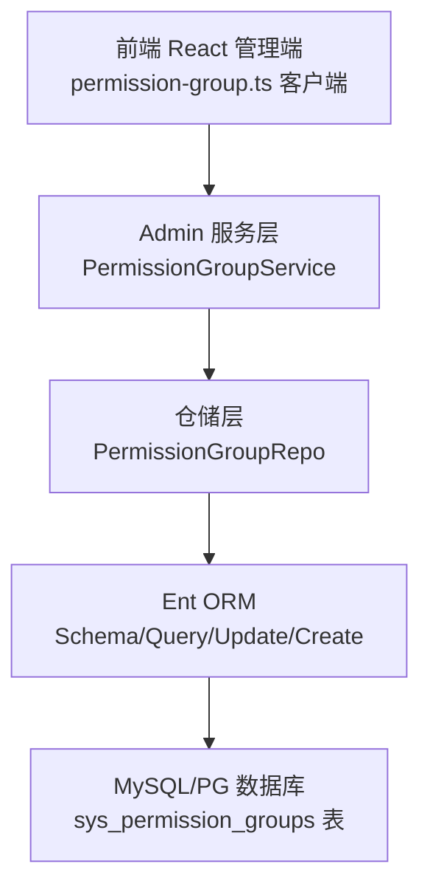
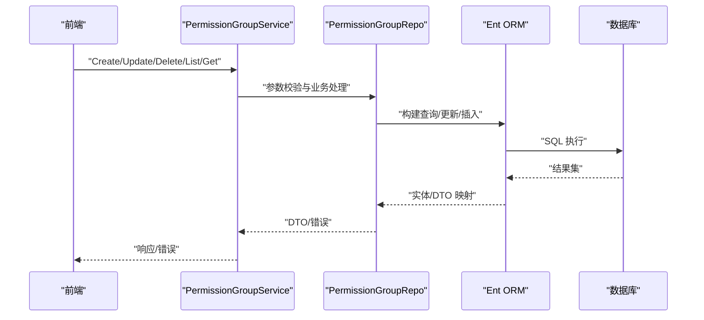
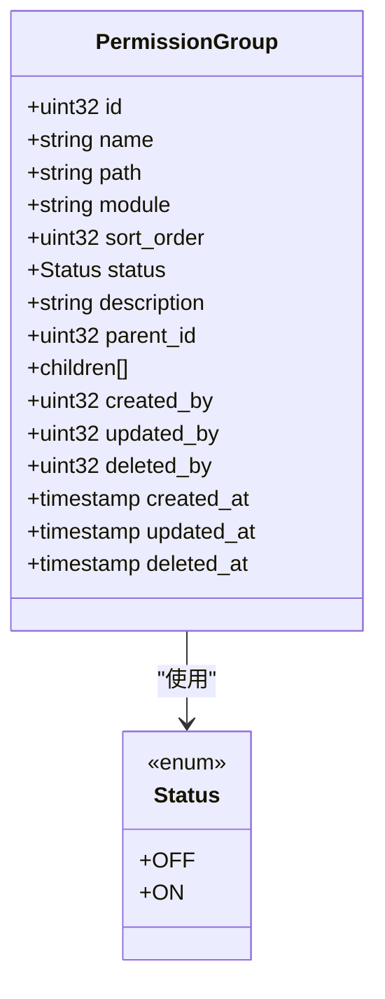
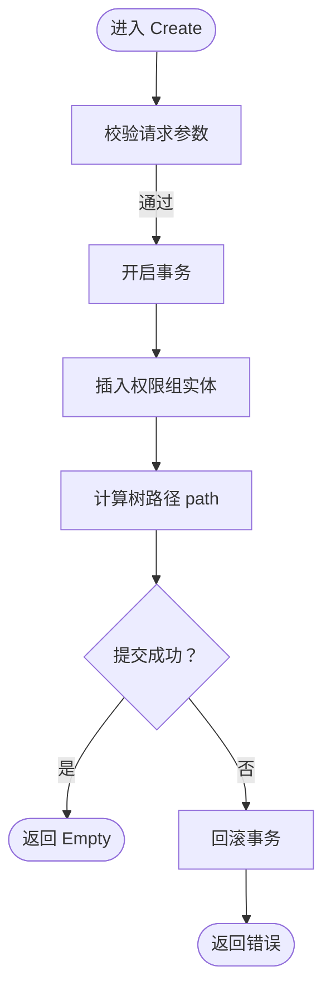
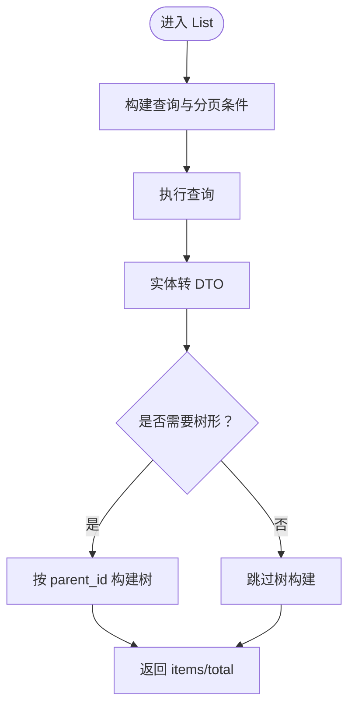
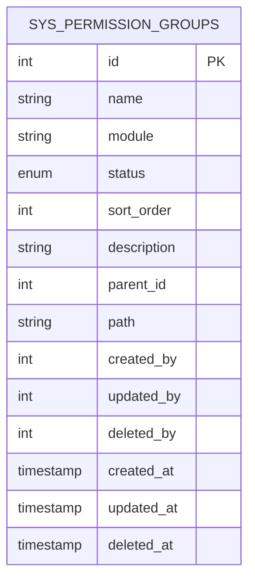
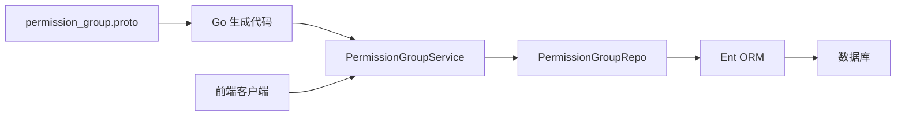

# 权限组管理

<cite>
**本文引用的文件**
- [backend/api/protos/admin/service/v1/i_permission_group.proto](file://backend/api/protos/admin/service/v1/i_permission_group.proto)
- [backend/api/protos/permission/service/v1/permission_group.proto](file://backend/api/protos/permission/service/v1/permission_group.proto)
- [backend/api/gen/go/permission/service/v1/permission_group.pb.go](file://backend/api/gen/go/permission/service/v1/permission_group.pb.go)
- [backend/app/admin/service/internal/data/ent/schema/permission_group.go](file://backend/app/admin/service/internal/data/ent/schema/permission_group.go)
- [backend/app/admin/service/internal/data/ent/permissiongroup_create.go](file://backend/app/admin/service/internal/data/ent/permissiongroup_create.go)
- [backend/app/admin/service/internal/data/ent/permissiongroup_update.go](file://backend/app/admin/service/internal/data/ent/permissiongroup_update.go)
- [backend/app/admin/service/internal/data/ent/permissiongroup_query.go](file://backend/app/admin/service/internal/data/ent/permissiongroup_query.go)
- [backend/app/admin/service/internal/data/ent/permissiongroup.go](file://backend/app/admin/service/internal/data/ent/permissiongroup.go)
- [backend/app/admin/service/internal/data/permission_group_repo.go](file://backend/app/admin/service/internal/data/permission_group_repo.go)
- [backend/app/admin/service/internal/service/permission_group_service.go](file://backend/app/admin/service/internal/service/permission_group_service.go)
- [backend/pkg/constants/permission.go](file://backend/pkg/constants/permission.go)
- [backend/pkg/constants/default_data.go](file://backend/pkg/constants/default_data.go)
- [frontend/admin/react/src/api/service/permission-group.ts](file://frontend/admin/react/src/api/service/permission-group.ts)
</cite>

## 目录
1. [简介](#简介)
2. [项目结构](#项目结构)
3. [核心组件](#核心组件)
4. [架构总览](#架构总览)
5. [详细组件分析](#详细组件分析)
6. [依赖分析](#依赖分析)
7. [性能考虑](#性能考虑)
8. [故障排查指南](#故障排查指南)
9. [结论](#结论)
10. [附录](#附录)

## 简介
本文件系统性阐述权限组管理功能的设计与实现，覆盖概念、数据模型、服务流程、RBAC 集成与最佳实践。权限组是权限体系中的“容器”或“分类”，用于对权限进行逻辑分组与层级化组织，支持批量管理、模板化复用与继承式权限组合。本文面向后端工程师与产品/运维人员，既提供代码级细节，也给出可操作的实践建议。

## 项目结构
权限组管理涉及前后端协作：前端通过 gRPC-Web/OpenAPI 客户端调用后端服务；后端以 Kratos 微服务承载，使用 Ent ORM 访问数据库，采用树形结构存储权限组及其父子关系。

图表来源
- [frontend/admin/react/src/api/service/permission-group.ts:1-38](file://frontend/admin/react/src/api/service/permission-group.ts#L1-L38)
- [backend/app/admin/service/internal/service/permission_group_service.go:23-46](file://backend/app/admin/service/internal/service/permission_group_service.go#L23-L46)
- [backend/app/admin/service/internal/data/permission_group_repo.go:27-42](file://backend/app/admin/service/internal/data/permission_group_repo.go#L27-L42)
- [backend/app/admin/service/internal/data/ent/schema/permission_group.go:13-54](file://backend/app/admin/service/internal/data/ent/schema/permission_group.go#L13-L54)

章节来源
- [backend/app/admin/service/internal/service/permission_group_service.go:23-46](file://backend/app/admin/service/internal/service/permission_group_service.go#L23-L46)
- [backend/app/admin/service/internal/data/permission_group_repo.go:27-42](file://backend/app/admin/service/internal/data/permission_group_repo.go#L27-L42)
- [backend/app/admin/service/internal/data/ent/schema/permission_group.go:13-54](file://backend/app/admin/service/internal/data/ent/schema/permission_group.go#L13-L54)

## 核心组件
- 协议与消息定义：定义权限组的请求/响应结构、状态枚举、树形字段与分页参数。
- 服务层：对外暴露 List/Get/Create/Update/Delete 等 RPC，负责参数校验、操作人注入与事务控制。
- 仓储层：封装 Ent 查询、构建树形结构、处理树路径计算与批量更新。
- ORM Schema：定义表结构、索引、树形 mixin 与通用字段（创建/更新/状态/排序/描述等）。
- 常量与默认数据：系统内置权限组模板、受保护权限码、模块标识等。

章节来源
- [backend/api/protos/permission/service/v1/permission_group.proto:34-84](file://backend/api/protos/permission/service/v1/permission_group.proto#L34-L84)
- [backend/app/admin/service/internal/service/permission_group_service.go:55-122](file://backend/app/admin/service/internal/service/permission_group_service.go#L55-L122)
- [backend/app/admin/service/internal/data/permission_group_repo.go:93-138](file://backend/app/admin/service/internal/data/permission_group_repo.go#L93-L138)
- [backend/app/admin/service/internal/data/ent/schema/permission_group.go:29-68](file://backend/app/admin/service/internal/data/ent/schema/permission_group.go#L29-L68)
- [backend/pkg/constants/default_data.go:29-75](file://backend/pkg/constants/default_data.go#L29-L75)

## 架构总览
权限组管理遵循典型的三层架构：协议层（Proto）、服务层（Kratos）、数据层（Ent）。前端通过生成的客户端发起 HTTP/gRPC 请求，后端解析请求、执行业务规则、持久化到数据库，并返回结果。

图表来源
- [backend/app/admin/service/internal/service/permission_group_service.go:63-106](file://backend/app/admin/service/internal/service/permission_group_service.go#L63-L106)
- [backend/app/admin/service/internal/data/permission_group_repo.go:174-214](file://backend/app/admin/service/internal/data/permission_group_repo.go#L174-L214)
- [backend/api/protos/admin/service/v1/i_permission_group.proto:14-51](file://backend/api/protos/admin/service/v1/i_permission_group.proto#L14-L51)

章节来源
- [backend/api/protos/admin/service/v1/i_permission_group.proto:14-51](file://backend/api/protos/admin/service/v1/i_permission_group.proto#L14-L51)
- [backend/api/protos/permission/service/v1/permission_group.proto:14-32](file://backend/api/protos/permission/service/v1/permission_group.proto#L14-L32)
- [backend/app/admin/service/internal/service/permission_group_service.go:55-122](file://backend/app/admin/service/internal/service/permission_group_service.go#L55-L122)
- [backend/app/admin/service/internal/data/permission_group_repo.go:93-138](file://backend/app/admin/service/internal/data/permission_group_repo.go#L93-L138)

## 详细组件分析

### 协议与消息模型
- 权限组消息包含：ID、名称、模块、排序、状态、描述、父节点 ID、子节点树、创建/更新/删除时间与操作人等。
- 支持树形路径 path 字段，便于快速定位祖先链路。
- 提供分页请求与 FieldMask 控制返回字段。

图表来源
- [backend/api/protos/permission/service/v1/permission_group.proto:34-84](file://backend/api/protos/permission/service/v1/permission_group.proto#L34-L84)

章节来源
- [backend/api/protos/permission/service/v1/permission_group.proto:34-84](file://backend/api/protos/permission/service/v1/permission_group.proto#L34-L84)
- [backend/api/gen/go/permission/service/v1/permission_group.pb.go:85-96](file://backend/api/gen/go/permission/service/v1/permission_group.pb.go#L85-L96)

### 服务层：权限组服务
- 列表/详情：委托仓储层完成查询与树形构建。
- 创建：从上下文提取操作人，写入创建者字段，开启事务，插入后计算树路径。
- 更新：支持 allow_missing 自动创建，自动追加更新者字段。
- 删除：先删除权限组，再清理该组下的权限记录，确保数据一致性。
- 初始化：若表为空，自动创建默认系统权限组模板。

图表来源
- [backend/app/admin/service/internal/service/permission_group_service.go:63-81](file://backend/app/admin/service/internal/service/permission_group_service.go#L63-L81)
- [backend/app/admin/service/internal/data/permission_group_repo.go:174-214](file://backend/app/admin/service/internal/data/permission_group_repo.go#L174-L214)

章节来源
- [backend/app/admin/service/internal/service/permission_group_service.go:55-122](file://backend/app/admin/service/internal/service/permission_group_service.go#L55-L122)
- [backend/app/admin/service/internal/data/permission_group_repo.go:174-214](file://backend/app/admin/service/internal/data/permission_group_repo.go#L174-L214)

### 仓储层：权限组仓储
- 列表：支持分页与树形遍历，将实体映射为 DTO 并构建树。
- 创建：批量/单条创建，统一构造器，事务包裹，树路径计算。
- 更新：支持 FieldMask，允许 missing 自动创建。
- 删除：删除指定 ID 的权限组。
- 树路径：根据父节点 path 与自增 ID 计算完整路径，保证唯一性与层级可追溯。

图表来源
- [backend/app/admin/service/internal/data/permission_group_repo.go:93-138](file://backend/app/admin/service/internal/data/permission_group_repo.go#L93-L138)

章节来源
- [backend/app/admin/service/internal/data/permission_group_repo.go:93-138](file://backend/app/admin/service/internal/data/permission_group_repo.go#L93-L138)
- [backend/app/admin/service/internal/data/permission_group_repo.go:421-444](file://backend/app/admin/service/internal/data/permission_group_repo.go#L421-L444)

### ORM 层：权限组 Schema
- 表名与注释：sys_permission_groups，启用注释与字符集。
- 字段：名称、模块、状态、排序、描述、树形字段（parent_id、path）等。
- 索引：parent_id、name、module，提升查询效率。
- Mixin：自增 ID、时间戳、操作人、开关状态、排序、树形与树路径。

图表来源
- [backend/app/admin/service/internal/data/ent/schema/permission_group.go:17-27](file://backend/app/admin/service/internal/data/ent/schema/permission_group.go#L17-L27)
- [backend/app/admin/service/internal/data/ent/schema/permission_group.go:56-68](file://backend/app/admin/service/internal/data/ent/schema/permission_group.go#L56-L68)

章节来源
- [backend/app/admin/service/internal/data/ent/schema/permission_group.go:13-68](file://backend/app/admin/service/internal/data/ent/schema/permission_group.go#L13-L68)

### 默认数据与受保护权限
- 默认权限组：系统初始化时自动创建“系统管理”及其子组（系统权限、租户管理、审计管理、安全策略），形成基础树。
- 受保护权限码：平台/租户管理员、访问后台、审计日志等，禁止删除，保障系统安全边界。

章节来源
- [backend/pkg/constants/default_data.go:29-75](file://backend/pkg/constants/default_data.go#L29-L75)
- [backend/pkg/constants/permission.go:31-39](file://backend/pkg/constants/permission.go#L31-L39)

## 依赖分析
- 协议依赖：Admin 服务依赖 Permission Group Proto；前端通过生成的客户端调用。
- 服务依赖：服务层依赖仓储层；仓储层依赖 Ent ORM；ORM 依赖数据库。
- 外部依赖：Kratos、Ent、gRPC-Web、OpenAPI 注解。

图表来源
- [backend/api/protos/permission/service/v1/permission_group.proto:14-32](file://backend/api/protos/permission/service/v1/permission_group.proto#L14-L32)
- [backend/api/gen/go/permission/service/v1/permission_group.pb.go:85-96](file://backend/api/gen/go/permission/service/v1/permission_group.pb.go#L85-L96)
- [frontend/admin/react/src/api/service/permission-group.ts:1-38](file://frontend/admin/react/src/api/service/permission-group.ts#L1-L38)

章节来源
- [backend/api/protos/admin/service/v1/i_permission_group.proto:10-11](file://backend/api/protos/admin/service/v1/i_permission_group.proto#L10-L11)
- [backend/api/protos/permission/service/v1/permission_group.proto:14-32](file://backend/api/protos/permission/service/v1/permission_group.proto#L14-L32)
- [frontend/admin/react/src/api/service/permission-group.ts:1-38](file://frontend/admin/react/src/api/service/permission-group.ts#L1-L38)

## 性能考虑
- 索引优化：对 parent_id、name、module 建立索引，加速树形查询与按模块筛选。
- 树路径计算：在插入后一次性计算 path，避免运行时重复拼接。
- 分页与树构建：列表接口支持分页与树形遍历，建议仅在需要时构建树，减少内存与 CPU 开销。
- 批量操作：提供批量创建接口，降低网络往返与事务开销。
- 字段选择：利用 FieldMask 仅返回必要字段，减少序列化与传输成本。

章节来源
- [backend/app/admin/service/internal/data/ent/schema/permission_group.go:56-68](file://backend/app/admin/service/internal/data/ent/schema/permission_group.go#L56-L68)
- [backend/app/admin/service/internal/data/permission_group_repo.go:93-138](file://backend/app/admin/service/internal/data/permission_group_repo.go#L93-L138)

## 故障排查指南
- 参数校验失败：检查请求体与必填字段，确认 ID、名称、模块等是否合法。
- 事务异常：创建/更新时若抛出事务回滚错误，需检查数据库连接与约束冲突。
- 树路径异常：若 path 不正确，检查父节点是否存在以及路径计算逻辑。
- 删除副作用：删除权限组会同步删除其下权限，请在删除前备份或确认影响范围。
- 默认数据未生效：若表为空但未创建默认权限组，检查初始化逻辑与系统 viewer 上下文。

章节来源
- [backend/app/admin/service/internal/service/permission_group_service.go:63-122](file://backend/app/admin/service/internal/service/permission_group_service.go#L63-L122)
- [backend/app/admin/service/internal/data/permission_group_repo.go:174-214](file://backend/app/admin/service/internal/data/permission_group_repo.go#L174-L214)
- [backend/app/admin/service/internal/data/permission_group_repo.go:421-444](file://backend/app/admin/service/internal/data/permission_group_repo.go#L421-L444)

## 结论
权限组管理通过清晰的协议定义、稳健的服务与仓储实现、完善的 ORM Schema 与索引策略，实现了对权限的层级化、模板化与可维护化管理。结合默认权限组模板与受保护权限码，系统在初始化阶段即具备安全边界与可扩展的权限树。建议在生产环境中配合缓存、分页与字段裁剪策略，持续优化查询与渲染性能。

## 附录

### 权限组与权限集合的关系
- 权限组是权限的“容器”，权限属于某个权限组；删除权限组会级联清理该组下的权限。
- 通过模块字段区分系统内置与业务自定义权限组，便于治理与迁移。

章节来源
- [backend/app/admin/service/internal/service/permission_group_service.go:108-122](file://backend/app/admin/service/internal/service/permission_group_service.go#L108-L122)
- [backend/pkg/constants/default_data.go:29-75](file://backend/pkg/constants/default_data.go#L29-L75)

### 权限组的嵌套与继承机制
- 嵌套：通过 parent_id 与 path 实现树形结构，支持多级嵌套。
- 继承：当前实现未显式声明“继承”策略，通常通过树路径与权限聚合在上层策略中体现；如需继承，可在策略评估层按 path 向上合并权限。

章节来源
- [backend/api/protos/permission/service/v1/permission_group.proto:52-55](file://backend/api/protos/permission/service/v1/permission_group.proto#L52-L55)
- [backend/app/admin/service/internal/data/permission_group_repo.go:421-444](file://backend/app/admin/service/internal/data/permission_group_repo.go#L421-L444)

### RBAC 模型集成
- 角色与权限：权限组与权限共同构成 RBAC 的“权限集合”，角色绑定权限集合实现授权。
- 模板化：默认权限组与受保护权限码可作为平台/租户角色模板的基础。
- 策略评估：在策略评估服务中，可基于权限组树与权限集合进行权限判定与审计。

章节来源
- [backend/pkg/constants/default_data.go:77-168](file://backend/pkg/constants/default_data.go#L77-L168)
- [backend/pkg/constants/permission.go:31-39](file://backend/pkg/constants/permission.go#L31-L39)

### 最佳实践
- 命名规范：权限组名称应简洁明确，模块字段区分系统/业务域。
- 权限组合策略：优先使用权限组聚合权限，避免散落权限导致管理困难。
- 版本管理：默认权限组模板作为基线，业务权限组变更应走变更流程与审批。
- 性能优化：合理使用索引、分页与树形构建开关，避免不必要的全量加载。
- 安全边界：受保护权限码不得删除，删除权限组需谨慎评估影响。

章节来源
- [backend/pkg/constants/default_data.go:29-75](file://backend/pkg/constants/default_data.go#L29-L75)
- [backend/pkg/constants/permission.go:31-39](file://backend/pkg/constants/permission.go#L31-L39)
- [backend/app/admin/service/internal/data/permission_group_repo.go:93-138](file://backend/app/admin/service/internal/data/permission_group_repo.go#L93-L138)