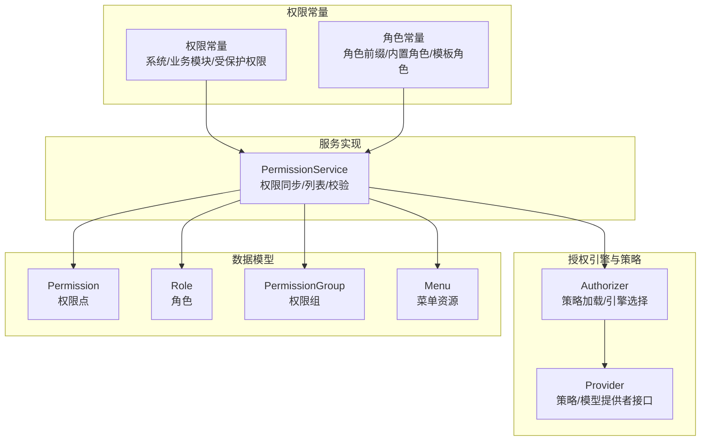
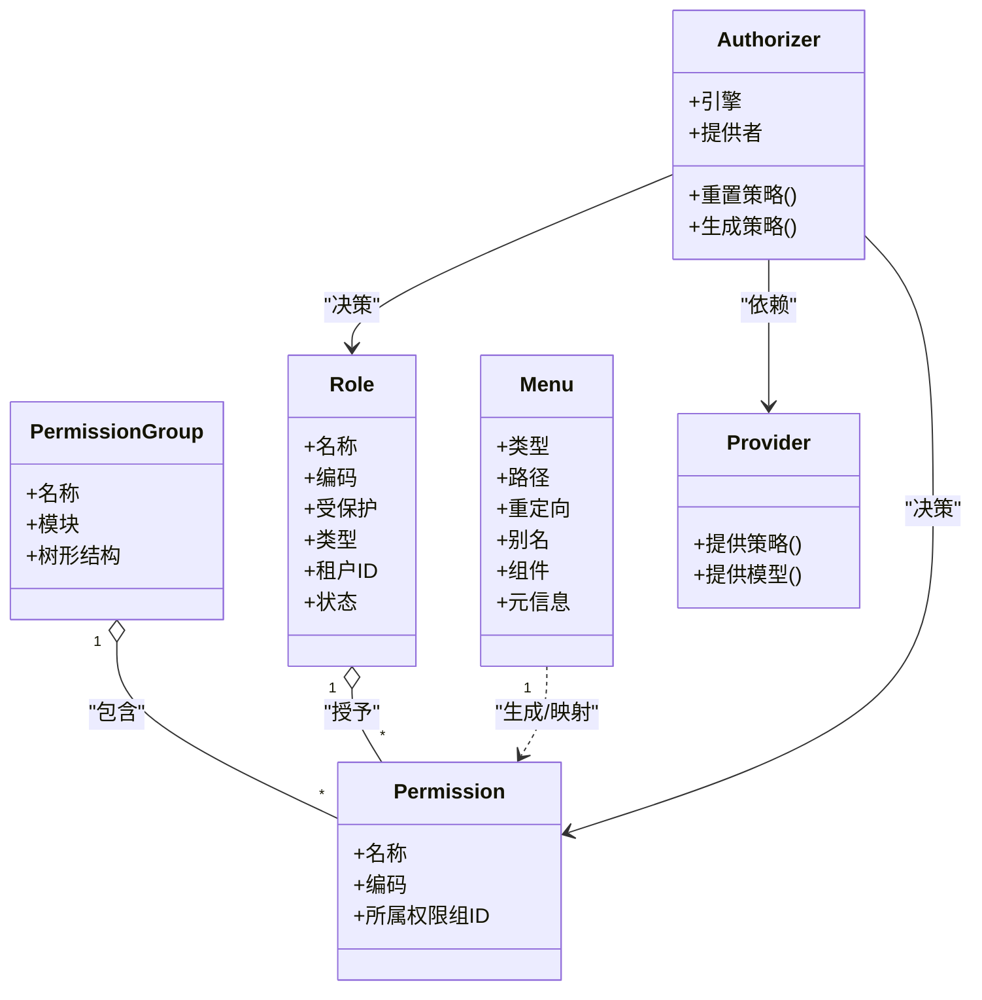
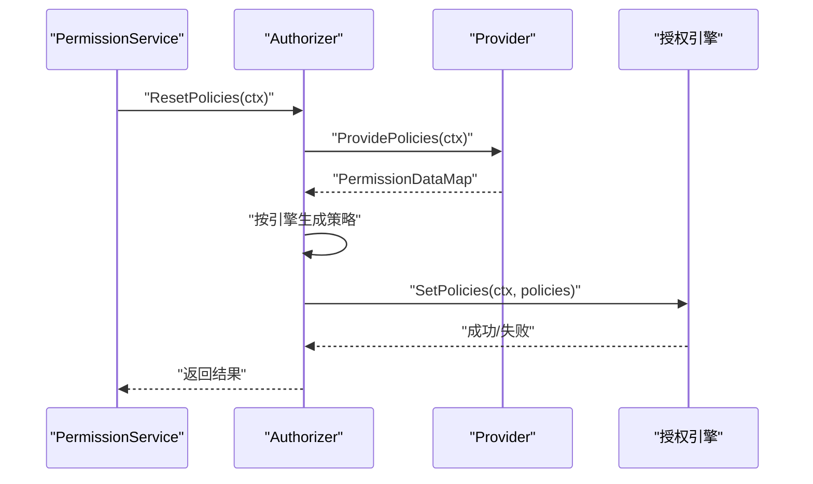
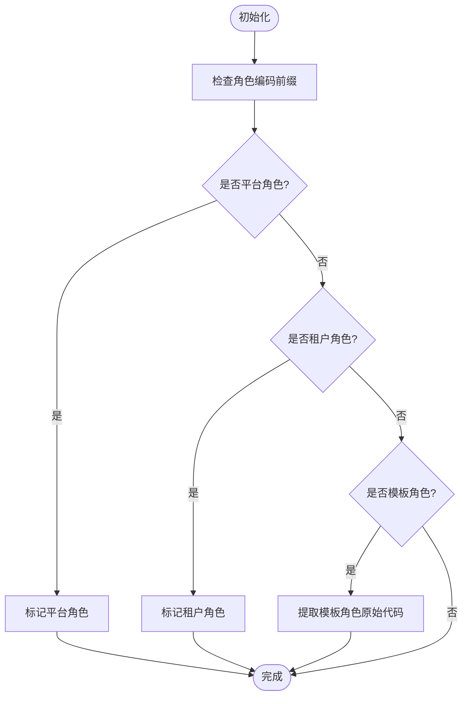
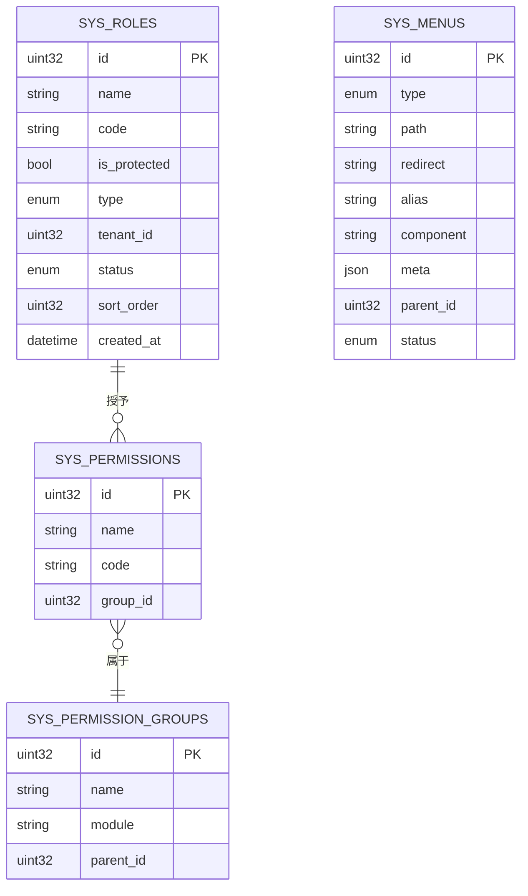
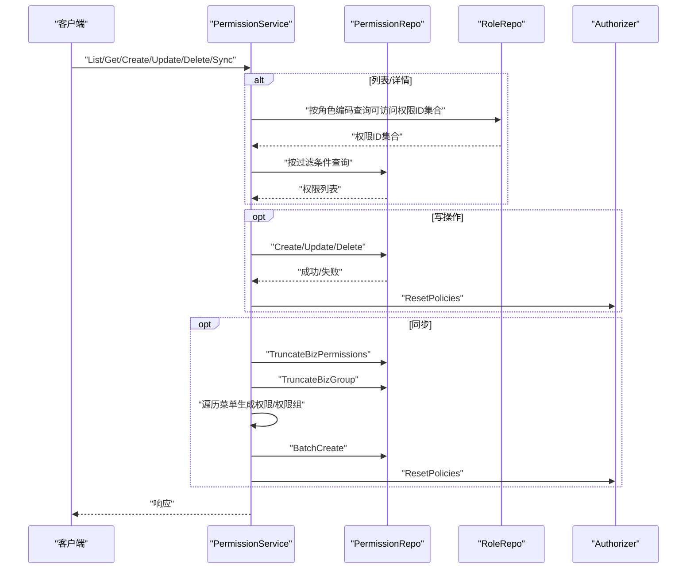
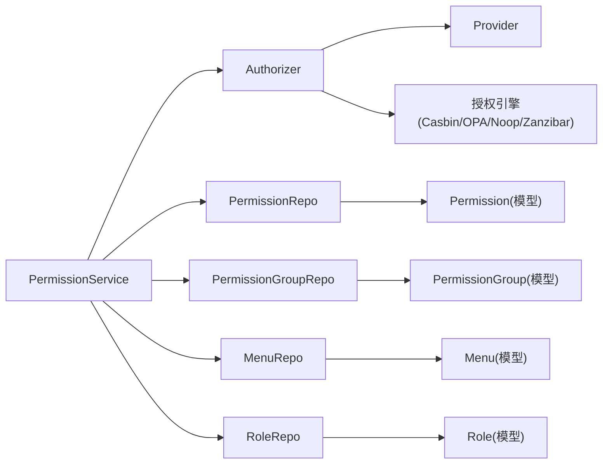

# 权限角色管理

<cite>
**本文引用的文件**
- [backend/pkg/authorizer/authorizer.go](file://backend/pkg/authorizer/authorizer.go)
- [backend/pkg/authorizer/provider.go](file://backend/pkg/authorizer/provider.go)
- [backend/pkg/constants/permission.go](file://backend/pkg/constants/permission.go)
- [backend/pkg/constants/role.go](file://backend/pkg/constants/role.go)
- [backend/app/admin/service/internal/data/ent/schema/permission.go](file://backend/app/admin/service/internal/data/ent/schema/permission.go)
- [backend/app/admin/service/internal/data/ent/schema/role.go](file://backend/app/admin/service/internal/data/ent/schema/role.go)
- [backend/app/admin/service/internal/data/ent/schema/permission_group.go](file://backend/app/admin/service/internal/data/ent/schema/permission_group.go)
- [backend/app/admin/service/internal/data/ent/schema/menu.go](file://backend/app/admin/service/internal/data/ent/schema/menu.go)
- [backend/app/admin/service/internal/service/permission_service.go](file://backend/app/admin/service/internal/service/permission_service.go)
</cite>

## 目录
1. [简介](#简介)
2. [项目结构](#项目结构)
3. [核心组件](#核心组件)
4. [架构总览](#架构总览)
5. [详细组件分析](#详细组件分析)
6. [依赖分析](#依赖分析)
7. [性能考量](#性能考量)
8. [故障排查指南](#故障排查指南)
9. [结论](#结论)
10. [附录](#附录)

## 简介
本文件面向权限角色管理模块，系统性阐述角色管理、权限管理、权限组管理、菜单权限、接口权限等能力；深入解析 RBAC 权限模型在本项目中的实现方式，包括角色继承、权限继承、权限组合等机制；说明权限粒度控制（资源级、操作级、数据级）与验证流程（接口权限检查、数据权限过滤、动态权限计算）；梳理权限策略的配置管理（规则定义、评估日志、缓存机制），并总结设计模式与实现技巧（模型优化、性能调优、安全审计）。

## 项目结构
权限角色管理涉及后端服务层、数据层、常量与授权引擎适配层，主要文件分布如下：
- 授权引擎与策略加载：backend/pkg/authorizer
- 权限常量与角色常量：backend/pkg/constants
- 数据模型（Ent Schema）：backend/app/admin/service/internal/data/ent/schema
- 权限服务实现：backend/app/admin/service/internal/service/permission_service.go

图表来源
- [backend/pkg/authorizer/authorizer.go:18-241](file://backend/pkg/authorizer/authorizer.go#L18-L241)
- [backend/pkg/authorizer/provider.go:21-27](file://backend/pkg/authorizer/provider.go#L21-L27)
- [backend/pkg/constants/permission.go:3-39](file://backend/pkg/constants/permission.go#L3-L39)
- [backend/pkg/constants/role.go:3-49](file://backend/pkg/constants/role.go#L3-L49)
- [backend/app/admin/service/internal/data/ent/schema/permission.go:13-73](file://backend/app/admin/service/internal/data/ent/schema/permission.go#L13-L73)
- [backend/app/admin/service/internal/data/ent/schema/role.go:14-116](file://backend/app/admin/service/internal/data/ent/schema/role.go#L14-L116)
- [backend/app/admin/service/internal/data/ent/schema/permission_group.go:14-69](file://backend/app/admin/service/internal/data/ent/schema/permission_group.go#L14-L69)
- [backend/app/admin/service/internal/data/ent/schema/menu.go:15-141](file://backend/app/admin/service/internal/data/ent/schema/menu.go#L15-L141)
- [backend/app/admin/service/internal/service/permission_service.go:31-74](file://backend/app/admin/service/internal/service/permission_service.go#L31-L74)

章节来源
- [backend/pkg/authorizer/authorizer.go:18-241](file://backend/pkg/authorizer/authorizer.go#L18-L241)
- [backend/pkg/authorizer/provider.go:21-27](file://backend/pkg/authorizer/provider.go#L21-L27)
- [backend/pkg/constants/permission.go:3-39](file://backend/pkg/constants/permission.go#L3-L39)
- [backend/pkg/constants/role.go:3-49](file://backend/pkg/constants/role.go#L3-L49)
- [backend/app/admin/service/internal/data/ent/schema/permission.go:13-73](file://backend/app/admin/service/internal/data/ent/schema/permission.go#L13-L73)
- [backend/app/admin/service/internal/data/ent/schema/role.go:14-116](file://backend/app/admin/service/internal/data/ent/schema/role.go#L14-L116)
- [backend/app/admin/service/internal/data/ent/schema/permission_group.go:14-69](file://backend/app/admin/service/internal/data/ent/schema/permission_group.go#L14-L69)
- [backend/app/admin/service/internal/data/ent/schema/menu.go:15-141](file://backend/app/admin/service/internal/data/ent/schema/menu.go#L15-L141)
- [backend/app/admin/service/internal/service/permission_service.go:31-74](file://backend/app/admin/service/internal/service/permission_service.go#L31-L74)

## 核心组件
- 授权器 Authorizer：负责根据配置选择授权引擎（Casbin/OPA/Noop/Zanzibar），拉取策略与模型，生成并设置策略规则，支持重载策略。
- Provider 接口：抽象策略与模型提供者，统一由外部提供策略数据与模型字节码。
- 权限常量：定义系统权限前缀、受保护权限集合、默认业务模块标识等。
- 角色常量：定义角色前缀（模板/平台/租户）、内置角色代码、角色类型与辅助判断函数。
- 数据模型：权限点、角色、权限组、菜单资源的实体定义与索引设计。
- 权限服务 PermissionService：提供权限同步、列表、计数、增删改、数据权限过滤、策略重载等能力。

章节来源
- [backend/pkg/authorizer/authorizer.go:18-241](file://backend/pkg/authorizer/authorizer.go#L18-L241)
- [backend/pkg/authorizer/provider.go:21-27](file://backend/pkg/authorizer/provider.go#L21-L27)
- [backend/pkg/constants/permission.go:3-39](file://backend/pkg/constants/permission.go#L3-L39)
- [backend/pkg/constants/role.go:3-49](file://backend/pkg/constants/role.go#L3-L49)
- [backend/app/admin/service/internal/data/ent/schema/permission.go:13-73](file://backend/app/admin/service/internal/data/ent/schema/permission.go#L13-L73)
- [backend/app/admin/service/internal/data/ent/schema/role.go:14-116](file://backend/app/admin/service/internal/data/ent/schema/role.go#L14-L116)
- [backend/app/admin/service/internal/data/ent/schema/permission_group.go:14-69](file://backend/app/admin/service/internal/data/ent/schema/permission_group.go#L14-L69)
- [backend/app/admin/service/internal/data/ent/schema/menu.go:15-141](file://backend/app/admin/service/internal/data/ent/schema/menu.go#L15-L141)
- [backend/app/admin/service/internal/service/permission_service.go:31-74](file://backend/app/admin/service/internal/service/permission_service.go#L31-L74)

## 架构总览
RBAC 权限模型在本项目通过“角色-权限-资源”三层关系实现：
- 角色（Role）：包含系统/模板/租户三类，支持受保护字段与多租户隔离。
- 权限（Permission）：具备名称、编码、所属权限组等属性，编码用于与资源（菜单/API）映射。
- 权限组（PermissionGroup）：按业务模块组织权限，支持树形结构与排序。
- 菜单资源（Menu）：承载前端路由与元信息，用于生成权限点与权限组。
- 授权引擎（Authorizer）：根据配置选择具体引擎，加载策略与模型，执行权限决策。

图表来源
- [backend/app/admin/service/internal/data/ent/schema/role.go:14-116](file://backend/app/admin/service/internal/data/ent/schema/role.go#L14-L116)
- [backend/app/admin/service/internal/data/ent/schema/permission.go:13-73](file://backend/app/admin/service/internal/data/ent/schema/permission.go#L13-L73)
- [backend/app/admin/service/internal/data/ent/schema/permission_group.go:14-69](file://backend/app/admin/service/internal/data/ent/schema/permission_group.go#L14-L69)
- [backend/app/admin/service/internal/data/ent/schema/menu.go:15-141](file://backend/app/admin/service/internal/data/ent/schema/menu.go#L15-L141)
- [backend/pkg/authorizer/authorizer.go:18-241](file://backend/pkg/authorizer/authorizer.go#L18-L241)
- [backend/pkg/authorizer/provider.go:21-27](file://backend/pkg/authorizer/provider.go#L21-L27)

## 详细组件分析

### 授权引擎与策略加载（Authorizer）
- 引擎选择：根据配置类型选择 Noop/Casbin/OPA/Zanzibar，默认 Noop；Casbin 使用 p 策略规则（角色-路径-方法-域），OPA 使用角色到路径+方法映射。
- 策略生成：从 Provider 拉取权限数据映射，按引擎格式生成策略集；Casbin 将角色与 API 的路径/方法/域映射为规则；OPA 将角色映射为路径+方法数组。
- 策略设置：调用引擎 SetPolicies 设置策略；支持重载策略 ResetPolicies。
- 日志与错误：记录策略条数、引擎名称、错误信息，便于审计与排障。

图表来源
- [backend/app/admin/service/internal/service/permission_service.go:241-244](file://backend/app/admin/service/internal/service/permission_service.go#L241-L244)
- [backend/pkg/authorizer/authorizer.go:62-109](file://backend/pkg/authorizer/authorizer.go#L62-L109)
- [backend/pkg/authorizer/authorizer.go:111-160](file://backend/pkg/authorizer/authorizer.go#L111-L160)
- [backend/pkg/authorizer/authorizer.go:162-183](file://backend/pkg/authorizer/authorizer.go#L162-L183)

章节来源
- [backend/pkg/authorizer/authorizer.go:18-241](file://backend/pkg/authorizer/authorizer.go#L18-L241)
- [backend/pkg/authorizer/provider.go:21-27](file://backend/pkg/authorizer/provider.go#L21-L27)
- [backend/app/admin/service/internal/service/permission_service.go:241-244](file://backend/app/admin/service/internal/service/permission_service.go#L241-L244)

### 权限常量与角色常量
- 权限常量：系统权限前缀与受保护权限集合，确保关键权限不可被误删；默认业务模块标识与未分类权限组标识。
- 角色常量：角色前缀（模板/平台/租户）、内置角色代码（平台/租户管理员）、角色类型枚举、辅助判断函数（是否平台/租户/模板角色、提取模板角色原始代码）。

图表来源
- [backend/pkg/constants/role.go:27-49](file://backend/pkg/constants/role.go#L27-L49)

章节来源
- [backend/pkg/constants/permission.go:3-39](file://backend/pkg/constants/permission.go#L3-L39)
- [backend/pkg/constants/role.go:3-49](file://backend/pkg/constants/role.go#L3-L49)

### 数据模型与索引设计
- 权限点（Permission）：字段含名称、编码、所属权限组；索引覆盖编码唯一、名称与组ID查询。
- 角色（Role）：字段含名称、编码、受保护标志、类型、租户ID、状态等；索引覆盖租户+编码唯一、租户+名称、全局名称、全局编码、状态与排序等。
- 权限组（PermissionGroup）：字段含名称、模块、树形结构；索引覆盖父节点、名称、模块。
- 菜单资源（Menu）：字段含类型、路径、重定向、别名、组件、元信息；索引覆盖父子唯一、路径、别名、组件、类型、状态、父节点等。

图表来源
- [backend/app/admin/service/internal/data/ent/schema/role.go:30-74](file://backend/app/admin/service/internal/data/ent/schema/role.go#L30-L74)
- [backend/app/admin/service/internal/data/ent/schema/permission.go:29-44](file://backend/app/admin/service/internal/data/ent/schema/permission.go#L29-L44)
- [backend/app/admin/service/internal/data/ent/schema/permission_group.go:29-41](file://backend/app/admin/service/internal/data/ent/schema/permission_group.go#L29-L41)
- [backend/app/admin/service/internal/data/ent/schema/menu.go:32-81](file://backend/app/admin/service/internal/data/ent/schema/menu.go#L32-L81)

章节来源
- [backend/app/admin/service/internal/data/ent/schema/permission.go:13-73](file://backend/app/admin/service/internal/data/ent/schema/permission.go#L13-L73)
- [backend/app/admin/service/internal/data/ent/schema/role.go:14-116](file://backend/app/admin/service/internal/data/ent/schema/role.go#L14-L116)
- [backend/app/admin/service/internal/data/ent/schema/permission_group.go:14-69](file://backend/app/admin/service/internal/data/ent/schema/permission_group.go#L14-L69)
- [backend/app/admin/service/internal/data/ent/schema/menu.go:15-141](file://backend/app/admin/service/internal/data/ent/schema/menu.go#L15-L141)

### 权限服务与权限验证流程
- 初始化与默认权限：首次启动时若权限点为空则创建默认权限，若存在 API/菜单则触发权限同步。
- 列表与详情：租户上下文下，基于当前用户角色可访问的权限ID集合进行数据权限过滤；详情访问前进行权限匹配校验。
- 新增/更新/删除：写入后触发授权策略重载，确保新规则生效。
- 权限同步：清理业务权限与权限组，遍历启用菜单生成权限点与权限组，按模块归类；为权限附加 API 资源ID；批量创建后重载策略。
- 策略重载：调用 Authorizer.ResetPolicies，重新生成并设置策略。

图表来源
- [backend/app/admin/service/internal/service/permission_service.go:151-182](file://backend/app/admin/service/internal/service/permission_service.go#L151-L182)
- [backend/app/admin/service/internal/service/permission_service.go:188-222](file://backend/app/admin/service/internal/service/permission_service.go#L188-L222)
- [backend/app/admin/service/internal/service/permission_service.go:224-290](file://backend/app/admin/service/internal/service/permission_service.go#L224-L290)
- [backend/app/admin/service/internal/service/permission_service.go:414-536](file://backend/app/admin/service/internal/service/permission_service.go#L414-L536)

章节来源
- [backend/app/admin/service/internal/service/permission_service.go:76-90](file://backend/app/admin/service/internal/service/permission_service.go#L76-L90)
- [backend/app/admin/service/internal/service/permission_service.go:151-222](file://backend/app/admin/service/internal/service/permission_service.go#L151-L222)
- [backend/app/admin/service/internal/service/permission_service.go:224-290](file://backend/app/admin/service/internal/service/permission_service.go#L224-L290)
- [backend/app/admin/service/internal/service/permission_service.go:414-536](file://backend/app/admin/service/internal/service/permission_service.go#L414-L536)

### 权限粒度控制与验证
- 资源级权限：菜单资源（Menu）与权限点（Permission）通过编码与路径映射，形成资源维度的权限边界。
- 操作级权限：API 资源与权限点绑定，结合方法（GET/POST/PUT/DELETE）形成操作维度的权限控制。
- 数据级权限：在列表/详情场景，基于用户角色可访问的权限ID集合进行数据过滤，实现最小可见原则。
- 动态权限计算：权限同步时根据菜单与 API 自动推导权限点与权限组，动态生成策略。

章节来源
- [backend/app/admin/service/internal/data/ent/schema/menu.go:32-81](file://backend/app/admin/service/internal/data/ent/schema/menu.go#L32-L81)
- [backend/app/admin/service/internal/data/ent/schema/permission.go:29-44](file://backend/app/admin/service/internal/data/ent/schema/permission.go#L29-L44)
- [backend/app/admin/service/internal/service/permission_service.go:151-182](file://backend/app/admin/service/internal/service/permission_service.go#L151-L182)
- [backend/app/admin/service/internal/service/permission_service.go:414-536](file://backend/app/admin/service/internal/service/permission_service.go#L414-L536)

### 权限策略配置管理
- 规则定义：Casbin 使用 p 规则（角色-路径-方法-域），OPA 使用角色到路径+方法映射；Authorizer 按引擎生成策略。
- 评估日志：引擎侧可输出策略匹配过程与结果，便于审计与排障。
- 缓存机制：策略重载后由引擎内部维护缓存，减少重复计算；建议在高并发场景下合理设置重载频率与批量策略加载。

章节来源
- [backend/pkg/authorizer/authorizer.go:111-160](file://backend/pkg/authorizer/authorizer.go#L111-L160)
- [backend/pkg/authorizer/authorizer.go:162-183](file://backend/pkg/authorizer/authorizer.go#L162-L183)

## 依赖分析
- 组件耦合：PermissionService 依赖 Authorizer、各 Repo 与转换器；Authorizer 依赖 Provider 与授权引擎；数据模型独立于服务层。
- 直接依赖：服务层对数据层的仓储接口依赖；授权层对策略提供者的依赖；模型层对 Ent 约定的依赖。
- 外部依赖：授权引擎（Casbin/OPA/Noop/Zanzibar）与 Kratos 日志组件。

图表来源
- [backend/app/admin/service/internal/service/permission_service.go:31-74](file://backend/app/admin/service/internal/service/permission_service.go#L31-L74)
- [backend/pkg/authorizer/authorizer.go:18-241](file://backend/pkg/authorizer/authorizer.go#L18-L241)
- [backend/app/admin/service/internal/data/ent/schema/permission.go:13-73](file://backend/app/admin/service/internal/data/ent/schema/permission.go#L13-L73)
- [backend/app/admin/service/internal/data/ent/schema/permission_group.go:14-69](file://backend/app/admin/service/internal/data/ent/schema/permission_group.go#L14-L69)
- [backend/app/admin/service/internal/data/ent/schema/menu.go:15-141](file://backend/app/admin/service/internal/data/ent/schema/menu.go#L15-L141)
- [backend/app/admin/service/internal/data/ent/schema/role.go:14-116](file://backend/app/admin/service/internal/data/ent/schema/role.go#L14-L116)

章节来源
- [backend/app/admin/service/internal/service/permission_service.go:31-74](file://backend/app/admin/service/internal/service/permission_service.go#L31-L74)
- [backend/pkg/authorizer/authorizer.go:18-241](file://backend/pkg/authorizer/authorizer.go#L18-L241)

## 性能考量
- 策略重载成本：批量创建权限后触发 ResetPolicies，建议在运维窗口或低峰期执行，避免频繁重载导致的瞬时延迟。
- 查询优化：利用模型索引（如角色的租户+编码唯一、权限的编码唯一、菜单的路径/别名/类型索引）提升查询效率。
- 数据权限过滤：列表/详情阶段先获取可访问权限ID集合再做数据库过滤，减少无效查询。
- 引擎选择：Casbin 适合规则明确的 RBAC 场景；OPA 适合复杂策略与动态评估场景；Noop 适合测试与禁用授权。

## 故障排查指南
- 策略未生效：确认已调用 ResetPolicies；检查引擎初始化与模型加载是否成功；核对策略生成逻辑与规则格式。
- 权限同步异常：检查菜单状态与路径合法性；确认 API 资源是否存在且启用；关注权限组模块归类是否正确。
- 数据权限异常：核对当前用户角色与可访问权限ID集合；检查角色与权限的授予关系；确认租户隔离是否正确。
- 引擎错误：查看授权引擎初始化与模块加载日志；确认配置类型与引擎可用性。

章节来源
- [backend/pkg/authorizer/authorizer.go:50-56](file://backend/pkg/authorizer/authorizer.go#L50-L56)
- [backend/pkg/authorizer/authorizer.go:162-183](file://backend/pkg/authorizer/authorizer.go#L162-L183)
- [backend/app/admin/service/internal/service/permission_service.go:414-536](file://backend/app/admin/service/internal/service/permission_service.go#L414-L536)

## 结论
本权限角色管理模块以 RBAC 为核心，结合菜单与 API 资源自动生成权限点与权限组，通过可插拔的授权引擎实现策略加载与决策；配合数据模型的索引设计与服务层的数据权限过滤，形成从资源到操作再到数据的多维权限控制体系。通过策略重载与引擎日志，实现策略配置的可追溯与可观测。

## 附录
- 最佳实践
  - 模型优化：为高频查询字段建立合适索引，避免全表扫描。
  - 性能调优：合并批量操作、降低策略重载频率、使用合适的授权引擎。
  - 安全审计：开启策略评估日志与权限变更审计，定期审查受保护权限与内置角色。
  - 配置管理：规范权限编码与模块划分，确保权限同步一致性与可维护性。