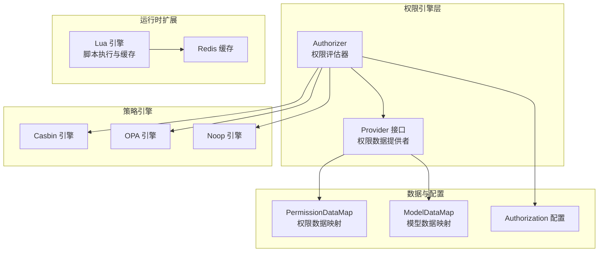
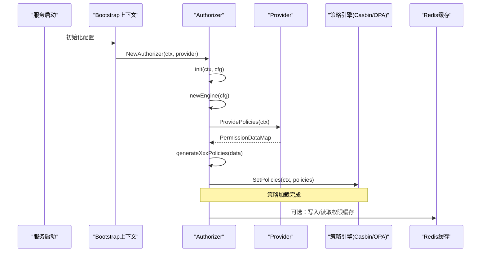
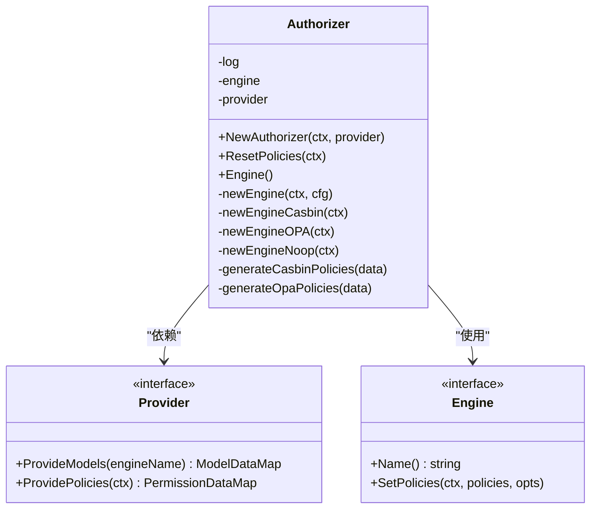
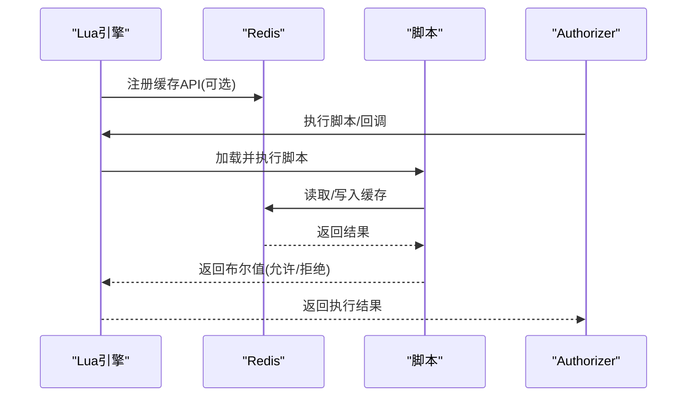
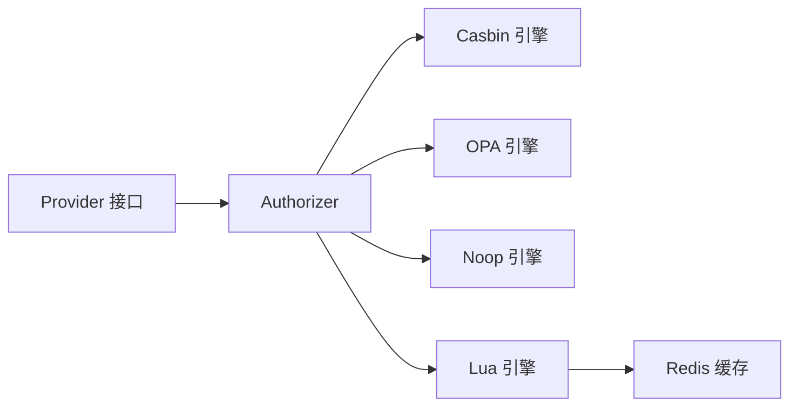

# 权限评估与验证

<cite>
**本文引用的文件**
- [backend/pkg/authorizer/authorizer.go](file://backend/pkg/authorizer/authorizer.go)
- [backend/pkg/authorizer/provider.go](file://backend/pkg/authorizer/provider.go)
- [backend/pkg/constants/permission.go](file://backend/pkg/constants/permission.go)
- [backend/pkg/lua/engine.go](file://backend/pkg/lua/engine.go)
- [backend/pkg/lua/api/cache.go](file://backend/pkg/lua/api/cache.go)
- [backend/app/admin/service/cmd/server/main.go](file://backend/app/admin/service/cmd/server/main.go)
- [backend/app/admin/service/cmd/server/wire.go](file://backend/app/admin/service/cmd/server/wire.go)
- [backend/api/protos/permission/service/v1/i_permission.proto](file://backend/api/protos/permission/service/v1/i_permission.proto)
- [backend/api/protos/permission/service/v1/permission_policy.proto](file://backend/api/protos/permission/service/v1/permission_policy.proto)
- [backend/api/protos/permission/service/v1/policy_evaluation_log.proto](file://backend/api/protos/permission/service/v1/policy_evaluation_log.proto)
</cite>

## 目录
1. [简介](#简介)
2. [项目结构](#项目结构)
3. [核心组件](#核心组件)
4. [架构总览](#架构总览)
5. [详细组件分析](#详细组件分析)
6. [依赖关系分析](#依赖关系分析)
7. [性能考量](#性能考量)
8. [故障排查指南](#故障排查指南)
9. [结论](#结论)
10. [附录](#附录)

## 简介
本文件系统性阐述权限评估与验证功能的设计与实现，覆盖权限解析、权限计算、权限决策流程；静态权限检查与动态权限计算的结合；权限缓存机制；以及权限评估日志记录与分析。同时给出优化策略（缓存设计、批量检查、预计算）与实现模式（权限提供者接口、权限评估器设计、缓存管理），并提供性能调优与故障排查建议。

## 项目结构
权限相关能力主要分布在以下模块：
- 权限引擎与评估器：backend/pkg/authorizer
- 权限常量与受保护权限码：backend/pkg/constants
- Lua脚本执行与缓存集成：backend/pkg/lua
- 权限服务协议定义：backend/api/protos/permission/service/v1
- 服务启动与依赖注入：backend/app/admin/service/cmd/server

图表来源
- [backend/pkg/authorizer/authorizer.go:18-241](file://backend/pkg/authorizer/authorizer.go#L18-L241)
- [backend/pkg/authorizer/provider.go:20-27](file://backend/pkg/authorizer/provider.go#L20-L27)
- [backend/pkg/lua/engine.go:28-97](file://backend/pkg/lua/engine.go#L28-L97)

章节来源
- [backend/pkg/authorizer/authorizer.go:18-241](file://backend/pkg/authorizer/authorizer.go#L18-L241)
- [backend/pkg/authorizer/provider.go:20-27](file://backend/pkg/authorizer/provider.go#L20-L27)
- [backend/pkg/lua/engine.go:28-97](file://backend/pkg/lua/engine.go#L28-L97)

## 核心组件
- 权限评估器 Authorizer：负责根据配置选择具体策略引擎，加载权限与模型数据，生成策略规则并写入引擎，支持重载策略。
- 权限提供者 Provider：抽象出权限数据与模型数据的提供接口，便于从不同数据源（数据库、配置中心、脚本）获取。
- 权限常量 constants.permission：定义系统级权限码前缀、模块标识及受保护权限列表，确保关键权限不可被误删。
- Lua 引擎：提供脚本化扩展能力，支持回调注册、钩子执行、缓存 API、事件总线与对象存储集成，可作为动态权限计算的执行载体。
- 权限服务协议：定义权限策略、评估日志等协议，支撑前后端交互与审计。

章节来源
- [backend/pkg/authorizer/authorizer.go:18-241](file://backend/pkg/authorizer/authorizer.go#L18-L241)
- [backend/pkg/authorizer/provider.go:20-27](file://backend/pkg/authorizer/provider.go#L20-L27)
- [backend/pkg/constants/permission.go:31-39](file://backend/pkg/constants/permission.go#L31-L39)
- [backend/pkg/lua/engine.go:28-97](file://backend/pkg/lua/engine.go#L28-L97)
- [backend/api/protos/permission/service/v1/i_permission.proto](file://backend/api/protos/permission/service/v1/i_permission.proto)
- [backend/api/protos/permission/service/v1/permission_policy.proto](file://backend/api/protos/permission/service/v1/permission_policy.proto)
- [backend/api/protos/permission/service/v1/policy_evaluation_log.proto](file://backend/api/protos/permission/service/v1/policy_evaluation_log.proto)

## 架构总览
权限评估采用“策略引擎 + 数据提供者”的解耦架构。Authorizer 根据配置选择引擎（Casbin/OPA/Noop/Zanzibar占位），通过 Provider 获取权限与模型数据，生成对应格式的策略并写入引擎。Lua 引擎可作为动态权限计算与扩展点，支持缓存、事件总线、对象存储等能力。

图表来源
- [backend/pkg/authorizer/authorizer.go:50-109](file://backend/pkg/authorizer/authorizer.go#L50-L109)
- [backend/pkg/authorizer/authorizer.go:162-183](file://backend/pkg/authorizer/authorizer.go#L162-L183)
- [backend/pkg/lua/engine.go:583-605](file://backend/pkg/lua/engine.go#L583-L605)

## 详细组件分析

### 权限评估器 Authorizer
- 职责
  - 基于配置选择策略引擎（Casbin/OPA/Noop/Zanzibar）。
  - 通过 Provider 获取权限数据与模型数据，生成对应引擎的策略格式。
  - 将策略写入引擎并支持重载。
- 关键流程
  - 初始化：读取配置，创建引擎实例。
  - 重载策略：调用 Provider 的 ProvidePolicies 获取权限数据，按引擎类型生成策略，再写入引擎。
  - 引擎创建：根据配置类型选择具体实现，OPA 模型来自 Provider 的 ProvideModels。
- 性能与可靠性
  - 引擎初始化失败会记录错误并返回空引擎，避免阻塞启动。
  - 重载策略时对不同引擎类型分别处理，保证兼容性。

图表来源
- [backend/pkg/authorizer/authorizer.go:18-241](file://backend/pkg/authorizer/authorizer.go#L18-L241)
- [backend/pkg/authorizer/provider.go:20-27](file://backend/pkg/authorizer/provider.go#L20-L27)

章节来源
- [backend/pkg/authorizer/authorizer.go:50-109](file://backend/pkg/authorizer/authorizer.go#L50-L109)
- [backend/pkg/authorizer/authorizer.go:162-183](file://backend/pkg/authorizer/authorizer.go#L162-L183)
- [backend/pkg/authorizer/authorizer.go:111-160](file://backend/pkg/authorizer/authorizer.go#L111-L160)

### 权限提供者 Provider
- 角色：抽象权限数据与模型数据的来源，便于替换数据源。
- 数据结构
  - PermissionData：包含路径、方法、域信息。
  - PermissionDataMap：角色代码到权限数组的映射。
  - ModelDataMap：引擎名到模型字节数据的映射。
- 作用：为 Authorizer 提供统一的数据接口，支持从数据库、配置中心或脚本加载。

章节来源
- [backend/pkg/authorizer/provider.go:5-27](file://backend/pkg/authorizer/provider.go#L5-L27)

### 权限常量 constants.permission
- 定义系统权限前缀与模块标识，列举受保护权限码列表。
- 用途：统一权限命名规范，防止关键权限被误删。

章节来源
- [backend/pkg/constants/permission.go:31-39](file://backend/pkg/constants/permission.go#L31-L39)

### Lua 引擎与缓存集成
- 能力概述
  - VM 池化管理，支持超时控制与内存限制。
  - 注册安全标准库与自定义 API（日志、缓存、事件总线、任务、工具等）。
  - 支持钩子执行与回调注册，脚本可通过缓存 API 访问 Redis。
- 缓存集成
  - 通过 SetRedis 注入 Redis 客户端后，Lua 脚本可使用缓存 API 进行读写。
  - 引擎在执行脚本时设置超时上下文，避免长时间阻塞。

图表来源
- [backend/pkg/lua/engine.go:583-605](file://backend/pkg/lua/engine.go#L583-L605)
- [backend/pkg/lua/api/cache.go](file://backend/pkg/lua/api/cache.go)
- [backend/pkg/lua/engine.go:263-328](file://backend/pkg/lua/engine.go#L263-L328)

章节来源
- [backend/pkg/lua/engine.go:28-97](file://backend/pkg/lua/engine.go#L28-L97)
- [backend/pkg/lua/engine.go:583-605](file://backend/pkg/lua/engine.go#L583-L605)
- [backend/pkg/lua/engine.go:263-328](file://backend/pkg/lua/engine.go#L263-L328)

### 权限服务协议与评估日志
- 协议要点
  - 权限策略定义：包含角色、资源、操作、域等维度。
  - 策略评估日志：记录评估输入、输出、耗时、命中情况等，用于审计与分析。
- 用途
  - 前后端交互的契约，保障权限判定的一致性与可观测性。

章节来源
- [backend/api/protos/permission/service/v1/i_permission.proto](file://backend/api/protos/permission/service/v1/i_permission.proto)
- [backend/api/protos/permission/service/v1/permission_policy.proto](file://backend/api/protos/permission/service/v1/permission_policy.proto)
- [backend/api/protos/permission/service/v1/policy_evaluation_log.proto](file://backend/api/protos/permission/service/v1/policy_evaluation_log.proto)

## 依赖关系分析
- 组件耦合
  - Authorizer 依赖 Provider 接口，通过接口隔离数据源变化。
  - Authorizer 依赖策略引擎接口，支持多引擎切换。
  - Lua 引擎通过 SetRedis/SetEventBus/SetOSS 注入外部依赖，形成松耦合扩展点。
- 外部依赖
  - Redis：用于 Lua 缓存 API。
  - Kratos 日志：统一日志输出。
  - 配置：Authorization 配置决定引擎类型与行为。

图表来源
- [backend/pkg/authorizer/authorizer.go:18-241](file://backend/pkg/authorizer/authorizer.go#L18-L241)
- [backend/pkg/lua/engine.go:583-605](file://backend/pkg/lua/engine.go#L583-L605)

章节来源
- [backend/pkg/authorizer/authorizer.go:18-241](file://backend/pkg/authorizer/authorizer.go#L18-L241)
- [backend/pkg/lua/engine.go:583-605](file://backend/pkg/lua/engine.go#L583-L605)

## 性能考量
- 引擎选择与策略生成
  - Casbin：适合 RBAC/ABAC 等规则明确场景，策略生成简单直接。
  - OPA：适合复杂策略与动态计算场景，需加载模型并初始化模块。
- 缓存设计
  - 权限结果缓存：对热点资源与用户组合进行缓存，降低重复评估成本。
  - Lua 缓存 API：脚本侧可直接访问 Redis，减少跨层调用。
- 批量权限检查
  - 合理合并请求，减少引擎调用次数；对相同资源的多次检查进行去重。
- 预计算与预热
  - 在系统启动或定时任务中预加载策略与模型，避免首次请求抖动。
- 超时与资源限制
  - Lua VM 设置超时与内存上限，防止恶意或异常脚本影响系统稳定性。

## 故障排查指南
- 引擎初始化失败
  - 现象：日志出现初始化错误并返回空引擎。
  - 排查：检查配置 Authorization 类型是否正确，OPA 模型是否存在。
- 策略重载失败
  - 现象：重载策略报错或策略未生效。
  - 排查：确认 Provider 是否成功返回权限数据；检查引擎名称匹配；查看策略写入日志。
- Lua 脚本执行异常
  - 现象：脚本执行超时或返回 false 导致中断。
  - 排查：检查脚本逻辑、超时配置、回调函数返回值；查看日志中的耗时统计。
- 缓存不可用
  - 现象：Lua 缓存 API 不可用。
  - 排查：确认已通过 SetRedis 注入 Redis 客户端；检查连接状态与权限。

章节来源
- [backend/pkg/authorizer/authorizer.go:190-240](file://backend/pkg/authorizer/authorizer.go#L190-L240)
- [backend/pkg/lua/engine.go:317-328](file://backend/pkg/lua/engine.go#L317-L328)
- [backend/pkg/lua/engine.go:583-605](file://backend/pkg/lua/engine.go#L583-L605)

## 结论
该权限评估体系以 Authorizer 为核心，通过 Provider 抽象数据源，结合多种策略引擎实现灵活的权限判定；Lua 引擎提供强大的动态扩展能力与缓存集成。配合完善的协议与日志机制，可在保证安全性的同时提升性能与可观测性。建议在生产环境中启用缓存、批量检查与预热策略，并持续监控评估耗时与异常，确保系统稳定高效运行。

## 附录
- 实现模式建议
  - 权限提供者接口：统一权限与模型数据来源，支持多数据源适配。
  - 权限评估器设计：按配置选择引擎，集中处理策略生成与写入。
  - 权限缓存管理：结合 Redis 与 Lua 缓存 API，实现热点数据缓存与失效策略。
- 优化实践
  - 缓存设计：基于用户+资源+动作构建键空间，设置合理 TTL。
  - 批量检查：合并同类项，减少引擎调用次数。
  - 预计算：在启动或定时任务中预加载策略与模型。
- 性能调优
  - 调整 Lua VM 池大小与超时时间，平衡吞吐与延迟。
  - 对热点策略进行分片与分区，避免单点瓶颈。
- 故障排查清单
  - 检查配置 Authorization 类型与引擎可用性。
  - 校验 Provider 返回的权限数据格式与完整性。
  - 查看 Lua 脚本执行日志与耗时统计。
  - 确认 Redis 连接与缓存 API 可用性。