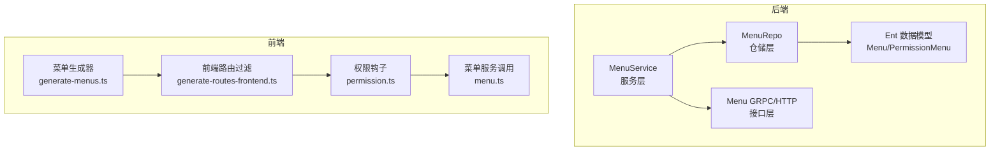
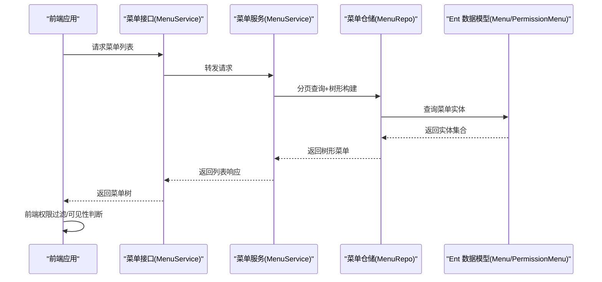
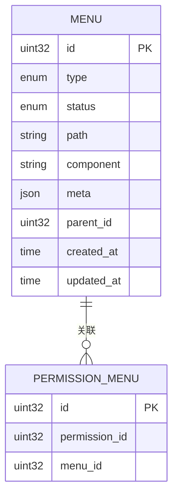
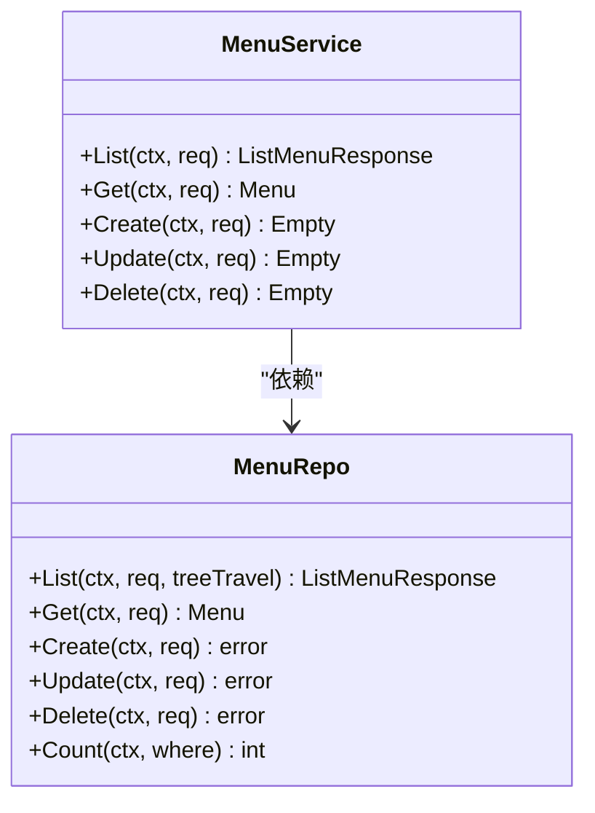
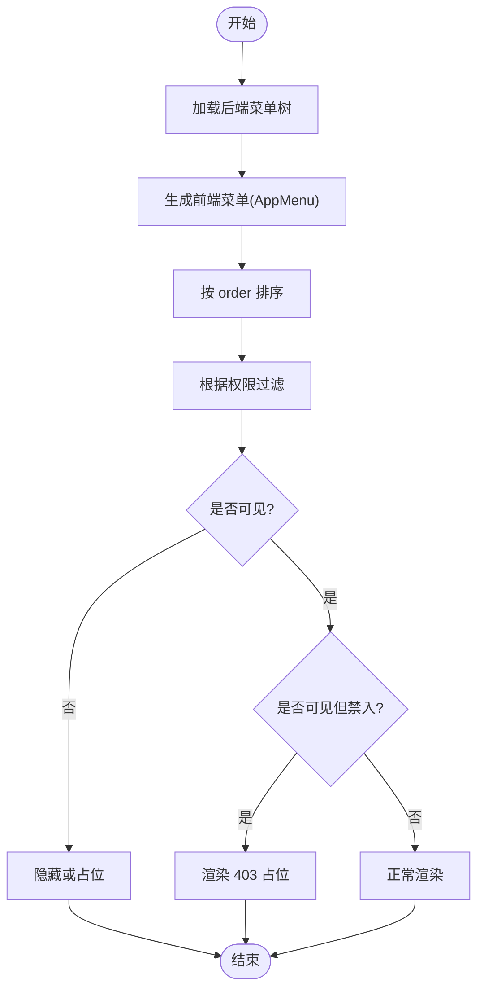
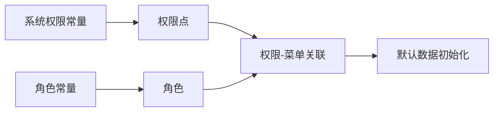
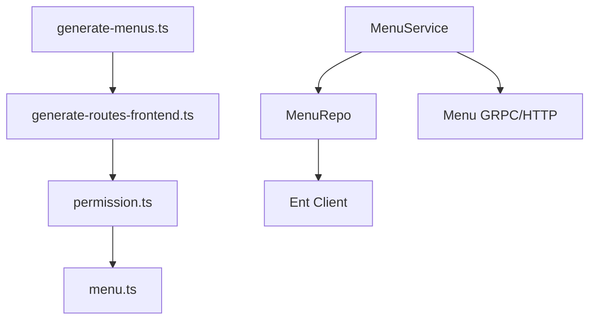

# 菜单权限管理

<cite>
**本文档引用的文件**
- [menu_service.go](file://backend/app/admin/service/internal/service/menu_service.go)
- [menu_repo.go](file://backend/app/admin/service/internal/data/menu_repo.go)
- [menu_grpc.pb.go](file://backend/api/gen/go/resource/service/v1/menu_grpc.pb.go)
- [menu.pb.go](file://backend/api/gen/go/resource/service/v1/menu.pb.go)
- [permission_menu.pb.go](file://backend/api/gen/go/permission/service/v1/permission_menu.pb.go)
- [permission.go](file://backend/pkg/constants/permission.go)
- [role.go](file://backend/pkg/constants/role.go)
- [default_data.go](file://backend/pkg/constants/default_data.go)
- [generate-menus.ts](file://frontend/admin/react/src/core/router/generators/generate-menus.ts)
- [generate-routes-frontend.ts](file://frontend/admin/react/src/core/router/generators/generate-routes-frontend.ts)
- [permission.ts](file://frontend/admin/react/src/api/hooks/permission.ts)
- [menu.ts](file://frontend/admin/react/src/api/service/menu.ts)
- [permissionmenu_query.go](file://backend/app/admin/service/internal/data/ent/permissionmenu_query.go)
- [permissionmenu_create.go](file://backend/app/admin/service/internal/data/ent/permissionmenu_create.go)
- [permissionmenu_update.go](file://backend/app/admin/service/internal/data/ent/permissionmenu_update.go)
- [permissionmenu_where.go](file://backend/app/admin/service/internal/data/ent/permissionmenu/where.go)
- [entql.go](file://backend/app/admin/service/internal/data/ent/entql.go)
</cite>

## 目录
1. [简介](#简介)
2. [项目结构](#项目结构)
3. [核心组件](#核心组件)
4. [架构总览](#架构总览)
5. [详细组件分析](#详细组件分析)
6. [依赖关系分析](#依赖关系分析)
7. [性能考量](#性能考量)
8. [故障排查指南](#故障排查指南)
9. [结论](#结论)
10. [附录](#附录)

## 简介
本文件系统性阐述菜单权限管理的设计与实现，涵盖概念、配置方式、与角色的关联、前后端渲染机制、数据模型、设计模式以及安全与体验优化建议。目标是帮助开发者与运维人员快速理解并高效维护菜单权限体系。

## 项目结构
后端采用分层架构：服务层负责业务编排，仓储层封装数据访问，协议层定义资源与权限的传输模型；前端通过生成器将后端菜单树与权限点结合，完成动态菜单与路由的构建与过滤。

**图表来源**
- [menu_service.go:22-46](file://backend/app/admin/service/internal/service/menu_service.go#L22-L46)
- [menu_repo.go:27-74](file://backend/app/admin/service/internal/data/menu_repo.go#L27-L74)
- [menu_grpc.pb.go:56-167](file://backend/api/gen/go/resource/service/v1/menu_grpc.pb.go#L56-L167)
- [generate-menus.ts:138-178](file://frontend/admin/react/src/core/router/generators/generate-menus.ts#L138-L178)
- [generate-routes-frontend.ts:12-37](file://frontend/admin/react/src/core/router/generators/generate-routes-frontend.ts#L12-L37)

**章节来源**
- [menu_service.go:1-139](file://backend/app/admin/service/internal/service/menu_service.go#L1-L139)
- [menu_repo.go:1-308](file://backend/app/admin/service/internal/data/menu_repo.go#L1-L308)

## 核心组件
- 菜单服务：提供菜单的增删改查与默认菜单初始化逻辑，处理操作人信息注入。
- 菜单仓储：封装分页查询、树形构建、父子关系删除、元数据 JSON 字段更新等。
- 菜单接口：基于 Protobuf 定义菜单、路由元信息、列表响应等结构。
- 权限-菜单关联：通过 PermissionMenu 关联表建立权限点与菜单的多对多关系。
- 前端生成器：根据后端菜单树与用户权限，动态生成可访问的菜单树与路由，并支持“可见但禁入”场景。
- 默认数据：内置系统权限、角色、菜单的默认集合，支撑初始化与演示。

**章节来源**
- [menu_service.go:22-139](file://backend/app/admin/service/internal/service/menu_service.go#L22-L139)
- [menu_repo.go:27-308](file://backend/app/admin/service/internal/data/menu_repo.go#L27-L308)
- [menu.pb.go:134-525](file://backend/api/gen/go/resource/service/v1/menu.pb.go#L134-L525)
- [permission_menu.pb.go:26-84](file://backend/api/gen/go/permission/service/v1/permission_menu.pb.go#L26-L84)
- [generate-menus.ts:138-178](file://frontend/admin/react/src/core/router/generators/generate-menus.ts#L138-L178)

## 架构总览
后端通过 MenuService 调用 MenuRepo 访问 Ent 数据模型，使用 Protobuf 定义的 Menu 结构与元信息（如 authority、hideInMenu 等）进行树形构建与权限过滤。前端通过 generate-menus.ts 与 generate-routes-frontend.ts 将后端返回的菜单树与用户权限进行二次过滤，最终渲染出符合当前用户权限的导航菜单与路由。

**图表来源**
- [menu_grpc.pb.go:56-167](file://backend/api/gen/go/resource/service/v1/menu_grpc.pb.go#L56-L167)
- [menu_service.go:48-66](file://backend/app/admin/service/internal/service/menu_service.go#L48-L66)
- [menu_repo.go:91-136](file://backend/app/admin/service/internal/data/menu_repo.go#L91-L136)
- [generate-menus.ts:138-178](file://frontend/admin/react/src/core/router/generators/generate-menus.ts#L138-L178)

## 详细组件分析

### 菜单数据模型与权限关联
- 菜单模型包含类型、状态、路由路径、组件、元信息等字段，元信息中包含 authority（权限列表）、hideInMenu（菜单隐藏）、menuVisibleWithForbidden（可见但禁入）等关键字段。
- 权限-菜单关联模型通过 PermissionMenu 维护 permission_id 与 menu_id 的映射，支持权限点与菜单的多对多关系。
- Ent 查询层提供丰富的谓词与过滤器，便于按权限 ID 或菜单 ID 进行筛选。

**图表来源**
- [menu.pb.go:134-304](file://backend/api/gen/go/resource/service/v1/menu.pb.go#L134-L304)
- [permission_menu.pb.go:26-33](file://backend/api/gen/go/permission/service/v1/permission_menu.pb.go#L26-L33)
- [permissionmenu_where.go:432-490](file://backend/app/admin/service/internal/data/ent/permissionmenu/where.go#L432-L490)

**章节来源**
- [menu.pb.go:134-525](file://backend/api/gen/go/resource/service/v1/menu.pb.go#L134-L525)
- [permission_menu.pb.go:26-84](file://backend/api/gen/go/permission/service/v1/permission_menu.pb.go#L26-L84)
- [permissionmenu_where.go:432-490](file://backend/app/admin/service/internal/data/ent/permissionmenu/where.go#L432-L490)

### 菜单服务与仓储实现
- 菜单服务负责默认菜单初始化、鉴权上下文读取、操作人信息注入等。
- 菜单仓储提供分页查询、树形构建、父子关系删除、元数据 JSON 字段更新等能力。
- Ent 层提供创建、更新、批量更新、删除、计数等操作，支持 OnConflict Upsert。

**图表来源**
- [menu_service.go:22-139](file://backend/app/admin/service/internal/service/menu_service.go#L22-L139)
- [menu_repo.go:27-308](file://backend/app/admin/service/internal/data/menu_repo.go#L27-L308)

**章节来源**
- [menu_service.go:22-139](file://backend/app/admin/service/internal/service/menu_service.go#L22-L139)
- [menu_repo.go:27-308](file://backend/app/admin/service/internal/data/menu_repo.go#L27-L308)
- [permissionmenu_create.go:195-329](file://backend/app/admin/service/internal/data/ent/permissionmenu_create.go#L195-L329)
- [permissionmenu_update.go:147-266](file://backend/app/admin/service/internal/data/ent/permissionmenu_update.go#L147-L266)
- [permissionmenu_query.go:336-374](file://backend/app/admin/service/internal/data/ent/permissionmenu_query.go#L336-L374)

### 前端渲染与权限过滤
- generate-menus.ts 将后端菜单树转换为前端 AppMenu，并支持排序与可见性判断。
- generate-routes-frontend.ts 对静态路由进行权限过滤，并处理“菜单可见但访问返回 403”的场景。
- shouldShowMenu 综合考虑 hideInMenu、权限列表、menuVisibleWithForbidden 等字段决定是否展示。

**图表来源**
- [generate-menus.ts:138-178](file://frontend/admin/react/src/core/router/generators/generate-menus.ts#L138-L178)
- [generate-routes-frontend.ts:12-37](file://frontend/admin/react/src/core/router/generators/generate-routes-frontend.ts#L12-L37)

**章节来源**
- [generate-menus.ts:138-178](file://frontend/admin/react/src/core/router/generators/generate-menus.ts#L138-L178)
- [generate-routes-frontend.ts:12-37](file://frontend/admin/react/src/core/router/generators/generate-routes-frontend.ts#L12-L37)

### 权限与角色关联
- 系统内置权限常量与受保护权限列表，确保关键权限不可删除。
- 角色常量定义平台/租户/模板角色前缀与默认名称，支持角色代码解析与模板角色提取。
- 默认数据中包含系统权限、角色与菜单的初始映射，支撑初始化流程。

**图表来源**
- [permission.go:3-39](file://backend/pkg/constants/permission.go#L3-L39)
- [role.go:3-49](file://backend/pkg/constants/role.go#L3-L49)
- [default_data.go:78-168](file://backend/pkg/constants/default_data.go#L78-L168)
- [default_data.go:171-194](file://backend/pkg/constants/default_data.go#L171-L194)
- [default_data.go:278-789](file://backend/pkg/constants/default_data.go#L278-L789)

**章节来源**
- [permission.go:3-39](file://backend/pkg/constants/permission.go#L3-L39)
- [role.go:3-49](file://backend/pkg/constants/role.go#L3-L49)
- [default_data.go:78-168](file://backend/pkg/constants/default_data.go#L78-L168)
- [default_data.go:171-194](file://backend/pkg/constants/default_data.go#L171-L194)
- [default_data.go:278-789](file://backend/pkg/constants/default_data.go#L278-L789)

## 依赖关系分析
- 后端：MenuService 依赖 MenuRepo；MenuRepo 依赖 Ent 客户端与枚举转换器；接口层基于 Protobuf 生成。
- 前端：generate-menus.ts 与 generate-routes-frontend.ts 依赖权限钩子与菜单服务；权限钩子依赖权限服务。

**图表来源**
- [generate-menus.ts:138-178](file://frontend/admin/react/src/core/router/generators/generate-menus.ts#L138-L178)
- [generate-routes-frontend.ts:12-37](file://frontend/admin/react/src/core/router/generators/generate-routes-frontend.ts#L12-L37)
- [permission.ts:28-76](file://frontend/admin/react/src/api/hooks/permission.ts#L28-L76)
- [menu.ts:19-38](file://frontend/admin/react/src/api/service/menu.ts#L19-L38)
- [menu_service.go:22-46](file://backend/app/admin/service/internal/service/menu_service.go#L22-L46)
- [menu_repo.go:27-74](file://backend/app/admin/service/internal/data/menu_repo.go#L27-L74)
- [menu_grpc.pb.go:56-167](file://backend/api/gen/go/resource/service/v1/menu_grpc.pb.go#L56-L167)

**章节来源**
- [menu_service.go:22-46](file://backend/app/admin/service/internal/service/menu_service.go#L22-L46)
- [menu_repo.go:27-74](file://backend/app/admin/service/internal/data/menu_repo.go#L27-L74)
- [menu_grpc.pb.go:56-167](file://backend/api/gen/go/resource/service/v1/menu_grpc.pb.go#L56-L167)

## 性能考量
- 菜单树构建：后端使用分页与树形构建，避免一次性加载全量数据；前端仅对可见节点进行排序与过滤。
- 权限过滤：前端 shouldShowMenu 与 generate-routes-frontend 的过滤逻辑复杂度与节点数量线性相关，建议在权限规模较大时进行缓存与增量更新。
- 数据访问：Ent 层提供高效的创建/更新/删除与计数操作，配合索引与谓词可降低查询成本。
- 缓存策略：建议在前端对已生成的菜单树与权限集合进行本地缓存，减少重复计算与网络请求。

[本节为通用指导，无需具体文件分析]

## 故障排查指南
- 菜单列表为空：检查 MenuService 初始化逻辑与默认菜单创建；确认数据库连接与权限-菜单关联是否存在。
- 权限过滤异常：核对前端 shouldShowMenu 的条件分支与权限列表；检查菜单元信息中的 authority 与 hideInMenu 字段。
- 删除菜单失败：确认父子关系删除逻辑与子节点 ID 收集是否正确；检查 SQL 删除条件与事务处理。
- 权限-菜单关联查询：使用 Ent 的谓词与过滤器验证 permission_id 与 menu_id 的筛选是否生效。

**章节来源**
- [menu_service.go:130-139](file://backend/app/admin/service/internal/service/menu_service.go#L130-L139)
- [menu_repo.go:277-307](file://backend/app/admin/service/internal/data/menu_repo.go#L277-L307)
- [generate-menus.ts:165-178](file://frontend/admin/react/src/core/router/generators/generate-menus.ts#L165-L178)
- [permissionmenu_where.go:432-490](file://backend/app/admin/service/internal/data/ent/permissionmenu/where.go#L432-L490)

## 结论
该菜单权限管理体系以清晰的分层架构与强类型协议为基础，结合前端动态生成与过滤机制，实现了灵活、可扩展且易于维护的权限控制方案。通过默认数据初始化与完善的权限-菜单关联模型，系统能够快速落地并支持复杂的权限场景。

## 附录

### 菜单权限配置要点
- 菜单节点权限设置：在菜单元信息中配置 authority 权限列表，或使用 ignoreAccess 忽略权限校验。
- 菜单层级权限控制：通过 parent_id 构建树形结构，子菜单继承父级权限策略。
- 显示条件判断：结合 hideInMenu、hideInBreadcrumb、hideInTab 等字段控制不同场景下的可见性。
- 可见但禁入：利用 menuVisibleWithForbidden 字段实现“看到菜单但访问受限”的体验。

**章节来源**
- [menu.pb.go:307-525](file://backend/api/gen/go/resource/service/v1/menu.pb.go#L307-L525)
- [default_data.go:278-789](file://backend/pkg/constants/default_data.go#L278-L789)

### 设计模式与最佳实践
- 权限树优化：前端对已生成的菜单树进行缓存，避免重复构建；对权限列表进行哈希索引以加速查找。
- 菜单缓存策略：在用户登录后拉取一次菜单树并持久化，后续变更通过增量更新或失效刷新。
- 权限预加载：在用户会话初始化阶段预加载权限集合，减少运行时查询开销。
- 安全边界：后端始终作为最终裁决者，前端仅做体验优化；敏感操作必须后端校验。

**章节来源**
- [generate-menus.ts:138-178](file://frontend/admin/react/src/core/router/generators/generate-menus.ts#L138-L178)
- [generate-routes-frontend.ts:12-37](file://frontend/admin/react/src/core/router/generators/generate-routes-frontend.ts#L12-L37)