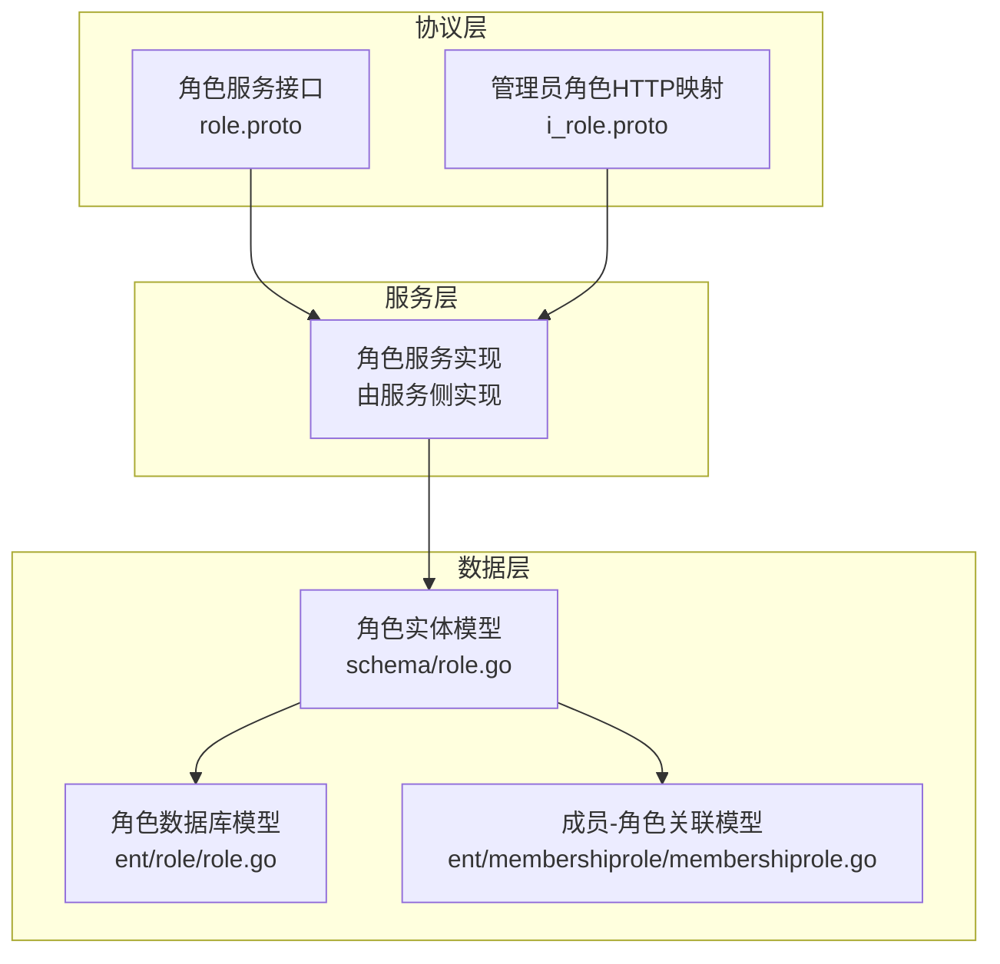
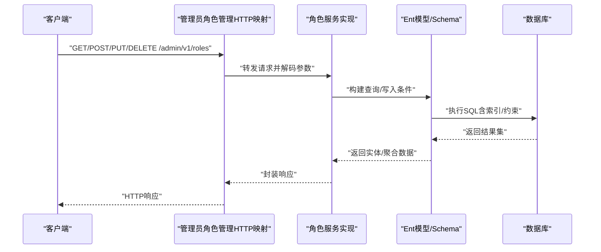
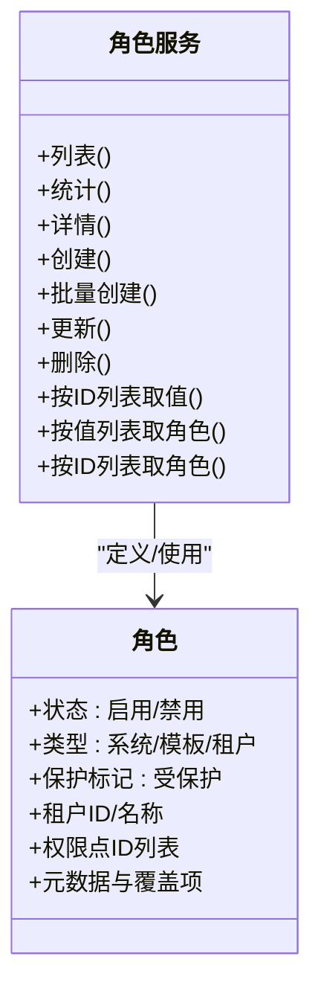
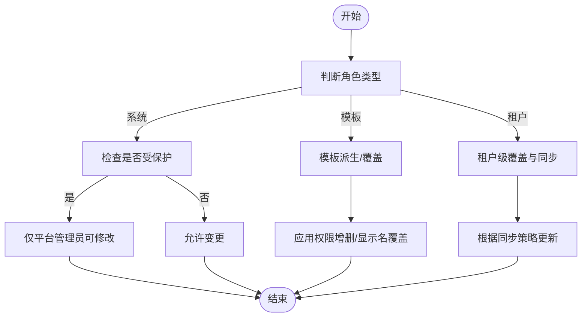
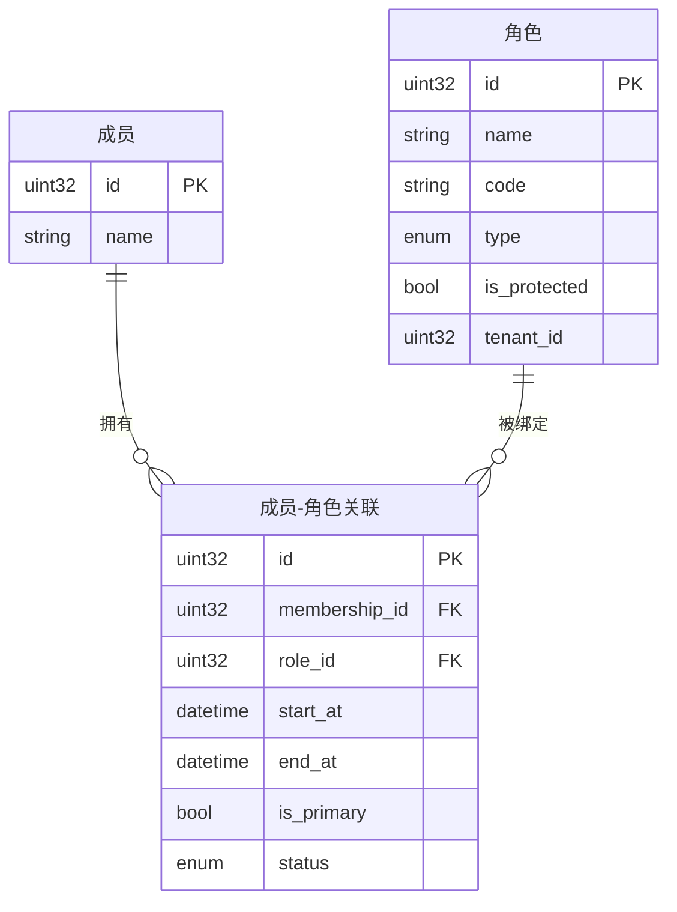
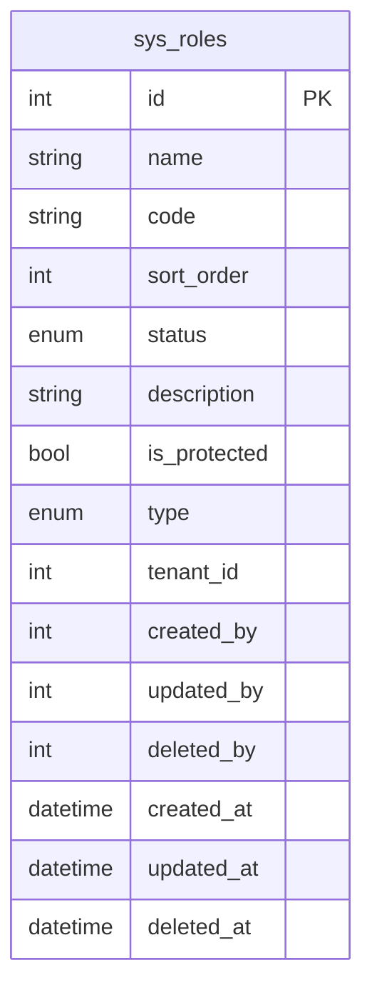
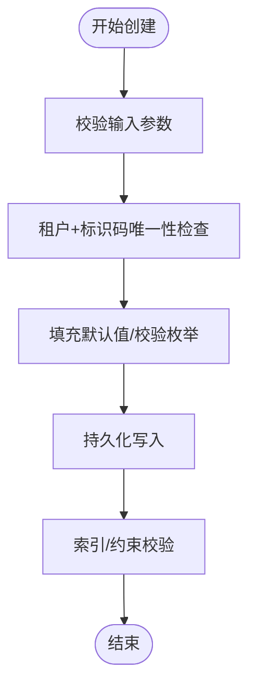
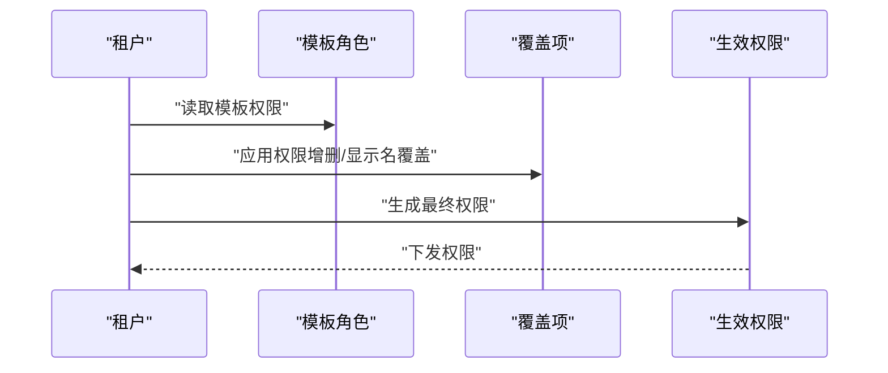
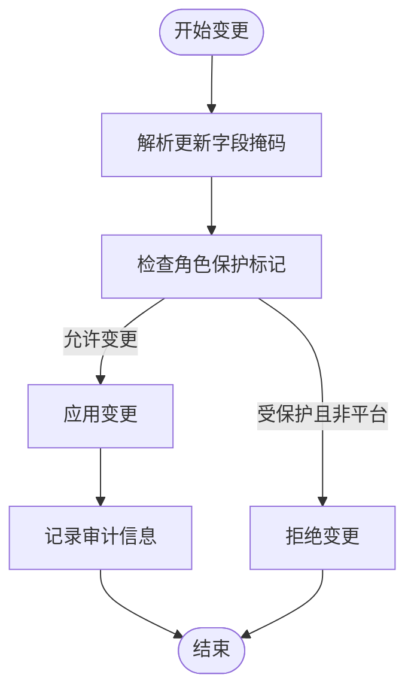
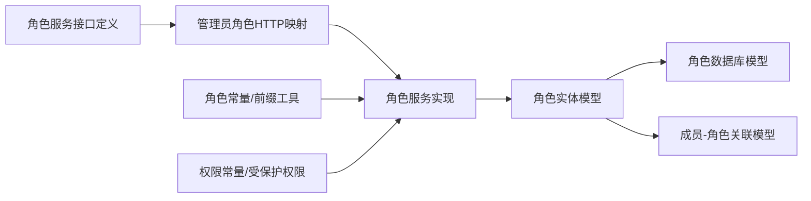

# 角色管理

<cite>
**本文引用的文件**
- [角色服务接口定义](file://backend/api/protos/permission/service/v1/role.proto)
- [管理员角色管理HTTP映射](file://backend/api/protos/admin/service/v1/i_role.proto)
- [角色实体定义（Ent Schema）](file://backend/app/admin/service/internal/data/ent/schema/role.go)
- [角色数据库模型（Ent 代码生成）](file://backend/app/admin/service/internal/data/ent/role/role.go)
- [角色查询条件构建（Ent 代码生成）](file://backend/app/admin/service/internal/data/ent/role/where.go)
- [成员-角色关联实体（Ent 代码生成）](file://backend/app/admin/service/internal/data/ent/membershiprole/membershiprole.go)
- [角色常量与前缀工具](file://backend/pkg/constants/role.go)
- [权限常量与受保护权限列表](file://backend/pkg/constants/permission.go)
</cite>

## 目录
1. [简介](#简介)
2. [项目结构](#项目结构)
3. [核心组件](#核心组件)
4. [架构总览](#架构总览)
5. [详细组件分析](#详细组件分析)
6. [依赖分析](#依赖分析)
7. [性能考虑](#性能考虑)
8. [故障排查指南](#故障排查指南)
9. [结论](#结论)
10. [附录](#附录)

## 简介
本文件系统性阐述角色管理功能的设计与实现，覆盖角色的创建、查询、更新、删除等核心操作；角色类型分类（系统角色、模板角色、租户角色）、角色状态管理与保护机制；角色与用户的关联关系、继承与权限传递；角色管理的数据模型设计（表结构、索引、约束）；业务流程（创建、权限分配、变更）；以及最佳实践（命名规范、权限最小化、审计与安全建议）。内容基于仓库中协议定义、实体模型与常量工具进行归纳总结。

## 项目结构
角色管理能力由“协议层-服务层-数据层”三层协同实现：
- 协议层：通过Protocol Buffers定义角色服务接口与消息体，统一RPC与HTTP映射。
- 服务层：在后端服务中实现角色服务接口，处理业务逻辑与鉴权。
- 数据层：使用Ent框架定义角色与成员-角色关联的实体模型，配套索引与约束，保障查询与一致性。

图表来源
- [角色服务接口定义:13-43](file://backend/api/protos/permission/service/v1/role.proto#L13-L43)
- [管理员角色管理HTTP映射:13-50](file://backend/api/protos/admin/service/v1/i_role.proto#L13-L50)
- [角色实体定义（Ent Schema）:14-115](file://backend/app/admin/service/internal/data/ent/schema/role.go#L14-L115)
- [角色数据库模型（Ent 代码生成）:12-49](file://backend/app/admin/service/internal/data/ent/role/role.go#L12-L49)
- [成员-角色关联实体（Ent 代码生成）:12-48](file://backend/app/admin/service/internal/data/ent/membershiprole/membershiprole.go#L12-L48)

章节来源
- [角色服务接口定义:1-372](file://backend/api/protos/permission/service/v1/role.proto#L1-L372)
- [管理员角色管理HTTP映射:1-51](file://backend/api/protos/admin/service/v1/i_role.proto#L1-L51)
- [角色实体定义（Ent Schema）:1-116](file://backend/app/admin/service/internal/data/ent/schema/role.go#L1-L116)
- [角色数据库模型（Ent 代码生成）:1-238](file://backend/app/admin/service/internal/data/ent/role/role.go#L1-L238)
- [成员-角色关联实体（Ent 代码生成）:1-207](file://backend/app/admin/service/internal/data/ent/membershiprole/membershiprole.go#L1-L207)

## 核心组件
- 角色服务接口：提供角色列表、统计、详情、创建、批量创建、更新、删除、按ID/值查询等能力。
- 角色消息体：包含角色状态、类型、保护标记、租户信息、权限点集合、元数据与覆盖项等。
- 角色实体模型：定义角色表结构、枚举类型、索引与约束，支持租户维度唯一性与多维查询。
- 成员-角色关联模型：记录用户/成员与角色的绑定关系、生效时间、主从关系与状态。
- 角色常量与前缀工具：提供角色代码前缀、默认角色代码与判断函数，支撑角色类型识别与模板转换。
- 权限常量与受保护权限：定义系统权限模块与受保护权限列表，作为角色保护与权限分配的依据。

章节来源
- [角色服务接口定义:13-43](file://backend/api/protos/permission/service/v1/role.proto#L13-L43)
- [角色实体定义（Ent Schema）:31-74](file://backend/app/admin/service/internal/data/ent/schema/role.go#L31-L74)
- [角色数据库模型（Ent 代码生成）:103-154](file://backend/app/admin/service/internal/data/ent/role/role.go#L103-L154)
- [成员-角色关联实体（Ent 代码生成）:97-123](file://backend/app/admin/service/internal/data/ent/membershiprole/membershiprole.go#L97-L123)
- [角色常量与前缀工具:3-49](file://backend/pkg/constants/role.go#L3-L49)
- [权限常量与受保护权限:3-39](file://backend/pkg/constants/permission.go#L3-L39)

## 架构总览
角色管理采用“协议即契约”的设计：前端或管理端通过HTTP调用管理员角色管理接口，后端服务解析请求、执行业务校验与授权，再通过数据层持久化到数据库。Ent模型确保数据一致性与高性能查询。

图表来源
- [管理员角色管理HTTP映射:15-49](file://backend/api/protos/admin/service/v1/i_role.proto#L15-L49)
- [角色服务接口定义:13-43](file://backend/api/protos/permission/service/v1/role.proto#L13-L43)
- [角色实体定义（Ent Schema）:77-115](file://backend/app/admin/service/internal/data/ent/schema/role.go#L77-L115)

## 详细组件分析

### 角色服务接口与消息体
- 服务方法：列表、统计、详情、创建、批量创建、更新、删除、按ID/值查询。
- 角色消息体：包含状态（启用/禁用）、类型（系统/模板/租户）、保护标记、租户ID/名称、权限点集合、元数据与覆盖项等。
- 角色覆盖项：支持租户对模板角色的权限增删、显示名/描述覆盖、安全策略覆盖（如强制MFA、IP白名单）。

图表来源
- [角色服务接口定义:13-43](file://backend/api/protos/permission/service/v1/role.proto#L13-L43)
- [角色服务接口定义:46-124](file://backend/api/protos/permission/service/v1/role.proto#L46-L124)

章节来源
- [角色服务接口定义:13-372](file://backend/api/protos/permission/service/v1/role.proto#L13-L372)

### 角色类型与保护机制
- 类型分类：系统角色、模板角色、租户角色。模板角色用于派生租户角色，支持租户级覆盖。
- 保护机制：角色可标记为“受保护”，通常仅平台管理员可修改；结合受保护权限列表，限制关键角色的变更。
- 角色代码前缀：平台、租户、模板三类前缀，便于识别与治理。

图表来源
- [角色服务接口定义:53-58](file://backend/api/protos/permission/service/v1/role.proto#L53-L58)
- [角色服务接口定义:93-96](file://backend/api/protos/permission/service/v1/role.proto#L93-L96)
- [角色服务接口定义:127-178](file://backend/api/protos/permission/service/v1/role.proto#L127-L178)
- [角色常量与前缀工具:3-49](file://backend/pkg/constants/role.go#L3-L49)
- [权限常量与受保护权限:31-39](file://backend/pkg/constants/permission.go#L31-L39)

章节来源
- [角色常量与前缀工具:3-49](file://backend/pkg/constants/role.go#L3-L49)
- [权限常量与受保护权限:3-39](file://backend/pkg/constants/permission.go#L3-L39)

### 角色与用户关联、继承与权限传递
- 关联模型：成员-角色关联记录成员与角色的绑定关系、生效时间、主从关系与状态。
- 继承与传递：模板角色提供基础权限与配置，租户可进行覆盖；最终权限为模板权限与租户覆盖的组合。
- 主角色优先：支持主角色优先策略，便于用户在多角色场景下的权限合并与优先级判定。

图表来源
- [成员-角色关联实体（Ent 代码生成）:12-48](file://backend/app/admin/service/internal/data/ent/membershiprole/membershiprole.go#L12-L48)
- [角色实体定义（Ent Schema）:31-59](file://backend/app/admin/service/internal/data/ent/schema/role.go#L31-L59)

章节来源
- [成员-角色关联实体（Ent 代码生成）:97-123](file://backend/app/admin/service/internal/data/ent/membershiprole/membershiprole.go#L97-L123)

### 数据模型设计（表结构、索引、约束）
- 角色表（sys_roles）：字段包含名称、标识码、排序、状态、描述、保护标记、类型、租户ID、操作人与时间戳等。
- 索引设计：
  - 租户+标识码唯一：保证同一租户下角色标识唯一。
  - 租户+名称、名称、标识码、租户ID、保护标记、状态、排序、创建时间等索引，优化多维查询与排序。
- 约束规则：枚举值校验（状态、类型）、默认值（类型=租户、状态=启用、排序等）。

图表来源
- [角色数据库模型（Ent 代码生成）:12-49](file://backend/app/admin/service/internal/data/ent/role/role.go#L12-L49)
- [角色实体定义（Ent Schema）:31-115](file://backend/app/admin/service/internal/data/ent/schema/role.go#L31-L115)

章节来源
- [角色数据库模型（Ent 代码生成）:103-154](file://backend/app/admin/service/internal/data/ent/role/role.go#L103-L154)
- [角色实体定义（Ent Schema）:77-115](file://backend/app/admin/service/internal/data/ent/schema/role.go#L77-L115)

### 业务流程

#### 角色创建流程
- 输入校验：名称、标识码、类型、租户ID、保护标记、初始权限点集合。
- 唯一性检查：同一租户下标识码唯一。
- 默认值填充：类型默认租户、状态默认启用、排序默认值等。
- 写入持久化：通过Ent模型写入数据库，触发索引与约束校验。
- 返回结果：返回空响应或创建成功后的角色标识。

图表来源
- [角色服务接口定义:294-296](file://backend/api/protos/permission/service/v1/role.proto#L294-L296)
- [角色实体定义（Ent Schema）:31-59](file://backend/app/admin/service/internal/data/ent/schema/role.go#L31-L59)
- [角色实体定义（Ent Schema）:77-115](file://backend/app/admin/service/internal/data/ent/schema/role.go#L77-L115)

章节来源
- [角色服务接口定义:294-296](file://backend/api/protos/permission/service/v1/role.proto#L294-L296)
- [角色实体定义（Ent Schema）:31-115](file://backend/app/admin/service/internal/data/ent/schema/role.go#L31-L115)

#### 权限分配流程
- 模板角色：定义通用权限与配置。
- 租户覆盖：通过覆盖项对模板进行权限增删、显示名/描述覆盖、安全策略覆盖。
- 生效策略：根据同步策略（自动/手动/阻止）决定是否同步至租户实例。

图表来源
- [角色服务接口定义:127-178](file://backend/api/protos/permission/service/v1/role.proto#L127-L178)
- [角色服务接口定义:180-257](file://backend/api/protos/permission/service/v1/role.proto#L180-L257)

章节来源
- [角色服务接口定义:127-257](file://backend/api/protos/permission/service/v1/role.proto#L127-L257)

#### 角色变更流程
- 变更请求：携带更新字段掩码与允许缺失策略（用于插入/更新一体化）。
- 权限校验：若角色受保护，仅平台管理员可变更。
- 冲突处理：变更可能影响成员权限，需评估生效策略与同步策略。
- 记录审计：创建/更新/删除均记录操作人与时间戳。

图表来源
- [角色服务接口定义:299-316](file://backend/api/protos/permission/service/v1/role.proto#L299-L316)
- [角色服务接口定义:93-96](file://backend/api/protos/permission/service/v1/role.proto#L93-L96)
- [角色数据库模型（Ent 代码生成）:86-101](file://backend/app/admin/service/internal/data/ent/role/role.go#L86-L101)

章节来源
- [角色服务接口定义:299-316](file://backend/api/protos/permission/service/v1/role.proto#L299-L316)
- [角色数据库模型（Ent 代码生成）:86-101](file://backend/app/admin/service/internal/data/ent/role/role.go#L86-L101)

## 依赖分析
- 协议依赖：管理员角色管理HTTP映射依赖角色服务接口定义，确保REST与RPC一致。
- 实体依赖：角色实体模型依赖Ent Mixin（自增ID、时间戳、操作人、描述、排序、租户ID、开关状态等），并通过索引优化查询。
- 常量依赖：角色常量与前缀工具为角色类型识别与模板转换提供基础；权限常量与受保护权限列表为角色保护与权限分配提供依据。

图表来源
- [管理员角色管理HTTP映射:10-10](file://backend/api/protos/admin/service/v1/i_role.proto#L10-L10)
- [角色服务接口定义:10-10](file://backend/api/protos/permission/service/v1/role.proto#L10-L10)
- [角色实体定义（Ent Schema）:63-73](file://backend/app/admin/service/internal/data/ent/schema/role.go#L63-L73)
- [角色常量与前缀工具:3-49](file://backend/pkg/constants/role.go#L3-L49)
- [权限常量与受保护权限:3-39](file://backend/pkg/constants/permission.go#L3-L39)

章节来源
- [管理员角色管理HTTP映射:1-51](file://backend/api/protos/admin/service/v1/i_role.proto#L1-L51)
- [角色服务接口定义:1-372](file://backend/api/protos/permission/service/v1/role.proto#L1-L372)
- [角色实体定义（Ent Schema）:1-116](file://backend/app/admin/service/internal/data/ent/schema/role.go#L1-L116)
- [角色常量与前缀工具:1-49](file://backend/pkg/constants/role.go#L1-L49)
- [权限常量与受保护权限:1-39](file://backend/pkg/constants/permission.go#L1-L39)

## 性能考虑
- 索引优化：针对租户维度唯一性、名称/标识码/状态/保护标记/排序/创建时间等高频查询建立索引，降低查询成本。
- 枚举与默认值：通过枚举与默认值减少存储冗余与校验开销。
- 分页与字段掩码：列表与详情接口支持分页与字段掩码，避免过度传输与渲染压力。
- 批量创建：提供批量创建接口，减少网络往返与事务开销。

章节来源
- [角色实体定义（Ent Schema）:77-115](file://backend/app/admin/service/internal/data/ent/schema/role.go#L77-L115)
- [角色服务接口定义:14-18](file://backend/api/protos/permission/service/v1/role.proto#L14-L18)
- [角色服务接口定义:260-291](file://backend/api/protos/permission/service/v1/role.proto#L260-L291)
- [角色服务接口定义:328-338](file://backend/api/protos/permission/service/v1/role.proto#L328-L338)

## 故障排查指南
- 唯一性冲突：同一租户下标识码重复导致创建/更新失败，检查租户ID与标识码组合。
- 受保护角色：对受保护角色的修改被拒绝，确认操作者是否具备平台管理员权限。
- 枚举非法：状态或类型枚举值不合法，检查枚举定义与传参。
- 查询性能差：确认是否命中预期索引，必要时调整查询条件或添加复合索引。
- 审计追踪：通过创建/更新/删除时间戳与操作人字段定位问题责任人。

章节来源
- [角色实体定义（Ent Schema）:77-115](file://backend/app/admin/service/internal/data/ent/schema/role.go#L77-L115)
- [角色数据库模型（Ent 代码生成）:103-154](file://backend/app/admin/service/internal/data/ent/role/role.go#L103-L154)
- [角色查询条件构建（Ent 代码生成）:622-690](file://backend/app/admin/service/internal/data/ent/role/where.go#L622-L690)

## 结论
角色管理以协议为契约、以Ent模型为基石，实现了角色类型分类、保护机制、与用户关联、模板继承与权限覆盖的完整闭环。通过完善的索引与约束、分页与字段掩码、以及受保护权限与角色保护策略，兼顾了可用性、性能与安全性。遵循本文最佳实践，可有效降低角色治理风险，提升系统的可维护性与可审计性。

## 附录

### 最佳实践
- 角色命名规范
  - 使用清晰语义的标识码，避免歧义；模板角色与租户角色采用不同前缀区分。
  - 遵循“模块:职责”的命名风格，便于权限归类与检索。
- 权限最小化原则
  - 优先使用模板角色承载通用权限，租户仅做必要覆盖；避免直接授予过多权限。
  - 对关键系统权限（如平台管理员、租户管理、审计日志）保持最小可用集。
- 角色审计
  - 严格记录角色创建、更新、删除的审计信息（操作人、时间、字段变更）。
  - 对受保护角色的变更进行二次审批或日志强化。
- 同步与回滚
  - 明确模板到租户的同步策略（自动/手动/阻止），并制定回滚预案。
- 索引与查询
  - 针对高频查询（租户+标识码、名称、状态、保护标记）优化索引，定期评估查询计划。

章节来源
- [角色常量与前缀工具:3-49](file://backend/pkg/constants/role.go#L3-L49)
- [权限常量与受保护权限:31-39](file://backend/pkg/constants/permission.go#L31-L39)
- [角色实体定义（Ent Schema）:77-115](file://backend/app/admin/service/internal/data/ent/schema/role.go#L77-L115)