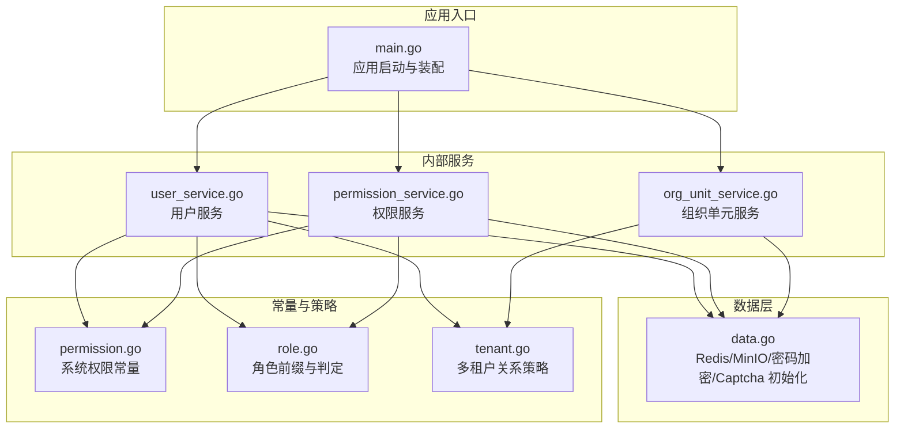
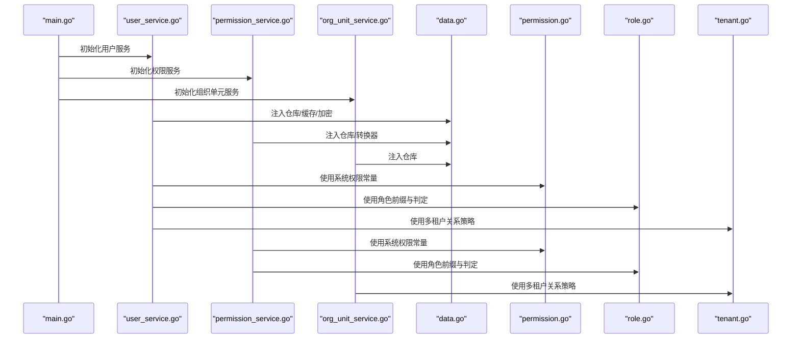
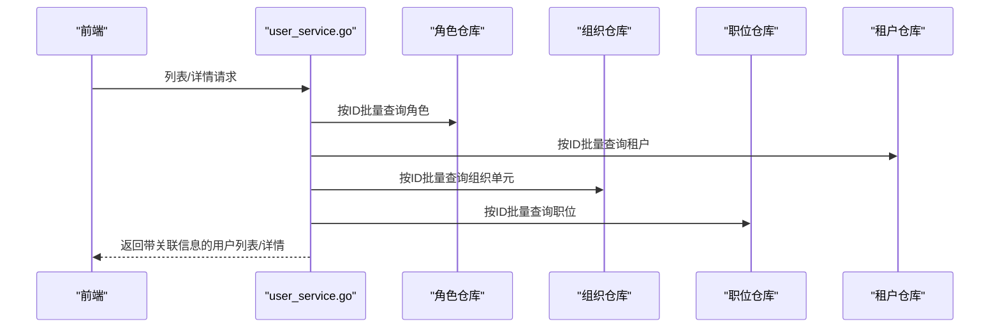
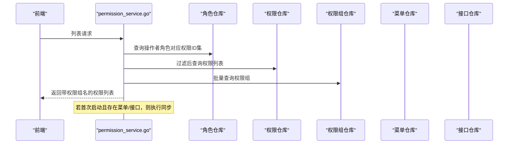
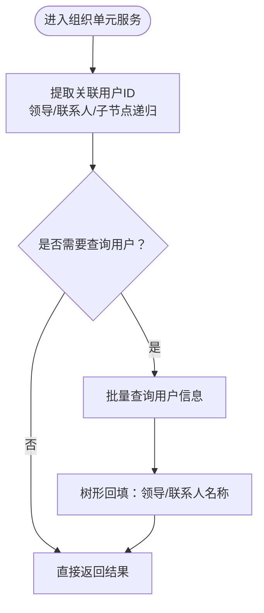
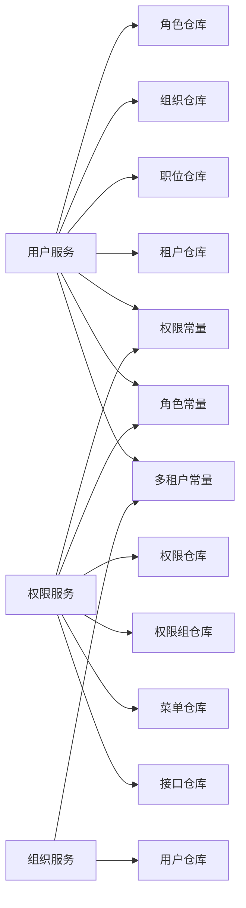

# 核心功能模块

<cite>
**本文引用的文件**
- [main.go](file://backend/app/admin/service/cmd/server/main.go)
- [permission.go](file://backend/pkg/constants/permission.go)
- [role.go](file://backend/pkg/constants/role.go)
- [tenant.go](file://backend/pkg/constants/tenant.go)
- [data.go](file://backend/app/admin/service/internal/data/data.go)
- [user_service.go](file://backend/app/admin/service/internal/service/user_service.go)
- [permission_service.go](file://backend/app/admin/service/internal/service/permission_service.go)
- [org_unit_service.go](file://backend/app/admin/service/internal/service/org_unit_service.go)
</cite>

## 目录
1. [简介](#简介)
2. [项目结构](#项目结构)
3. [核心组件](#核心组件)
4. [架构总览](#架构总览)
5. [详细组件分析](#详细组件分析)
6. [依赖分析](#依赖分析)
7. [性能考虑](#性能考虑)
8. [故障排查指南](#故障排查指南)
9. [结论](#结论)
10. [附录](#附录)

## 简介
本文件面向 GoWind Admin 后端 Admin Service 的核心功能模块，围绕“用户身份管理、组织架构管理、系统功能管理、数据管理功能、审计监控功能”五大模块进行系统化梳理。重点阐释以下方面：
- RBAC 权限模型：用户、角色、权限、资源的管理与联动
- 组织架构树形结构：租户、部门、职位的层级关系与回填策略
- 系统配置管理：菜单、接口、字典的维护与同步
- 数据模型与 API 接口：基于 protobuf 生成的服务契约
- 前端实现要点：与后端服务的对接方式与最佳实践

## 项目结构
Admin Service 作为 Kratos 应用入口，负责装配各领域服务与基础设施，并通过 HTTP、异步队列、SSE 等多种传输协议对外提供能力。

**图表来源**
- [main.go:1-76](file://backend/app/admin/service/cmd/server/main.go#L1-L76)
- [data.go:1-63](file://backend/app/admin/service/internal/data/data.go#L1-L63)
- [user_service.go:1-200](file://backend/app/admin/service/internal/service/user_service.go#L1-L200)
- [permission_service.go:1-200](file://backend/app/admin/service/internal/service/permission_service.go#L1-L200)
- [org_unit_service.go:1-200](file://backend/app/admin/service/internal/service/org_unit_service.go#L1-L200)
- [permission.go:1-39](file://backend/pkg/constants/permission.go#L1-L39)
- [role.go:1-49](file://backend/pkg/constants/role.go#L1-L49)
- [tenant.go:1-25](file://backend/pkg/constants/tenant.go#L1-L25)

**章节来源**
- [main.go:1-76](file://backend/app/admin/service/cmd/server/main.go#L1-L76)
- [data.go:1-63](file://backend/app/admin/service/internal/data/data.go#L1-L63)

## 核心组件
- 用户身份管理：提供用户 CRUD、凭证管理、角色/组织/职位关联、默认用户初始化等能力
- 权限系统：统一管理权限、权限组、菜单与接口资源，支持权限同步与租户级访问限制
- 组织架构：以树形结构管理租户下的部门、职位，支持领导与联系人回填
- 数据管理：集成 Redis 缓存、MinIO 对象存储、密码加密与验证码服务
- 审计监控：通过权限服务初始化时触发默认权限与同步流程，为审计留痕奠定基础

**章节来源**
- [user_service.go:1-200](file://backend/app/admin/service/internal/service/user_service.go#L1-L200)
- [permission_service.go:1-200](file://backend/app/admin/service/internal/service/permission_service.go#L1-L200)
- [org_unit_service.go:1-200](file://backend/app/admin/service/internal/service/org_unit_service.go#L1-L200)
- [data.go:1-63](file://backend/app/admin/service/internal/data/data.go#L1-L63)

## 架构总览
下图展示 Admin Service 的核心交互：应用入口装配服务与数据层，服务层调用仓库层完成业务处理，并通过常量与工具层实现权限、角色与多租户策略。

**图表来源**
- [main.go:1-76](file://backend/app/admin/service/cmd/server/main.go#L1-L76)
- [user_service.go:1-200](file://backend/app/admin/service/internal/service/user_service.go#L1-L200)
- [permission_service.go:1-200](file://backend/app/admin/service/internal/service/permission_service.go#L1-L200)
- [org_unit_service.go:1-200](file://backend/app/admin/service/internal/service/org_unit_service.go#L1-L200)
- [data.go:1-63](file://backend/app/admin/service/internal/data/data.go#L1-L63)
- [permission.go:1-39](file://backend/pkg/constants/permission.go#L1-L39)
- [role.go:1-49](file://backend/pkg/constants/role.go#L1-L49)
- [tenant.go:1-25](file://backend/pkg/constants/tenant.go#L1-L25)

## 详细组件分析

### 用户身份管理模块
- 职责边界
  - 用户 CRUD、默认用户初始化、租户/角色/组织/职位关联查询与回填
  - 凭证与安全：密码加密、验证码、登录策略（由认证服务支撑）
- 关键流程
  - 首次启动检查用户数量，若为空则创建默认用户
  - 列表/详情时按需提取并回填角色、租户、组织单元、职位信息
- 数据模型与 API
  - 用户实体与关联字段：租户 ID、主部门/兼职部门、主职位/兼职职位、角色集合
  - API：分页列表、计数、详情、创建、更新（含更新掩码）
- 最佳实践
  - 使用更新掩码精确控制字段变更
  - 在多租户模式下，确保用户与租户关系符合配置策略
  - 对敏感字段（如凭证）仅在必要时读写，避免泄露

**图表来源**
- [user_service.go:70-200](file://backend/app/admin/service/internal/service/user_service.go#L70-L200)

**章节来源**
- [user_service.go:1-200](file://backend/app/admin/service/internal/service/user_service.go#L1-L200)

### 权限系统模块（RBAC）
- 职责边界
  - 权限与权限组的增删改查、列表与计数
  - 菜单与接口资源的权限映射与同步
  - 基于角色的权限继承与租户级访问限制
- 关键流程
  - 首次启动检测权限与资源存量，若存在则自动同步默认权限
  - 列表时根据当前操作者所在租户的角色集合，过滤可访问的权限集
  - 关联信息回填：权限所属权限组名称
- 数据模型与 API
  - 权限实体：包含模块、组、编码、名称、描述等
  - 权限组实体：用于归类权限
  - 资源实体：菜单与接口，通过转换器映射到权限
- 最佳实践
  - 使用受保护的系统权限代码，避免误删
  - 为平台/租户角色设置清晰的前缀与判定规则
  - 同步流程应幂等，避免重复创建

**图表来源**
- [permission_service.go:76-200](file://backend/app/admin/service/internal/service/permission_service.go#L76-L200)

**章节来源**
- [permission_service.go:1-200](file://backend/app/admin/service/internal/service/permission_service.go#L1-L200)
- [permission.go:1-39](file://backend/pkg/constants/permission.go#L1-L39)
- [role.go:1-49](file://backend/pkg/constants/role.go#L1-L49)

### 组织架构管理模块（树形结构）
- 职责边界
  - 组织单元的树形结构管理：父子关系、领导与联系人、层级遍历
  - 领导与联系人回填：将用户 ID 回填为用户名
- 关键流程
  - 列表/详情时递归提取子节点关联用户 ID，批量查询后回填名称
  - 创建/更新时记录创建者/更新者
- 数据模型与 API
  - 组织单元实体：包含父节点、子节点数组、领导、联系人等
  - API：分页列表、计数、详情、创建、更新
- 最佳实践
  - 树形遍历时注意深度与性能，避免过深层级导致查询膨胀
  - 更新掩码中显式包含更新者字段，确保审计可追溯

**图表来源**
- [org_unit_service.go:42-130](file://backend/app/admin/service/internal/service/org_unit_service.go#L42-L130)

**章节来源**
- [org_unit_service.go:1-200](file://backend/app/admin/service/internal/service/org_unit_service.go#L1-L200)
- [tenant.go:1-25](file://backend/pkg/constants/tenant.go#L1-L25)

### 数据管理功能模块（缓存、对象存储、安全）
- Redis 缓存：验证码、会话等
- MinIO 对象存储：文件上传/下载/删除
- 密码加密：BCRYPT
- Captcha：图形验证码生成与校验
- 最佳实践
  - 验证码有效期与键前缀需结合项目名统一管理
  - 文件存储路径与访问策略需与前端路由一致

**章节来源**
- [data.go:1-63](file://backend/app/admin/service/internal/data/data.go#L1-L63)

### 审计监控功能模块（基于权限初始化）
- 权限服务在首次启动时检测默认权限与资源，若存在则执行同步，为后续审计留痕提供基础
- 建议配合独立审计服务或日志采集链路，实现登录、操作、数据访问等审计事件的持久化与检索

**章节来源**
- [permission_service.go:76-90](file://backend/app/admin/service/internal/service/permission_service.go#L76-L90)

## 依赖分析
- 服务间耦合
  - 用户服务依赖角色、组织、职位、租户仓库，以及权限常量与角色判定
  - 权限服务依赖权限组、菜单、接口仓库，以及权限常量与角色判定
  - 组织服务依赖用户仓库与多租户策略
- 外部依赖
  - Redis：验证码与会话
  - MinIO：文件存储
  - Kratos 生态：HTTP、异步队列、SSE、日志与配置加载
- 循环依赖
  - 当前模块划分清晰，未见循环依赖迹象

**图表来源**
- [user_service.go:28-68](file://backend/app/admin/service/internal/service/user_service.go#L28-L68)
- [permission_service.go:31-74](file://backend/app/admin/service/internal/service/permission_service.go#L31-L74)
- [org_unit_service.go:21-40](file://backend/app/admin/service/internal/service/org_unit_service.go#L21-L40)
- [permission.go:1-39](file://backend/pkg/constants/permission.go#L1-L39)
- [role.go:1-49](file://backend/pkg/constants/role.go#L1-L49)
- [tenant.go:1-25](file://backend/pkg/constants/tenant.go#L1-L25)

**章节来源**
- [user_service.go:28-68](file://backend/app/admin/service/internal/service/user_service.go#L28-L68)
- [permission_service.go:31-74](file://backend/app/admin/service/internal/service/permission_service.go#L31-L74)
- [org_unit_service.go:21-40](file://backend/app/admin/service/internal/service/org_unit_service.go#L21-L40)

## 性能考虑
- 批量查询与回填
  - 用户/组织/权限等列表场景，优先使用批量查询减少 N+1 查询
  - 树形结构回填采用递归提取与批量查询相结合的方式
- 缓存策略
  - 验证码与热点数据放入 Redis，合理设置过期时间
- 幂等性
  - 权限同步与默认用户创建需具备幂等特性，避免重复初始化
- 分页与过滤
  - 列表接口使用分页请求，结合租户级权限过滤，降低无效数据传输

## 故障排查指南
- 默认用户未创建
  - 现象：首次启动后无用户
  - 排查：确认用户仓库计数逻辑与默认用户初始化流程
  - 参考：[user_service.go:70-76](file://backend/app/admin/service/internal/service/user_service.go#L70-L76)
- 权限列表为空
  - 现象：租户模式下权限列表为空
  - 排查：确认操作者角色是否映射到有效权限 ID 集
  - 参考：[permission_service.go:158-172](file://backend/app/admin/service/internal/service/permission_service.go#L158-L172)
- 组织树回填失败
  - 现象：领导/联系人名称为空
  - 排查：确认用户 ID 是否正确提取与批量查询成功
  - 参考：[org_unit_service.go:121-129](file://backend/app/admin/service/internal/service/org_unit_service.go#L121-L129)
- 缓存/存储异常
  - 现象：验证码失败、文件上传失败
  - 排查：检查 Redis 连接与 MinIO 配置、密钥与桶权限
  - 参考：[data.go:23-62](file://backend/app/admin/service/internal/data/data.go#L23-L62)

**章节来源**
- [user_service.go:70-76](file://backend/app/admin/service/internal/service/user_service.go#L70-L76)
- [permission_service.go:158-172](file://backend/app/admin/service/internal/service/permission_service.go#L158-L172)
- [org_unit_service.go:121-129](file://backend/app/admin/service/internal/service/org_unit_service.go#L121-L129)
- [data.go:23-62](file://backend/app/admin/service/internal/data/data.go#L23-L62)

## 结论
GoWind Admin 的核心功能模块以清晰的职责划分与强约束的常量策略为基础，结合 RBAC 权限模型与树形组织架构，提供了稳定可扩展的后台管理能力。通过批量查询、回填与幂等初始化等手段，兼顾了性能与可靠性。建议在生产环境中进一步完善审计链路与前端对接规范，确保权限与组织数据的一致性与可追溯性。

## 附录
- 前端对接建议
  - 用户管理：使用分页与更新掩码，避免全量覆盖
  - 权限管理：先拉取权限组，再拉取权限列表并回填组名
  - 组织管理：树形渲染时使用懒加载与本地展开状态
- 配置与部署
  - Redis 与 MinIO 配置需与后端初始化参数一致
  - 权限同步与默认用户初始化在首次启动时自动完成