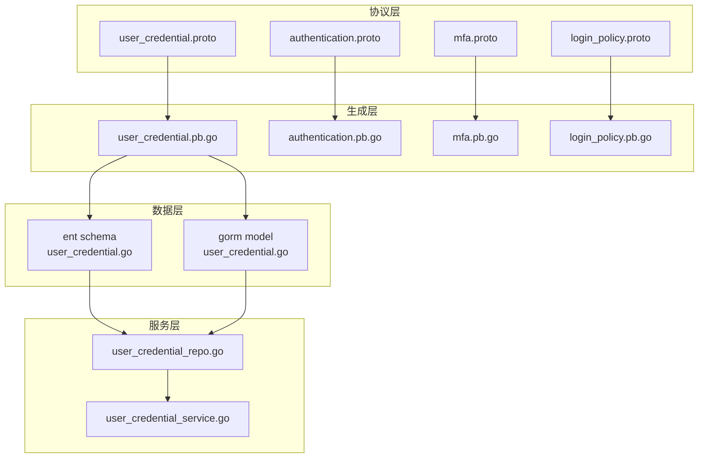
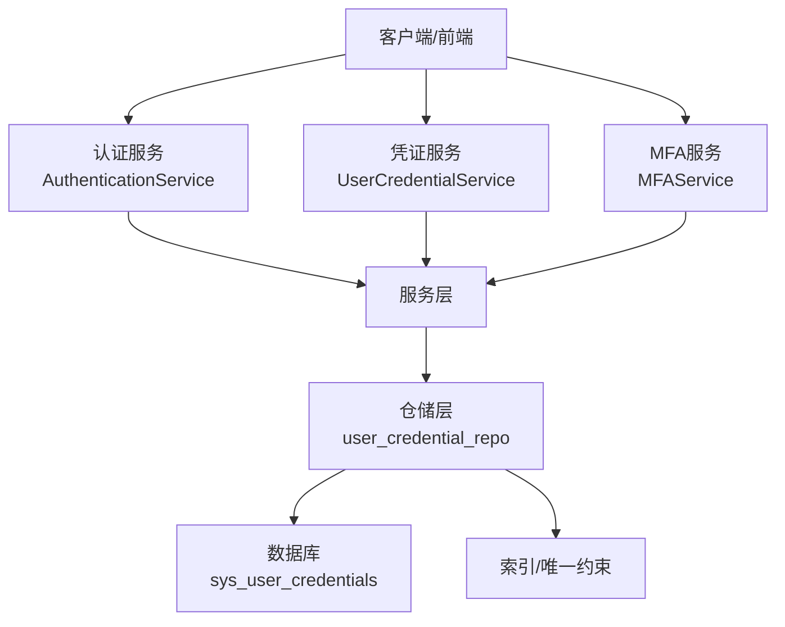
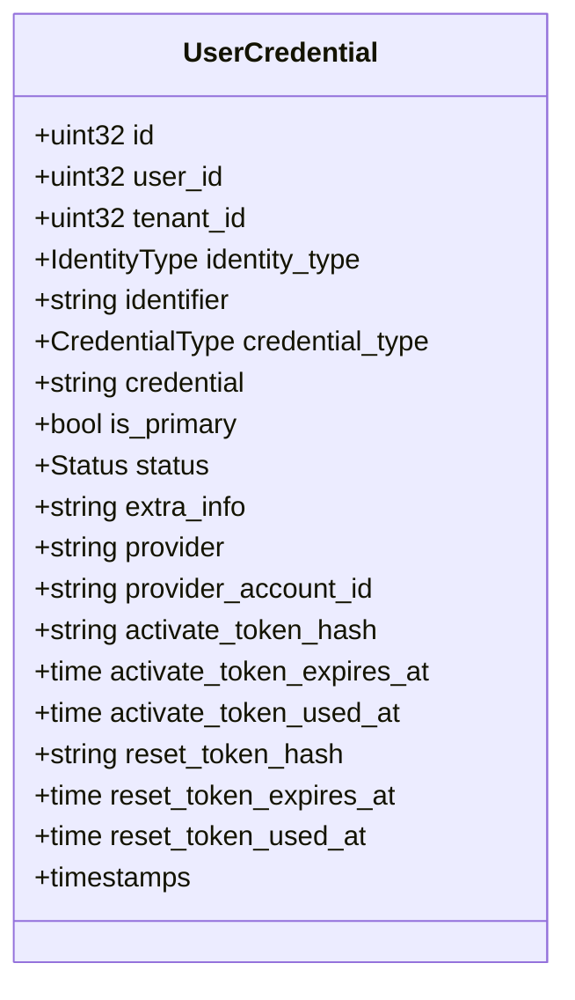
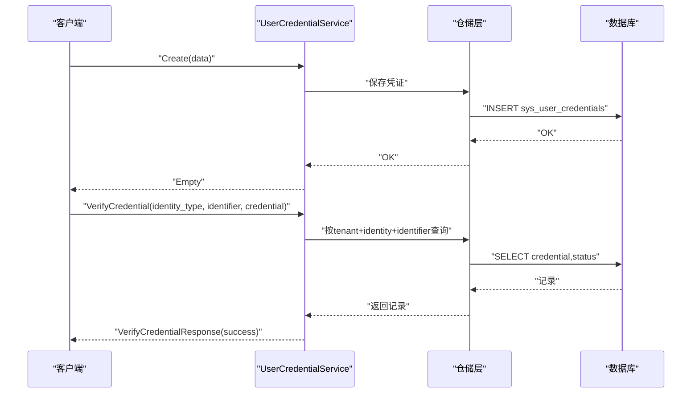
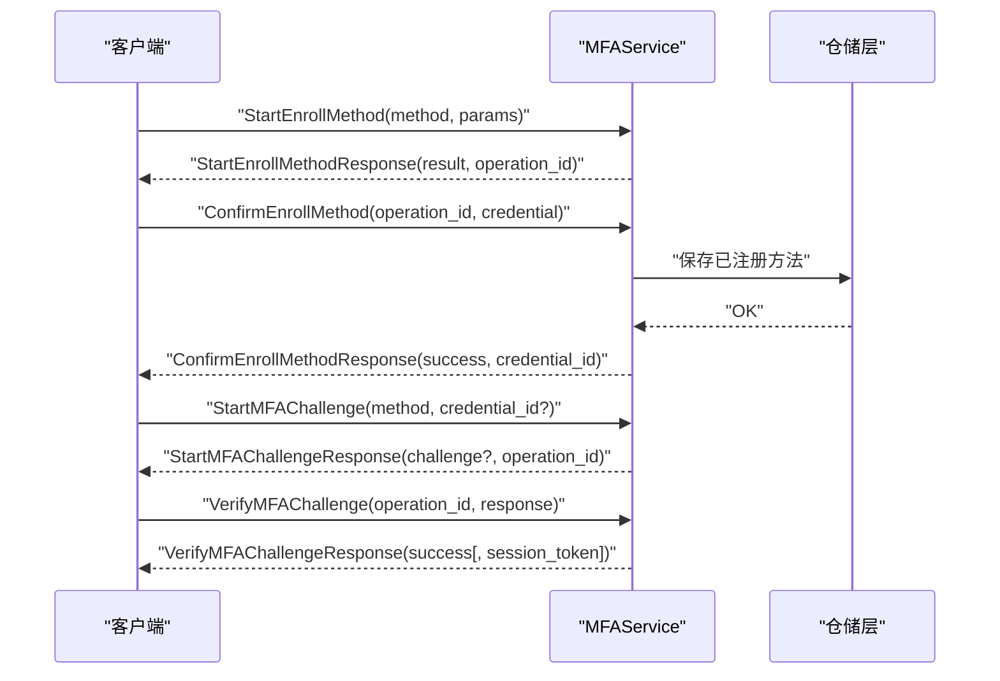
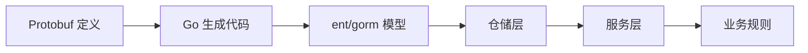

# 用户凭证管理

<cite>
**本文档引用的文件**
- [user_credential.proto](file://backend/api/protos/authentication/service/v1/user_credential.proto)
- [authentication.proto](file://backend/api/protos/authentication/service/v1/authentication.proto)
- [mfa.proto](file://backend/api/protos/authentication/service/v1/mfa.proto)
- [login_policy.proto](file://backend/api/protos/authentication/service/v1/login_policy.proto)
- [user_credential.pb.go](file://backend/api/gen/go/authentication/service/v1/user_credential.pb.go)
- [authentication.pb.go](file://backend/api/gen/go/authentication/service/v1/authentication.pb.go)
- [mfa.pb.go](file://backend/api/gen/go/authentication/service/v1/mfa.pb.go)
- [login_policy.pb.go](file://backend/api/gen/go/authentication/service/v1/login_policy.pb.go)
- [user_credential.go（ent schema）](file://backend/app/admin/service/internal/data/ent/schema/user_credential.go)
- [user_credential.go（gorm model）](file://backend/app/admin/service/internal/data/gorm/models/user_credential.go)
- [user_credential_repo.go](file://backend/app/admin/service/internal/data/user_credential_repo.go)
- [user_credential_service.go](file://backend/app/admin/service/internal/service/user_credential_service.go)
</cite>

## 目录
1. [简介](#简介)
2. [项目结构](#项目结构)
3. [核心组件](#核心组件)
4. [架构总览](#架构总览)
5. [详细组件分析](#详细组件分析)
6. [依赖分析](#依赖分析)
7. [性能考虑](#性能考虑)
8. [故障排查指南](#故障排查指南)
9. [结论](#结论)
10. [附录](#附录)

## 简介
本文件系统化梳理用户凭证管理能力，覆盖凭证的创建、验证、修改、重置、删除等全生命周期；详述密码管理机制（加密存储、强度校验、过期策略、历史记录）、多身份认证方式（用户名/邮箱/手机号/第三方）、凭证状态管理（启用/禁用/锁定/过期/临时）、多因素认证（MFA）集成方案与配置、密码重置流程、安全审计与异常登录检测，并给出API接口使用要点与安全最佳实践。

## 项目结构
围绕用户凭证管理的核心文件组织如下：
- 协议层（Protobuf）：定义凭证实体、认证服务、MFA服务、登录策略等接口契约
- 生成层（Go Protobuf）：基于协议生成的RPC与消息体定义
- 数据层（ent/gorm）：用户凭证实体映射与索引设计
- 仓储与服务层：凭证业务逻辑封装与对外服务暴露

图表来源
- [user_credential.proto:1-325](file://backend/api/protos/authentication/service/v1/user_credential.proto#L1-L325)
- [authentication.proto:1-551](file://backend/api/protos/authentication/service/v1/authentication.proto#L1-L551)
- [mfa.proto:1-227](file://backend/api/protos/authentication/service/v1/mfa.proto#L1-L227)
- [login_policy.proto:1-826](file://backend/api/protos/authentication/service/v1/login_policy.proto#L1-L826)
- [user_credential.go（ent schema）:1-234](file://backend/app/admin/service/internal/data/ent/schema/user_credential.go#L1-L234)
- [user_credential.go（gorm model）:1-39](file://backend/app/admin/service/internal/data/gorm/models/user_credential.go#L1-L39)
- [user_credential_repo.go](file://backend/app/admin/service/internal/data/user_credential_repo.go)
- [user_credential_service.go](file://backend/app/admin/service/internal/service/user_credential_service.go)

章节来源
- [user_credential.proto:1-325](file://backend/api/protos/authentication/service/v1/user_credential.proto#L1-L325)
- [authentication.proto:1-551](file://backend/api/protos/authentication/service/v1/authentication.proto#L1-L551)
- [mfa.proto:1-227](file://backend/api/protos/authentication/service/v1/mfa.proto#L1-L227)
- [login_policy.proto:1-826](file://backend/api/protos/authentication/service/v1/login_policy.proto#L1-L826)

## 核心组件
- 用户凭证实体：统一承载身份类型、凭证类型、状态、第三方平台信息、激活/重置令牌等字段
- 凭证服务：提供查询、创建、更新、删除、验证、变更、重置等能力
- 认证服务：登录、登出、令牌校验、令牌拉黑/解封、WhoAmI、验证码等
- MFA服务：MFA状态查询、已注册方法列表、开始/确认注册、挑战/验证、备份码管理、撤销设备
- 登录策略：基于IP/MAC/地区/时间/设备的黑白名单策略
- 数据模型：ent与gorm双栈映射，确保索引与唯一约束满足业务需求

章节来源
- [user_credential.pb.go:294-464](file://backend/api/gen/go/authentication/service/v1/user_credential.pb.go#L294-L464)
- [authentication.pb.go:231-718](file://backend/api/gen/go/authentication/service/v1/authentication.pb.go#L231-L718)
- [mfa.pb.go:142-245](file://backend/api/gen/go/authentication/service/v1/mfa.pb.go#L142-L245)
- [login_policy.pb.go:140-286](file://backend/api/gen/go/authentication/service/v1/login_policy.pb.go#L140-L286)
- [user_credential.go（ent schema）:32-233](file://backend/app/admin/service/internal/data/ent/schema/user_credential.go#L32-L233)
- [user_credential.go（gorm model）:11-39](file://backend/app/admin/service/internal/data/gorm/models/user_credential.go#L11-L39)

## 架构总览
用户凭证管理采用分层架构：
- 协议层：定义清晰的RPC接口与消息体，支撑跨语言/跨进程交互
- 生成层：自动代码生成，保证接口一致性与类型安全
- 数据层：双栈ORM映射，兼顾性能与可维护性
- 服务层：封装业务规则，协调仓储与外部依赖

图表来源
- [authentication.proto:21-60](file://backend/api/protos/authentication/service/v1/authentication.proto#L21-L60)
- [user_credential.proto:14-43](file://backend/api/protos/authentication/service/v1/user_credential.proto#L14-L43)
- [mfa.proto:12-42](file://backend/api/protos/authentication/service/v1/mfa.proto#L12-L42)
- [user_credential.go（ent schema）:195-233](file://backend/app/admin/service/internal/data/ent/schema/user_credential.go#L195-L233)

## 详细组件分析

### 用户凭证实体与状态
- 身份类型：用户名、用户ID、邮箱、手机号、社交OAuth、企业SSO、API Key、设备ID、自定义等
- 凭证类型：密码哈希、API Key/Secret、访问/刷新令牌/JWT、OAuth令牌、一次性密码（含TOTP/SMS/Email）、硬件/软件令牌、生物识别、SSO断言、会话Cookie、临时凭证、自定义等
- 状态：禁用、启用、过期、未验证、已删除、锁定、临时
- 扩展字段：第三方平台标识与账号ID、激活/重置令牌哈希与到期时间、额外JSON信息

图表来源
- [user_credential.pb.go:294-464](file://backend/api/gen/go/authentication/service/v1/user_credential.pb.go#L294-L464)
- [user_credential.go（ent schema）:32-182](file://backend/app/admin/service/internal/data/ent/schema/user_credential.go#L32-L182)
- [user_credential.go（gorm model）:11-33](file://backend/app/admin/service/internal/data/gorm/models/user_credential.go#L11-L33)

章节来源
- [user_credential.pb.go:29-291](file://backend/api/gen/go/authentication/service/v1/user_credential.pb.go#L29-L291)
- [user_credential.go（ent schema）:39-130](file://backend/app/admin/service/internal/data/ent/schema/user_credential.go#L39-L130)
- [user_credential.go（gorm model）:15-29](file://backend/app/admin/service/internal/data/gorm/models/user_credential.go#L15-L29)

### 凭证生命周期与API
- 查询：按ID、按标识符查询；支持字段视图过滤
- 创建：创建新的用户凭证
- 更新：支持字段选择性更新
- 删除：按ID删除
- 验证：按身份类型+标识符+凭证进行验证
- 变更：修改凭证（旧凭证校验）
- 重置：重置凭证（新凭证）

图表来源
- [user_credential.proto:14-43](file://backend/api/protos/authentication/service/v1/user_credential.proto#L14-L43)
- [user_credential.pb.go:588-631](file://backend/api/gen/go/authentication/service/v1/user_credential.pb.go#L588-L631)
- [user_credential.go（ent schema）:195-233](file://backend/app/admin/service/internal/data/ent/schema/user_credential.go#L195-L233)

章节来源
- [user_credential.proto:14-43](file://backend/api/protos/authentication/service/v1/user_credential.proto#L14-L43)
- [user_credential.pb.go:588-631](file://backend/api/gen/go/authentication/service/v1/user_credential.pb.go#L588-L631)

### 密码管理机制
- 加密存储：凭证字段存储哈希值，不保存明文
- 强度校验：可通过上层策略或服务端规则实现（如最小长度、复杂度、历史避免等）
- 过期策略：通过状态或令牌到期时间字段实现
- 历史记录：可扩展字段或独立历史表记录（建议在仓储层实现）

章节来源
- [user_credential.pb.go:106-109](file://backend/api/gen/go/authentication/service/v1/user_credential.pb.go#L106-L109)
- [user_credential.go（ent schema）:105-109](file://backend/app/admin/service/internal/data/ent/schema/user_credential.go#L105-L109)
- [user_credential.go（gorm model）:18-18](file://backend/app/admin/service/internal/data/gorm/models/user_credential.go#L18-L18)

### 多身份认证方式
- 用户名/密码：用户名或邮箱/手机号任一作为identifier
- 第三方认证：社交OAuth、企业SSO，记录provider与provider_account_id
- API Key：用于服务间认证
- 设备ID：基于设备标识符的认证

章节来源
- [authentication.proto:134-148](file://backend/api/protos/authentication/service/v1/authentication.proto#L134-L148)
- [user_credential.pb.go:29-44](file://backend/api/gen/go/authentication/service/v1/user_credential.pb.go#L29-L44)
- [user_credential.go（ent schema）:39-51](file://backend/app/admin/service/internal/data/ent/schema/user_credential.go#L39-L51)

### 凭证状态管理
- 启用/禁用：通过状态枚举控制
- 锁定/解锁：锁定状态用于安全防护
- 有效期管理：临时凭证、令牌到期时间字段
- 逻辑删除：删除状态保留审计轨迹

章节来源
- [user_credential.pb.go:231-242](file://backend/api/gen/go/authentication/service/v1/user_credential.pb.go#L231-L242)
- [user_credential.go（ent schema）:117-130](file://backend/app/admin/service/internal/data/ent/schema/user_credential.go#L117-L130)

### 多因素认证（MFA）集成
- 状态查询：是否启用、已注册方法、强制策略
- 注册流程：StartEnrollMethod（返回TOTP/短信/WebAuthn等结果）-> ConfirmEnrollMethod（校验验证码/断言）
- 挑战流程：StartMFAChallenge（发起挑战）-> VerifyMFAChallenge（验证）
- 备份码：生成一次性备份码、列出备份码元信息
- 撤销设备：按凭证ID撤销

图表来源
- [mfa.proto:12-42](file://backend/api/protos/authentication/service/v1/mfa.proto#L12-L42)
- [mfa.pb.go:142-245](file://backend/api/gen/go/authentication/service/v1/mfa.pb.go#L142-L245)

章节来源
- [mfa.proto:12-227](file://backend/api/protos/authentication/service/v1/mfa.proto#L12-L227)
- [mfa.pb.go:28-140](file://backend/api/gen/go/authentication/service/v1/mfa.pb.go#L28-L140)

### 登录策略与异常登录检测
- 登录策略：支持黑名单/白名单，按IP/MAC/地区/时间/设备限制
- 异常登录检测：结合登录审计日志、设备指纹、地理位置、时间窗口等策略进行风险评估与拦截

章节来源
- [login_policy.proto:30-137](file://backend/api/protos/authentication/service/v1/login_policy.proto#L30-L137)
- [login_policy.pb.go:140-286](file://backend/api/gen/go/authentication/service/v1/login_policy.pb.go#L140-L286)

### 密码重置流程
- 生成重置令牌：仓储层生成哈希与到期时间
- 验证与重置：校验令牌有效性后执行重置
- 安全保障：令牌仅存哈希、到期时间控制、单次使用记录

章节来源
- [user_credential.go（ent schema）:167-181](file://backend/app/admin/service/internal/data/ent/schema/user_credential.go#L167-L181)
- [user_credential.go（gorm model）:27-29](file://backend/app/admin/service/internal/data/gorm/models/user_credential.go#L27-L29)

### 安全审计与令牌治理
- 令牌黑名单：支持按明文或JTI拉黑，可设置保留时长
- 令牌撤销：按JTI撤销
- WhoAmI：获取当前用户身份
- 验证码：图形验证码生成与校验

章节来源
- [authentication.proto:418-550](file://backend/api/protos/authentication/service/v1/authentication.proto#L418-L550)
- [authentication.pb.go:574-718](file://backend/api/gen/go/authentication/service/v1/authentication.pb.go#L574-L718)

## 依赖分析
- 协议到生成：Protobuf定义驱动Go代码生成，确保接口一致性
- 生成到数据：消息体映射到ent/gorm模型，索引与唯一约束保障数据完整性
- 仓储到服务：仓储封装数据库操作，服务层编排业务规则
- 外部依赖：JWT、Redis（令牌校验/黑名单缓存）、第三方认证平台（OAuth/SSO）

图表来源
- [user_credential.proto:1-325](file://backend/api/protos/authentication/service/v1/user_credential.proto#L1-L325)
- [user_credential.go（ent schema）:1-234](file://backend/app/admin/service/internal/data/ent/schema/user_credential.go#L1-L234)
- [user_credential.go（gorm model）:1-39](file://backend/app/admin/service/internal/data/gorm/models/user_credential.go#L1-L39)

章节来源
- [user_credential.proto:1-325](file://backend/api/protos/authentication/service/v1/user_credential.proto#L1-L325)
- [user_credential.go（ent schema）:1-234](file://backend/app/admin/service/internal/data/ent/schema/user_credential.go#L1-L234)
- [user_credential.go（gorm model）:1-39](file://backend/app/admin/service/internal/data/gorm/models/user_credential.go#L1-L39)

## 性能考虑
- 索引优化：按租户+用户+身份+标识符建立唯一索引，加速登录与查询
- 字段选择：使用FieldMask控制返回字段，减少序列化开销
- 缓存策略：令牌黑名单与活跃令牌可引入Redis缓存，降低DB压力
- 分页查询：列表与统计接口支持分页，避免大结果集传输

章节来源
- [user_credential.go（ent schema）:195-233](file://backend/app/admin/service/internal/data/ent/schema/user_credential.go#L195-L233)
- [authentication.proto:38-48](file://backend/api/protos/authentication/service/v1/authentication.proto#L38-L48)

## 故障排查指南
- 登录失败：检查身份类型与标识符组合是否唯一、凭证哈希是否正确、状态是否启用
- MFA注册失败：确认StartEnrollMethod返回的operation_id与ConfirmEnrollMethod一致，验证码/断言是否正确
- 令牌校验异常：检查是否命中黑名单、是否跳过了Redis校验、是否提供了正确的JTI
- 重置失败：核对重置令牌哈希、到期时间与使用记录

章节来源
- [user_credential.pb.go:29-44](file://backend/api/gen/go/authentication/service/v1/user_credential.pb.go#L29-L44)
- [mfa.pb.go:420-475](file://backend/api/gen/go/authentication/service/v1/mfa.pb.go#L420-L475)
- [authentication.pb.go:574-657](file://backend/api/gen/go/authentication/service/v1/authentication.pb.go#L574-L657)

## 结论
本系统通过统一的凭证实体与完善的认证/授权接口，实现了多身份、多因子、可策略化的用户凭证管理体系。配合严格的加密存储、令牌治理与审计能力，能够满足企业级安全要求。建议在生产环境进一步完善密码强度策略、异常登录检测与审计留痕，并持续优化索引与缓存策略以提升性能。

## 附录
- API使用要点
  - 凭证验证：提供identity_type、identifier与credential，必要时开启need_decrypt
  - 凭证变更：需提供旧凭证校验，确保安全性
  - MFA注册：先StartEnrollMethod获取operation_id与结果，再ConfirmEnrollMethod完成注册
  - 令牌治理：优先使用JTI进行黑名单与撤销，支持设置保留时长
- 安全最佳实践
  - 仅存储凭证哈希，不保存明文
  - 启用MFA并强制策略
  - 设置合理的令牌过期时间与刷新策略
  - 使用租户隔离与唯一索引，防止冲突
  - 定期清理过期令牌与重置令牌，记录使用情况