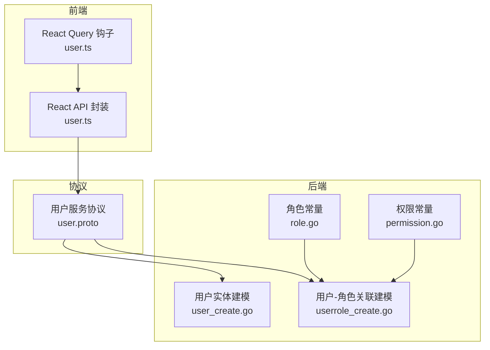
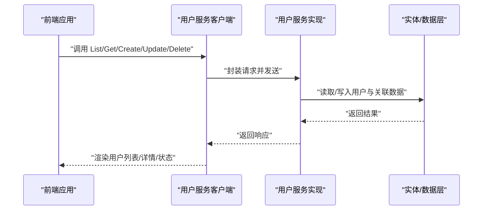
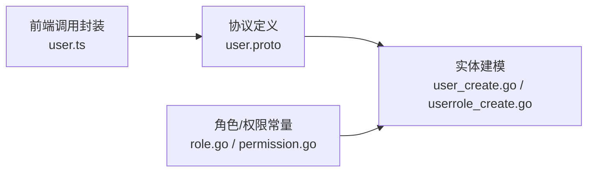

# 用户管理

<cite>
**本文引用的文件**
- [user.proto](file://backend/api/protos/identity/service/v1/user.proto)
- [user.ts](file://frontend/admin/react/src/api/service/user.ts)
- [user.ts](file://frontend/admin/react/src/api/hooks/user.ts)
- [role.go](file://backend/pkg/constants/role.go)
- [permission.go](file://backend/pkg/constants/permission.go)
- [user_create.go](file://backend/app/admin/service/internal/data/ent/user_create.go)
- [userrole_create.go](file://backend/app/admin/service/internal/data/ent/userrole_create.go)
</cite>

## 目录
1. [简介](#简介)
2. [项目结构](#项目结构)
3. [核心组件](#核心组件)
4. [架构总览](#架构总览)
5. [详细组件分析](#详细组件分析)
6. [依赖分析](#依赖分析)
7. [性能考虑](#性能考虑)
8. [故障排查指南](#故障排查指南)
9. [结论](#结论)
10. [附录](#附录)

## 简介
本文件围绕用户管理功能进行系统化说明，覆盖用户 CRUD 操作、状态管理、用户与角色/组织单位/职位的关联关系、查询过滤机制、最佳实践以及 API 调用示例与错误处理建议。内容基于仓库中的协议定义、前端调用封装与后端实体建模进行整理，帮助开发者快速理解并正确使用用户管理能力。

## 项目结构
用户管理相关的关键位置如下：
- 协议层：定义了用户服务的 RPC 接口与消息模型，位于 identity 服务命名空间下
- 前端层：封装了用户服务客户端与查询钩子，便于在前端发起请求
- 后端层：实体与数据访问层包含用户与用户-角色关联的建模信息

图表来源
- [user.proto](file://backend/api/protos/identity/service/v1/user.proto)
- [user.ts](file://frontend/admin/react/src/api/service/user.ts)
- [user.ts](file://frontend/admin/react/src/api/hooks/user.ts)
- [user_create.go](file://backend/app/admin/service/internal/data/ent/user_create.go)
- [userrole_create.go](file://backend/app/admin/service/internal/data/ent/userrole_create.go)
- [role.go](file://backend/pkg/constants/role.go)
- [permission.go](file://backend/pkg/constants/permission.go)

章节来源
- [user.proto](file://backend/api/protos/identity/service/v1/user.proto)
- [user.ts](file://frontend/admin/react/src/api/service/user.ts)
- [user.ts](file://frontend/admin/react/src/api/hooks/user.ts)
- [user_create.go](file://backend/app/admin/service/internal/data/ent/user_create.go)
- [userrole_create.go](file://backend/app/admin/service/internal/data/ent/userrole_create.go)
- [role.go](file://backend/pkg/constants/role.go)
- [permission.go](file://backend/pkg/constants/permission.go)

## 核心组件
- 用户服务接口：提供用户列表、统计、详情、创建、批量创建、更新、删除、存在性检查等 RPC 方法
- 用户模型：包含用户基本信息、组织单位与职位的多值映射、角色码与名称列表、状态枚举及时间戳等字段
- 前端调用封装：提供用户服务客户端与 React Query 钩子，支持分页查询、单条查询、增删改操作
- 后端实体建模：用户与用户-角色关联的实体建模，体现多对多关系与审计字段

章节来源
- [user.proto](file://backend/api/protos/identity/service/v1/user.proto)
- [user.ts](file://frontend/admin/react/src/api/service/user.ts)
- [user.ts](file://frontend/admin/react/src/api/hooks/user.ts)
- [user_create.go](file://backend/app/admin/service/internal/data/ent/user_create.go)
- [userrole_create.go](file://backend/app/admin/service/internal/data/ent/userrole_create.go)

## 架构总览
用户管理采用前后端分离架构：
- 前端通过 gRPC-Web/OpenAPI 客户端调用用户服务
- 服务端根据协议定义解析请求，执行业务逻辑与数据持久化
- 数据层通过实体建模维护用户与其多对多关系（角色、组织单位、职位）

图表来源
- [user.ts](file://frontend/admin/react/src/api/service/user.ts)
- [user.proto](file://backend/api/protos/identity/service/v1/user.proto)
- [user_create.go](file://backend/app/admin/service/internal/data/ent/user_create.go)
- [userrole_create.go](file://backend/app/admin/service/internal/data/ent/userrole_create.go)

## 详细组件分析

### 用户服务接口与模型
- 用户服务包含以下 RPC 方法：
  - 列表查询、统计数量、详情查询、创建、批量创建、更新、删除、存在性检查
- 用户模型字段涵盖：
  - 基本信息：用户名、昵称、真实姓名、头像、邮箱、手机、电话、性别、地址、地区、描述、备注
  - 关联信息：租户、组织单位（单个与多个）、职位（单个与多个）、角色（ID、码、名称列表）
  - 状态与时间：状态枚举、最后登录时间与 IP、创建/更新/删除时间与操作人
- 字段过滤：详情查询支持 FieldMask 控制返回字段；列表查询通过分页参数控制

章节来源
- [user.proto](file://backend/api/protos/identity/service/v1/user.proto)

### 前端调用封装
- 客户端封装：统一创建用户服务客户端实例，提供 listUsers/getUser/createUser/updateUser/deleteUser 等方法
- 查询钩子：基于 React Query 提供 useListUsers/fetchListUsers 等钩子，支持缓存、重试与并发控制
- 分页与过滤：前端将分页参数转换为协议请求格式，支持排序、偏移、限制、过滤表达式等

章节来源
- [user.ts](file://frontend/admin/react/src/api/service/user.ts)
- [user.ts](file://frontend/admin/react/src/api/hooks/user.ts)

### 后端实体与关系建模
- 用户实体建模：包含审计字段（创建者、更新者、删除者、创建时间、更新时间、删除时间）与用户核心字段
- 用户-角色关联建模：体现用户与角色的多对多关系，支持批量维护与审计字段
- 角色与权限常量：提供角色代码前缀、平台/租户/模板角色标识与默认名称，以及受保护权限代码集合

章节来源
- [user_create.go](file://backend/app/admin/service/internal/data/ent/user_create.go)
- [userrole_create.go](file://backend/app/admin/service/internal/data/ent/userrole_create.go)
- [role.go](file://backend/pkg/constants/role.go)
- [permission.go](file://backend/pkg/constants/permission.go)

### 用户状态管理机制
- 状态枚举：包含禁用、正常、待激活、锁定、过期、注销等状态
- 锁定策略：提供锁定截止时间字段，支持基于策略的自动锁定与解锁
- 生命周期管理：通过创建/更新/删除时间与操作人字段，完整记录用户生命周期轨迹

章节来源
- [user.proto](file://backend/api/protos/identity/service/v1/user.proto)

### 用户与角色/组织单位/职位的关联关系
- 多对多关系：
  - 用户与角色：通过用户-角色关联表维护，支持批量创建与更新
  - 用户与组织单位/职位：用户模型直接包含多值 ID 与名称列表，便于查询与展示
- 关系维护：
  - 批量创建用户时可一并建立角色关联
  - 更新用户时可通过 FieldMask 控制更新范围，避免误操作

章节来源
- [user.proto](file://backend/api/protos/identity/service/v1/user.proto)
- [userrole_create.go](file://backend/app/admin/service/internal/data/ent/userrole_create.go)

### 用户查询过滤机制
- 列表查询：支持分页、排序、过滤表达式等参数，前端通过钩子集中处理
- 详情查询：支持按 ID 或用户名查询，并通过 FieldMask 控制返回字段
- 存在性检查：提供用户存在性查询，便于前端校验与业务判断

章节来源
- [user.proto](file://backend/api/protos/identity/service/v1/user.proto)
- [user.ts](file://frontend/admin/react/src/api/service/user.ts)
- [user.ts](file://frontend/admin/react/src/api/hooks/user.ts)

### API 接口调用示例与错误处理
- 列表查询：前端调用 listUsers，传入分页参数，后端返回列表与总数
- 详情查询：前端调用 getUser，传入 ID 或用户名，后端返回用户对象
- 创建用户：前端调用 createUser，传入用户数据与可选密码
- 更新用户：前端调用 updateUser，传入用户 ID、数据与 FieldMask
- 删除用户：前端调用 deleteUser，传入 ID 或用户名
- 错误处理建议：
  - 对于网络异常与超时，前端应提示用户重试并记录日志
  - 对于业务错误（如重复用户名、角色缺失），后端返回错误码，前端友好提示并引导修复
  - 对于权限不足，后端返回鉴权失败，前端引导用户重新登录或调整权限

章节来源
- [user.ts](file://frontend/admin/react/src/api/service/user.ts)
- [user.ts](file://frontend/admin/react/src/api/hooks/user.ts)
- [user.proto](file://backend/api/protos/identity/service/v1/user.proto)

## 依赖分析
- 前端依赖协议生成的客户端，通过封装函数统一调用
- 后端实体建模依赖角色与权限常量，确保角色代码与权限约束一致
- 用户服务接口定义决定前后端契约，前端查询钩子与后端实体建模共同保证数据一致性

图表来源
- [user.ts](file://frontend/admin/react/src/api/service/user.ts)
- [user.proto](file://backend/api/protos/identity/service/v1/user.proto)
- [user_create.go](file://backend/app/admin/service/internal/data/ent/user_create.go)
- [userrole_create.go](file://backend/app/admin/service/internal/data/ent/userrole_create.go)
- [role.go](file://backend/pkg/constants/role.go)
- [permission.go](file://backend/pkg/constants/permission.go)

章节来源
- [user.ts](file://frontend/admin/react/src/api/service/user.ts)
- [user.proto](file://backend/api/protos/identity/service/v1/user.proto)
- [user_create.go](file://backend/app/admin/service/internal/data/ent/user_create.go)
- [userrole_create.go](file://backend/app/admin/service/internal/data/ent/userrole_create.go)
- [role.go](file://backend/pkg/constants/role.go)
- [permission.go](file://backend/pkg/constants/permission.go)

## 性能考虑
- 列表查询：合理设置分页大小与排序字段，避免一次性加载过多数据
- 字段过滤：详情查询使用 FieldMask 仅返回必要字段，降低序列化与传输开销
- 批量操作：批量创建用户时尽量合并请求，减少网络往返
- 缓存策略：前端使用 React Query 的缓存与预取，提升交互体验

## 故障排查指南
- 常见问题
  - 用户名重复：检查用户名唯一性约束，提示用户更换
  - 角色缺失：确认角色是否已创建且代码正确
  - 权限不足：检查当前用户是否具备相应权限
- 日志与追踪
  - 记录请求参数与响应状态，定位异常点
  - 使用审计字段（创建者、更新者、时间）回溯变更历史

## 结论
本用户管理方案以协议驱动前后端协作，结合实体建模与常量约束，实现了用户 CRUD、状态管理、多对多关系维护与灵活查询过滤。通过前端封装与后端建模协同，既保证了功能完整性，也为后续扩展与优化提供了清晰边界。

## 附录
- 最佳实践
  - 批量操作：优先使用批量创建与更新，减少请求次数
  - 数据导入导出：统一字段映射与校验，导出时使用 FieldMask 控制敏感字段
  - 权限控制：严格区分平台/租户角色，避免越权操作
- 扩展建议
  - 支持更多过滤条件（如按状态、组织、角色组合查询）
  - 增加用户导入模板与校验规则
  - 提供用户生命周期事件与审计日志