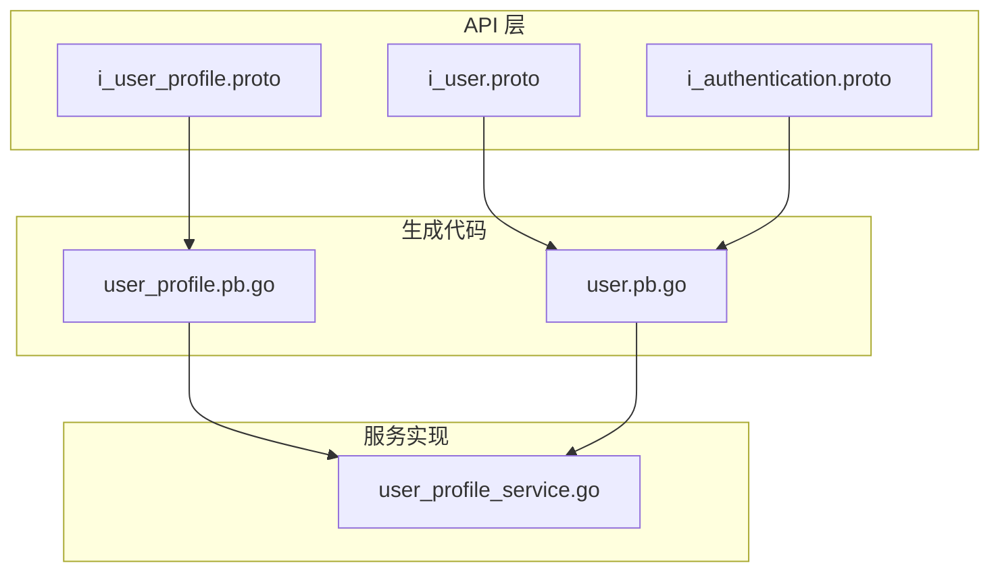
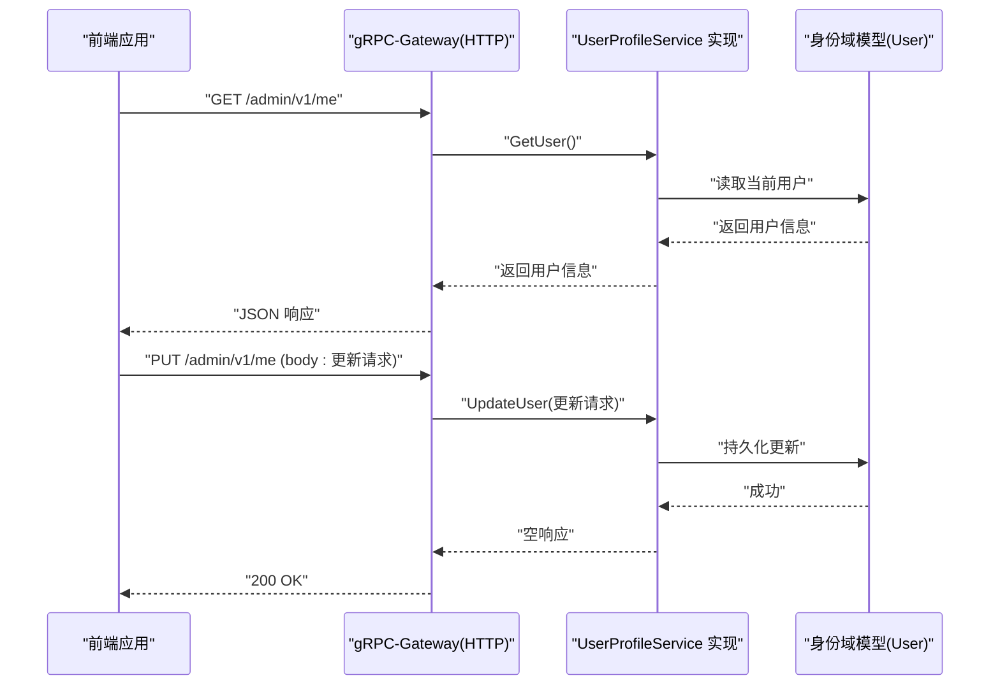
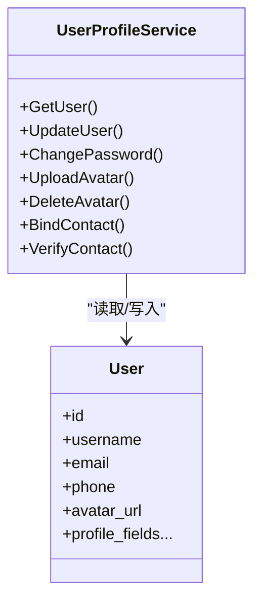
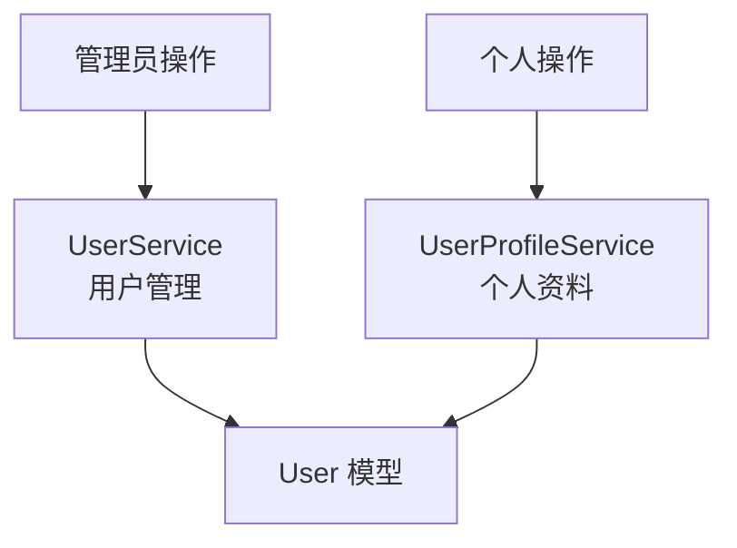
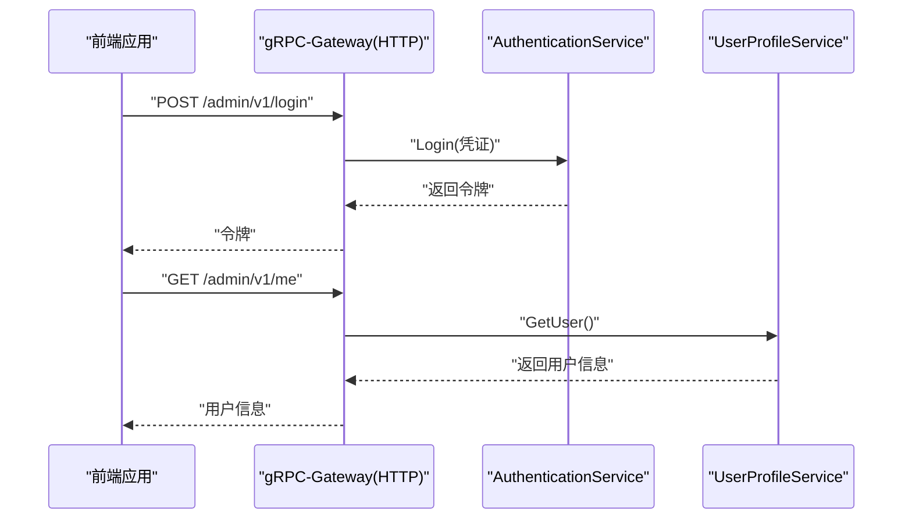
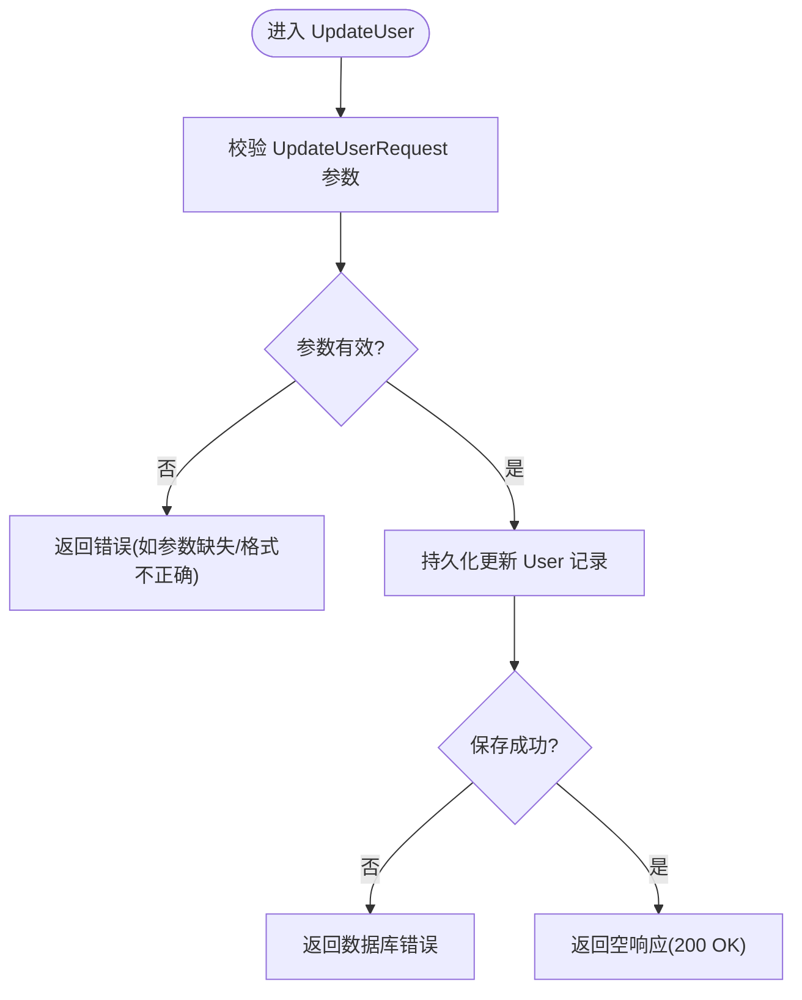
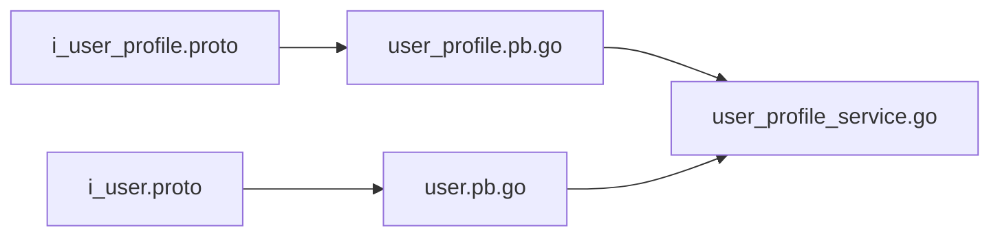

# 用户资料管理

<cite>
**本文引用的文件**
- [i_user_profile.proto](file://backend/api/protos/admin/service/v1/i_user_profile.proto)
- [i_user.proto](file://backend/api/protos/admin/service/v1/i_user.proto)
- [i_authentication.proto](file://backend/api/protos/admin/service/v1/i_authentication.proto)
- [user_profile.pb.go](file://backend/api/gen/go/identity/service/v1/user_profile.pb.go)
- [user.pb.go](file://backend/api/gen/go/identity/service/v1/user.pb.go)
- [user_profile_service.go](file://backend/app/admin/service/internal/service/user_profile_service.go)
</cite>

## 目录
1. [简介](#简介)
2. [项目结构](#项目结构)
3. [核心组件](#核心组件)
4. [架构总览](#架构总览)
5. [详细组件分析](#详细组件分析)
6. [依赖关系分析](#依赖关系分析)
7. [性能考虑](#性能考虑)
8. [故障排查指南](#故障排查指南)
9. [结论](#结论)
10. [附录](#附录)

## 简介
本文件系统化梳理“用户资料管理”能力，覆盖以下方面：
- 基本信息编辑与头像上传/删除
- 联系方式绑定与验证（手机号/邮箱）
- 密码修改流程
- 与身份域模型的映射关系
- 后端服务接口定义与调用路径
- 前端集成要点与最佳实践
- 隐私与安全注意事项（基于现有接口语义）

说明：当前仓库后端以 Protocol Buffers 定义服务契约，并通过 gRPC-Gateway 暴露 HTTP 接口；用户资料相关接口集中在“用户个人资料服务”。部分高级能力（如偏好设置、跨设备同步、导入导出、历史审计）在现有接口中未直接体现，将在“附录”给出可扩展建议。

## 项目结构
后端采用分层与按域划分的组织方式：
- API 层：以 .proto 定义服务契约，生成 gRPC/HTTP 适配代码
- 服务实现层：在 internal/service 下落地具体业务逻辑
- 数据访问层：在 internal/data 下封装持久化细节
- 中间件与工具：鉴权、日志、事件总线等

图示来源
- [i_user_profile.proto:1-64](file://backend/api/protos/admin/service/v1/i_user_profile.proto#L1-L64)
- [i_user.proto:1-75](file://backend/api/protos/admin/service/v1/i_user.proto#L1-L75)
- [i_authentication.proto:1-75](file://backend/api/protos/admin/service/v1/i_authentication.proto#L1-L75)
- [user_profile.pb.go:1-75](file://backend/api/gen/go/identity/service/v1/user_profile.pb.go#L1-L75)
- [user.pb.go:1-75](file://backend/api/gen/go/identity/service/v1/user.pb.go#L1-L75)
- [user_profile_service.go](file://backend/app/admin/service/internal/service/user_profile_service.go)

章节来源
- [i_user_profile.proto:1-64](file://backend/api/protos/admin/service/v1/i_user_profile.proto#L1-L64)
- [i_user.proto:1-75](file://backend/api/protos/admin/service/v1/i_user.proto#L1-L75)
- [i_authentication.proto:1-75](file://backend/api/protos/admin/service/v1/i_authentication.proto#L1-L75)
- [user_profile.pb.go:1-75](file://backend/api/gen/go/identity/service/v1/user_profile.pb.go#L1-L75)
- [user.pb.go:1-75](file://backend/api/gen/go/identity/service/v1/user.pb.go#L1-L75)
- [user_profile_service.go](file://backend/app/admin/service/internal/service/user_profile_service.go)

## 核心组件
- 用户个人资料服务（UserProfileService）
  - 提供获取当前用户资料、更新资料、修改密码、上传/删除头像、绑定/验证联系信息等接口
- 用户服务（UserService）
  - 提供管理员侧用户查询、创建、更新、删除等能力（非个人资料编辑）
- 认证服务（AuthenticationService）
  - 提供登录、登出、刷新令牌、验证码生成与校验等能力

章节来源
- [i_user_profile.proto:10-63](file://backend/api/protos/admin/service/v1/i_user_profile.proto#L10-L63)
- [i_user.proto:14-74](file://backend/api/protos/admin/service/v1/i_user.proto#L14-L74)
- [i_authentication.proto:12-74](file://backend/api/protos/admin/service/v1/i_authentication.proto#L12-L74)

## 架构总览
用户资料管理由“API 定义 → 生成代码 → 服务实现”构成，结合 gRPC-Gateway 将 gRPC 映射为 HTTP 接口，便于前端直连。

图示来源
- [i_user_profile.proto:13-25](file://backend/api/protos/admin/service/v1/i_user_profile.proto#L13-L25)
- [user_profile.pb.go:29-32](file://backend/api/gen/go/identity/service/v1/user_profile.pb.go#L29-L32)
- [user_profile_service.go](file://backend/app/admin/service/internal/service/user_profile_service.go)

## 详细组件分析

### 用户个人资料服务（UserProfileService）
- 获取当前用户资料
  - HTTP: GET /admin/v1/me
  - gRPC: GetUser(Empty) → 返回 User
- 更新用户资料
  - HTTP: PUT /admin/v1/me (body: UpdateUserRequest)
  - gRPC: UpdateUser(UpdateUserRequest) → Empty
- 修改密码
  - HTTP: POST /admin/v1/me/password (body: ChangePasswordRequest)
  - gRPC: ChangePassword(ChangePasswordRequest) → Empty
- 上传头像
  - HTTP: POST /admin/v1/me/avatar (body: UploadAvatarRequest)
  - gRPC: UploadAvatar(UploadAvatarRequest) → UploadAvatarResponse
- 删除头像
  - HTTP: DELETE /admin/v1/me/avatar
  - gRPC: DeleteAvatar(Empty) → Empty
- 绑定联系信息（手机/邮箱）
  - HTTP: POST /admin/v1/me/contact (body: BindContactRequest)
  - gRPC: BindContact(BindContactRequest) → Empty
- 验证联系信息
  - HTTP: POST /admin/v1/me/contact/verify (body: VerifyContactRequest)
  - gRPC: VerifyContact(VerifyContactRequest) → Empty

图示来源
- [i_user_profile.proto:11-63](file://backend/api/protos/admin/service/v1/i_user_profile.proto#L11-L63)
- [user_profile.pb.go:29-32](file://backend/api/gen/go/identity/service/v1/user_profile.pb.go#L29-L32)

章节来源
- [i_user_profile.proto:10-63](file://backend/api/protos/admin/service/v1/i_user_profile.proto#L10-L63)
- [user_profile.pb.go:29-32](file://backend/api/gen/go/identity/service/v1/user_profile.pb.go#L29-L32)

### 用户服务（UserService）
- 管理员侧用户管理能力（与个人资料编辑不同域）
  - 列表、查询、创建、更新、删除、存在性检查、修改他人密码等
- 与个人资料服务的关系
  - 个人资料服务面向“当前用户”，用户服务面向“任意用户”
  - 两者共享 User 模型，但职责边界清晰

图示来源
- [i_user.proto:14-74](file://backend/api/protos/admin/service/v1/i_user.proto#L14-L74)
- [user_profile.pb.go:29-32](file://backend/api/gen/go/identity/service/v1/user_profile.pb.go#L29-L32)

章节来源
- [i_user.proto:14-74](file://backend/api/protos/admin/service/v1/i_user.proto#L14-L74)

### 认证服务（AuthenticationService）
- 登录、登出、刷新令牌、验证码生成与校验
- 与用户资料服务的协作
  - 登录成功后，前端持有令牌，后续调用 /admin/v1/me 等接口需携带认证信息
  - 刷新令牌用于延长会话有效期

图示来源
- [i_authentication.proto:14-31](file://backend/api/protos/admin/service/v1/i_authentication.proto#L14-L31)
- [i_user_profile.proto:13-17](file://backend/api/protos/admin/service/v1/i_user_profile.proto#L13-L17)

章节来源
- [i_authentication.proto:12-74](file://backend/api/protos/admin/service/v1/i_authentication.proto#L12-L74)

### 处理流程与错误处理示意
以下流程图展示“更新用户资料”的典型路径，包含输入校验、持久化与响应：

图示来源
- [i_user_profile.proto:20-25](file://backend/api/protos/admin/service/v1/i_user_profile.proto#L20-L25)
- [user_profile.pb.go:30-32](file://backend/api/gen/go/identity/service/v1/user_profile.pb.go#L30-L32)

## 依赖关系分析
- UserProfileService 依赖身份域模型 User 及其请求消息类型
- 生成代码（user_profile.pb.go、user.pb.go）为服务实现提供类型与序列化支持
- 服务实现文件 user_profile_service.go 承载具体业务逻辑

图示来源
- [i_user_profile.proto:1-64](file://backend/api/protos/admin/service/v1/i_user_profile.proto#L1-L64)
- [i_user.proto:1-75](file://backend/api/protos/admin/service/v1/i_user.proto#L1-L75)
- [user_profile.pb.go:1-75](file://backend/api/gen/go/identity/service/v1/user_profile.pb.go#L1-L75)
- [user.pb.go:1-75](file://backend/api/gen/go/identity/service/v1/user.pb.go#L1-L75)
- [user_profile_service.go](file://backend/app/admin/service/internal/service/user_profile_service.go)

章节来源
- [user_profile.pb.go:1-75](file://backend/api/gen/go/identity/service/v1/user_profile.pb.go#L1-L75)
- [user.pb.go:1-75](file://backend/api/gen/go/identity/service/v1/user.pb.go#L1-L75)
- [user_profile_service.go](file://backend/app/admin/service/internal/service/user_profile_service.go)

## 性能考虑
- 接口幂等性
  - GET /admin/v1/me 为只读，适合缓存短期结果
  - PUT /admin/v1/me 应确保并发更新的冲突处理（如乐观锁或版本号）
- 传输体积
  - 头像上传建议前端压缩与尺寸裁剪，减少带宽与存储压力
- 并发与事务
  - 更新资料与绑定联系信息可能涉及多字段一致性，建议在服务层使用事务或原子更新
- 缓存策略
  - 对频繁读取的用户基础信息可引入本地缓存（需注意与服务端状态的一致性）

## 故障排查指南
- 常见问题定位
  - 401/403：认证失败或令牌过期，检查登录与刷新令牌流程
  - 400：请求体参数不合法，核对 UpdateUserRequest/ChangePasswordRequest/UploadAvatarRequest 的必填字段
  - 404：资源不存在（如头像删除后再次删除），确认资源状态
  - 500：服务内部错误，查看服务日志与数据库连接状态
- 关键接口与错误点
  - 修改密码：确保旧密码校验通过后再执行更新
  - 绑定联系信息：先 BindContact，再 VerifyContact，前后端配合完成二次确认
  - 头像上传：确认文件类型与大小限制，以及存储可用性

章节来源
- [i_user_profile.proto:28-62](file://backend/api/protos/admin/service/v1/i_user_profile.proto#L28-L62)
- [i_authentication.proto:14-31](file://backend/api/protos/admin/service/v1/i_authentication.proto#L14-L31)

## 结论
- 当前后端已明确暴露“用户个人资料”的核心接口，涵盖基本资料、头像、联系信息与密码修改
- 服务实现位于 internal/service 层，生成代码提供类型与序列化支撑
- 建议在前端侧完善参数校验与错误提示，在后端侧强化幂等性与事务一致性
- 对于偏好设置、跨设备同步、导入导出、历史审计等高级能力，可在现有接口基础上进行扩展设计（详见附录）

## 附录

### A. 用户偏好设置与个性化配置（扩展建议）
- 设计思路
  - 引入“用户偏好配置”实体，与 User 一对一关联
  - 提供独立的偏好 CRUD 接口，避免与用户资料耦合
- 典型字段
  - 语言、时区、主题、通知偏好、界面布局等
- 存储与同步
  - 本地存储：浏览器 LocalStorage/IndexedDB 缓存
  - 服务器存储：用户偏好表
  - 跨设备同步：登录后拉取最新偏好，冲突时以服务器为准或引入版本号/时间戳合并

### B. 用户资料导入导出（扩展建议）
- 导出
  - 提供导出个人资料 JSON/CSV 的接口，支持选择导出范围（仅基础资料/含偏好/含历史）
- 导入
  - 提供导入接口，校验文件格式与字段合法性，支持增量更新与覆盖模式
- 安全与隐私
  - 导出默认脱敏敏感字段，导入需二次确认与审核

### C. 历史记录与审计（扩展建议）
- 记录维度
  - 资料变更记录（字段名、旧值、新值、变更时间、操作者）
  - 登录/登出、密码修改、头像变更等关键动作
- 存储位置
  - 新增审计日志表，支持分页查询与检索
- 查询与展示
  - 提供审计日志列表接口，支持按时间、用户、操作类型筛选

### D. 隐私控制与数据共享策略（扩展建议）
- 可见性级别
  - 公开/仅自己/组织内/仅关注者 等
- 默认策略
  - 未显式声明时，默认最小可见范围
- 数据共享
  - 明确第三方授权与最小化原则，提供一键清除与删除选项

### E. 前端集成方案（基于现有接口）
- 认证态管理
  - 登录成功后缓存令牌，请求前缀统一添加 Authorization
- 资料读取
  - 首次进入页面调用 GET /admin/v1/me，渲染基础信息
- 资料更新
  - 表单提交时构造 UpdateUserRequest，PUT /admin/v1/me
- 头像上传
  - 选择文件后调用 POST /admin/v1/me/avatar，上传成功后刷新头像显示
- 密码修改
  - 输入旧密码与新密码，POST /admin/v1/me/password
- 联系方式绑定与验证
  - 先 BindContact，再 VerifyContact，前端提示短信/邮件验证码输入

### F. API 接口清单（基于现有定义）
- 获取当前用户资料
  - 方法: GET
  - 路径: /admin/v1/me
  - 请求: Empty
  - 响应: User
- 更新用户资料
  - 方法: PUT
  - 路径: /admin/v1/me
  - 请求: UpdateUserRequest
  - 响应: Empty
- 修改密码
  - 方法: POST
  - 路径: /admin/v1/me/password
  - 请求: ChangePasswordRequest
  - 响应: Empty
- 上传头像
  - 方法: POST
  - 路径: /admin/v1/me/avatar
  - 请求: UploadAvatarRequest
  - 响应: UploadAvatarResponse
- 删除头像
  - 方法: DELETE
  - 路径: /admin/v1/me/avatar
  - 请求: Empty
  - 响应: Empty
- 绑定联系信息
  - 方法: POST
  - 路径: /admin/v1/me/contact
  - 请求: BindContactRequest
  - 响应: Empty
- 验证联系信息
  - 方法: POST
  - 路径: /admin/v1/me/contact/verify
  - 请求: VerifyContactRequest
  - 响应: Empty

章节来源
- [i_user_profile.proto:13-62](file://backend/api/protos/admin/service/v1/i_user_profile.proto#L13-L62)