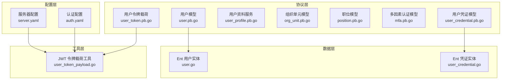
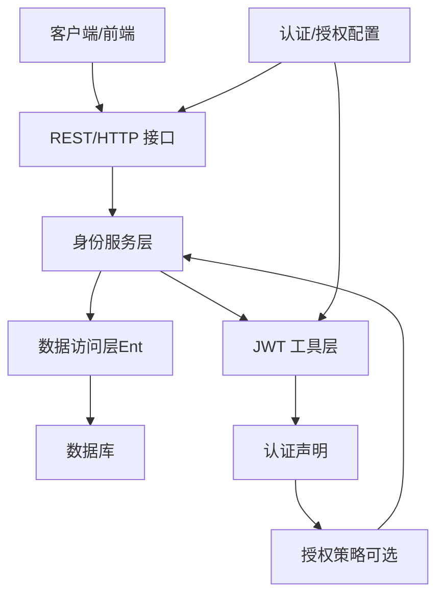
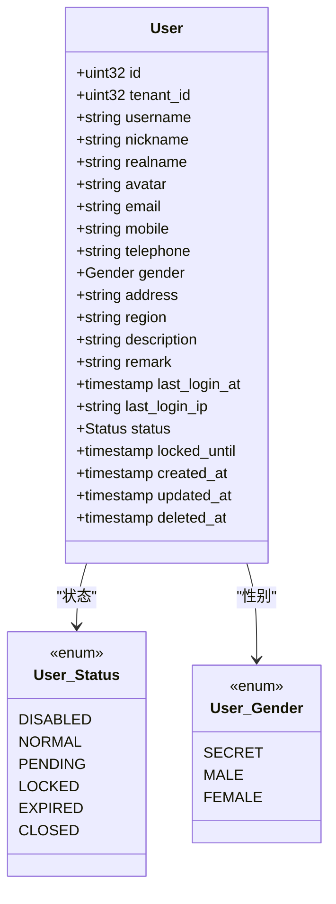
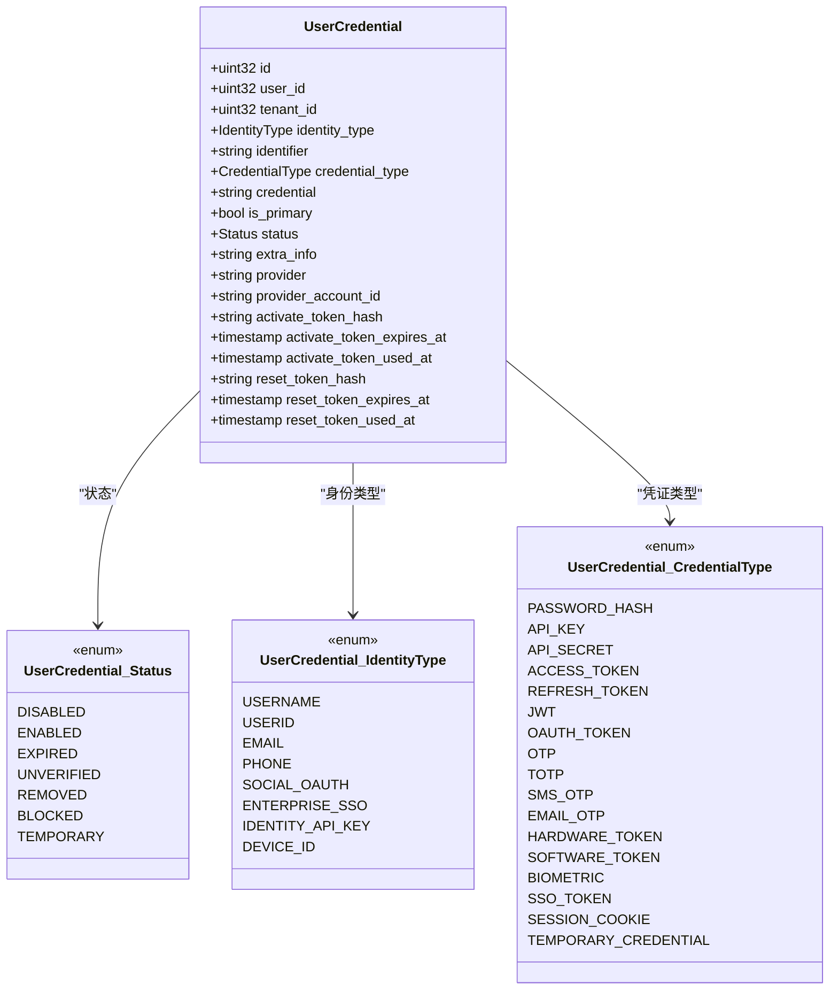
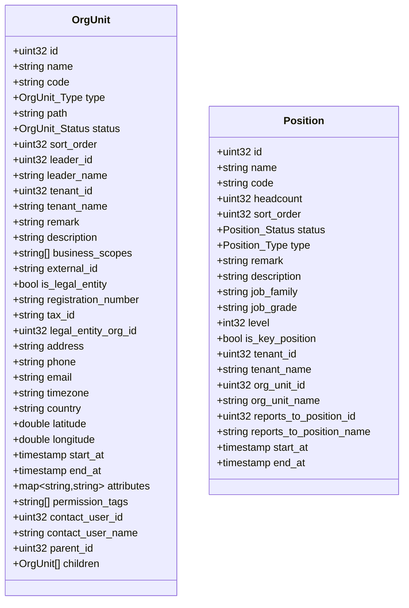
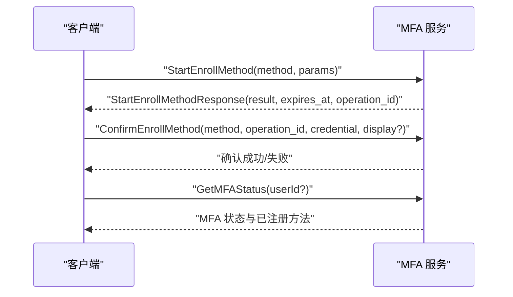
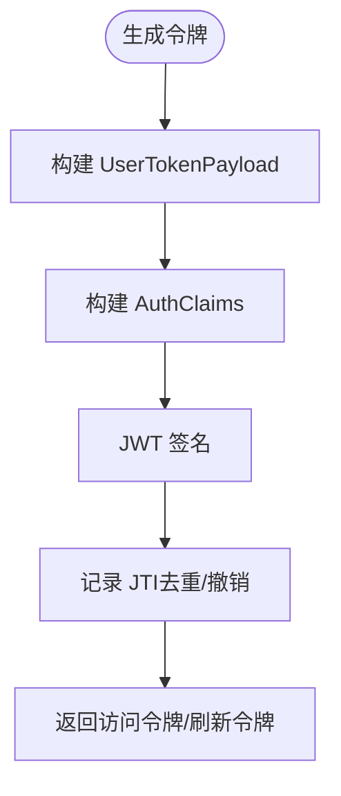
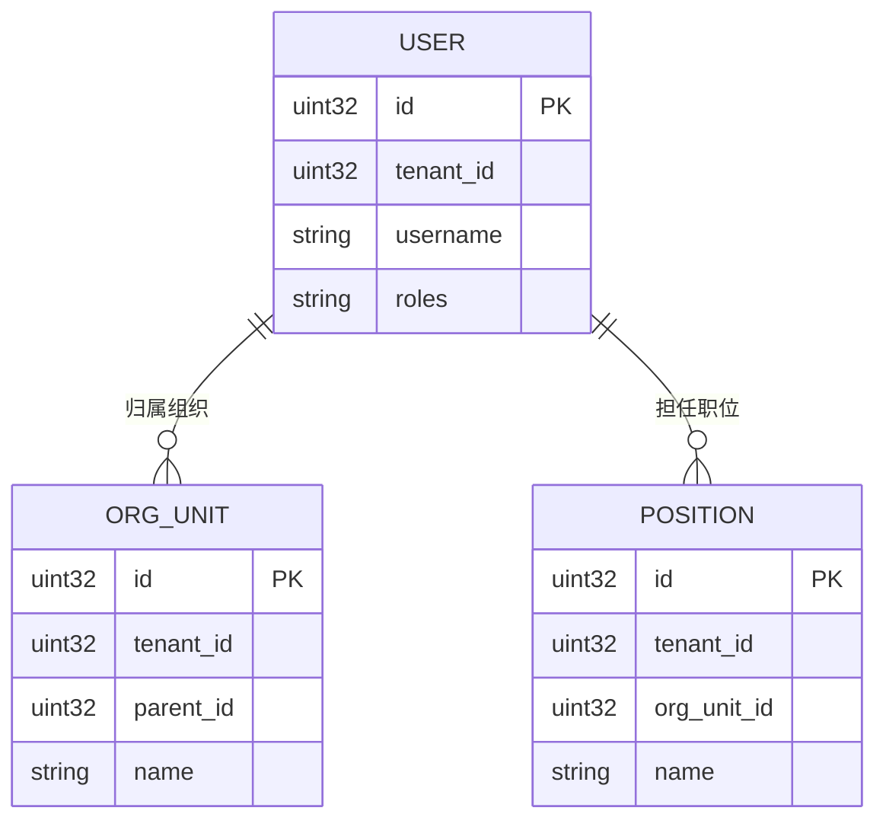
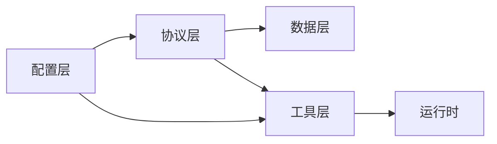

# 用户身份管理

<cite>
**本文档引用的文件**
- [user.pb.go](file://backend/api/gen/go/identity/service/v1/user.pb.go)
- [user_credential.pb.go](file://backend/api/gen/go/authentication/credential.pb.go)
- [user_profile.pb.go](file://backend/api/gen/go/identity/service/v1/user_profile.pb.go)
- [org_unit.pb.go](file://backend/api/gen/go/identity/service/v1/org_unit.pb.go)
- [position.pb.go](file://backend/api/gen/go/identity/service/v1/position.pb.go)
- [mfa.pb.go](file://backend/api/gen/go/authentication/service/v1/mfa.pb.go)
- [user_token.pb.go](file://backend/api/gen/go/authentication/service/v1/user_token.pb.go)
- [user.go](file://backend/app/admin/service/internal/data/ent/schema/user.go)
- [user_credential.go](file://backend/app/admin/service/internal/data/ent/schema/user_credential.go)
- [user_token_payload.go](file://backend/pkg/jwt/user_token_payload.go)
- [auth.yaml](file://backend/app/admin/service/configs/auth.yaml)
- [server.yaml](file://backend/app/admin/service/configs/server.yaml)
</cite>

## 目录
1. [简介](#简介)
2. [项目结构](#项目结构)
3. [核心组件](#核心组件)
4. [架构总览](#架构总览)
5. [详细组件分析](#详细组件分析)
6. [依赖关系分析](#依赖关系分析)
7. [性能考量](#性能考量)
8. [故障排查指南](#故障排查指南)
9. [结论](#结论)

## 简介
本文件系统性梳理并说明用户身份管理模块的设计与实现，覆盖用户管理、用户凭证管理、用户资料管理、状态管理、多因素认证（MFA）、令牌与会话管理、以及用户与角色、组织单位、职位的关系映射。文档同时提供认证流程、个性化配置、最佳实践与安全考虑，帮助开发者与运维人员高效理解与维护系统。

## 项目结构
用户身份管理模块由以下层次构成：
- 协议层（Protocol Buffer）：定义用户、凭证、组织单位、职位、MFA、令牌等数据模型与服务接口。
- 数据层（Ent Schema）：基于 Ent 的实体定义与索引，确保数据一致性与查询效率。
- 工具层（JWT Payload）：封装令牌载荷与声明转换，支持鉴权与授权上下文传递。
- 配置层（YAML）：定义认证方式、令牌有效期、服务器中间件等运行时行为。

**图表来源**
- [user.pb.go:140-182](file://backend/api/gen/go/identity/service/v1/user.pb.go#L140-L182)
- [user_credential.pb.go:293-315](file://backend/api/gen/go/authentication/service/v1/user_credential.pb.go#L293-L315)
- [user_profile.pb.go:29-33](file://backend/api/gen/go/identity/service/v1/user_profile.pb.go#L29-L33)
- [org_unit.pb.go:147-192](file://backend/api/gen/go/identity/service/v1/org_unit.pb.go#L147-L192)
- [position.pb.go:135-167](file://backend/api/gen/go/identity/service/v1/position.pb.go#L135-L167)
- [mfa.pb.go:28-91](file://backend/api/gen/go/authentication/service/v1/mfa.pb.go#L28-L91)
- [user_token.pb.go:26-42](file://backend/api/gen/go/authentication/service/v1/user_token.pb.go#L26-L42)
- [user.go:13-172](file://backend/app/admin/service/internal/data/ent/schema/user.go#L13-L172)
- [user_credential.go:14-234](file://backend/app/admin/service/internal/data/ent/schema/user_credential.go#L14-L234)
- [user_token_payload.go:39-100](file://backend/pkg/jwt/user_token_payload.go#L39-L100)
- [auth.yaml:1-37](file://backend/app/admin/service/configs/auth.yaml#L1-L37)
- [server.yaml:1-49](file://backend/app/admin/service/configs/server.yaml#L1-L49)

**章节来源**
- [user.pb.go:140-182](file://backend/api/gen/go/identity/service/v1/user.pb.go#L140-L182)
- [user_credential.pb.go:293-315](file://backend/api/gen/go/authentication/service/v1/user_credential.pb.go#L293-L315)
- [user_profile.pb.go:29-33](file://backend/api/gen/go/identity/service/v1/user_profile.pb.go#L29-L33)
- [org_unit.pb.go:147-192](file://backend/api/gen/go/identity/service/v1/org_unit.pb.go#L147-L192)
- [position.pb.go:135-167](file://backend/api/gen/go/identity/service/v1/position.pb.go#L135-L167)
- [mfa.pb.go:28-91](file://backend/api/gen/go/authentication/service/v1/mfa.pb.go#L28-L91)
- [user_token.pb.go:26-42](file://backend/api/gen/go/authentication/service/v1/user_token.pb.go#L26-L42)
- [user.go:13-172](file://backend/app/admin/service/internal/data/ent/schema/user.go#L13-L172)
- [user_credential.go:14-234](file://backend/app/admin/service/internal/data/ent/schema/user_credential.go#L14-L234)
- [user_token_payload.go:39-100](file://backend/pkg/jwt/user_token_payload.go#L39-L100)
- [auth.yaml:1-37](file://backend/app/admin/service/configs/auth.yaml#L1-L37)
- [server.yaml:1-49](file://backend/app/admin/service/configs/server.yaml#L1-L49)

## 核心组件
- 用户模型（User）：包含用户基本信息、状态、最后登录信息、租户与组织/职位/角色关联字段等。
- 用户凭证模型（UserCredential）：支持多种身份类型与凭证类型，含状态、主认证标记、第三方平台信息及激活/重置令牌字段。
- 组织单元模型（OrgUnit）：组织树形结构、状态、类型、负责人、法定主体信息、业务范围、权限标签等。
- 职位模型（Position）：职位类型、编制、汇报关系、生效/失效时间、租户与组织关联等。
- 多因素认证（MFA）：支持TOTP、SMS、EMAIL、WebAuthn、备份码等方法，提供注册、确认与状态查询。
- 令牌载荷（UserTokenPayload）：承载用户ID、租户ID、客户端ID、设备ID、角色码、数据范围、组织单元ID等，配合JWT工具生成与解析声明。
- 数据实体（Ent Schema）：用户与凭证的数据库结构、索引与注释，确保唯一性与查询性能。
- 配置（YAML）：认证类型（JWT/oidc/preshared_key）、授权类型（noop/casbin/opa/zanzibar）、服务器中间件与跨域策略等。

**章节来源**
- [user.pb.go:140-182](file://backend/api/gen/go/identity/service/v1/user.pb.go#L140-L182)
- [user_credential.pb.go:293-315](file://backend/api/gen/go/authentication/service/v1/user_credential.pb.go#L293-L315)
- [org_unit.pb.go:147-192](file://backend/api/gen/go/identity/service/v1/org_unit.pb.go#L147-L192)
- [position.pb.go:135-167](file://backend/api/gen/go/identity/service/v1/position.pb.go#L135-L167)
- [mfa.pb.go:28-91](file://backend/api/gen/go/authentication/service/v1/mfa.pb.go#L28-L91)
- [user_token.pb.go:26-42](file://backend/api/gen/go/authentication/service/v1/user_token.pb.go#L26-L42)
- [user.go:31-134](file://backend/app/admin/service/internal/data/ent/schema/user.go#L31-L134)
- [user_credential.go:32-182](file://backend/app/admin/service/internal/data/ent/schema/user_credential.go#L32-L182)
- [auth.yaml:1-37](file://backend/app/admin/service/configs/auth.yaml#L1-L37)
- [server.yaml:1-49](file://backend/app/admin/service/configs/server.yaml#L1-L49)

## 架构总览
用户身份管理采用“协议驱动 + 数据持久化 + 工具链 + 配置”的分层设计。协议层定义数据模型与服务接口；数据层通过 Ent Schema 管理实体与索引；工具层负责令牌载荷与声明转换；配置层决定认证与授权策略及服务器行为。

**图表来源**
- [user_token_payload.go:39-100](file://backend/pkg/jwt/user_token_payload.go#L39-L100)
- [auth.yaml:1-37](file://backend/app/admin/service/configs/auth.yaml#L1-L37)
- [server.yaml:1-49](file://backend/app/admin/service/configs/server.yaml#L1-L49)

## 详细组件分析

### 用户模型与 CRUD 操作
- 字段覆盖：用户ID、租户ID、组织/职位/角色关联、用户名/昵称/真实姓名、头像、邮箱/手机/固话、性别、地址/区域、描述、备注、最后登录时间/IP、状态、锁定截止时间、创建/更新/删除元数据。
- 状态枚举：禁用、正常、待激活、锁定、过期、注销。
- CRUD 行为：通过协议层的请求/响应消息定义 Create、Update、Delete、List、Get 等操作，结合数据层索引实现高效查询与唯一性约束。

**图表来源**
- [user.pb.go:31-138](file://backend/api/gen/go/identity/service/v1/user.pb.go#L31-L138)
- [user.pb.go:140-182](file://backend/api/gen/go/identity/service/v1/user.pb.go#L140-L182)

**章节来源**
- [user.pb.go:31-138](file://backend/api/gen/go/identity/service/v1/user.pb.go#L31-L138)
- [user.pb.go:140-182](file://backend/api/gen/go/identity/service/v1/user.pb.go#L140-L182)
- [user.go:31-134](file://backend/app/admin/service/internal/data/ent/schema/user.go#L31-L134)

### 用户凭证模型与密码策略
- 身份类型：用户名、用户ID、邮箱、手机号、社交OAuth、企业SSO、API Key、设备ID等。
- 凭证类型：密码哈希、API Key/Secret、访问/刷新令牌、JWT、OAuth令牌、OTP/TOTP/SMS/Email OTP、硬件/软件令牌、生物识别、SSO断言、会话Cookie、临时凭证等。
- 状态：禁用、启用、过期、未验证、移除、锁定、临时。
- 安全字段：激活/重置令牌哈希、过期时间、使用时间；第三方平台标识与账号唯一ID。
- 索引策略：在租户维度保证唯一性（如 identifier 唯一、第三方账号唯一、主认证唯一），提升查询与并发安全性。

**图表来源**
- [user_credential.pb.go:293-315](file://backend/api/gen/go/authentication/service/v1/user_credential.pb.go#L293-L315)
- [user_credential.pb.go:231-291](file://backend/api/gen/go/authentication/service/v1/user_credential.pb.go#L231-L291)
- [user_credential.pb.go:29-100](file://backend/api/gen/go/authentication/service/v1/user_credential.pb.go#L29-L100)

**章节来源**
- [user_credential.pb.go:231-291](file://backend/api/gen/go/authentication/service/v1/user_credential.pb.go#L231-L291)
- [user_credential.pb.go:293-315](file://backend/api/gen/go/authentication/service/v1/user_credential.pb.go#L293-L315)
- [user_credential.go:32-182](file://backend/app/admin/service/internal/data/ent/schema/user_credential.go#L32-L182)

### 组织单元与职位模型
- 组织单元（OrgUnit）：树形结构（父子关系）、状态/类型、负责人、法定主体信息、业务范围、权限标签、时区/坐标、生效时间范围、扩展属性等。
- 职位（Position）：类型（普通/领导/管理/实习/合同）、编制、排序、关键岗位、汇报关系、生效/失效时间、租户与组织关联等。

**图表来源**
- [org_unit.pb.go:147-192](file://backend/api/gen/go/identity/service/v1/org_unit.pb.go#L147-L192)
- [position.pb.go:135-167](file://backend/api/gen/go/identity/service/v1/position.pb.go#L135-L167)

**章节来源**
- [org_unit.pb.go:147-192](file://backend/api/gen/go/identity/service/v1/org_unit.pb.go#L147-L192)
- [position.pb.go:135-167](file://backend/api/gen/go/identity/service/v1/position.pb.go#L135-L167)

### 多因素认证（MFA）
- 方法：TOTP、SMS、EMAIL、U2F/WebAuthn、备份码等。
- 流程：注册（StartEnroll）→ 发送验证码/生成TOTP二维码/准备WebAuthn挑战→ 确认（ConfirmEnroll）→ 查询状态（GetMFAStatus）→ 列表（ListEnrolledMethods）。
- 强制策略：不强制、可选、必须。

**图表来源**
- [mfa.pb.go:420-796](file://backend/api/gen/go/authentication/service/v1/mfa.pb.go#L420-L796)

**章节来源**
- [mfa.pb.go:28-91](file://backend/api/gen/go/authentication/service/v1/mfa.pb.go#L28-L91)
- [mfa.pb.go:420-796](file://backend/api/gen/go/authentication/service/v1/mfa.pb.go#L420-L796)

### 令牌与会话管理
- 令牌载荷（UserTokenPayload）：包含用户ID、租户ID、客户端ID、设备ID、用户名、角色码、数据范围、组织单元ID、JWT ID（JTI）等。
- 令牌声明（AuthClaims）：将载荷映射到标准JWT声明，支持过期时间、签发时间、JWT ID等。
- 有效期：默认访问令牌2小时，刷新令牌7天；提供过期与未生效检查，带时间容差。
- 配置：认证类型（JWT/oidc/preshared_key）、签名算法、密钥等。

**图表来源**
- [user_token_payload.go:39-100](file://backend/pkg/jwt/user_token_payload.go#L39-L100)
- [user_token_payload.go:248-279](file://backend/pkg/jwt/user_token_payload.go#L248-L279)
- [user_token.pb.go:26-42](file://backend/api/gen/go/authentication/service/v1/user_token.pb.go#L26-L42)

**章节来源**
- [user_token_payload.go:39-100](file://backend/pkg/jwt/user_token_payload.go#L39-L100)
- [user_token_payload.go:248-279](file://backend/pkg/jwt/user_token_payload.go#L248-L279)
- [user_token.pb.go:26-42](file://backend/api/gen/go/authentication/service/v1/user_token.pb.go#L26-L42)
- [auth.yaml:1-37](file://backend/app/admin/service/configs/auth.yaml#L1-L37)

### 用户资料与个性化配置
- 用户资料服务：提供获取与更新当前用户资料的能力，结合用户模型字段实现个性化展示。
- 个性化配置：语言、主题、通知偏好等可通过用户扩展字段或独立配置表管理（建议在应用层扩展）。

**章节来源**
- [user_profile.pb.go:29-33](file://backend/api/gen/go/identity/service/v1/user_profile.pb.go#L29-L33)
- [user.pb.go:140-182](file://backend/api/gen/go/identity/service/v1/user.pb.go#L140-L182)

### 用户与角色、组织单位、职位的关系映射
- 用户与角色：用户模型包含角色ID列表与角色码列表，便于权限判断与授权。
- 用户与组织单位/职位：用户模型包含组织单元ID/名称列表、职位ID/名称列表，支持多组织/多职位场景。
- 组织单元与职位：组织单元与职位均支持租户维度与层级关系，便于权限与数据范围控制。

**图表来源**
- [user.pb.go:140-182](file://backend/api/gen/go/identity/service/v1/user.pb.go#L140-L182)
- [org_unit.pb.go:147-192](file://backend/api/gen/go/identity/service/v1/org_unit.pb.go#L147-L192)
- [position.pb.go:135-167](file://backend/api/gen/go/identity/service/v1/position.pb.go#L135-L167)

**章节来源**
- [user.pb.go:140-182](file://backend/api/gen/go/identity/service/v1/user.pb.go#L140-L182)
- [org_unit.pb.go:147-192](file://backend/api/gen/go/identity/service/v1/org_unit.pb.go#L147-L192)
- [position.pb.go:135-167](file://backend/api/gen/go/identity/service/v1/position.pb.go#L135-L167)

## 依赖关系分析
- 协议层依赖：用户/凭证/组织/职位/MFA/令牌等模型相互独立，通过服务接口组合使用。
- 数据层依赖：用户与凭证实体分别对应协议模型，索引覆盖查询与唯一性需求。
- 工具层依赖：JWT 工具依赖协议层的令牌载荷与声明映射，受配置层认证类型影响。
- 配置层依赖：认证配置决定签名算法与密钥，服务器配置影响中间件与跨域策略。

**图表来源**
- [user_token_payload.go:39-100](file://backend/pkg/jwt/user_token_payload.go#L39-L100)
- [auth.yaml:1-37](file://backend/app/admin/service/configs/auth.yaml#L1-L37)
- [server.yaml:1-49](file://backend/app/admin/service/configs/server.yaml#L1-L49)

**章节来源**
- [user_token_payload.go:39-100](file://backend/pkg/jwt/user_token_payload.go#L39-L100)
- [auth.yaml:1-37](file://backend/app/admin/service/configs/auth.yaml#L1-L37)
- [server.yaml:1-49](file://backend/app/admin/service/configs/server.yaml#L1-L49)

## 性能考量
- 索引优化：用户与凭证在租户维度建立唯一索引与复合索引，避免重复与加速登录/查询。
- 查询裁剪：协议层支持 FieldMask 控制返回字段，减少网络传输与序列化开销。
- 令牌缓存：建议在网关/边缘层缓存常用令牌元信息，降低鉴权成本。
- 并发控制：凭证唯一性与令牌 JTI 去重可防止并发攻击与重放。

## 故障排查指南
- 登录失败
  - 检查用户状态是否为“正常”，是否存在“锁定/过期/关闭”状态。
  - 核对凭证状态与类型，确认主认证方式与标识符是否正确。
  - 查看最后登录时间/IP，定位异常来源。
- 令牌过期/未生效
  - 使用过期/未生效检查函数，确认时间容差与系统时间同步。
  - 校验 JWT ID（JTI）是否被撤销或重复使用。
- MFA 注册/验证异常
  - 确认 StartEnroll 与 ConfirmEnroll 的 OperationId 与方法匹配。
  - 检查验证码/TOTP/WebAuthn挑战是否在有效期内。
- 服务器中间件问题
  - 开启日志/恢复/追踪/校验/熔断/元数据中间件，定位请求链路与异常。

**章节来源**
- [user.go:120-133](file://backend/app/admin/service/internal/data/ent/schema/user.go#L120-L133)
- [user_credential.go:117-130](file://backend/app/admin/service/internal/data/ent/schema/user_credential.go#L117-L130)
- [user_token_payload.go:248-279](file://backend/pkg/jwt/user_token_payload.go#L248-L279)
- [server.yaml:22-29](file://backend/app/admin/service/configs/server.yaml#L22-L29)

## 结论
本模块以协议驱动的数据模型为核心，结合 Ent 的强一致数据层与 JWT 工具链，提供了完整的用户身份管理能力。通过清晰的用户/凭证/组织/职位模型、灵活的 MFA 支持、可配置的令牌策略与完善的索引设计，既能满足多租户与多组织场景下的权限控制，也能保障认证与会话的安全性与可运维性。建议在生产环境中强化密码策略、账户锁定与审计日志，并持续优化查询索引与中间件配置以提升整体性能与稳定性。