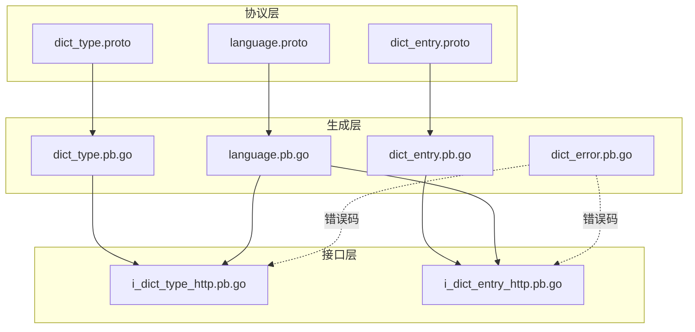
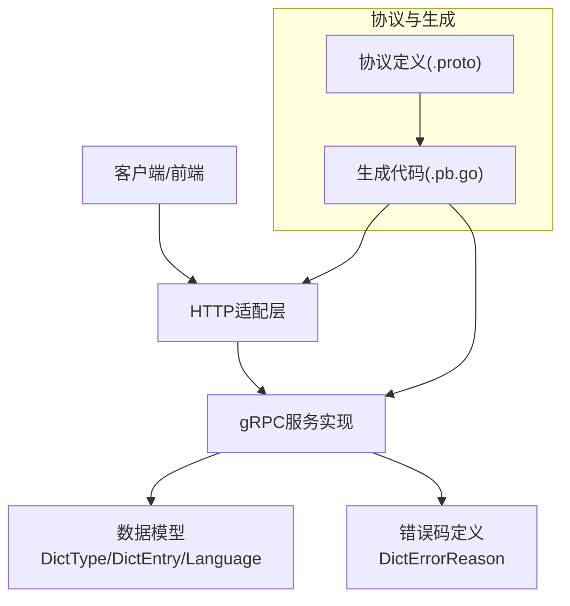
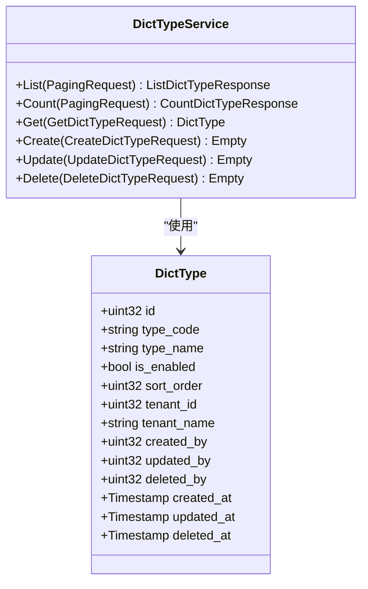
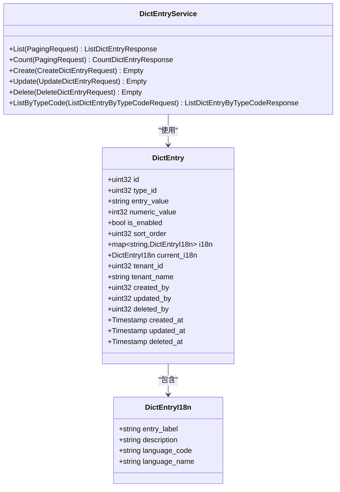
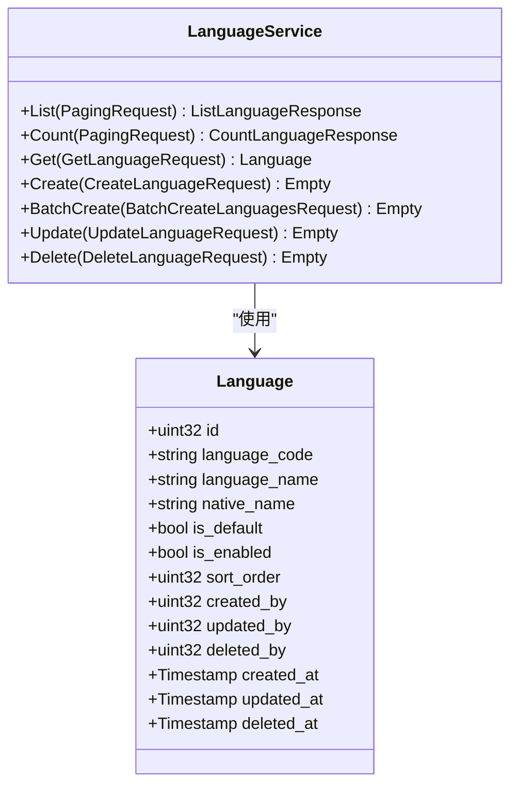
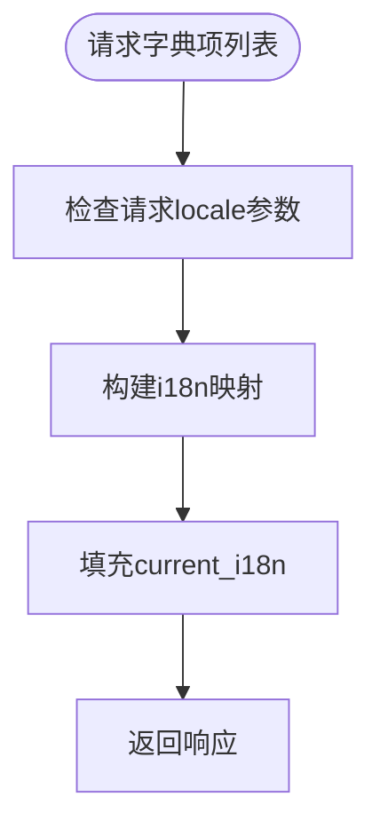
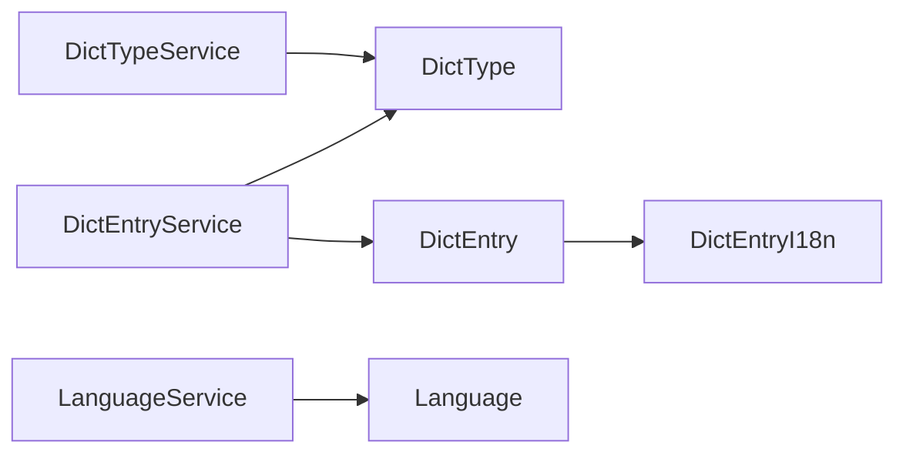

# 字典管理

<cite>
**本文引用的文件**
- [dict_type.proto](file://backend/api/protos/dict/service/v1/dict_type.proto)
- [dict_entry.proto](file://backend/api/protos/dict/service/v1/dict_entry.proto)
- [language.proto](file://backend/api/protos/dict/service/v1/language.proto)
- [dict_type.pb.go](file://backend/api/gen/go/dict/service/v1/dict_type.pb.go)
- [dict_entry.pb.go](file://backend/api/gen/go/dict/service/v1/dict_entry.pb.go)
- [language.pb.go](file://backend/api/gen/go/dict/service/v1/language.pb.go)
- [dict_error.pb.go](file://backend/api/gen/go/dict/service/v1/dict_error.pb.go)
- [i_dict_type_http.pb.go](file://backend/api/gen/go/admin/service/v1/i_dict_type_http.pb.go)
- [i_dict_entry_http.pb.go](file://backend/api/gen/go/admin/service/v1/i_dict_entry_http.pb.go)
</cite>

## 目录
1. [简介](#简介)
2. [项目结构](#项目结构)
3. [核心组件](#核心组件)
4. [架构总览](#架构总览)
5. [详细组件分析](#详细组件分析)
6. [依赖关系分析](#依赖关系分析)
7. [性能考虑](#性能考虑)
8. [故障排查指南](#故障排查指南)
9. [结论](#结论)
10. [附录](#附录)

## 简介
本文件系统性阐述字典管理功能的设计与实现，覆盖两级结构（字典类型与字典项）、分类管理、国际化支持、缓存与性能优化、以及导入导出与版本管理等高级能力。通过协议定义与生成代码，系统提供统一的RPC接口与数据模型，支撑前端与后端的高效协作。

## 项目结构
字典管理相关的核心位于后端API协议与生成代码中，采用分层组织：
- 协议层：定义服务与消息模型（dict_type.proto、dict_entry.proto、language.proto）
- 生成层：基于协议生成的Go代码（dict_type.pb.go、dict_entry.pb.go、language.pb.go）
- 接口层：HTTP适配与路由（i_dict_type_http.pb.go、i_dict_entry_http.pb.go）
- 错误定义：统一的错误码体系（dict_error.pb.go）

**图表来源**
- [dict_type.proto:1-135](file://backend/api/protos/dict/service/v1/dict_type.proto#L1-L135)
- [dict_entry.proto:1-203](file://backend/api/protos/dict/service/v1/dict_entry.proto#L1-L203)
- [language.proto:1-172](file://backend/api/protos/dict/service/v1/language.proto#L1-L172)
- [dict_type.pb.go:1-679](file://backend/api/gen/go/dict/service/v1/dict_type.pb.go#L1-L679)
- [dict_entry.pb.go:1-900](file://backend/api/gen/go/dict/service/v1/dict_entry.pb.go#L1-L900)
- [language.pb.go:1-804](file://backend/api/gen/go/dict/service/v1/language.pb.go#L1-L804)
- [i_dict_type_http.pb.go:54-137](file://backend/api/gen/go/admin/service/v1/i_dict_type_http.pb.go#L54-L137)
- [i_dict_entry_http.pb.go:53-92](file://backend/api/gen/go/admin/service/v1/i_dict_entry_http.pb.go#L53-L92)

**章节来源**
- [dict_type.proto:1-135](file://backend/api/protos/dict/service/v1/dict_type.proto#L1-L135)
- [dict_entry.proto:1-203](file://backend/api/protos/dict/service/v1/dict_entry.proto#L1-L203)
- [language.proto:1-172](file://backend/api/protos/dict/service/v1/language.proto#L1-L172)

## 核心组件
- 字典类型（DictType）：用于对字典项进行分类，具备唯一编码、名称、启用状态、排序号、租户维度等属性。
- 字典项（DictEntry）：具体的数据项，关联字典类型，支持多语言标签与描述，具备启用状态、排序号、数值型值等。
- 语言（Language）：维护系统可用的语言元数据，含标准语言代码、名称、默认状态、排序等。
- 服务接口：
  - DictTypeService：提供字典类型的增删改查与统计。
  - DictEntryService：提供字典项的增删改查、按类型编码查询与统计。
  - LanguageService：提供语言的增删改查、批量创建与统计。

上述组件均通过协议定义并在生成代码中体现，确保前后端契约一致。

**章节来源**
- [dict_type.proto:14-32](file://backend/api/protos/dict/service/v1/dict_type.proto#L14-L32)
- [dict_entry.proto:14-32](file://backend/api/protos/dict/service/v1/dict_entry.proto#L14-L32)
- [language.proto:14-34](file://backend/api/protos/dict/service/v1/language.proto#L14-L34)

## 架构总览
系统采用“协议驱动 + 生成代码 + HTTP适配”的架构：
- 协议定义服务与消息模型，约束数据结构与交互方式
- 生成代码提供强类型客户端与服务端桩
- HTTP适配层将协议映射到HTTP请求/响应
- 错误码统一由错误定义模块提供

**图表来源**
- [dict_type.pb.go:587-594](file://backend/api/gen/go/dict/service/v1/dict_type.pb.go#L587-L594)
- [dict_entry.pb.go:797-804](file://backend/api/gen/go/dict/service/v1/dict_entry.pb.go#L797-L804)
- [language.pb.go:702-711](file://backend/api/gen/go/dict/service/v1/language.pb.go#L702-L711)
- [dict_error.pb.go:25-117](file://backend/api/gen/go/dict/service/v1/dict_error.pb.go#L25-L117)

## 详细组件分析

### 字典类型（DictType）分析
- 数据模型要点
  - 唯一标识与业务键：id、type_code
  - 名称与状态：type_name、is_enabled
  - 排序与租户：sort_order、tenant_id/tenant_name
  - 审计字段：created_by/updated_by/deleted_by、created_at/updated_at/deleted_at
- 关键服务方法
  - List/Count：分页查询与统计
  - Get：按id或type_code查询
  - Create/Update/Delete：标准CRUD
  - Update支持FieldMask与allow_missing（存在即更新，不存在则插入）

**图表来源**
- [dict_type.proto:34-79](file://backend/api/protos/dict/service/v1/dict_type.proto#L34-L79)
- [dict_type.proto:14-32](file://backend/api/protos/dict/service/v1/dict_type.proto#L14-L32)

**章节来源**
- [dict_type.proto:34-79](file://backend/api/protos/dict/service/v1/dict_type.proto#L34-L79)
- [dict_type.proto:87-125](file://backend/api/protos/dict/service/v1/dict_type.proto#L87-L125)

### 字典项（DictEntry）分析
- 数据模型要点
  - 关联字段：type_id
  - 实际值与数值型值：entry_value、numeric_value
  - 启用与排序：is_enabled、sort_order
  - 国际化：i18n（map），current_i18n（服务端填充）
  - 租户与审计字段同上
- 关键服务方法
  - List/Count：分页查询与统计
  - Create/Update/Delete：标准CRUD
  - ListByTypeCode：按类型编码查询启用项，支持指定locale

**图表来源**
- [dict_entry.proto:34-108](file://backend/api/protos/dict/service/v1/dict_entry.proto#L34-L108)
- [dict_entry.proto:110-131](file://backend/api/protos/dict/service/v1/dict_entry.proto#L110-L131)
- [dict_entry.proto:14-32](file://backend/api/protos/dict/service/v1/dict_entry.proto#L14-L32)

**章节来源**
- [dict_entry.proto:34-108](file://backend/api/protos/dict/service/v1/dict_entry.proto#L34-L108)
- [dict_entry.proto:188-202](file://backend/api/protos/dict/service/v1/dict_entry.proto#L188-L202)

### 语言（Language）分析
- 数据模型要点
  - 标识与标准代码：id、language_code
  - 名称与本地名：language_name、native_name
  - 默认与启用：is_default、is_enabled
  - 排序与审计字段
- 关键服务方法
  - List/Count：分页查询与统计
  - Get：按id或code查询
  - Create/BatchCreate/Update/Delete：标准CRUD与批量创建

**图表来源**
- [language.proto:36-92](file://backend/api/protos/dict/service/v1/language.proto#L36-L92)
- [language.proto:14-34](file://backend/api/protos/dict/service/v1/language.proto#L14-L34)

**章节来源**
- [language.proto:36-92](file://backend/api/protos/dict/service/v1/language.proto#L36-L92)
- [language.proto:100-155](file://backend/api/protos/dict/service/v1/language.proto#L100-L155)

### 国际化支持机制
- 字典项国际化
  - i18n字段以BCP-47语言标签为键，存储各语言的entry_label与description
  - current_i18n由服务端根据请求locale自动填充
  - ListByTypeCode支持传入local参数选择语言
- 语言管理
  - Language记录标准语言代码、名称与默认状态
  - 支持批量创建，便于初始化语言集

**图表来源**
- [dict_entry.proto:76-90](file://backend/api/protos/dict/service/v1/dict_entry.proto#L76-L90)
- [dict_entry.proto:188-202](file://backend/api/protos/dict/service/v1/dict_entry.proto#L188-L202)

**章节来源**
- [dict_entry.proto:76-90](file://backend/api/protos/dict/service/v1/dict_entry.proto#L76-L90)
- [dict_entry.proto:188-202](file://backend/api/protos/dict/service/v1/dict_entry.proto#L188-L202)
- [language.proto:36-92](file://backend/api/protos/dict/service/v1/language.proto#L36-L92)

### 缓存与性能优化策略
- 查询优化
  - 使用FieldMask精确返回字段，减少序列化开销
  - 分页查询配合Count，前端按需加载
- 服务端优化建议
  - 对常用类型编码与语言代码建立索引
  - 对DictEntry的entry_value建立唯一索引（同一类型内唯一）
  - 对DictType的sort_order与is_enabled建立复合索引
- 缓存策略
  - 将常用字典类型与语言列表缓存于内存，设置合理TTL
  - 对按类型编码查询的DictEntry结果进行缓存
  - 结合租户维度进行缓存隔离

[本节为通用性能指导，不直接分析具体文件]

### 导入导出与版本管理
- 导入
  - 通过批量创建接口（如Language.BatchCreate、DictEntry.Create）进行批量写入
  - 先导入语言，再导入字典类型，最后导入字典项，保证外键与唯一性约束
- 导出
  - 使用List接口导出全部数据，结合Filter与分页避免一次性拉取过多
- 版本管理
  - 通过type_code与entry_value作为稳定标识，避免硬编码变更
  - 对关键字典项增加注释与变更日志，配合审计字段追踪修改历史

[本节为通用实践指导，不直接分析具体文件]

## 依赖关系分析
- 服务依赖
  - DictEntryService依赖DictType（type_id关联）
  - 语言与字典项无直接依赖，但字典项的i18n依赖语言元数据
- 生成代码依赖
  - 生成的.pb.go文件依赖google.protobuf、pagination等外部依赖
- HTTP适配依赖
  - HTTP处理器绑定到对应服务方法，负责参数绑定与结果返回

**图表来源**
- [dict_type.pb.go:587-594](file://backend/api/gen/go/dict/service/v1/dict_type.pb.go#L587-L594)
- [dict_entry.pb.go:797-804](file://backend/api/gen/go/dict/service/v1/dict_entry.pb.go#L797-L804)
- [language.pb.go:702-711](file://backend/api/gen/go/dict/service/v1/language.pb.go#L702-L711)

**章节来源**
- [dict_type.pb.go:610-642](file://backend/api/gen/go/dict/service/v1/dict_type.pb.go#L610-L642)
- [dict_entry.pb.go:809-842](file://backend/api/gen/go/dict/service/v1/dict_entry.pb.go#L809-L842)
- [language.pb.go:751-770](file://backend/api/gen/go/dict/service/v1/language.pb.go#L751-L770)

## 性能考虑
- 数据库层面
  - 为高频查询字段建立索引（type_code、entry_value、sort_order、is_enabled）
  - 对租户维度字段建立分区或索引，降低跨租户扫描
- 服务层面
  - 使用FieldMask减少不必要的字段传输
  - 对热点数据进行缓存，设置合理的失效策略
- 网络层面
  - 合理设置分页大小，避免单次响应过大
  - 对批量导入/导出使用流式处理或异步任务

[本节为通用性能指导，不直接分析具体文件]

## 故障排查指南
- 常见错误码
  - 4xx类：请求无效、未授权、禁止访问、资源不存在、方法不允许、请求过大、请求超时、请求过多、服务不可用、网络超时等
  - 5xx类：内部服务器错误、上传/下载失败、网关错误等
- 排查步骤
  - 检查请求参数与FieldMask是否正确
  - 确认租户维度与权限
  - 查看审计字段与变更历史
  - 对照错误码定位问题类型

**章节来源**
- [dict_error.pb.go:25-117](file://backend/api/gen/go/dict/service/v1/dict_error.pb.go#L25-L117)
- [dict_error.pb.go:119-217](file://backend/api/gen/go/dict/service/v1/dict_error.pb.go#L119-L217)

## 结论
字典管理通过清晰的两级结构（类型-项）与完善的国际化支持，提供了灵活且可扩展的数据字典能力。借助协议驱动与生成代码，系统在一致性、可维护性与性能方面取得良好平衡。结合缓存与查询优化策略，可在高并发场景下保持稳定表现；通过标准化的导入导出与版本管理实践，能够有效保障数据治理质量。

## 附录
- HTTP接口映射示例
  - DictTypeService.List/Get/Create等HTTP处理器负责参数绑定与响应返回
  - DictEntryService.List/Create等HTTP处理器负责参数绑定与响应返回

**章节来源**
- [i_dict_type_http.pb.go:54-137](file://backend/api/gen/go/admin/service/v1/i_dict_type_http.pb.go#L54-L137)
- [i_dict_entry_http.pb.go:53-92](file://backend/api/gen/go/admin/service/v1/i_dict_entry_http.pb.go#L53-L92)