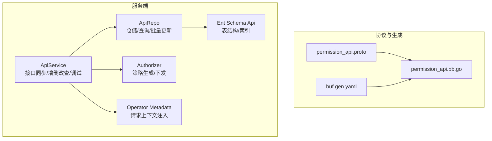
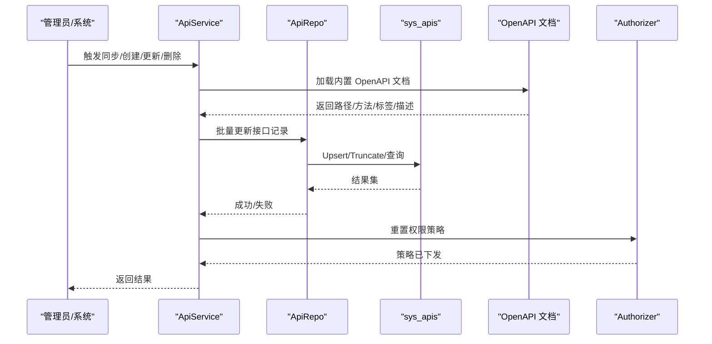
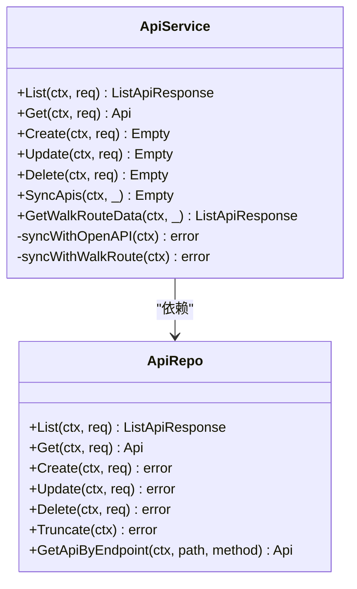
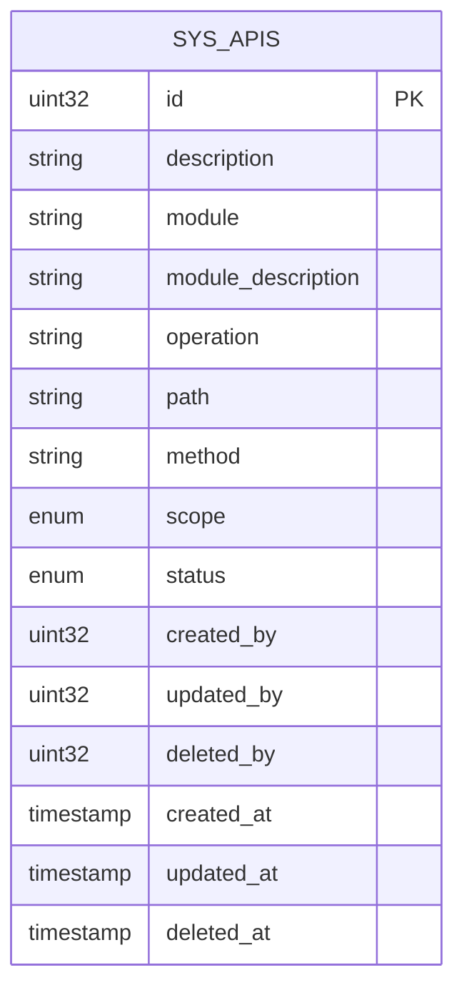
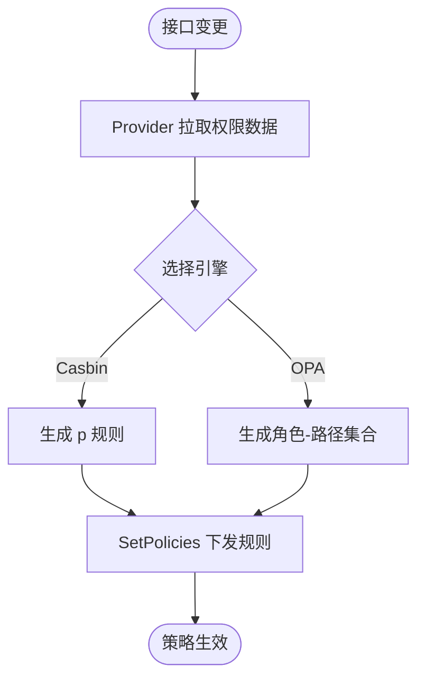
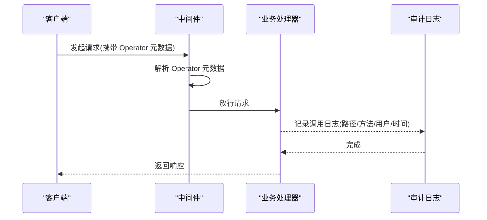
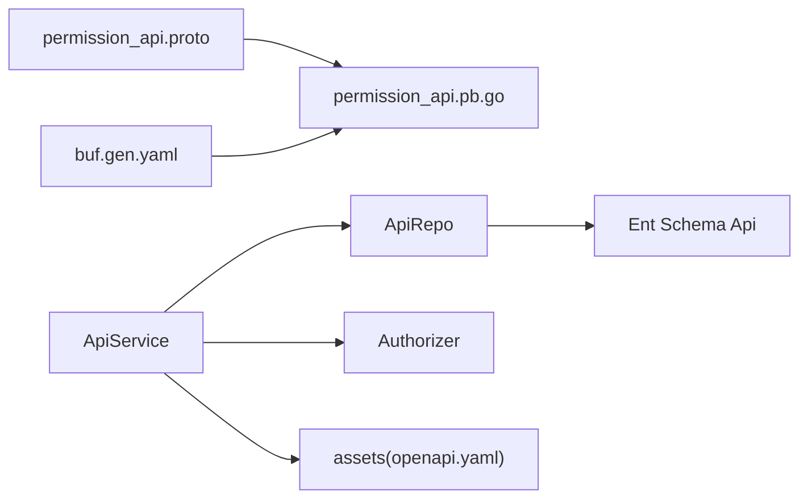

# 接口管理

<cite>
**本文引用的文件**
- [backend/app/admin/service/internal/service/api_service.go](file://backend/app/admin/service/internal/service/api_service.go)
- [backend/app/admin/service/internal/data/api_repo.go](file://backend/app/admin/service/internal/data/api_repo.go)
- [backend/app/admin/service/internal/data/ent/schema/api.go](file://backend/app/admin/service/internal/data/ent/schema/api.go)
- [backend/app/admin/service/internal/data/ent/api.go](file://backend/app/admin/service/internal/data/ent/api.go)
- [backend/app/admin/service/cmd/server/assets/assets.go](file://backend/app/admin/service/cmd/server/assets/assets.go)
- [backend/pkg/authorizer/authorizer.go](file://backend/pkg/authorizer/authorizer.go)
- [backend/pkg/metadata/metadata.go](file://backend/pkg/metadata/metadata.go)
- [backend/api/protos/permission/service/v1/permission_api.proto](file://backend/api/protos/permission/service/v1/permission_api.proto)
- [backend/api/gen/go/permission/service/v1/permission_api.pb.go](file://backend/api/gen/go/permission/service/v1/permission_api.pb.go)
- [backend/api/buf.gen.yaml](file://backend/api/buf.gen.yaml)
- [backend/README.ja-JP.md](file://backend/README.ja-JP.md)
</cite>

## 目录
1. [简介](#简介)
2. [项目结构](#项目结构)
3. [核心组件](#核心组件)
4. [架构总览](#架构总览)
5. [详细组件分析](#详细组件分析)
6. [依赖分析](#依赖分析)
7. [性能考虑](#性能考虑)
8. [故障排查指南](#故障排查指南)
9. [结论](#结论)
10. [附录](#附录)

## 简介
本文件系统性阐述接口管理功能的自动化机制与全生命周期管理，覆盖接口注册、版本控制、文档生成、测试验证、权限绑定与访问控制、调用审计、以及最佳实践与运维建议。接口管理以 OpenAPI 文档为“事实来源”，通过服务端自动同步接口清单，结合权限引擎进行策略下发与校验，形成从“接口定义—注册—授权—审计”的闭环。

## 项目结构
接口管理相关能力主要分布在以下层次：
- 协议与代码生成：基于 Protobuf 定义接口元数据与关联关系，通过 Buf 生成 Go 代码，统一包路径与插件链路。
- 数据层：Ent Schema 定义 sys_apis 表结构与唯一索引，确保接口注册幂等与去重。
- 服务层：ApiService 提供接口清单的增删改查、同步、调试导出等能力。
- 权限层：Authorizer 将角色与接口映射为策略，支持 Casbin/OPA 等引擎。
- 元数据与中间件：Operator 元数据在请求上下文中传递，便于审计与追踪。

**图表来源**
- [backend/api/protos/permission/service/v1/permission_api.proto:1-24](file://backend/api/protos/permission/service/v1/permission_api.proto#L1-L24)
- [backend/api/gen/go/permission/service/v1/permission_api.pb.go:1-148](file://backend/api/gen/go/permission/service/v1/permission_api.pb.go#L1-L148)
- [backend/api/buf.gen.yaml:1-96](file://backend/api/buf.gen.yaml#L1-L96)
- [backend/app/admin/service/internal/service/api_service.go:1-295](file://backend/app/admin/service/internal/service/api_service.go#L1-L295)
- [backend/app/admin/service/internal/data/api_repo.go:1-326](file://backend/app/admin/service/internal/data/api_repo.go#L1-L326)
- [backend/app/admin/service/internal/data/ent/schema/api.go:1-113](file://backend/app/admin/service/internal/data/ent/schema/api.go#L1-L113)
- [backend/pkg/authorizer/authorizer.go:1-241](file://backend/pkg/authorizer/authorizer.go#L1-L241)
- [backend/pkg/metadata/metadata.go:1-70](file://backend/pkg/metadata/metadata.go#L1-L70)

**章节来源**
- [backend/README.ja-JP.md:89-111](file://backend/README.ja-JP.md#L89-L111)

## 核心组件
- 接口服务(ApiService)：负责接口清单的同步、增删改查、调试导出；初始化时若数据库为空则自动同步一次；每次变更后重置权限策略。
- 接口仓储(ApiRepo)：封装 Ent 查询与更新，提供按路径+方法唯一定位、按模块/作用域过滤、分页列表、批量更新等能力。
- 数据模型(Schema)：定义 sys_apis 的字段、注释、枚举作用域 Scope、唯一索引与常用索引，保证注册幂等与高效检索。
- 权限引擎(Authorizer)：根据角色与接口映射生成策略，支持 Casbin/OPA/Noop 引擎，提供策略重载能力。
- 元数据(Metadata)：在客户端/服务端之间以 Header 方式传递 Operator 元数据，便于审计与追踪。

**章节来源**
- [backend/app/admin/service/internal/service/api_service.go:31-161](file://backend/app/admin/service/internal/service/api_service.go#L31-L161)
- [backend/app/admin/service/internal/data/api_repo.go:25-111](file://backend/app/admin/service/internal/data/api_repo.go#L25-L111)
- [backend/app/admin/service/internal/data/ent/schema/api.go:12-112](file://backend/app/admin/service/internal/data/ent/schema/api.go#L12-L112)
- [backend/pkg/authorizer/authorizer.go:18-109](file://backend/pkg/authorizer/authorizer.go#L18-L109)
- [backend/pkg/metadata/metadata.go:15-47](file://backend/pkg/metadata/metadata.go#L15-L47)

## 架构总览
接口管理的自动化流程如下：
- 文档驱动：通过内置 OpenAPI 文档解析，提取路径、方法、标签、描述、OperationID 等元信息，生成接口清单。
- 注册入库：将接口记录写入 sys_apis，利用唯一索引避免重复注册。
- 权限联动：接口变更后触发权限策略重载，使授权生效。
- 访问控制：请求进入时由中间件读取 Operator 元数据，结合权限引擎进行鉴权。
- 调试可观测：提供 WalkRoute 导出路由清单，辅助排查接口注册问题。

**图表来源**
- [backend/app/admin/service/internal/service/api_service.go:144-221](file://backend/app/admin/service/internal/service/api_service.go#L144-L221)
- [backend/app/admin/service/cmd/server/assets/assets.go:1-9](file://backend/app/admin/service/cmd/server/assets/assets.go#L1-L9)
- [backend/app/admin/service/internal/data/api_repo.go:318-326](file://backend/app/admin/service/internal/data/api_repo.go#L318-L326)
- [backend/pkg/authorizer/authorizer.go:62-109](file://backend/pkg/authorizer/authorizer.go#L62-L109)

## 详细组件分析

### 组件A：接口服务(ApiService)
职责与行为：
- 初始化自动同步：若接口表为空，启动时自动执行同步。
- 列表/详情：委托仓储完成分页与单条查询。
- 新增/更新/删除：写入操作者信息，调用仓储持久化，随后重置权限策略。
- 同步策略：
  - OpenAPI 同步：解析内置 OpenAPI 文档，遍历路径与操作，填充模块、描述、OperationID 等，批量更新。
  - 路由遍历同步：通过路由遍历器收集路由，排序后批量更新（调试用途）。
- 调试能力：导出路由遍历结果，便于核对注册情况。

**图表来源**
- [backend/app/admin/service/internal/service/api_service.go:31-295](file://backend/app/admin/service/internal/service/api_service.go#L31-L295)
- [backend/app/admin/service/internal/data/api_repo.go:25-326](file://backend/app/admin/service/internal/data/api_repo.go#L25-L326)

**章节来源**
- [backend/app/admin/service/internal/service/api_service.go:57-161](file://backend/app/admin/service/internal/service/api_service.go#L57-L161)

### 组件B：接口仓储(ApiRepo)与实体模型
- 仓储能力：
  - 分页列表、计数、单条查询、存在性检查、批量创建、更新、删除、清表。
  - 按路径+方法唯一定位接口，按模块/作用域/创建时间等维度高效检索。
- 实体模型：
  - 字段：描述、模块、模块描述、操作名、路径、方法、作用域 Scope（枚举 ADMIN/APP）、状态、创建/更新/删除时间与操作者。
  - 索引：模块+路径+方法+作用域唯一索引；模块、作用域、路径+方法、创建者+时间、创建时间等索引。
- 作用域 Scope：区分后台管理与应用侧接口，便于差异化授权与审计。

**图表来源**
- [backend/app/admin/service/internal/data/ent/schema/api.go:30-112](file://backend/app/admin/service/internal/data/ent/schema/api.go#L30-L112)
- [backend/app/admin/service/internal/data/ent/api.go:15-50](file://backend/app/admin/service/internal/data/ent/api.go#L15-L50)

**章节来源**
- [backend/app/admin/service/internal/data/api_repo.go:73-199](file://backend/app/admin/service/internal/data/api_repo.go#L73-L199)
- [backend/app/admin/service/internal/data/ent/schema/api.go:12-112](file://backend/app/admin/service/internal/data/ent/schema/api.go#L12-L112)

### 组件C：权限引擎与接口关联
- 权限策略生成：
  - Casbin：将角色-接口映射为 p 规则（角色、路径、方法、域）。
  - OPA：将角色映射为允许的路径+方法集合。
- 接口与权限的关联：
  - 通过 PermissionApi 模型表达“权限点-接口”关系（Protobuf 定义），在策略生成阶段被消费。
- 策略重载：接口变更后调用 ResetPolicies，重新拉取权限数据并下发至引擎。

**图表来源**
- [backend/pkg/authorizer/authorizer.go:62-160](file://backend/pkg/authorizer/authorizer.go#L62-L160)
- [backend/api/protos/permission/service/v1/permission_api.proto:7-23](file://backend/api/protos/permission/service/v1/permission_api.proto#L7-L23)

**章节来源**
- [backend/pkg/authorizer/authorizer.go:18-109](file://backend/pkg/authorizer/authorizer.go#L18-L109)
- [backend/api/protos/permission/service/v1/permission_api.proto:1-24](file://backend/api/protos/permission/service/v1/permission_api.proto#L1-L24)

### 组件D：元数据与调用审计
- Operator 元数据：
  - 在客户端序列化为 Header，服务端从上下文解析，用于审计与追踪。
- 审计日志：
  - 系统内含接口审计、登录审计、操作审计等多种审计日志实体，可与接口管理配合实现调用审计。

**图表来源**
- [backend/pkg/metadata/metadata.go:22-47](file://backend/pkg/metadata/metadata.go#L22-L47)

**章节来源**
- [backend/pkg/metadata/metadata.go:15-47](file://backend/pkg/metadata/metadata.go#L15-L47)

## 依赖分析
- 协议与生成：
  - permission_api.proto 定义“权限点-接口”关联模型，Buf 生成 Go 代码并设置包前缀与目录级 go_package。
- 服务与数据：
  - ApiService 依赖 ApiRepo；ApiRepo 依赖 Ent 客户端与仓储工具；Ent Schema 定义表结构与索引。
- 权限与策略：
  - Authorizer 依据 Provider 提供的数据生成策略并下发至引擎；接口变更后触发重载。
- 文档与同步：
  - ApiService 通过 assets 中的 OpenAPI 文档进行接口同步。

**图表来源**
- [backend/api/protos/permission/service/v1/permission_api.proto:1-24](file://backend/api/protos/permission/service/v1/permission_api.proto#L1-L24)
- [backend/api/gen/go/permission/service/v1/permission_api.pb.go:1-148](file://backend/api/gen/go/permission/service/v1/permission_api.pb.go#L1-L148)
- [backend/api/buf.gen.yaml:17-55](file://backend/api/buf.gen.yaml#L17-L55)
- [backend/app/admin/service/internal/service/api_service.go:164-170](file://backend/app/admin/service/internal/service/api_service.go#L164-L170)
- [backend/app/admin/service/cmd/server/assets/assets.go:5-6](file://backend/app/admin/service/cmd/server/assets/assets.go#L5-L6)

**章节来源**
- [backend/api/buf.gen.yaml:1-96](file://backend/api/buf.gen.yaml#L1-L96)
- [backend/app/admin/service/internal/service/api_service.go:164-170](file://backend/app/admin/service/internal/service/api_service.go#L164-L170)

## 性能考虑
- 唯一索引与幂等：模块+路径+方法+作用域唯一索引可有效避免重复注册，减少后续冲突与回滚成本。
- 查询优化：按模块、作用域、路径+方法、创建者+时间等索引组合，满足常见分页与过滤场景。
- 批量更新：同步阶段采用批量 Upsert，降低多次往返开销。
- 策略重载：仅在接口变更后重置策略，避免频繁重载带来的抖动。

[本节为通用指导，无需具体文件引用]

## 故障排查指南
- 同步失败
  - 现象：同步接口时报错或空文档。
  - 排查：确认内置 OpenAPI 文档存在且可加载；检查 ApiService 的 OpenAPI 加载逻辑与错误返回。
- 注册重复
  - 现象：重复注册导致唯一约束冲突。
  - 排查：检查唯一索引是否生效；确认同步策略是否正确使用 AllowMissing 或批量 Upsert。
- 权限不生效
  - 现象：接口变更后仍可访问或拒绝访问。
  - 排查：确认接口变更后是否调用了重置策略；检查 Provider 是否正确提供权限数据；查看 Authorizer 的策略生成与下发日志。
- 路由遍历异常
  - 现象：GetWalkRouteData 返回为空或不完整。
  - 排查：确认 RouteWalker 已注入；检查路由遍历回调是否被正确调用。

**章节来源**
- [backend/app/admin/service/internal/service/api_service.go:144-161](file://backend/app/admin/service/internal/service/api_service.go#L144-L161)
- [backend/app/admin/service/internal/data/ent/schema/api.go:87-111](file://backend/app/admin/service/internal/data/ent/schema/api.go#L87-L111)
- [backend/pkg/authorizer/authorizer.go:62-109](file://backend/pkg/authorizer/authorizer.go#L62-L109)

## 结论
接口管理以 OpenAPI 为“事实来源”，通过 ApiService 自动同步接口清单，结合 ApiRepo 的幂等写入与丰富索引，保障注册的准确性与可检索性；配合 Authorizer 的策略生成与重载，实现接口与权限的强关联；借助 Operator 元数据与审计日志，形成完整的调用审计闭环。整体设计具备良好的扩展性与可维护性。

[本节为总结，无需具体文件引用]

## 附录

### 接口生命周期管理
- 定义：在 OpenAPI 文档中定义接口路径、方法、标签、描述、OperationID 等元信息。
- 注册：通过 ApiService 同步或手动创建，写入 sys_apis 并建立唯一索引。
- 变更：更新接口描述、模块、作用域等，仓储自动处理更新掩码与审计字段。
- 废弃：删除接口记录，重置权限策略，确保不再授予对应权限。

**章节来源**
- [backend/app/admin/service/internal/service/api_service.go:76-142](file://backend/app/admin/service/internal/service/api_service.go#L76-L142)
- [backend/app/admin/service/internal/data/api_repo.go:256-298](file://backend/app/admin/service/internal/data/api_repo.go#L256-L298)

### 接口与权限系统关联机制
- 关联模型：PermissionApi 表达“权限点-接口”关系，作为策略生成的数据源之一。
- 授权策略：Casbin/OPA 将角色与接口映射为策略；接口变更后重置策略，确保即时生效。
- 访问控制：中间件读取 Operator 元数据，结合策略进行鉴权。

**章节来源**
- [backend/api/protos/permission/service/v1/permission_api.proto:7-23](file://backend/api/protos/permission/service/v1/permission_api.proto#L7-L23)
- [backend/pkg/authorizer/authorizer.go:111-160](file://backend/pkg/authorizer/authorizer.go#L111-L160)
- [backend/pkg/metadata/metadata.go:22-47](file://backend/pkg/metadata/metadata.go#L22-L47)

### 接口数据模型设计
- 元数据：描述、模块、模块描述、操作名、路径、方法、作用域 Scope、状态。
- 参数定义：由 OpenAPI 文档定义，ApiService 解析后写入。
- 响应格式：统一使用资源对象 Api，支持分页、更新掩码、空响应等。

**章节来源**
- [backend/app/admin/service/internal/data/ent/schema/api.go:30-71](file://backend/app/admin/service/internal/data/ent/schema/api.go#L30-L71)
- [backend/app/admin/service/internal/service/api_service.go:184-221](file://backend/app/admin/service/internal/service/api_service.go#L184-L221)

### 最佳实践
- 命名规范：接口路径与方法组合需唯一；模块标签清晰，便于分类与检索。
- 版本演进：通过作用域 Scope 区分 Admin/App，避免跨域冲突；变更时使用更新掩码最小化写入。
- 兼容性：保留历史接口记录，新增接口采用新路径/新方法，旧接口标记为废弃并逐步迁移。
- 测试与验证：使用 GetWalkRouteData 导出路由清单进行回归测试；结合审计日志核对调用轨迹。

**章节来源**
- [backend/app/admin/service/internal/service/api_service.go:267-294](file://backend/app/admin/service/internal/service/api_service.go#L267-L294)
- [backend/app/admin/service/internal/data/ent/schema/api.go:87-111](file://backend/app/admin/service/internal/data/ent/schema/api.go#L87-L111)

### 接口测试、调试与监控
- 测试：通过 GetWalkRouteData 获取路由清单，比对期望接口是否存在；使用分页与过滤参数验证检索性能。
- 调试：启用 ApiService 的调试模式（仓储 Debug），观察 SQL 与更新细节；检查 OpenAPI 文档加载与解析过程。
- 监控：关注接口同步耗时、策略重载次数与成功率；结合审计日志统计接口调用量与错误率。

**章节来源**
- [backend/app/admin/service/internal/service/api_service.go:267-294](file://backend/app/admin/service/internal/service/api_service.go#L267-L294)
- [backend/app/admin/service/internal/data/api_repo.go:278-297](file://backend/app/admin/service/internal/data/api_repo.go#L278-L297)