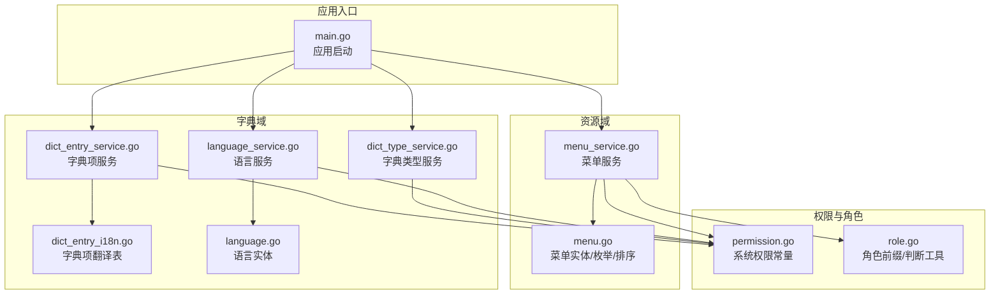
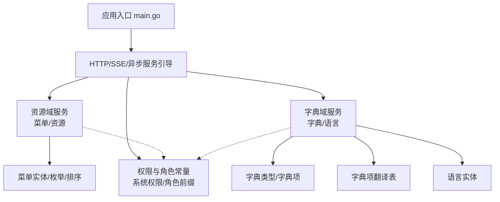
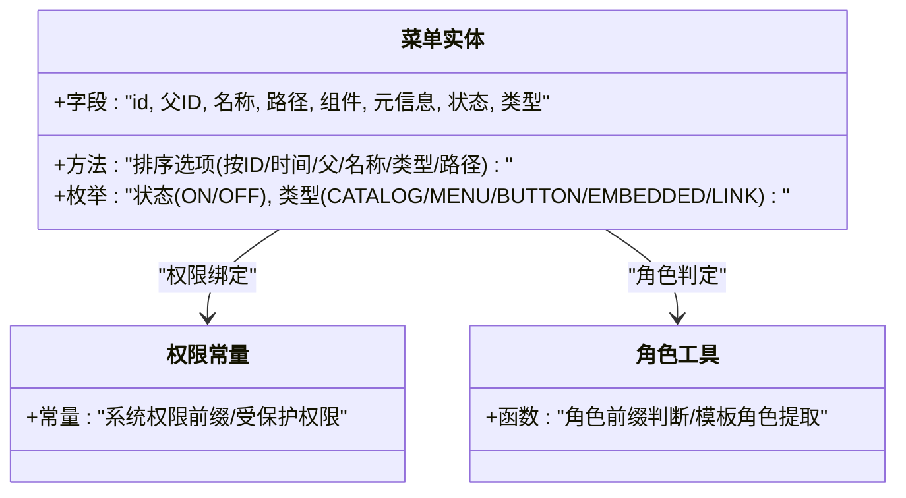
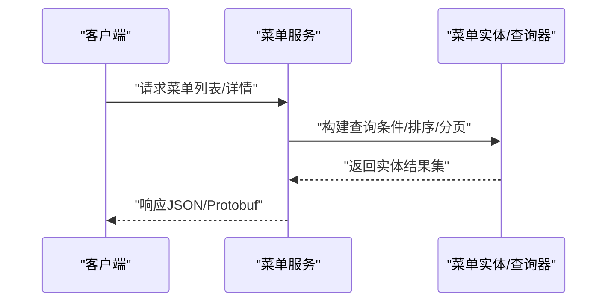
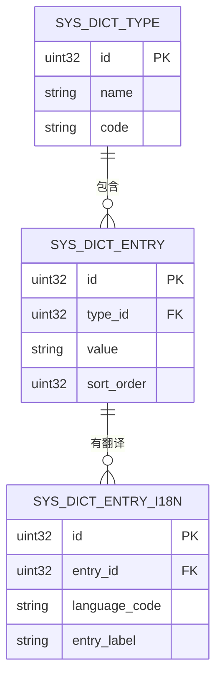
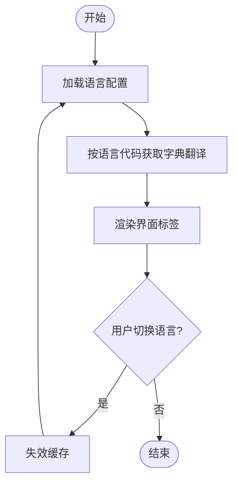
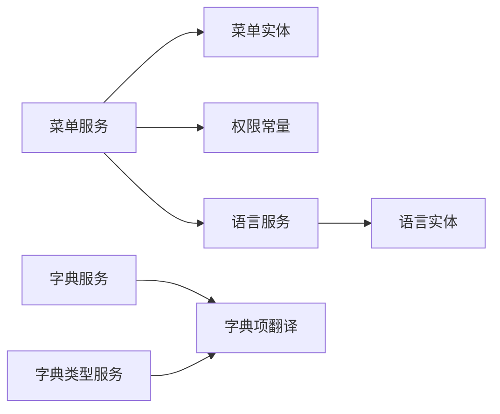

# 系统功能管理

<cite>
**本文引用的文件**
- [main.go](file://backend/app/admin/service/cmd/server/main.go)
- [permission.go](file://backend/pkg/constants/permission.go)
- [role.go](file://backend/pkg/constants/role.go)
- [menu.go](file://backend/app/admin/service/internal/data/ent/menu/menu.go)
- [dict_entry_i18n.go](file://backend/app/admin/service/internal/data/ent/schema/dict_entry_i18n.go)
- [language.go](file://backend/app/admin/service/internal/data/ent/language.go)
- [menu_service.go](file://backend/app/admin/service/internal/service/menu_service.go)
- [dict_entry_service.go](file://backend/app/admin/service/internal/service/dict_entry_service.go)
- [dict_type_service.go](file://backend/app/admin/service/internal/service/dict_type_service.go)
- [language_service.go](file://backend/app/admin/service/internal/service/language_service.go)
</cite>

## 目录
1. [简介](#简介)
2. [项目结构](#项目结构)
3. [核心组件](#核心组件)
4. [架构总览](#架构总览)
5. [详细组件分析](#详细组件分析)
6. [依赖分析](#依赖分析)
7. [性能考虑](#性能考虑)
8. [故障排查指南](#故障排查指南)
9. [结论](#结论)
10. [附录](#附录)

## 简介
本文件聚焦于系统功能管理模块，围绕菜单管理、接口管理、字典管理与语言国际化展开，系统性梳理其数据模型、服务层实现、权限与角色体系、以及前端路由与元数据映射关系。同时给出接口管理的自动化机制、字典系统的分类与国际化、语言切换与本地化适配流程，并总结系统配置的最佳实践。

## 项目结构
后端采用 Kratos 应用框架，入口通过引导程序启动 HTTP、异步队列与 SSE 服务；功能管理相关能力由资源与权限两大子域提供：菜单与资源定义在资源域，字典与语言在字典域，权限与角色在权限域。各领域通过 Protobuf 定义接口契约，服务层封装业务逻辑，数据层使用 Ent ORM 生成实体与查询器。

**图示来源**
- [main.go:1-76](file://backend/app/admin/service/cmd/server/main.go#L1-L76)
- [menu_service.go](file://backend/app/admin/service/internal/service/menu_service.go)
- [menu.go:1-277](file://backend/app/admin/service/internal/data/ent/menu/menu.go#L1-L277)
- [dict_entry_service.go](file://backend/app/admin/service/internal/service/dict_entry_service.go)
- [dict_type_service.go](file://backend/app/admin/service/internal/service/dict_type_service.go)
- [dict_entry_i18n.go:1-76](file://backend/app/admin/service/internal/data/ent/schema/dict_entry_i18n.go#L1-L76)
- [language_service.go](file://backend/app/admin/service/internal/service/language_service.go)
- [language.go:1-267](file://backend/app/admin/service/internal/data/ent/language.go#L1-L267)
- [permission.go:1-39](file://backend/pkg/constants/permission.go#L1-L39)
- [role.go:1-49](file://backend/pkg/constants/role.go#L1-L49)

**章节来源**
- [main.go:1-76](file://backend/app/admin/service/cmd/server/main.go#L1-L76)

## 核心组件
- 菜单管理：基于树形结构的菜单实体，支持目录、菜单、按钮、内嵌页面、外链等类型，具备状态、路径、重定向、别名、组件、元信息等字段，支持父子关系与排序。
- 字典管理：字典类型与字典项分离，字典项支持多语言翻译，翻译表包含语言代码与显示标签，支持租户隔离与排序。
- 语言国际化：语言实体包含标准语言代码、名称、本地名、是否默认、排序等，支持启用/禁用与默认语言标记。
- 权限与角色：系统权限常量与受保护权限集合，角色前缀与判断工具，用于菜单与接口权限绑定及角色授权。

**章节来源**
- [menu.go:105-158](file://backend/app/admin/service/internal/data/ent/menu/menu.go#L105-L158)
- [dict_entry_i18n.go:30-66](file://backend/app/admin/service/internal/data/ent/schema/dict_entry_i18n.go#L30-L66)
- [language.go:15-46](file://backend/app/admin/service/internal/data/ent/language.go#L15-L46)
- [permission.go:1-39](file://backend/pkg/constants/permission.go#L1-L39)
- [role.go:1-49](file://backend/pkg/constants/role.go#L1-L49)

## 架构总览
系统功能管理以“领域服务 + 数据模型 + 权限常量”为核心，形成清晰的职责边界。菜单与资源通过资源服务暴露，字典与语言通过字典服务暴露，权限与角色通过常量与工具函数贯穿到菜单与接口层面。

**图示来源**
- [main.go:46-76](file://backend/app/admin/service/cmd/server/main.go#L46-L76)
- [menu.go:1-277](file://backend/app/admin/service/internal/data/ent/menu/menu.go#L1-L277)
- [dict_entry_i18n.go:1-76](file://backend/app/admin/service/internal/data/ent/schema/dict_entry_i18n.go#L1-L76)
- [language.go:1-267](file://backend/app/admin/service/internal/data/ent/language.go#L1-L267)
- [permission.go:1-39](file://backend/pkg/constants/permission.go#L1-L39)
- [role.go:1-49](file://backend/pkg/constants/role.go#L1-L49)

## 详细组件分析

### 菜单管理系统
- 层级结构设计
  - 菜单实体具备父子关系字段，支持自关联树形结构；提供多种排序选项，便于按不同维度排序。
  - 类型枚举覆盖目录、菜单、按钮、内嵌页面、外链，满足前端路由与权限控制需求。
  - 元信息字段用于承载前端路由元数据，如图标、标题、隐藏等。
- 路由映射与权限绑定
  - 菜单类型与路由组件字段配合，可直接映射到前端路由配置。
  - 权限常量与角色工具用于菜单可见性与操作权限判定。
- 图标配置与状态管理
  - 元信息中可扩展图标字段；状态枚举支持启用/停用，便于快速上下线菜单。

**图示来源**
- [menu.go:105-158](file://backend/app/admin/service/internal/data/ent/menu/menu.go#L105-L158)
- [menu.go:160-277](file://backend/app/admin/service/internal/data/ent/menu/menu.go#L160-L277)
- [permission.go:1-39](file://backend/pkg/constants/permission.go#L1-L39)
- [role.go:27-49](file://backend/pkg/constants/role.go#L27-L49)

**章节来源**
- [menu.go:12-84](file://backend/app/admin/service/internal/data/ent/menu/menu.go#L12-L84)
- [menu.go:105-158](file://backend/app/admin/service/internal/data/ent/menu/menu.go#L105-L158)
- [menu.go:160-277](file://backend/app/admin/service/internal/data/ent/menu/menu.go#L160-L277)
- [permission.go:1-39](file://backend/pkg/constants/permission.go#L1-L39)
- [role.go:1-49](file://backend/pkg/constants/role.go#L1-L49)

### 接口管理自动化机制
- 接口注册与版本控制
  - 基于 Protobuf 定义接口契约，服务端通过生成的 HTTP/GRPC 适配器暴露接口；版本通过目录命名区分（如 v1）。
- 文档生成与测试验证
  - 通过生成的 OpenAPI 配置与工具链生成接口文档；结合单元测试与集成测试保障接口质量。
- 控制流示意

**图示来源**
- [menu_service.go](file://backend/app/admin/service/internal/service/menu_service.go)
- [menu.go:160-277](file://backend/app/admin/service/internal/data/ent/menu/menu.go#L160-L277)

**章节来源**
- [menu_service.go](file://backend/app/admin/service/internal/service/menu_service.go)
- [menu.go:160-277](file://backend/app/admin/service/internal/data/ent/menu/menu.go#L160-L277)

### 字典系统分类管理
- 字典类型与字典项
  - 字典类型用于归类字典项；字典项通过翻译表支持多语言显示标签。
- 国际化支持
  - 翻译表包含语言代码与显示标签，支持按语言代码检索与渲染。
- 缓存机制
  - 可在服务层对常用字典项与翻译进行缓存，降低数据库压力；变更时执行失效策略。

**图示来源**
- [dict_entry_i18n.go:30-66](file://backend/app/admin/service/internal/data/ent/schema/dict_entry_i18n.go#L30-L66)

**章节来源**
- [dict_entry_i18n.go:13-76](file://backend/app/admin/service/internal/data/ent/schema/dict_entry_i18n.go#L13-L76)

### 语言国际化工作流程
- 多语言配置
  - 语言实体包含标准语言代码、名称、本地名、是否默认与排序，支持启用/禁用与默认标记。
- 翻译管理与语言切换
  - 字典项翻译表与语言实体协同，前端根据当前语言代码加载对应标签；语言切换时刷新翻译缓存。
- 本地化适配
  - 通过语言代码与区域设置，适配日期、数字、货币等格式。

**图示来源**
- [language.go:15-46](file://backend/app/admin/service/internal/data/ent/language.go#L15-L46)
- [dict_entry_i18n.go:30-66](file://backend/app/admin/service/internal/data/ent/schema/dict_entry_i18n.go#L30-L66)

**章节来源**
- [language.go:15-46](file://backend/app/admin/service/internal/data/ent/language.go#L15-L46)
- [language_service.go](file://backend/app/admin/service/internal/service/language_service.go)

## 依赖分析
- 组件耦合
  - 菜单服务依赖菜单实体与权限常量；字典服务依赖字典类型/字典项与翻译表；语言服务依赖语言实体。
- 外部依赖
  - Kratos 引导与传输层；Ent ORM 生成的数据访问层；Protobuf 生成的接口适配器。

**图示来源**
- [menu_service.go](file://backend/app/admin/service/internal/service/menu_service.go)
- [menu.go:1-277](file://backend/app/admin/service/internal/data/ent/menu/menu.go#L1-L277)
- [permission.go:1-39](file://backend/pkg/constants/permission.go#L1-L39)
- [dict_entry_service.go](file://backend/app/admin/service/internal/service/dict_entry_service.go)
- [dict_type_service.go](file://backend/app/admin/service/internal/service/dict_type_service.go)
- [dict_entry_i18n.go:1-76](file://backend/app/admin/service/internal/data/ent/schema/dict_entry_i18n.go#L1-L76)
- [language_service.go](file://backend/app/admin/service/internal/service/language_service.go)
- [language.go:1-267](file://backend/app/admin/service/internal/data/ent/language.go#L1-L267)

**章节来源**
- [menu_service.go](file://backend/app/admin/service/internal/service/menu_service.go)
- [dict_entry_service.go](file://backend/app/admin/service/internal/service/dict_entry_service.go)
- [dict_type_service.go](file://backend/app/admin/service/internal/service/dict_type_service.go)
- [language_service.go](file://backend/app/admin/service/internal/service/language_service.go)

## 性能考虑
- 查询优化
  - 利用实体提供的排序选项与索引字段，避免全表扫描；对高频查询建立复合索引。
- 缓存策略
  - 对字典项与翻译、语言配置进行缓存；变更时采用失效策略或渐进式更新。
- 分页与批量
  - 列表查询采用分页；批量导入/导出字典项时采用事务与批处理。

## 故障排查指南
- 菜单异常
  - 检查菜单类型与路由组件配置是否匹配；确认状态与权限判定逻辑。
- 字典翻译缺失
  - 校验语言代码是否正确；检查翻译表记录是否存在；确认缓存是否命中。
- 语言切换无效
  - 检查语言实体默认标记与启用状态；核对前端语言代码与后端存储一致性。

## 结论
系统功能管理模块以清晰的领域划分与实体模型为基础，结合权限与角色常量，实现了菜单、字典与语言的完整闭环。通过 Protobuf 与生成代码，接口管理具备良好的自动化与可维护性；字典与语言的国际化设计兼顾扩展性与性能。建议在生产环境中完善缓存与版本治理策略，确保系统稳定与可演进。

## 附录
- 最佳实践
  - 配置中心：集中管理环境变量与开关；支持灰度发布。
  - 热更新：字典与语言配置支持热加载；菜单权限变更即时生效。
  - 版本兼容：接口版本化与向后兼容；迁移脚本与回滚预案。
  - 回滚策略：基于版本号与变更记录的快速回滚；监控告警与自动恢复。