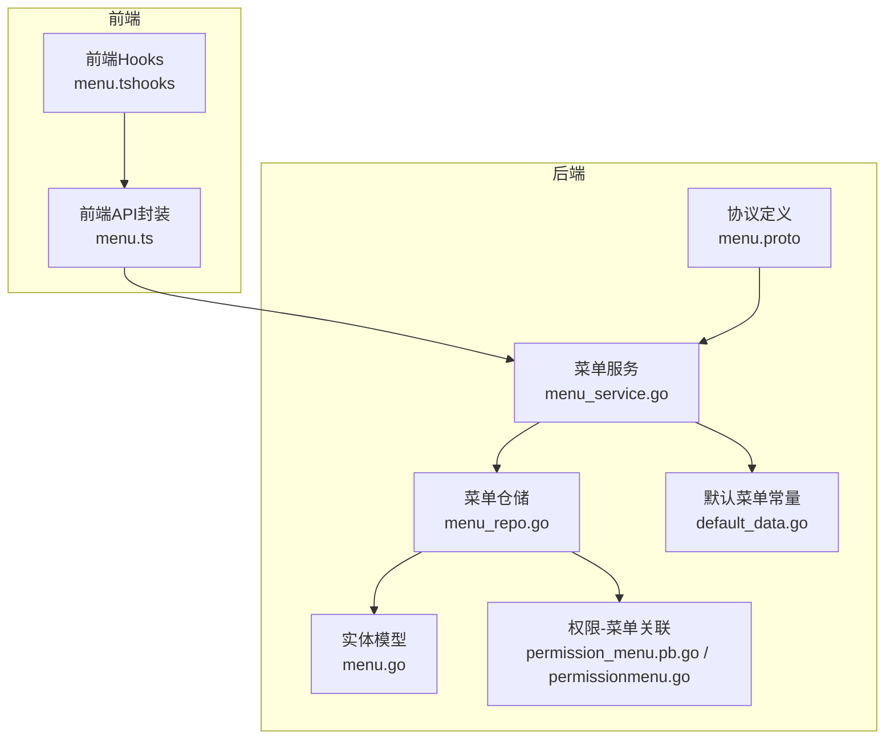
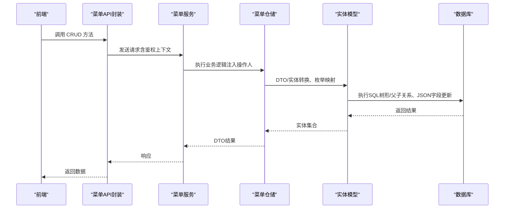
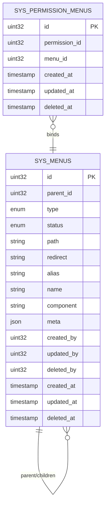
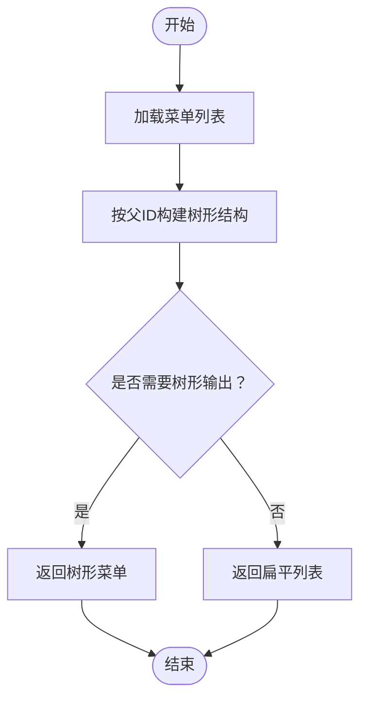
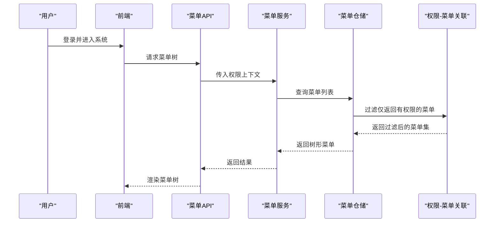
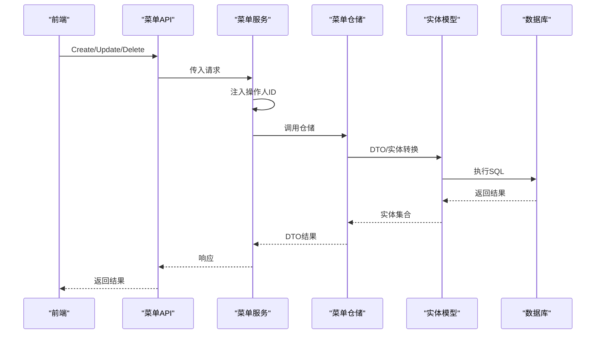
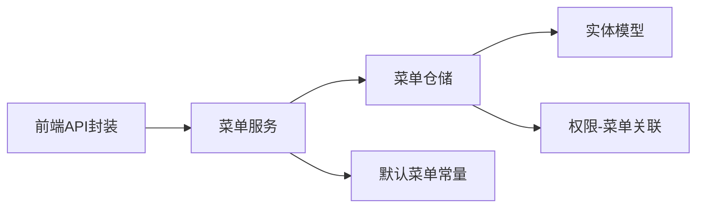

# 菜单管理

<cite>
**本文引用的文件**
- [menu.proto](file://backend/api/protos/resource/service/v1/menu.proto)
- [menu_repo.go](file://backend/app/admin/service/internal/data/menu_repo.go)
- [menu.go](file://backend/app/admin/service/internal/data/ent/menu.go)
- [menu_service.go](file://backend/app/admin/service/internal/service/menu_service.go)
- [default_data.go](file://backend/pkg/constants/default_data.go)
- [permission_menu.pb.go](file://backend/api/gen/go/permission/service/v1/permission_menu.pb.go)
- [permissionmenu.go](file://backend/app/admin/service/internal/data/ent/permissionmenu/permissionmenu.go)
- [menu.ts](file://frontend/admin/react/src/api/service/menu.ts)
- [menu.ts（hooks）](file://frontend/admin/react/src/api/hooks/menu.ts)
</cite>

## 目录
1. [简介](#简介)
2. [项目结构](#项目结构)
3. [核心组件](#核心组件)
4. [架构总览](#架构总览)
5. [详细组件分析](#详细组件分析)
6. [依赖分析](#依赖分析)
7. [性能考虑](#性能考虑)
8. [故障排查指南](#故障排查指南)
9. [结论](#结论)
10. [附录](#附录)

## 简介
本文件系统性阐述菜单管理功能的完整实现，覆盖菜单的CRUD能力、层级结构设计、排序与显示控制、与权限系统的集成方式、数据模型与约束、以及最佳实践与性能优化建议。读者可据此快速理解并高效使用菜单管理模块。

## 项目结构
菜单管理涉及后端协议定义、仓储层、服务层、实体映射、权限关联以及前端调用与展示。整体分层清晰，职责明确：
- 协议层：定义菜单的请求/响应消息与元信息结构
- 仓储层：封装数据库访问、树形构建、父子关系维护
- 服务层：处理业务逻辑、鉴权上下文注入、默认菜单初始化
- 权限集成：通过权限-菜单关联表实现访问控制
- 前端层：提供菜单列表、增删改查的API封装与React Hooks

图表来源
- [menu_service.go:22-139](file://backend/app/admin/service/internal/service/menu_service.go#L22-L139)
- [menu_repo.go:27-136](file://backend/app/admin/service/internal/data/menu_repo.go#L27-L136)
- [menu.go:17-90](file://backend/app/admin/service/internal/data/ent/menu.go#L17-L90)
- [menu.proto:15-125](file://backend/api/protos/resource/service/v1/menu.proto#L15-L125)
- [permission_menu.pb.go:25-33](file://backend/api/gen/go/permission/service/v1/permission_menu.pb.go#L25-L33)
- [permissionmenu.go:9-32](file://backend/app/admin/service/internal/data/ent/permissionmenu/permissionmenu.go#L9-L32)
- [default_data.go:277-790](file://backend/pkg/constants/default_data.go#L277-L790)
- [menu.ts:1-38](file://frontend/admin/react/src/api/service/menu.ts#L1-L38)
- [menu.ts（hooks）:1-69](file://frontend/admin/react/src/api/hooks/menu.ts#L1-L69)

章节来源
- [menu_service.go:22-139](file://backend/app/admin/service/internal/service/menu_service.go#L22-L139)
- [menu_repo.go:27-136](file://backend/app/admin/service/internal/data/menu_repo.go#L27-L136)
- [menu.go:17-90](file://backend/app/admin/service/internal/data/ent/menu.go#L17-L90)
- [menu.proto:15-125](file://backend/api/protos/resource/service/v1/menu.proto#L15-L125)
- [permission_menu.pb.go:25-33](file://backend/api/gen/go/permission/service/v1/permission_menu.pb.go#L25-L33)
- [permissionmenu.go:9-32](file://backend/app/admin/service/internal/data/ent/permissionmenu/permissionmenu.go#L9-L32)
- [default_data.go:277-790](file://backend/pkg/constants/default_data.go#L277-L790)
- [menu.ts:1-38](file://frontend/admin/react/src/api/service/menu.ts#L1-L38)
- [menu.ts（hooks）:1-69](file://frontend/admin/react/src/api/hooks/menu.ts#L1-L69)

## 核心组件
- 协议与消息
  - 菜单服务接口：提供列表、计数、详情、创建、更新、删除等RPC
  - 菜单消息：包含类型、状态、路由路径、重定向、别名、命名、组件、元信息、父子关系、审计字段等
  - 元信息消息：包含图标、标题、权限列表、徽标、隐藏策略、KeepAlive、外链等
- 仓储层
  - 列表与分页：支持树形遍历构建
  - CRUD：创建、更新（含部分字段更新）、删除（级联删除子节点）
  - 枚举转换：状态、类型枚举在DTO与实体间双向转换
  - JSON字段更新：对元信息进行细粒度字段更新
- 服务层
  - 初始化默认菜单：系统首次启动时自动写入默认菜单
  - 操作人注入：从鉴权上下文中提取操作人ID，填充创建/更新审计字段
- 权限集成
  - 权限-菜单关联：通过独立表记录权限点与菜单的绑定关系
  - 访问控制：菜单元信息中的权限列表用于前端/后端访问控制
- 前端
  - API封装：统一的菜单CRUD客户端方法
  - Hooks：基于React Query的查询、变更封装

章节来源
- [menu.proto:15-125](file://backend/api/protos/resource/service/v1/menu.proto#L15-L125)
- [menu_repo.go:76-136](file://backend/app/admin/service/internal/data/menu_repo.go#L76-L136)
- [menu_repo.go:171-202](file://backend/app/admin/service/internal/data/menu_repo.go#L171-L202)
- [menu_repo.go:204-260](file://backend/app/admin/service/internal/data/menu_repo.go#L204-L260)
- [menu_repo.go:277-307](file://backend/app/admin/service/internal/data/menu_repo.go#L277-L307)
- [menu_service.go:41-46](file://backend/app/admin/service/internal/service/menu_service.go#L41-L46)
- [menu_service.go:68-112](file://backend/app/admin/service/internal/service/menu_service.go#L68-L112)
- [permission_menu.pb.go:25-33](file://backend/api/gen/go/permission/service/v1/permission_menu.pb.go#L25-L33)
- [permissionmenu.go:9-32](file://backend/app/admin/service/internal/data/ent/permissionmenu/permissionmenu.go#L9-L32)
- [menu.ts:1-38](file://frontend/admin/react/src/api/service/menu.ts#L1-L38)
- [menu.ts（hooks）:1-69](file://frontend/admin/react/src/api/hooks/menu.ts#L1-L69)

## 架构总览
菜单管理采用“协议-服务-仓储-实体”的分层架构，配合权限-菜单关联实现灵活的访问控制。前端通过生成的客户端发起请求，后端完成鉴权、数据转换与持久化。

图表来源
- [menu_service.go:68-112](file://backend/app/admin/service/internal/service/menu_service.go#L68-L112)
- [menu_repo.go:171-202](file://backend/app/admin/service/internal/data/menu_repo.go#L171-L202)
- [menu_repo.go:204-260](file://backend/app/admin/service/internal/data/menu_repo.go#L204-L260)
- [menu_repo.go:277-307](file://backend/app/admin/service/internal/data/menu_repo.go#L277-L307)
- [menu.go:17-90](file://backend/app/admin/service/internal/data/ent/menu.go#L17-L90)
- [menu.ts:1-38](file://frontend/admin/react/src/api/service/menu.ts#L1-L38)

## 详细组件分析

### 数据模型与字段定义
- 菜单实体字段
  - 基础字段：ID、创建/更新/删除时间与用户、备注
  - 关系字段：父节点ID、子节点集合
  - 类型与状态：类型（目录/菜单/按钮/内嵌/外链）、状态（启用/禁用）
  - 路由字段：路径、重定向、别名、命名、组件
  - 元信息：JSON结构，包含图标、标题、权限列表、徽标、隐藏策略、KeepAlive、外链等
- 索引与约束
  - 实体层通过Ent框架生成列与校验
  - 关系边：父子边（O2M），支持延迟加载与树形查询
  - 权限-菜单关联表：独立表存储权限点与菜单的多对多关系
- 默认菜单
  - 系统初始化时写入大量默认菜单，覆盖仪表盘、租户管理、组织人事、权限、内部消息、日志审计、系统设置等模块

图表来源
- [menu.go:17-90](file://backend/app/admin/service/internal/data/ent/menu.go#L17-L90)
- [permissionmenu.go:9-32](file://backend/app/admin/service/internal/data/ent/permissionmenu/permissionmenu.go#L9-L32)
- [menu.proto:36-125](file://backend/api/protos/resource/service/v1/menu.proto#L36-L125)

章节来源
- [menu.go:17-90](file://backend/app/admin/service/internal/data/ent/menu.go#L17-L90)
- [menu.proto:36-125](file://backend/api/protos/resource/service/v1/menu.proto#L36-L125)
- [permissionmenu.go:9-32](file://backend/app/admin/service/internal/data/ent/permissionmenu/permissionmenu.go#L9-L32)
- [default_data.go:277-790](file://backend/pkg/constants/default_data.go#L277-L790)

### 层级结构与排序规则
- 父子关系
  - 通过父节点ID与子节点集合实现层级
  - 支持树形遍历构建，便于前后端渲染
- 排序规则
  - 元信息中提供排序编号字段，用于路由到菜单的排序
- 显示控制
  - 元信息包含多种隐藏策略：隐藏菜单、隐藏面包屑、隐藏标签页、固定标签页、标签页最大打开数量等
  - 可通过布尔字段控制是否KeepAlive、是否在新窗口打开、是否忽略权限等

图表来源
- [menu_repo.go:91-136](file://backend/app/admin/service/internal/data/menu_repo.go#L91-L136)
- [menu.go:61-90](file://backend/app/admin/service/internal/data/ent/menu.go#L61-L90)

章节来源
- [menu_repo.go:91-136](file://backend/app/admin/service/internal/data/menu_repo.go#L91-L136)
- [menu.go:61-90](file://backend/app/admin/service/internal/data/ent/menu.go#L61-L90)

### 权限系统集成
- 权限-菜单关联
  - 通过独立表记录权限点与菜单的绑定关系
  - 支持按菜单ID或权限ID查询
- 访问控制
  - 菜单元信息包含权限列表字段，用于前端/后端访问控制
  - 默认数据中为多个菜单配置了权限列表，确保不同角色可见不同的菜单
- 动态菜单生成
  - 结合用户权限，后端可按权限过滤生成动态菜单树

图表来源
- [permission_menu.pb.go:25-33](file://backend/api/gen/go/permission/service/v1/permission_menu.pb.go#L25-L33)
- [permissionmenu.go:9-32](file://backend/app/admin/service/internal/data/ent/permissionmenu/permissionmenu.go#L9-L32)
- [default_data.go:78-168](file://backend/pkg/constants/default_data.go#L78-L168)

章节来源
- [permission_menu.pb.go:25-33](file://backend/api/gen/go/permission/service/v1/permission_menu.pb.go#L25-L33)
- [permissionmenu.go:9-32](file://backend/app/admin/service/internal/data/ent/permissionmenu/permissionmenu.go#L9-L32)
- [default_data.go:78-168](file://backend/pkg/constants/default_data.go#L78-L168)

### CRUD流程与实现要点
- 创建
  - 服务层注入创建人ID
  - 仓储层执行插入，支持指定ID（如需）
- 查询
  - 支持按ID查询与分页列表
  - 支持树形遍历
- 更新
  - 支持部分字段更新（FieldMask）
  - 对元信息进行细粒度JSON字段更新与清空
- 删除
  - 支持级联删除子节点（递归查询并删除）

图表来源
- [menu_service.go:68-112](file://backend/app/admin/service/internal/service/menu_service.go#L68-L112)
- [menu_repo.go:171-202](file://backend/app/admin/service/internal/data/menu_repo.go#L171-L202)
- [menu_repo.go:204-260](file://backend/app/admin/service/internal/data/menu_repo.go#L204-L260)
- [menu_repo.go:277-307](file://backend/app/admin/service/internal/data/menu_repo.go#L277-L307)
- [menu.go:17-90](file://backend/app/admin/service/internal/data/ent/menu.go#L17-L90)

章节来源
- [menu_service.go:68-112](file://backend/app/admin/service/internal/service/menu_service.go#L68-L112)
- [menu_repo.go:171-202](file://backend/app/admin/service/internal/data/menu_repo.go#L171-L202)
- [menu_repo.go:204-260](file://backend/app/admin/service/internal/data/menu_repo.go#L204-L260)
- [menu_repo.go:277-307](file://backend/app/admin/service/internal/data/menu_repo.go#L277-L307)
- [menu.go:17-90](file://backend/app/admin/service/internal/data/ent/menu.go#L17-L90)

### 前端调用与最佳实践
- API封装
  - 提供列表、详情、创建、更新、删除的统一方法
- Hooks
  - 基于React Query的查询与变更封装，支持分页、缓存与重试
- 最佳实践
  - 使用FieldMask进行部分更新，减少无效字段写入
  - 树形菜单优先使用后端构建，避免前端重复计算
  - 权限控制建议结合后端过滤与前端展示策略

章节来源
- [menu.ts:1-38](file://frontend/admin/react/src/api/service/menu.ts#L1-L38)
- [menu.ts（hooks）:1-69](file://frontend/admin/react/src/api/hooks/menu.ts#L1-L69)

## 依赖分析
- 组件耦合
  - 服务层依赖仓储层；仓储层依赖实体模型与权限关联表
  - 前端仅依赖生成的API封装，降低耦合
- 外部依赖
  - Ent ORM、Kratos框架、Protobuf生成代码
- 潜在循环依赖
  - 未见循环依赖迹象，分层清晰

图表来源
- [menu_service.go:22-139](file://backend/app/admin/service/internal/service/menu_service.go#L22-L139)
- [menu_repo.go:27-136](file://backend/app/admin/service/internal/data/menu_repo.go#L27-L136)
- [menu.go:17-90](file://backend/app/admin/service/internal/data/ent/menu.go#L17-L90)
- [permissionmenu.go:9-32](file://backend/app/admin/service/internal/data/ent/permissionmenu/permissionmenu.go#L9-L32)
- [default_data.go:277-790](file://backend/pkg/constants/default_data.go#L277-L790)
- [menu.ts:1-38](file://frontend/admin/react/src/api/service/menu.ts#L1-L38)

## 性能考虑
- 查询优化
  - 列表查询支持分页与条件筛选，建议结合索引字段（如父ID、状态、类型）进行过滤
  - 树形构建建议在后端一次性完成，避免多次往返
- 更新策略
  - 部分字段更新（FieldMask）减少写放大
  - JSON字段更新采用细粒度更新，避免整段JSON重写
- 缓存策略
  - 前端对菜单树进行缓存，结合权限上下文变化进行失效
  - 后端可对热点菜单进行轻量缓存（需注意并发一致性）
- 删除策略
  - 级联删除子节点时建议批量执行，减少事务开销

## 故障排查指南
- 常见错误
  - 参数非法：请求参数为空或缺失必填字段
  - 查询失败：数据库连接异常或SQL执行错误
  - 更新失败：字段映射或枚举转换异常
- 定位方法
  - 查看服务层日志与错误码
  - 检查仓储层的SQL执行与返回
  - 核对前端请求参数与FieldMask
- 建议
  - 在服务层统一捕获并记录错误
  - 对关键路径增加超时与重试
  - 对权限过滤失败的情况，提供降级菜单回退

章节来源
- [menu_service.go:68-112](file://backend/app/admin/service/internal/service/menu_service.go#L68-L112)
- [menu_repo.go:76-89](file://backend/app/admin/service/internal/data/menu_repo.go#L76-L89)
- [menu_repo.go:149-169](file://backend/app/admin/service/internal/data/menu_repo.go#L149-L169)

## 结论
菜单管理模块以清晰的分层架构实现了完整的CRUD能力与灵活的层级结构，结合权限-菜单关联提供了完善的访问控制。通过默认菜单初始化、部分字段更新、树形构建与前端缓存等手段，兼顾了易用性与性能。建议在实际项目中遵循本文的最佳实践，确保菜单系统的稳定与可扩展。

## 附录
- 使用场景示例
  - 新增模块菜单：先创建目录节点，再创建菜单节点，设置元信息与权限
  - 修改按钮权限：通过部分字段更新调整元信息中的权限列表
  - 删除模块：调用删除接口，系统自动级联删除子节点
- 相关文件路径
  - 协议定义：[menu.proto](file://backend/api/protos/resource/service/v1/menu.proto)
  - 服务实现：[menu_service.go](file://backend/app/admin/service/internal/service/menu_service.go)
  - 仓储实现：[menu_repo.go](file://backend/app/admin/service/internal/data/menu_repo.go)
  - 实体模型：[menu.go](file://backend/app/admin/service/internal/data/ent/menu.go)
  - 权限-菜单关联：[permission_menu.pb.go](file://backend/api/gen/go/permission/service/v1/permission_menu.pb.go), [permissionmenu.go](file://backend/app/admin/service/internal/data/ent/permissionmenu/permissionmenu.go)
  - 默认菜单：[default_data.go](file://backend/pkg/constants/default_data.go)
  - 前端API封装：[menu.ts](file://frontend/admin/react/src/api/service/menu.ts), [menu.ts（hooks）](file://frontend/admin/react/src/api/hooks/menu.ts)