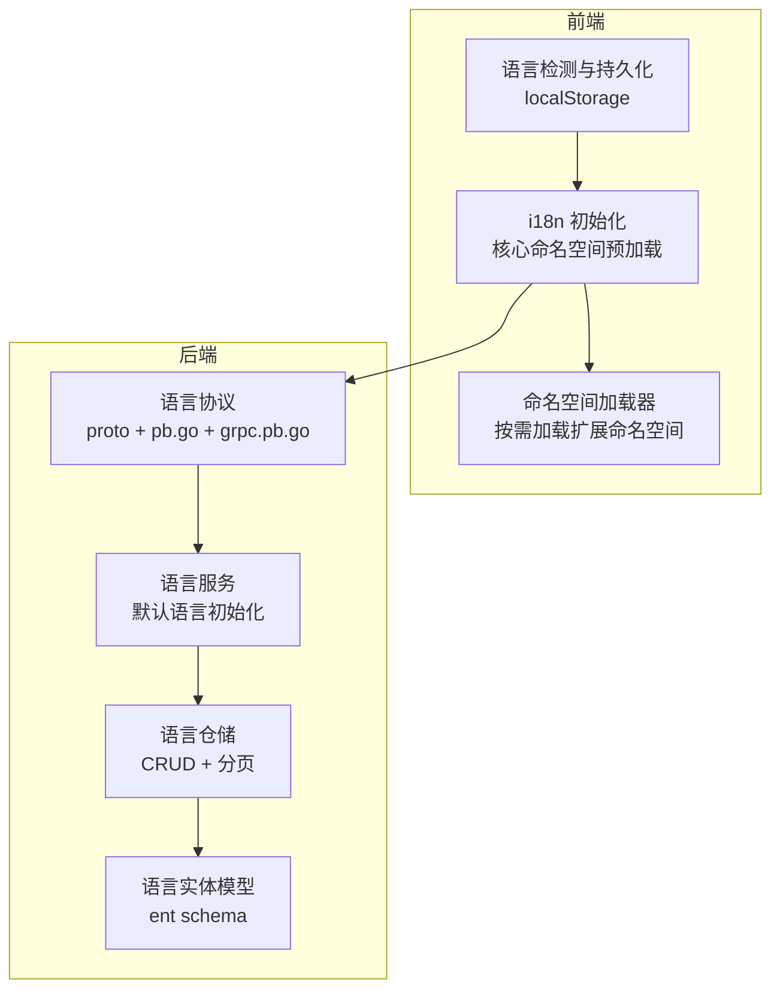
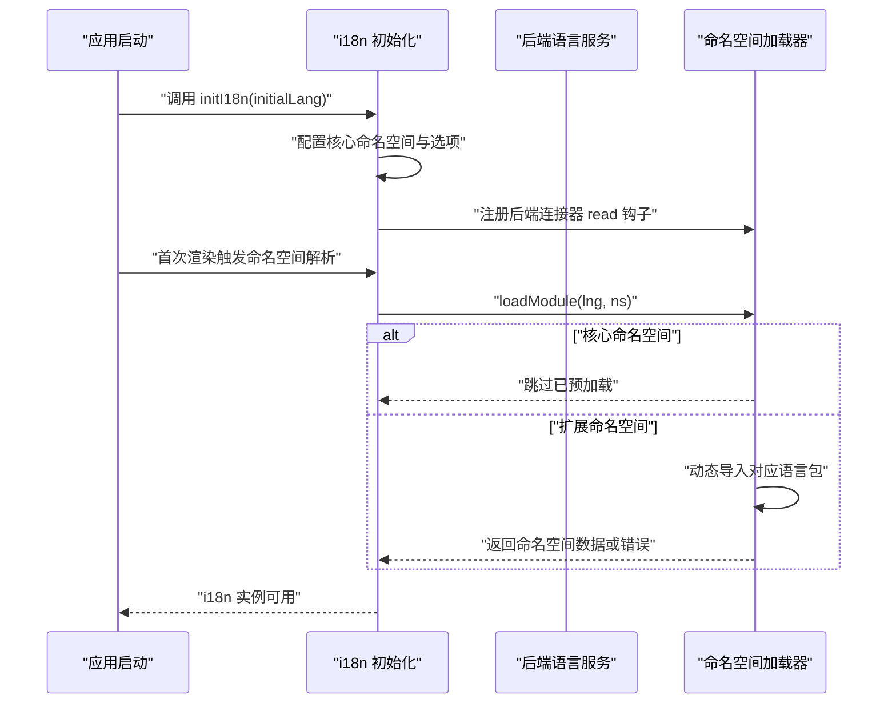
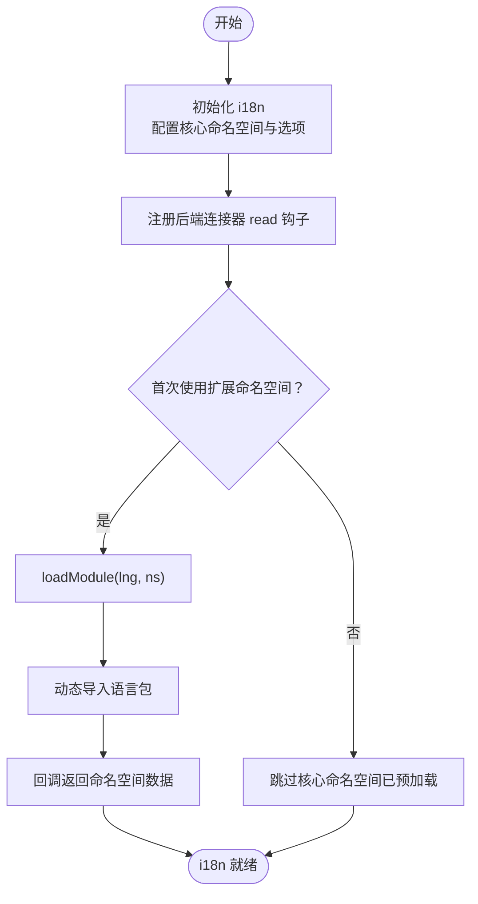
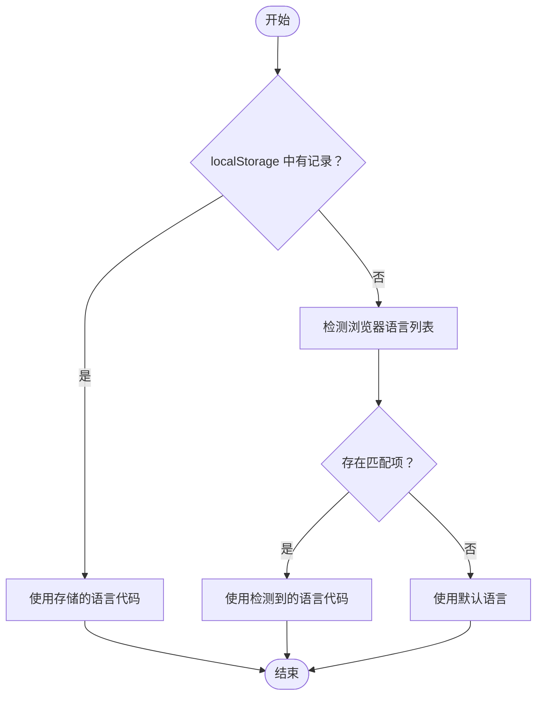
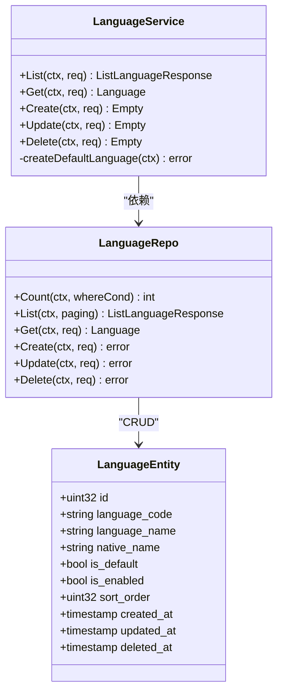
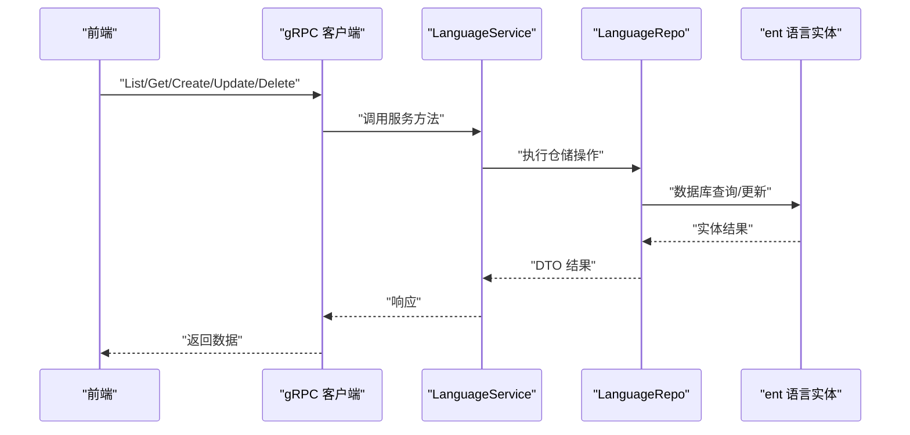
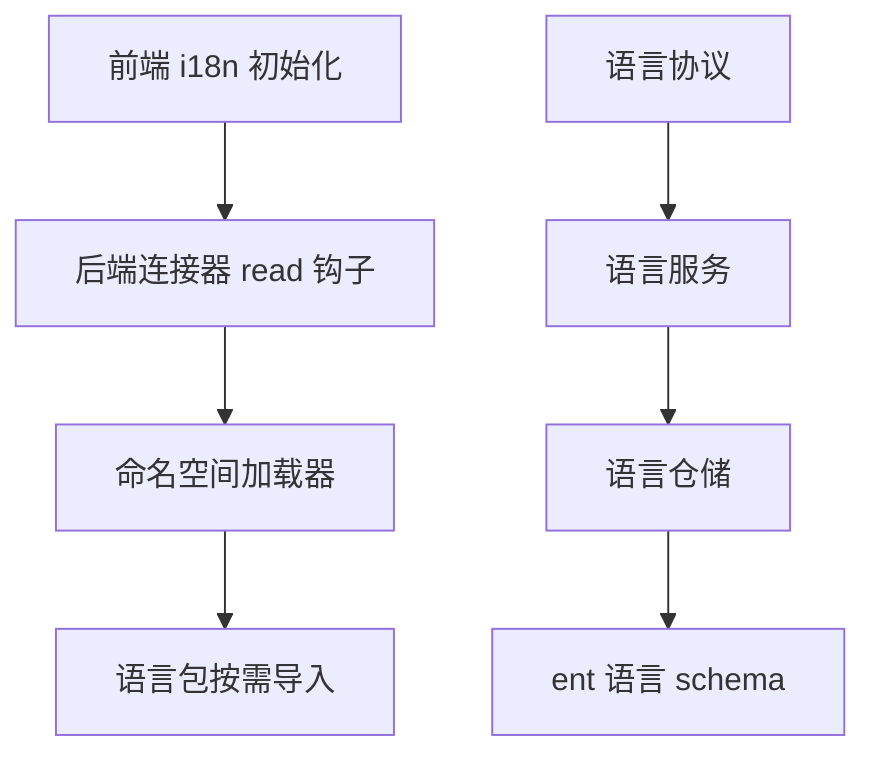

# 语言国际化

<cite>
**本文引用的文件**
- [i18n.ts](file://frontend/admin/react/src/core/i18n/config/i18n.ts)
- [detector.ts](file://frontend/admin/react/src/core/i18n/utils/detector.ts)
- [language.proto](file://backend/api/gen/go/dict/service/v1/language.proto)
- [language.pb.go](file://backend/api/gen/go/dict/service/v1/language.pb.go)
- [language_grpc.pb.go](file://backend/api/gen/go/dict/service/v1/language_grpc.pb.go)
- [language.go](file://backend/app/admin/service/internal/data/ent/schema/language.go)
- [language_repo.go](file://backend/app/admin/service/internal/data/language_repo.go)
- [language_service.go](file://backend/app/admin/service/internal/service/language_service.go)
- [default_data.go](file://backend/pkg/constants/default_data.go)
</cite>

## 目录
1. [简介](#简介)
2. [项目结构](#项目结构)
3. [核心组件](#核心组件)
4. [架构总览](#架构总览)
5. [详细组件分析](#详细组件分析)
6. [依赖分析](#依赖分析)
7. [性能考虑](#性能考虑)
8. [故障排查指南](#故障排查指南)
9. [结论](#结论)
10. [附录](#附录)

## 简介
本文件系统性阐述本项目的语言国际化（i18n）实现，覆盖后端语言数据模型与服务、前端语言包加载与切换、命名空间与动态加载机制、以及最佳实践与运维建议。文档以仓库现有实现为依据，不臆造不存在的功能。

## 项目结构
国际化能力在前后端分别实现：
- 前端：基于 i18next 的 React 应用，支持核心命名空间预加载与扩展命名空间按需加载；语言检测与持久化在前端完成。
- 后端：提供语言实体的数据模型、仓储与服务层，支持分页查询、增删改查、默认语言初始化等；语言资源本身以前端语言包为主，后端提供语言字典的管理能力。

图表来源
- [i18n.ts:17-78](file://frontend/admin/react/src/core/i18n/config/i18n.ts#L17-L78)
- [detector.ts:12-68](file://frontend/admin/react/src/core/i18n/utils/detector.ts#L12-L68)
- [language.proto:29-47](file://backend/api/gen/go/dict/service/v1/language.proto#L29-L47)
- [language.pb.go:29-47](file://backend/api/gen/go/dict/service/v1/language.pb.go#L29-L47)
- [language_grpc.pb.go:37-53](file://backend/api/gen/go/dict/service/v1/language_grpc.pb.go#L37-L53)
- [language.go:30-67](file://backend/app/admin/service/internal/data/ent/schema/language.go#L30-L67)
- [language_repo.go:81-100](file://backend/app/admin/service/internal/data/language_repo.go#L81-L100)
- [language_service.go:52-59](file://backend/app/admin/service/internal/service/language_service.go#L52-L59)

章节来源
- [i18n.ts:17-78](file://frontend/admin/react/src/core/i18n/config/i18n.ts#L17-L78)
- [detector.ts:12-68](file://frontend/admin/react/src/core/i18n/utils/detector.ts#L12-L68)
- [language.proto:29-47](file://backend/api/gen/go/dict/service/v1/language.proto#L29-L47)
- [language.pb.go:29-47](file://backend/api/gen/go/dict/service/v1/language.pb.go#L29-L47)
- [language_grpc.pb.go:37-53](file://backend/api/gen/go/dict/service/v1/language_grpc.pb.go#L37-L53)
- [language.go:30-67](file://backend/app/admin/service/internal/data/ent/schema/language.go#L30-L67)
- [language_repo.go:81-100](file://backend/app/admin/service/internal/data/language_repo.go#L81-L100)
- [language_service.go:52-59](file://backend/app/admin/service/internal/service/language_service.go#L52-L59)

## 核心组件
- 前端 i18n 初始化与命名空间管理
  - 支持核心命名空间（如 common、auth、menu、routes）预加载，以及扩展命名空间按需加载。
  - 提供后端连接器钩子，拦截扩展命名空间请求并动态导入对应语言包。
- 前端语言检测与持久化
  - 优先从 localStorage 读取用户选择；若无则根据 navigator.languages 自动检测；否则回退到默认语言。
  - 提供存储与读取方法，异常时静默处理。
- 后端语言数据模型与服务
  - 语言实体包含标准语言代码、名称、本地名称、默认/启用状态、排序等字段。
  - 服务层负责默认语言初始化与 CRUD 能力；仓储层提供分页查询、条件查询、创建/更新/删除等。
- 语言协议与接口
  - 通过 proto 定义语言消息体与服务接口，生成 pb.go 与 gRPC 服务桩，支撑前端/后端交互。

章节来源
- [i18n.ts:17-78](file://frontend/admin/react/src/core/i18n/config/i18n.ts#L17-L78)
- [detector.ts:12-68](file://frontend/admin/react/src/core/i18n/utils/detector.ts#L12-L68)
- [language.proto:29-47](file://backend/api/gen/go/dict/service/v1/language.proto#L29-L47)
- [language.pb.go:29-47](file://backend/api/gen/go/dict/service/v1/language.pb.go#L29-L47)
- [language_grpc.pb.go:37-53](file://backend/api/gen/go/dict/service/v1/language_grpc.pb.go#L37-L53)
- [language.go:30-67](file://backend/app/admin/service/internal/data/ent/schema/language.go#L30-L67)
- [language_repo.go:81-100](file://backend/app/admin/service/internal/data/language_repo.go#L81-L100)
- [language_service.go:52-59](file://backend/app/admin/service/internal/service/language_service.go#L52-L59)

## 架构总览
前端 i18n 初始化流程如下：

图表来源
- [i18n.ts:17-78](file://frontend/admin/react/src/core/i18n/config/i18n.ts#L17-L78)

章节来源
- [i18n.ts:17-78](file://frontend/admin/react/src/core/i18n/config/i18n.ts#L17-L78)

## 详细组件分析

### 前端 i18n 初始化与命名空间加载
- 初始化配置要点
  - 初始语言、回退语言、支持语言集合、默认命名空间与扩展命名空间列表。
  - 后端路径占位符支持按语言与命名空间加载。
  - 开发环境下缺失键值提示。
- 扩展命名空间加载
  - 通过后端连接器 read 钩子拦截扩展命名空间请求。
  - 对核心命名空间（common、auth、menu）直接跳过，避免重复加载。
  - 对其他命名空间动态导入对应语言包并回调返回数据。

图表来源
- [i18n.ts:44-78](file://frontend/admin/react/src/core/i18n/config/i18n.ts#L44-L78)

章节来源
- [i18n.ts:17-78](file://frontend/admin/react/src/core/i18n/config/i18n.ts#L17-L78)

### 前端语言检测与持久化
- 语言检测优先级
  - 本地存储中记录的语言代码优先。
  - 浏览器语言列表（navigator.languages 或 navigator.language）次之，支持完全匹配与前缀匹配。
  - 回退到默认语言。
- 存储与读取
  - 使用 localStorage 存储用户选择的语言代码；异常时静默失败，不影响主流程。

图表来源
- [detector.ts:12-68](file://frontend/admin/react/src/core/i18n/utils/detector.ts#L12-L68)

章节来源
- [detector.ts:12-68](file://frontend/admin/react/src/core/i18n/utils/detector.ts#L12-L68)

### 后端语言数据模型与服务
- 数据模型（ent schema）
  - 字段：语言代码、语言名称、本地名称、默认/启用状态、排序、创建/更新/删除时间与操作者 ID。
  - 索引：语言代码唯一索引，以及常用查询与过滤索引。
- 仓储层（repository）
  - 提供分页查询、条件查询（ID/代码）、批量创建、更新（含字段掩码）、删除等。
- 服务层
  - 初始化阶段若无语言数据则创建默认语言集。
  - 对外暴露分页、统计、查询、创建、批量创建、更新、删除等接口。

图表来源
- [language.go:30-67](file://backend/app/admin/service/internal/data/ent/schema/language.go#L30-L67)
- [language_repo.go:81-100](file://backend/app/admin/service/internal/data/language_repo.go#L81-L100)
- [language_service.go:52-59](file://backend/app/admin/service/internal/service/language_service.go#L52-L59)

章节来源
- [language.go:30-67](file://backend/app/admin/service/internal/data/ent/schema/language.go#L30-L67)
- [language_repo.go:81-100](file://backend/app/admin/service/internal/data/language_repo.go#L81-L100)
- [language_service.go:52-59](file://backend/app/admin/service/internal/service/language_service.go#L52-L59)

### 后端语言协议与接口
- 协议定义
  - 消息体包含语言实体字段与请求/响应消息。
  - 服务接口：分页查询、统计、获取、创建、批量创建、更新、删除。
- 生成文件
  - pb.go：消息体与序列化。
  - grpc.pb.go：gRPC 服务桩与方法分发。
- 与前端交互
  - 前端可通过后端提供的语言服务进行语言字典的管理与查询。

图表来源
- [language_grpc.pb.go:37-53](file://backend/api/gen/go/dict/service/v1/language_grpc.pb.go#L37-L53)
- [language.pb.go:29-47](file://backend/api/gen/go/dict/service/v1/language.pb.go#L29-L47)
- [language_repo.go:81-100](file://backend/app/admin/service/internal/data/language_repo.go#L81-L100)
- [language_service.go:52-59](file://backend/app/admin/service/internal/service/language_service.go#L52-L59)

章节来源
- [language.proto:29-47](file://backend/api/gen/go/dict/service/v1/language.proto#L29-L47)
- [language.pb.go:29-47](file://backend/api/gen/go/dict/service/v1/language.pb.go#L29-L47)
- [language_grpc.pb.go:37-53](file://backend/api/gen/go/dict/service/v1/language_grpc.pb.go#L37-L53)
- [language_repo.go:81-100](file://backend/app/admin/service/internal/data/language_repo.go#L81-L100)
- [language_service.go:52-59](file://backend/app/admin/service/internal/service/language_service.go#L52-L59)

## 依赖分析
- 前端 i18n 与命名空间加载
  - 依赖 i18next 与 react-i18next。
  - 通过后端连接器 read 钩子实现扩展命名空间的动态加载。
- 前端语言检测
  - 依赖浏览器 navigator API 与 localStorage。
- 后端语言服务
  - 依赖 ent schema、repository、gRPC 服务桩与 proto 定义。
  - 服务层在初始化时检查并创建默认语言集。

图表来源
- [i18n.ts:44-78](file://frontend/admin/react/src/core/i18n/config/i18n.ts#L44-L78)
- [detector.ts:12-68](file://frontend/admin/react/src/core/i18n/utils/detector.ts#L12-L68)
- [language.go:30-67](file://backend/app/admin/service/internal/data/ent/schema/language.go#L30-L67)
- [language_repo.go:81-100](file://backend/app/admin/service/internal/data/language_repo.go#L81-L100)
- [language_service.go:52-59](file://backend/app/admin/service/internal/service/language_service.go#L52-L59)
- [language.proto:29-47](file://backend/api/gen/go/dict/service/v1/language.proto#L29-L47)

章节来源
- [i18n.ts:44-78](file://frontend/admin/react/src/core/i18n/config/i18n.ts#L44-L78)
- [detector.ts:12-68](file://frontend/admin/react/src/core/i18n/utils/detector.ts#L12-L68)
- [language.go:30-67](file://backend/app/admin/service/internal/data/ent/schema/language.go#L30-L67)
- [language_repo.go:81-100](file://backend/app/admin/service/internal/data/language_repo.go#L81-L100)
- [language_service.go:52-59](file://backend/app/admin/service/internal/service/language_service.go#L52-L59)
- [language.proto:29-47](file://backend/api/gen/go/dict/service/v1/language.proto#L29-L47)

## 性能考虑
- 前端
  - 核心命名空间预加载减少首次渲染时的网络请求。
  - 扩展命名空间按需加载，避免一次性加载全部语言包导致体积膨胀。
  - 建议对高频使用的命名空间进行缓存，减少重复导入。
- 后端
  - 语言查询使用索引优化（语言代码唯一索引与常用过滤/排序字段索引）。
  - 分页查询避免一次性返回大量数据。

## 故障排查指南
- 前端语言包加载失败
  - 检查命名空间是否在核心命名空间列表中；若是核心命名空间会被跳过。
  - 确认动态导入路径正确且对应语言包存在。
  - 查看控制台错误日志定位具体失败原因。
- 语言检测异常
  - 确认 localStorage 可用且存储格式正确。
  - 检查浏览器语言列表是否为空，必要时回退到默认语言。
- 后端语言服务
  - 若初始化未创建默认语言，检查服务层初始化逻辑与默认数据常量。
  - 查询/更新失败时查看仓储层日志与错误码。

章节来源
- [i18n.ts:44-78](file://frontend/admin/react/src/core/i18n/config/i18n.ts#L44-L78)
- [detector.ts:12-68](file://frontend/admin/react/src/core/i18n/utils/detector.ts#L12-L68)
- [language_service.go:123-135](file://backend/app/admin/service/internal/service/language_service.go#L123-L135)
- [default_data.go:266-275](file://backend/pkg/constants/default_data.go#L266-L275)

## 结论
本项目采用“前端为主、后端为辅”的国际化架构：前端负责语言包加载、命名空间管理与语言检测，后端提供语言字典的管理与基础数据模型。该方案具备良好的扩展性与性能表现，适合多语言场景下的快速迭代与维护。

## 附录

### 语言数据模型设计
- 字段定义
  - 语言代码：标准语言代码，唯一索引。
  - 语言名称：对外展示名称。
  - 本地名称：语言的母语名称。
  - 默认/启用状态：控制默认语言与启用状态。
  - 排序：用于排序与优先级控制。
  - 时间与操作者：创建/更新/删除时间与操作者 ID。
- 索引策略
  - 唯一索引：语言代码。
  - 常用查询索引：语言代码、语言名称、本地名称、默认/启用状态、排序、创建时间。

章节来源
- [language.go:30-67](file://backend/app/admin/service/internal/data/ent/schema/language.go#L30-L67)
- [language.pb.go:29-47](file://backend/api/gen/go/dict/service/v1/language.pb.go#L29-L47)

### 翻译资源管理与命名空间
- 命名空间
  - 核心命名空间：common、auth、menu、routes。
  - 扩展命名空间：按需加载，避免预加载。
- 资源组织
  - 建议按模块划分命名空间，便于维护与按需加载。
  - 建议统一命名约定与上下文标识，提升可读性与可维护性。

章节来源
- [i18n.ts:24-27](file://frontend/admin/react/src/core/i18n/config/i18n.ts#L24-L27)
- [i18n.ts:44-78](file://frontend/admin/react/src/core/i18n/config/i18n.ts#L44-L78)

### 语言切换与缓存策略
- 切换流程
  - 用户选择语言 → 写入 localStorage → 重新初始化 i18n → 加载对应命名空间 → 渲染更新。
- 缓存
  - 核心命名空间预加载缓存；扩展命名空间按需缓存。
- 热更新
  - 建议在开发环境开启缺失键提示，便于发现未翻译内容。

章节来源
- [detector.ts:36-60](file://frontend/admin/react/src/core/i18n/utils/detector.ts#L36-L60)
- [i18n.ts:17-42](file://frontend/admin/react/src/core/i18n/config/i18n.ts#L17-L42)

### 国际化开发最佳实践
- 翻译规范
  - 键名采用层级式命名，避免歧义。
  - 上下文标识用于区分同词不同义场景。
  - 复数形式遵循目标语言规则，必要时使用参数化表达。
- 维护策略
  - 建立翻译评审流程与质量门禁。
  - 对高频模块优先完成翻译，保证核心体验。
- 多平台适配
  - 文本方向、日期/时间/数字格式、货币等需按语言包适配。
  - 图片与图标需考虑文化差异，必要时提供多套资源。

[本节为通用指导，无需引用具体文件]