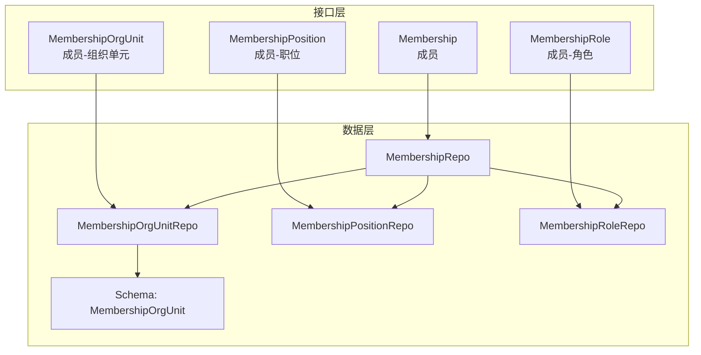
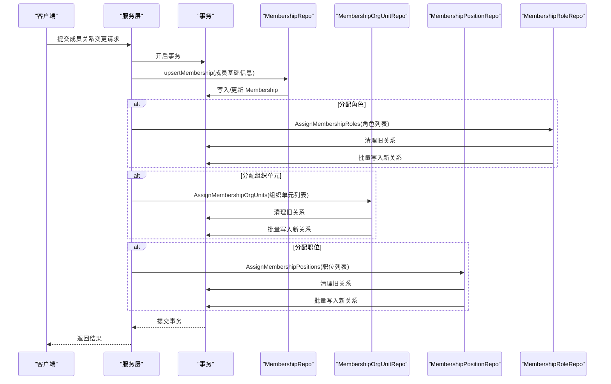
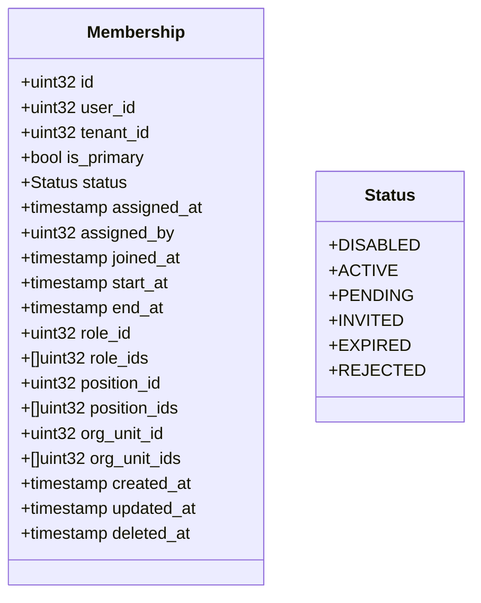
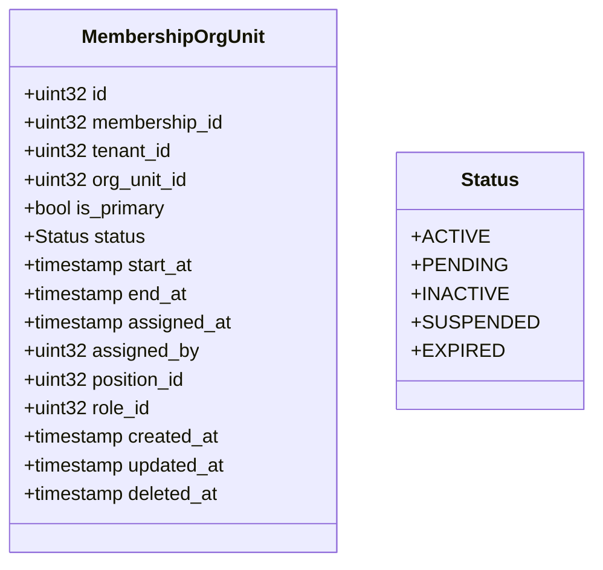
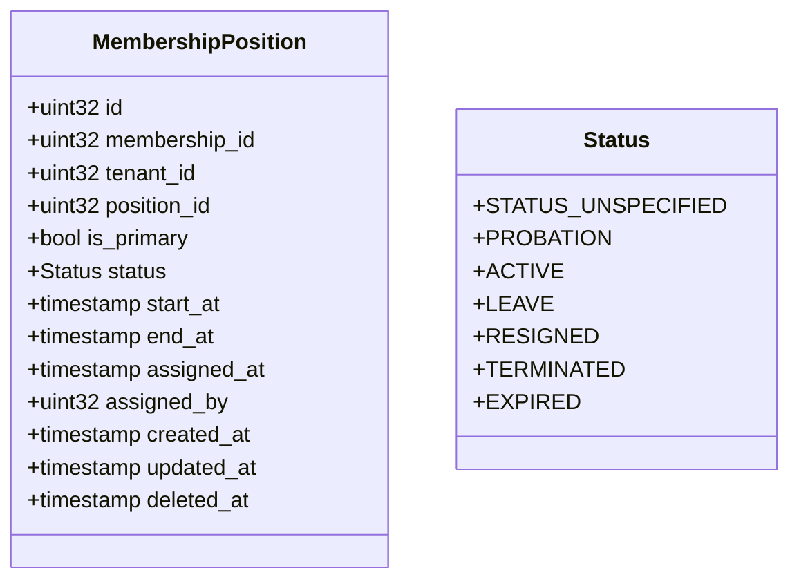
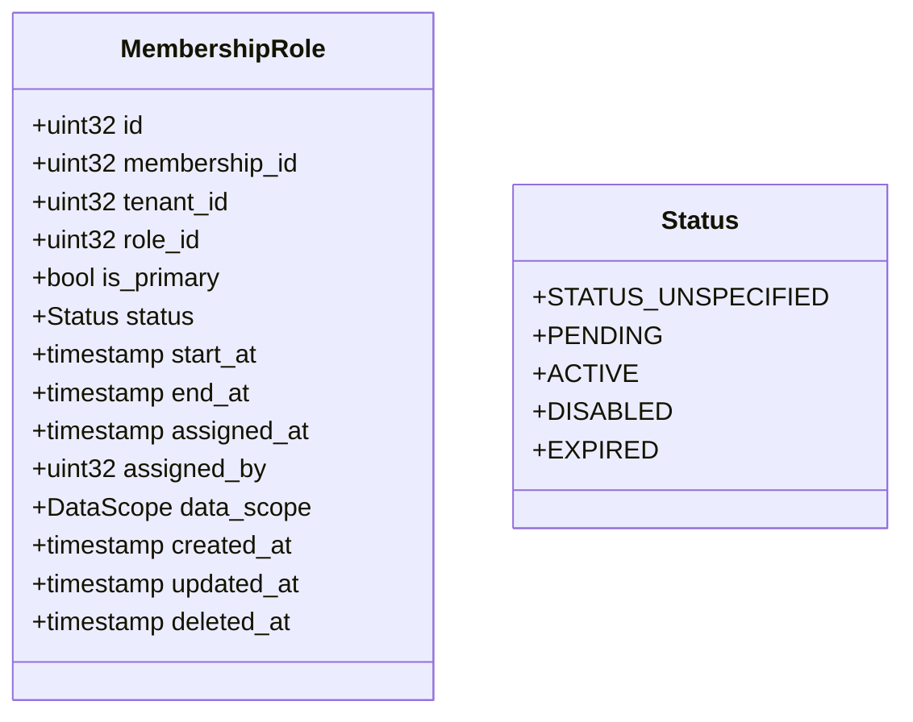
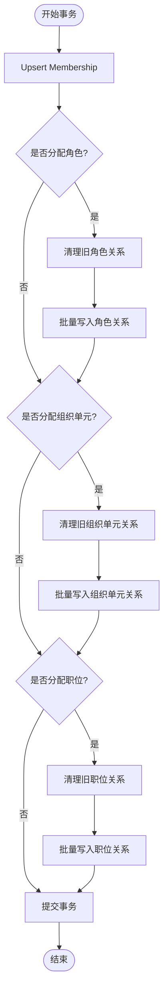
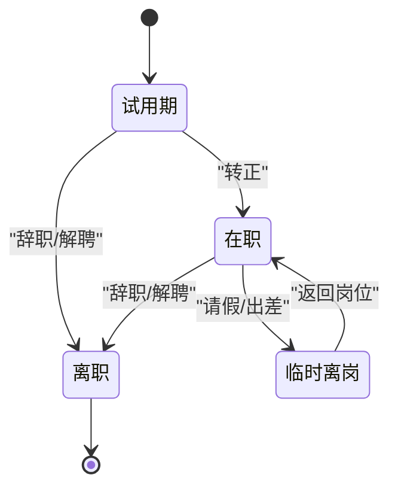
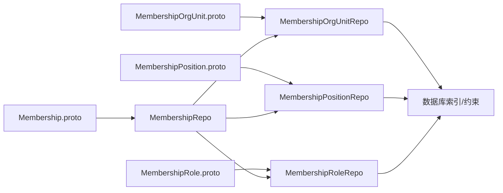

# 成员关系管理

<cite>
**本文档引用的文件**
- [membership.pb.go](file://backend/api/gen/go/identity/service/v1/membership.pb.go)
- [membership_org_unit.pb.go](file://backend/api/gen/go/identity/service/v1/membership_org_unit.pb.go)
- [membership_position.pb.go](file://backend/api/gen/go/identity/service/v1/membership_position.pb.go)
- [membership_role.pb.go](file://backend/api/gen/go/permission/service/v1/membership_role.pb.go)
- [membership_org_unit.go](file://backend/app/admin/service/internal/data/ent/schema/membership_org_unit.go)
- [membership_repo.go](file://backend/app/admin/service/internal/data/membership_repo.go)
- [membership_org_unit_repo.go](file://backend/app/admin/service/internal/data/membership_org_unit_repo.go)
- [membership_position_repo.go](file://backend/app/admin/service/internal/data/membership_position_repo.go)
- [membership_role_repo.go](file://backend/app/admin/service/internal/data/membership_role_repo.go)
- [schema.go](file://backend/app/admin/service/internal/data/ent/migrate/schema.go)
- [entql.go](file://backend/app/admin/service/internal/data/ent/entql.go)
- [membership_create.go](file://backend/app/admin/service/internal/data/ent/membership_create.go)
- [membershipposition_create.go](file://backend/app/admin/service/internal/data/ent/membershipposition_create.go)
</cite>

## 目录
1. [简介](#简介)
2. [项目结构](#项目结构)
3. [核心组件](#核心组件)
4. [架构总览](#架构总览)
5. [详细组件分析](#详细组件分析)
6. [依赖分析](#依赖分析)
7. [性能考虑](#性能考虑)
8. [故障排查指南](#故障排查指南)
9. [结论](#结论)
10. [附录](#附录)

## 简介
本文件系统化梳理“成员关系管理”能力，覆盖人员与组织单位、职位、角色三类实体的关系建模与管理。重点包括：
- 正式关系、兼职关系、历史关系的维护与查询
- 成员关系的类型与状态定义（在职、离职、实习、借调等）
- 多重任职支持（主职与兼职、工作量分配、权限叠加规则）
- 成员关系变更流程（入职、转正、调岗、离职等）
- 数据同步机制（组织架构变更时的自动调整、权限重新计算）
- 查询与统计（在岗情况、组织人员分布、历史变迁记录）
- 业务规则与数据一致性（时间范围校验、重复关系检查、权限继承规则）

## 项目结构
成员关系管理由三层构成：
- 接口层：基于 Protobuf 的消息定义，统一描述成员、成员-组织单元、成员-职位、成员-角色四类关系及其状态
- 数据层：基于 Ent 的 Schema 定义与仓储实现，负责关系的增删改查、批量导入、唯一性约束与索引
- 服务层：通过仓储组合完成事务性操作，确保多关系的一致性写入与清理

图表来源
- [membership.pb.go:86-112](file://backend/api/gen/go/identity/service/v1/membership.pb.go#L86-L112)
- [membership_org_unit.pb.go:83-103](file://backend/api/gen/go/identity/service/v1/membership_org_unit.pb.go#L83-L103)
- [membership_position.pb.go:89-109](file://backend/api/gen/go/identity/service/v1/membership_position.pb.go#L89-L109)
- [membership_role.pb.go:84-105](file://backend/api/gen/go/permission/service/v1/membership_role.pb.go#L84-L105)
- [membership_repo.go:23-53](file://backend/app/admin/service/internal/data/membership_repo.go#L23-L53)
- [membership_org_unit_repo.go:19-35](file://backend/app/admin/service/internal/data/membership_org_unit_repo.go#L19-L35)
- [membership_position_repo.go:19-34](file://backend/app/admin/service/internal/data/membership_position_repo.go#L19-L34)
- [membership_role_repo.go:19-34](file://backend/app/admin/service/internal/data/membership_role_repo.go#L19-L34)

章节来源
- [membership.pb.go:26-83](file://backend/api/gen/go/identity/service/v1/membership.pb.go#L26-L83)
- [membership_org_unit.pb.go:26-80](file://backend/api/gen/go/identity/service/v1/membership_org_unit.pb.go#L26-L80)
- [membership_position.pb.go:26-86](file://backend/api/gen/go/identity/service/v1/membership_position.pb.go#L26-L86)
- [membership_role.pb.go:27-81](file://backend/api/gen/go/permission/service/v1/membership_role.pb.go#L27-L81)

## 核心组件
- 成员（Membership）：描述用户在租户下的成员身份，支持主身份标记、生效/失效时间、分配时间与分配人、加入时间等
- 成员-组织单元（MembershipOrgUnit）：描述成员在组织单元中的归属关系，支持主归属标记、状态、生效/失效时间、分配时间与分配人
- 成员-职位（MembershipPosition）：描述成员在职位上的在岗状态，支持试用、在职、离职、辞职、解聘、过期等状态
- 成员-角色（MembershipRole）：描述成员的角色授权关系，支持待激活、激活、禁用、过期等状态，并支持数据权限范围

章节来源
- [membership.pb.go:86-112](file://backend/api/gen/go/identity/service/v1/membership.pb.go#L86-L112)
- [membership_org_unit.pb.go:83-103](file://backend/api/gen/go/identity/service/v1/membership_org_unit.pb.go#L83-L103)
- [membership_position.pb.go:89-109](file://backend/api/gen/go/identity/service/v1/membership_position.pb.go#L89-L109)
- [membership_role.pb.go:84-105](file://backend/api/gen/go/permission/service/v1/membership_role.pb.go#L84-L105)

## 架构总览
成员关系管理采用“仓储+事务”的设计模式，通过 MembershipRepo 组合三个子仓储（组织单元、职位、角色）实现多关系的一致性写入与清理。

图表来源
- [membership_repo.go:90-195](file://backend/app/admin/service/internal/data/membership_repo.go#L90-L195)
- [membership_org_unit_repo.go:126-174](file://backend/app/admin/service/internal/data/membership_org_unit_repo.go#L126-L174)
- [membership_position_repo.go:125-173](file://backend/app/admin/service/internal/data/membership_position_repo.go#L125-L173)
- [membership_role_repo.go:125-173](file://backend/app/admin/service/internal/data/membership_role_repo.go#L125-L173)

## 详细组件分析

### 成员（Membership）关系模型
- 关键字段：用户ID、租户ID、主身份标记、状态、分配时间/分配人、加入时间、生效/失效时间、创建/更新/删除审计字段
- 状态枚举：已停用、生效中、待审核、待接受、已过期、已拒绝
- 业务要点：
  - 支持单一租户内主身份唯一性（通过唯一索引约束）
  - 生效/失效时间用于控制成员在特定时间段内的有效性
  - 分配时间与分配人用于审计与追溯

图表来源
- [membership.pb.go:86-112](file://backend/api/gen/go/identity/service/v1/membership.pb.go#L86-L112)
- [membership.pb.go:26-56](file://backend/api/gen/go/identity/service/v1/membership.pb.go#L26-L56)

章节来源
- [membership.pb.go:26-83](file://backend/api/gen/go/identity/service/v1/membership.pb.go#L26-L83)

### 成员-组织单元（MembershipOrgUnit）关系模型
- 关键字段：成员ID、组织单元ID、可选岗位/角色冗余字段、主归属标记、状态、生效/失效时间、分配时间/分配人、审计字段
- 状态枚举：激活、待激活、非激活、暂停、已过期
- 唯一性约束：在租户范围内，(membership_id, org_unit_id, position_id, role_id) 唯一，且每个 membership 的 is_primary 唯一
- 索引策略：复合索引覆盖租户+成员、租户+组织单元、成员/组织单元/岗位/角色单列索引，以及时间范围与审计索引

图表来源
- [membership_org_unit.pb.go:83-103](file://backend/api/gen/go/identity/service/v1/membership_org_unit.pb.go#L83-L103)
- [membership_org_unit.go:78-90](file://backend/app/admin/service/internal/data/ent/schema/membership_org_unit.go#L78-L90)
- [membership_org_unit.go:103-161](file://backend/app/admin/service/internal/data/ent/schema/membership_org_unit.go#L103-L161)

章节来源
- [membership_org_unit.go:30-161](file://backend/app/admin/service/internal/data/ent/schema/membership_org_unit.go#L30-L161)
- [schema.go:1001-1052](file://backend/app/admin/service/internal/data/ent/migrate/schema.go#L1001-L1052)
- [entql.go:466-483](file://backend/app/admin/service/internal/data/ent/entql.go#L466-L483)

### 成员-职位（MembershipPosition）关系模型
- 关键字段：成员ID、职位ID、主岗位标记、状态、生效/失效时间、分配时间/分配人、审计字段
- 状态枚举：未指定、试用、在职、离职、辞职、解聘、已过期
- 业务要点：
  - 支持多重任职（主职与兼职）
  - 状态变化驱动权限与在岗统计

图表来源
- [membership_position.pb.go:89-109](file://backend/api/gen/go/identity/service/v1/membership_position.pb.go#L89-L109)
- [membership_position.pb.go:26-58](file://backend/api/gen/go/identity/service/v1/membership_position.pb.go#L26-L58)

章节来源
- [membership_position.pb.go:26-86](file://backend/api/gen/go/identity/service/v1/membership_position.pb.go#L26-L86)

### 成员-角色（MembershipRole）关系模型
- 关键字段：成员ID、角色ID、主角色标记、状态、生效/失效时间、分配时间/分配人、数据权限范围、审计字段
- 状态枚举：未指定、待激活、激活、禁用、过期
- 业务要点：
  - 支持数据权限范围（与数据域授权相关）
  - 角色关系的批量写入与清理，确保每次变更覆盖全集

图表来源
- [membership_role.pb.go:84-105](file://backend/api/gen/go/permission/service/v1/membership_role.pb.go#L84-L105)
- [membership_role.pb.go:27-53](file://backend/api/gen/go/permission/service/v1/membership_role.pb.go#L27-L53)

章节来源
- [membership_role.pb.go:27-81](file://backend/api/gen/go/permission/service/v1/membership_role.pb.go#L27-L81)

### 仓储与事务处理
- MembershipRepo：负责成员主表的 Upsert、状态与时间字段更新、查询有效成员与关联ID集合
- MembershipOrgUnitRepo/MembershipPositionRepo/MembershipRoleRepo：分别负责对应关系的清理、批量写入、查询关联ID集合
- 事务策略：所有多关系写入均在单个事务中执行，先清理旧关系，再批量写入新关系，确保一致性

图表来源
- [membership_repo.go:90-195](file://backend/app/admin/service/internal/data/membership_repo.go#L90-L195)
- [membership_org_unit_repo.go:126-174](file://backend/app/admin/service/internal/data/membership_org_unit_repo.go#L126-L174)
- [membership_position_repo.go:125-173](file://backend/app/admin/service/internal/data/membership_position_repo.go#L125-L173)
- [membership_role_repo.go:125-173](file://backend/app/admin/service/internal/data/membership_role_repo.go#L125-L173)

章节来源
- [membership_repo.go:67-195](file://backend/app/admin/service/internal/data/membership_repo.go#L67-L195)
- [membership_org_unit_repo.go:37-174](file://backend/app/admin/service/internal/data/membership_org_unit_repo.go#L37-L174)
- [membership_position_repo.go:36-173](file://backend/app/admin/service/internal/data/membership_position_repo.go#L36-L173)
- [membership_role_repo.go:36-173](file://backend/app/admin/service/internal/data/membership_role_repo.go#L36-L173)

### 成员关系变更流程
- 入职：创建/更新 Membership，分配角色、组织单元、职位；设置生效时间与状态
- 转正：更新职位状态为在职，必要时调整角色与权限
- 调岗：清理旧职位关系，分配新职位；保留历史记录以便统计
- 离职：更新职位状态为离职/辞职/解聘，设置失效时间；清理部分或全部角色授权
- 借调/实习：通过组织单元与职位状态表达临时关系，设置短期生效/失效时间

图表来源
- [membership_position.pb.go:30-37](file://backend/api/gen/go/identity/service/v1/membership_position.pb.go#L30-L37)

章节来源
- [membership_position.pb.go:26-58](file://backend/api/gen/go/identity/service/v1/membership_position.pb.go#L26-L58)

### 查询与统计
- 在岗情况：根据职位状态 ACTIVE/PROBATION 与生效/失效时间筛选有效成员
- 组织人员分布：按组织单元聚合成员数量，支持主/兼职区分
- 历史变迁：通过关系表的时间范围字段与审计字段追踪历史记录
- 关联ID查询：提供按成员ID列出角色/组织单元/职位ID的方法，支持排除过期关系

章节来源
- [membership_repo.go:476-500](file://backend/app/admin/service/internal/data/membership_repo.go#L476-L500)
- [membership_repo.go:502-531](file://backend/app/admin/service/internal/data/membership_repo.go#L502-L531)
- [membership_repo.go:538-596](file://backend/app/admin/service/internal/data/membership_repo.go#L538-L596)
- [membership_org_unit_repo.go:176-209](file://backend/app/admin/service/internal/data/membership_org_unit_repo.go#L176-L209)
- [membership_position_repo.go:175-208](file://backend/app/admin/service/internal/data/membership_position_repo.go#L175-L208)
- [membership_role_repo.go:175-208](file://backend/app/admin/service/internal/data/membership_role_repo.go#L175-L208)

### 数据一致性与业务规则
- 唯一性约束：
  - 成员-组织单元：(tenant_id, membership_id, org_unit_id, position_id, role_id) 唯一
  - 成员-组织单元：(tenant_id, membership_id, is_primary) 唯一（需部分唯一索引）
- 时间范围校验：生效/失效时间与当前时间比较决定关系有效性
- 重复关系检查：每次分配前清理旧关系，确保覆盖全集
- 权限继承与叠加：角色与职位状态共同决定权限集合，主职与兼职的权限叠加规则由上层策略定义

章节来源
- [membership_org_unit.go:103-114](file://backend/app/admin/service/internal/data/ent/schema/membership_org_unit.go#L103-L114)
- [schema.go:1001-1052](file://backend/app/admin/service/internal/data/ent/migrate/schema.go#L1001-L1052)
- [membership_repo.go:662-701](file://backend/app/admin/service/internal/data/membership_repo.go#L662-L701)

## 依赖分析
- 接口层依赖：各关系消息定义独立，但共享时间戳与审计字段约定
- 数据层依赖：三个关系仓储依赖 Ent 的查询构建器与批量写入能力
- 事务耦合：MembershipRepo 与三个子仓储强耦合，确保多关系一致性
- 约束与索引：数据库层面通过唯一索引与复合索引保障数据一致性与查询效率

图表来源
- [membership.pb.go:86-112](file://backend/api/gen/go/identity/service/v1/membership.pb.go#L86-L112)
- [membership_org_unit.pb.go:83-103](file://backend/api/gen/go/identity/service/v1/membership_org_unit.pb.go#L83-L103)
- [membership_position.pb.go:89-109](file://backend/api/gen/go/identity/service/v1/membership_position.pb.go#L89-L109)
- [membership_role.pb.go:84-105](file://backend/api/gen/go/permission/service/v1/membership_role.pb.go#L84-L105)
- [membership_repo.go:23-53](file://backend/app/admin/service/internal/data/membership_repo.go#L23-L53)

章节来源
- [entql.go:466-483](file://backend/app/admin/service/internal/data/ent/entql.go#L466-L483)
- [schema.go:1001-1052](file://backend/app/admin/service/internal/data/ent/migrate/schema.go#L1001-L1052)

## 性能考虑
- 批量写入：角色、组织单元、职位均支持批量创建，降低写入放大
- 索引优化：针对常用查询维度建立复合索引与单列索引，提升过滤与排序效率
- 事务边界：将多关系写入置于同一事务，减少中间态，提高一致性与稳定性
- 过期数据剔除：查询时可选择排除过期关系，减少无关数据扫描

## 故障排查指南
- 事务回滚：当任一关系写入失败时，事务回滚以保持一致性
- 错误码：仓储方法返回统一错误码，便于前端与日志定位问题
- 审计字段：通过 created_by/updated_by/assigned_by 等字段进行责任追溯
- 唯一冲突：若出现唯一约束冲突，检查是否存在重复关系或并发写入

章节来源
- [membership_repo.go:67-88](file://backend/app/admin/service/internal/data/membership_repo.go#L67-L88)
- [membership_org_unit_repo.go:126-174](file://backend/app/admin/service/internal/data/membership_org_unit_repo.go#L126-L174)
- [membership_position_repo.go:125-173](file://backend/app/admin/service/internal/data/membership_position_repo.go#L125-L173)
- [membership_role_repo.go:125-173](file://backend/app/admin/service/internal/data/membership_role_repo.go#L125-L173)

## 结论
成员关系管理通过清晰的关系模型、严格的唯一性约束与高效的仓储实现，支撑了组织架构与权限体系的动态演进。结合事务化的多关系写入与完善的索引策略，系统在复杂业务场景下仍能保持高一致性与良好性能。建议在实际落地中：
- 明确主职与兼职的权限叠加策略
- 对组织架构变更事件建立自动化同步流程
- 建立定期的历史关系归档与清理机制
- 强化审计与合规性监控

## 附录
- 时间字段映射：Ent 与 Protobuf 时间戳字段的双向转换
- 状态枚举映射：接口层与实体层状态枚举的双向转换器
- 扩展点：可在角色关系中引入工作量权重字段，支持多岗位工作量分配

章节来源
- [membership_create.go:1612-1890](file://backend/app/admin/service/internal/data/ent/membership_create.go#L1612-L1890)
- [membershipposition_create.go:707-1633](file://backend/app/admin/service/internal/data/ent/membershipposition_create.go#L707-L1633)