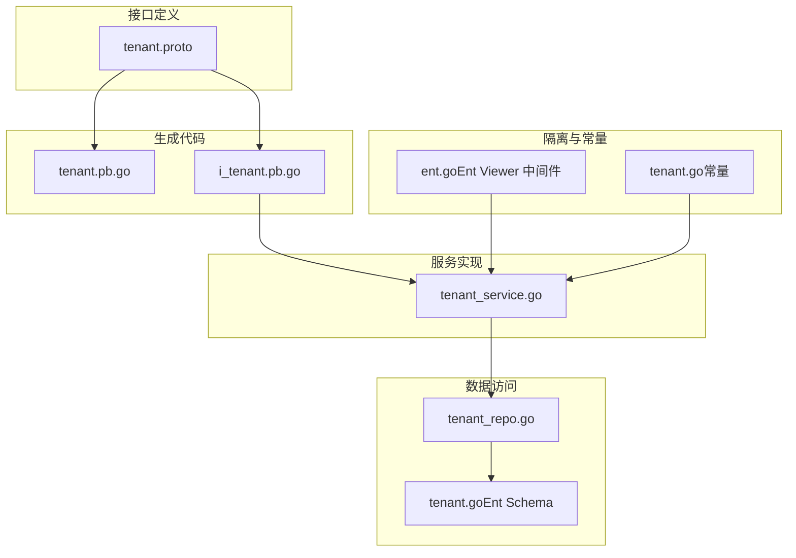
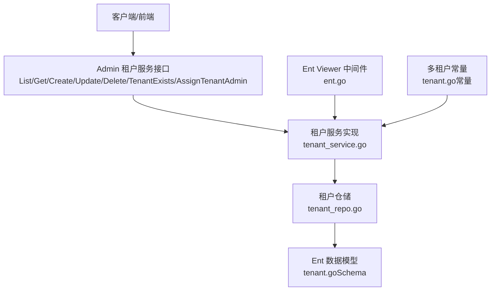
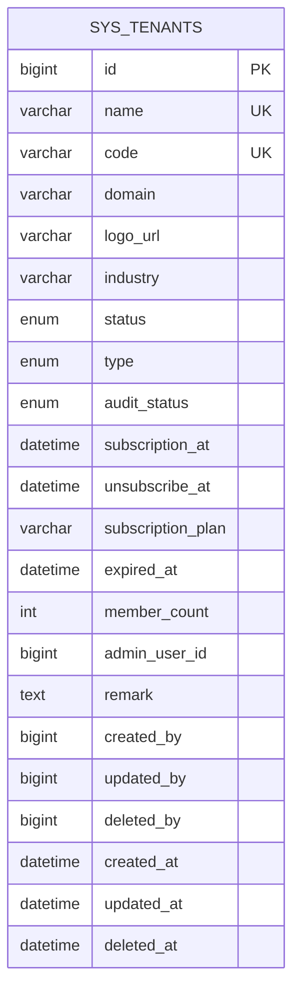
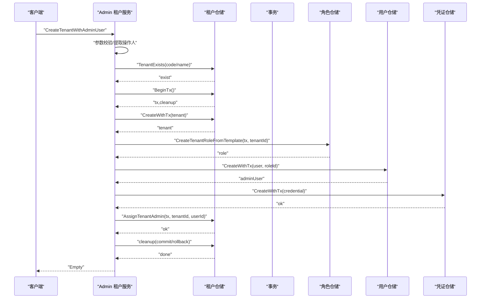
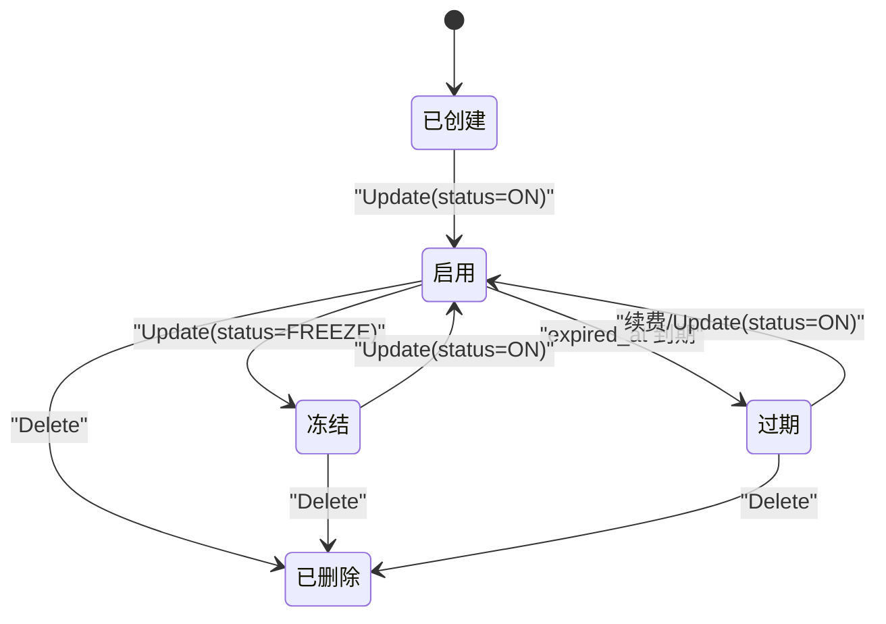
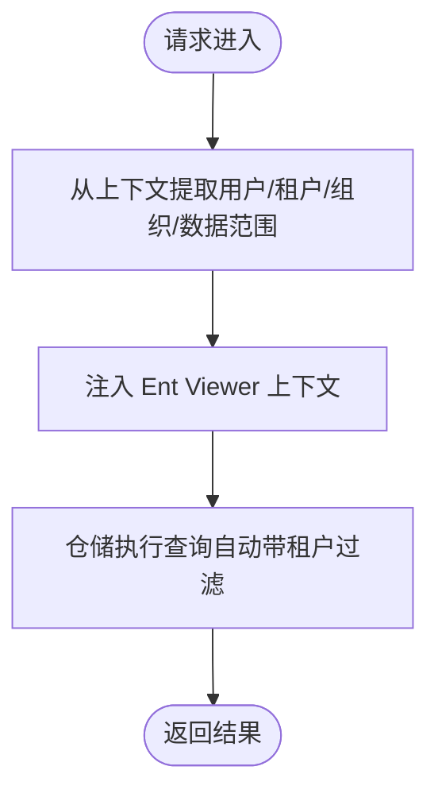
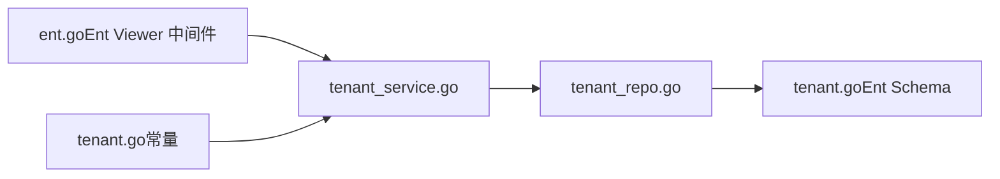

# 租户管理

<cite>
**本文引用的文件**
- [tenant.proto](file://backend/api/protos/identity/service/v1/tenant.proto)
- [tenant.pb.go](file://backend/api/gen/go/identity/service/v1/tenant.pb.go)
- [i_tenant.pb.go](file://backend/api/gen/go/admin/service/v1/i_tenant.pb.go)
- [tenant_service.go](file://backend/app/admin/service/internal/service/tenant_service.go)
- [tenant_repo.go](file://backend/app/admin/service/internal/data/tenant_repo.go)
- [tenant.go（Ent Schema）](file://backend/app/admin/service/internal/data/ent/schema/tenant.go)
- [ent.go（Ent Viewer 中间件）](file://backend/pkg/middleware/ent/ent.go)
- [tenant.go（常量）](file://backend/pkg/constants/tenant.go)
</cite>

## 目录
1. [简介](#简介)
2. [项目结构](#项目结构)
3. [核心组件](#核心组件)
4. [架构总览](#架构总览)
5. [详细组件分析](#详细组件分析)
6. [依赖分析](#依赖分析)
7. [性能考虑](#性能考虑)
8. [故障排查指南](#故障排查指南)
9. [结论](#结论)
10. [附录](#附录)

## 简介
本文件面向多租户架构下的“租户管理”能力，系统性阐述租户的定义、数据模型、服务接口、仓储实现、隔离机制、生命周期管理、资源配置、监控与审计、安全策略以及与组织架构的关系。目标是帮助开发者与运维人员在不深入源码的前提下，也能准确理解并正确使用租户管理功能。

## 项目结构
围绕租户管理的关键文件分布如下：
- 接口定义层：Protobuf 定义租户实体、状态枚举、服务接口与请求/响应消息。
- 生成代码层：基于 Protobuf 的 Go 代码，包含消息体、验证器与 gRPC/HTTP 映射。
- 服务实现层：Admin 服务侧的租户服务，负责业务编排、事务处理、关系绑定与授权策略重置。
- 数据访问层：租户仓储，封装 Ent 查询、映射、索引与事务。
- 隔离与常量：Ent Viewer 中间件注入租户上下文，常量定义多租户模式与关系类型。

**图表来源**
- [tenant.proto:1-278](file://backend/api/protos/identity/service/v1/tenant.proto#L1-L278)
- [tenant.pb.go:1-1352](file://backend/api/gen/go/identity/service/v1/tenant.pb.go#L1-L1352)
- [i_tenant.pb.go:1-99](file://backend/api/gen/go/admin/service/v1/i_tenant.pb.go#L1-L99)
- [tenant_service.go:1-301](file://backend/app/admin/service/internal/service/tenant_service.go#L1-L301)
- [tenant_repo.go:1-378](file://backend/app/admin/service/internal/data/tenant_repo.go#L1-L378)
- [tenant.go（Ent Schema）:1-172](file://backend/app/admin/service/internal/data/ent/schema/tenant.go#L1-L172)
- [ent.go（Ent Viewer 中间件）:1-42](file://backend/pkg/middleware/ent/ent.go#L1-L42)
- [tenant.go（常量）:1-25](file://backend/pkg/constants/tenant.go#L1-L25)

**章节来源**
- [tenant.proto:1-278](file://backend/api/protos/identity/service/v1/tenant.proto#L1-L278)
- [tenant.pb.go:1-1352](file://backend/api/gen/go/identity/service/v1/tenant.pb.go#L1-L1352)
- [i_tenant.pb.go:1-99](file://backend/api/gen/go/admin/service/v1/i_tenant.pb.go#L1-L99)
- [tenant_service.go:1-301](file://backend/app/admin/service/internal/service/tenant_service.go#L1-L301)
- [tenant_repo.go:1-378](file://backend/app/admin/service/internal/data/tenant_repo.go#L1-L378)
- [tenant.go（Ent Schema）:1-172](file://backend/app/admin/service/internal/data/ent/schema/tenant.go#L1-L172)
- [ent.go（Ent Viewer 中间件）:1-42](file://backend/pkg/middleware/ent/ent.go#L1-L42)
- [tenant.go（常量）:1-25](file://backend/pkg/constants/tenant.go#L1-L25)

## 核心组件
- 租户实体与状态
  - 租户包含标识、名称、编码、域名、行业、类型、备注、管理员用户信息、订阅与有效期、成员数、状态与审核状态等字段。
  - 状态枚举：禁用、启用、过期、冻结；类型枚举：试用、付费、内部、合作伙伴、定制；审核状态：未指定、待审核、审核通过、审核拒绝。
- 租户服务接口
  - 提供列表、计数、详情、批量创建、创建、更新、删除、存在性检查、分配租户管理员等 RPC。
- 仓储与数据模型
  - 使用 Ent 作为 ORM，定义了租户表结构、索引与唯一约束，支持分页查询、条件过滤与事务。
- 隔离与上下文
  - 通过 Ent Viewer 中间件将当前用户、租户、组织单元、数据范围等上下文注入到请求链路，确保后续查询按租户隔离。
- 常量与多租户模式
  - 定义用户-租户关系类型（一对一、一对多、关闭），并提供是否启用租户模式的判断。

**章节来源**
- [tenant.proto:44-156](file://backend/api/protos/identity/service/v1/tenant.proto#L44-L156)
- [tenant.pb.go:29-139](file://backend/api/gen/go/identity/service/v1/tenant.pb.go#L29-L139)
- [i_tenant.pb.go:32-39](file://backend/api/gen/go/admin/service/v1/i_tenant.pb.go#L32-L39)
- [tenant_repo.go:109-128](file://backend/app/admin/service/internal/data/tenant_repo.go#L109-L128)
- [tenant.go（Ent Schema）:31-122](file://backend/app/admin/service/internal/data/ent/schema/tenant.go#L31-L122)
- [ent.go（Ent Viewer 中间件）:14-41](file://backend/pkg/middleware/ent/ent.go#L14-L41)
- [tenant.go（常量）:3-24](file://backend/pkg/constants/tenant.go#L3-L24)

## 架构总览
租户管理采用“接口定义 → 生成代码 → 服务实现 → 数据访问 → 隔离中间件”的分层架构。Admin 服务通过租户服务编排业务流程，仓储负责与数据库交互，Ent Viewer 在请求进入时注入租户上下文，确保所有数据访问天然带租户维度。

**图表来源**
- [i_tenant.pb.go:32-39](file://backend/api/gen/go/admin/service/v1/i_tenant.pb.go#L32-L39)
- [tenant_service.go:24-53](file://backend/app/admin/service/internal/service/tenant_service.go#L24-L53)
- [tenant_repo.go:25-57](file://backend/app/admin/service/internal/data/tenant_repo.go#L25-L57)
- [tenant.go（Ent Schema）:14-28](file://backend/app/admin/service/internal/data/ent/schema/tenant.go#L14-L28)
- [ent.go（Ent Viewer 中间件）:14-41](file://backend/pkg/middleware/ent/ent.go#L14-L41)
- [tenant.go（常量）:3-24](file://backend/pkg/constants/tenant.go#L3-L24)

## 详细组件分析

### 租户实体与数据模型
- 字段设计
  - 基本信息：id、name、code、domain、logo_url、industry、remark。
  - 关联信息：admin_user_id、admin_user_name。
  - 订阅与有效期：subscription_at、unsubscribe_at、expired_at、subscription_plan。
  - 统计与治理：member_count、status、audit_status。
  - 审计字段：created_by、updated_by、deleted_by、created_at、updated_at、deleted_at。
- 枚举与校验
  - 状态、类型、审核状态均在生成代码中定义并提供校验逻辑。
- 索引与唯一性
  - name、code 唯一索引；domain、admin_user_id、status+audit_status、type+expired_at、subscription_at、expired_at、created_by+created_at、created_at 等复合或单列索引，支撑高效查询与分页。
- 默认值与空值
  - 状态默认启用；类型默认付费；部分字段允许空值，便于灵活配置。

**图表来源**
- [tenant.go（Ent Schema）:31-122](file://backend/app/admin/service/internal/data/ent/schema/tenant.go#L31-L122)
- [tenant.proto:44-156](file://backend/api/protos/identity/service/v1/tenant.proto#L44-L156)

**章节来源**
- [tenant.proto:44-156](file://backend/api/protos/identity/service/v1/tenant.proto#L44-L156)
- [tenant.pb.go:194-414](file://backend/api/gen/go/identity/service/v1/tenant.pb.go#L194-L414)
- [tenant.go（Ent Schema）:31-172](file://backend/app/admin/service/internal/data/ent/schema/tenant.go#L31-L172)

### 租户服务接口与调用序列
- 支持的 RPC
  - List、Count、Get、BatchCreate、Create、Update、Delete、TenantExists、AssignTenantAdmin。
- 典型调用流程（创建租户并分配管理员）
  - 参数校验 → 获取操作人 → 校验租户编码/名称是否存在 → 开启事务 → 创建租户 → 复制模板角色到租户 → 创建管理员用户 → 创建凭证 → 回写管理员用户ID → 提交事务 → 重置授权策略。

**图表来源**
- [i_tenant.pb.go:32-39](file://backend/api/gen/go/admin/service/v1/i_tenant.pb.go#L32-L39)
- [tenant_service.go:205-300](file://backend/app/admin/service/internal/service/tenant_service.go#L205-L300)
- [tenant_repo.go:169-190](file://backend/app/admin/service/internal/data/tenant_repo.go#L169-L190)
- [tenant_repo.go:219-252](file://backend/app/admin/service/internal/data/tenant_repo.go#L219-L252)
- [tenant_repo.go:306-318](file://backend/app/admin/service/internal/data/tenant_repo.go#L306-L318)

**章节来源**
- [i_tenant.pb.go:32-39](file://backend/api/gen/go/admin/service/v1/i_tenant.pb.go#L32-L39)
- [tenant_service.go:205-300](file://backend/app/admin/service/internal/service/tenant_service.go#L205-L300)
- [tenant_repo.go:169-318](file://backend/app/admin/service/internal/data/tenant_repo.go#L169-L318)

### 租户生命周期管理
- 注册：Create/BatchCreate/CreateTenantWithAdminUser。
- 激活：默认状态为启用；可通过 Update 将状态设为启用。
- 暂停/冻结：通过 Update 将状态设为冻结；可用于临时限制访问。
- 注销/删除：Delete 清理租户记录。
- 过期：expired_at 到期后状态可由系统自动转为过期（需结合业务策略与定时任务）。

**图表来源**
- [tenant.proto:46-51](file://backend/api/protos/identity/service/v1/tenant.proto#L46-L51)
- [tenant.pb.go:29-53](file://backend/api/gen/go/identity/service/v1/tenant.pb.go#L29-L53)
- [tenant_service.go:148-199](file://backend/app/admin/service/internal/service/tenant_service.go#L148-L199)

**章节来源**
- [tenant.proto:46-51](file://backend/api/protos/identity/service/v1/tenant.proto#L46-L51)
- [tenant.pb.go:29-53](file://backend/api/gen/go/identity/service/v1/tenant.pb.go#L29-L53)
- [tenant_service.go:148-199](file://backend/app/admin/service/internal/service/tenant_service.go#L148-L199)

### 隔离机制
- 数据隔离
  - 通过 Ent Viewer 中间件将当前租户 ID 注入到请求上下文，后续仓储查询自动带上租户维度，实现天然的数据隔离。
- 配置隔离
  - 不同租户可拥有独立的角色模板、订阅计划与有效期，仓储在创建/更新时分别处理。
- 资源隔离
  - 通过 admin_user_id 与角色权限体系，确保各租户的管理员仅能管理本租户资源。

**图表来源**
- [ent.go（Ent Viewer 中间件）:14-41](file://backend/pkg/middleware/ent/ent.go#L14-L41)
- [tenant_repo.go:109-128](file://backend/app/admin/service/internal/data/tenant_repo.go#L109-L128)

**章节来源**
- [ent.go（Ent Viewer 中间件）:14-41](file://backend/pkg/middleware/ent/ent.go#L14-L41)
- [tenant_repo.go:109-128](file://backend/app/admin/service/internal/data/tenant_repo.go#L109-L128)

### 资源配置与治理
- 存储空间与并发
  - 当前模型未直接暴露存储空间与并发限制字段；可通过订阅计划与成员数进行粗粒度治理。
- 功能开关
  - 类型枚举（试用/付费/内部/合作伙伴/定制）可作为功能开关的依据，配合角色与权限策略控制能力开放。
- 成员数与有效期
  - member_count 与 expired_at 用于容量与时效治理，结合索引支持高效统计与到期扫描。

**章节来源**
- [tenant.proto:137-140](file://backend/api/protos/identity/service/v1/tenant.proto#L137-L140)
- [tenant.proto:128-131](file://backend/api/protos/identity/service/v1/tenant.proto#L128-L131)
- [tenant.go（Ent Schema）:135-171](file://backend/app/admin/service/internal/data/ent/schema/tenant.go#L135-L171)

### 监控与审计
- 审计字段
  - created_by/updated_by/deleted_by 与 created_at/updated_at/deleted_at 提供基本审计轨迹。
- 审计索引
  - created_by+created_at、created_at 等索引便于审计回溯与报表统计。
- 日志与错误
  - 服务层在关键路径记录日志与错误，便于问题定位与追踪。

**章节来源**
- [tenant.go（Ent Schema）:165-170](file://backend/app/admin/service/internal/data/ent/schema/tenant.go#L165-L170)
- [tenant_service.go:114-146](file://backend/app/admin/service/internal/service/tenant_service.go#L114-L146)

### 安全策略
- 访问控制
  - 通过角色与权限体系，结合租户管理员身份，限制跨租户访问。
- 数据保护
  - 凭证创建时使用加密存储（见凭证仓储相关实现），避免明文泄露。
- 备份与恢复
  - 建议结合数据库层面的备份策略与事务一致性，确保租户数据可恢复。

**章节来源**
- [tenant_service.go:278-291](file://backend/app/admin/service/internal/service/tenant_service.go#L278-L291)

### 与组织架构的关系
- 多租户与组织单元
  - 常量定义支持一对一或多对多的用户-租户关系；组织单元与租户在上下文中并存，建议以“租户为边界，组织单元为内部层级”的方式维护清晰的组织边界。
- 权限与数据范围
  - Ent Viewer 将组织单元与数据范围注入上下文，确保权限与数据访问在租户边界内进一步细分。

**章节来源**
- [tenant.go（常量）:3-24](file://backend/pkg/constants/tenant.go#L3-L24)
- [ent.go（Ent Viewer 中间件）:29-36](file://backend/pkg/middleware/ent/ent.go#L29-L36)

## 依赖分析
- 服务到仓储
  - 租户服务依赖租户仓储完成 CRUD、事务与存在性检查。
- 仓储到模型
  - 仓储依赖 Ent Schema 定义的字段、索引与唯一约束。
- 中间件到上下文
  - Ent Viewer 中间件将用户、租户、组织单元与数据范围注入上下文，影响后续查询行为。
- 常量到服务
  - 多租户模式与关系类型常量影响服务层的策略选择（如是否启用多租户）。

**图表来源**
- [tenant_service.go:24-53](file://backend/app/admin/service/internal/service/tenant_service.go#L24-L53)
- [tenant_repo.go:25-57](file://backend/app/admin/service/internal/data/tenant_repo.go#L25-L57)
- [tenant.go（Ent Schema）:14-28](file://backend/app/admin/service/internal/data/ent/schema/tenant.go#L14-L28)
- [ent.go（Ent Viewer 中间件）:14-41](file://backend/pkg/middleware/ent/ent.go#L14-L41)
- [tenant.go（常量）:3-24](file://backend/pkg/constants/tenant.go#L3-L24)

**章节来源**
- [tenant_service.go:24-53](file://backend/app/admin/service/internal/service/tenant_service.go#L24-L53)
- [tenant_repo.go:25-57](file://backend/app/admin/service/internal/data/tenant_repo.go#L25-L57)
- [tenant.go（Ent Schema）:14-28](file://backend/app/admin/service/internal/data/ent/schema/tenant.go#L14-L28)
- [ent.go（Ent Viewer 中间件）:14-41](file://backend/pkg/middleware/ent/ent.go#L14-L41)
- [tenant.go（常量）:3-24](file://backend/pkg/constants/tenant.go#L3-L24)

## 性能考虑
- 查询优化
  - 列表与计数使用分页构建器，结合索引（如 created_at、status+audit_status、type+expired_at）提升性能。
- 事务与一致性
  - 创建租户与管理员用户、角色复制、凭证创建等关键流程使用事务，保证原子性。
- 字段选择与视图掩码
  - 支持 FieldMask 控制返回字段，减少网络传输与序列化开销。

**章节来源**
- [tenant_repo.go:77-128](file://backend/app/admin/service/internal/data/tenant_repo.go#L77-L128)
- [tenant_repo.go:254-304](file://backend/app/admin/service/internal/data/tenant_repo.go#L254-L304)
- [tenant.proto:183-189](file://backend/api/protos/identity/service/v1/tenant.proto#L183-L189)

## 故障排查指南
- 常见错误
  - 参数非法：Create/Update 前端参数校验失败。
  - 资源不存在：Delete 时租户不存在。
  - 事务失败：提交或回滚异常。
- 定位方法
  - 查看服务日志中的错误信息与堆栈。
  - 结合审计字段与索引进行回溯。
- 处理建议
  - 对外统一包装错误码与消息；对内记录详细上下文与 TraceID。

**章节来源**
- [tenant_service.go:148-199](file://backend/app/admin/service/internal/service/tenant_service.go#L148-L199)
- [tenant_repo.go:320-336](file://backend/app/admin/service/internal/data/tenant_repo.go#L320-L336)

## 结论
该租户管理体系以清晰的实体模型、完善的接口定义、严谨的仓储实现与强隔离的中间件为核心，覆盖了从创建到治理的完整生命周期。通过枚举化的状态与类型、丰富的索引与审计字段，以及事务与授权策略的协同，能够满足多租户场景下的数据隔离、资源治理与安全合规需求。建议在生产环境中结合订阅计划与成员数策略，配合定时任务与审计报表，持续优化租户运营效率与安全性。

## 附录
- 关键接口一览
  - List、Count、Get、BatchCreate、Create、Update、Delete、TenantExists、AssignTenantAdmin。
- 关键字段说明
  - 基本信息：name、code、domain、logo_url、industry、remark。
  - 关联与治理：admin_user_id、member_count、status、audit_status。
  - 订阅与有效期：subscription_at、unsubscribe_at、expired_at、subscription_plan。
- 常用索引
  - name、code 唯一；domain、admin_user_id、status+audit_status、type+expired_at、subscription_at、expired_at、created_by+created_at、created_at。

**章节来源**
- [i_tenant.pb.go:32-39](file://backend/api/gen/go/admin/service/v1/i_tenant.pb.go#L32-L39)
- [tenant.proto:73-156](file://backend/api/protos/identity/service/v1/tenant.proto#L73-L156)
- [tenant.go（Ent Schema）:135-171](file://backend/app/admin/service/internal/data/ent/schema/tenant.go#L135-L171)