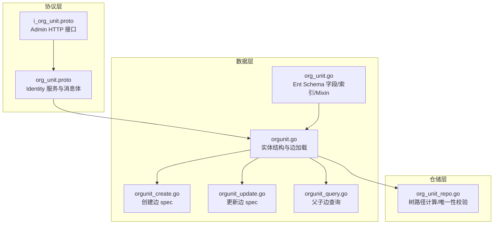
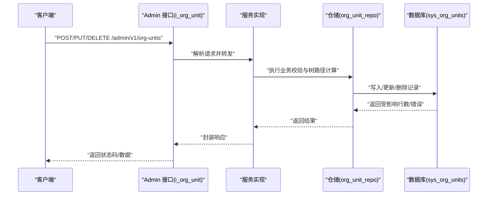
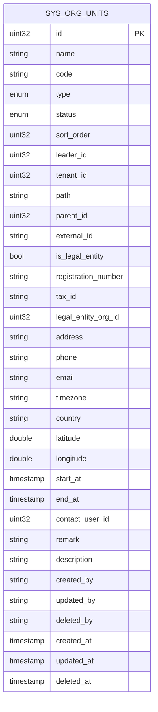
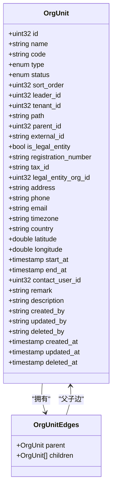
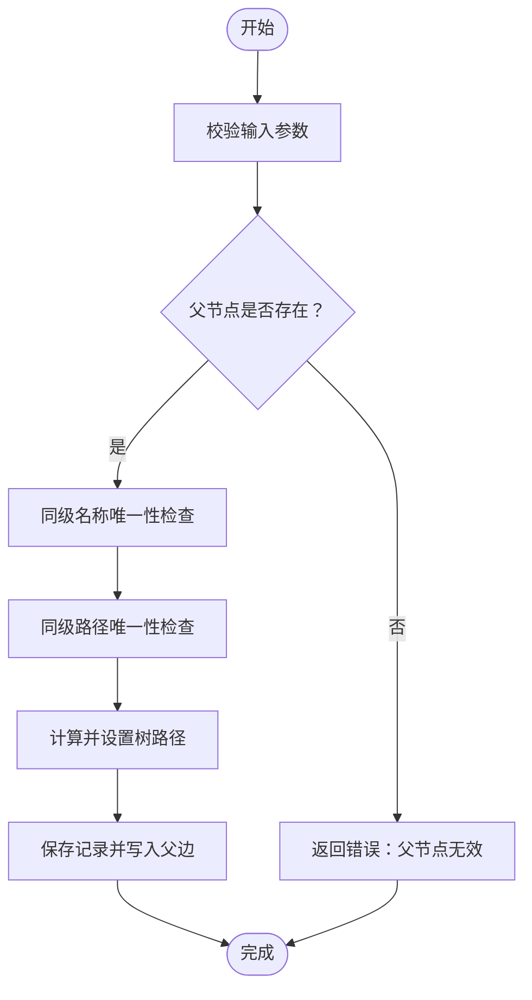
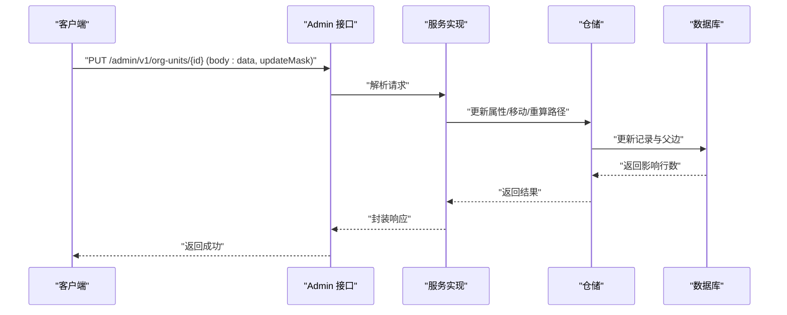
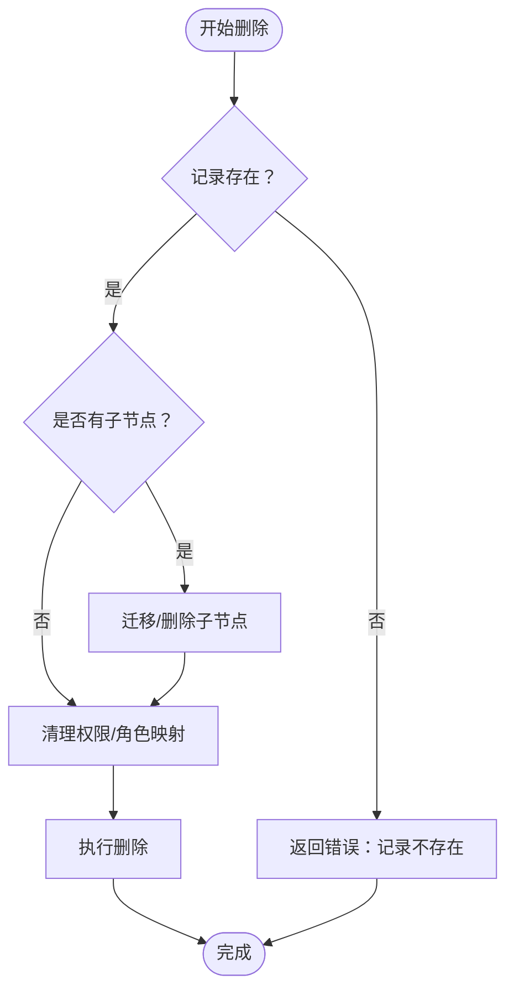
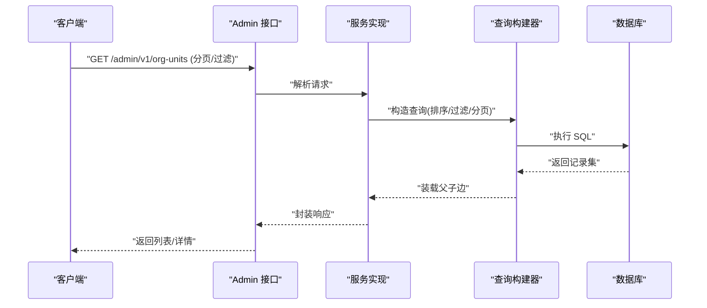
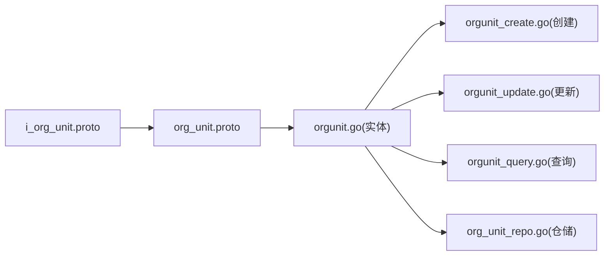

# 组织单位管理

<cite>
**本文引用的文件**
- [backend/api/protos/identity/service/v1/org_unit.proto](file://backend/api/protos/identity/service/v1/org_unit.proto)
- [backend/api/protos/admin/service/v1/i_org_unit.proto](file://backend/api/protos/admin/service/v1/i_org_unit.proto)
- [backend/app/admin/service/internal/data/ent/schema/org_unit.go](file://backend/app/admin/service/internal/data/ent/schema/org_unit.go)
- [backend/app/admin/service/internal/data/ent/orgunit.go](file://backend/app/admin/service/internal/data/ent/orgunit.go)
- [backend/app/admin/service/internal/data/ent/orgunit/orgunit.go](file://backend/app/admin/service/internal/data/ent/orgunit/orgunit.go)
- [backend/app/admin/service/internal/data/ent/orgunit_create.go](file://backend/app/admin/service/internal/data/ent/orgunit_create.go)
- [backend/app/admin/service/internal/data/ent/orgunit_update.go](file://backend/app/admin/service/internal/data/ent/orgunit_update.go)
- [backend/app/admin/service/internal/data/ent/orgunit_query.go](file://backend/app/admin/service/internal/data/ent/orgunit_query.go)
- [backend/app/admin/service/internal/data/org_unit_repo.go](file://backend/app/admin/service/internal/data/org_unit_repo.go)
</cite>

## 目录
1. [简介](#简介)
2. [项目结构](#项目结构)
3. [核心组件](#核心组件)
4. [架构总览](#架构总览)
5. [详细组件分析](#详细组件分析)
6. [依赖分析](#依赖分析)
7. [性能考量](#性能考量)
8. [故障排查指南](#故障排查指南)
9. [结论](#结论)
10. [附录](#附录)

## 简介
本文件系统化梳理组织单位管理功能，覆盖树形结构设计、层级关系维护、父子节点管理、属性字段定义、创建/更新/删除流程、查询接口与最佳实践。组织单位采用邻接表+树路径的混合模型，通过唯一性索引保障同级名称与路径不冲突，并提供丰富的查询与排序能力。

## 项目结构
组织单位相关能力由以下层次构成：
- 协议层：定义 gRPC/HTTP 接口与消息体
- 数据层：Ent Schema 定义字段、索引、Mixin；生成的实体与查询构建器
- 仓储层：树路径计算、唯一性校验、父子边维护等业务逻辑

**图表来源**
- [backend/api/protos/admin/service/v1/i_org_unit.proto:12-49](file://backend/api/protos/admin/service/v1/i_org_unit.proto#L12-L49)
- [backend/api/protos/identity/service/v1/org_unit.proto:13-34](file://backend/api/protos/identity/service/v1/org_unit.proto#L13-L34)
- [backend/app/admin/service/internal/data/ent/schema/org_unit.go:13-219](file://backend/app/admin/service/internal/data/ent/schema/org_unit.go#L13-L219)
- [backend/app/admin/service/internal/data/ent/orgunit.go:16-94](file://backend/app/admin/service/internal/data/ent/orgunit.go#L16-L94)
- [backend/app/admin/service/internal/data/ent/orgunit_create.go:763-798](file://backend/app/admin/service/internal/data/ent/orgunit_create.go#L763-L798)
- [backend/app/admin/service/internal/data/ent/orgunit_update.go:1070-1114](file://backend/app/admin/service/internal/data/ent/orgunit_update.go#L1070-L1114)
- [backend/app/admin/service/internal/data/ent/orgunit_query.go:460-507](file://backend/app/admin/service/internal/data/ent/orgunit_query.go#L460-L507)
- [backend/app/admin/service/internal/data/org_unit_repo.go:399-422](file://backend/app/admin/service/internal/data/org_unit_repo.go#L399-L422)

**章节来源**
- [backend/api/protos/admin/service/v1/i_org_unit.proto:12-49](file://backend/api/protos/admin/service/v1/i_org_unit.proto#L12-L49)
- [backend/api/protos/identity/service/v1/org_unit.proto:13-34](file://backend/api/protos/identity/service/v1/org_unit.proto#L13-L34)
- [backend/app/admin/service/internal/data/ent/schema/org_unit.go:13-219](file://backend/app/admin/service/internal/data/ent/schema/org_unit.go#L13-L219)

## 核心组件
- 协议接口
  - 列表、计数、详情、创建、更新、删除、批量创建
  - 支持分页请求与字段视图过滤
- 实体与边
  - 父子边：parent/children
  - 树路径 path：规范化存储，便于层级定位
  - Mixin：自动增长 ID、时间戳、操作者、开关状态、排序、租户、备注、描述、树结构、树路径
- 索引与唯一性
  - 同租户+父节点+名称唯一
  - 同租户+父节点+路径唯一
  - 全局路径索引
  - 父节点、负责人、联系人、类型、外部 ID、生效/结束时间等常用索引

**章节来源**
- [backend/api/protos/identity/service/v1/org_unit.proto:13-34](file://backend/api/protos/identity/service/v1/org_unit.proto#L13-L34)
- [backend/app/admin/service/internal/data/ent/schema/org_unit.go:147-219](file://backend/app/admin/service/internal/data/ent/schema/org_unit.go#L147-L219)

## 架构总览
组织单位管理从 HTTP/gRPC 入口进入，经由服务层调用仓储层，仓储层通过 Ent 完成数据库操作与树路径维护。

**图表来源**
- [backend/api/protos/admin/service/v1/i_org_unit.proto:12-49](file://backend/api/protos/admin/service/v1/i_org_unit.proto#L12-L49)
- [backend/app/admin/service/internal/data/org_unit_repo.go:399-422](file://backend/app/admin/service/internal/data/org_unit_repo.go#L399-L422)

## 详细组件分析

### 属性字段与模型
组织单位实体包含基础元数据、树结构字段、业务扩展字段与权限相关标签。字段覆盖名称、编码、类型、状态、排序、负责人、联系方式、法定主体、地理坐标、生效时间、权限标签、业务联系人等。

**图表来源**
- [backend/app/admin/service/internal/data/ent/schema/org_unit.go:29-144](file://backend/app/admin/service/internal/data/ent/schema/org_unit.go#L29-L144)
- [backend/app/admin/service/internal/data/ent/orgunit.go:16-94](file://backend/app/admin/service/internal/data/ent/orgunit.go#L16-L94)

**章节来源**
- [backend/app/admin/service/internal/data/ent/schema/org_unit.go:29-144](file://backend/app/admin/service/internal/data/ent/schema/org_unit.go#L29-L144)
- [backend/app/admin/service/internal/data/ent/orgunit.go:16-94](file://backend/app/admin/service/internal/data/ent/orgunit.go#L16-L94)

### 树形结构与父子节点管理
- 边定义
  - 父边：M2O（多对一）
  - 子边：O2M（一对多）
- 路径与层级
  - 使用树路径 path 进行层级定位与唯一性约束
  - 通过仓储层在创建/移动后计算并回填路径
- 查询
  - 支持按父节点、路径、名称等条件查询
  - 支持按 children 数量与子节点字段排序

**图表来源**
- [backend/app/admin/service/internal/data/ent/orgunit.go:16-125](file://backend/app/admin/service/internal/data/ent/orgunit.go#L16-L125)
- [backend/app/admin/service/internal/data/ent/orgunit/orgunit.go:86-99](file://backend/app/admin/service/internal/data/ent/orgunit/orgunit.go#L86-L99)

**章节来源**
- [backend/app/admin/service/internal/data/ent/orgunit.go:16-125](file://backend/app/admin/service/internal/data/ent/orgunit.go#L16-L125)
- [backend/app/admin/service/internal/data/ent/orgunit/orgunit.go:86-99](file://backend/app/admin/service/internal/data/ent/orgunit/orgunit.go#L86-L99)

### 创建流程（含唯一性与层级验证）
- 输入校验
  - 名称、类型、状态等字段校验
  - 上级单位存在性校验
- 唯一性检查
  - 同租户+父节点+名称唯一
  - 同租户+父节点+路径唯一
- 边与路径
  - 写入父边 parent
  - 计算并写入树路径 path
- 返回
  - 成功后返回空响应

**图表来源**
- [backend/app/admin/service/internal/data/ent/orgunit_create.go:763-798](file://backend/app/admin/service/internal/data/ent/orgunit_create.go#L763-L798)
- [backend/app/admin/service/internal/data/org_unit_repo.go:399-422](file://backend/app/admin/service/internal/data/org_unit_repo.go#L399-L422)
- [backend/app/admin/service/internal/data/ent/schema/org_unit.go:162-208](file://backend/app/admin/service/internal/data/ent/schema/org_unit.go#L162-L208)

**章节来源**
- [backend/app/admin/service/internal/data/ent/orgunit_create.go:763-798](file://backend/app/admin/service/internal/data/ent/orgunit_create.go#L763-L798)
- [backend/app/admin/service/internal/data/org_unit_repo.go:399-422](file://backend/app/admin/service/internal/data/org_unit_repo.go#L399-L422)
- [backend/app/admin/service/internal/data/ent/schema/org_unit.go:162-208](file://backend/app/admin/service/internal/data/ent/schema/org_unit.go#L162-L208)

### 更新流程（移动/属性变更/权限标签）
- 可选字段更新
  - 通过 FieldMask 指定更新字段
  - 支持允许缺失时的“插入”行为
- 移动到新位置
  - 更新父边 parent
  - 重新计算并写入树路径 path
- 权限标签
  - permission_tags 用于与权限/角色映射
- 返回
  - 成功后返回空响应

**图表来源**
- [backend/api/protos/admin/service/v1/i_org_unit.proto:27-41](file://backend/api/protos/admin/service/v1/i_org_unit.proto#L27-L41)
- [backend/api/protos/identity/service/v1/org_unit.proto:212-230](file://backend/api/protos/identity/service/v1/org_unit.proto#L212-L230)
- [backend/app/admin/service/internal/data/ent/orgunit_update.go:1070-1114](file://backend/app/admin/service/internal/data/ent/orgunit_update.go#L1070-L1114)
- [backend/app/admin/service/internal/data/org_unit_repo.go:399-422](file://backend/app/admin/service/internal/data/org_unit_repo.go#L399-L422)

**章节来源**
- [backend/api/protos/admin/service/v1/i_org_unit.proto:27-41](file://backend/api/protos/admin/service/v1/i_org_unit.proto#L27-L41)
- [backend/api/protos/identity/service/v1/org_unit.proto:212-230](file://backend/api/protos/identity/service/v1/org_unit.proto#L212-L230)
- [backend/app/admin/service/internal/data/ent/orgunit_update.go:1070-1114](file://backend/app/admin/service/internal/data/ent/orgunit_update.go#L1070-L1114)
- [backend/app/admin/service/internal/data/org_unit_repo.go:399-422](file://backend/app/admin/service/internal/data/org_unit_repo.go#L399-L422)

### 删除策略（空值检查/子节点处理/权限清理）
- 空值检查
  - 确认目标组织单位存在
- 子节点处理
  - 若存在子节点，需先迁移或删除子节点（由上层策略决定）
- 权限清理
  - 与组织单位相关的权限/角色映射应同步清理（由上层策略决定）
- 执行删除
  - 标记删除或物理删除（依据系统策略）

**图表来源**
- [backend/api/protos/identity/service/v1/org_unit.proto:232-240](file://backend/api/protos/identity/service/v1/org_unit.proto#L232-L240)
- [backend/app/admin/service/internal/data/ent/orgunit_query.go:492-507](file://backend/app/admin/service/internal/data/ent/orgunit_query.go#L492-L507)

**章节来源**
- [backend/api/protos/identity/service/v1/org_unit.proto:232-240](file://backend/api/protos/identity/service/v1/org_unit.proto#L232-L240)
- [backend/app/admin/service/internal/data/ent/orgunit_query.go:492-507](file://backend/app/admin/service/internal/data/ent/orgunit_query.go#L492-L507)

### 查询接口与使用方法
- 列表与计数
  - 支持分页请求
  - 支持按多种字段排序与过滤
- 详情
  - 支持 FieldMask 控制返回字段
- 树形结构
  - 可返回 children 子树
  - 可按路径/父节点/名称等条件查询

**图表来源**
- [backend/api/protos/admin/service/v1/i_org_unit.proto:12-18](file://backend/api/protos/admin/service/v1/i_org_unit.proto#L12-L18)
- [backend/api/protos/identity/service/v1/org_unit.proto:184-205](file://backend/api/protos/identity/service/v1/org_unit.proto#L184-L205)
- [backend/app/admin/service/internal/data/ent/orgunit_query.go:460-507](file://backend/app/admin/service/internal/data/ent/orgunit_query.go#L460-L507)

**章节来源**
- [backend/api/protos/admin/service/v1/i_org_unit.proto:12-18](file://backend/api/protos/admin/service/v1/i_org_unit.proto#L12-L18)
- [backend/api/protos/identity/service/v1/org_unit.proto:184-205](file://backend/api/protos/identity/service/v1/org_unit.proto#L184-L205)
- [backend/app/admin/service/internal/data/ent/orgunit_query.go:460-507](file://backend/app/admin/service/internal/data/ent/orgunit_query.go#L460-L507)

## 依赖分析
- 协议依赖
  - Admin 服务依赖 Identity 的组织单元消息体
- 数据层依赖
  - Ent Schema 定义字段与索引
  - Ent 生成的实体与查询构建器负责父子边与树路径的读写
- 仓储层依赖
  - 通过 Ent 执行唯一性校验与树路径计算

**图表来源**
- [backend/api/protos/admin/service/v1/i_org_unit.proto:9-9](file://backend/api/protos/admin/service/v1/i_org_unit.proto#L9-L9)
- [backend/api/protos/identity/service/v1/org_unit.proto:37-182](file://backend/api/protos/identity/service/v1/org_unit.proto#L37-L182)
- [backend/app/admin/service/internal/data/ent/orgunit.go:16-94](file://backend/app/admin/service/internal/data/ent/orgunit.go#L16-L94)
- [backend/app/admin/service/internal/data/ent/orgunit_create.go:763-798](file://backend/app/admin/service/internal/data/ent/orgunit_create.go#L763-L798)
- [backend/app/admin/service/internal/data/ent/orgunit_update.go:1070-1114](file://backend/app/admin/service/internal/data/ent/orgunit_update.go#L1070-L1114)
- [backend/app/admin/service/internal/data/ent/orgunit_query.go:460-507](file://backend/app/admin/service/internal/data/ent/orgunit_query.go#L460-L507)
- [backend/app/admin/service/internal/data/org_unit_repo.go:399-422](file://backend/app/admin/service/internal/data/org_unit_repo.go#L399-L422)

**章节来源**
- [backend/api/protos/admin/service/v1/i_org_unit.proto:9-9](file://backend/api/protos/admin/service/v1/i_org_unit.proto#L9-L9)
- [backend/api/protos/identity/service/v1/org_unit.proto:37-182](file://backend/api/protos/identity/service/v1/org_unit.proto#L37-L182)
- [backend/app/admin/service/internal/data/ent/orgunit.go:16-94](file://backend/app/admin/service/internal/data/ent/orgunit.go#L16-L94)

## 性能考量
- 索引优化
  - 同级唯一性索引（租户+父节点+名称/路径）避免重复与提升查询稳定性
  - 全局路径索引支持按路径快速定位
  - 常用过滤字段（父节点、负责人、联系人、类型、外部 ID、生效/结束时间）建立独立索引
- 查询优化
  - 使用 FieldMask 仅返回必要字段，减少序列化开销
  - 对 children 进行延迟加载或按需加载，避免大对象全量传输
- 写入优化
  - 创建/移动时一次性计算树路径，减少多次往返
  - 批量创建使用批量写入（见批量创建接口）

[本节为通用指导，无需特定文件引用]

## 故障排查指南
- 唯一性冲突
  - 现象：创建/更新时报同级名称或路径重复
  - 处理：检查同级父节点下是否已存在相同名称/路径
  - 参考索引定义与唯一性校验
- 父节点无效
  - 现象：更新父边失败或找不到父节点
  - 处理：确认父节点 ID 存在且属于同一租户
- 路径异常
  - 现象：树路径为空或格式不规范
  - 处理：确保创建/移动后正确计算并写入路径
- 查询性能差
  - 现象：列表/详情查询慢
  - 处理：确认是否命中相关索引；使用 FieldMask 限制字段；合理分页与排序

**章节来源**
- [backend/app/admin/service/internal/data/ent/schema/org_unit.go:162-217](file://backend/app/admin/service/internal/data/ent/schema/org_unit.go#L162-L217)
- [backend/app/admin/service/internal/data/org_unit_repo.go:399-422](file://backend/app/admin/service/internal/data/org_unit_repo.go#L399-L422)

## 结论
组织单位管理以 Ent 为核心，结合树路径与父子边实现灵活的层级结构。通过完善的索引与唯一性约束，保障数据一致性；通过协议层提供的标准接口，满足分页、过滤、树形返回等需求。建议在生产中配合严格的权限策略与审计日志，确保组织架构变更的可追溯性与安全性。

[本节为总结，无需特定文件引用]

## 附录

### 最佳实践
- 创建时优先指定父节点与名称，确保唯一性
- 移动组织单位时，先迁移其子节点再进行移动，避免断链
- 使用 FieldMask 控制返回字段，降低网络与序列化开销
- 对高频过滤字段建立索引，避免全表扫描
- 批量创建时合并事务，提升吞吐

[本节为通用指导，无需特定文件引用]