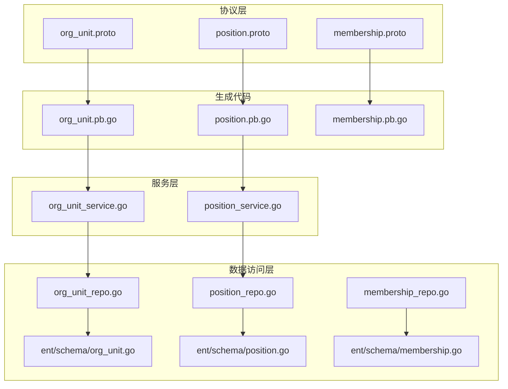
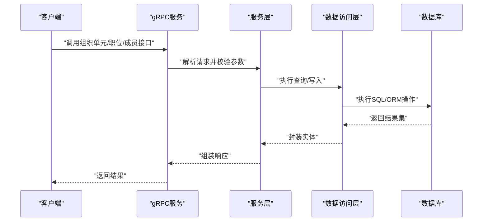
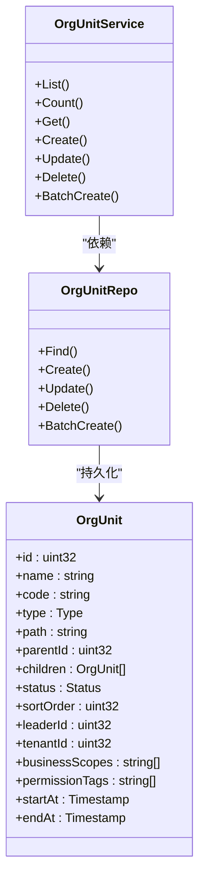
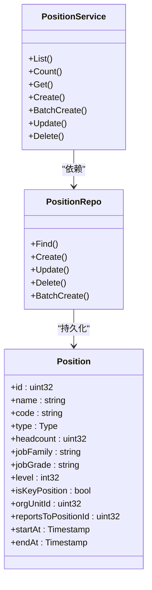
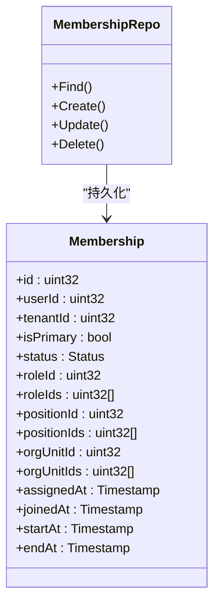
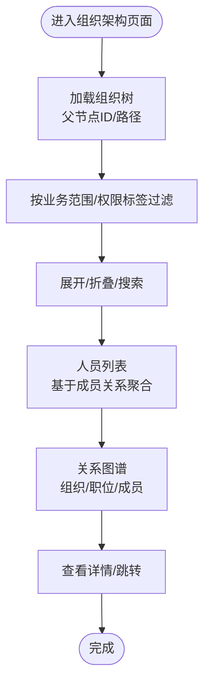
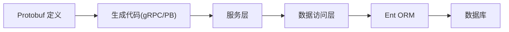

# 组织架构管理

<cite>
**本文引用的文件**
- [org_unit.proto](file://backend/api/protos/identity/service/v1/org_unit.proto)
- [position.proto](file://backend/api/protos/identity/service/v1/position.proto)
- [membership.proto](file://backend/api/protos/identity/service/v1/membership.proto)
- [org_unit.pb.go](file://backend/api/gen/go/identity/service/v1/org_unit.pb.go)
- [position.pb.go](file://backend/api/gen/go/identity/service/v1/position.pb.go)
- [membership.pb.go](file://backend/api/gen/go/identity/service/v1/membership.pb.go)
- [org_unit_service.go](file://backend/app/admin/service/internal/service/org_unit_service.go)
- [position_service.go](file://backend/app/admin/service/internal/service/position_service.go)
- [org_unit_repo.go](file://backend/app/admin/service/internal/data/org_unit_repo.go)
- [position_repo.go](file://backend/app/admin/service/internal/data/position_repo.go)
- [membership_repo.go](file://backend/app/admin/service/internal/data/membership_repo.go)
- [org_unit.go](file://backend/app/admin/service/internal/data/ent/schema/org_unit.go)
- [position.go](file://backend/app/admin/service/internal/data/ent/schema/position.go)
- [membership.go](file://backend/app/admin/service/internal/data/ent/schema/membership.go)
</cite>

## 目录
1. [引言](#引言)
2. [项目结构](#项目结构)
3. [核心组件](#核心组件)
4. [架构总览](#架构总览)
5. [详细组件分析](#详细组件分析)
6. [依赖分析](#依赖分析)
7. [性能考虑](#性能考虑)
8. [故障排查指南](#故障排查指南)
9. [结论](#结论)
10. [附录](#附录)

## 引言
本文件系统性梳理组织架构管理模块，覆盖组织单位（部门/团队/工作组等）、职位体系与成员关系三大核心领域。重点阐述：
- 组织架构树形结构设计：层级关系、父子路径、继承与权限传播的建模思路
- 不同组织形态的管理：公司、分部、部门、团队、项目、委员会、区域、子公司、分支机构等
- 职位体系：职位等级、职级映射、薪酬关联、汇报关系
- 成员关系：主身份、多重身份、岗位/角色/组织绑定、状态流转与有效期
- 可视化与导航：组织树、人员列表、关系图谱的交互设计要点
- 业务流程与合规：审批、权限控制、数据安全与审计

## 项目结构
组织架构管理由“协议层（proto）—生成代码（gRPC+PB）—服务层（service）—数据访问层（repo/ent）”构成，遵循清晰的分层职责与接口契约。

图表来源
- [org_unit.proto:12-34](file://backend/api/protos/identity/service/v1/org_unit.proto#L12-L34)
- [position.proto:12-33](file://backend/api/protos/identity/service/v1/position.proto#L12-L33)
- [membership.proto:8-104](file://backend/api/protos/identity/service/v1/membership.proto#L8-L104)
- [org_unit.pb.go:1-120](file://backend/api/gen/go/identity/service/v1/org_unit.pb.go#L1-L120)
- [position.pb.go:1-120](file://backend/api/gen/go/identity/service/v1/position.pb.go#L1-L120)
- [membership.pb.go:1-120](file://backend/api/gen/go/identity/service/v1/membership.pb.go#L1-L120)
- [org_unit_service.go](file://backend/app/admin/service/internal/service/org_unit_service.go)
- [position_service.go](file://backend/app/admin/service/internal/service/position_service.go)
- [org_unit_repo.go](file://backend/app/admin/service/internal/data/org_unit_repo.go)
- [position_repo.go](file://backend/app/admin/service/internal/data/position_repo.go)
- [membership_repo.go](file://backend/app/admin/service/internal/data/membership_repo.go)
- [org_unit.go](file://backend/app/admin/service/internal/data/ent/schema/org_unit.go)
- [position.go](file://backend/app/admin/service/internal/data/ent/schema/position.go)
- [membership.go](file://backend/app/admin/service/internal/data/ent/schema/membership.go)

章节来源
- [org_unit.proto:12-34](file://backend/api/protos/identity/service/v1/org_unit.proto#L12-L34)
- [position.proto:12-33](file://backend/api/protos/identity/service/v1/position.proto#L12-L33)
- [membership.proto:8-104](file://backend/api/protos/identity/service/v1/membership.proto#L8-L104)

## 核心组件
- 组织单元（OrgUnit）
  - 支持树形结构：包含父节点ID与子节点集合；路径字段用于快速定位层级
  - 类型枚举覆盖公司、分部、部门、团队、项目、委员会、区域、子公司、分支机构等
  - 法定主体标识、注册号、税号、地址、联系方式、时区、经纬度等扩展属性
  - 权限标签与业务范围，便于与权限/角色映射
- 职位（Position）
  - 职位类型：普通、领导、管理、实习、合同、其他
  - 职级/职级等级、是否关键岗位、编制人数、生效/失效时间
  - 汇报关系（向上级职位）与所属组织单元
- 成员关系（Membership）
  - 主身份/多重身份、状态（生效中、待审核、待接受、已过期、已拒绝、已停用）
  - 角色、岗位、组织单元的多对多绑定
  - 分配/加入/生效/失效时间链路，支持有效期管理

章节来源
- [org_unit.proto:36-182](file://backend/api/protos/identity/service/v1/org_unit.proto#L36-L182)
- [position.proto:35-145](file://backend/api/protos/identity/service/v1/position.proto#L35-L145)
- [membership.proto:9-104](file://backend/api/protos/identity/service/v1/membership.proto#L9-L104)

## 架构总览
组织架构管理采用gRPC+Protobuf定义服务契约，服务层负责编排业务逻辑，数据访问层封装实体与仓储模式，确保高内聚低耦合。

图表来源
- [org_unit.pb.go:632-744](file://backend/api/gen/go/identity/service/v1/org_unit.pb.go#L632-L744)
- [position.pb.go:548-660](file://backend/api/gen/go/identity/service/v1/position.pb.go#L548-L660)
- [membership.pb.go:85-112](file://backend/api/gen/go/identity/service/v1/membership.pb.go#L85-L112)
- [org_unit_service.go](file://backend/app/admin/service/internal/service/org_unit_service.go)
- [position_service.go](file://backend/app/admin/service/internal/service/position_service.go)
- [org_unit_repo.go](file://backend/app/admin/service/internal/data/org_unit_repo.go)
- [position_repo.go](file://backend/app/admin/service/internal/data/position_repo.go)
- [membership_repo.go](file://backend/app/admin/service/internal/data/membership_repo.go)

## 详细组件分析

### 组织单位（OrgUnit）模型与服务
- 数据模型要点
  - 树形结构：父节点ID、子节点集合、路径字段
  - 类型枚举：覆盖多种组织形态
  - 法定主体与扩展属性：便于合规与跨系统集成
  - 权限标签与业务范围：支撑权限映射与过滤
- 服务接口
  - 列表/统计、详情、创建、更新、删除、批量创建
  - 字段掩码与视图控制，支持按需返回字段
- 仓储与实体
  - 仓储封装查询/写入逻辑
  - Ent Schema 映射数据库结构

图表来源
- [org_unit.proto:36-182](file://backend/api/protos/identity/service/v1/org_unit.proto#L36-L182)
- [org_unit.pb.go:147-192](file://backend/api/gen/go/identity/service/v1/org_unit.pb.go#L147-L192)
- [org_unit_service.go](file://backend/app/admin/service/internal/service/org_unit_service.go)
- [org_unit_repo.go](file://backend/app/admin/service/internal/data/org_unit_repo.go)
- [org_unit.go](file://backend/app/admin/service/internal/data/ent/schema/org_unit.go)

章节来源
- [org_unit.proto:12-34](file://backend/api/protos/identity/service/v1/org_unit.proto#L12-L34)
- [org_unit.pb.go:147-192](file://backend/api/gen/go/identity/service/v1/org_unit.pb.go#L147-L192)
- [org_unit_service.go](file://backend/app/admin/service/internal/service/org_unit_service.go)
- [org_unit_repo.go](file://backend/app/admin/service/internal/data/org_unit_repo.go)
- [org_unit.go](file://backend/app/admin/service/internal/data/ent/schema/org_unit.go)

### 职位（Position）模型与服务
- 数据模型要点
  - 职位类型、职级/等级、是否关键岗位、编制人数
  - 汇报关系（上级职位）、所属组织单元
  - 生效/失效时间，支持动态生效策略
- 服务接口
  - 列表/统计、详情、创建、批量创建、更新、删除
  - 字段掩码与视图控制
- 仓储与实体
  - 仓储封装查询/写入逻辑
  - Ent Schema 映射数据库结构

图表来源
- [position.proto:35-145](file://backend/api/protos/identity/service/v1/position.proto#L35-L145)
- [position.pb.go:135-167](file://backend/api/gen/go/identity/service/v1/position.pb.go#L135-L167)
- [position_service.go](file://backend/app/admin/service/internal/service/position_service.go)
- [position_repo.go](file://backend/app/admin/service/internal/data/position_repo.go)
- [position.go](file://backend/app/admin/service/internal/data/ent/schema/position.go)

章节来源
- [position.proto:12-33](file://backend/api/protos/identity/service/v1/position.proto#L12-L33)
- [position.pb.go:135-167](file://backend/api/gen/go/identity/service/v1/position.pb.go#L135-L167)
- [position_service.go](file://backend/app/admin/service/internal/service/position_service.go)
- [position_repo.go](file://backend/app/admin/service/internal/data/position_repo.go)
- [position.go](file://backend/app/admin/service/internal/data/ent/schema/position.go)

### 成员关系（Membership）模型与服务
- 数据模型要点
  - 主身份/多重身份、状态全生命周期管理
  - 角色、岗位、组织单元的多对多绑定
  - 分配/加入/生效/失效时间链路
- 服务接口
  - 与组织/职位结合，支撑人员在组织内的身份与权限装配
- 仓储与实体
  - 仓储封装查询/写入逻辑
  - Ent Schema 映射数据库结构

图表来源
- [membership.proto:9-104](file://backend/api/protos/identity/service/v1/membership.proto#L9-L104)
- [membership.pb.go:85-112](file://backend/api/gen/go/identity/service/v1/membership.pb.go#L85-L112)
- [membership_repo.go](file://backend/app/admin/service/internal/data/membership_repo.go)
- [membership.go](file://backend/app/admin/service/internal/data/ent/schema/membership.go)

章节来源
- [membership.proto:9-104](file://backend/api/protos/identity/service/v1/membership.proto#L9-L104)
- [membership.pb.go:85-112](file://backend/api/gen/go/identity/service/v1/membership.pb.go#L85-L112)
- [membership_repo.go](file://backend/app/admin/service/internal/data/membership_repo.go)
- [membership.go](file://backend/app/admin/service/internal/data/ent/schema/membership.go)

### 组织树与成员关系的可视化与导航
- 组织树
  - 以父节点ID与路径字段构建树形结构，支持展开/折叠、搜索与高亮
  - 结合业务范围/权限标签进行过滤与筛选
- 人员列表
  - 基于成员关系聚合人员在组织内的身份与岗位
  - 支持按组织、职位、角色、状态、有效期等维度筛选
- 关系图谱
  - 展示组织单元、职位、成员之间的多对多关系
  - 支持跳转到详情与上下级关系查看

（本图为概念性流程示意，不直接映射具体源码文件）

### 组织形态与继承规则
- 组织形态
  - 支持公司、分部、部门、团队、项目、委员会、区域、子公司、分支机构等
- 继承规则
  - 通过父子关系与路径字段实现权限与属性的向下继承
  - 法定主体与扩展属性可用于合规与财务/税务映射
- 权限传播机制
  - 通过权限标签与业务范围，结合成员关系中的角色/岗位/组织绑定，形成“组织树+角色树”的复合权限传播

章节来源
- [org_unit.proto:44-57](file://backend/api/protos/identity/service/v1/org_unit.proto#L44-L57)
- [org_unit.proto:154-161](file://backend/api/protos/identity/service/v1/org_unit.proto#L154-L161)
- [membership.proto:68-94](file://backend/api/protos/identity/service/v1/membership.proto#L68-L94)

### 职位体系设计
- 职位等级与职级
  - 职级/等级字段支持数值化与序列化，便于薪酬体系关联与晋升管理
- 职位类型
  - 普通、领导、管理、实习、合同、其他，满足多样化用工形态
- 汇报关系
  - 上级职位ID与名称，支撑组织指挥链与审批流
- 生效/失效时间
  - 支持动态生效策略，配合成员关系的有效期管理

章节来源
- [position.proto:43-52](file://backend/api/protos/identity/service/v1/position.proto#L43-L52)
- [position.proto:84-126](file://backend/api/protos/identity/service/v1/position.proto#L84-L126)
- [position.proto:128-136](file://backend/api/protos/identity/service/v1/position.proto#L128-L136)

### 成员关系管理
- 主身份与多重身份
  - 主身份用于默认租户身份切换，多重身份支持跨组织/租户工作
- 状态流转
  - 生效中、待审核、待接受、已过期、已拒绝、已停用，覆盖全生命周期
- 有效期与时间链路
  - 分配/加入/生效/失效时间，支持临时项目/外包人员管理
- 与组织/职位/角色的绑定
  - 通过成员关系聚合，形成“人-组织-岗位-角色”的权限装配

章节来源
- [membership.proto:10-18](file://backend/api/protos/identity/service/v1/membership.proto#L10-L18)
- [membership.proto:35-66](file://backend/api/protos/identity/service/v1/membership.proto#L35-L66)
- [membership.proto:68-94](file://backend/api/protos/identity/service/v1/membership.proto#L68-L94)

## 依赖分析
- 协议与生成代码
  - Protobuf 定义服务契约，生成gRPC与消息体，确保前后端一致
- 服务层与数据访问层
  - 服务层编排业务规则，仓储层抽象数据访问，Ent ORM 提供强类型实体
- 外部依赖
  - 时间戳、字段掩码、分页等通用组件

图表来源
- [org_unit.proto:1-11](file://backend/api/protos/identity/service/v1/org_unit.proto#L1-L11)
- [position.proto:1-11](file://backend/api/protos/identity/service/v1/position.proto#L1-L11)
- [membership.proto:1-7](file://backend/api/protos/identity/service/v1/membership.proto#L1-L7)
- [org_unit.pb.go:1-27](file://backend/api/gen/go/identity/service/v1/org_unit.pb.go#L1-L27)
- [position.pb.go:1-27](file://backend/api/gen/go/identity/service/v1/position.pb.go#L1-L27)
- [membership.pb.go:1-24](file://backend/api/gen/go/identity/service/v1/membership.pb.go#L1-L24)

章节来源
- [org_unit.proto:1-11](file://backend/api/protos/identity/service/v1/org_unit.proto#L1-L11)
- [position.proto:1-11](file://backend/api/protos/identity/service/v1/position.proto#L1-L11)
- [membership.proto:1-7](file://backend/api/protos/identity/service/v1/membership.proto#L1-L7)

## 性能考虑
- 树形查询优化
  - 使用路径字段与索引，避免深度递归查询
  - 分页与字段掩码减少网络传输
- 批量操作
  - 批量创建组织单元与职位，降低请求次数
- 仓储缓存
  - 对热点组织/职位/成员关系进行缓存，提升读取性能
- 并发控制
  - 写入操作使用事务与锁，保证一致性

## 故障排查指南
- 常见问题
  - 组织树异常：检查父节点ID与路径字段一致性
  - 成员状态异常：核对分配/加入/生效/失效时间链路
  - 职位编制超限：关注编制人数与实际在岗人数
- 排查步骤
  - 查看服务日志与错误码
  - 核对请求参数与字段掩码
  - 检查仓储层SQL/ORM执行计划
  - 验证Ent Schema 与数据库结构一致性

章节来源
- [org_unit.pb.go:632-744](file://backend/api/gen/go/identity/service/v1/org_unit.pb.go#L632-L744)
- [position.pb.go:548-660](file://backend/api/gen/go/identity/service/v1/position.pb.go#L548-L660)
- [membership.pb.go:85-112](file://backend/api/gen/go/identity/service/v1/membership.pb.go#L85-L112)

## 结论
组织架构管理模块以清晰的分层架构与完善的协议契约为基础，围绕组织树、职位体系与成员关系三大主题，提供了可扩展、可维护、可审计的组织管理能力。通过权限标签与业务范围的结合，能够灵活支撑权限传播与合规要求；通过有效期与状态管理，满足多样化的组织形态与用工需求。

## 附录
- 术语
  - 组织单元：组织的基本组成单元，支持树形结构
  - 职位：岗位的抽象定义，包含等级、类型、编制等
  - 成员关系：人员在组织内的身份与权限装配
- 最佳实践
  - 统一编码规范与命名约定
  - 严格的状态机与有效期管理
  - 权限标签与业务范围的标准化映射
  - 定期审计与数据一致性校验