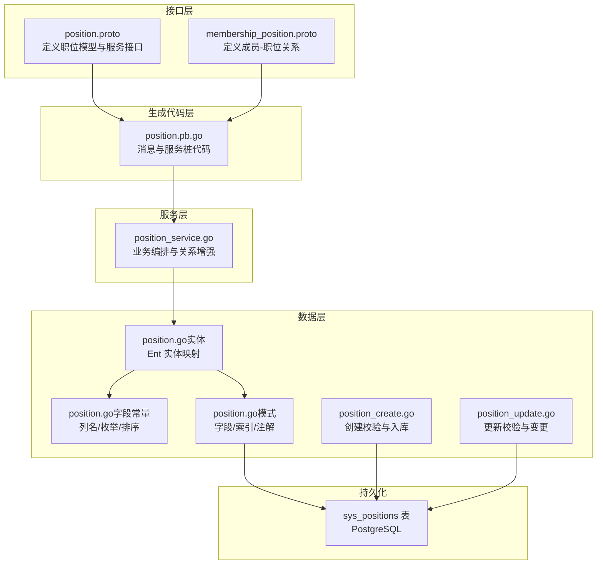
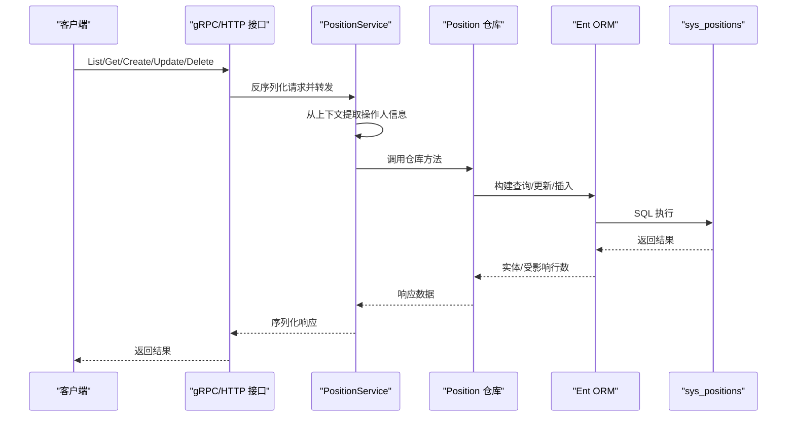
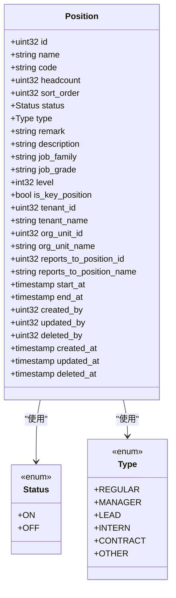
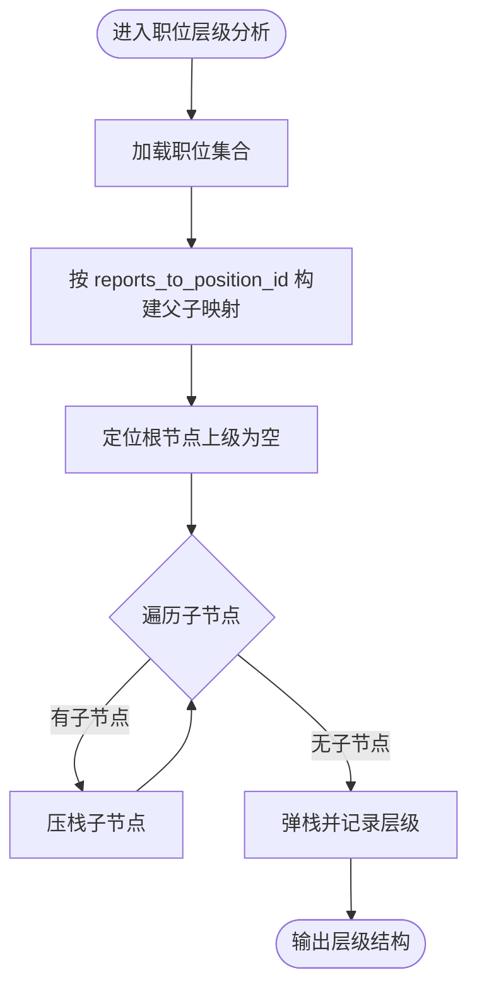
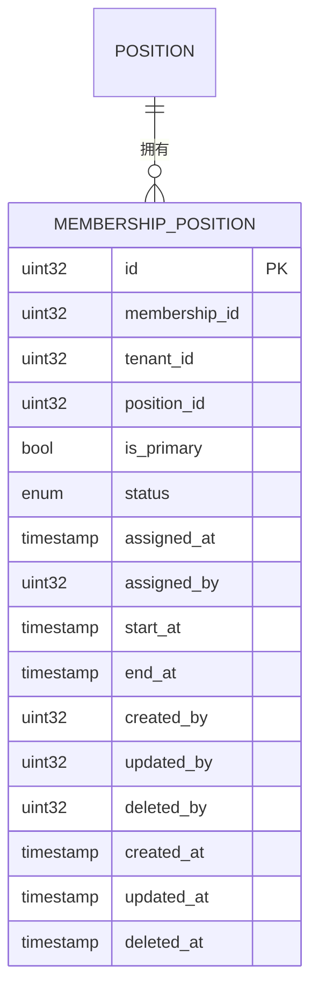
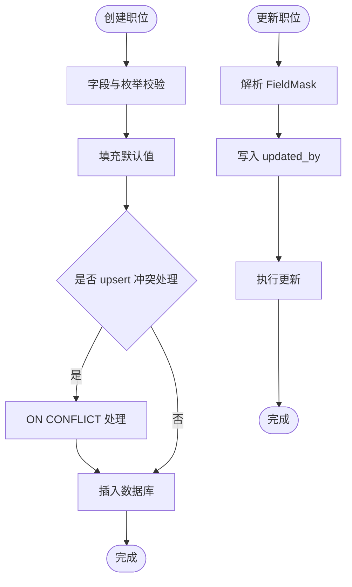
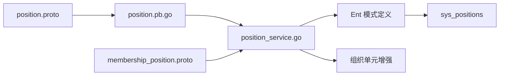

# 职位管理

<cite>
**本文引用的文件**
- [position.proto](file://backend/api/protos/identity/service/v1/position.proto)
- [position.pb.go](file://backend/api/gen/go/identity/service/v1/position.pb.go)
- [position_service.go](file://backend/app/admin/service/internal/service/position_service.go)
- [position.go（实体定义）](file://backend/app/admin/service/internal/data/ent/position.go)
- [position.go（字段常量）](file://backend/app/admin/service/internal/data/ent/position/position.go)
- [position.go（模式定义）](file://backend/app/admin/service/internal/data/ent/schema/position.go)
- [position_create.go](file://backend/app/admin/service/internal/data/ent/position_create.go)
- [position_update.go](file://backend/app/admin/service/internal/data/ent/position_update.go)
- [membership_position.proto](file://backend/api/protos/identity/service/v1/membership_position.proto)
- [postgresql-demo-data.sql](file://backend/sql/postgresql-demo-data.sql)
- [openapi.yaml](file://backend/app/admin/service/cmd/server/assets/openapi.yaml)
</cite>

## 目录
1. [简介](#简介)
2. [项目结构](#项目结构)
3. [核心组件](#核心组件)
4. [架构总览](#架构总览)
5. [详细组件分析](#详细组件分析)
6. [依赖分析](#依赖分析)
7. [性能考虑](#性能考虑)
8. [故障排查指南](#故障排查指南)
9. [结论](#结论)
10. [附录](#附录)

## 简介
本文件系统性阐述“职位管理”功能的设计与实现，覆盖职位的创建、维护与管理全生命周期；解释职位体系（职类/职级/职等）、职位基本属性、层级结构、与人员的关联关系（正式任职、兼任、代理）、权限配置、查询与统计能力，以及业务流程与合规要求（审批、权限控制、数据安全）。文档以代码为依据，结合可视化图示帮助读者快速理解与使用。

## 项目结构
职位管理功能由“协议定义 → 生成代码 → 服务层 → 数据层（Ent）”构成，前后端通过 gRPC/HTTP 与 OpenAPI 协议交互，数据库采用 Ent ORM 映射 sys_positions 表。

**图表来源**
- [position.proto:1-230](file://backend/api/protos/identity/service/v1/position.proto#L1-L230)
- [membership_position.proto:1-78](file://backend/api/protos/identity/service/v1/membership_position.proto#L1-L78)
- [position.pb.go:1-800](file://backend/api/gen/go/identity/service/v1/position.pb.go#L1-L800)
- [position_service.go:1-187](file://backend/app/admin/service/internal/service/position_service.go#L1-L187)
- [position.go（实体定义）:1-418](file://backend/app/admin/service/internal/data/ent/position.go#L1-L418)
- [position.go（字段常量）:1-307](file://backend/app/admin/service/internal/data/ent/position/position.go#L1-L307)
- [position.go（模式定义）:1-182](file://backend/app/admin/service/internal/data/ent/schema/position.go#L1-L182)
- [position_create.go:1-800](file://backend/app/admin/service/internal/data/ent/position_create.go#L1-L800)
- [position_update.go:1-800](file://backend/app/admin/service/internal/data/ent/position_update.go#L1-L800)

**章节来源**
- [position.proto:1-230](file://backend/api/protos/identity/service/v1/position.proto#L1-L230)
- [position_service.go:1-187](file://backend/app/admin/service/internal/service/position_service.go#L1-L187)
- [position.go（模式定义）:1-182](file://backend/app/admin/service/internal/data/ent/schema/position.go#L1-L182)

## 核心组件
- 职位模型与服务接口：通过 position.proto 定义 Position 消息、PositionService RPC，涵盖查询、计数、创建、批量创建、更新、删除等。
- 生成代码：position.pb.go 提供消息类型、服务桩、枚举值映射，便于 HTTP/gRPC 使用。
- 服务编排：position_service.go 负责调用仓库、注入操作人信息、增强关联（如组织单元名称回填）。
- 数据模型：Ent 实体映射 sys_positions 表，含字段、索引、注解与默认值；创建/更新流程包含校验与约束处理。
- 成员-职位关系：membership_position.proto 定义成员与职位的关联关系（含状态、生效/失效时间、分配者等）。

**章节来源**
- [position.proto:13-33](file://backend/api/protos/identity/service/v1/position.proto#L13-L33)
- [position.pb.go:135-167](file://backend/api/gen/go/identity/service/v1/position.pb.go#L135-L167)
- [position_service.go:21-40](file://backend/app/admin/service/internal/service/position_service.go#L21-L40)
- [position.go（实体定义）:16-68](file://backend/app/admin/service/internal/data/ent/position.go#L16-L68)
- [position.go（模式定义）:31-104](file://backend/app/admin/service/internal/data/ent/schema/position.go#L31-L104)
- [membership_position.proto:9-78](file://backend/api/protos/identity/service/v1/membership_position.proto#L9-L78)

## 架构总览
职位管理遵循分层架构：接口层（proto）→ 生成代码（pb.go）→ 服务层（service）→ 数据层（Ent）→ 数据库（sys_positions）。服务层负责鉴权上下文提取、关系增强与调用仓库；数据层负责字段校验、默认值、索引与约束；接口层提供统一的查询/统计/增删改能力。

**图表来源**
- [position_service.go:101-187](file://backend/app/admin/service/internal/service/position_service.go#L101-L187)
- [position_create.go:334-462](file://backend/app/admin/service/internal/data/ent/position_create.go#L334-L462)
- [position_update.go:471-687](file://backend/app/admin/service/internal/data/ent/position_update.go#L471-L687)
- [position.go（实体定义）:1-418](file://backend/app/admin/service/internal/data/ent/position.go#L1-L418)

## 详细组件分析

### 职位模型与属性
- 基本属性：名称、唯一编码、编制人数、排序、状态、类型、备注、描述、职类/职级、数值化职级、关键岗位标识、生效/失效时间、租户与组织单元关联、汇报关系等。
- 枚举与取值：状态（ON/OFF）、类型（REGULAR/MANAGER/LEAD/INTERN/CONTRACT/OTHER）。
- 关系字段：所属组织单元、汇报给哪个职位、是否关键岗位等。
- 时间戳：创建/更新/删除时间，以及生效/失效时间。

**图表来源**
- [position.proto:36-145](file://backend/api/protos/identity/service/v1/position.proto#L36-L145)
- [position.pb.go:135-167](file://backend/api/gen/go/identity/service/v1/position.pb.go#L135-L167)

**章节来源**
- [position.proto:36-145](file://backend/api/protos/identity/service/v1/position.proto#L36-L145)
- [position.pb.go:135-167](file://backend/api/gen/go/identity/service/v1/position.pb.go#L135-L167)

### 职位体系设计与层级结构
- 职类/职级/职等：通过 job_family、job_grade、level 字段表达，支持数值化职级排序与层级判断。
- 汇报关系：reports_to_position_id 建立职位间的上下级关系，支持层级查询与组织关系构建。
- 类型与关键岗位：type 与 is_key_position 用于区分岗位性质与关键程度，支撑权限与合规控制。

**图表来源**
- [position.go（模式定义）:47-50](file://backend/app/admin/service/internal/data/ent/schema/position.go#L47-L50)
- [position.go（字段常量）:43-62](file://backend/app/admin/service/internal/data/ent/position/position.go#L43-L62)

**章节来源**
- [position.go（模式定义）:47-50](file://backend/app/admin/service/internal/data/ent/schema/position.go#L47-L50)
- [position.go（字段常量）:43-62](file://backend/app/admin/service/internal/data/ent/position/position.go#L43-L62)

### 职位与人员的关联关系
- 正式任职：通过 membership_position 关联成员与职位，记录分配时间、分配者、状态（试用/在岗/离职/辞职/解聘/过期）。
- 兼任与代理：可通过多条 membership_position 记录在同一时间段内挂接多个职位；代理场景可结合状态与生效/失效时间表达。
- 主岗位标记：is_primary 字段用于标识主岗位，便于默认显示与权限继承。

**图表来源**
- [membership_position.proto:9-78](file://backend/api/protos/identity/service/v1/membership_position.proto#L9-L78)

**章节来源**
- [membership_position.proto:9-78](file://backend/api/protos/identity/service/v1/membership_position.proto#L9-L78)

### 权限配置与合规要求
- 操作人追踪：服务层在创建/更新时写入 created_by/updated_by，并在更新时自动追加 update_mask。
- 租户隔离：所有查询/索引均基于 tenant_id，确保跨租户数据隔离。
- 关键岗位标识：is_key_position 用于标识关键岗位，可作为权限与审计的判定条件。
- 生效/失效时间：start_at/end_at 支持岗位在时间维度上的有效区间控制，便于合规与审计。

**章节来源**
- [position_service.go:135-178](file://backend/app/admin/service/internal/service/position_service.go#L135-L178)
- [position.go（模式定义）:122-180](file://backend/app/admin/service/internal/data/ent/schema/position.go#L122-L180)

### 查询与统计能力
- 列表与计数：提供 List 与 Count 接口，支持分页与字段过滤（view_mask）。
- 关系增强：服务层在返回前拉取组织单元信息并回填名称，提升前端展示体验。
- 统计维度：可基于 type、job_family、job_grade、level、is_key_position、status 等字段进行聚合统计。

**章节来源**
- [position.proto:14-33](file://backend/api/protos/identity/service/v1/position.proto#L14-L33)
- [position_service.go:101-121](file://backend/app/admin/service/internal/service/position_service.go#L101-L121)

### 业务流程与合规
- 创建流程：校验必填字段与枚举合法性，写入默认值与操作人信息，支持 upsert（冲突处理）。
- 更新流程：根据 FieldMask 控制更新字段，自动写入 updated_by。
- 删除流程：通过仓库删除，遵循软删除字段（deleted_at）约定。
- 合规要点：租户维度唯一编码（code）、生效/失效时间控制、关键岗位标识、操作人追踪与审计字段。

**图表来源**
- [position_create.go:394-442](file://backend/app/admin/service/internal/data/ent/position_create.go#L394-L442)
- [position_update.go:498-521](file://backend/app/admin/service/internal/data/ent/position_update.go#L498-L521)
- [position_create.go:569-603](file://backend/app/admin/service/internal/data/ent/position_create.go#L569-L603)

**章节来源**
- [position_create.go:394-442](file://backend/app/admin/service/internal/data/ent/position_create.go#L394-L442)
- [position_update.go:498-521](file://backend/app/admin/service/internal/data/ent/position_update.go#L498-L521)

## 依赖分析
- 接口依赖：position.proto 依赖 gRPC/HTTP 注解与分页协议；生成 pb.go 供服务层使用。
- 服务依赖：position_service.go 依赖仓库接口、鉴权上下文、关系增强工具。
- 数据依赖：Ent 模式定义 sys_positions 的字段、索引与注解；创建/更新流程依赖校验器与默认值。
- 关系依赖：membership_position 依赖 Position；Position 依赖 OrgUnit（通过服务层增强）。

**图表来源**
- [position.proto:1-12](file://backend/api/protos/identity/service/v1/position.proto#L1-L12)
- [position.pb.go:1-27](file://backend/api/gen/go/identity/service/v1/position.pb.go#L1-L27)
- [position_service.go:53-99](file://backend/app/admin/service/internal/service/position_service.go#L53-L99)
- [position.go（模式定义）:13-28](file://backend/app/admin/service/internal/data/ent/schema/position.go#L13-L28)
- [membership_position.proto:1-8](file://backend/api/protos/identity/service/v1/membership_position.proto#L1-L8)

**章节来源**
- [position.proto:1-12](file://backend/api/protos/identity/service/v1/position.proto#L1-L12)
- [position_service.go:53-99](file://backend/app/admin/service/internal/service/position_service.go#L53-L99)
- [position.go（模式定义）:13-28](file://backend/app/admin/service/internal/data/ent/schema/position.go#L13-L28)

## 性能考虑
- 索引策略：针对 tenant_id/code/name/org_unit_id/reports_to_position_id/type/is_key_position/level/headcount/status/start_at/end_at 等建立复合与单列索引，优化查询与排序。
- 默认值与校验：在创建阶段集中处理默认值与校验，减少数据库约束失败重试。
- 关系批量拉取：服务层通过聚合器批量获取组织单元信息，降低 N+1 查询风险。
- 分页与字段过滤：优先使用 PagingRequest 与 FieldMask，避免全量字段传输。

**章节来源**
- [position.go（模式定义）:120-182](file://backend/app/admin/service/internal/data/ent/schema/position.go#L120-L182)
- [position_service.go:42-99](file://backend/app/admin/service/internal/service/position_service.go#L42-L99)

## 故障排查指南
- 参数错误：创建/更新请求参数为空或字段缺失，服务层返回“invalid parameter”错误。
- 枚举/校验失败：字段值不在允许范围内或违反校验器，抛出 ValidationError。
- 约束冲突：唯一索引（如 tenant_id+code）冲突，抛出 ConstraintError。
- 未找到：更新/删除目标不存在，抛出 NotFoundError。
- 时间范围异常：生效/失效时间逻辑错误导致查询异常，检查 start_at/end_at 设置。

**章节来源**
- [position_service.go:135-178](file://backend/app/admin/service/internal/service/position_service.go#L135-L178)
- [position_create.go:394-442](file://backend/app/admin/service/internal/data/ent/position_create.go#L394-L442)
- [position_update.go:529-687](file://backend/app/admin/service/internal/data/ent/position_update.go#L529-L687)

## 结论
职位管理功能以清晰的模型与严格的校验为基础，结合租户隔离、关键岗位标识与时间维度控制，满足组织管理与合规要求。通过服务层的关系增强与仓库抽象，实现了高效、可扩展的职位管理能力；配合成员-职位关系模型，可灵活支撑正式任职、兼任与代理等复杂场景。

## 附录

### 职位基础属性一览
- 基本信息：名称、编码、描述、备注
- 组织与层级：所属组织单元、汇报关系
- 职业体系：职类/职级、数值化职级、岗位类型
- 管理参数：编制人数、排序、状态、关键岗位
- 时间参数：生效/失效时间
- 追踪字段：创建/更新/删除时间与操作人

**章节来源**
- [position.proto:59-145](file://backend/api/protos/identity/service/v1/position.proto#L59-L145)

### 示例数据参考
- 示例职位数据包含多个部门与岗位类型，可作为测试与演示的基础。

**章节来源**
- [postgresql-demo-data.sql:70-84](file://backend/sql/postgresql-demo-data.sql#L70-L84)