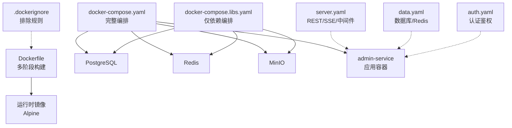
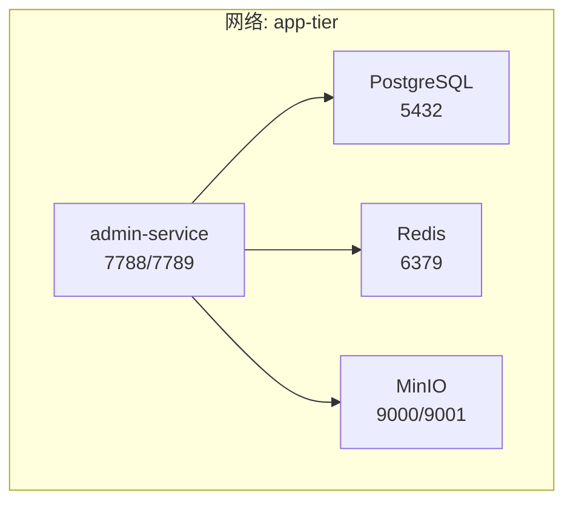
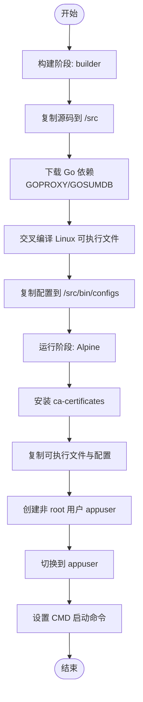
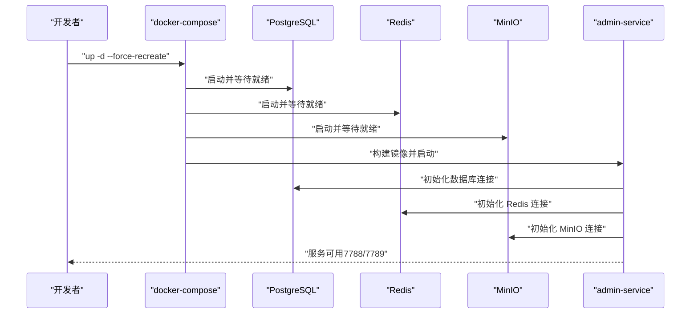
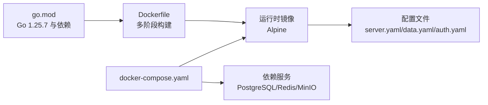

# 容器化部署

<cite>
**本文引用的文件**
- [Dockerfile](file://backend/Dockerfile)
- [docker-compose.yaml](file://backend/docker-compose.yaml)
- [docker-compose.libs.yaml](file://backend/docker-compose.libs.yaml)
- [.dockerignore](file://backend/.dockerignore)
- [server.yaml](file://backend/app/admin/service/configs/server.yaml)
- [data.yaml](file://backend/app/admin/service/configs/data.yaml)
- [auth.yaml](file://backend/app/admin/service/configs/auth.yaml)
- [full_deploy.sh](file://backend/scripts/docker/full_deploy.sh)
- [libs_only.sh](file://backend/scripts/docker/libs_only.sh)
- [go.mod](file://backend/go.mod)
</cite>

## 目录
1. [简介](#简介)
2. [项目结构](#项目结构)
3. [核心组件](#核心组件)
4. [架构总览](#架构总览)
5. [详细组件分析](#详细组件分析)
6. [依赖关系分析](#依赖关系分析)
7. [性能考虑](#性能考虑)
8. [故障排查指南](#故障排查指南)
9. [结论](#结论)
10. [附录](#附录)

## 简介
本指南面向 GoWind Admin 的容器化部署，系统性讲解 Dockerfile 多阶段构建流程与运行时镜像配置，详述镜像构建步骤（Go 依赖下载、可执行文件编译、配置文件复制等），并基于 docker-compose.yaml 提供服务编排配置说明（数据库、缓存、对象存储、应用服务）。文档还涵盖容器网络、卷挂载、环境变量、启动参数、健康检查、日志输出等运维要点，并给出开发、测试、生产等不同场景下的 compose 配置建议。

## 项目结构
与容器化部署直接相关的关键文件与位置如下：
- 构建与运行时镜像：backend/Dockerfile
- 服务编排（完整依赖与应用）：backend/docker-compose.yaml
- 服务编排（仅依赖）：backend/docker-compose.libs.yaml
- 构建与运行时排除规则：backend/.dockerignore
- 应用配置（REST/SSE/异步队列/中间件）：backend/app/admin/service/configs/server.yaml
- 数据层配置（数据库、Redis）：backend/app/admin/service/configs/data.yaml
- 认证鉴权配置（JWT/OIDC/预共享密钥等）：backend/app/admin/service/configs/auth.yaml
- 启动脚本（完整部署与仅依赖）：backend/scripts/docker/full_deploy.sh、backend/scripts/docker/libs_only.sh
- Go 版本与依赖清单：backend/go.mod

图表来源
- [Dockerfile:1-66](file://backend/Dockerfile#L1-L66)
- [docker-compose.yaml:1-125](file://backend/docker-compose.yaml#L1-L125)
- [docker-compose.libs.yaml:1-85](file://backend/docker-compose.libs.yaml#L1-L85)
- [.dockerignore:1-49](file://backend/.dockerignore#L1-L49)
- [server.yaml:1-49](file://backend/app/admin/service/configs/server.yaml#L1-L49)
- [data.yaml:1-21](file://backend/app/admin/service/configs/data.yaml#L1-L21)
- [auth.yaml:1-37](file://backend/app/admin/service/configs/auth.yaml#L1-L37)

章节来源
- [Dockerfile:1-66](file://backend/Dockerfile#L1-L66)
- [docker-compose.yaml:1-125](file://backend/docker-compose.yaml#L1-L125)
- [docker-compose.libs.yaml:1-85](file://backend/docker-compose.libs.yaml#L1-L85)
- [.dockerignore:1-49](file://backend/.dockerignore#L1-L49)

## 核心组件
- 多阶段构建镜像
  - 构建阶段：基于 golang:alpine，设置工作目录，复制源码，配置 GOPROXY/GOSUMDB，下载依赖，交叉编译 Linux 可执行文件，复制配置文件至 bin/configs。
  - 运行阶段：基于 Alpine，安装 ca-certificates，复制可执行文件与配置，创建非 root 用户 appuser 并切换，暴露端口，设置 CMD 启动命令。
- 服务编排
  - 完整编排：包含 PostgreSQL、Redis、MinIO、admin-service 四个服务，定义网络、端口映射、环境变量、构建参数等。
  - 仅依赖编排：仅包含 PostgreSQL、Redis、MinIO，便于本地开发时独立启动依赖。
- 配置文件
  - server.yaml：REST 服务地址、超时、Swagger、pprof、CORS、中间件开关；异步队列 Asynq 配置；SSE 地址与路径。
  - data.yaml：数据库驱动与连接串（默认 PostgreSQL）、迁移开关、连接池参数；Redis 地址与密码。
  - auth.yaml：认证类型（JWT/OIDC/预共享密钥）、授权类型（casbin/opa/zanzibar/noop）及对应引擎配置。
- 启动脚本
  - full_deploy.sh：完整部署脚本，自动准备数据目录、选择 docker compose 命令、强制重建并后台启动。
  - libs_only.sh：仅启动依赖脚本，支持自定义数据目录与 compose 文件路径。

章节来源
- [Dockerfile:1-66](file://backend/Dockerfile#L1-L66)
- [docker-compose.yaml:104-125](file://backend/docker-compose.yaml#L104-L125)
- [docker-compose.libs.yaml:52-84](file://backend/docker-compose.libs.yaml#L52-L84)
- [server.yaml:1-49](file://backend/app/admin/service/configs/server.yaml#L1-L49)
- [data.yaml:1-21](file://backend/app/admin/service/configs/data.yaml#L1-L21)
- [auth.yaml:1-37](file://backend/app/admin/service/configs/auth.yaml#L1-L37)
- [full_deploy.sh:1-96](file://backend/scripts/docker/full_deploy.sh#L1-L96)
- [libs_only.sh:1-120](file://backend/scripts/docker/libs_only.sh#L1-L120)

## 架构总览
下图展示容器化部署的整体架构：admin-service 依赖 PostgreSQL（数据持久化）、Redis（缓存与异步队列）、MinIO（对象存储），并通过 docker-compose 在同一桥接网络中通信。

图表来源
- [docker-compose.yaml:1-125](file://backend/docker-compose.yaml#L1-L125)
- [server.yaml:30-49](file://backend/app/admin/service/configs/server.yaml#L30-L49)
- [data.yaml:2-21](file://backend/app/admin/service/configs/data.yaml#L2-L21)

## 详细组件分析

### Dockerfile 多阶段构建流程
- 构建阶段（builder）
  - 基础镜像：golang:alpine，设置工作目录 /src，复制源码。
  - 依赖管理：配置 GOPROXY 与 GOSUMDB，执行 go mod download。
  - 编译：CGO_ENABLED=0，GOOS=linux，GOARCH=amd64，交叉编译生成 Linux 可执行文件，写入 /src/bin/{service}-server。
  - 配置复制：将 app/{service}/service/configs 下的配置复制到 /src/bin/configs，供运行时使用。
- 运行阶段
  - 基础镜像：Alpine，安装 ca-certificates。
  - 文件复制：从 builder 阶段复制可执行文件与配置。
  - 权限与用户：创建非 root 用户 appuser 并切换。
  - 启动命令：CMD ["/app/bin/server", "-c", "/app/configs"]，指定配置目录。

图表来源
- [Dockerfile:1-66](file://backend/Dockerfile#L1-L66)

章节来源
- [Dockerfile:1-66](file://backend/Dockerfile#L1-L66)

### docker-compose.yaml 服务编排
- 网络
  - 定义 app-tier 桥接网络，所有服务加入该网络以便内部通信。
- 服务
  - PostgreSQL：映射 5432，设置用户名、密码、数据库名，ulimit 配置。
  - Redis：映射 6379，设置密码、禁用部分高危命令、启用 IO 线程读取。
  - MinIO：映射 9000/9001，设置 root 用户与密码、默认桶、强制新密钥、控制台地址。
  - admin-service：映射 7788/7789，声明对 PostgreSQL、Redis、MinIO 的依赖，设置时区，使用本地 Dockerfile 构建并传入 SERVICE_NAME 与 APP_VERSION 参数。
- 构建参数
  - 通过 build.dockerfile 与 build.args 传递 SERVICE_NAME 与 APP_VERSION，确保镜像名称与版本一致。

图表来源
- [docker-compose.yaml:1-125](file://backend/docker-compose.yaml#L1-L125)

章节来源
- [docker-compose.yaml:1-125](file://backend/docker-compose.yaml#L1-L125)

### docker-compose.libs.yaml 仅依赖编排
- 作用：仅启动 PostgreSQL、Redis、MinIO，便于本地开发时在宿主机运行应用代码，减少容器重启频率。
- 关键点：通过 COMPOSE_FILE 指向该文件，结合 libs_only.sh 脚本实现一键启动依赖。

章节来源
- [docker-compose.libs.yaml:1-85](file://backend/docker-compose.libs.yaml#L1-L85)
- [libs_only.sh:1-120](file://backend/scripts/docker/libs_only.sh#L1-L120)

### 配置文件与运行参数
- server.yaml
  - REST 服务监听 7788，开启 Swagger 与 pprof，配置 CORS 允许的方法与来源，启用日志、恢复、追踪、验证、熔断、元数据等中间件。
  - Asynq 异步队列：连接 redis://:password@redis:6379/1，JSON 编解码，10 并发，10 秒优雅关闭，严格优先级，Asia/Shanghai 时区，critical/default/low 队列权重。
  - SSE：监听 7789，JSON 编解码，事件路径 /events，自动流式与自动回复策略。
- data.yaml
  - 默认使用 PostgreSQL，连接串包含 host/port/user/password/dbname/sslmode；启用迁移，连接池参数合理设置。
  - Redis 地址与密码，读写超时配置。
- auth.yaml
  - 支持 jwt/oidc/preshared_key 三种认证方式；授权支持 noop/casbin/opa/zanzibar；zanzibar 引擎可选 keto 或 open_fga。

章节来源
- [server.yaml:1-49](file://backend/app/admin/service/configs/server.yaml#L1-L49)
- [data.yaml:1-21](file://backend/app/admin/service/configs/data.yaml#L1-L21)
- [auth.yaml:1-37](file://backend/app/admin/service/configs/auth.yaml#L1-L37)

### 启动脚本与运维要点
- full_deploy.sh
  - 自动准备 APP_ROOT 下的子目录（postgres/redis/etcd/minio/jaeger），尝试 chown 1001:1001（若无 sudo 则警告）。
  - 自动检测 docker compose v2 插件或旧版 docker-compose，统一调用。
  - 使用 --force-recreate 强制重建并后台启动。
- libs_only.sh
  - 仅启动依赖服务，支持自定义 COMPOSE_FILE 与 APP_ROOT。
  - 适合本地开发：先启动依赖，再在宿主机运行应用代码。
- 日志输出
  - 通过 Docker 日志收集标准输出与错误输出；建议在生产环境配合集中式日志（如 ELK/Fluentd）。
- 健康检查
  - 建议在生产环境为 admin-service 添加健康检查（例如 HTTP GET /health），并在 compose 中启用 restart 策略。
- 环境变量
  - 时区 TZ=Asia/Shanghai 已在 compose 中设置；可根据需要调整。
  - 数据卷根目录 APP_ROOT 可通过环境变量覆盖，便于持久化数据与权限管理。

章节来源
- [full_deploy.sh:1-96](file://backend/scripts/docker/full_deploy.sh#L1-L96)
- [libs_only.sh:1-120](file://backend/scripts/docker/libs_only.sh#L1-L120)
- [docker-compose.yaml:117-125](file://backend/docker-compose.yaml#L117-L125)

## 依赖关系分析
- Go 版本与依赖
  - go.mod 指定 Go 版本为 1.25.7，包含 Kratos 生态、Ent、Asynq、Redis、MinIO、OpenTelemetry 等关键依赖。
- 容器镜像与配置
  - Dockerfile 使用 golang:alpine 作为构建镜像，Alpine 作为运行时镜像，确保镜像体积小且安全。
  - .dockerignore 排除 git、CI、IDE、文档、Docker 文件、构建产物、测试文件、脚本、日志、系统文件与 vendor 目录，减少镜像大小与构建时间。

图表来源
- [go.mod:1-290](file://backend/go.mod#L1-L290)
- [Dockerfile:1-66](file://backend/Dockerfile#L1-L66)
- [server.yaml:1-49](file://backend/app/admin/service/configs/server.yaml#L1-L49)
- [data.yaml:1-21](file://backend/app/admin/service/configs/data.yaml#L1-L21)
- [auth.yaml:1-37](file://backend/app/admin/service/configs/auth.yaml#L1-L37)
- [docker-compose.yaml:1-125](file://backend/docker-compose.yaml#L1-L125)

章节来源
- [go.mod:1-290](file://backend/go.mod#L1-L290)
- [.dockerignore:1-49](file://backend/.dockerignore#L1-L49)

## 性能考虑
- 构建阶段
  - 使用 goproxy.cn 代理加速依赖下载，GOSUMDB=off 避免校验失败导致的构建中断。
  - CGO_ENABLED=0 生成静态链接二进制，减小镜像体积并提升兼容性。
- 运行阶段
  - Alpine 基础镜像体积小，仅安装必要证书。
  - 非 root 用户运行降低安全风险。
- 数据层
  - PostgreSQL/Redis/MinIO 的 ulimit 与连接池参数已合理配置，建议根据业务峰值调优。
- 网络与端口
  - 通过 app-tier 桥接网络减少跨网络延迟，端口映射按需开放。

## 故障排查指南
- 构建失败（依赖下载）
  - 检查 GOPROXY 与 GOSUMDB 配置，确保网络可达；必要时切换为 direct。
- 运行时权限问题
  - 确认 appuser 用户存在且具备读取配置文件的权限。
- 数据库连接失败
  - 检查 data.yaml 中的 host/port/user/password/dbname 是否与 compose 中一致；确认服务依赖顺序与健康状态。
- Redis/MinIO 连接异常
  - 核对密码与端口映射；确认容器间网络连通。
- 健康检查与重启
  - 在生产环境为 admin-service 添加健康检查端点；合理设置 restart 策略与重启次数上限。
- 日志定位
  - 使用 docker logs 查看容器标准输出与错误输出；结合 server.yaml 中的日志中间件配置。

章节来源
- [Dockerfile:18-27](file://backend/Dockerfile#L18-L27)
- [data.yaml:2-21](file://backend/app/admin/service/configs/data.yaml#L2-L21)
- [server.yaml:22-29](file://backend/app/admin/service/configs/server.yaml#L22-L29)

## 结论
通过多阶段构建与精简运行时镜像，GoWind Admin 的容器化部署实现了“构建高效、运行安全、体积最小”的目标。配合 docker-compose 的服务编排，可快速搭建包含数据库、缓存与对象存储的完整开发与测试环境。结合启动脚本与运维最佳实践，可在不同环境下稳定运行并易于扩展。

## 附录

### 不同部署场景下的 compose 配置示例
- 开发环境
  - 使用 docker-compose.libs.yaml 启动依赖，本地运行应用代码；或使用 full_deploy.sh 一键启动完整环境。
  - 建议开启 Swagger 与 pprof，便于调试。
- 测试环境
  - 与开发环境类似，但建议固定镜像标签与版本参数（SERVICE_NAME/APP_VERSION）。
  - 为 admin-service 添加健康检查与 restart 策略。
- 生产环境
  - 使用固定镜像标签与版本参数，避免自动拉取 latest。
  - 明确数据卷挂载与权限（APP_ROOT 下的子目录），确保持久化与安全。
  - 为 PostgreSQL/Redis/MinIO 配置持久化卷与备份策略。
  - 为 admin-service 配置健康检查、资源限制、日志采集与告警。

章节来源
- [docker-compose.libs.yaml:1-85](file://backend/docker-compose.libs.yaml#L1-L85)
- [docker-compose.yaml:1-125](file://backend/docker-compose.yaml#L1-L125)
- [full_deploy.sh:1-96](file://backend/scripts/docker/full_deploy.sh#L1-L96)
- [libs_only.sh:1-120](file://backend/scripts/docker/libs_only.sh#L1-L120)