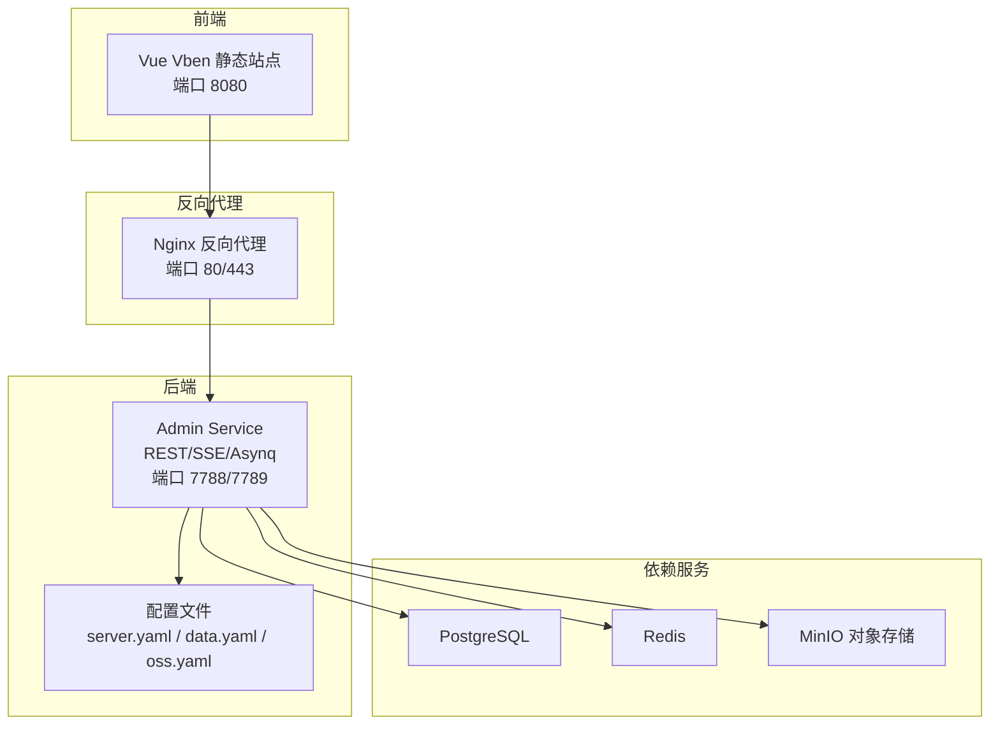
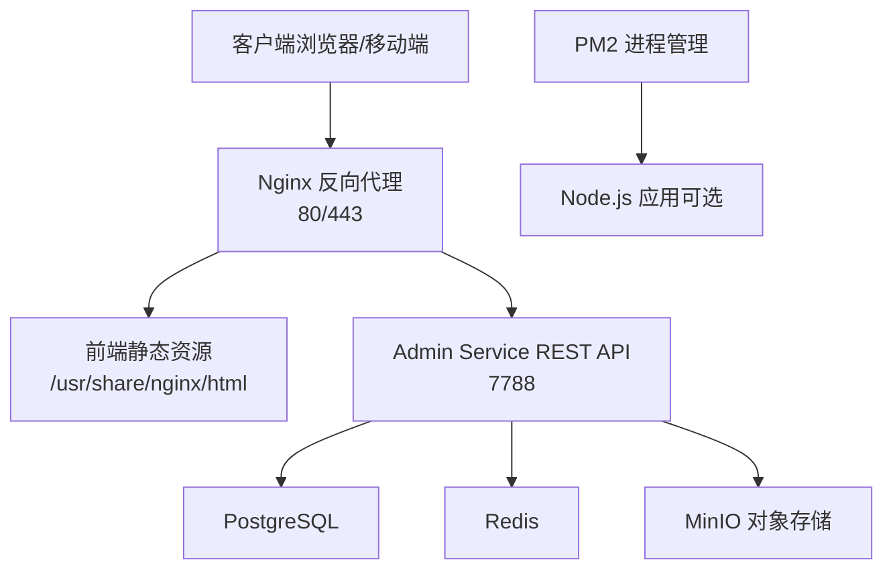
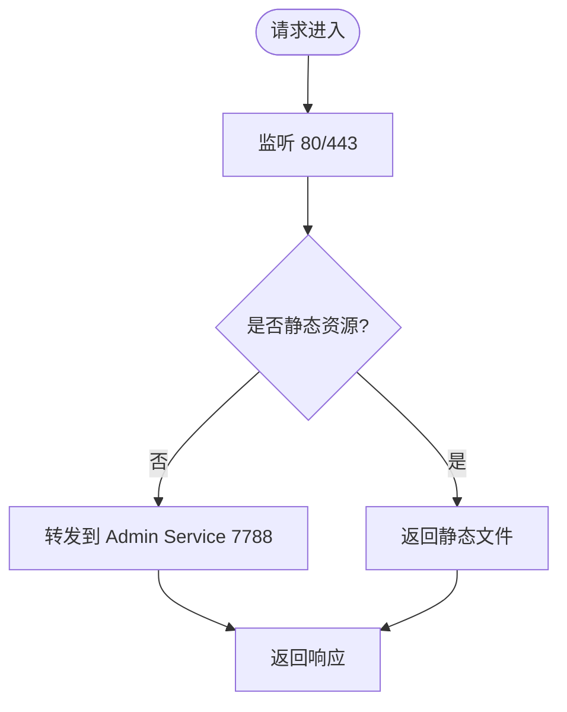
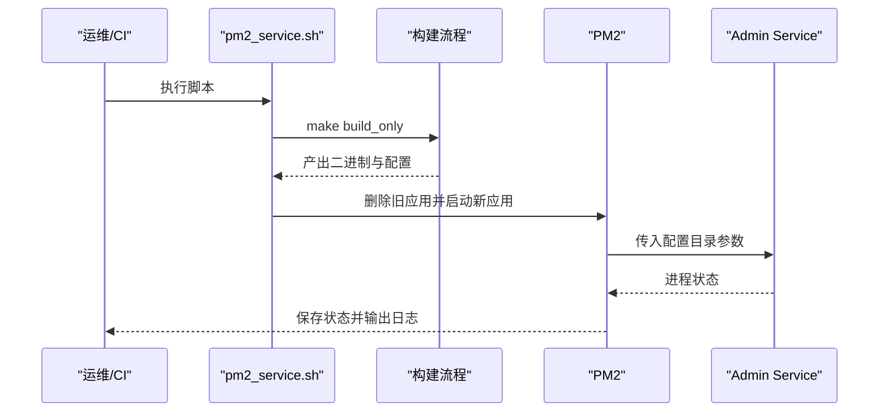
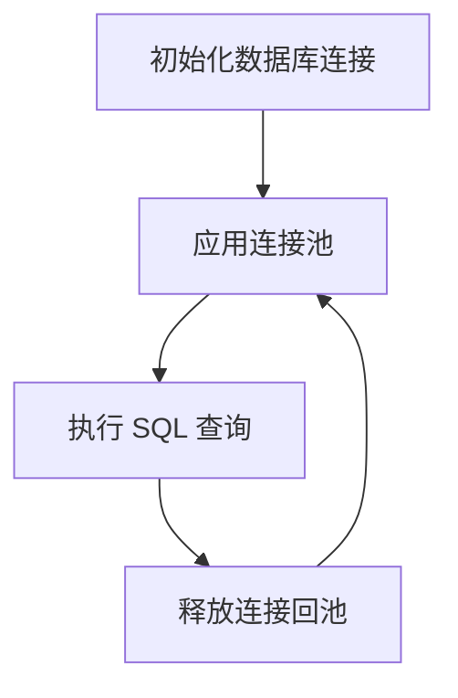
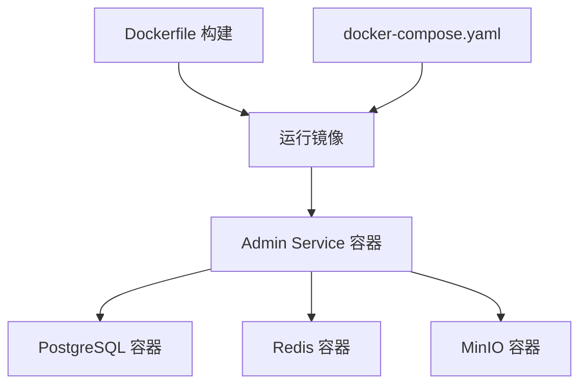
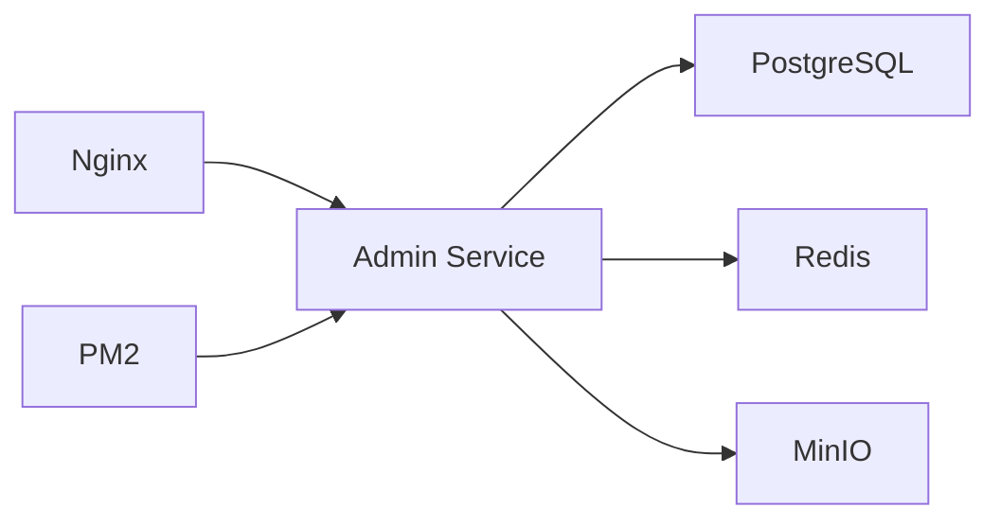

# 生产环境配置

<cite>
**本文引用的文件**
- [main.go](file://backend/app/admin/service/cmd/server/main.go)
- [server.yaml](file://backend/app/admin/service/configs/server.yaml)
- [data.yaml](file://backend/app/admin/service/configs/data.yaml)
- [oss.yaml](file://backend/app/admin/service/configs/oss.yaml)
- [auth.yaml](file://backend/app/admin/service/configs/auth.yaml)
- [client.yaml](file://backend/app/admin/service/configs/client.yaml)
- [logger.yaml](file://backend/app/admin/service/configs/logger.yaml)
- [pm2_service.sh](file://backend/scripts/deploy/pm2_service.sh)
- [docker-compose.yaml](file://backend/docker-compose.yaml)
- [Dockerfile](file://backend/Dockerfile)
- [app.mk](file://backend/app.mk)
- [full_deploy.sh](file://backend/scripts/docker/full_deploy.sh)
- [libs_only.sh](file://backend/scripts/docker/libs_only.sh)
- [nginx.conf](file://frontend/admin/vue-vben/scripts/deploy/nginx.conf)
</cite>

## 目录
1. [简介](#简介)
2. [项目结构](#项目结构)
3. [核心组件](#核心组件)
4. [架构总览](#架构总览)
5. [详细组件分析](#详细组件分析)
6. [依赖关系分析](#依赖关系分析)
7. [性能考虑](#性能考虑)
8. [故障排查指南](#故障排查指南)
9. [结论](#结论)
10. [附录](#附录)

## 简介
本指南面向 GoWind Admin 的生产环境部署与运维，围绕以下主题展开：
- Nginx 反向代理配置：静态资源服务、API 代理、CORS、Gzip、健康检查等
- PM2 进程管理：Node.js 应用的进程守护、自动重启、日志管理、配置热更新
- 关键服务优化：数据库连接池、Redis 缓存、对象存储（MinIO）配置
- 微服务配置要点：环境变量管理、配置文件热重载、服务发现（Consul/Etcd/Nacos 等）
- 安全加固与备份策略：TLS/HTTPS、访问控制、审计日志、备份与恢复
- 不同硬件环境下的配置模板与最佳实践

## 项目结构
后端采用 Kratos 微服务框架，结合 Docker Compose 提供数据库、缓存、对象存储等依赖；前端 Vue Vben 提供静态资源与反向代理示例。

图表来源
- [nginx.conf:49-74](file://frontend/admin/vue-vben/scripts/deploy/nginx.conf#L49-L74)
- [docker-compose.yaml:52-84](file://backend/docker-compose.yaml#L52-L84)
- [server.yaml:1-49](file://backend/app/admin/service/configs/server.yaml#L1-L49)

章节来源
- [docker-compose.yaml:1-125](file://backend/docker-compose.yaml#L1-L125)
- [Dockerfile:1-66](file://backend/Dockerfile#L1-L66)

## 核心组件
- Admin Service：基于 Kratos 的后端服务，提供 REST API、SSE、异步任务（Asynq）能力
- 数据库：PostgreSQL（默认），支持 MySQL 注释配置
- 缓存：Redis
- 对象存储：MinIO
- 前端静态资源：Vue Vben，提供 Nginx 反代示例
- PM2：用于 Node.js 应用的进程管理与守护

章节来源
- [main.go:1-76](file://backend/app/admin/service/cmd/server/main.go#L1-L76)
- [server.yaml:1-49](file://backend/app/admin/service/configs/server.yaml#L1-L49)
- [data.yaml:1-21](file://backend/app/admin/service/configs/data.yaml#L1-L21)
- [oss.yaml:1-10](file://backend/app/admin/service/configs/oss.yaml#L1-L10)
- [docker-compose.yaml:52-84](file://backend/docker-compose.yaml#L52-L84)
- [nginx.conf:49-74](file://frontend/admin/vue-vben/scripts/deploy/nginx.conf#L49-L74)

## 架构总览
下图展示生产环境典型拓扑：Nginx 作为统一入口，负责静态资源分发、CORS、健康检查与 TLS 终止；后端 Admin Service 通过配置文件连接数据库、缓存与对象存储；PM2 管理 Node.js 应用（如前端构建产物或辅助服务）。

图表来源
- [nginx.conf:49-74](file://frontend/admin/vue-vben/scripts/deploy/nginx.conf#L49-L74)
- [server.yaml:1-49](file://backend/app/admin/service/configs/server.yaml#L1-L49)
- [data.yaml:1-21](file://backend/app/admin/service/configs/data.yaml#L1-L21)
- [oss.yaml:1-10](file://backend/app/admin/service/configs/oss.yaml#L1-L10)
- [pm2_service.sh:96-132](file://backend/scripts/deploy/pm2_service.sh#L96-L132)

## 详细组件分析

### Nginx 反向代理配置
- 静态资源服务：监听 8080，root 指向静态目录，启用 try_files 回退至 index.html，适配 SPA 路由
- CORS 支持：允许跨域请求头与方法，满足前端跨域需求
- 健康检查：可新增 /health 接口返回 200
- Gzip 压缩：可按需开启常见文本/JS/CSS 类型压缩
- SSL/TLS：建议在生产环境启用 HTTPS，配置证书与强密码套件
- 负载均衡：多实例部署时，可将多个 Admin Service 实例加入 upstream 并轮询调度

图表来源
- [nginx.conf:49-74](file://frontend/admin/vue-vben/scripts/deploy/nginx.conf#L49-L74)

章节来源
- [nginx.conf:1-76](file://frontend/admin/vue-vben/scripts/deploy/nginx.conf#L1-L76)

### PM2 进程管理配置
- 自动构建与部署：脚本会加载 .env，执行构建，复制二进制与配置到安装目录，并通过 PM2 启动
- 日志管理：stdout/stderr 日志文件路径可配置，便于集中收集
- 命名空间：使用命名空间隔离不同项目/服务
- 配置热重载：PM2 支持优雅重启与进程监控，结合配置文件变更可实现平滑更新

图表来源
- [pm2_service.sh:96-132](file://backend/scripts/deploy/pm2_service.sh#L96-L132)
- [app.mk:94-100](file://backend/app.mk#L94-L100)

章节来源
- [pm2_service.sh:1-137](file://backend/scripts/deploy/pm2_service.sh#L1-L137)
- [app.mk:1-164](file://backend/app.mk#L1-L164)

### 数据库连接池配置
- 驱动与连接串：默认 PostgreSQL，支持 MySQL 注释配置
- 连接池参数：最大空闲连接数、最大打开连接数、连接最大生命周期
- 迁移与调试：可启用迁移与调试模式，生产建议关闭调试
- 性能建议：根据并发与查询特征调整连接上限，避免过度连接导致资源争用

图表来源
- [data.yaml:1-21](file://backend/app/admin/service/configs/data.yaml#L1-L21)

章节来源
- [data.yaml:1-21](file://backend/app/admin/service/configs/data.yaml#L1-L21)

### 缓存配置（Redis）
- 地址与认证：密码、超时参数
- 性能建议：合理设置读写超时，避免阻塞；在高并发场景下评估连接池大小与队列长度

章节来源
- [data.yaml:15-21](file://backend/app/admin/service/configs/data.yaml#L15-L21)

### 对象存储配置（MinIO）
- 端点与凭据：上传/下载主机、访问密钥、是否启用 SSL
- 生产建议：启用 SSL、限制桶权限、定期轮换密钥

章节来源
- [oss.yaml:1-10](file://backend/app/admin/service/configs/oss.yaml#L1-L10)

### 认证与授权配置
- 认证：支持 JWT/OIDC/Preshared Key
- 授权：支持 Casbin/OPA/Zanzibar（Keto/OpenFGA）

章节来源
- [auth.yaml:1-37](file://backend/app/admin/service/configs/auth.yaml#L1-L37)

### 客户端中间件与日志
- 客户端中间件：日志、恢复、追踪、校验、熔断、元数据
- 日志：标准输出、文件、Fluent、Zap、Logrus、云厂商日志通道

章节来源
- [client.yaml:1-14](file://backend/app/admin/service/configs/client.yaml#L1-L14)
- [logger.yaml:1-32](file://backend/app/admin/service/configs/logger.yaml#L1-L32)

### Docker 与容器编排
- Dockerfile：多阶段构建，Alpine 运行时，非 root 用户，暴露端口并以配置目录启动
- docker-compose：定义数据库、缓存、对象存储等依赖服务，以及 Admin Service

图表来源
- [Dockerfile:1-66](file://backend/Dockerfile#L1-L66)
- [docker-compose.yaml:52-125](file://backend/docker-compose.yaml#L52-L125)

章节来源
- [Dockerfile:1-66](file://backend/Dockerfile#L1-L66)
- [docker-compose.yaml:1-125](file://backend/docker-compose.yaml#L1-L125)

### 环境变量与配置热重载
- 环境变量：通过 .env 与 Makefile 注入，脚本会自动加载
- 配置热重载：建议在应用侧实现配置文件变更监听与重载逻辑（如文件系统事件或 API 触发）

章节来源
- [app.mk:7-11](file://backend/app.mk#L7-L11)
- [pm2_service.sh:24-33](file://backend/scripts/deploy/pm2_service.sh#L24-L33)

### 微服务配置要点
- 服务发现：可通过 Kratos Bootstrap 的注册中心插件启用 Consul/Etcd/Nacos 等
- 配置中心：可接入 Apollo/Consul/Etcd/Nacos/Kubernetes ConfigMap
- 追踪与可观测性：可启用 Jaeger/Zipkin 等分布式追踪

章节来源
- [main.go:14-35](file://backend/app/admin/service/cmd/server/main.go#L14-L35)

## 依赖关系分析
- Admin Service 依赖数据库、缓存与对象存储
- Nginx 依赖前端静态资源与后端 API
- PM2 依赖构建产物与配置文件

图表来源
- [docker-compose.yaml:52-125](file://backend/docker-compose.yaml#L52-L125)
- [nginx.conf:49-74](file://frontend/admin/vue-vben/scripts/deploy/nginx.conf#L49-L74)
- [pm2_service.sh:96-132](file://backend/scripts/deploy/pm2_service.sh#L96-L132)

章节来源
- [docker-compose.yaml:1-125](file://backend/docker-compose.yaml#L1-L125)
- [nginx.conf:1-76](file://frontend/admin/vue-vben/scripts/deploy/nginx.conf#L1-L76)
- [pm2_service.sh:1-137](file://backend/scripts/deploy/pm2_service.sh#L1-L137)

## 性能考虑
- Nginx
  - 启用 Gzip 压缩与静态缓存
  - 合理设置 worker 连接数与 keepalive
  - 使用上游集群与健康检查
- 后端
  - 调整数据库连接池上限与生命周期
  - Redis 读写超时与连接复用
  - SSE/Asynq 并发与队列优先级
- 容器
  - 使用非 root 用户与最小化镜像
  - 合理设置 CPU/内存限制与探针

## 故障排查指南
- Nginx
  - 检查静态资源路径与 try_files 配置
  - 查看错误日志定位跨域与权限问题
- Admin Service
  - 查看启动日志与配置加载情况
  - 检查数据库/缓存/对象存储连通性
- PM2
  - 使用 pm2 list/status 查看进程状态
  - 检查 stdout/stderr 日志文件
- Docker
  - 使用 docker-compose ps/logs 排查依赖服务状态

章节来源
- [pm2_service.sh:118-132](file://backend/scripts/deploy/pm2_service.sh#L118-L132)
- [full_deploy.sh:94-96](file://backend/scripts/docker/full_deploy.sh#L94-L96)
- [libs_only.sh:118-120](file://backend/scripts/docker/libs_only.sh#L118-L120)

## 结论
本指南提供了 GoWind Admin 生产环境的关键配置要点与实施建议。通过合理的 Nginx 反代、PM2 进程管理、数据库与缓存优化、对象存储配置以及微服务治理，可显著提升系统的稳定性、安全性与可维护性。建议结合业务规模与硬件资源，制定差异化的容量规划与灾备方案。

## 附录

### A. Nginx 生产配置模板要点
- 监听 80/443，启用 HTTPS 与强密码套件
- 静态资源缓存与 Gzip
- CORS 与安全头
- 健康检查接口与限流
- 负载均衡与会话保持（如需）

章节来源
- [nginx.conf:1-76](file://frontend/admin/vue-vben/scripts/deploy/nginx.conf#L1-L76)

### B. PM2 生产配置模板要点
- 使用命名空间隔离
- 配置日志轮转与输出路径
- 启用自动重启与异常告警
- 配置热重载与优雅停机

章节来源
- [pm2_service.sh:96-132](file://backend/scripts/deploy/pm2_service.sh#L96-L132)

### C. 数据库与缓存生产优化要点
- 连接池上限与生命周期
- 读写分离与只读副本
- 缓存预热与失效策略
- 监控指标与慢查询分析

章节来源
- [data.yaml:1-21](file://backend/app/admin/service/configs/data.yaml#L1-L21)

### D. 对象存储生产优化要点
- 启用 SSL 与访问控制
- 桶策略与 IAM 权限
- 跨域与签名 URL
- 备份与灾难恢复

章节来源
- [oss.yaml:1-10](file://backend/app/admin/service/configs/oss.yaml#L1-L10)

### E. 微服务配置要点
- 服务发现与配置中心
- 分布式追踪与日志聚合
- 熔断与降级策略
- API 网关与鉴权

章节来源
- [main.go:14-35](file://backend/app/admin/service/cmd/server/main.go#L14-L35)