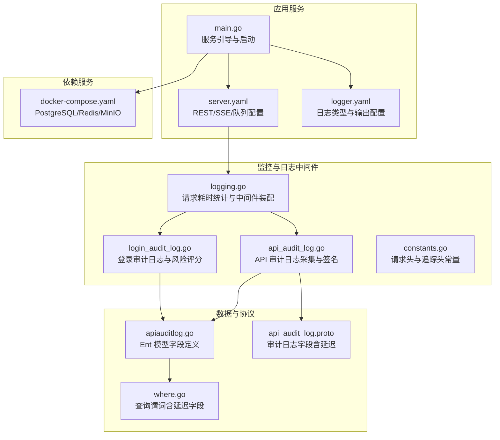
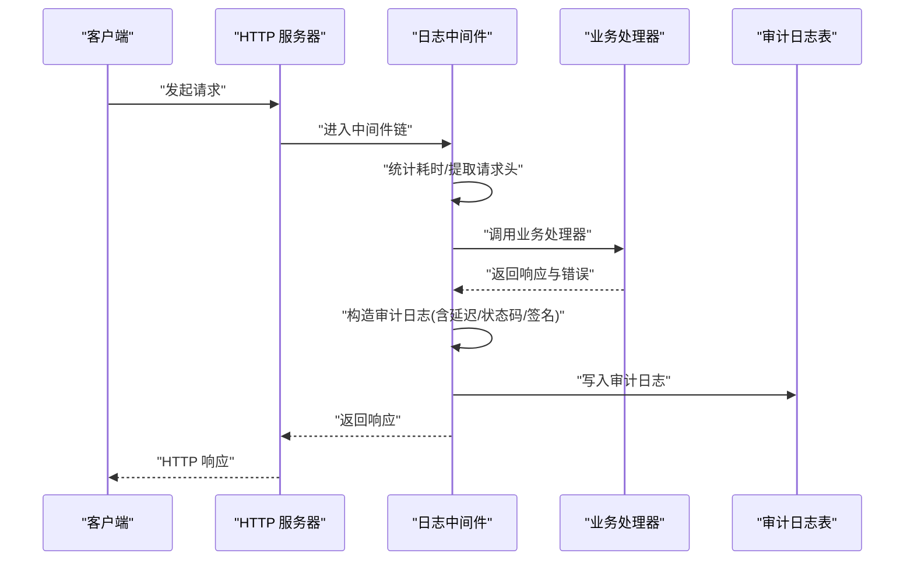
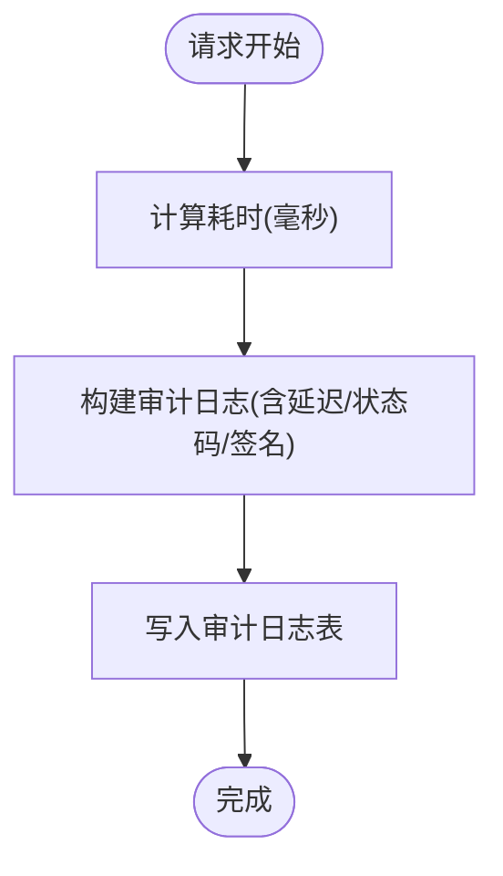
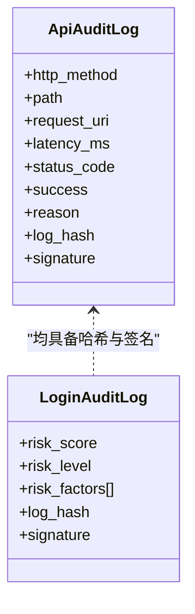
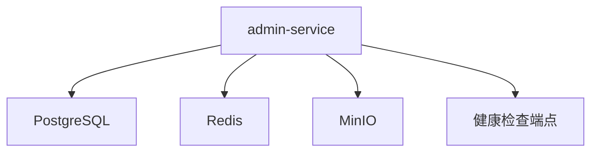
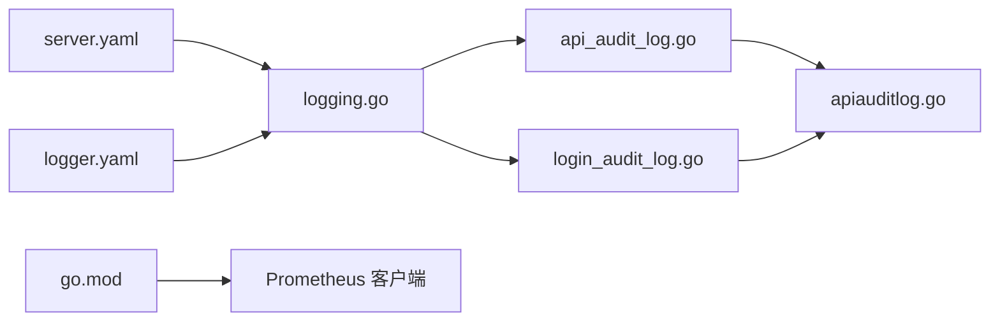

# 监控告警

<cite>
**本文引用的文件**
- [main.go](file://backend/app/admin/service/cmd/server/main.go)
- [server.yaml](file://backend/app/admin/service/configs/server.yaml)
- [logger.yaml](file://backend/app/admin/service/configs/logger.yaml)
- [logging.go](file://backend/pkg/middleware/logging/logging.go)
- [api_audit_log.go](file://backend/pkg/middleware/logging/api_audit_log.go)
- [login_audit_log.go](file://backend/pkg/middleware/logging/login_audit_log.go)
- [constants.go](file://backend/pkg/middleware/logging/constants.go)
- [docker-compose.yaml](file://backend/docker-compose.yaml)
- [go.mod](file://backend/go.mod)
- [go.sum](file://backend/go.sum)
- [apiauditlog.go](file://backend/app/admin/service/internal/data/ent/apiauditlog/apiauditlog.go)
- [where.go](file://backend/app/admin/service/internal/data/ent/apiauditlog/where.go)
- [api_audit_log.proto](file://backend/api/protos/audit/service/v1/api_audit_log.proto)
- [admin_error.pb.go](file://backend/api/gen/go/admin/service/v1/admin_error.pb.go)
- [authentication_error.pb.go](file://backend/api/gen/go/authentication/service/v1/authentication_error.pb.go)
- [internal_message_error.pb.go](file://backend/api/gen/go/internal_message/service/v1/internal_message_error.pb.go)
</cite>

## 目录
1. [简介](#简介)
2. [项目结构](#项目结构)
3. [核心组件](#核心组件)
4. [架构总览](#架构总览)
5. [详细组件分析](#详细组件分析)
6. [依赖分析](#依赖分析)
7. [性能考虑](#性能考虑)
8. [故障排查指南](#故障排查指南)
9. [结论](#结论)
10. [附录](#附录)

## 简介
本指南面向运维与开发团队，提供 GoWind Admin 后端服务的监控与告警落地实践，覆盖应用性能监控（APM）、日志监控（结构化日志、聚合与异常检测）、健康检查机制、以及与 Prometheus/Grafana/告警通知的集成建议。文档基于仓库现有代码与配置进行说明，帮助快速搭建可观测性体系并实现可视化展示与历史趋势分析。

## 项目结构
后端采用 Kratos 框架，服务入口通过引导器启动 HTTP、异步队列与 SSE 服务；日志中间件在请求处理链路中采集 API 审计与登录审计日志，并计算哈希与签名以确保完整性；数据库层通过 Ent 生成的模型存储审计日志；容器编排通过 docker-compose 提供 PostgreSQL、Redis、MinIO 等依赖服务。

**图表来源**
- [main.go:1-76](file://backend/app/admin/service/cmd/server/main.go#L1-L76)
- [server.yaml:1-49](file://backend/app/admin/service/configs/server.yaml#L1-L49)
- [logger.yaml:1-32](file://backend/app/admin/service/configs/logger.yaml#L1-L32)
- [logging.go:1-52](file://backend/pkg/middleware/logging/logging.go#L1-L52)
- [api_audit_log.go:1-162](file://backend/pkg/middleware/logging/api_audit_log.go#L1-L162)
- [login_audit_log.go:1-364](file://backend/pkg/middleware/logging/login_audit_log.go#L1-L364)
- [constants.go:1-14](file://backend/pkg/middleware/logging/constants.go#L1-L14)
- [apiauditlog.go:34-58](file://backend/app/admin/service/internal/data/ent/apiauditlog/apiauditlog.go#L34-L58)
- [where.go:117-145](file://backend/app/admin/service/internal/data/ent/apiauditlog/where.go#L117-L145)
- [api_audit_log.proto:126-165](file://backend/api/protos/audit/service/v1/api_audit_log.proto#L126-L165)
- [docker-compose.yaml:1-125](file://backend/docker-compose.yaml#L1-L125)

**章节来源**
- [main.go:1-76](file://backend/app/admin/service/cmd/server/main.go#L1-L76)
- [server.yaml:1-49](file://backend/app/admin/service/configs/server.yaml#L1-L49)
- [logger.yaml:1-32](file://backend/app/admin/service/configs/logger.yaml#L1-L32)
- [logging.go:1-52](file://backend/pkg/middleware/logging/logging.go#L1-L52)
- [api_audit_log.go:1-162](file://backend/pkg/middleware/logging/api_audit_log.go#L1-L162)
- [login_audit_log.go:1-364](file://backend/pkg/middleware/logging/login_audit_log.go#L1-L364)
- [constants.go:1-14](file://backend/pkg/middleware/logging/constants.go#L1-L14)
- [apiauditlog.go:34-58](file://backend/app/admin/service/internal/data/ent/apiauditlog/apiauditlog.go#L34-L58)
- [where.go:117-145](file://backend/app/admin/service/internal/data/ent/apiauditlog/where.go#L117-L145)
- [api_audit_log.proto:126-165](file://backend/api/protos/audit/service/v1/api_audit_log.proto#L126-L165)
- [docker-compose.yaml:1-125](file://backend/docker-compose.yaml#L1-L125)

## 核心组件
- 服务引导与启动：通过引导器装配 HTTP、异步队列与 SSE 服务，统一管理生命周期。
- 日志中间件：在请求处理完成后统计耗时，采集 API 与登录审计日志，计算日志哈希与签名，确保不可篡改性。
- 数据模型与查询：通过 Ent 生成的审计日志模型支持延迟、成功率、状态码等字段的查询与过滤。
- 配置中心：REST 与中间件开关、SSE、异步队列参数集中配置；日志类型与输出策略集中配置。

**章节来源**
- [main.go:46-75](file://backend/app/admin/service/cmd/server/main.go#L46-L75)
- [logging.go:14-51](file://backend/pkg/middleware/logging/logging.go#L14-L51)
- [api_audit_log.go:37-88](file://backend/pkg/middleware/logging/api_audit_log.go#L37-L88)
- [login_audit_log.go:39-114](file://backend/pkg/middleware/logging/login_audit_log.go#L39-L114)
- [server.yaml:22-28](file://backend/app/admin/service/configs/server.yaml#L22-L28)
- [logger.yaml:1-32](file://backend/app/admin/service/configs/logger.yaml#L1-L32)

## 架构总览
下图展示了从请求进入、中间件采集、日志落库到依赖服务的整体流程。

**图表来源**
- [logging.go:31-50](file://backend/pkg/middleware/logging/logging.go#L31-L50)
- [api_audit_log.go:37-88](file://backend/pkg/middleware/logging/api_audit_log.go#L37-L88)
- [login_audit_log.go:39-114](file://backend/pkg/middleware/logging/login_audit_log.go#L39-L114)
- [apiauditlog.go:34-58](file://backend/app/admin/service/internal/data/ent/apiauditlog/apiauditlog.go#L34-L58)

## 详细组件分析

### 应用性能监控（APM）
- 请求延迟与吞吐量
  - 中间件在每次请求结束后计算耗时（毫秒），并将其写入审计日志模型字段，便于后续统计与可视化。
  - 可结合 Prometheus 指标导出（见“附录”）对延迟分布、P95/P99 进行观测。
- 错误率与状态码
  - 中间件根据错误与状态码推导成功/失败标记，审计日志模型包含状态码与原因字段，可用于计算错误率与失败分类。
- 并发与队列
  - 异步队列配置包含并发、优先级与队列分区，有助于评估后台任务负载与积压情况。

**图表来源**
- [logging.go:31-50](file://backend/pkg/middleware/logging/logging.go#L31-L50)
- [api_audit_log.go:72-77](file://backend/pkg/middleware/logging/api_audit_log.go#L72-L77)
- [apiauditlog.go:51-57](file://backend/app/admin/service/internal/data/ent/apiauditlog/apiauditlog.go#L51-L57)

**章节来源**
- [logging.go:31-50](file://backend/pkg/middleware/logging/logging.go#L31-L50)
- [api_audit_log.go:72-77](file://backend/pkg/middleware/logging/api_audit_log.go#L72-L77)
- [server.yaml:30-42](file://backend/app/admin/service/configs/server.yaml#L30-L42)
- [apiauditlog.go:51-57](file://backend/app/admin/service/internal/data/ent/apiauditlog/apiauditlog.go#L51-L57)

### 日志监控（结构化、聚合与异常检测）
- 结构化日志格式
  - 审计日志包含 HTTP 方法、路径、请求 URI、用户标识、IP、延迟、状态码、原因、请求头与请求体等字段，便于统一解析与检索。
  - 登录审计日志包含风险评分与风险因素列表，用于异常登录检测。
- 日志聚合
  - 可通过日志收集器（如标准输出、文件、Fluent、Zap、Logrus 等）将日志输出至集中式平台进行聚合。
- 异常检测
  - 登录审计中间件内置风险评分与风险因素提取逻辑，可作为异常登录的触发条件之一。

**图表来源**
- [api_audit_log.proto:126-165](file://backend/api/protos/audit/service/v1/api_audit_log.proto#L126-L165)
- [api_audit_log.go:90-108](file://backend/pkg/middleware/logging/api_audit_log.go#L90-L108)
- [login_audit_log.go:116-134](file://backend/pkg/middleware/logging/login_audit_log.go#L116-L134)

**章节来源**
- [api_audit_log.proto:126-165](file://backend/api/protos/audit/service/v1/api_audit_log.proto#L126-L165)
- [api_audit_log.go:37-88](file://backend/pkg/middleware/logging/api_audit_log.go#L37-L88)
- [login_audit_log.go:39-114](file://backend/pkg/middleware/logging/login_audit_log.go#L39-L114)
- [logger.yaml:1-32](file://backend/app/admin/service/configs/logger.yaml#L1-L32)

### 健康检查机制
- 服务可用性检测
  - 可通过 HTTP 服务的健康端点（如 /health）与 pprof 开关进行可用性与性能诊断。
- 依赖服务检查
  - 依赖 PostgreSQL、Redis、MinIO，可通过 docker-compose 的健康检查与日志输出定位连接问题。
- 自动故障转移
  - 代码未直接实现自动故障转移逻辑，建议在部署层（如反向代理或编排层）实现多实例与负载均衡。

**图表来源**
- [docker-compose.yaml:6-84](file://backend/docker-compose.yaml#L6-L84)
- [server.yaml:2-6](file://backend/app/admin/service/configs/server.yaml#L2-L6)

**章节来源**
- [docker-compose.yaml:6-84](file://backend/docker-compose.yaml#L6-L84)
- [server.yaml:2-6](file://backend/app/admin/service/configs/server.yaml#L2-L6)

### 告警规则配置（阈值、级别与通知）
- 阈值设置
  - 延迟：基于审计日志中的延迟字段，可按接口维度设定 P95/P99 延迟阈值。
  - 错误率：基于成功/失败标记与状态码，计算各接口错误率阈值。
  - 登录风险：基于登录审计日志的风险评分与风险因素，设定高风险阈值。
- 告警级别
  - 建议按延迟、错误率、登录风险分别设定不同级别（如警告、严重、致命）。
- 通知渠道
  - 建议通过统一告警平台（如 Prometheus Alertmanager）对接企业微信、钉钉、邮件等通知通道。

（本节为通用配置建议，不直接对应具体源码）

### Prometheus 指标导出与 Grafana 仪表板
- 指标导出
  - 已引入 Prometheus 客户端库，可在业务中注册自定义指标（如延迟直方图、错误计数器、登录风险计数等）。
- Grafana 仪表板
  - 建议围绕以下主题构建仪表板：请求延迟分布、错误率趋势、登录异常事件、队列积压、数据库与缓存健康度。

**章节来源**
- [go.mod:189-193](file://backend/go.mod#L189-L193)
- [go.sum:773-791](file://backend/go.sum#L773-L791)

## 依赖分析
- 外部依赖
  - Prometheus 客户端与模型库：用于指标导出与通用模型。
  - Redis 客户端与 OpenTelemetry 集成：用于异步队列与可观测性扩展。
- 组件耦合
  - 日志中间件与审计模型强关联，保证字段一致性与查询便利性。
  - 服务配置集中管理，便于在不同环境切换中间件能力与日志输出方式。

**图表来源**
- [logging.go:1-52](file://backend/pkg/middleware/logging/logging.go#L1-L52)
- [api_audit_log.go:1-162](file://backend/pkg/middleware/logging/api_audit_log.go#L1-L162)
- [login_audit_log.go:1-364](file://backend/pkg/middleware/logging/login_audit_log.go#L1-L364)
- [apiauditlog.go:34-58](file://backend/app/admin/service/internal/data/ent/apiauditlog/apiauditlog.go#L34-L58)
- [server.yaml:1-49](file://backend/app/admin/service/configs/server.yaml#L1-L49)
- [logger.yaml:1-32](file://backend/app/admin/service/configs/logger.yaml#L1-L32)
- [go.mod:189-193](file://backend/go.mod#L189-L193)

**章节来源**
- [go.mod:189-217](file://backend/go.mod#L189-L217)
- [go.sum:773-801](file://backend/go.sum#L773-L801)

## 性能考虑
- 中间件开销
  - 日志中间件会读取请求体与计算哈希/签名，建议在高并发场景下评估 CPU 与 I/O 压力。
- 数据库写入
  - 审计日志写入建议使用批量写入或异步落盘策略，避免阻塞主请求链路。
- 指标与日志采样
  - 对高频接口可采用采样策略，降低指标与日志体量。

（本节为通用性能建议，不直接对应具体源码）

## 故障排查指南
- 常见错误码映射
  - 管理端、认证与内部消息模块均提供错误码映射，可用于定位失败原因与状态码。
- 登录异常
  - 登录审计中间件会记录失败原因与风险因素，可据此排查弱密码、未知设备、外部 IP 等风险场景。
- 日志输出
  - 根据 logger.yaml 配置选择合适的日志输出类型（标准输出、文件、第三方日志系统），以便快速定位问题。

**章节来源**
- [admin_error.pb.go:171-207](file://backend/api/gen/go/admin/service/v1/admin_error.pb.go#L171-L207)
- [authentication_error.pb.go:172-208](file://backend/api/gen/go/authentication/service/v1/authentication_error.pb.go#L172-L208)
- [internal_message_error.pb.go:434-483](file://backend/api/gen/go/internal_message/service/v1/internal_message_error.pb.go#L434-L483)
- [login_audit_log.go:39-114](file://backend/pkg/middleware/logging/login_audit_log.go#L39-L114)
- [logger.yaml:1-32](file://backend/app/admin/service/configs/logger.yaml#L1-L32)

## 结论
本指南基于现有代码与配置，给出了 GoWind Admin 的监控与告警落地路径：通过日志中间件采集关键指标、利用审计模型支撑查询与分析、结合 Prometheus/Grafana 实现可视化与趋势分析，并以错误码与风险评分辅助告警规则设计。建议在生产环境中进一步完善指标导出、告警策略与通知通道，并持续优化日志与数据库写入性能。

## 附录
- Prometheus 指标导出与 Grafana 仪表板配置
  - 在业务中注册延迟直方图、错误计数器、登录风险计数等指标，结合 Prometheus 抓取与 Grafana 可视化。
- 告警规则示例（概念性）
  - 接口 P99 延迟超过阈值、错误率连续上升、高风险登录事件触发告警。
- 通知渠道集成
  - 通过统一告警平台对接企业微信、钉钉、邮件等通知通道。

（本节为通用配置建议，不直接对应具体源码）