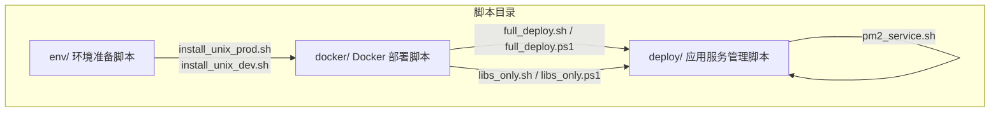
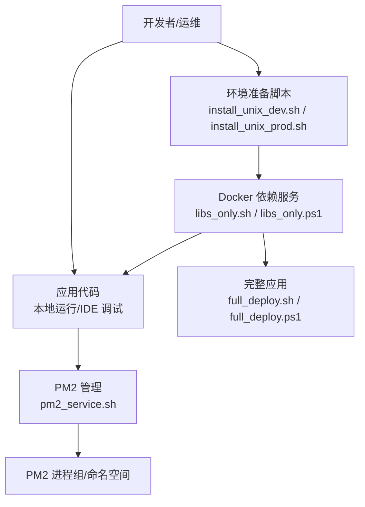
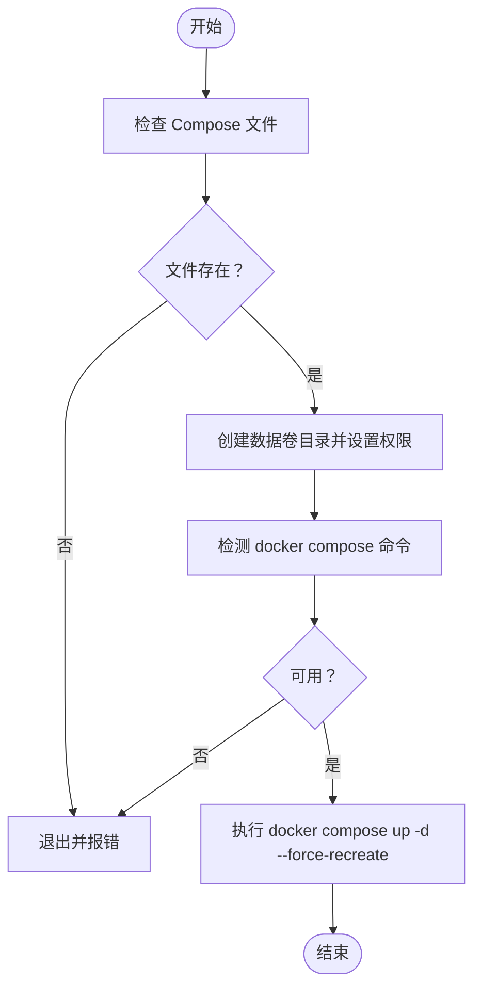
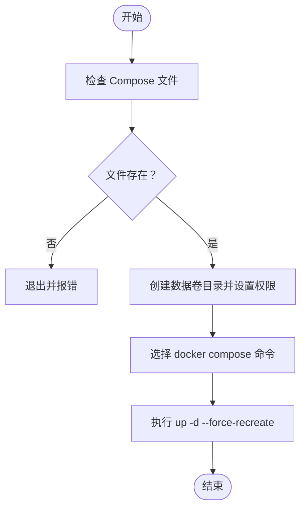
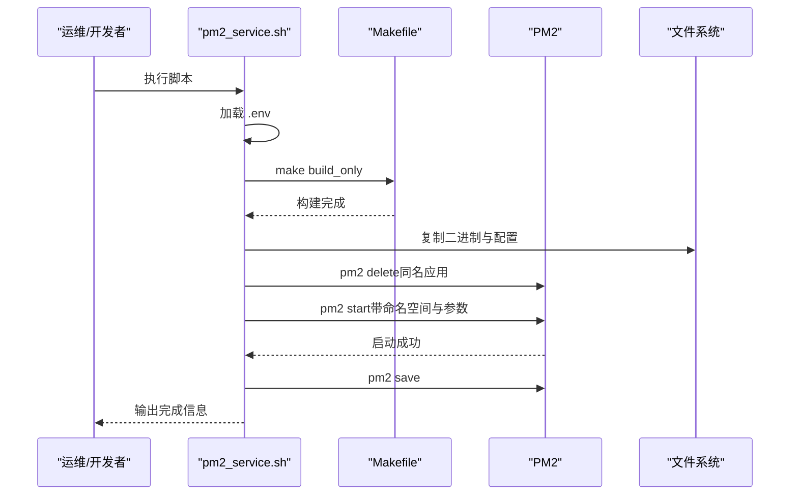
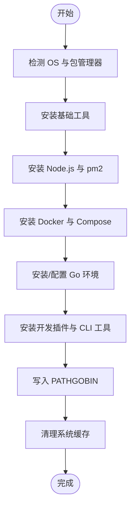
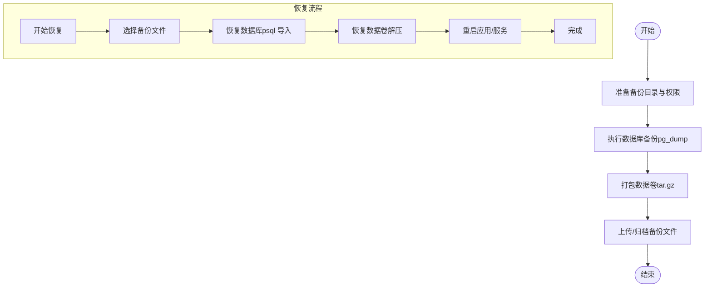
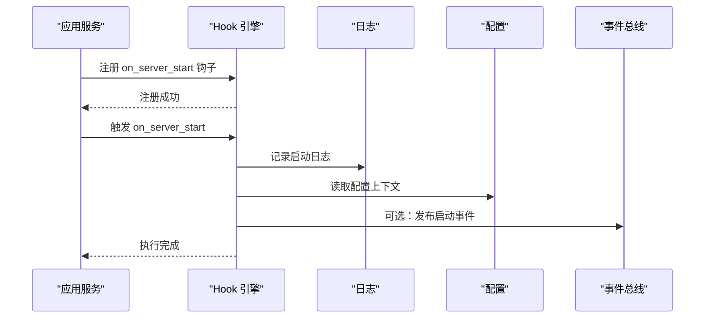
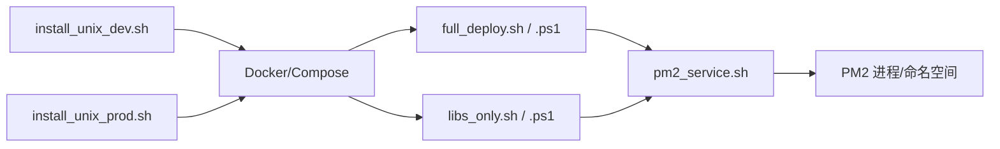

# 运维脚本

<cite>
**本文引用的文件**
- [full_deploy.sh](file://backend/scripts/docker/full_deploy.sh)
- [libs_only.sh](file://backend/scripts/docker/libs_only.sh)
- [full_deploy.ps1](file://backend/scripts/docker/full_deploy.ps1)
- [libs_only.ps1](file://backend/scripts/docker/libs_only.ps1)
- [pm2_service.sh](file://backend/scripts/deploy/pm2_service.sh)
- [install_unix_prod.sh](file://backend/scripts/env/install_unix_prod.sh)
- [install_unix_dev.sh](file://backend/scripts/env/install_unix_dev.sh)
- [scripts 说明文档](file://backend/scripts/README.md)
- [工作流与最佳实践](file://backend/scripts/WORKFLOWS_AND_BEST_PRACTICES.md)
- [备份任务定义](file://backend/pkg/task/backup.go)
- [服务器启动钩子示例](file://backend/app/admin/service/scripts/on_server_start.lua)
- [回调式钩子示例](file://backend/pkg/lua/example_callback_registration.lua)
</cite>

## 目录
1. [简介](#简介)
2. [项目结构](#项目结构)
3. [核心组件](#核心组件)
4. [架构总览](#架构总览)
5. [详细组件分析](#详细组件分析)
6. [依赖关系分析](#依赖关系分析)
7. [性能考虑](#性能考虑)
8. [故障排查指南](#故障排查指南)
9. [结论](#结论)
10. [附录](#附录)

## 简介
本指南面向 GoWind Admin 项目的运维与开发团队，系统讲解自动化部署脚本、PM2 服务管理脚本、环境准备脚本以及与之配套的工作流与最佳实践。重点覆盖：
- 完整部署脚本 full_deploy.sh 的完整部署流程与参数说明
- 仅依赖部署脚本 libs_only.sh 的使用场景与差异
- PM2 服务管理脚本 pm2_service.sh 的安装、启动、重启、日志查看与保存
- 数据库备份与恢复的常用方法与注意事项
- 环境切换脚本、版本升级脚本、配置更新脚本的使用场景与扩展方法
- 执行权限、日志记录、常见问题排查与性能优化建议

## 项目结构
运维脚本位于 backend/scripts 目录下，按功能划分为三类：
- env/：环境准备脚本（Unix/Linux 生产/开发、Windows 开发）
- docker/：Docker 部署脚本（Bash 与 PowerShell 版本）
- deploy/：应用服务管理脚本（PM2）

**图表来源**
- [scripts 说明文档:7-25](file://backend/scripts/README.md#L7-L25)

**章节来源**
- [scripts 说明文档:1-491](file://backend/scripts/README.md#L1-L491)

## 核心组件
- Docker 完整部署脚本：full_deploy.sh（Bash）、full_deploy.ps1（PowerShell）
  - 启动主应用与全部依赖（PostgreSQL、Redis、Etcd、MinIO、Jaeger）
  - 支持自定义数据卷根目录与 Compose 文件
- Docker 仅依赖部署脚本：libs_only.sh（Bash）、libs_only.ps1（PowerShell）
  - 仅启动依赖服务，不启动主应用容器，适合本地开发与 IDE 调试
- PM2 服务管理脚本：pm2_service.sh
  - 构建项目、复制二进制与配置、注册到 PM2、命名空间管理、保存进程
- 环境准备脚本：install_unix_prod.sh、install_unix_dev.sh
  - 自动检测系统与包管理器，安装基础工具、Node.js、Docker、Go、开发插件
- 备份与脚本钩子：backup.go、on_server_start.lua、example_callback_registration.lua
  - 提供备份任务标识、服务器启动钩子与回调式事件钩子示例

**章节来源**
- [full_deploy.sh:1-96](file://backend/scripts/docker/full_deploy.sh#L1-L96)
- [libs_only.sh:1-120](file://backend/scripts/docker/libs_only.sh#L1-L120)
- [full_deploy.ps1:1-278](file://backend/scripts/docker/full_deploy.ps1#L1-L278)
- [libs_only.ps1:1-251](file://backend/scripts/docker/libs_only.ps1#L1-L251)
- [pm2_service.sh:1-137](file://backend/scripts/deploy/pm2_service.sh#L1-L137)
- [install_unix_prod.sh:1-422](file://backend/scripts/env/install_unix_prod.sh#L1-L422)
- [install_unix_dev.sh:1-150](file://backend/scripts/env/install_unix_dev.sh#L1-L150)
- [backup.go:1-19](file://backend/pkg/task/backup.go#L1-L19)
- [on_server_start.lua:1-82](file://backend/app/admin/service/scripts/on_server_start.lua#L1-L82)
- [回调式钩子示例:1-111](file://backend/pkg/lua/example_callback_registration.lua#L1-L111)

## 架构总览
运维脚本围绕“环境准备 → 依赖启动 → 应用部署/管理”的流水线组织，支持本地开发与生产部署两种典型路径。

**图表来源**
- [scripts 说明文档:290-360](file://backend/scripts/README.md#L290-L360)
- [工作流与最佳实践:1-544](file://backend/scripts/WORKFLOWS_AND_BEST_PRACTICES.md#L1-L544)

## 详细组件分析

### Docker 完整部署脚本（full_deploy.sh / full_deploy.ps1）
- 功能概述
  - 启动主应用与全部依赖（PostgreSQL、Redis、Etcd、MinIO、Jaeger）
  - 自动检测 docker compose v2 插件或旧版 docker-compose
  - 支持自定义数据卷根目录与 Compose 文件
- 关键流程
  - 切换到项目根目录
  - 检查 Compose 文件存在性
  - 创建数据卷目录并设置权限（root 或 sudo）
  - 选择 docker compose 命令并执行 up -d --force-recreate
- 参数与环境变量
  - Bash：APP_ROOT（默认 /root/app）、COMPOSE_FILE（可选）
  - PowerShell：-AppRoot、-ComposeFile
- 使用场景
  - 本地完整开发环境
  - 快速验收测试
  - 生产环境部署
  - 一键启动所有服务

**图表来源**
- [full_deploy.sh:53-96](file://backend/scripts/docker/full_deploy.sh#L53-L96)
- [full_deploy.ps1:181-271](file://backend/scripts/docker/full_deploy.ps1#L181-L271)

**章节来源**
- [full_deploy.sh:1-96](file://backend/scripts/docker/full_deploy.sh#L1-L96)
- [full_deploy.ps1:1-278](file://backend/scripts/docker/full_deploy.ps1#L1-L278)
- [scripts 说明文档:148-200](file://backend/scripts/README.md#L148-L200)

### Docker 仅依赖部署脚本（libs_only.sh / libs_only.ps1）
- 功能概述
  - 仅启动依赖服务（PostgreSQL、Redis、Etcd、MinIO、Jaeger）
  - 不启动主应用容器，适合本地开发与 IDE 调试
- 关键流程
  - 检查 COMPOSE_FILE 存在性
  - 创建数据卷目录并设置权限
  - 选择 docker compose 命令并执行 up -d --force-recreate
- 参数与环境变量
  - Bash：APP_ROOT（默认 /root/app）、COMPOSE_FILE（默认 docker-compose.libs.yaml）
  - PowerShell：-AppRoot、-ComposeFile
- 使用场景
  - 本地开发（Docker 依赖 + 本地应用代码）
  - IDE 调试（在编辑器中运行应用）
  - 快速迭代（无需重启应用容器）
  - 多人协作开发

**图表来源**
- [libs_only.sh:76-120](file://backend/scripts/docker/libs_only.sh#L76-L120)
- [libs_only.ps1:167-244](file://backend/scripts/docker/libs_only.ps1#L167-L244)

**章节来源**
- [libs_only.sh:1-120](file://backend/scripts/docker/libs_only.sh#L1-L120)
- [libs_only.ps1:1-251](file://backend/scripts/docker/libs_only.ps1#L1-L251)
- [scripts 说明文档:202-254](file://backend/scripts/README.md#L202-L254)

### PM2 服务管理脚本（pm2_service.sh）
- 功能概述
  - 检查 Go 与 PM2 版本
  - 加载 .env 环境变量
  - 构建项目（make build_only）
  - 复制二进制与配置至安装目录
  - 注册到 PM2，命名空间管理，保存进程
- 关键流程
  - 进入项目根目录
  - 加载 .env（兼容 CRLF）
  - make 构建
  - 遍历 app 子目录，复制二进制与配置
  - pm2 start 启动，带 --name、--namespace、--cwd、--output/--error、--update-env
  - pm2 save
- 注意事项
  - 需要全局安装 PM2
  - 项目需提供 Makefile 与构建产物
  - 二进制需可执行
  - 命名空间用于区分不同项目

**图表来源**
- [pm2_service.sh:24-137](file://backend/scripts/deploy/pm2_service.sh#L24-L137)

**章节来源**
- [pm2_service.sh:1-137](file://backend/scripts/deploy/pm2_service.sh#L1-L137)
- [scripts 说明文档:257-290](file://backend/scripts/README.md#L257-L290)

### 环境准备脚本（install_unix_prod.sh / install_unix_dev.sh）
- install_unix_prod.sh
  - 自动检测系统与包管理器（macOS、Ubuntu/Debian、CentOS、Rocky/AlmaLinux、Fedora）
  - 安装基础工具、Node.js（22.x LTS）、pm2、Docker（含 Compose）、Go
  - 配置 pm2 开机启动（macOS 使用 launchd；Linux 使用 systemd）
  - 清理系统缓存
- install_unix_dev.sh
  - 复用 install_unix_prod.sh 的能力
  - 安装 Go 代码生成插件与 CLI 工具（protoc-gen-go、kratos、buf、ent、golangci-lint 等）
  - 安装 Protobuf 编译器（macOS 通过 brew，Linux 通过 apt/dnf/yum）
  - 设置 GOBIN 到 PATH

**图表来源**
- [install_unix_prod.sh:42-422](file://backend/scripts/env/install_unix_prod.sh#L42-L422)
- [install_unix_dev.sh:28-147](file://backend/scripts/env/install_unix_dev.sh#L28-L147)

**章节来源**
- [install_unix_prod.sh:1-422](file://backend/scripts/env/install_unix_prod.sh#L1-L422)
- [install_unix_dev.sh:1-150](file://backend/scripts/env/install_unix_dev.sh#L1-L150)
- [scripts 说明文档:29-144](file://backend/scripts/README.md#L29-L144)

### 备份与恢复脚本（备份任务定义与数据库操作）
- 备份任务定义
  - backup.go 提供备份任务类型常量与任务 ID 生成函数，便于在系统中统一标识备份任务
- 数据库备份与恢复（常用方法）
  - 备份数据库：使用 docker exec 进入 postgres 容器执行备份命令，输出到宿主机文件
  - 备份数据卷：对宿主机上的数据卷目录进行压缩打包
  - 恢复数据库：使用 docker exec -i 进入容器执行恢复命令
- 注意事项
  - 备份前确保数据库服务正常
  - 恢复前做好停服与数据一致性评估
  - 备份文件应加密与异地存放

**图表来源**
- [backup.go:1-19](file://backend/pkg/task/backup.go#L1-L19)
- [工作流与最佳实践:269-283](file://backend/scripts/WORKFLOWS_AND_BEST_PRACTICES.md#L269-L283)

**章节来源**
- [backup.go:1-19](file://backend/pkg/task/backup.go#L1-L19)
- [工作流与最佳实践:269-283](file://backend/scripts/WORKFLOWS_AND_BEST_PRACTICES.md#L269-L283)

### 脚本钩子与扩展（服务器启动钩子与回调式钩子）
- 服务器启动钩子示例（on_server_start.lua）
  - 在服务启动时注册钩子，打印日志、访问配置与服务上下文
  - 可在此处初始化缓存、加载配置、注册事件处理器等
- 回调式钩子示例（example_callback_registration.lua）
  - 展示如何注册回调、早停机制、事件总线集成与多脚本共存
  - 可用于登录审计、支付校验、订单通知等场景

**图表来源**
- [on_server_start.lua:12-79](file://backend/app/admin/service/scripts/on_server_start.lua#L12-L79)
- [回调式钩子示例:6-111](file://backend/pkg/lua/example_callback_registration.lua#L6-L111)

**章节来源**
- [on_server_start.lua:1-82](file://backend/app/admin/service/scripts/on_server_start.lua#L1-L82)
- [回调式钩子示例:1-111](file://backend/pkg/lua/example_callback_registration.lua#L1-L111)

## 依赖关系分析
- 脚本耦合与协作
  - install_unix_dev.sh 与 install_unix_prod.sh 为环境准备脚本，分别面向开发与生产
  - full_deploy.sh / full_deploy.ps1 与 libs_only.sh / libs_only.ps1 互为互补，前者启动完整应用，后者仅启动依赖
  - pm2_service.sh 依赖项目构建产物与 .env 配置，负责应用的进程化管理
- 外部依赖
  - Docker 与 Docker Compose（v2 插件或旧版）
  - Node.js 与 pm2（生产环境）
  - Go 工具链与构建系统（Makefile）

**图表来源**
- [scripts 说明文档:148-290](file://backend/scripts/README.md#L148-L290)
- [工作流与最佳实践:1-544](file://backend/scripts/WORKFLOWS_AND_BEST_PRACTICES.md#L1-L544)

**章节来源**
- [scripts 说明文档:1-491](file://backend/scripts/README.md#L1-L491)
- [工作流与最佳实践:1-544](file://backend/scripts/WORKFLOWS_AND_BEST_PRACTICES.md#L1-L544)

## 性能考虑
- 本地开发优先使用 libs_only.sh，避免应用容器频繁重启，提升迭代效率
- 生产环境建议结合 PM2 管理，利用命名空间隔离多项目进程
- 合理设置 Docker 资源限制（内存、CPU），避免资源争抢
- 定期清理未使用镜像与卷，释放磁盘空间

[本节为通用建议，无需特定文件引用]

## 故障排查指南
- 权限问题
  - Linux/macOS：确保脚本具备执行权限，必要时使用 chmod +x；加入 docker 组后需重新登录
  - Windows：调整执行策略为 RemoteSigned，重启 PowerShell 生效
- Docker 权限与服务状态
  - 确认 Docker Desktop 正在运行；必要时重启服务
  - 检查 Compose 文件路径与存在性
- Go 环境
  - 确认 Go 已安装并加入 PATH；必要时刷新环境变量
- 端口冲突
  - 使用 lsof/netstat 查找占用进程并终止，或修改 docker-compose 端口映射后重启
- 镜像拉取失败
  - 手动拉取所需镜像后再运行脚本
- PM2 未安装或不在 PATH
  - 全局安装 pm2 后再次执行 pm2_service.sh

**章节来源**
- [工作流与最佳实践:418-544](file://backend/scripts/WORKFLOWS_AND_BEST_PRACTICES.md#L418-L544)

## 结论
通过环境准备脚本、Docker 部署脚本与 PM2 管理脚本的协同，GoWind Admin 实现了从开发到生产的自动化运维闭环。建议：
- 初次使用优先运行 install_unix_dev.sh 或 install_unix_prod.sh
- 日常开发使用 libs_only.sh + 本地运行应用
- 生产部署结合 full_deploy.sh 与 pm2_service.sh
- 建立定期备份与恢复演练，确保数据安全
- 按需扩展脚本与钩子，满足业务定制化需求

[本节为总结，无需特定文件引用]

## 附录

### 常用运维工作流
- 完整本地开发环境设置（Linux/macOS）
  - 安装开发环境 → 启动完整依赖 → 本地运行应用
- 本地开发 + 远程依赖
  - 仅启动本地依赖 → 在 IDE 中调试
- 生产环境部署
  - 准备生产环境 → 启动完整应用 → 通过 PM2 管理 → 查看日志

**章节来源**
- [工作流与最佳实践:5-128](file://backend/scripts/WORKFLOWS_AND_BEST_PRACTICES.md#L5-L128)

### 脚本参数与环境变量速查
- full_deploy.sh / full_deploy.ps1
  - Bash：APP_ROOT（默认 /root/app）、COMPOSE_FILE（可选）
  - PowerShell：-AppRoot、-ComposeFile
- libs_only.sh / libs_only.ps1
  - Bash：APP_ROOT（默认 /root/app）、COMPOSE_FILE（默认 docker-compose.libs.yaml）
  - PowerShell：-AppRoot、-ComposeFile
- pm2_service.sh
  - 依赖 .env、Makefile、可执行二进制与配置目录

**章节来源**
- [scripts 说明文档:148-290](file://backend/scripts/README.md#L148-L290)