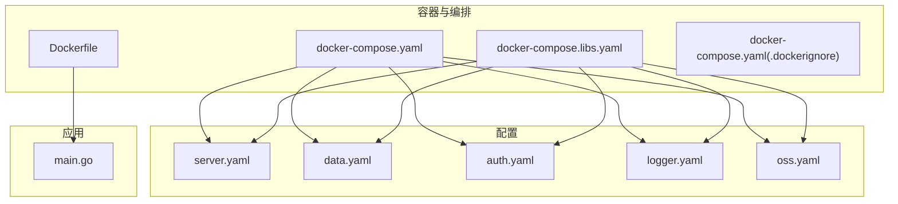
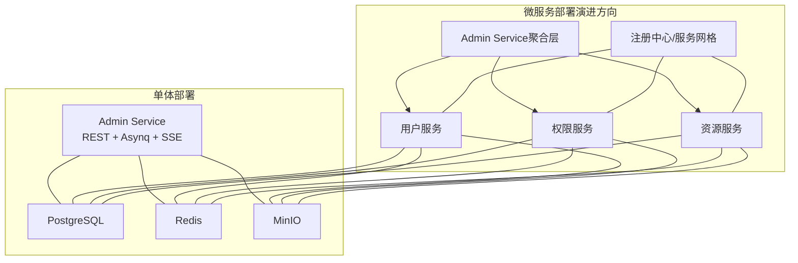
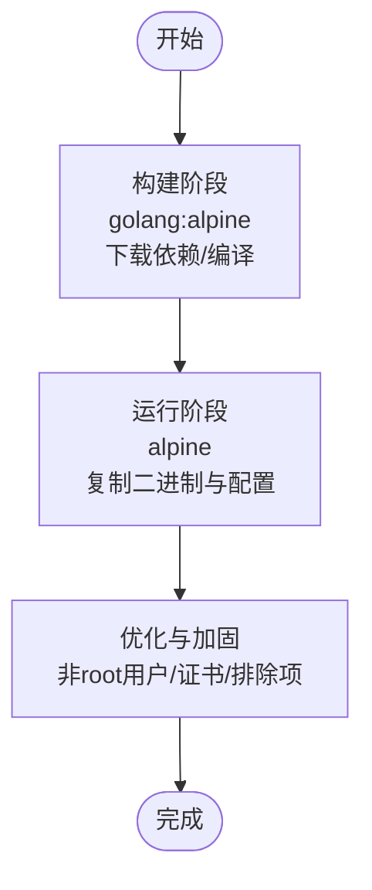
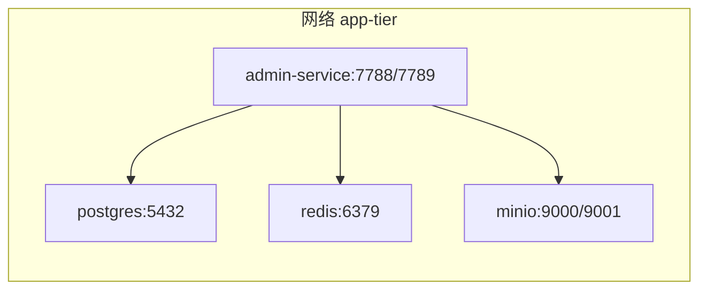
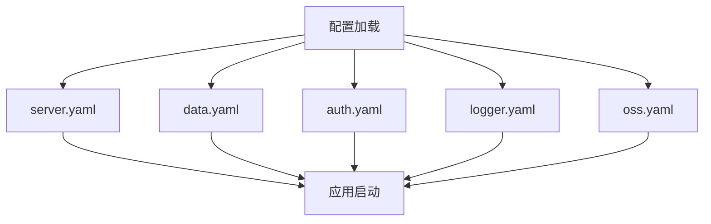
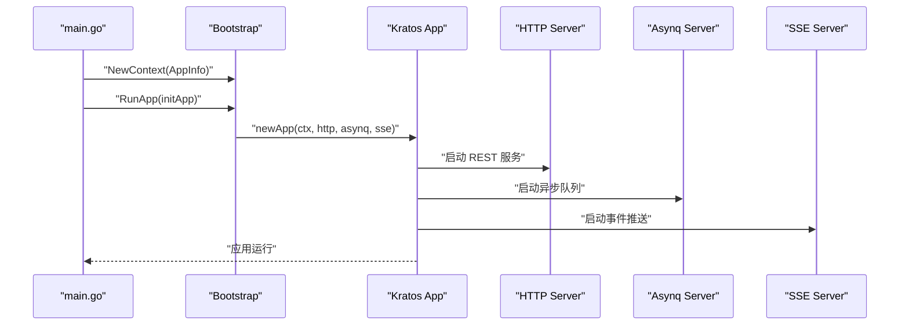
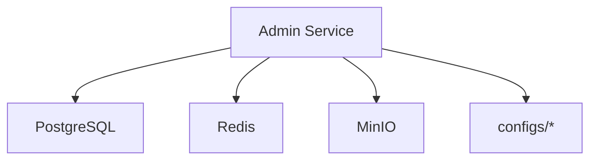
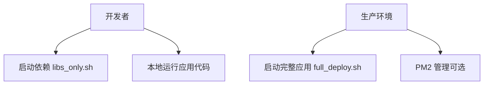

# 部署运维

<cite>
**本文引用的文件**
- [Dockerfile](file://backend/Dockerfile)
- [docker-compose.yaml](file://backend/docker-compose.yaml)
- [docker-compose.libs.yaml](file://backend/docker-compose.libs.yaml)
- [.dockerignore](file://backend/.dockerignore)
- [full_deploy.sh](file://backend/scripts/docker/full_deploy.sh)
- [libs_only.sh](file://backend/scripts/docker/libs_only.sh)
- [server.yaml](file://backend/app/admin/service/configs/server.yaml)
- [data.yaml](file://backend/app/admin/service/configs/data.yaml)
- [auth.yaml](file://backend/app/admin/service/configs/auth.yaml)
- [logger.yaml](file://backend/app/admin/service/configs/logger.yaml)
- [oss.yaml](file://backend/app/admin/service/configs/oss.yaml)
- [main.go](file://backend/app/admin/service/cmd/server/main.go)
- [backup.go](file://backend/pkg/task/backup.go)
- [scripts/README.md](file://backend/scripts/README.md)
</cite>

## 目录
1. [简介](#简介)
2. [项目结构](#项目结构)
3. [核心组件](#核心组件)
4. [架构总览](#架构总览)
5. [详细组件分析](#详细组件分析)
6. [依赖关系分析](#依赖关系分析)
7. [性能与容量规划](#性能与容量规划)
8. [运维脚本与自动化](#运维脚本与自动化)
9. [监控告警与可观测性](#监控告警与可观测性)
10. [故障排除指南](#故障排除指南)
11. [结论](#结论)
12. [附录](#附录)

## 简介
本指南面向 GoWind Admin 的部署与运维团队，提供从单体部署到微服务演进的完整策略，涵盖 Docker 容器化构建与编排、环境变量与配置管理、日志与对象存储、生产最佳实践（反向代理、证书、数据库连接池）、监控告警体系、运维脚本与自动化、以及故障排除与常见问题。文档同时给出架构图与流程图，帮助不同技术背景的读者快速理解与落地。

## 项目结构
后端采用多模块组织，关键部署相关目录与文件如下：
- 容器化与编排
  - Dockerfile：多阶段构建，产出精简运行时镜像
  - docker-compose.yaml：完整应用+依赖的编排
  - docker-compose.libs.yaml：仅依赖服务的编排
  - .dockerignore：构建与运行时排除项
- 配置管理
  - app/admin/service/configs：运行时配置（HTTP、数据库、Redis、认证、日志、对象存储）
- 运维脚本
  - scripts/docker：Docker 部署脚本（完整与仅依赖）
  - scripts/README.md：脚本使用说明与最佳实践
- 应用入口
  - app/admin/service/cmd/server/main.go：应用启动入口，集成 HTTP、异步队列、SSE

**图表来源**
- [Dockerfile:1-66](file://backend/Dockerfile#L1-L66)
- [docker-compose.yaml:1-125](file://backend/docker-compose.yaml#L1-L125)
- [docker-compose.libs.yaml:1-85](file://backend/docker-compose.libs.yaml#L1-L85)
- [.dockerignore:1-49](file://backend/.dockerignore#L1-L49)
- [server.yaml:1-49](file://backend/app/admin/service/configs/server.yaml#L1-L49)
- [data.yaml:1-21](file://backend/app/admin/service/configs/data.yaml#L1-L21)
- [auth.yaml:1-37](file://backend/app/admin/service/configs/auth.yaml#L1-L37)
- [logger.yaml:1-32](file://backend/app/admin/service/configs/logger.yaml#L1-L32)
- [oss.yaml:1-10](file://backend/app/admin/service/configs/oss.yaml#L1-L10)
- [main.go:1-76](file://backend/app/admin/service/cmd/server/main.go#L1-L76)

**章节来源**
- [Dockerfile:1-66](file://backend/Dockerfile#L1-L66)
- [docker-compose.yaml:1-125](file://backend/docker-compose.yaml#L1-L125)
- [docker-compose.libs.yaml:1-85](file://backend/docker-compose.libs.yaml#L1-L85)
- [.dockerignore:1-49](file://backend/.dockerignore#L1-L49)
- [server.yaml:1-49](file://backend/app/admin/service/configs/server.yaml#L1-L49)
- [data.yaml:1-21](file://backend/app/admin/service/configs/data.yaml#L1-L21)
- [auth.yaml:1-37](file://backend/app/admin/service/configs/auth.yaml#L1-L37)
- [logger.yaml:1-32](file://backend/app/admin/service/configs/logger.yaml#L1-L32)
- [oss.yaml:1-10](file://backend/app/admin/service/configs/oss.yaml#L1-L10)
- [main.go:1-76](file://backend/app/admin/service/cmd/server/main.go#L1-L76)

## 核心组件
- 容器镜像构建
  - 多阶段构建：第一阶段拉取 golang 基础镜像，下载依赖并编译；第二阶段使用 alpine，仅拷贝可执行文件与配置，最小化运行时体积
  - 非 root 用户运行，暴露端口，设置 CMD 启动命令
- 服务编排
  - docker-compose.yaml：编排 PostgreSQL、Redis、MinIO、Admin Service，并声明网络与环境变量
  - docker-compose.libs.yaml：仅编排依赖，便于本地开发或远程依赖
- 运行时配置
  - server.yaml：REST 地址、超时、Swagger、pprof、CORS、中间件开关
  - data.yaml：数据库驱动、连接串、迁移开关、连接池参数
  - auth.yaml：认证类型（JWT/OIDC/预共享密钥）、授权类型（noop/Casbin/OPA/Zanzibar/Keto/OpenFGA）
  - logger.yaml：日志类型与参数（标准输出、文件、Zap、Logrus、阿里云、腾讯云）
  - oss.yaml：MinIO 访问端点、凭证、SSL
- 应用入口
  - main.go：初始化 Kratos 应用，集成 HTTP、异步队列（Asynq）、SSE，支持多种配置中心与注册中心扩展点

**章节来源**
- [Dockerfile:1-66](file://backend/Dockerfile#L1-L66)
- [docker-compose.yaml:1-125](file://backend/docker-compose.yaml#L1-L125)
- [docker-compose.libs.yaml:1-85](file://backend/docker-compose.libs.yaml#L1-L85)
- [server.yaml:1-49](file://backend/app/admin/service/configs/server.yaml#L1-L49)
- [data.yaml:1-21](file://backend/app/admin/service/configs/data.yaml#L1-L21)
- [auth.yaml:1-37](file://backend/app/admin/service/configs/auth.yaml#L1-L37)
- [logger.yaml:1-32](file://backend/app/admin/service/configs/logger.yaml#L1-L32)
- [oss.yaml:1-10](file://backend/app/admin/service/configs/oss.yaml#L1-L10)
- [main.go:1-76](file://backend/app/admin/service/cmd/server/main.go#L1-L76)

## 架构总览
下图展示单体部署与微服务演进两种模式的关键差异：单体模式将 Admin Service 与依赖打包；微服务模式建议拆分服务并通过注册中心/服务网格治理。

**图表来源**
- [docker-compose.yaml:1-125](file://backend/docker-compose.yaml#L1-L125)
- [docker-compose.libs.yaml:1-85](file://backend/docker-compose.libs.yaml#L1-L85)
- [main.go:1-76](file://backend/app/admin/service/cmd/server/main.go#L1-L76)

## 详细组件分析

### 容器镜像与构建策略
- 多阶段构建要点
  - 构建阶段：设置 GOPROXY 与 GOSUMDB，使用 CGO_ENABLED=0、静态链接，输出 linux/amd64 可执行文件
  - 运行阶段：alpine 基础镜像，安装 CA 证书，复制可执行文件与配置，非 root 用户运行
- 镜像优化
  - 仅包含运行所需文件，减少攻击面
  - 通过 .dockerignore 排除构建产物、测试文件、日志、脚本等

**图表来源**
- [Dockerfile:1-66](file://backend/Dockerfile#L1-L66)
- [.dockerignore:1-49](file://backend/.dockerignore#L1-L49)

**章节来源**
- [Dockerfile:1-66](file://backend/Dockerfile#L1-L66)
- [.dockerignore:1-49](file://backend/.dockerignore#L1-L49)

### 服务编排与网络拓扑
- docker-compose.yaml
  - 网络：app-tier 桥接网络
  - 服务：postgres、redis、minio、admin-service
  - 环境变量：时区、数据库凭据、Redis 密码、MinIO 凭据
  - 依赖：admin-service depends_on 其他服务
- docker-compose.libs.yaml
  - 仅依赖服务，便于本地开发或远程依赖

**图表来源**
- [docker-compose.yaml:1-125](file://backend/docker-compose.yaml#L1-L125)
- [docker-compose.libs.yaml:1-85](file://backend/docker-compose.libs.yaml#L1-L85)

**章节来源**
- [docker-compose.yaml:1-125](file://backend/docker-compose.yaml#L1-L125)
- [docker-compose.libs.yaml:1-85](file://backend/docker-compose.libs.yaml#L1-L85)

### 配置管理与环境变量
- server.yaml
  - REST 地址与超时、Swagger、pprof
  - CORS 放通头/方法/来源
  - 中间件：日志、恢复、追踪、校验、熔断、元数据
- data.yaml
  - 数据库驱动与连接串（Postgres），迁移开关、连接池参数
  - Redis 地址与密码、读写超时
- auth.yaml
  - 认证类型（JWT/OIDC/预共享密钥）
  - 授权类型（noop/Casbin/OPA/Zanzibar/Keto/OpenFGA）
- logger.yaml
  - 日志类型与参数（文件、Zap、Logrus、阿里云、腾讯云）
- oss.yaml
  - MinIO 端点、凭证、SSL

**图表来源**
- [server.yaml:1-49](file://backend/app/admin/service/configs/server.yaml#L1-L49)
- [data.yaml:1-21](file://backend/app/admin/service/configs/data.yaml#L1-L21)
- [auth.yaml:1-37](file://backend/app/admin/service/configs/auth.yaml#L1-L37)
- [logger.yaml:1-32](file://backend/app/admin/service/configs/logger.yaml#L1-L32)
- [oss.yaml:1-10](file://backend/app/admin/service/configs/oss.yaml#L1-L10)

**章节来源**
- [server.yaml:1-49](file://backend/app/admin/service/configs/server.yaml#L1-L49)
- [data.yaml:1-21](file://backend/app/admin/service/configs/data.yaml#L1-L21)
- [auth.yaml:1-37](file://backend/app/admin/service/configs/auth.yaml#L1-L37)
- [logger.yaml:1-32](file://backend/app/admin/service/configs/logger.yaml#L1-L32)
- [oss.yaml:1-10](file://backend/app/admin/service/configs/oss.yaml#L1-L10)

### 应用启动与传输协议
- main.go
  - 初始化 Kratos 应用上下文，注入 AppInfo（项目名、应用 ID、版本）
  - 集成 HTTP、Asynq（异步任务）、SSE（事件推送）
  - 提供多种配置中心与注册中心扩展点（注释）

**图表来源**
- [main.go:1-76](file://backend/app/admin/service/cmd/server/main.go#L1-L76)

**章节来源**
- [main.go:1-76](file://backend/app/admin/service/cmd/server/main.go#L1-L76)

## 依赖关系分析
- 组件耦合
  - Admin Service 依赖数据库、缓存、对象存储
  - 配置集中于 configs 目录，通过启动参数加载
- 外部依赖
  - PostgreSQL、Redis、MinIO 由 Compose 管理
  - 可选：Jaeger（分布式追踪）、Etcd（服务发现）在完整编排中启用

**图表来源**
- [docker-compose.yaml:1-125](file://backend/docker-compose.yaml#L1-L125)
- [data.yaml:1-21](file://backend/app/admin/service/configs/data.yaml#L1-L21)
- [oss.yaml:1-10](file://backend/app/admin/service/configs/oss.yaml#L1-L10)

**章节来源**
- [docker-compose.yaml:1-125](file://backend/docker-compose.yaml#L1-L125)
- [data.yaml:1-21](file://backend/app/admin/service/configs/data.yaml#L1-L21)
- [oss.yaml:1-10](file://backend/app/admin/service/configs/oss.yaml#L1-L10)

## 性能与容量规划
- 数据库连接池
  - data.yaml 中设置最大空闲/打开连接数与生命周期，建议结合业务峰值与慢查询调优
- Redis
  - 读写超时合理配置，避免阻塞；禁用高危命令（如 FLUSHDB/FLUSHALL/CONFIG）
- MinIO
  - 默认桶 images，注意对象数量与存储配额；生产建议开启 SSL 与访问控制
- HTTP 与中间件
  - server.yaml 中启用 pprof 便于性能剖析；CORS 放通范围应最小化

**章节来源**
- [data.yaml:1-21](file://backend/app/admin/service/configs/data.yaml#L1-L21)
- [server.yaml:1-49](file://backend/app/admin/service/configs/server.yaml#L1-L49)
- [docker-compose.yaml:1-125](file://backend/docker-compose.yaml#L1-L125)

## 运维脚本与自动化
- 脚本概览
  - full_deploy.sh：启动完整应用（应用 + 依赖）
  - libs_only.sh：仅启动依赖（适合本地开发）
  - scripts/README.md：脚本使用说明、工作流与最佳实践
- 使用场景
  - 本地开发：先启动依赖，再本地运行应用代码
  - 生产部署：准备环境后一键启动完整应用，或通过 PM2 管理
- 环境变量
  - APP_ROOT：数据卷根目录（默认 /root/app 或 C:\app）
  - COMPOSE_FILE：自定义 Compose 文件路径

**图表来源**
- [full_deploy.sh:1-96](file://backend/scripts/docker/full_deploy.sh#L1-L96)
- [libs_only.sh:1-120](file://backend/scripts/docker/libs_only.sh#L1-L120)
- [scripts/README.md:1-491](file://backend/scripts/README.md#L1-L491)

**章节来源**
- [full_deploy.sh:1-96](file://backend/scripts/docker/full_deploy.sh#L1-L96)
- [libs_only.sh:1-120](file://backend/scripts/docker/libs_only.sh#L1-L120)
- [scripts/README.md:1-491](file://backend/scripts/README.md#L1-L491)

## 监控告警与可观测性
- 日志
  - logger.yaml 支持文件、Zap、Logrus、阿里云、腾讯云等多种输出
  - 建议生产使用集中式日志（如 Fluentd/Fluent Bit），并配置轮转与保留策略
- 指标与追踪
  - server.yaml 启用 pprof，便于性能剖析
  - 可选 Jaeger（已在完整编排中启用），用于分布式追踪
- 健康检查
  - 建议在网关/负载均衡层配置健康检查端点，结合容器健康探测
- 告警
  - 基于日志/指标阈值触发告警（CPU、内存、连接数、错误率、响应时间）

**章节来源**
- [logger.yaml:1-32](file://backend/app/admin/service/configs/logger.yaml#L1-L32)
- [server.yaml:1-49](file://backend/app/admin/service/configs/server.yaml#L1-L49)
- [docker-compose.yaml:1-125](file://backend/docker-compose.yaml#L1-L125)

## 故障排除指南
- 启动失败
  - 检查依赖服务是否就绪（postgres/redis/minio），查看对应容器日志
  - 确认配置文件路径与权限（/app/configs），确保非 root 用户可读
- 数据库连接
  - 校验 data.yaml 中连接串与凭据；确认网络连通与防火墙策略
- Redis/MinIO
  - 确认密码与端口映射；必要时临时关闭禁用命令或调整超时
- 日志与审计
  - 检查 logger.yaml 输出类型与路径；生产环境建议落盘与集中收集
- 备份与恢复
  - 可基于备份任务类型进行周期性备份，确保可回滚版本与数据一致性

**章节来源**
- [data.yaml:1-21](file://backend/app/admin/service/configs/data.yaml#L1-L21)
- [logger.yaml:1-32](file://backend/app/admin/service/configs/logger.yaml#L1-L32)
- [backup.go:1-19](file://backend/pkg/task/backup.go#L1-L19)

## 结论
通过多阶段 Docker 构建、标准化 Compose 编排与集中式配置管理，GoWind Admin 可实现从本地开发到生产的平滑部署。建议在生产环境中配合反向代理、SSL 证书、数据库连接池优化、集中日志与分布式追踪、健康检查与告警体系，形成完善的运维闭环。

## 附录
- 生产环境部署清单
  - 反向代理（Nginx）：配置上游至 Admin Service，启用 gzip/缓存
  - SSL 证书：Let’s Encrypt 或企业 CA，强制 HTTPS
  - 数据库：主从/高可用、备份策略、连接池参数调优
  - 缓存：Redis 集群、持久化与淘汰策略
  - 对象存储：MinIO 集群、跨域与访问控制
  - 监控：Prometheus/Grafana、日志平台、APM（Jaeger）
  - 安全：最小权限、密钥管理、网络隔离、WAF