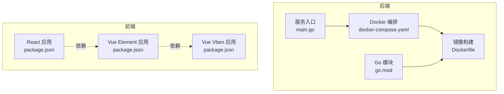
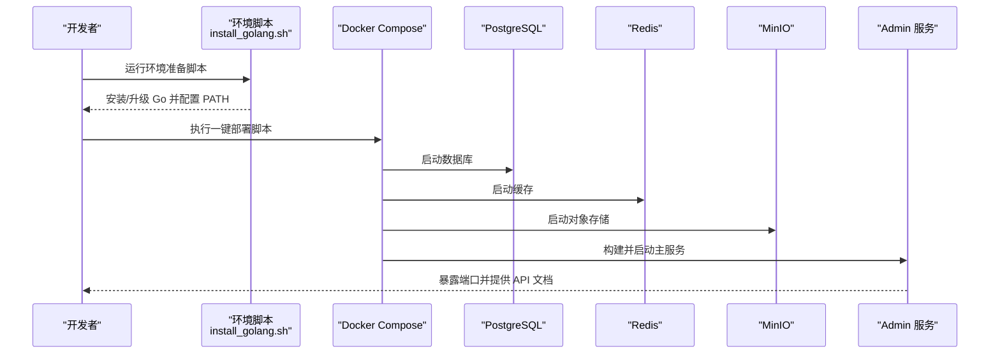
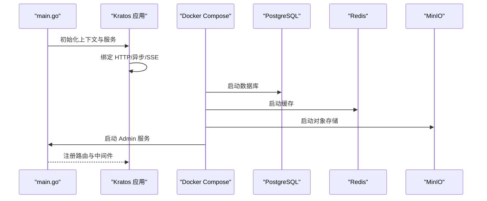
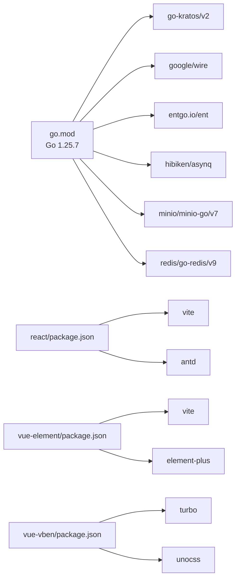

# 快速开始

<cite>
**本文引用的文件**
- [README.md](file://README.md)
- [backend/app/admin/service/cmd/server/main.go](file://backend/app/admin/service/cmd/server/main.go)
- [backend/docker-compose.yaml](file://backend/docker-compose.yaml)
- [backend/Dockerfile](file://backend/Dockerfile)
- [backend/go.mod](file://backend/go.mod)
- [backend/scripts/README.md](file://backend/scripts/README.md)
- [backend/scripts/docker/full_deploy.sh](file://backend/scripts/docker/full_deploy.sh)
- [backend/scripts/env/install_golang.sh](file://backend/scripts/env/install_golang.sh)
- [frontend/admin/react/package.json](file://frontend/admin/react/package.json)
- [frontend/admin/vue-element/package.json](file://frontend/admin/vue-element/package.json)
- [frontend/admin/vue-vben/package.json](file://frontend/admin/vue-vben/package.json)
</cite>

## 目录
1. [简介](#简介)
2. [项目结构](#项目结构)
3. [核心组件](#核心组件)
4. [架构总览](#架构总览)
5. [详细组件分析](#详细组件分析)
6. [依赖关系分析](#依赖关系分析)
7. [性能考虑](#性能考虑)
8. [故障排除指南](#故障排除指南)
9. [结论](#结论)
10. [附录](#附录)

## 简介
本指南面向首次接触 GoWind Admin 的开发者，提供从环境准备、一键安装、后端与前端启动、默认账号与访问地址、基本功能验证到常见问题排查的全流程说明。项目采用前后端分离架构：后端基于 Go 微服务框架，前端提供 Vue3 与 React 两种实现。

## 项目结构
- 后端位于 backend 目录，包含服务入口、Docker 编排、脚本与配置等。
- 前端位于 frontend/admin，包含 Vue Element、Vue Vben 以及 React 三种实现。
- 顶层 README 提供快速开始与演示地址、默认账号等关键信息。

图表来源
- [backend/app/admin/service/cmd/server/main.go:1-76](file://backend/app/admin/service/cmd/server/main.go#L1-L76)
- [backend/docker-compose.yaml:1-125](file://backend/docker-compose.yaml#L1-L125)
- [backend/Dockerfile:1-66](file://backend/Dockerfile#L1-L66)
- [backend/go.mod:1-290](file://backend/go.mod#L1-L290)
- [frontend/admin/react/package.json:1-82](file://frontend/admin/react/package.json#L1-L82)
- [frontend/admin/vue-element/package.json:1-173](file://frontend/admin/vue-element/package.json#L1-L173)
- [frontend/admin/vue-vben/package.json:1-118](file://frontend/admin/vue-vben/package.json#L1-L118)

章节来源
- [README.md:15-91](file://README.md#L15-L91)

## 核心组件
- 后端服务入口：负责初始化应用上下文、HTTP/异步队列/SSE 服务并启动。
- Docker 编排：定义数据库、缓存、对象存储、追踪等依赖服务与主服务。
- Docker 镜像构建：多阶段构建，先在 Alpine 上编译 Go 可执行文件，再拷贝至最小运行时镜像。
- 前端应用：提供 React/Vue Element/Vue Vben 三套实现，分别通过各自包管理脚本启动开发服务。

章节来源
- [backend/app/admin/service/cmd/server/main.go:46-76](file://backend/app/admin/service/cmd/server/main.go#L46-L76)
- [backend/docker-compose.yaml:5-125](file://backend/docker-compose.yaml#L5-L125)
- [backend/Dockerfile:1-66](file://backend/Dockerfile#L1-L66)
- [frontend/admin/react/package.json:7-12](file://frontend/admin/react/package.json#L7-L12)
- [frontend/admin/vue-element/package.json:7-20](file://frontend/admin/vue-element/package.json#L7-L20)
- [frontend/admin/vue-vben/package.json:7-34](file://frontend/admin/vue-vben/package.json#L7-L34)

## 架构总览
下图展示了从环境准备到一键启动的总体流程，以及后端服务与依赖容器之间的交互。

图表来源
- [backend/scripts/env/install_golang.sh:137-160](file://backend/scripts/env/install_golang.sh#L137-L160)
- [backend/scripts/docker/full_deploy.sh:53-96](file://backend/scripts/docker/full_deploy.sh#L53-L96)
- [backend/docker-compose.yaml:52-125](file://backend/docker-compose.yaml#L52-L125)

章节来源
- [README.md:30-91](file://README.md#L30-L91)
- [backend/scripts/README.md:148-254](file://backend/scripts/README.md#L148-L254)

## 详细组件分析

### 环境准备与一键安装
- 一键安装 Go 与 Docker（支持 Ubuntu/CentOS/Rocky/Windows/macOS）：
  - Linux/macOS：使用独立脚本安装 Go；Docker 由一键脚本自动拉起依赖服务。
  - Windows：使用 PowerShell 脚本完成包管理器、Docker Desktop、Go 环境的完整配置。
- 一键安装三方组件与服务：
  - 使用 Docker Compose 启动完整应用（应用 + 依赖），并支持自定义数据卷根目录。

章节来源
- [README.md:32-57](file://README.md#L32-L57)
- [backend/scripts/README.md:114-145](file://backend/scripts/README.md#L114-L145)
- [backend/scripts/docker/full_deploy.sh:24-41](file://backend/scripts/docker/full_deploy.sh#L24-L41)

### 后端服务启动流程
- 服务入口负责初始化 Kratos 应用，绑定 HTTP、异步队列与 SSE 服务，并加载配置。
- Docker 编排定义了主服务端口映射与依赖服务，确保数据库、缓存、对象存储就绪后再启动主服务。
- 镜像构建采用多阶段：先在 Alpine 上下载依赖并编译，再复制到最小运行时镜像，最终以非 root 用户运行。

图表来源
- [backend/app/admin/service/cmd/server/main.go:46-76](file://backend/app/admin/service/cmd/server/main.go#L46-L76)
- [backend/docker-compose.yaml:104-125](file://backend/docker-compose.yaml#L104-L125)
- [backend/Dockerfile:12-66](file://backend/Dockerfile#L12-L66)

章节来源
- [backend/app/admin/service/cmd/server/main.go:46-76](file://backend/app/admin/service/cmd/server/main.go#L46-L76)
- [backend/docker-compose.yaml:104-125](file://backend/docker-compose.yaml#L104-L125)
- [backend/Dockerfile:12-66](file://backend/Dockerfile#L12-L66)

### 前端开发环境搭建
- Node.js 与 pnpm：
  - 安装 Node.js（自带 npm），随后全局安装 pnpm。
  - 进入前端目录，执行依赖安装与开发启动命令。
- 三套前端实现：
  - React：使用 Vite 开发服务器，提供开发模式脚本。
  - Vue Element：使用 Vite，要求 Node 版本满足引擎约束。
  - Vue Vben：使用 TurboRun 管理多包开发，提供多种构建与预览脚本。

章节来源
- [README.md:59-86](file://README.md#L59-L86)
- [frontend/admin/react/package.json:7-12](file://frontend/admin/react/package.json#L7-L12)
- [frontend/admin/vue-element/package.json:166-172](file://frontend/admin/vue-element/package.json#L166-L172)
- [frontend/admin/vue-vben/package.json:70-73](file://frontend/admin/vue-vben/package.json#L70-L73)

### 默认账号与访问地址
- 前端访问地址与默认登录凭据：
  - 前端地址：http://localhost:5666
  - 默认账号：admin
  - 默认密码：admin
- 后端文档地址：
  - OpenAPI 文档：http://localhost:7788/docs/openapi.yaml

章节来源
- [README.md:87-91](file://README.md#L87-L91)

## 依赖关系分析
- 后端依赖：
  - Go 版本：1.25.7
  - 关键模块：Kratos、Wire、Ent、Asynq、MinIO、Redis 等
- 前端依赖：
  - React 应用：Vite、Ant Design、Axios、React Router 等
  - Vue Element 应用：Vite、Element Plus、Vue Router、Pinia 等
  - Vue Vben 应用：Turbo、Vite、TailwindCSS、UnoCSS 等

图表来源
- [backend/go.mod:3-65](file://backend/go.mod#L3-L65)
- [frontend/admin/react/package.json:13-38](file://frontend/admin/react/package.json#L13-L38)
- [frontend/admin/vue-element/package.json:47-115](file://frontend/admin/vue-element/package.json#L47-L115)
- [frontend/admin/vue-vben/package.json:35-68](file://frontend/admin/vue-vben/package.json#L35-L68)

章节来源
- [backend/go.mod:3-65](file://backend/go.mod#L3-L65)
- [frontend/admin/react/package.json:13-38](file://frontend/admin/react/package.json#L13-L38)
- [frontend/admin/vue-element/package.json:47-115](file://frontend/admin/vue-element/package.json#L47-L115)
- [frontend/admin/vue-vben/package.json:35-68](file://frontend/admin/vue-vben/package.json#L35-L68)

## 性能考虑
- 后端镜像构建：
  - 使用多阶段构建减少镜像体积，非 root 用户运行提升安全性。
  - 编译时设置 CGO_ENABLED=0，目标平台 linux/amd64，有利于容器化部署。
- 依赖服务：
  - PostgreSQL/Redis/MinIO 通过 Docker Compose 管理，建议在本地开发时使用默认配置，生产环境按需调整资源限制与持久化策略。

章节来源
- [backend/Dockerfile:23-27](file://backend/Dockerfile#L23-L27)
- [backend/Dockerfile:56-66](file://backend/Dockerfile#L56-L66)
- [backend/docker-compose.yaml:52-125](file://backend/docker-compose.yaml#L52-L125)

## 故障排除指南
- 环境准备失败
  - 现象：Go 安装脚本报错或版本未更新。
  - 处理：检查网络连通性与权限，确保脚本可写入系统路径；重新运行安装脚本。
- Docker Compose 启动失败
  - 现象：找不到 docker compose 或 docker-compose 命令。
  - 处理：安装 Docker Compose（v2 插件或旧版可执行文件），确认脚本可执行权限。
- 端口冲突
  - 现象：本地端口被占用导致服务无法启动。
  - 处理：修改 docker-compose.yaml 中的端口映射或释放冲突端口。
- 前端依赖安装失败
  - 现象：pnpm/npm 安装失败或 Node 版本不满足引擎要求。
  - 处理：根据各前端工程的 engines 字段调整 Node 版本，或使用 pnpm 官方推荐版本。

章节来源
- [backend/scripts/env/install_golang.sh:89-117](file://backend/scripts/env/install_golang.sh#L89-L117)
- [backend/scripts/docker/full_deploy.sh:83-92](file://backend/scripts/docker/full_deploy.sh#L83-L92)
- [frontend/admin/vue-element/package.json:166-172](file://frontend/admin/vue-element/package.json#L166-L172)
- [frontend/admin/vue-vben/package.json:70-73](file://frontend/admin/vue-vben/package.json#L70-L73)

## 结论
通过本快速开始指南，您可以在多操作系统环境下完成环境准备与一键安装，并顺利启动后端与前端服务。默认账号与访问地址便于快速验证系统功能。若遇到问题，可依据故障排除章节逐项排查。

## 附录

### 快速开始步骤清单
- 环境准备
  - 运行对应平台的环境准备脚本，安装 Go 与 Docker。
- 一键安装
  - 执行 Docker Compose 一键部署脚本，启动应用与依赖服务。
- 后端启动
  - 若采用本地开发模式，可在另一终端运行后端服务。
- 前端启动
  - 进入前端目录，安装依赖并启动开发服务。
- 访问与验证
  - 使用默认账号登录前端，访问后端文档地址验证服务可用性。

章节来源
- [README.md:30-91](file://README.md#L30-L91)
- [backend/scripts/README.md:416-447](file://backend/scripts/README.md#L416-L447)