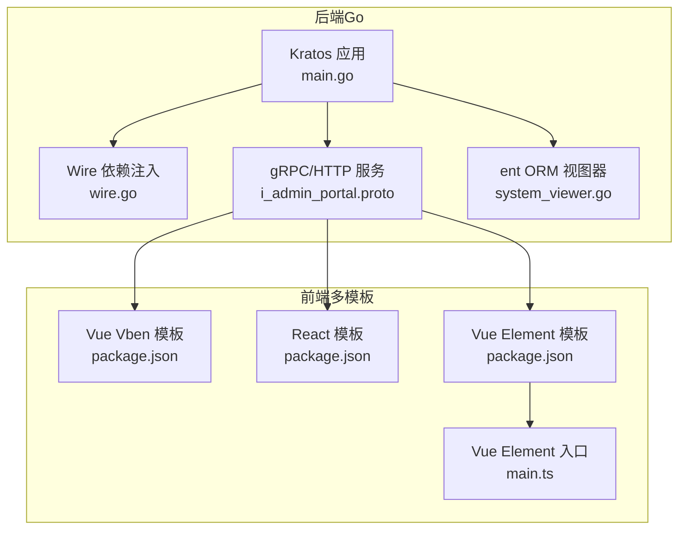
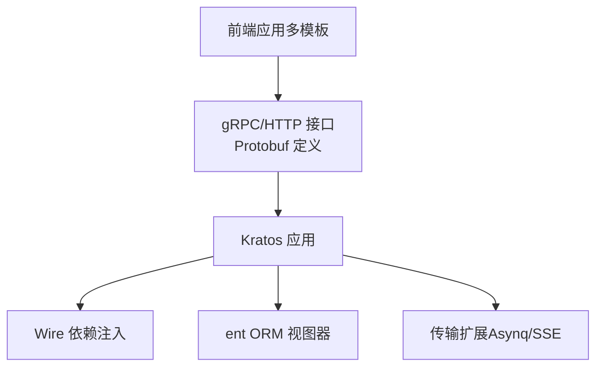
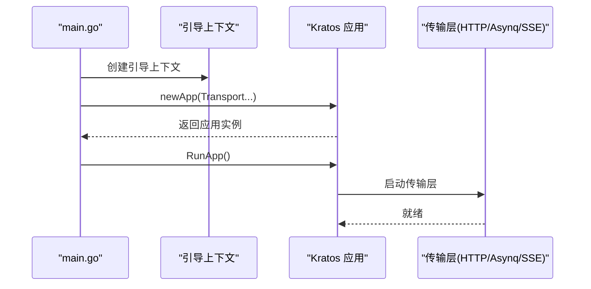
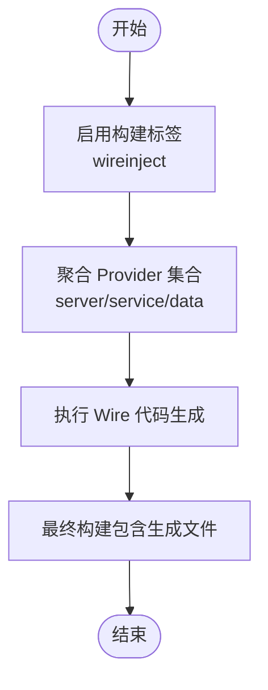
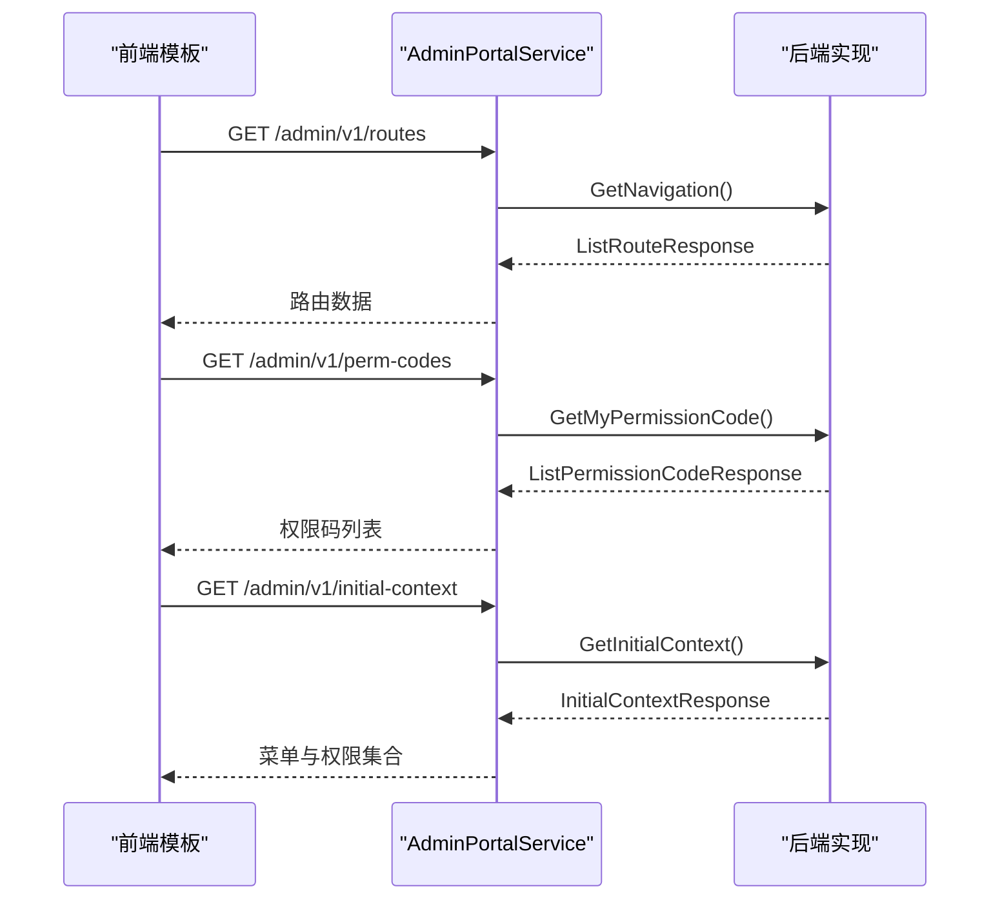
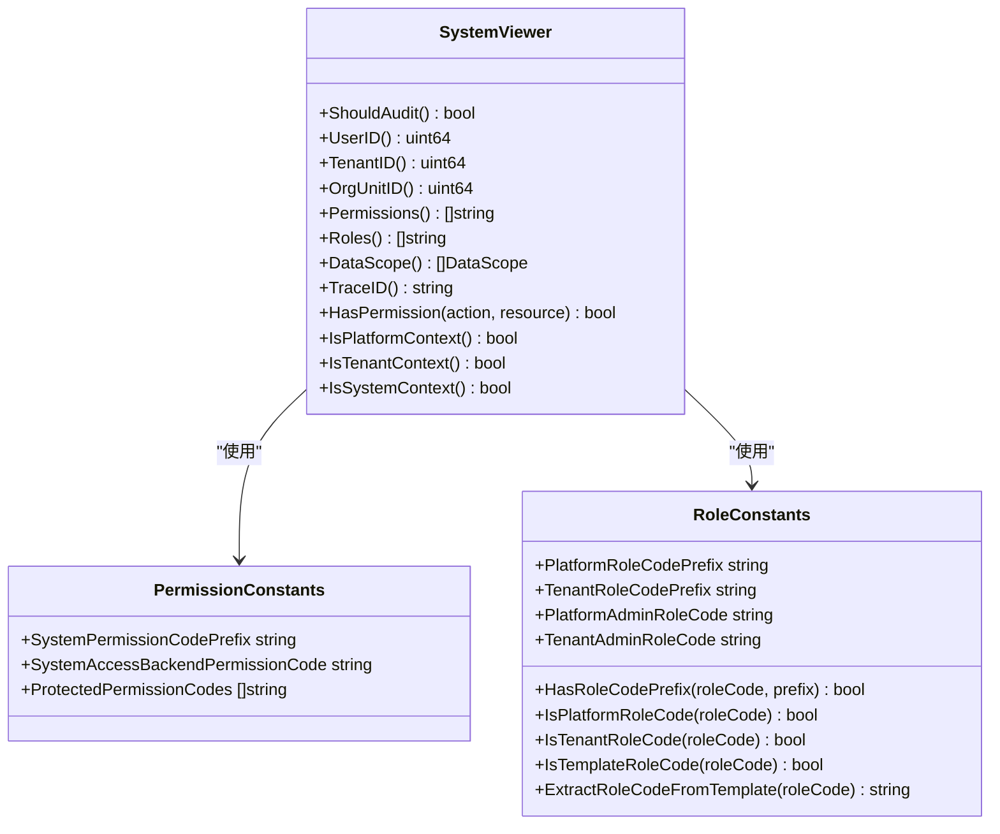
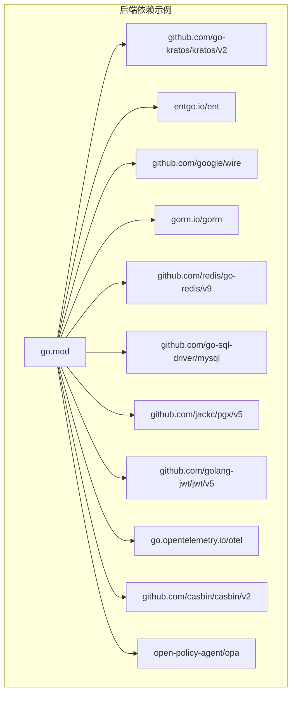

# 技术栈概览

<cite>
**本文引用的文件**
- [go.mod](file://backend/go.mod)
- [main.go](file://backend/app/admin/service/cmd/server/main.go)
- [wire.go](file://backend/app/admin/service/cmd/server/wire.go)
- [i_admin_portal.proto](file://backend/api/protos/admin/service/v1/i_admin_portal.proto)
- [permission.go](file://backend/pkg/constants/permission.go)
- [role.go](file://backend/pkg/constants/role.go)
- [system_viewer.go](file://backend/pkg/entgo/viewer/system_viewer.go)
- [package.json（Vue Vben）](file://frontend/admin/vue-vben/package.json)
- [package.json（React）](file://frontend/admin/react/package.json)
- [package.json（Vue Element）](file://frontend/admin/vue-element/package.json)
- [main.ts（Vue Element）](file://frontend/admin/vue-element/src/main.ts)
</cite>

## 目录
1. [引言](#引言)
2. [项目结构](#项目结构)
3. [核心组件](#核心组件)
4. [架构总览](#架构总览)
5. [详细组件分析](#详细组件分析)
6. [依赖关系分析](#依赖关系分析)
7. [性能考量](#性能考量)
8. [故障排查指南](#故障排查指南)
9. [结论](#结论)
10. [附录](#附录)

## 引言
本文件面向 GoWind Admin 项目的后端与前端技术栈，系统梳理并解释以下要点：
- 后端技术栈：Go 语言特性、go-kratos 微服务框架、wire 依赖注入、ent ORM 设计理念
- 前端技术栈：Vue3 响应式与组合式 API、TypeScript 类型安全、Ant Design Vue/Element Plus 组件库、Vben Admin 模板的定制化能力
- 技术选型原因与收益：性能、稳定性、开发效率等维度的权衡
- 不同技术方案的对比与取舍
- 各技术版本要求与兼容性信息

## 项目结构
项目采用前后端分离架构，后端以 Go 语言实现，使用 Kratos 微服务框架；前端提供多套模板（React、Vue Element、Vue Vben），均基于现代包管理与构建工具链。

**图表来源**
- [main.go:1-76](file://backend/app/admin/service/cmd/server/main.go#L1-L76)
- [wire.go:1-47](file://backend/app/admin/service/cmd/server/wire.go#L1-L47)
- [i_admin_portal.proto:1-48](file://backend/api/protos/admin/service/v1/i_admin_portal.proto#L1-L48)
- [system_viewer.go:1-79](file://backend/pkg/entgo/viewer/system_viewer.go#L1-L79)
- [package.json（Vue Vben）:1-118](file://frontend/admin/vue-vben/package.json#L1-L118)
- [package.json（React）:1-82](file://frontend/admin/react/package.json#L1-L82)
- [package.json（Vue Element）:1-173](file://frontend/admin/vue-element/package.json#L1-L173)
- [main.ts（Vue Element）:1-25](file://frontend/admin/vue-element/src/main.ts#L1-L25)

**章节来源**
- [main.go:1-76](file://backend/app/admin/service/cmd/server/main.go#L1-L76)
- [wire.go:1-47](file://backend/app/admin/service/cmd/server/wire.go#L1-L47)
- [i_admin_portal.proto:1-48](file://backend/api/protos/admin/service/v1/i_admin_portal.proto#L1-L48)
- [system_viewer.go:1-79](file://backend/pkg/entgo/viewer/system_viewer.go#L1-L79)
- [package.json（Vue Vben）:1-118](file://frontend/admin/vue-vben/package.json#L1-L118)
- [package.json（React）:1-82](file://frontend/admin/react/package.json#L1-L82)
- [package.json（Vue Element）:1-173](file://frontend/admin/vue-element/package.json#L1-L173)
- [main.ts（Vue Element）:1-25](file://frontend/admin/vue-element/src/main.ts#L1-L25)

## 核心组件
- 后端运行入口与应用装配：通过 Kratos 启动 HTTP 与传输层服务，并结合 Asynq/SSE 扩展能力，统一由引导框架完成应用生命周期管理。
- 依赖注入：使用 Wire 在编译期生成依赖装配代码，提升可测试性与可维护性。
- 接口定义：基于 Protocol Buffers 定义 gRPC/HTTP 接口契约，确保前后端一致的协议与类型约束。
- 数据访问与权限：ent ORM 配合自定义 Viewer 实现数据范围与权限控制；常量模块集中管理权限与角色编码规范。

**章节来源**
- [main.go:46-75](file://backend/app/admin/service/cmd/server/main.go#L46-L75)
- [wire.go:27-46](file://backend/app/admin/service/cmd/server/wire.go#L27-L46)
- [i_admin_portal.proto:10-32](file://backend/api/protos/admin/service/v1/i_admin_portal.proto#L10-L32)
- [system_viewer.go:9-79](file://backend/pkg/entgo/viewer/system_viewer.go#L9-L79)
- [permission.go:1-39](file://backend/pkg/constants/permission.go#L1-L39)
- [role.go:1-49](file://backend/pkg/constants/role.go#L1-L49)

## 架构总览
后端采用微服务风格，以 Kratos 为核心，结合 gRPC/HTTP 协议与 Protobuf 生成的客户端/服务端代码，形成清晰的接口契约；Wire 负责依赖装配；ent 提供强类型的数据库访问与权限范围控制；前端多模板并行，统一消费后端接口。

**图表来源**
- [i_admin_portal.proto:10-32](file://backend/api/protos/admin/service/v1/i_admin_portal.proto#L10-L32)
- [main.go:46-57](file://backend/app/admin/service/cmd/server/main.go#L46-L57)
- [wire.go:27-46](file://backend/app/admin/service/cmd/server/wire.go#L27-L46)
- [system_viewer.go:9-79](file://backend/pkg/entgo/viewer/system_viewer.go#L9-L79)

## 详细组件分析

### 后端：Kratos 应用与传输层
- 应用装配：通过引导上下文与 Kratos App 组合 HTTP、Asynq、SSE 等传输层，集中管理生命周期。
- 传输扩展：支持异步任务与服务端事件推送，满足后台管理系统的多样化通信需求。
- 配置与注册中心：预留多种配置与注册中心接入点，便于在不同环境灵活切换。

**图表来源**
- [main.go:59-75](file://backend/app/admin/service/cmd/server/main.go#L59-L75)

**章节来源**
- [main.go:46-75](file://backend/app/admin/service/cmd/server/main.go#L46-L75)

### 后端：Wire 依赖注入
- 生成机制：通过构建标签与 provider 组合，在编译期生成装配代码，避免运行时反射成本。
- 组织方式：按 server、service、data 分层提供者集合，职责清晰、易于替换与测试。
- 使用建议：在开发阶段保持 provider 集合稳定，避免频繁修改导致生成代码冲突。

**图表来源**
- [wire.go:1-47](file://backend/app/admin/service/cmd/server/wire.go#L1-L47)

**章节来源**
- [wire.go:1-47](file://backend/app/admin/service/cmd/server/wire.go#L1-L47)

### 后端：Protocol Buffers 与 gRPC/HTTP
- 接口契约：通过 Protobuf 定义服务方法与消息结构，自动派生 gRPC 与 HTTP 映射。
- 前端适配：前端多模板均可消费同一套接口契约，降低联调成本。
- 示例接口：后台门户服务提供导航、权限码与初始上下文等接口，覆盖典型后台管理场景。

**图表来源**
- [i_admin_portal.proto:10-32](file://backend/api/protos/admin/service/v1/i_admin_portal.proto#L10-L32)

**章节来源**
- [i_admin_portal.proto:10-48](file://backend/api/protos/admin/service/v1/i_admin_portal.proto#L10-L48)

### 后端：ent ORM 与 Viewer 权限控制
- Viewer 模式：通过上下文注入 Viewer，统一处理用户、租户、角色、权限与数据范围，便于在查询层实现细粒度控制。
- 系统视角：系统 Viewer 提供平台级上下文，适合后台任务与系统操作场景。
- 权限与角色常量：集中定义权限前缀、受保护权限与角色前缀，保证权限体系一致性与可审计性。

**图表来源**
- [system_viewer.go:9-79](file://backend/pkg/entgo/viewer/system_viewer.go#L9-L79)
- [permission.go:1-39](file://backend/pkg/constants/permission.go#L1-L39)
- [role.go:1-49](file://backend/pkg/constants/role.go#L1-L49)

**章节来源**
- [system_viewer.go:9-79](file://backend/pkg/entgo/viewer/system_viewer.go#L9-L79)
- [permission.go:1-39](file://backend/pkg/constants/permission.go#L1-L39)
- [role.go:1-49](file://backend/pkg/constants/role.go#L1-L49)

### 前端：Vue Vben 模板
- 技术栈：Vue 3、Vite、TypeScript、TailwindCSS 等现代化工具链，具备良好的开发体验与构建性能。
- 版本要求：Node 最低版本与包管理器版本在工程配置中明确，需遵循以确保本地与 CI 稳定性。
- 多脚本：提供构建、预览、类型检查、测试等常用脚本，便于团队协作与质量保障。

**章节来源**
- [package.json（Vue Vben）:70-73](file://frontend/admin/vue-vben/package.json#L70-L73)
- [package.json（Vue Vben）:7-34](file://frontend/admin/vue-vben/package.json#L7-L34)

### 前端：React 模板
- 技术栈：React 19、Ant Design Pro、TanStack React Query、Axios 等，适合复杂交互与数据驱动场景。
- 版本与生态：依赖中包含图标、国际化、路由、状态管理等成熟生态，便于快速搭建后台管理界面。
- 开发脚本：提供开发、构建、预览与测试等命令，便于本地调试与持续集成。

**章节来源**
- [package.json（React）:1-82](file://frontend/admin/react/package.json#L1-L82)

### 前端：Vue Element 模板
- 技术栈：Vue 3、Element Plus、Pinia、Vue Router、Tiptap、Monaco Editor 等，强调组件化与文档编辑能力。
- 入口流程：应用入口按命名空间隔离配置与数据，随后引导启动主模块，确保多项目共存时的独立性。
- 版本要求：Node 版本范围在工程配置中声明，需满足以避免安装与构建问题。

**章节来源**
- [package.json（Vue Element）:166-168](file://frontend/admin/vue-element/package.json#L166-L168)
- [main.ts（Vue Element）:11-22](file://frontend/admin/vue-element/src/main.ts#L11-L22)

## 依赖关系分析
后端依赖以 go.mod 为准，涵盖 Kratos、ent、gRPC、Redis、MySQL/PostgreSQL、OpenTelemetry、Casbin/Opa 等生态组件；前端模板分别声明各自依赖与引擎版本要求。

**图表来源**
- [go.mod:5-65](file://backend/go.mod#L5-L65)

**章节来源**
- [go.mod:1-290](file://backend/go.mod#L1-L290)

## 性能考量
- 后端
  - Kratos 传输层与中间件可结合 OpenTelemetry 进行可观测性增强，便于定位性能瓶颈。
  - Wire 编译期生成装配，减少运行时反射开销，有利于高并发场景下的响应时间与吞吐量。
  - ent 提供强类型查询与批量写入能力，配合 Viewer 的数据范围控制，可在查询层降低无效数据传输。
- 前端
  - Vite/React/Vue 生态的按需打包与 Tree Shaking 能力有助于减小首屏体积。
  - 多模板并行意味着需要统一构建缓存与依赖锁定策略，避免重复下载与版本漂移影响构建速度。

[本节为通用指导，无需列出具体文件来源]

## 故障排查指南
- 后端
  - Wire 生成失败：确认构建标签与 provider 组合正确，避免循环依赖与缺失依赖。
  - Protobuf 生成异常：检查 proto 文件语法与导入路径，确保生成工具链版本一致。
  - ent 查询越权：核对 Viewer 上下文注入与权限常量配置，确保数据范围与权限判定逻辑正确。
- 前端
  - Node/PNPM 版本不匹配：根据工程 engines 字段调整本地环境版本，避免安装与构建差异。
  - 模块解析失败：检查别名与路径映射配置，确保多模板共享的内部包可见性。

**章节来源**
- [wire.go:1-47](file://backend/app/admin/service/cmd/server/wire.go#L1-L47)
- [i_admin_portal.proto:1-48](file://backend/api/protos/admin/service/v1/i_admin_portal.proto#L1-L48)
- [system_viewer.go:9-79](file://backend/pkg/entgo/viewer/system_viewer.go#L9-L79)
- [package.json（Vue Vben）:70-73](file://frontend/admin/vue-vben/package.json#L70-L73)
- [package.json（Vue Element）:166-168](file://frontend/admin/vue-element/package.json#L166-L168)

## 结论
GoWind Admin 采用“Kratos + Wire + Protobuf + ent”的后端技术组合，兼顾高性能、可维护性与可扩展性；前端提供多模板以满足不同团队与产品形态的需求。整体技术栈在性能、稳定性与开发效率之间取得平衡，适合企业级后台管理系统建设。

[本节为总结性内容，无需列出具体文件来源]

## 附录

### 技术版本与兼容性摘要
- 后端
  - Go 语言：1.25.7
  - Kratos：v2.9.2
  - Wire：v0.7.0
  - ent：v0.14.6
  - gRPC/Protobuf：相关依赖版本在 go.mod 中声明
- 前端（Vue Vben）
  - Node：>= 20.10.0
  - PNPM：>= 9.12.0
- 前端（React）
  - 依赖中包含 React 19、Ant Design 6 等版本信息
- 前端（Vue Element）
  - Node：^20.19.0 或 >= 22.12.0

**章节来源**
- [go.mod:3-65](file://backend/go.mod#L3-L65)
- [package.json（Vue Vben）:70-73](file://frontend/admin/vue-vben/package.json#L70-L73)
- [package.json（React）:1-82](file://frontend/admin/react/package.json#L1-L82)
- [package.json（Vue Element）:166-168](file://frontend/admin/vue-element/package.json#L166-L168)