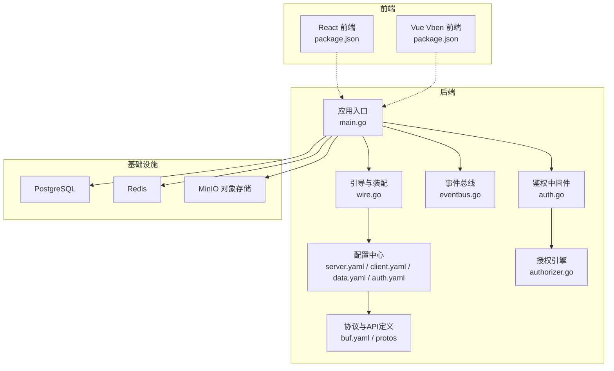
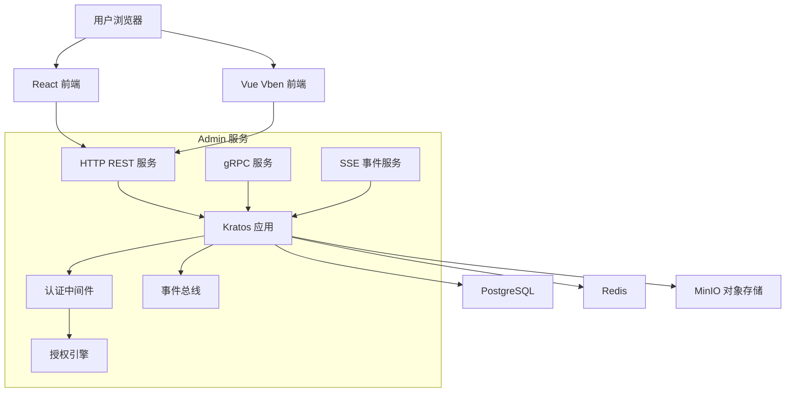
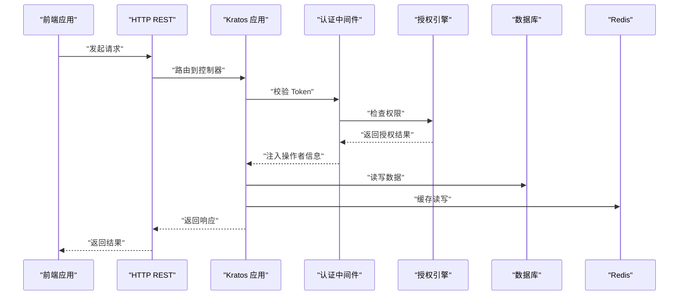
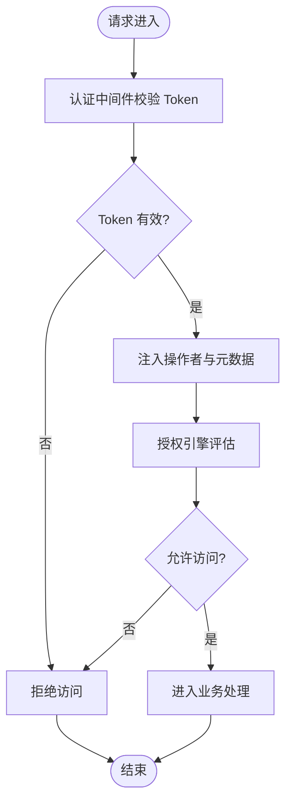
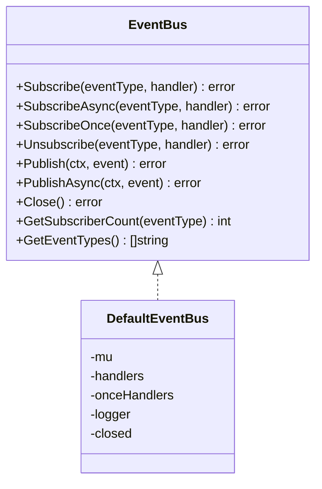
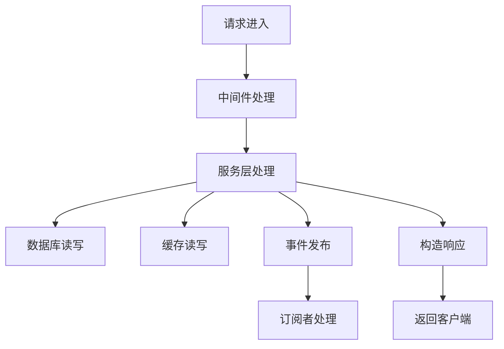
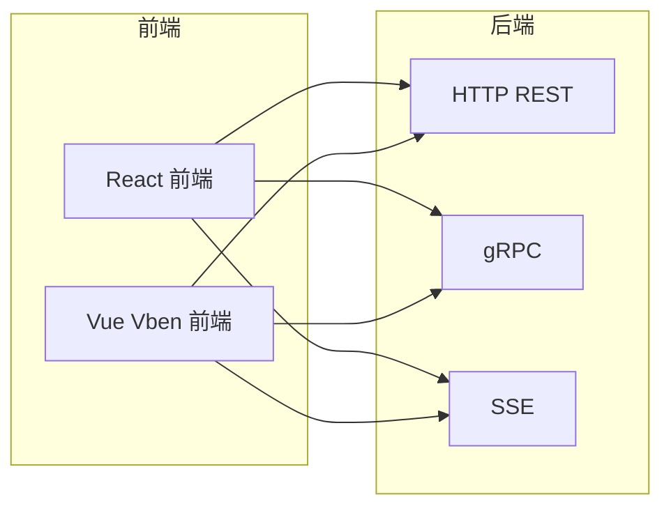
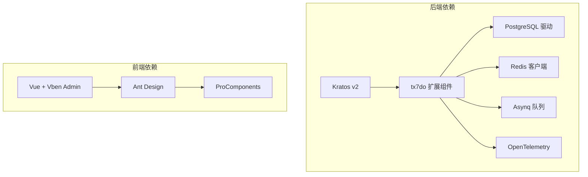

# 架构概览

<cite>
**本文引用的文件**   
- [go.mod](file://backend/go.mod)
- [main.go](file://backend/app/admin/service/cmd/server/main.go)
- [wire.go](file://backend/app/admin/service/cmd/server/wire.go)
- [server.yaml](file://backend/app/admin/service/configs/server.yaml)
- [client.yaml](file://backend/app/admin/service/configs/client.yaml)
- [data.yaml](file://backend/app/admin/service/configs/data.yaml)
- [auth.yaml](file://backend/app/admin/service/configs/auth.yaml)
- [docker-compose.yaml](file://backend/docker-compose.yaml)
- [Dockerfile](file://backend/Dockerfile)
- [buf.yaml](file://backend/api/buf.yaml)
- [eventbus.go](file://backend/pkg/eventbus/eventbus.go)
- [auth.go](file://backend/pkg/middleware/auth/auth.go)
- [authorizer.go](file://backend/pkg/authorizer/authorizer.go)
- [package.json (React)](file://frontend/admin/react/package.json)
- [package.json (Vue Vben)](file://frontend/admin/vue-vben/package.json)
</cite>

## 目录
1. [简介](#简介)
2. [项目结构](#项目结构)
3. [核心组件](#核心组件)
4. [架构总览](#架构总览)
5. [详细组件分析](#详细组件分析)
6. [依赖分析](#依赖分析)
7. [性能考量](#性能考量)
8. [故障排查指南](#故障排查指南)
9. [结论](#结论)
10. [附录](#附录)

## 简介
GoWind Admin 是一个现代化的企业级后台管理系统，采用“前后端分离 + 双前端框架并行支持”的架构设计。后端基于 Kratos 微服务框架，结合 gRPC、HTTP/JSON、Server-Sent Events 等多种通信方式，提供高可用、可观测、可扩展的系统能力。前端同时支持 Vue3 + Vben Admin 与 React + Ant Design 两套方案，满足不同团队的技术栈偏好与业务需求。

## 项目结构
项目采用多模块组织方式：
- 后端（Go）：以 Kratos 为核心，按领域拆分为多个子服务与通用包，统一通过引导器装配与运行。
- 前端（React/Vue）：分别位于独立工作区，提供完整的开发、构建与预览流程。
- API 与协议：通过 Protocol Buffers 定义跨语言接口，生成多语言客户端与服务端代码。
- 部署与编排：使用 Docker 与 docker-compose 提供本地与生产级部署能力。

**图表来源**
- [main.go:1-76](file://backend/app/admin/service/cmd/server/main.go#L1-L76)
- [wire.go:1-47](file://backend/app/admin/service/cmd/server/wire.go#L1-L47)
- [server.yaml:1-49](file://backend/app/admin/service/configs/server.yaml#L1-L49)
- [client.yaml:1-14](file://backend/app/admin/service/configs/client.yaml#L1-L14)
- [data.yaml:1-21](file://backend/app/admin/service/configs/data.yaml#L1-L21)
- [auth.yaml:1-37](file://backend/app/admin/service/configs/auth.yaml#L1-L37)
- [buf.yaml:1-26](file://backend/api/buf.yaml#L1-L26)
- [eventbus.go:1-214](file://backend/pkg/eventbus/eventbus.go#L1-L214)
- [auth.go:1-122](file://backend/pkg/middleware/auth/auth.go#L1-L122)
- [authorizer.go:1-241](file://backend/pkg/authorizer/authorizer.go#L1-L241)
- [package.json (React):1-82](file://frontend/admin/react/package.json#L1-L82)
- [package.json (Vue Vben):1-118](file://frontend/admin/vue-vben/package.json#L1-L118)

**章节来源**
- [main.go:1-76](file://backend/app/admin/service/cmd/server/main.go#L1-L76)
- [wire.go:1-47](file://backend/app/admin/service/cmd/server/wire.go#L1-L47)
- [server.yaml:1-49](file://backend/app/admin/service/configs/server.yaml#L1-L49)
- [client.yaml:1-14](file://backend/app/admin/service/configs/client.yaml#L1-L14)
- [data.yaml:1-21](file://backend/app/admin/service/configs/data.yaml#L1-L21)
- [auth.yaml:1-37](file://backend/app/admin/service/configs/auth.yaml#L1-L37)
- [buf.yaml:1-26](file://backend/api/buf.yaml#L1-L26)
- [eventbus.go:1-214](file://backend/pkg/eventbus/eventbus.go#L1-L214)
- [auth.go:1-122](file://backend/pkg/middleware/auth/auth.go#L1-L122)
- [authorizer.go:1-241](file://backend/pkg/authorizer/authorizer.go#L1-L241)
- [package.json (React):1-82](file://frontend/admin/react/package.json#L1-L82)
- [package.json (Vue Vben):1-118](file://frontend/admin/vue-vben/package.json#L1-L118)

## 核心组件
- 应用引导与装配：通过 Wire 与 Kratos Bootstrap 将服务、数据与传输层整合为可运行的应用实例。
- 传输层：HTTP REST、gRPC、Server-Sent Events（SSE）三通道并存，满足不同场景的交互需求。
- 认证与授权：基于 JWT 的认证与可插拔的授权引擎（Casbin、OPA、Zanzibar/Keto、Noop），支持细粒度权限控制。
- 事件总线：内置事件总线，支持同步与异步事件发布订阅，便于解耦与扩展。
- 数据与缓存：支持 PostgreSQL 与 Redis，具备连接池与生命周期管理。
- 前端框架：React + Ant Design Pro 与 Vue3 + Vben Admin 并行，统一通过 OpenAPI/Swagger 文档驱动。

**章节来源**
- [main.go:46-76](file://backend/app/admin/service/cmd/server/main.go#L46-L76)
- [wire.go:27-46](file://backend/app/admin/service/cmd/server/wire.go#L27-L46)
- [server.yaml:1-49](file://backend/app/admin/service/configs/server.yaml#L1-L49)
- [client.yaml:1-14](file://backend/app/admin/service/configs/client.yaml#L1-L14)
- [data.yaml:1-21](file://backend/app/admin/service/configs/data.yaml#L1-L21)
- [auth.yaml:1-37](file://backend/app/admin/service/configs/auth.yaml#L1-L37)
- [eventbus.go:12-34](file://backend/pkg/eventbus/eventbus.go#L12-L34)
- [auth.go:23-122](file://backend/pkg/middleware/auth/auth.go#L23-L122)
- [authorizer.go:18-109](file://backend/pkg/authorizer/authorizer.go#L18-L109)

## 架构总览
系统采用“单体部署 + 微服务理念”的混合模式：
- 单体部署：通过 Docker Compose 将 Admin 服务、数据库、缓存与对象存储集中部署，适合中小型团队与快速迭代。
- 微服务理念：后端以 Kratos 为基础，模块化清晰，服务边界明确，便于未来拆分为独立微服务。

**图表来源**
- [main.go:6-12](file://backend/app/admin/service/cmd/server/main.go#L6-L12)
- [server.yaml:2-49](file://backend/app/admin/service/configs/server.yaml#L2-L49)
- [client.yaml:2-14](file://backend/app/admin/service/configs/client.yaml#L2-L14)
- [data.yaml:2-21](file://backend/app/admin/service/configs/data.yaml#L2-L21)
- [auth.yaml:1-37](file://backend/app/admin/service/configs/auth.yaml#L1-L37)
- [eventbus.go:1-214](file://backend/pkg/eventbus/eventbus.go#L1-L214)
- [auth.go:1-122](file://backend/pkg/middleware/auth/auth.go#L1-L122)
- [authorizer.go:1-241](file://backend/pkg/authorizer/authorizer.go#L1-L241)

## 详细组件分析

### 传输层与通信机制
- HTTP REST：提供标准 JSON 接口，支持 Swagger 文档与 pprof 调试。
- gRPC：通过 Protobuf 定义接口，自动代码生成，高性能、强类型。
- SSE：用于实时事件推送，如审计日志、任务状态等。
- WebSocket：可扩展接入点，建议在需要双向长连接时启用。

**图表来源**
- [server.yaml:2-49](file://backend/app/admin/service/configs/server.yaml#L2-L49)
- [client.yaml:2-14](file://backend/app/admin/service/configs/client.yaml#L2-L14)
- [auth.go:23-122](file://backend/pkg/middleware/auth/auth.go#L23-L122)
- [authorizer.go:58-109](file://backend/pkg/authorizer/authorizer.go#L58-L109)

**章节来源**
- [server.yaml:1-49](file://backend/app/admin/service/configs/server.yaml#L1-L49)
- [client.yaml:1-14](file://backend/app/admin/service/configs/client.yaml#L1-L14)
- [auth.go:1-122](file://backend/pkg/middleware/auth/auth.go#L1-L122)
- [authorizer.go:1-241](file://backend/pkg/authorizer/authorizer.go#L1-L241)

### 认证与授权流程
- 认证：支持 JWT、OIDC、预共享密钥等多种方式，统一由认证中间件处理。
- 授权：可选择 Casbin、OPA、Zanzibar/Keto 或 Noop 引擎，策略可动态加载与重载。
- 数据范围：通过操作者元数据注入，限制数据访问范围，确保租户隔离与最小权限原则。

**图表来源**
- [auth.go:38-122](file://backend/pkg/middleware/auth/auth.go#L38-L122)
- [authorizer.go:50-109](file://backend/pkg/authorizer/authorizer.go#L50-L109)
- [auth.yaml:1-37](file://backend/app/admin/service/configs/auth.yaml#L1-L37)

**章节来源**
- [auth.go:1-122](file://backend/pkg/middleware/auth/auth.go#L1-L122)
- [authorizer.go:1-241](file://backend/pkg/authorizer/authorizer.go#L1-L241)
- [auth.yaml:1-37](file://backend/app/admin/service/configs/auth.yaml#L1-L37)

### 事件总线与异步处理
- 支持同步与异步事件发布，异步事件使用独立 goroutine 与超时上下文，避免阻塞主请求链路。
- 一次性处理器在首次触发后自动移除，降低内存占用。
- 适用于审计日志、通知、任务调度等场景。

**图表来源**
- [eventbus.go:12-34](file://backend/pkg/eventbus/eventbus.go#L12-L34)
- [eventbus.go:36-52](file://backend/pkg/eventbus/eventbus.go#L36-L52)

**章节来源**
- [eventbus.go:1-214](file://backend/pkg/eventbus/eventbus.go#L1-L214)

### 数据流与处理流程
- 请求入口：HTTP REST 或 gRPC。
- 中间件：认证、授权、日志、熔断、元数据注入。
- 业务处理：调用服务层，读写数据库与缓存。
- 响应返回：序列化为 JSON 或 Protobuf，返回给前端或下游服务。

**图表来源**
- [server.yaml:22-29](file://backend/app/admin/service/configs/server.yaml#L22-L29)
- [data.yaml:2-21](file://backend/app/admin/service/configs/data.yaml#L2-L21)
- [eventbus.go:106-152](file://backend/pkg/eventbus/eventbus.go#L106-L152)

**章节来源**
- [server.yaml:1-49](file://backend/app/admin/service/configs/server.yaml#L1-L49)
- [data.yaml:1-21](file://backend/app/admin/service/configs/data.yaml#L1-L21)
- [eventbus.go:1-214](file://backend/pkg/eventbus/eventbus.go#L1-L214)

### 前后端分离与双前端支持
- 前端通过 Axios、TanStack React Query、Fetch Event Source 等库与后端交互。
- React 前端使用 Ant Design Pro 组件体系；Vue Vben 前端提供更丰富的生态与主题切换。
- 两套前端均对接同一后端接口，保持一致的用户体验与功能覆盖。

**图表来源**
- [package.json (React):13-38](file://frontend/admin/react/package.json#L13-L38)
- [package.json (Vue Vben):67-68](file://frontend/admin/vue-vben/package.json#L67-L68)
- [server.yaml:2-49](file://backend/app/admin/service/configs/server.yaml#L2-L49)

**章节来源**
- [package.json (React):1-82](file://frontend/admin/react/package.json#L1-L82)
- [package.json (Vue Vben):1-118](file://frontend/admin/vue-vben/package.json#L1-L118)
- [server.yaml:1-49](file://backend/app/admin/service/configs/server.yaml#L1-L49)

## 依赖分析
- 后端依赖 Kratos 生态与 tx7do 扩展组件，提供传输、注册发现、追踪、缓存、数据库、消息队列等能力。
- 前端依赖 Ant Design 与 ProComponents（React）或 Vben Admin（Vue），提供开箱即用的企业级 UI 能力。
- 协议与代码生成：通过 buf 管理 Protobuf 模块，生成多语言客户端与服务端代码。

**图表来源**
- [go.mod:5-65](file://backend/go.mod#L5-L65)
- [package.json (React):13-38](file://frontend/admin/react/package.json#L13-L38)
- [package.json (Vue Vben):67-68](file://frontend/admin/vue-vben/package.json#L67-L68)

**章节来源**
- [go.mod:1-290](file://backend/go.mod#L1-L290)
- [package.json (React):1-82](file://frontend/admin/react/package.json#L1-L82)
- [package.json (Vue Vben):1-118](file://frontend/admin/vue-vben/package.json#L1-L118)

## 性能考量
- 连接池与生命周期：数据库与缓存连接池参数可调，建议根据并发与资源情况优化最大空闲/打开连接数与生命周期。
- 中间件链路：启用日志、追踪、熔断与校验会带来额外开销，建议在生产环境按需开启。
- 事件异步化：将耗时操作放入事件总线或队列，避免阻塞请求。
- 缓存策略：热点数据走缓存，设置合理过期时间与失效策略，减少数据库压力。
- SSE 与 gRPC：SSE 适合低频事件推送，高频实时交互建议使用 WebSocket 或 gRPC 流式传输。

## 故障排查指南
- 认证失败：检查 Token 是否正确传递与签名是否有效，确认认证中间件配置。
- 授权异常：核对授权引擎类型与策略加载是否成功，必要时重载策略。
- 数据库连接：检查连接字符串、网络连通性与连接池参数，关注最大连接数与超时设置。
- 缓存不可用：确认 Redis 地址、密码与网络可达性，观察读写超时。
- 事件未触发：检查事件类型订阅与发布逻辑，确认异步事件上下文与超时设置。

**章节来源**
- [auth.go:46-61](file://backend/pkg/middleware/auth/auth.go#L46-L61)
- [authorizer.go:63-109](file://backend/pkg/authorizer/authorizer.go#L63-L109)
- [data.yaml:2-21](file://backend/app/admin/service/configs/data.yaml#L2-L21)
- [eventbus.go:154-167](file://backend/pkg/eventbus/eventbus.go#L154-L167)

## 结论
GoWind Admin 通过 Kratos 与多语言协议的结合，实现了“单体部署 + 微服务理念”的灵活架构。前后端分离与双前端并行支持，提升了团队协作效率与产品交付速度。完善的认证授权、事件总线与可观测性中间件，为系统的稳定性与可扩展性提供了坚实基础。建议在生产环境中根据业务规模调整连接池、缓存与中间件策略，并持续演进为真正的微服务架构。

## 附录
- 部署与运行：使用 Docker 与 docker-compose 快速拉起本地环境，支持 PostgreSQL、Redis、MinIO 一体化部署。
- 开发与构建：前端分别提供 React 与 Vue Vben 的开发脚本与构建流程，后端通过 Wire 自动装配与 Kratos 引导运行。

**章节来源**
- [docker-compose.yaml:1-125](file://backend/docker-compose.yaml#L1-L125)
- [Dockerfile:1-66](file://backend/Dockerfile#L1-L66)
- [package.json (React):7-12](file://frontend/admin/react/package.json#L7-L12)
- [package.json (Vue Vben):7-34](file://frontend/admin/vue-vben/package.json#L7-L34)