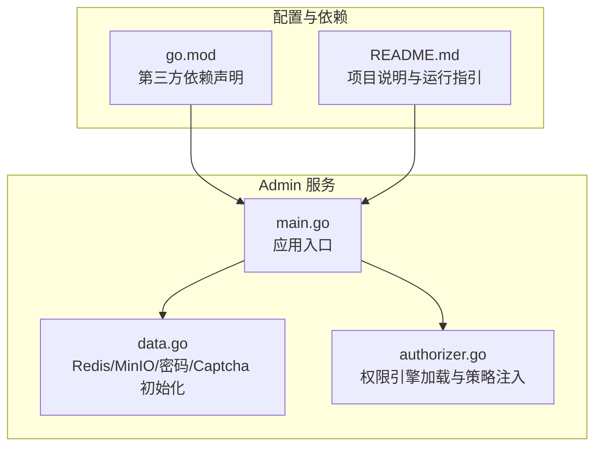
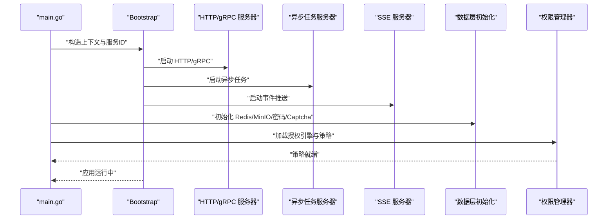
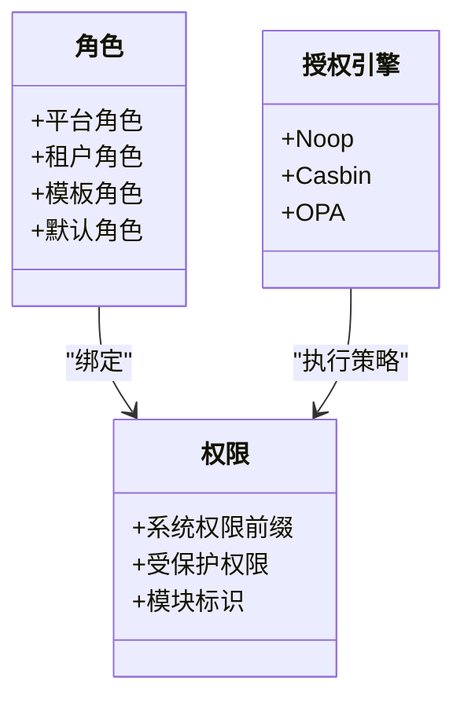
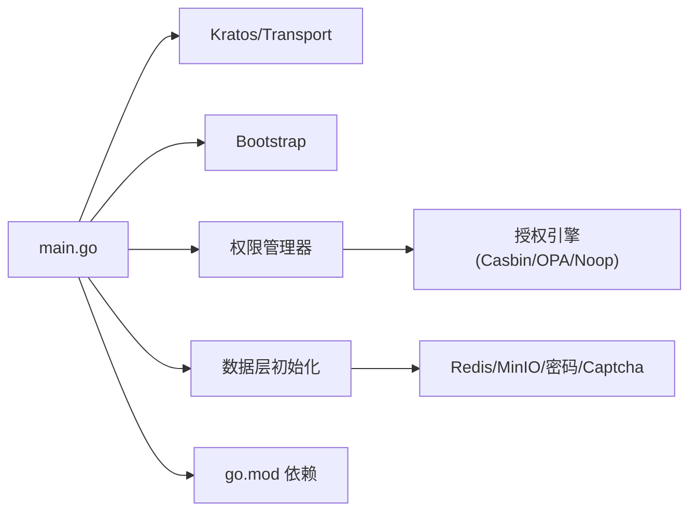

# 核心功能列表

<cite>
**本文引用的文件**
- [backend/app/admin/service/cmd/server/main.go](file://backend/app/admin/service/cmd/server/main.go)
- [backend/README.md](file://backend/README.md)
- [backend/go.mod](file://backend/go.mod)
- [backend/pkg/constants/tenant.go](file://backend/pkg/constants/tenant.go)
- [backend/pkg/constants/role.go](file://backend/pkg/constants/role.go)
- [backend/pkg/constants/permission.go](file://backend/pkg/constants/permission.go)
- [backend/pkg/authorizer/authorizer.go](file://backend/pkg/authorizer/authorizer.go)
- [backend/app/admin/service/internal/data/data.go](file://backend/app/admin/service/internal/data/data.go)
</cite>

## 目录
1. [简介](#简介)
2. [项目结构](#项目结构)
3. [核心组件](#核心组件)
4. [架构总览](#架构总览)
5. [详细功能分析](#详细功能分析)
6. [依赖关系分析](#依赖关系分析)
7. [性能考量](#性能考量)
8. [故障排查指南](#故障排查指南)
9. [结论](#结论)
10. [附录](#附录)

## 简介
本文件面向 GoWind Admin 项目的使用者与维护者，系统性梳理后端核心能力，覆盖用户管理、租户管理、角色与权限、组织架构、接口与菜单、字典、任务调度、文件与消息等模块的功能边界、业务价值与典型使用场景。文档以仓库现有实现为依据，结合协议与常量定义，给出可落地的实践建议与可视化图示。

## 项目结构
后端采用“单服务多协议”架构，Admin 服务作为统一入口，提供 REST/gRPC 双栈能力，并集成任务队列与事件推送通道。整体由 Kratos Bootstrap 提供启动、配置、注册与可观测性支撑。

**图表来源**
- [backend/app/admin/service/cmd/server/main.go:1-76](file://backend/app/admin/service/cmd/server/main.go#L1-L76)
- [backend/app/admin/service/internal/data/data.go:1-63](file://backend/app/admin/service/internal/data/data.go#L1-L63)
- [backend/pkg/authorizer/authorizer.go:1-241](file://backend/pkg/authorizer/authorizer.go#L1-L241)
- [backend/go.mod:1-290](file://backend/go.mod#L1-L290)
- [backend/README.md:1-260](file://backend/README.md#L1-L260)

**章节来源**
- [backend/app/admin/service/cmd/server/main.go:1-76](file://backend/app/admin/service/cmd/server/main.go#L1-L76)
- [backend/README.md:1-260](file://backend/README.md#L1-L260)

## 核心组件
- 应用入口与运行时
  - Admin 服务通过 Kratos Bootstrap 启动，支持 HTTP 与 gRPC，同时集成异步任务与 SSE 通道。
  - 服务 ID 与版本信息在入口处集中配置，便于运维与监控。
- 数据与基础设施
  - Redis 客户端、MinIO 对象存储客户端、密码加密器、图形验证码组件在数据层统一初始化。
- 权限与授权
  - 权限管理器支持多种授权引擎（Noop/Casbin/OPA），从 Provider 加载策略并注入引擎，实现灵活的授权方案切换。

**章节来源**
- [backend/app/admin/service/cmd/server/main.go:46-75](file://backend/app/admin/service/cmd/server/main.go#L46-L75)
- [backend/app/admin/service/internal/data/data.go:23-62](file://backend/app/admin/service/internal/data/data.go#L23-L62)
- [backend/pkg/authorizer/authorizer.go:26-109](file://backend/pkg/authorizer/authorizer.go#L26-L109)

## 架构总览
下图展示 Admin 服务在运行期的关键交互：应用启动、依赖注入、权限策略加载与外部组件初始化。

**图表来源**
- [backend/app/admin/service/cmd/server/main.go:46-75](file://backend/app/admin/service/cmd/server/main.go#L46-L75)
- [backend/app/admin/service/internal/data/data.go:23-62](file://backend/app/admin/service/internal/data/data.go#L23-L62)
- [backend/pkg/authorizer/authorizer.go:50-109](file://backend/pkg/authorizer/authorizer.go#L50-L109)

## 详细功能分析

### 用户管理
- 功能范围
  - 用户 CRUD：基于 Protobuf 与代码生成机制，提供标准的增删改查接口。
  - 高级查询：支持分页、排序、过滤与复杂条件组合（由代码生成工具提供）。
  - 主管设置：支持用户与主管的层级关系配置，用于组织与汇报线管理。
  - 密码重置：内置密码加密器，支持安全重置流程。
  - 一键登录：结合认证与令牌发放，简化登录体验。
- 业务价值
  - 统一用户身份与凭证管理，支撑多租户与多角色场景。
  - 降低前端接入成本，提升系统一致性与安全性。
- 使用场景
  - 新员工入职：创建用户、分配角色、设置主管。
  - 账号维护：密码重置、状态变更、权限回收。
  - 管理驾驶舱：按部门/角色筛选用户，进行批量操作。

**章节来源**
- [backend/app/admin/service/internal/data/data.go:45-51](file://backend/app/admin/service/internal/data/data.go#L45-L51)
- [backend/README.md:128-141](file://backend/README.md#L128-L141)

### 租户管理
- 功能范围
  - 租户创建：支持租户维度的资源隔离与独立配置。
  - 自动初始化：租户创建后可触发默认数据与策略初始化。
  - 套餐配置：通过租户套餐控制可用功能与配额。
  - 管理员管理：为租户绑定管理员，限定其权限范围。
- 业务价值
  - 实现 SaaS 化多租户架构，满足不同客户差异化需求。
  - 通过套餐与管理员机制，保障安全与合规。
- 使用场景
  - 客户开通：创建租户、选择套餐、添加管理员。
  - 资源扩容：调整套餐与配额，同步到租户策略。
  - 多租户审计：基于租户维度进行日志与合规检查。

**章节来源**
- [backend/pkg/constants/tenant.go:1-25](file://backend/pkg/constants/tenant.go#L1-L25)

### 角色与权限管理
- 角色体系
  - 角色分组：平台/租户/模板三类角色前缀，支持层级化命名与继承。
  - 默认角色：平台管理员、租户管理员及其模板角色，便于快速复制与标准化。
- 权限体系
  - 权限代码：统一以“sys:”前缀标识系统权限，包含后台访问、租户管理、审计日志、平台/租户管理员等。
  - 受保护权限：关键系统权限不可删除，保障系统安全基线。
- 授权引擎
  - 支持 Noop/Casbin/OPA 等引擎，策略从 Provider 提供，注入引擎后生效。
  - Casbin 与 OPA 的策略格式分别适配 RBAC 与 Rego 模型。
- 业务价值
  - 明确职责边界，实现最小权限与职责分离。
  - 通过模板角色与策略注入，降低权限配置复杂度。
- 使用场景
  - 新建角色：基于模板角色快速生成平台/租户角色。
  - 权限分配：将角色绑定到用户或组织单元，按需授予菜单与数据权限。
  - 安全审计：基于受保护权限与策略记录，追踪权限变更。

**图表来源**
- [backend/pkg/constants/role.go:1-49](file://backend/pkg/constants/role.go#L1-L49)
- [backend/pkg/constants/permission.go:1-39](file://backend/pkg/constants/permission.go#L1-L39)
- [backend/pkg/authorizer/authorizer.go:162-240](file://backend/pkg/authorizer/authorizer.go#L162-L240)

**章节来源**
- [backend/pkg/constants/role.go:1-49](file://backend/pkg/constants/role.go#L1-L49)
- [backend/pkg/constants/permission.go:1-39](file://backend/pkg/constants/permission.go#L1-L39)
- [backend/pkg/authorizer/authorizer.go:58-109](file://backend/pkg/authorizer/authorizer.go#L58-L109)

### 组织架构管理
- 功能范围
  - 组织单位：支持树形结构的组织建模，便于层级化管理。
  - 部门与职位：与用户成员关系解耦，支持灵活的岗位与汇报线配置。
- 业务价值
  - 清晰的组织关系，支撑审批流、报表与权限域划分。
- 使用场景
  - 组织拆分：新增/合并部门，调整汇报关系。
  - 人员配置：将用户挂靠到组织单位与职位，形成完整的组织画像。

**章节来源**
- [backend/README.md:128-141](file://backend/README.md#L128-L141)

### 接口与菜单管理
- 功能范围
  - 接口管理：基于 Protobuf 自动生成 REST/gRPC 接口，统一契约与文档。
  - 菜单管理：菜单与接口映射，支持前端路由与权限联动。
- 业务价值
  - 降低接口维护成本，保证前后端契约一致。
  - 通过菜单与接口的关联，实现细粒度的前端导航与权限控制。
- 使用场景
  - 新增功能：定义接口与菜单项，同步到权限策略。
  - 权限收敛：按菜单聚合接口权限，减少策略碎片化。

**章节来源**
- [backend/README.md:128-141](file://backend/README.md#L128-L141)

### 字典管理
- 功能范围
  - 字典类型与条目：支持多语言与多业务域的键值映射。
- 业务价值
  - 统一业务参数与文案，提升国际化与可维护性。
- 使用场景
  - 国际化：按语言维度维护字典条目。
  - 业务参数：统一枚举与状态值，避免魔法数。

**章节来源**
- [backend/README.md:128-141](file://backend/README.md#L128-L141)

### 任务调度
- 功能范围
  - 异步任务：基于 Asynq 异步队列，支持定时与事件驱动的任务编排。
- 业务价值
  - 解耦耗时操作，提升用户体验与系统吞吐。
- 使用场景
  - 批量导入导出、报表生成、通知发送等后台任务。

**章节来源**
- [backend/app/admin/service/cmd/server/main.go:8-9](file://backend/app/admin/service/cmd/server/main.go#L8-L9)

### 文件管理
- 功能范围
  - 对象存储：集成 MinIO，提供文件上传、下载与元数据管理。
- 业务价值
  - 统一文件存储与访问，支持大文件与多租户隔离。
- 使用场景
  - 附件上传、头像管理、批量导入模板等。

**章节来源**
- [backend/app/admin/service/internal/data/data.go:41-43](file://backend/app/admin/service/internal/data/data.go#L41-L43)

### 消息管理
- 功能范围
  - 内部消息：支持消息分类、接收人与内容管理，结合 SSE 实时推送。
- 业务价值
  - 提升内部沟通效率，支持精准触达与审计。
- 使用场景
  - 系统公告、运营通知、告警提醒等。

**章节来源**
- [backend/app/admin/service/cmd/server/main.go:9-9](file://backend/app/admin/service/cmd/server/main.go#L9-L9)

## 依赖关系分析
- 运行时依赖
  - Kratos 与 Kratos-Transport 提供 HTTP/gRPC、异步任务与 SSE 能力。
  - Kratos-Bootstrap 提供配置、注册、日志与可观测性基础能力。
  - Ent ORM、GORM、Redis、PostgreSQL/MySQL、MinIO 等作为数据与存储层。
- 权限与授权
  - Kratos-Authz 提供授权引擎抽象，支持 Casbin 与 OPA。
- 代码生成与文档
  - Protobuf 与代码生成工具链，自动生成 API、服务与前端 TS 客户端。

**图表来源**
- [backend/app/admin/service/cmd/server/main.go:1-76](file://backend/app/admin/service/cmd/server/main.go#L1-L76)
- [backend/pkg/authorizer/authorizer.go:162-240](file://backend/pkg/authorizer/authorizer.go#L162-L240)
- [backend/app/admin/service/internal/data/data.go:23-62](file://backend/app/admin/service/internal/data/data.go#L23-L62)
- [backend/go.mod:5-65](file://backend/go.mod#L5-L65)

**章节来源**
- [backend/go.mod:1-290](file://backend/go.mod#L1-L290)

## 性能考量
- 传输与并发
  - HTTP/gRPC 双栈可按场景选择，建议高吞吐场景优先 gRPC，低延迟交互优先 HTTP。
- 缓存与存储
  - Redis 用于验证码与会话缓存，建议合理设置过期策略与键空间。
  - MinIO 作为对象存储，注意分片大小与并发上传策略。
- 授权评估
  - Casbin 适合规则简单、匹配频繁的场景；OPA 适合复杂策略与动态模型。
- 任务队列
  - Asynq 支持优先级与重试策略，建议根据任务类型设置队列与并发。

## 故障排查指南
- 启动与配置
  - 若启动失败，检查服务 ID、版本与配置加载是否成功。
- 权限策略
  - 若出现权限异常，确认授权引擎类型与策略注入是否完成，必要时重载策略。
- 存储连接
  - Redis/MinIO 连接失败时，核对主机与端口配置，确保网络可达。
- 依赖缺失
  - 若出现模块导入错误，执行依赖同步与代码生成命令，确保 Protobuf 与 ORM 代码已更新。

**章节来源**
- [backend/pkg/authorizer/authorizer.go:50-109](file://backend/pkg/authorizer/authorizer.go#L50-L109)
- [backend/README.md:143-180](file://backend/README.md#L143-L180)

## 结论
GoWind Admin 以 Admin 服务为核心，围绕用户、租户、角色与权限、组织架构、接口与菜单、字典、任务调度、文件与消息等模块构建了完整的后台能力矩阵。通过代码生成与多协议支持，既保证了开发效率，也兼顾了运行时的灵活性与可扩展性。建议在生产环境中结合业务场景选择合适的授权引擎与存储策略，并持续完善权限模板与策略注入流程，以获得更佳的安全性与可维护性。

## 附录
- 快速定位
  - 用户与认证相关：参考数据层初始化与权限管理器。
  - 租户与套餐：参考租户常量与权限常量。
  - 角色与权限：参考角色与权限常量、授权引擎初始化。
  - 任务与消息：参考应用入口中的异步与 SSE 通道。