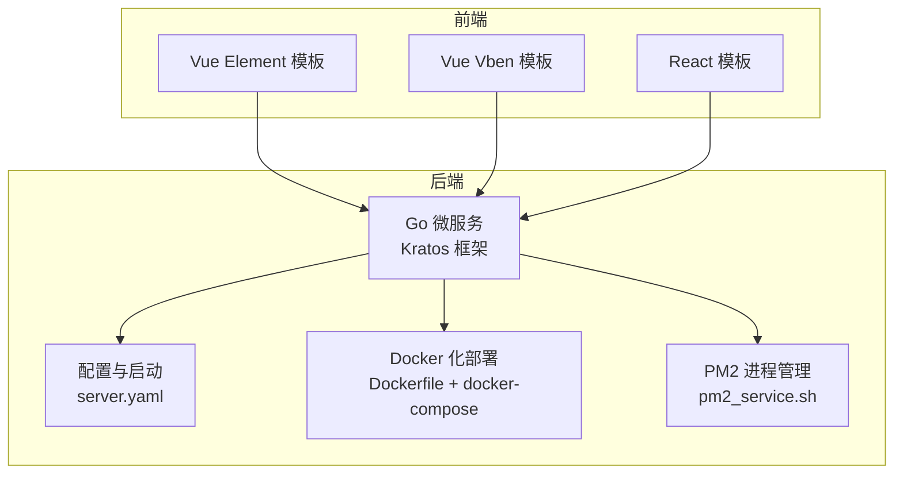
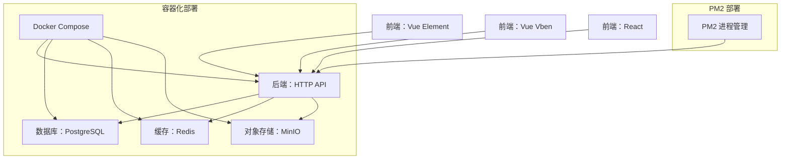
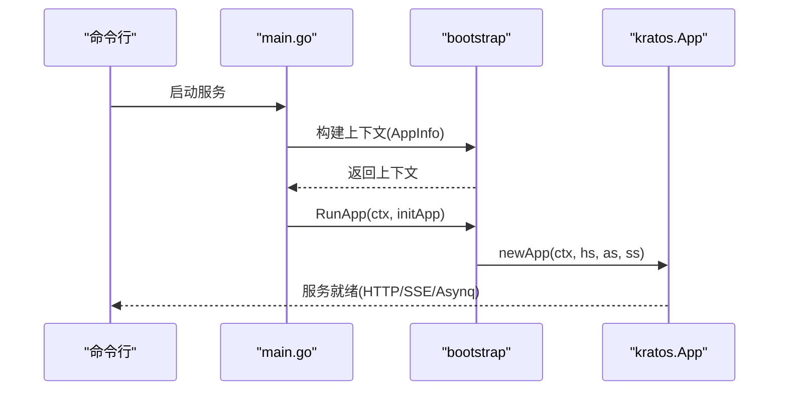
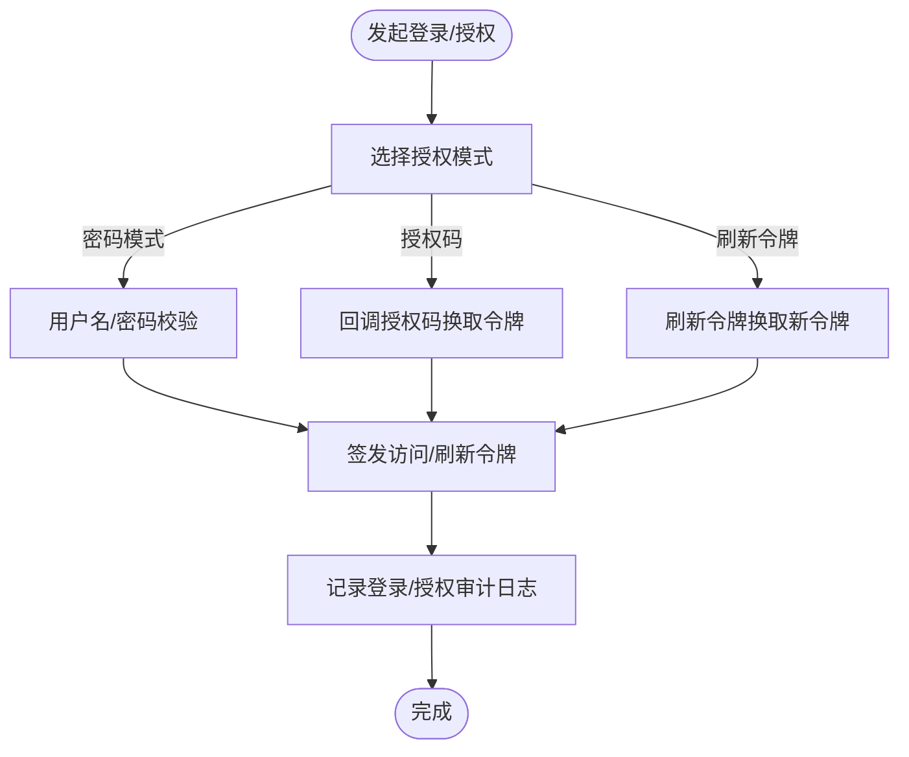
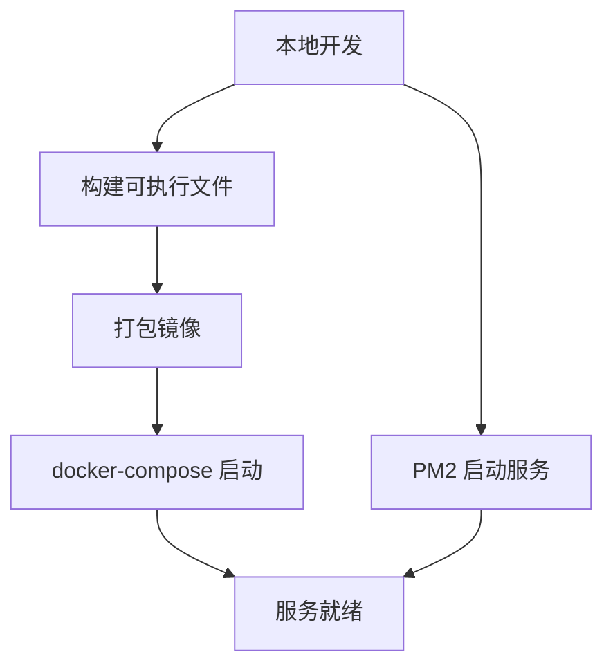
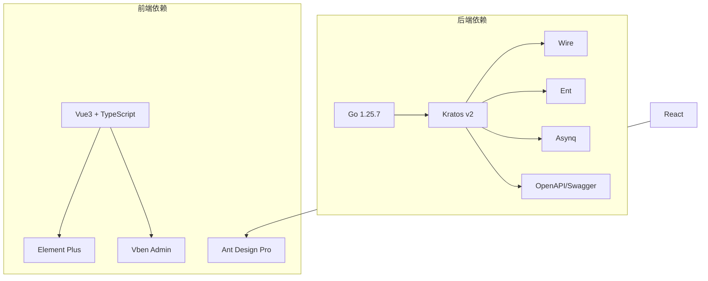

# 项目介绍

<cite>
**本文引用的文件**
- [README.md](file://README.md)
- [main.go](file://backend/app/admin/service/cmd/server/main.go)
- [go.mod](file://backend/go.mod)
- [package.json (React)](file://frontend/admin/react/package.json)
- [package.json (Vue Element)](file://frontend/admin/vue-element/package.json)
- [package.json (Vue Vben)](file://frontend/admin/vue-vben/package.json)
- [Dockerfile](file://backend/Dockerfile)
- [docker-compose.yaml](file://backend/docker-compose.yaml)
- [server.yaml](file://backend/app/admin/service/configs/server.yaml)
- [project_id.go](file://backend/pkg/serviceid/project_id.go)
- [backend_deploy.md](file://docs/backend_deploy.md)
- [authentication.pb.go](file://backend/api/gen/go/authentication/2/service/v1/authentication.pb.go)
</cite>

## 目录
1. [引言](#引言)
2. [项目结构](#项目结构)
3. [核心组件](#核心组件)
4. [架构总览](#架构总览)
5. [详细组件分析](#详细组件分析)
6. [依赖关系分析](#依赖关系分析)
7. [性能考虑](#性能考虑)
8. [故障排查指南](#故障排查指南)
9. [结论](#结论)
10. [附录](#附录)

## 引言
GoWind Admin 是一款“开箱即用的企业级前后端一体中后台脚手架”。它以“风行”为名，寓意“让中后台开发如风般自由”，旨在通过一体化的工程化基座，显著提升企业级中后台系统的研发效率与交付质量。

- 核心定位与价值主张
  - 一体化：后端采用 Go 微服务框架，前端提供 Vue3 与 React 两套成熟实现，兼顾扩展性与易用性。
  - 企业级：覆盖用户/租户/角色/权限/组织/部门/职位/接口/菜单/字典/任务调度/文件管理/消息体系/审计日志等关键能力，满足中后台通用需求。
  - 易用性：提供一键安装依赖、Docker 一键部署、Swagger 文档、演示账号等，降低上手门槛。
  - 双模部署：既支持微服务容器化部署，也支持 PM2 在宿主机运行，灵活适配不同团队规模与项目复杂度。

- 解决的痛点
  - 开发效率低：提供开箱即用的脚手架与丰富的业务模块，减少重复造轮子的时间。
  - 功能不完善：内置完善的权限与审计体系、任务调度、文件存储、消息体系等，覆盖常见企业级场景。
  - 部署复杂：提供 Docker Compose 与 PM2 双通道部署方案，简化环境准备与上线流程。

- 命名由来与寓意
  - “风行”取自“风行天下”，象征着项目追求的敏捷、自由与高效，帮助团队在中后台开发中乘风破浪。

- 企业应用场景优势
  - 快速搭建：支持多数据库、对象存储、缓存与分布式追踪等中间件的一键部署。
  - 权限与审计：内置认证、授权、登录/操作/数据访问/策略评估等审计能力，满足合规要求。
  - 可演进：单体与微服务双模式并存，便于从小团队到大型组织的平滑演进。

- 微服务与单体部署的双重设计
  - 设计考量：在保持微服务框架能力的同时，提供单体部署模式，兼顾扩展性与易用性。
  - 实践路径：可通过 Docker Compose 将中间件与服务容器化运行；也可通过 PM2 将服务以进程形式托管于宿主机，降低运维复杂度。

- 发展历程、社区生态与未来规划
  - 发展历程：项目长期维护，持续迭代核心能力与部署体验，并提供多语言文档与演示站点。
  - 社区生态：提供演示站点、微信交流渠道与掘金专栏，便于用户学习与反馈。
  - 未来规划：持续优化权限模型、审计体系与多前端模板的协同一致性，增强可观测性与可扩展性。

**章节来源**
- [README.md:1-185](file://README.md#L1-L185)

## 项目结构
项目采用前后端分离的多模板架构，后端基于 Go 微服务框架，前端提供 Vue Element 与 Vue Vben 两种模板，同时保留 React 模板。后端通过 Docker 与 PM2 提供双通道部署能力。

**图表来源**
- [Dockerfile:1-66](file://backend/Dockerfile#L1-L66)
- [docker-compose.yaml:1-125](file://backend/docker-compose.yaml#L1-L125)
- [server.yaml:1-49](file://backend/app/admin/service/configs/server.yaml#L1-L49)
- [package.json (Vue Element):1-173](file://frontend/admin/vue-element/package.json#L1-L173)
- [package.json (Vue Vben):1-118](file://frontend/admin/vue-vben/package.json#L1-L118)
- [package.json (React):1-82](file://frontend/admin/react/package.json#L1-L82)

**章节来源**
- [README.md:23-91](file://README.md#L23-L91)
- [backend_deploy.md:1-85](file://docs/backend_deploy.md#L1-L85)

## 核心组件
- 后端服务
  - 服务入口与启动：通过 Kratos 应用容器化启动 HTTP、异步队列与 SSE 服务，支持配置注入与版本信息。
  - 配置与中间件：HTTP 服务启用 Swagger、pprof、CORS、日志、恢复、追踪、校验、熔断与元数据等中间件。
  - 部署形态：Docker 镜像构建与运行、Compose 编排；或通过 PM2 在宿主机运行。

- 前端模板
  - Vue Element：基于 Vue3 + TypeScript + Element Plus 的后台模板，提供完善的组件与路由体系。
  - Vue Vben：现代化多包管理的 Vite 工程，支持多主题与多语言。
  - React：基于 Ant Design Pro 的 React 模板，提供状态管理与国际化支持。

- 中间件与基础设施
  - 数据库：PostgreSQL（默认），兼容 MySQL 等。
  - 缓存：Redis。
  - 存储：MinIO 对象存储。
  - 可观测性：可选 Jaeger 分布式追踪（在 Compose 中提供）。

**章节来源**
- [main.go:46-76](file://backend/app/admin/service/cmd/server/main.go#L46-L76)
- [server.yaml:1-49](file://backend/app/admin/service/configs/server.yaml#L1-L49)
- [Dockerfile:1-66](file://backend/Dockerfile#L1-L66)
- [docker-compose.yaml:1-125](file://backend/docker-compose.yaml#L1-L125)
- [package.json (Vue Element):1-173](file://frontend/admin/vue-element/package.json#L1-L173)
- [package.json (Vue Vben):1-118](file://frontend/admin/vue-vben/package.json#L1-L118)
- [package.json (React):1-82](file://frontend/admin/react/package.json#L1-L82)

## 架构总览
下图展示了后端服务、前端模板与中间件之间的交互关系，以及两种部署模式（容器化与 PM2）的差异。

**图表来源**
- [docker-compose.yaml:1-125](file://backend/docker-compose.yaml#L1-L125)
- [Dockerfile:1-66](file://backend/Dockerfile#L1-L66)
- [server.yaml:1-49](file://backend/app/admin/service/configs/server.yaml#L1-L49)

**章节来源**
- [backend_deploy.md:42-85](file://docs/backend_deploy.md#L42-L85)

## 详细组件分析

### 后端服务启动与配置
- 启动流程
  - 通过 Kratos 应用容器化启动 HTTP、异步队列与 SSE 服务。
  - 注入应用信息（项目名、服务 ID、版本），并运行应用生命周期。
- 关键配置
  - HTTP 服务监听端口、超时、Swagger 开启、CORS 放通、中间件开关。
  - 异步队列（Asynq）连接 Redis、并发与队列优先级。
  - SSE 事件服务监听端口与路径。

**图表来源**
- [main.go:46-76](file://backend/app/admin/service/cmd/server/main.go#L46-L76)

**章节来源**
- [main.go:46-76](file://backend/app/admin/service/cmd/server/main.go#L46-L76)
- [server.yaml:1-49](file://backend/app/admin/service/configs/server.yaml#L1-L49)

### 认证与授权能力
- 协议与模型
  - 基于 Protobuf 生成的认证服务接口，支持多种授权模式（密码、客户端、授权码、刷新令牌、简化模式）。
  - Token 类别区分访问令牌与刷新令牌，便于安全策略实施。
- 业务价值
  - 为用户登录、第三方授权、令牌刷新与权限控制提供标准化支撑，便于对接企业级身份系统。

**图表来源**
- [authentication.pb.go:31-224](file://backend/api/gen/go/authentication/service/v1/authentication.pb.go#L31-L224)

**章节来源**
- [authentication.pb.go:31-224](file://backend/api/gen/go/authentication/service/v1/authentication.pb.go#L31-L224)

### 部署与运行模式
- 容器化部署
  - Dockerfile 分阶段构建，最终以非 root 用户运行，暴露服务端口并挂载配置。
  - docker-compose 编排 PostgreSQL、Redis、MinIO 等依赖服务，以及后端服务。
- PM2 部署
  - 通过脚本检查环境、加载环境变量、构建项目并以 PM2 启动/重启服务，支持日志输出与命名空间管理。

**图表来源**
- [Dockerfile:1-66](file://backend/Dockerfile#L1-L66)
- [docker-compose.yaml:1-125](file://backend/docker-compose.yaml#L1-L125)
- [backend_deploy.md:257-290](file://docs/backend_deploy.md#L257-L290)

**章节来源**
- [Dockerfile:1-66](file://backend/Dockerfile#L1-L66)
- [docker-compose.yaml:1-125](file://backend/docker-compose.yaml#L1-L125)
- [backend_deploy.md:257-290](file://docs/backend_deploy.md#L257-L290)

### 前端模板与技术栈
- Vue Element
  - 依赖丰富，涵盖富文本、表格、编辑器、国际化、状态管理等，适合快速搭建后台管理界面。
- Vue Vben
  - 多包管理、现代化工程化配置，支持主题切换与多语言，适合中大型后台项目。
- React
  - 基于 Ant Design Pro，提供组件化与状态管理能力，适合偏好 React 的团队。

**章节来源**
- [package.json (Vue Element):1-173](file://frontend/admin/vue-element/package.json#L1-L173)
- [package.json (Vue Vben):1-118](file://frontend/admin/vue-vben/package.json#L1-L118)
- [package.json (React):1-82](file://frontend/admin/react/package.json#L1-L82)

## 依赖关系分析
后端依赖 Go 生态与 Kratos 生态，前端依赖各模板的现代构建工具链。整体依赖关系如下：

**图表来源**
- [go.mod:1-290](file://backend/go.mod#L1-L290)
- [package.json (Vue Element):1-173](file://frontend/admin/vue-element/package.json#L1-L173)
- [package.json (Vue Vben):1-118](file://frontend/admin/vue-vben/package.json#L1-L118)
- [package.json (React):1-82](file://frontend/admin/react/package.json#L1-L82)

**章节来源**
- [go.mod:1-290](file://backend/go.mod#L1-L290)

## 性能考虑
- 启动与资源
  - Docker 镜像采用分阶段构建，最终镜像体积小、非 root 运行，降低资源占用与安全风险。
  - Asynq 队列并发与队列优先级可调，建议结合业务峰值合理配置。
- 网络与可观测性
  - HTTP 服务开启 pprof 与追踪中间件，便于性能分析与问题定位。
  - 建议在生产环境中启用分布式追踪（如 Jaeger），并结合日志聚合与告警体系。

[本节为通用指导，不直接分析具体文件]

## 故障排查指南
- 端口冲突
  - 确认本地端口占用情况，必要时调整 HTTP/SSE/中间件端口映射。
- 依赖服务不可达
  - 检查 docker-compose 中数据库、缓存、对象存储的连接字符串与凭据。
- PM2 启动失败
  - 确认 Go 版本、PM2 安装状态与构建产物路径，查看 PM2 日志输出。
- Swagger 文档无法访问
  - 检查 server.yaml 中 Swagger 开关与 CORS 配置，确保允许前端域名访问。

**章节来源**
- [server.yaml:1-49](file://backend/app/admin/service/configs/server.yaml#L1-L49)
- [backend_deploy.md:257-290](file://docs/backend_deploy.md#L257-L290)

## 结论
GoWind Admin 以“风行”之名，为企业级中后台开发提供了高可用、可扩展且易用的一体化脚手架。通过前后端模板与双部署模式，既能满足快速交付，也能支撑长期演进。凭借完善的权限与审计能力、可观测性与工程化工具链，项目在企业级应用场景中具备显著优势。

[本节为总结性内容，不直接分析具体文件]

## 附录
- 项目名称与标识
  - 项目名“GoWind Admin”与“风行”寓意敏捷与自由，项目标识与演示站点见 README。
- 演示与文档
  - 提供前端演示地址、后端 Swagger 文档与默认账号密码，便于快速验证。
- 社区与支持
  - 提供微信交流渠道与掘金专栏，欢迎反馈与贡献。

**章节来源**
- [README.md:15-22](file://README.md#L15-L22)
- [README.md:177-185](file://README.md#L177-L185)