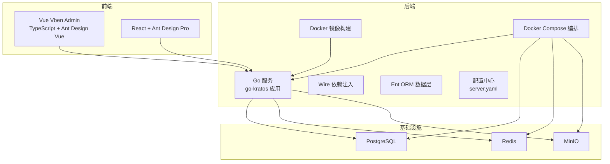
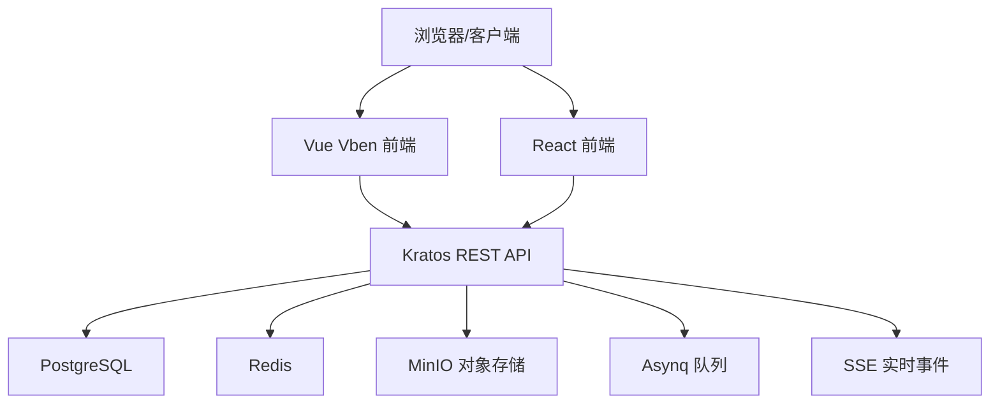
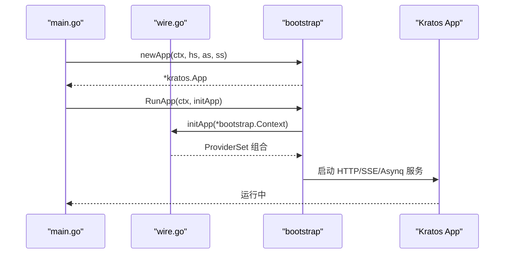
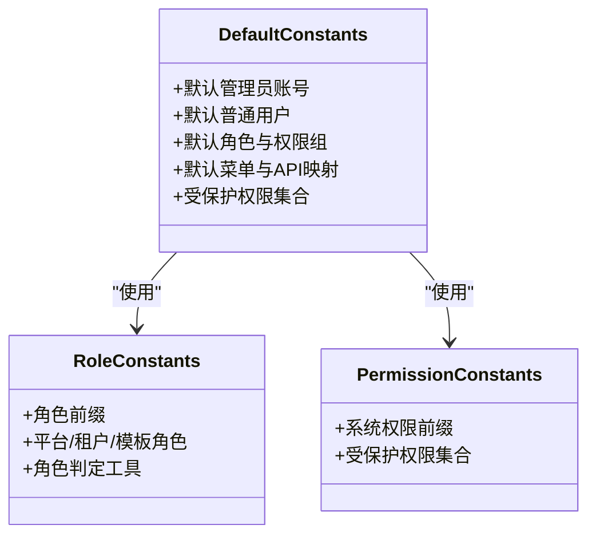
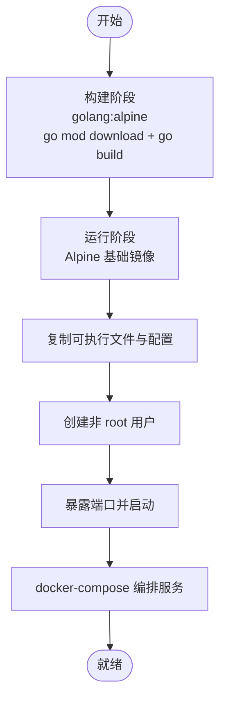
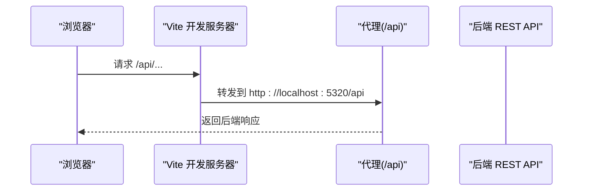
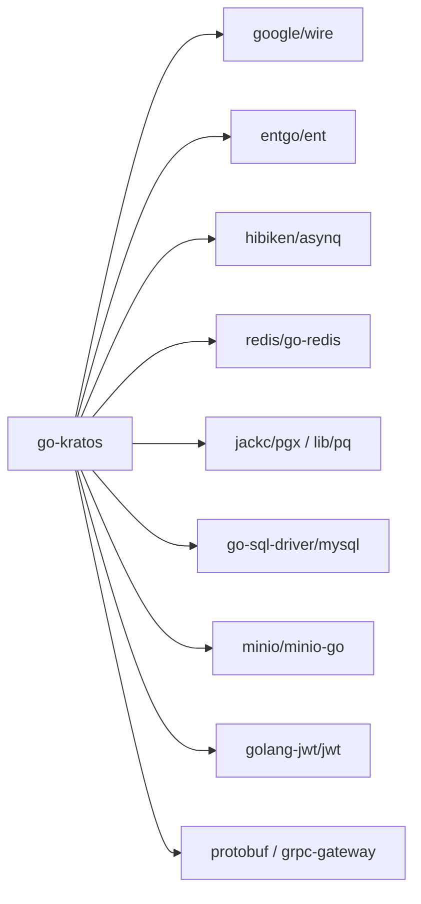

# 项目概述

<cite>
**本文档引用的文件**
- [README.md](file://README.md)
- [main.go](file://backend/app/admin/service/cmd/server/main.go)
- [wire.go](file://backend/app/admin/service/cmd/server/wire.go)
- [server.yaml](file://backend/app/admin/service/configs/server.yaml)
- [Dockerfile](file://backend/Dockerfile)
- [docker-compose.yaml](file://backend/docker-compose.yaml)
- [go.mod](file://backend/go.mod)
- [system_viewer.go](file://backend/pkg/entgo/viewer/system_viewer.go)
- [role.go](file://backend/pkg/constants/role.go)
- [permission.go](file://backend/pkg/constants/permission.go)
- [default_data.go](file://backend/pkg/constants/default_data.go)
- [package.json (Vue Vben)](file://frontend/admin/vue-vben/apps/admin/package.json)
- [vite.config.mts (Vue Vben)](file://frontend/admin/vue-vben/apps/admin/vite.config.mts)
- [package.json (React)](file://frontend/admin/react/package.json)
- [vite.config.ts (React)](file://frontend/admin/react/vite.config.ts)
</cite>

## 目录
1. [引言](#引言)
2. [项目结构](#项目结构)
3. [核心组件](#核心组件)
4. [架构总览](#架构总览)
5. [详细组件分析](#详细组件分析)
6. [依赖分析](#依赖分析)
7. [性能考虑](#性能考虑)
8. [故障排除指南](#故障排除指南)
9. [结论](#结论)
10. [附录](#附录)

## 引言
GoWind Admin 是一款“开箱即用的企业级前后端一体中后台脚手架”。它以高效、稳定、可扩展为目标，采用后端 go-kratos 微服务框架与前端 Vue3/React 双栈方案，既支持微服务扩展，也支持单体部署，兼顾灵活性与易用性。项目提供上手简易、功能完备的特点，覆盖用户管理、租户管理、角色权限、组织架构、菜单权限、审计日志、任务调度、文件存储、消息体系等企业级管理场景，帮助团队快速落地各类中后台系统。

- 演示地址
  - 前端演示：https://demo.admin.gowind.cloud
  - 后端 Swagger 文档：https://api.demo.admin.gowind.cloud/docs/
  - 默认账号密码：admin / admin

- 快速开始
  - 后端一键安装依赖与服务：参考根目录 README 的后端准备与 Docker Compose 安装步骤
  - 前端安装 Node.js、pnpm，进入 frontend 目录执行安装与开发启动
  - 访问 http://localhost:5666 登录，账号 admin，密码 admin；后端 OpenAPI 文档地址 http://localhost:7788/docs/openapi.yaml

**章节来源**
- [README.md:15-91](file://README.md#L15-L91)

## 项目结构
项目采用前后端分离的多模块组织方式：
- 后端 backend：基于 go-kratos 的微服务应用，集成 wire 依赖注入、ent ORM、Redis、PostgreSQL、MinIO 等基础设施，通过 Docker 与 docker-compose 提供一键部署
- 前端 frontend：提供 Vue3 + TypeScript + Ant Design Vue + Vben Admin 的 Vue Vben 版本，以及 React + Ant Design Pro 的 React 版本
- 文档 docs：包含后端开发与部署、前端开发环境准备、权限与查询规则等文档

**图表来源**
- [main.go:1-76](file://backend/app/admin/service/cmd/server/main.go#L1-L76)
- [wire.go:1-47](file://backend/app/admin/service/cmd/server/wire.go#L1-L47)
- [server.yaml:1-49](file://backend/app/admin/service/configs/server.yaml#L1-L49)
- [Dockerfile:1-66](file://backend/Dockerfile#L1-L66)
- [docker-compose.yaml:1-125](file://backend/docker-compose.yaml#L1-L125)
- [package.json (Vue Vben):1-78](file://frontend/admin/vue-vben/apps/admin/package.json#L1-L78)
- [package.json (React):1-82](file://frontend/admin/react/package.json#L1-L82)

**章节来源**
- [README.md:23-91](file://README.md#L23-L91)
- [docker-compose.yaml:1-125](file://backend/docker-compose.yaml#L1-L125)

## 核心组件
- 后端服务入口与引导
  - 服务入口 main.go 负责初始化 Kratos 应用、加载配置、注册 HTTP/SSE/Asynq 传输层，并通过 bootstrap.RunApp 启动
  - wire.go 使用 Google Wire 生成依赖注入图，整合 server、service、data ProviderSet，简化应用装配
  - server.yaml 定义 REST 地址、Swagger 开启、CORS、中间件开关、Asynq 队列、SSE 事件通道等运行期配置
- 基础设施与容器化
  - Dockerfile 分两阶段构建：构建阶段下载依赖并编译二进制，运行阶段使用 Alpine 镜像，非 root 用户运行，暴露服务端口并以配置目录启动
  - docker-compose.yaml 编排 PostgreSQL、Redis、MinIO 与 admin-service，便于本地开发与演示
- 前端工程
  - Vue Vben：基于 Vite + TypeScript + Ant Design Vue，配置代理到后端 API，支持多主题与国际化
  - React：基于 Vite + React 19 + Ant Design Pro，提供路由、状态、国际化与 Mock 能力

**章节来源**
- [main.go:1-76](file://backend/app/admin/service/cmd/server/main.go#L1-L76)
- [wire.go:1-47](file://backend/app/admin/service/cmd/server/wire.go#L1-L47)
- [server.yaml:1-49](file://backend/app/admin/service/configs/server.yaml#L1-L49)
- [Dockerfile:1-66](file://backend/Dockerfile#L1-L66)
- [docker-compose.yaml:1-125](file://backend/docker-compose.yaml#L1-L125)
- [package.json (Vue Vben):1-78](file://frontend/admin/vue-vben/apps/admin/package.json#L1-L78)
- [vite.config.mts (Vue Vben):1-21](file://frontend/admin/vue-vben/apps/admin/vite.config.mts#L1-L21)
- [package.json (React):1-82](file://frontend/admin/react/package.json#L1-L82)
- [vite.config.ts (React):1-47](file://frontend/admin/react/vite.config.ts#L1-L47)

## 架构总览
系统采用“微服务理念 + 单体部署”的双重模式设计：
- 微服务理念：后端基于 go-kratos，模块化清晰，支持独立扩展与演进
- 单体部署：通过 Docker 与 docker-compose 将服务、数据库、缓存、对象存储打包，一键启动，降低运维复杂度
- 前后端一体化：前端 Vue Vben 与 React 均通过代理直连后端 REST API，开发体验一致

**图表来源**
- [server.yaml:1-49](file://backend/app/admin/service/configs/server.yaml#L1-L49)
- [docker-compose.yaml:1-125](file://backend/docker-compose.yaml#L1-L125)

**章节来源**
- [README.md:7-11](file://README.md#L7-L11)
- [server.yaml:1-49](file://backend/app/admin/service/configs/server.yaml#L1-L49)
- [docker-compose.yaml:1-125](file://backend/docker-compose.yaml#L1-L125)

## 详细组件分析

### 后端应用启动流程
后端通过 main.go 与 wire 生成的依赖注入图完成应用装配与启动，关键流程如下：

**图表来源**
- [main.go:46-76](file://backend/app/admin/service/cmd/server/main.go#L46-L76)
- [wire.go:27-46](file://backend/app/admin/service/cmd/server/wire.go#L27-L46)

**章节来源**
- [main.go:1-76](file://backend/app/admin/service/cmd/server/main.go#L1-L76)
- [wire.go:1-47](file://backend/app/admin/service/cmd/server/wire.go#L1-L47)

### 数据与权限模型
系统内置默认数据与权限常量，确保首次启动即可获得完整的后台管理能力：
- 默认管理员与普通用户、默认角色与权限组、菜单与 API 权限映射
- 角色与权限前缀规范，区分平台、租户与模板角色
- 系统受保护权限集合，防止误删

**图表来源**
- [default_data.go:16-275](file://backend/pkg/constants/default_data.go#L16-L275)
- [role.go:1-49](file://backend/pkg/constants/role.go#L1-L49)
- [permission.go:1-39](file://backend/pkg/constants/permission.go#L1-L39)

**章节来源**
- [default_data.go:16-275](file://backend/pkg/constants/default_data.go#L16-L275)
- [role.go:1-49](file://backend/pkg/constants/role.go#L1-L49)
- [permission.go:1-39](file://backend/pkg/constants/permission.go#L1-L39)

### 容器化与部署
- Dockerfile 采用多阶段构建，先在 Alpine 上编译二进制，再以最小化运行时镜像交付，非 root 用户运行，暴露服务端口并挂载配置目录
- docker-compose.yaml 编排 PostgreSQL、Redis、MinIO 与 admin-service，设置环境变量与端口映射，便于本地开发与演示

**图表来源**
- [Dockerfile:1-66](file://backend/Dockerfile#L1-L66)
- [docker-compose.yaml:104-125](file://backend/docker-compose.yaml#L104-L125)

**章节来源**
- [Dockerfile:1-66](file://backend/Dockerfile#L1-L66)
- [docker-compose.yaml:1-125](file://backend/docker-compose.yaml#L1-L125)

### 前端工程与代理
- Vue Vben：通过 vite.config.mts 配置代理，将 /api 前缀转发至后端，支持 WebSocket 与 Mock
- React：通过 vite.config.ts 配置代理与构建选项，支持 Less、HMR、插件生态

**图表来源**
- [vite.config.mts (Vue Vben):3-20](file://frontend/admin/vue-vben/apps/admin/vite.config.mts#L3-L20)
- [vite.config.ts (React):1-47](file://frontend/admin/react/vite.config.ts#L1-L47)

**章节来源**
- [vite.config.mts (Vue Vben):1-21](file://frontend/admin/vue-vben/apps/admin/vite.config.mts#L1-L21)
- [vite.config.ts (React):1-47](file://frontend/admin/react/vite.config.ts#L1-L47)

## 依赖分析
后端技术栈与外部依赖：
- 运行时与框架：go-kratos v2、wire、ent、hibiken/asynq、OpenTelemetry
- 数据库与驱动：pgx、mysql、lib/pq、gorm
- 缓存与对象存储：redis/go-redis、minio/minio-go
- 中间件与工具：jwt、geoip、yml、protobuf、grpc-gateway
- 配置与日志：kratos-bootstrap、tracer、logger

**图表来源**
- [go.mod:5-65](file://backend/go.mod#L5-L65)

**章节来源**
- [go.mod:1-290](file://backend/go.mod#L1-L290)

## 性能考虑
- 单体部署降低网络跳数与运维成本，适合中小团队与原型阶段
- Asynq 队列与 SSE 事件通道支持异步任务与实时推送
- Docker 多阶段构建减小镜像体积，非 root 运行提升安全性
- 前端代理直连后端，减少中间层开销，开发体验更佳

[本节为通用建议，无需特定文件来源]

## 故障排除指南
- 后端 Swagger 不可用
  - 检查 server.yaml 中 enable_swagger 是否开启
  - 确认 CORS 配置允许前端来源
- 前端无法访问后端 API
  - 检查 vite.config 代理配置与后端端口
  - 确认跨域头与方法配置
- 容器启动失败
  - 检查 docker-compose 依赖服务（PostgreSQL、Redis、MinIO）是否就绪
  - 查看容器日志与端口占用情况

**章节来源**
- [server.yaml:1-49](file://backend/app/admin/service/configs/server.yaml#L1-L49)
- [vite.config.mts (Vue Vben):3-20](file://frontend/admin/vue-vben/apps/admin/vite.config.mts#L3-L20)
- [vite.config.ts (React):1-47](file://frontend/admin/react/vite.config.ts#L1-L47)
- [docker-compose.yaml:1-125](file://backend/docker-compose.yaml#L1-L125)

## 结论
GoWind Admin 以“微服务理念 + 单体部署”为核心设计，结合 go-kratos 与 wire 的现代化后端架构，以及 Vue Vben 与 React 的企业级前端方案，实现了“开箱即用”的中后台脚手架目标。其默认数据与权限体系、容器化部署与代理配置，显著降低了上手成本与运维复杂度，适用于多种规模团队与场景。

[本节为总结，无需特定文件来源]

## 附录
- 快速开始
  - 后端一键安装与 Docker Compose 启动
  - 前端安装 Node.js、pnpm，执行安装与 dev 启动
  - 访问 http://localhost:5666 登录，账号 admin，密码 admin
- 演示与默认凭据
  - 前端演示：https://demo.admin.gowind.cloud
  - 后端 Swagger：https://api.demo.admin.gowind.cloud/docs/
  - 默认账号：admin / admin

**章节来源**
- [README.md:15-91](file://README.md#L15-L91)